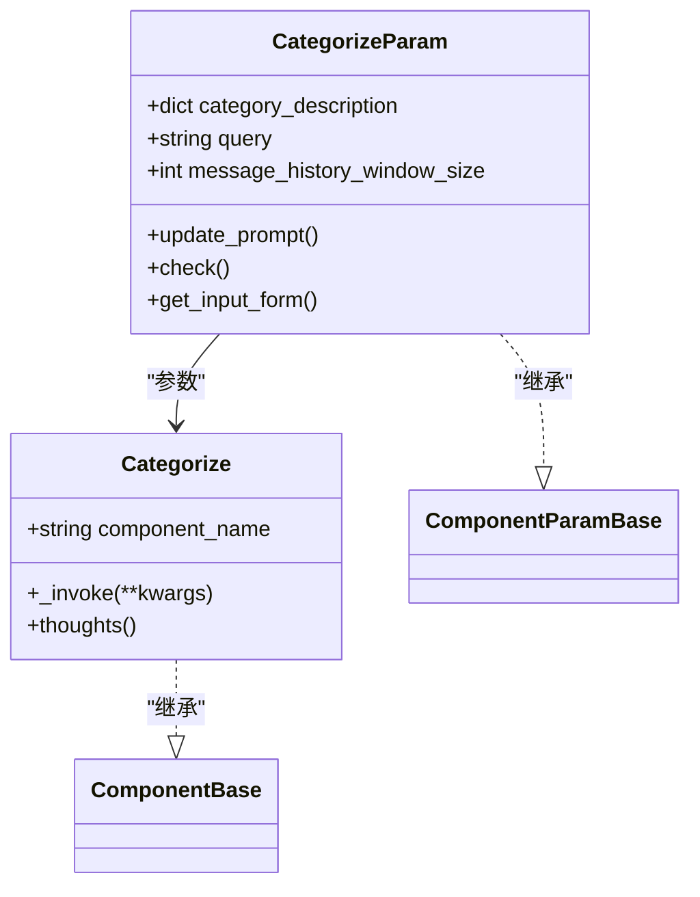
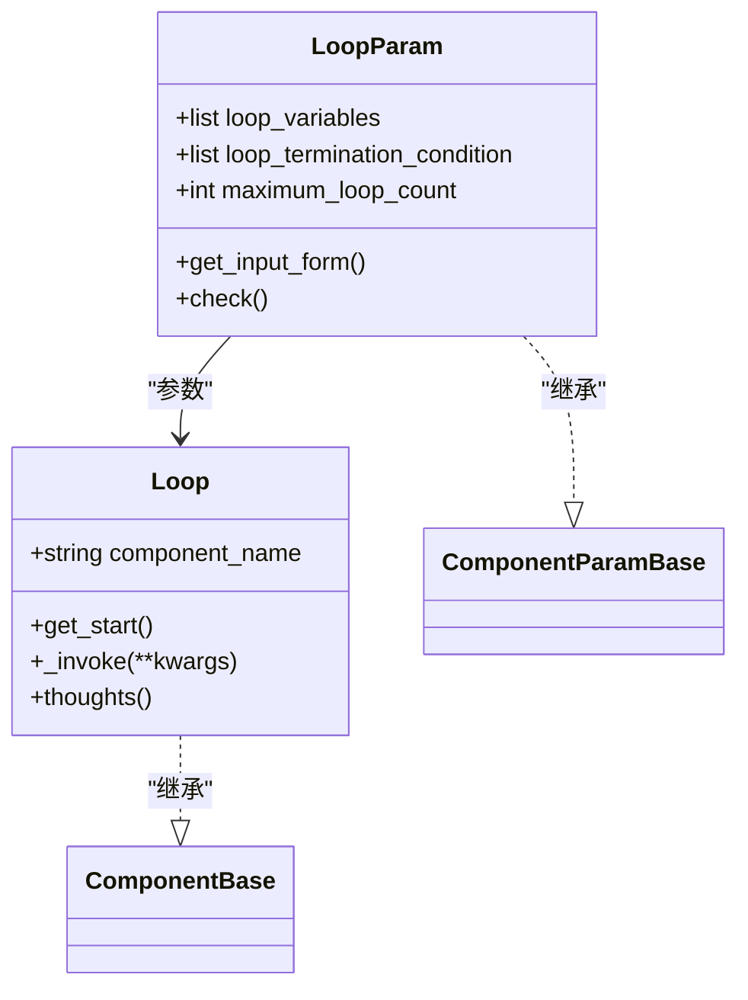
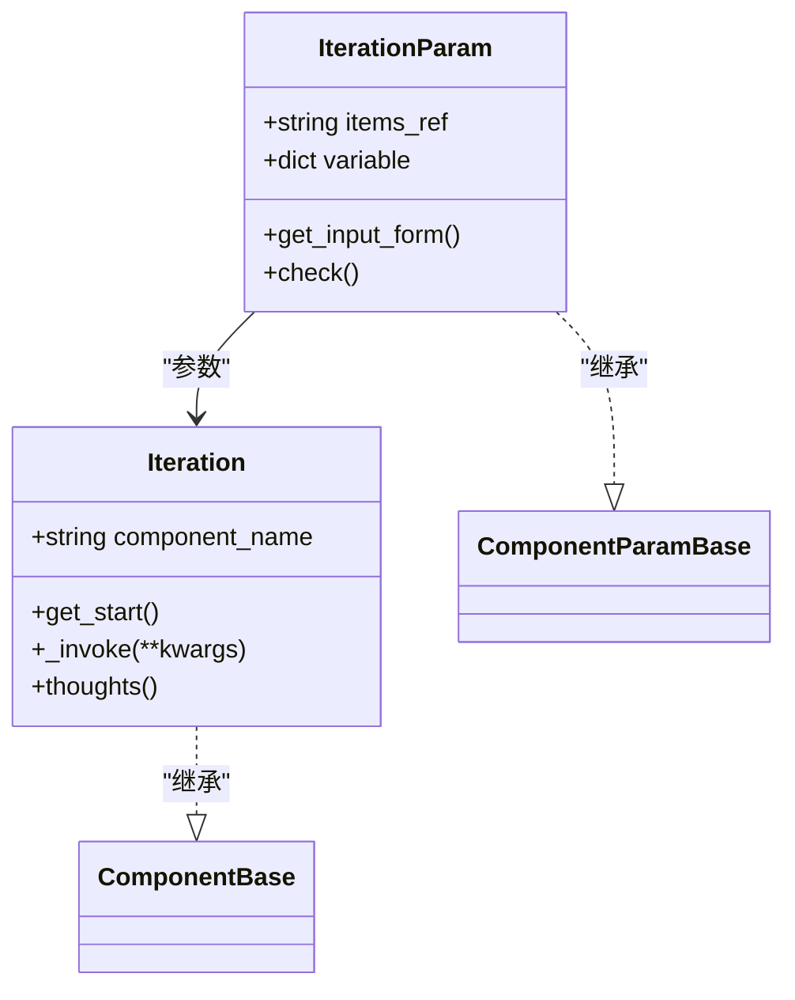
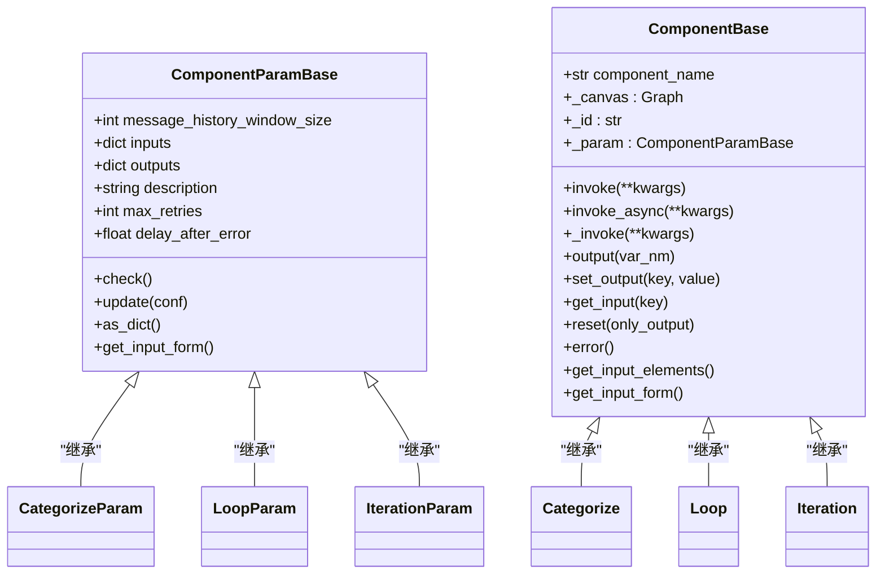
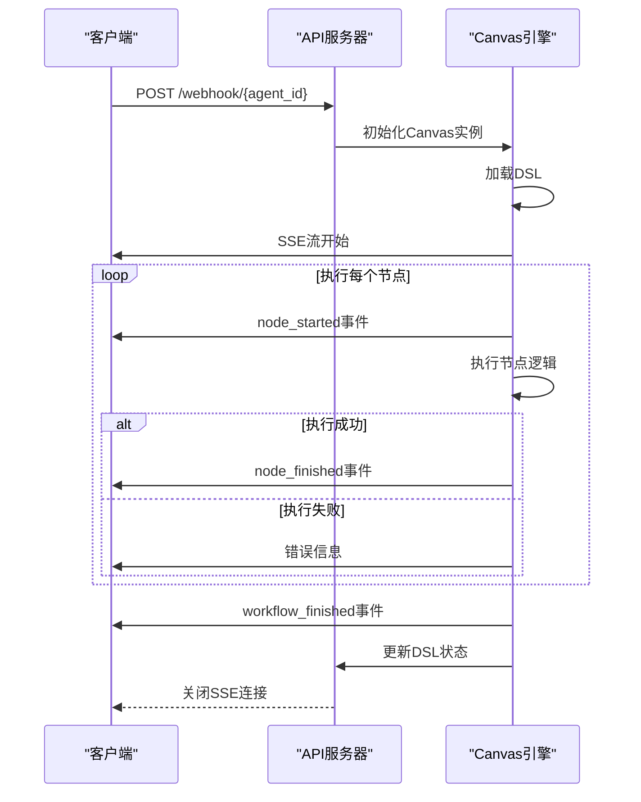
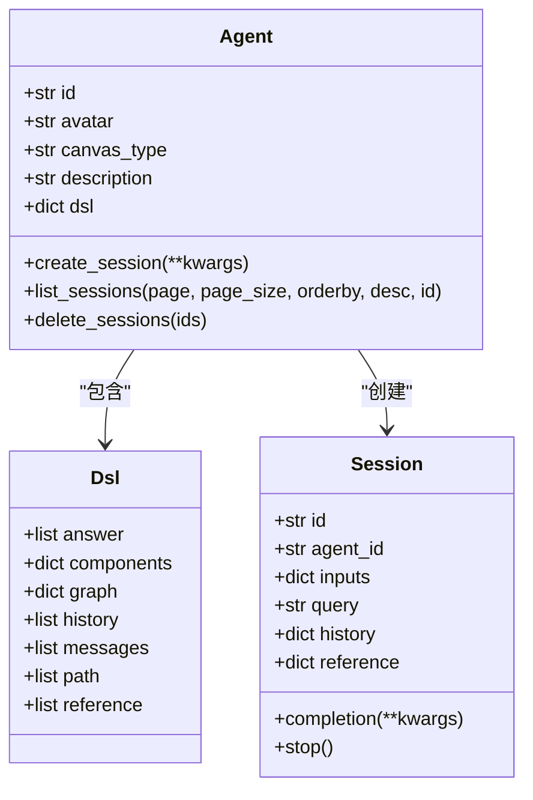

# Agent工作流API

<cite>
**本文档引用的文件**
- [agents.py](file://api/apps/sdk/agents.py)
- [canvas.py](file://agent/canvas.py)
- [base.py](file://agent/component/base.py)
- [categorize.py](file://agent/component/categorize.py)
- [loop.py](file://agent/component/loop.py)
- [iteration.py](file://agent/component/iteration.py)
- [agent.py](file://sdk/python/ragflow_sdk/modules/agent.py)
- [choose_your_knowledge_base_agent.json](file://agent/templates/choose_your_knowledge_base_agent.json)
</cite>

## 目录
1. [简介](#简介)
2. [Agent工作流DSL](#agent工作流dsl)
3. [核心组件](#核心组件)
4. [Agent管理API](#agent管理api)
5. [执行与监控](#执行与监控)
6. [SDK集成](#sdk集成)
7. [版本管理](#版本管理)
8. [最佳实践](#最佳实践)

## 简介
Agent工作流API提供了一套完整的系统，用于创建、配置、执行和管理复杂的自动化智能体工作流。该API基于DSL（领域特定语言）定义工作流，支持通过编程方式构建和管理从简单问答到复杂决策的自动化流程。用户可以通过API端点定义工作流的节点（如分类、检索、循环等）并建立它们之间的连接，然后通过API触发执行、监控日志并获取结果。

**Section sources**
- [agents.py](file://api/apps/sdk/agents.py#L33-L180)

## Agent工作流DSL
Agent工作流的核心是其DSL（领域特定语言），它以JSON格式定义了工作流的结构、组件和连接关系。DSL描述了工作流中所有组件的配置、输入输出、连接关系以及全局变量。

一个典型的DSL结构如下：
```json
{
  "components": {
    "begin": {
      "obj": {
        "component_name": "Begin",
        "params": {}
      },
      "downstream": ["retrieval_0"],
      "upstream": []
    },
    "retrieval_0": {
      "obj": {
        "component_name": "Retrieval",
        "params": {}
      },
      "downstream": ["generate_0"],
      "upstream": ["begin"]
    },
    "generate_0": {
      "obj": {
        "component_name": "Generate",
        "params": {}
      },
      "downstream": [],
      "upstream": ["retrieval_0"]
    }
  },
  "globals": {
    "sys.query": "",
    "sys.user_id": "",
    "sys.conversation_turns": 0,
    "sys.files": []
  },
  "history": [],
  "path": ["begin"],
  "retrieval": []
}
```

DSL的关键部分包括：
- **components**: 定义工作流中的所有组件，每个组件包含其名称、参数、上下游连接。
- **globals**: 全局变量，如用户查询、用户ID等系统变量。
- **path**: 当前执行路径，记录了组件的执行顺序。
- **history**: 对话历史记录。

**Section sources**
- [canvas.py](file://agent/canvas.py#L40-L78)

## 核心组件
Agent工作流由多种核心组件构成，每个组件负责特定的功能。这些组件通过DSL中的连接关系形成一个完整的处理流程。

### 分类组件 (Categorize)
分类组件用于将用户输入的查询分类到预定义的类别中。它使用LLM模型分析输入并将其分类。



**Diagram sources**
- [categorize.py](file://agent/component/categorize.py#L28-L149)

### 循环组件 (Loop)
循环组件用于在工作流中创建循环结构，可以对数组或列表中的每个项目进行迭代处理。



**Diagram sources**
- [loop.py](file://agent/component/loop.py#L20-L80)

### 迭代组件 (Iteration)
迭代组件用于处理数组数据，对数组中的每个元素执行相同的操作序列。



**Diagram sources**
- [iteration.py](file://agent/component/iteration.py#L27-L72)

### 基础组件类
所有组件都继承自`ComponentBase`和`ComponentParamBase`，这两个基类提供了组件的基本功能和参数验证机制。



**Diagram sources**
- [base.py](file://agent/component/base.py#L37-L611)

## Agent管理API
Agent管理API提供了一组RESTful端点，用于创建、读取、更新和删除Agent。

### 创建Agent
使用POST方法创建新的Agent。

**端点**: `POST /api/v1/agents`

**请求参数**:
- `title` (string, 必需): Agent的标题
- `description` (string, 可选): Agent的描述
- `dsl` (object, 必需): Agent的DSL定义

**示例请求**:
```bash
curl --request POST \
     --url http://{address}/api/v1/agents \
     --header 'Content-Type: application/json' \
     --header 'Authorization: Bearer <YOUR_API_KEY>' \
     --data '{
         "title": "Test Agent",
         "description": "A test agent",
         "dsl": {
           // ... Canvas DSL here ...
         }
     }'
```

**Section sources**
- [agents.py](file://api/apps/sdk/agents.py#L53-L87)

### 获取Agent列表
使用GET方法获取Agent列表。

**端点**: `GET /api/v1/agents`

**查询参数**:
- `page` (int): 页码
- `page_size` (int): 每页大小
- `orderby` (string): 排序字段
- `desc` (bool): 是否降序
- `title` (string): Agent标题
- `id` (string): Agent ID

**Section sources**
- [agents.py](file://api/apps/sdk/agents.py#L33-L51)

### 更新Agent
使用PUT方法更新现有Agent。

**端点**: `PUT /api/v1/agents/{agent_id}`

**路径参数**:
- `agent_id` (string): 要更新的Agent ID

**请求参数**:
- `title` (string): Agent的标题
- `description` (string): Agent的描述
- `dsl` (object): Agent的DSL定义

**Section sources**
- [agents.py](file://api/apps/sdk/agents.py#L90-L121)

### 删除Agent
使用DELETE方法删除Agent。

**端点**: `DELETE /api/v1/agents/{agent_id}`

**路径参数**:
- `agent_id` (string): 要删除的Agent ID

**Section sources**
- [agents.py](file://api/apps/sdk/agents.py#L124-L133)

## 执行与监控
Agent工作流的执行是通过API触发的，系统会返回一个SSE（Server-Sent Events）流，实时推送执行过程中的日志和结果。

### 执行Agent
通过Webhook端点触发Agent执行。

**端点**: `POST /api/v1/webhook/{agent_id}`

**请求参数**:
- `id` (string): Agent ID
- `query` (string): 用户查询
- `files` (array): 附加文件
- `user_id` (string): 用户ID
- `webhook_payload` (object): Webhook负载

**响应**: SSE流，包含以下事件类型：
- `workflow_started`: 工作流开始
- `node_started`: 节点开始执行
- `node_finished`: 节点执行完成
- `message`: 中间消息
- `message_end`: 消息结束
- `workflow_finished`: 工作流完成



**Diagram sources**
- [agents.py](file://api/apps/sdk/agents.py#L136-L179)
- [canvas.py](file://agent/canvas.py#L360-L641)

### 监控执行日志
执行过程中的日志通过SSE流实时推送，包括节点的输入、输出、执行时间和错误信息。

**日志事件结构**:
```json
{
  "event": "node_finished",
  "message_id": "uuid",
  "created_at": 1234567890,
  "task_id": "uuid",
  "data": {
    "inputs": {},
    "outputs": {},
    "component_id": "component_id",
    "component_name": "Component Name",
    "component_type": "component_type",
    "error": "error_message",
    "elapsed_time": 0.123,
    "created_at": 1234567890
  }
}
```

**Section sources**
- [canvas.py](file://agent/canvas.py#L385-L463)

## SDK集成
RAGFlow提供了Python SDK，可以更方便地通过编程方式管理Agent。

### 创建Agent会话
使用SDK创建Agent会话。

```python
from ragflow_sdk import RAGFlow

# 初始化RAGFlow客户端
ragflow = RAGFlow(api_key="your_api_key", base_url="http://your_server_address")

# 获取Agent实例
agent = ragflow.get_agent("agent_id")

# 创建会话
session = agent.create_session(
    inputs={"knowledge base": "knowledge base 1"},
    query="What is the capital of France?"
)
```



**Diagram sources**
- [agent.py](file://sdk/python/ragflow_sdk/modules/agent.py#L21-L94)

### 执行Agent
通过会话执行Agent并获取结果。

```python
# 执行Agent
for event in session.completion():
    if event["event"] == "message":
        print(f"消息: {event['data']['content']}")
    elif event["event"] == "workflow_finished":
        print(f"最终结果: {event['data']['outputs']}")
        break
```

**Section sources**
- [agent.py](file://sdk/python/ragflow_sdk/modules/agent.py#L69-L74)

## 版本管理
系统自动管理Agent的版本，每次更新DSL时都会创建一个新的版本快照。

### 版本创建
当更新Agent的DSL时，系统会自动创建一个新版本。

```python
# 更新Agent
agent.update(
    title="Updated Agent",
    dsl=new_dsl
)
# 系统自动创建新版本
```

### 版本历史
可以通过API获取Agent的版本历史。

**端点**: `GET /api/v1/agents/{agent_id}/versions`

**响应**:
```json
{
  "code": 0,
  "data": [
    {
      "id": "version_id_1",
      "title": "Agent_Title_2024_01_01_12_00_00",
      "create_time": 1733397056801,
      "dsl": { /* DSL快照 */ }
    },
    {
      "id": "version_id_2",
      "title": "Agent_Title_2024_01_01_11_00_00",
      "create_time": 1733396456801,
      "dsl": { /* DSL快照 */ }
    }
  ]
}
```

**Section sources**
- [agents.py](file://api/apps/sdk/agents.py#L81-L85)
- [agents.py](file://api/apps/sdk/agents.py#L113-L117)

## 最佳实践
### 工作流设计
- 使用`Begin`组件作为工作流的起点
- 合理使用`Categorize`组件进行查询分类
- 使用`Loop`和`Iteration`组件处理重复性任务
- 通过`Message`组件输出结果

### 性能优化
- 设置合理的`message_history_window_size`以控制上下文长度
- 配置适当的`max_retries`和`delay_after_error`处理失败情况
- 使用`exception_handler`处理异常情况

### 错误处理
- 为关键组件配置`exception_method`和`exception_default_value`
- 使用`exception_goto`指定错误发生时的跳转路径
- 监控SSE流中的错误事件并进行相应处理

**Section sources**
- [choose_your_knowledge_base_agent.json](file://agent/templates/choose_your_knowledge_base_agent.json#L1-L422)