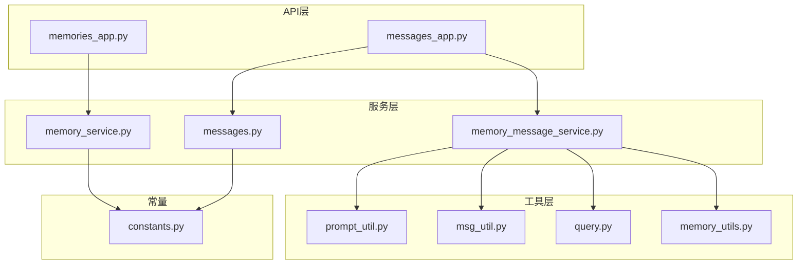
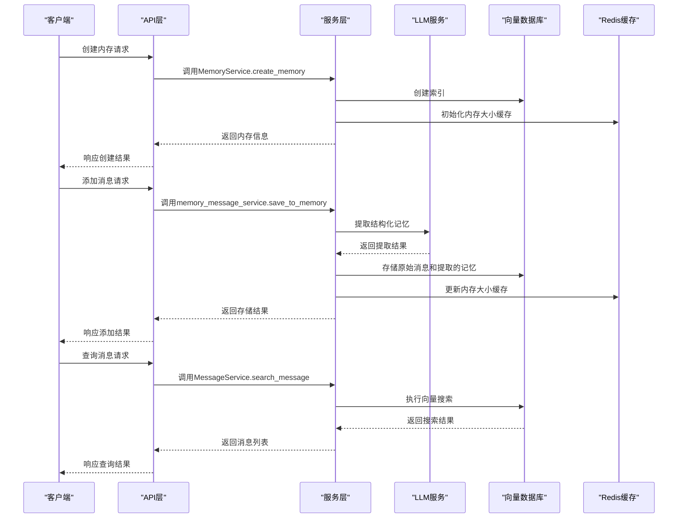
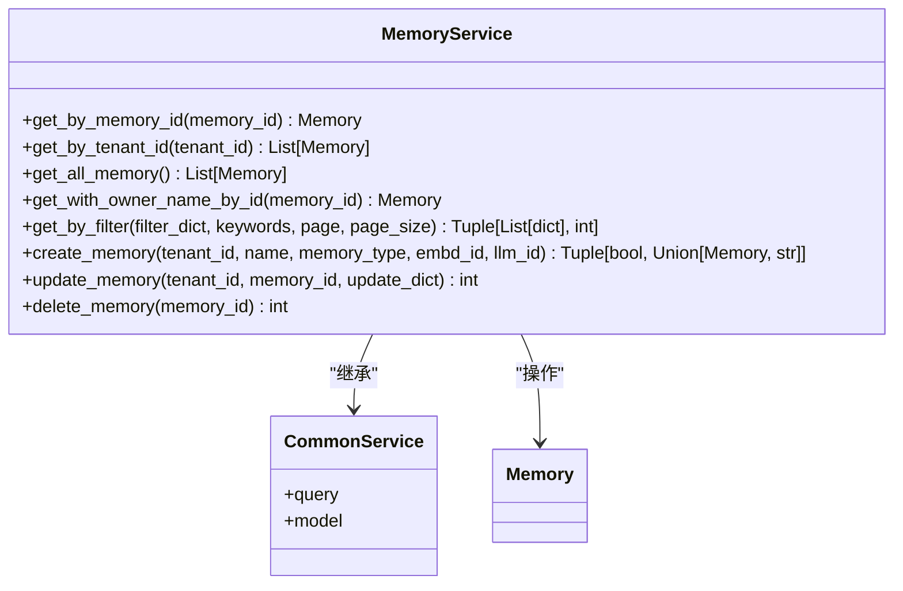
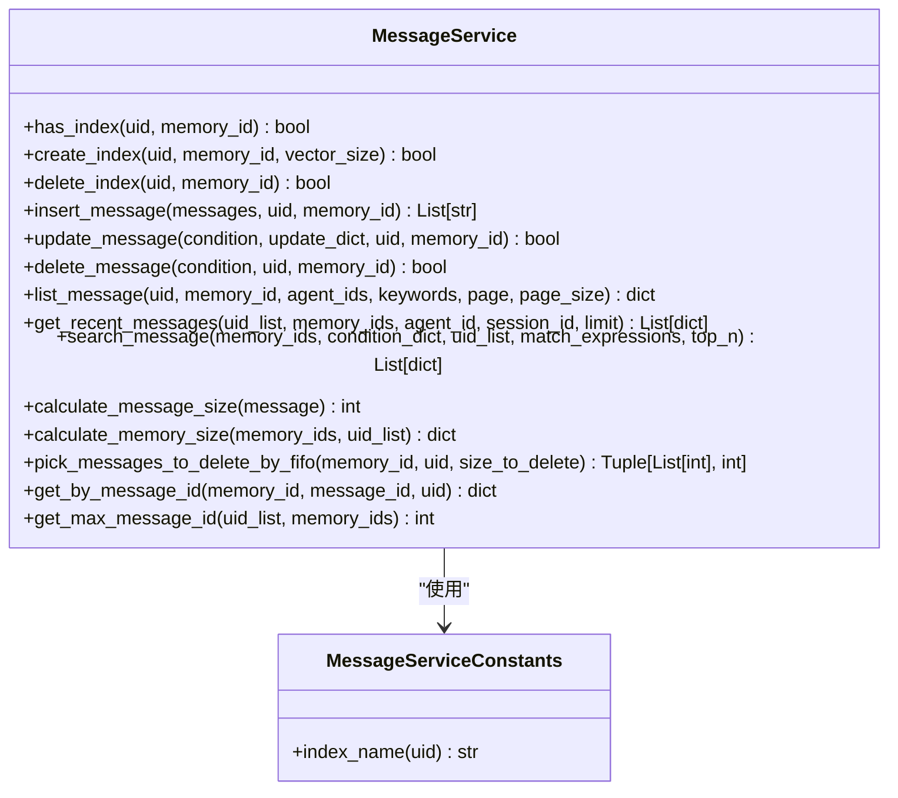
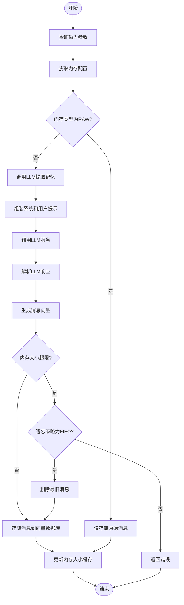
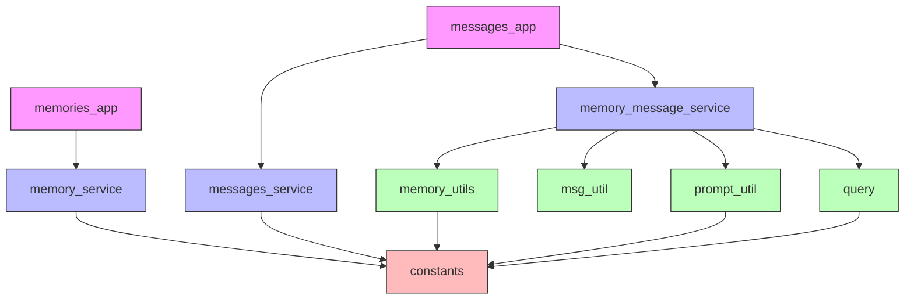

# 内存消息API

<cite>
**本文档引用的文件**   
- [memories_app.py](file://api/apps/memories_app.py)
- [messages_app.py](file://api/apps/messages_app.py)
- [memory_service.py](file://api/db/services/memory_service.py)
- [messages.py](file://memory/services/messages.py)
- [memory_message_service.py](file://api/db/joint_services/memory_message_service.py)
- [prompt_util.py](file://memory/utils/prompt_util.py)
- [msg_util.py](file://memory/utils/msg_util.py)
- [query.py](file://memory/services/query.py)
- [memory_utils.py](file://api/utils/memory_utils.py)
- [constants.py](file://common/constants.py)
</cite>

## 目录
1. [简介](#简介)
2. [项目结构](#项目结构)
3. [核心组件](#核心组件)
4. [架构概述](#架构概述)
5. [详细组件分析](#详细组件分析)
6. [依赖分析](#依赖分析)
7. [性能考虑](#性能考虑)
8. [故障排除指南](#故障排除指南)
9. [结论](#结论)

## 简介
内存消息API是RAGFlow系统中的关键组件，负责管理用户与AI代理之间的对话记忆。该API提供了一套完整的内存管理功能，包括创建、更新、删除内存，以及对内存中的消息进行增删改查操作。系统支持多种内存类型，包括原始记忆、语义记忆、情景记忆和程序性记忆，能够智能地从对话中提取结构化知识。

内存系统通过向量数据库存储消息内容，并结合LLM进行智能记忆提取和分类。当用户与代理交互时，系统会自动将对话内容保存到指定的内存中，并根据配置的内存类型使用LLM提取关键信息。内存大小受到限制，系统实现了FIFO（先进先出）的遗忘策略来管理内存容量。

## 项目结构
内存消息API主要分布在项目的`api/apps`和`memory`目录下。`api/apps`目录包含API路由和控制器逻辑，而`memory`目录包含底层服务和工具函数。

**Diagram sources**
- [memories_app.py](file://api/apps/memories_app.py)
- [messages_app.py](file://api/apps/messages_app.py)
- [memory_service.py](file://api/db/services/memory_service.py)
- [messages.py](file://memory/services/messages.py)
- [memory_message_service.py](file://api/db/joint_services/memory_message_service.py)
- [prompt_util.py](file://memory/utils/prompt_util.py)
- [msg_util.py](file://memory/utils/msg_util.py)
- [query.py](file://memory/services/query.py)
- [memory_utils.py](file://api/utils/memory_utils.py)
- [constants.py](file://common/constants.py)

**Section sources**
- [memories_app.py](file://api/apps/memories_app.py)
- [messages_app.py](file://api/apps/messages_app.py)

## 核心组件

内存消息API的核心组件包括内存管理服务、消息存储服务和记忆提取服务。内存管理服务负责内存的生命周期管理，包括创建、更新和删除操作。消息存储服务基于向量数据库实现，支持高效的消息检索和存储。记忆提取服务利用LLM从原始对话中提取结构化记忆，支持语义记忆、情景记忆和程序性记忆等多种类型。

系统通过Redis缓存内存大小信息，提高性能并避免频繁的数据库查询。消息ID通过Redis的自增机制生成，确保全局唯一性。系统还实现了任务队列机制，将耗时的记忆提取操作异步化处理，提高API响应速度。

**Section sources**
- [memory_service.py](file://api/db/services/memory_service.py)
- [messages.py](file://memory/services/messages.py)
- [memory_message_service.py](file://api/db/joint_services/memory_message_service.py)

## 架构概述

**Diagram sources**
- [memories_app.py](file://api/apps/memories_app.py)
- [messages_app.py](file://api/apps/messages_app.py)
- [memory_service.py](file://api/db/services/memory_service.py)
- [messages.py](file://memory/services/messages.py)
- [memory_message_service.py](file://api/db/joint_services/memory_message_service.py)

## 详细组件分析

### 内存管理分析
内存管理组件负责内存的全生命周期管理，包括创建、更新、删除和查询操作。系统通过`MemoryService`类实现这些功能，该类继承自`CommonService`，提供了标准的CRUD操作。

**Diagram sources**
- [memory_service.py](file://api/db/services/memory_service.py)

**Section sources**
- [memory_service.py](file://api/db/services/memory_service.py)

### 消息存储分析
消息存储组件负责消息的持久化存储和检索，基于向量数据库实现。`MessageService`类提供了消息的增删改查操作，支持按条件查询、向量搜索和全文搜索。

**Diagram sources**
- [messages.py](file://memory/services/messages.py)

**Section sources**
- [messages.py](file://memory/services/messages.py)

### 记忆提取分析
记忆提取组件是系统的核心智能部分，负责从原始对话中提取结构化记忆。该组件通过`memory_message_service`模块实现，利用LLM对对话内容进行分析和提取。

**Diagram sources**
- [memory_message_service.py](file://api/db/joint_services/memory_message_service.py)
- [prompt_util.py](file://memory/utils/prompt_util.py)
- [msg_util.py](file://memory/utils/msg_util.py)

**Section sources**
- [memory_message_service.py](file://api/db/joint_services/memory_message_service.py)

## 依赖分析

**Diagram sources**
- [memories_app.py](file://api/apps/memories_app.py)
- [messages_app.py](file://api/apps/messages_app.py)
- [memory_service.py](file://api/db/services/memory_service.py)
- [messages.py](file://memory/services/messages.py)
- [memory_message_service.py](file://api/db/joint_services/memory_message_service.py)
- [prompt_util.py](file://memory/utils/prompt_util.py)
- [msg_util.py](file://memory/utils/msg_util.py)
- [query.py](file://memory/services/query.py)
- [memory_utils.py](file://api/utils/memory_utils.py)
- [constants.py](file://common/constants.py)

## 性能考虑
内存消息API在设计时充分考虑了性能因素。系统通过Redis缓存内存大小信息，避免了频繁的数据库查询操作。消息ID的生成也通过Redis的自增机制实现，确保了高性能和全局唯一性。

对于耗时的记忆提取操作，系统采用了异步任务队列机制，将LLM调用和记忆提取操作放入后台任务中执行，避免阻塞API响应。向量数据库的索引设计优化了消息检索性能，支持高效的向量搜索和全文搜索。

系统还实现了内存大小限制和FIFO遗忘策略，防止内存无限增长导致性能下降。通过合理的分页查询机制，避免了一次性返回大量数据造成的性能问题。

## 故障排除指南
当遇到内存消息API相关问题时，可以按照以下步骤进行排查：

1. **检查API认证**：确保请求包含有效的Authorization头或API密钥
2. **验证内存ID**：确认操作的内存ID存在且属于当前用户
3. **检查内存大小**：如果添加消息失败，可能是内存已满，需要检查内存大小限制和遗忘策略
4. **查看LLM服务状态**：如果记忆提取失败，检查LLM服务是否正常运行
5. **检查向量数据库连接**：确保向量数据库服务可用且网络连接正常
6. **查看Redis状态**：检查Redis缓存服务是否正常运行

常见的错误代码包括：404（内存不存在）、400（参数错误）、500（服务器内部错误）和403（权限不足）。

**Section sources**
- [memories_app.py](file://api/apps/memories_app.py)
- [messages_app.py](file://api/apps/messages_app.py)
- [memory_service.py](file://api/db/services/memory_service.py)
- [messages.py](file://memory/services/messages.py)

## 结论
内存消息API是RAGFlow系统中一个功能完整、设计合理的组件，提供了强大的内存管理能力。系统通过分层架构实现了关注点分离，API层、服务层和工具层各司其职。智能记忆提取功能利用LLM从对话中提取结构化知识，大大提升了系统的智能水平。

系统的异步处理机制和缓存策略确保了高性能，而完善的错误处理和验证机制保证了系统的稳定性。未来可以考虑增加更多的记忆类型和遗忘策略，以及支持更复杂的查询功能，进一步提升系统的实用性和灵活性。