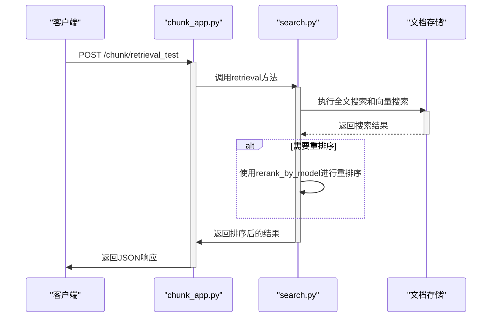
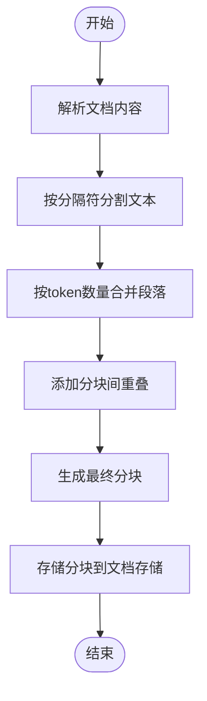
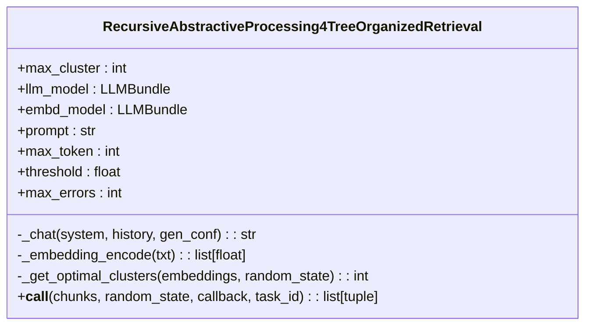
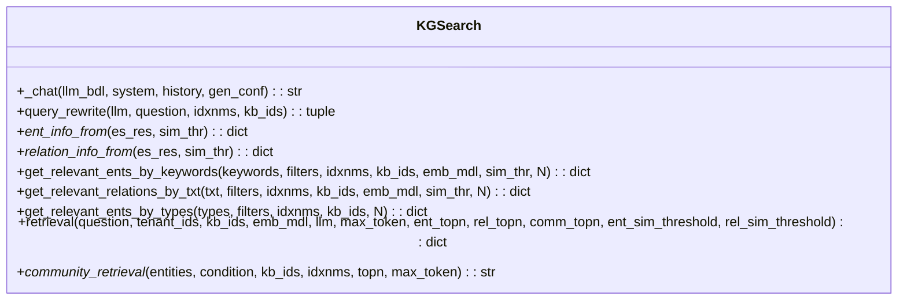

# 分块与检索API

<cite>
**本文档引用的文件**
- [chunk_app.py](file://api/apps/chunk_app.py)
- [search_app.py](file://api/apps/search_app.py)
- [document_service.py](file://api/db/services/document_service.py)
- [search.py](file://rag/nlp/search.py)
- [raptor.py](file://rag/raptor.py)
- [graphrag/search.py](file://graphrag/search.py)
- [kb_app.py](file://api/apps/kb_app.py)
</cite>

## 目录
1. [简介](#简介)
2. [分块管理API](#分块管理api)
3. [检索API](#检索api)
4. [分块生成过程](#分块生成过程)
5. [高级检索功能](#高级检索功能)
6. [API调用示例](#api调用示例)

## 简介
分块与检索API是RAGFlow系统的核心组件，负责对已处理文档的分块内容进行查询、检索和管理。该API提供了丰富的功能，包括基于关键词和元数据的检索、分块的CRUD操作、以及高级检索功能如Raptor和Graph RAG。本文档详细介绍了这些功能的HTTP方法、URL路径、查询参数和返回结构。

## 分块管理API

分块管理API提供了对文档分块的创建、读取、更新和删除（CRUD）操作。这些操作通过`chunk_app.py`文件中的路由实现。

### 列出分块
- **HTTP方法**: POST
- **URL路径**: `/chunk/list`
- **请求参数**:
  - `doc_id` (必需): 文档ID
  - `page` (可选): 页码，默认为1
  - `size` (可选): 每页大小，默认为30
  - `keywords` (可选): 关键词用于高亮显示
- **返回结构**:
  - `total`: 总分块数
  - `chunks`: 分块列表，包含`chunk_id`, `content_with_weight`, `doc_id`, `docnm_kwd`, `important_kwd`, `question_kwd`, `image_id`, `available_int`, `positions`等字段
  - `doc`: 文档信息

**Section sources**
- [chunk_app.py](file://api/apps/chunk_app.py#L42-L88)

### 获取分块
- **HTTP方法**: GET
- **URL路径**: `/chunk/get`
- **请求参数**:
  - `chunk_id` (必需): 分块ID
- **返回结构**: 分块的详细信息，不包括向量字段

**Section sources**
- [chunk_app.py](file://api/apps/chunk_app.py#L91-L120)

### 更新分块
- **HTTP方法**: POST
- **URL路径**: `/chunk/set`
- **请求参数**:
  - `doc_id` (必需): 文档ID
  - `chunk_id` (必需): 分块ID
  - `content_with_weight` (必需): 分块内容
  - `important_kwd` (可选): 重要关键词列表
  - `question_kwd` (可选): 问题关键词列表
  - `tag_kwd` (可选): 标签关键词
  - `tag_feas` (可选): 标签特征
  - `available_int` (可选): 可用性标志
- **返回结构**: 操作成功状态

**Section sources**
- [chunk_app.py](file://api/apps/chunk_app.py#L123-L180)

### 创建分块
- **HTTP方法**: POST
- **URL路径**: `/chunk/create`
- **请求参数**:
  - `doc_id` (必需): 文档ID
  - `content_with_weight` (必需): 分块内容
  - `important_kwd` (可选): 重要关键词列表
  - `question_kwd` (可选): 问题关键词列表
  - `tag_feas` (可选): 标签特征
- **返回结构**: 包含新创建分块ID的对象

**Section sources**
- [chunk_app.py](file://api/apps/chunk_app.py#L234-L292)

### 删除分块
- **HTTP方法**: POST
- **URL路径**: `/chunk/rm`
- **请求参数**:
  - `doc_id` (必需): 文档ID
  - `chunk_ids` (必需): 要删除的分块ID列表
- **返回结构**: 操作成功状态

**Section sources**
- [chunk_app.py](file://api/apps/chunk_app.py#L207-L231)

## 检索API

检索API提供了强大的搜索功能，支持关键词、元数据过滤和相似度阈值等多种检索方式。

### 检索测试
- **HTTP方法**: POST
- **URL路径**: `/chunk/retrieval_test`
- **请求参数**:
  - `kb_id` (必需): 知识库ID
  - `question` (必需): 查询问题
  - `page` (可选): 页码
  - `size` (可选): 每页大小
  - `doc_ids` (可选): 文档ID列表
  - `use_kg` (可选): 是否使用知识图谱
  - `top_k` (可选): 返回结果数量
  - `cross_languages` (可选): 跨语言检索
  - `rerank_id` (可选): 重排序模型ID
  - `keyword` (可选): 是否使用关键词提取
  - `similarity_threshold` (可选): 相似度阈值
  - `vector_similarity_weight` (可选): 向量相似度权重
  - `highlight` (可选): 是否高亮显示
- **返回结构**:
  - `total`: 匹配的分块总数
  - `chunks`: 分块列表，包含`chunk_id`, `content_with_weight`, `doc_id`, `docnm_kwd`, `similarity`, `vector_similarity`, `term_similarity`, `vector`, `positions`等字段
  - `doc_aggs`: 按文档聚合的结果
  - `labels`: 标签信息



**Diagram sources**
- [chunk_app.py](file://api/apps/chunk_app.py#L295-L395)
- [search.py](file://rag/nlp/search.py#L359-L505)

**Section sources**
- [chunk_app.py](file://api/apps/chunk_app.py#L295-L395)

## 分块生成过程

分块的生成过程由系统的文档处理流水线控制，主要涉及分块器（Splitter）和解析器（Parser）组件。

### 分块器配置
分块器的配置通过`splitter.py`文件中的`Splitter`类实现。主要配置参数包括：
- `delimiters`: 分隔符列表，用于文本分割
- `chunk_token_size`: 每个分块的目标token数量
- `overlapped_percent`: 分块之间的重叠百分比

分块过程首先根据指定的分隔符将文档分割成段落，然后根据token数量将段落合并成适当大小的分块。如果启用了重叠，相邻分块之间会共享一部分内容。

### 分块生成流程


**Diagram sources**
- [splitter.py](file://rag/flow/splitter/splitter.py#L47-L107)
- [schema.py](file://rag/flow/splitter/schema.py)

**Section sources**
- [splitter.py](file://rag/flow/splitter/splitter.py#L47-L107)

## 高级检索功能

RAGFlow系统提供了多种高级检索功能，包括Raptor和Graph RAG，这些功能可以显著提高检索结果的质量和相关性。

### Raptor检索
Raptor（Recursive Abstractive Processing for Tree-Organized Retrieval）是一种递归抽象处理方法，通过构建文档的层次化摘要树来提高检索效果。



**Diagram sources**
- [raptor.py](file://rag/raptor.py#L37-L227)

**Section sources**
- [raptor.py](file://rag/raptor.py#L37-L227)

### Graph RAG检索
Graph RAG利用知识图谱进行检索，通过实体和关系的语义连接来发现相关文档。



**Diagram sources**
- [graphrag/search.py](file://graphrag/search.py#L35-L316)

**Section sources**
- [graphrag/search.py](file://graphrag/search.py#L35-L316)

## API调用示例

以下是一些使用分块与检索API的示例代码。

### 基本检索示例
```python
import requests

# 基本检索
response = requests.post(
    "http://localhost:8777/api/chunk/retrieval_test",
    json={
        "kb_id": "your_kb_id",
        "question": "什么是RAGFlow?",
        "page": 1,
        "size": 10,
        "similarity_threshold": 0.3
    },
    headers={"Authorization": "Bearer your_api_key"}
)

print(response.json())
```

### 使用Raptor的高级检索
```python
import requests

# 启用Raptor的检索
response = requests.post(
    "http://localhost:8777/api/kb/run_raptor",
    json={
        "kb_id": "your_kb_id"
    },
    headers={"Authorization": "Bearer your_api_key"}
)

task_id = response.json()["data"]["raptor_task_id"]

# 等待任务完成并进行检索
response = requests.post(
    "http://localhost:8777/api/chunk/retrieval_test",
    json={
        "kb_id": "your_kb_id",
        "question": "RAGFlow的核心功能是什么?",
        "use_raptor": True
    },
    headers={"Authorization": "Bearer your_api_key"}
)

print(response.json())
```

### 使用知识图谱的检索
```python
import requests

# 启用知识图谱的检索
response = requests.post(
    "http://localhost:8777/api/kb/run_graphrag",
    json={
        "kb_id": "your_kb_id"
    },
    headers={"Authorization": "Bearer your_api_key"}
)

task_id = response.json()["data"]["graphrag_task_id"]

# 使用知识图谱进行检索
response = requests.post(
    "http://localhost:8777/api/chunk/retrieval_test",
    json={
        "kb_id": "your_kb_id",
        "question": "RAGFlow中的实体关系是什么?",
        "use_kg": True
    },
    headers={"Authorization": "Bearer your_api_key"}
)

print(response.json())
```

**Section sources**
- [kb_app.py](file://api/apps/kb_app.py#L531-L783)
- [chunk_app.py](file://api/apps/chunk_app.py#L295-L395)