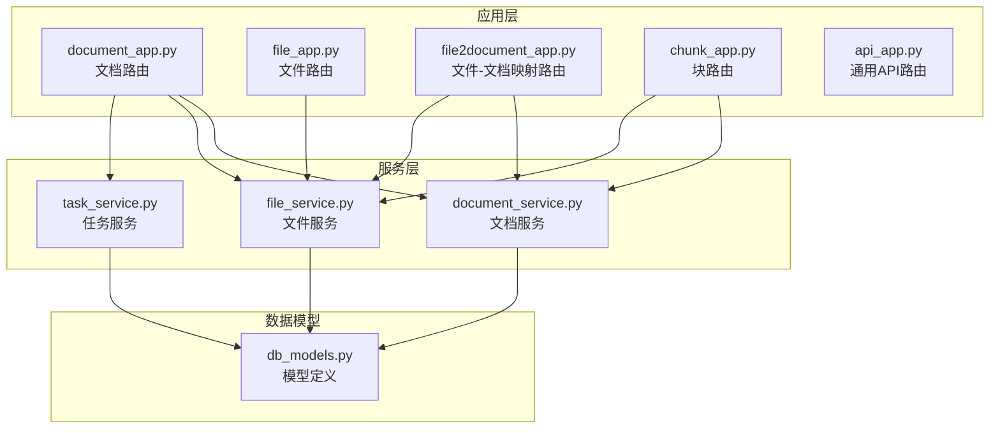
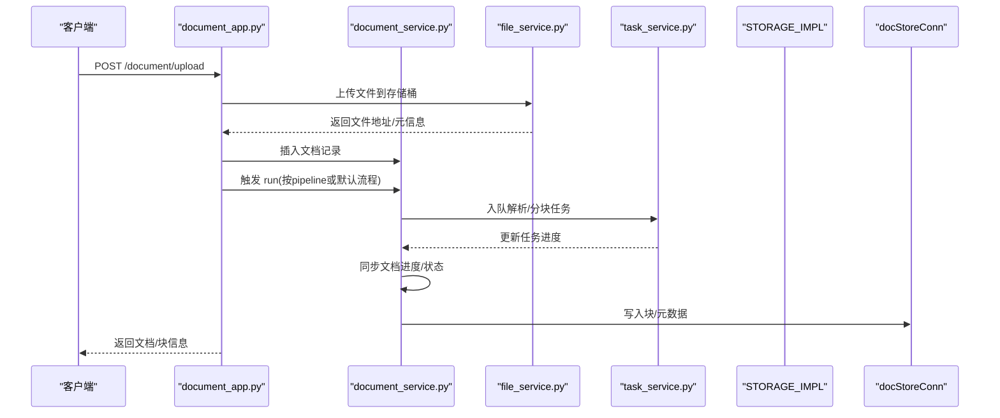
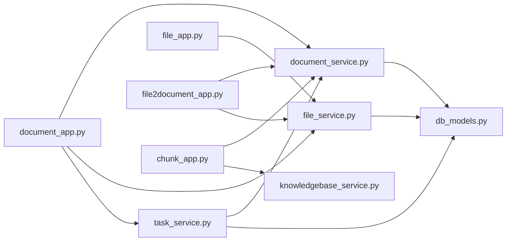

# 文档管理API

<cite>
**本文引用的文件**
- [document_app.py](file://api/apps/document_app.py)
- [document_service.py](file://api/db/services/document_service.py)
- [file2document_app.py](file://api/apps/file2document_app.py)
- [file_app.py](file://api/apps/file_app.py)
- [chunk_app.py](file://api/apps/chunk_app.py)
- [file_service.py](file://api/db/services/file_service.py)
- [task_service.py](file://api/db/services/task_service.py)
- [constants.py](file://api/constants.py)
- [common_constants.py](file://common/constants.py)
- [db_models.py](file://api/db/db_models.py)
- [api_app.py](file://api/apps/api_app.py)
</cite>

## 目录
1. [简介](#简介)
2. [项目结构](#项目结构)
3. [核心组件](#核心组件)
4. [架构总览](#架构总览)
5. [详细组件分析](#详细组件分析)
6. [依赖关系分析](#依赖关系分析)
7. [性能与并发特性](#性能与并发特性)
8. [故障排查指南](#故障排查指南)
9. [结论](#结论)
10. [附录：API清单与参数说明](#附录api清单与参数说明)

## 简介
本文件面向开发者与集成者，系统化梳理“文档管理API”的全生命周期能力，覆盖文档上传、解析、分块、状态查询、删除、重命名、元数据设置、在线解析、网页抓取、图片缩略图获取、运行控制与重跑、以及与“块（chunk）”管理的联动。文档重点解释API在后端的实现方式、任务队列与进度同步机制、以及如何进行进度监控与问题定位。

## 项目结构
围绕文档管理的核心模块包括：
- 应用层路由：负责HTTP请求接入与鉴权校验，定义各端点的请求方法、路径与参数校验。
- 服务层：封装数据库访问、任务调度、存储交互、索引更新等业务逻辑。
- 数据模型：定义文档、任务、文件、知识库等实体字段与序列化规则。
- 常量与枚举：统一返回码、任务状态、解析器类型、文件类型等。

图表来源
- [document_app.py](file://api/apps/document_app.py#L1-L729)
- [file_app.py](file://api/apps/file_app.py#L1-L467)
- [file2document_app.py](file://api/apps/file2document_app.py#L1-L133)
- [chunk_app.py](file://api/apps/chunk_app.py#L1-L437)
- [document_service.py](file://api/db/services/document_service.py#L1-L1035)
- [file_service.py](file://api/db/services/file_service.py#L1-L673)
- [task_service.py](file://api/db/services/task_service.py#L1-L524)
- [db_models.py](file://api/db/db_models.py#L1-L200)

章节来源
- [document_app.py](file://api/apps/document_app.py#L1-L729)
- [file_app.py](file://api/apps/file_app.py#L1-L467)
- [file2document_app.py](file://api/apps/file2document_app.py#L1-L133)
- [chunk_app.py](file://api/apps/chunk_app.py#L1-L437)
- [document_service.py](file://api/db/services/document_service.py#L1-L1035)
- [file_service.py](file://api/db/services/file_service.py#L1-L673)
- [task_service.py](file://api/db/services/task_service.py#L1-L524)
- [db_models.py](file://api/db/db_models.py#L1-L200)

## 核心组件
- 文档应用（document_app.py）：提供文档上传、网页抓取、创建虚拟文档、列表与过滤、详情、缩略图、状态变更、删除、重命名、运行控制、解析器切换、直接解析、元数据设置、上传信息预检等端点。
- 文件应用（file_app.py）：提供文件上传、创建虚拟/文件夹、列出子文件、根目录与父级目录、重命名、删除、移动、下载等端点。
- 文件-文档映射应用（file2document_app.py）：将文件转换为文档并建立关联，或删除映射并清理对应文档。
- 块应用（chunk_app.py）：提供块列表、获取、更新、开关可用性、删除、创建、检索测试、知识图谱可视化等端点。
- 文档服务（document_service.py）：封装文档的增删改查、权限校验、进度同步、运行触发、计数统计、增量/扣减统计等。
- 文件服务（file_service.py）：封装文件的上传、存储、重命名、删除、移动、解析、类型判定、文件夹遍历等。
- 任务服务（task_service.py）：封装任务的创建、进度追踪、队列入队、任务重试、批量处理等。
- 常量与枚举（constants.py、common_constants.py）：统一返回码、任务状态、解析器类型、文件类型、管道任务类型等。

章节来源
- [document_app.py](file://api/apps/document_app.py#L1-L729)
- [file_app.py](file://api/apps/file_app.py#L1-L467)
- [file2document_app.py](file://api/apps/file2document_app.py#L1-L133)
- [chunk_app.py](file://api/apps/chunk_app.py#L1-L437)
- [document_service.py](file://api/db/services/document_service.py#L1-L1035)
- [file_service.py](file://api/db/services/file_service.py#L1-L673)
- [task_service.py](file://api/db/services/task_service.py#L1-L524)
- [constants.py](file://api/constants.py#L1-L29)
- [common_constants.py](file://common/constants.py#L1-L200)

## 架构总览
文档管理API通过“应用层路由 + 服务层 + 数据模型 + 存储/索引/队列”的协作完成全生命周期管理。上传后的文档会进入任务队列，由任务服务调度执行解析与分块，结果写入索引并更新文档进度；块应用提供对已分块内容的检索与编辑。

图表来源
- [document_app.py](file://api/apps/document_app.py#L51-L150)
- [document_service.py](file://api/db/services/document_service.py#L825-L846)
- [file_service.py](file://api/db/services/file_service.py#L1-L200)
- [task_service.py](file://api/db/services/task_service.py#L326-L523)

## 详细组件分析

### 文档上传与解析（/document/upload）
- 方法与路径
  - POST /document/upload
- 鉴权与参数
  - 需登录；表单参数包含 kb_id（知识库ID），文件字段为 file（可多文件）。
- 处理流程
  - 校验知识库存在性与权限；
  - 调用文件服务上传文件至存储桶，生成唯一位置名；
  - 插入文档记录（含类型、解析器ID、解析器配置、大小、缩略图等）；
  - 触发 run 流程（优先使用文档绑定的 pipeline，否则走默认任务队列）。
- 支持的文件类型
  - 由文件类型判定函数决定，常见类型见常量定义。
- 异步处理
  - 通过任务队列异步执行解析与分块，进度通过任务服务同步到文档。

章节来源
- [document_app.py](file://api/apps/document_app.py#L51-L85)
- [file_service.py](file://api/db/services/file_service.py#L1-L200)
- [document_service.py](file://api/db/services/document_service.py#L825-L846)
- [common_constants.py](file://common/constants.py#L36-L120)

### 网页抓取（/document/web_crawl）
- 方法与路径
  - POST /document/web_crawl
- 参数
  - 必填：kb_id、name、url；校验URL格式。
- 行为
  - 下载网页为PDF并保存到知识库桶；
  - 创建文档记录并插入文件-文档映射；
  - 自动选择解析器（如图片/音频/PPT/邮件等）。
- 注意
  - 仅支持PDF抓取；其他类型需另行处理。

章节来源
- [document_app.py](file://api/apps/document_app.py#L87-L151)

### 创建虚拟文档（/document/create）
- 方法与路径
  - POST /document/create
- 参数
  - 必填：kb_id、name；校验名称长度与重复。
- 行为
  - 在知识库下创建虚拟文档（无实际文件），用于后续运行解析流程。

章节来源
- [document_app.py](file://api/apps/document_app.py#L153-L208)

### 列表与过滤（/document/list、/document/filter）
- 方法与路径
  - POST /document/list
  - POST /document/filter
- 参数
  - /document/list：查询参数 kb_id、keywords、page/page_size、orderby、desc、create_time_from/to；JSON体可传 run_status、types、suffix 过滤。
  - /document/filter：JSON体传 kb_id、keywords、run_status、types、suffix。
- 行为
  - 列表：返回文档总数与分页列表，补充缩略图URL与来源类型简写。
  - 过滤：返回按后缀与运行状态聚合的统计。

章节来源
- [document_app.py](file://api/apps/document_app.py#L210-L308)
- [document_service.py](file://api/db/services/document_service.py#L124-L213)

### 文档详情与缩略图（/document/infos、/document/thumbnails、/document/image/*）
- 方法与路径
  - POST /document/infos：批量查询文档详情。
  - GET /document/thumbnails：批量查询缩略图映射。
  - GET /document/image/{image_id}：按桶+对象名读取图片。
- 行为
  - 校验文档访问权限；
  - 对于非base64缩略图自动拼接访问路径。

章节来源
- [document_app.py](file://api/apps/document_app.py#L310-L339)
- [document_app.py](file://api/apps/document_app.py#L600-L614)

### 状态变更与删除（/document/change_status、/document/rm）
- 方法与路径
  - POST /document/change_status：批量修改文档可用状态（0/1）。
  - POST /document/rm：删除文档（支持单个或多个ID）。
- 行为
  - 状态变更：同时更新索引中的可用标记；
  - 删除：删除文件与索引中相关块，清理图谱相关字段。

章节来源
- [document_app.py](file://api/apps/document_app.py#L341-L400)
- [document_service.py](file://api/db/services/document_service.py#L290-L341)

### 重命名与元数据（/document/rename、/document/set_meta）
- 方法与路径
  - POST /document/rename：重命名文档，校验扩展名不变与名称唯一。
  - POST /document/set_meta：设置文档元数据（JSON键值对，值类型限制为字符串/数字）。
- 行为
  - 重命名：同步更新文件-文档映射的文件名与索引标题字段；
  - 元数据：校验JSON格式与类型，入库并返回成功。

章节来源
- [document_app.py](file://api/apps/document_app.py#L453-L503)
- [document_app.py](file://api/apps/document_app.py#L689-L719)

### 运行控制与重跑（/document/run）
- 方法与路径
  - POST /document/run
- 参数
  - 必填：doc_ids、run（0-未开始/1-运行中/2-取消/3-完成/4-失败/5-计划）；可选 delete（布尔，删除历史任务与索引）。
- 行为
  - 校验文档访问权限；
  - 若请求取消且当前为运行中，则取消所有任务；
  - 若请求重跑且历史已完成，先清空统计并删除索引；
  - 设置文档进度/消息/令牌/块数量等；
  - 触发 run 流程（pipeline或默认队列）。

章节来源
- [document_app.py](file://api/apps/document_app.py#L402-L451)
- [document_service.py](file://api/db/services/document_service.py#L825-L846)

### 解析器切换（/document/change_parser）
- 方法与路径
  - POST /document/change_parser
- 参数
  - 可选：pipeline_id、parser_id、parser_config；
  - 若解析器或配置变化，重置进度与索引。
- 行为
  - 校验文档访问权限；
  - 更新文档的解析器与配置；
  - 如有历史数据，扣减统计并删除索引。

章节来源
- [document_app.py](file://api/apps/document_app.py#L546-L598)
- [document_service.py](file://api/db/services/document_service.py#L565-L616)

### 直接解析与上传信息（/document/parse、/document/upload_info）
- 方法与路径
  - POST /document/parse：支持URL抓取或本地文件解析，返回文本片段。
  - POST /document/upload_info：返回上传信息（如文件大小、类型等）。
- 行为
  - URL模式：下载页面并解析为文本；
  - 文件模式：调用文件服务解析为文本片段。

章节来源
- [document_app.py](file://api/apps/document_app.py#L634-L687)
- [document_app.py](file://api/apps/document_app.py#L721-L729)
- [file_service.py](file://api/db/services/file_service.py#L518-L540)

### 文件管理（/file/*）
- 方法与路径
  - POST /file/upload：上传文件到用户根目录或指定父目录；
  - POST /file/create：创建文件夹或虚拟文件；
  - GET /file/list：列出子文件与父目录；
  - GET /file/root_folder、/file/parent_folder、/file/all_parent_folder：获取目录树；
  - POST /file/rm：删除文件/文件夹（递归）；
  - POST /file/rename：重命名（扩展名不可变）；
  - POST /file/mv：移动文件/文件夹；
  - GET /file/get/{file_id}：下载文件。
- 行为
  - 权限校验与团队权限检查；
  - 文件夹遍历与去重命名；
  - 存储桶内移动/复制/删除；
  - 与文档映射联动（重命名时同步文档名）。

章节来源
- [file_app.py](file://api/apps/file_app.py#L39-L467)

### 文件-文档映射（/file2document/*）
- 方法与路径
  - POST /file2document/convert：将文件转换为文档并建立映射；
  - POST /file2document/rm：删除映射并清理对应文档。
- 行为
  - 批量处理文件/文件夹；
  - 删除时清理文档、任务、索引与图谱字段。

章节来源
- [file2document_app.py](file://api/apps/file2document_app.py#L31-L133)
- [document_service.py](file://api/db/services/document_service.py#L290-L341)

### 块管理（/chunk/*）
- 方法与路径
  - POST /chunk/list：按文档分页列出块，支持关键词高亮；
  - GET /chunk/get：按块ID获取块内容；
  - POST /chunk/set：更新块内容与向量字段；
  - POST /chunk/switch：批量切换块可用性；
  - POST /chunk/rm：删除块并扣减统计；
  - POST /chunk/create：新增块并计算向量；
  - POST /chunk/retrieval_test：检索测试（支持跨语言、重排、关键词增强、KG融合）；
  - GET /chunk/knowledge_graph：获取文档知识图谱/思维导图。
- 行为
  - 统一通过租户ID与知识库ID定位索引；
  - 计算嵌入向量并写入索引；
  - 提供检索与可视化接口。

章节来源
- [chunk_app.py](file://api/apps/chunk_app.py#L42-L437)

## 依赖关系分析
- 文档应用依赖文档服务、文件服务、任务服务与存储/索引；
- 文件应用依赖文件服务与存储；
- 块应用依赖文档服务、知识库服务、检索器与嵌入模型；
- 任务服务依赖Redis队列、数据库与文档服务；
- 常量与枚举为全局共享，确保状态与类型一致性。

图表来源
- [document_app.py](file://api/apps/document_app.py#L1-L729)
- [file_app.py](file://api/apps/file_app.py#L1-L467)
- [file2document_app.py](file://api/apps/file2document_app.py#L1-L133)
- [chunk_app.py](file://api/apps/chunk_app.py#L1-L437)
- [document_service.py](file://api/db/services/document_service.py#L1-L1035)
- [file_service.py](file://api/db/services/file_service.py#L1-L673)
- [task_service.py](file://api/db/services/task_service.py#L1-L524)
- [db_models.py](file://api/db/db_models.py#L1-L200)

## 性能与并发特性
- 异步解析与分块
  - 通过任务队列与Redis组队列实现异步处理，避免阻塞请求；
  - 任务重试上限与进度回退保护，防止无限重试。
- 并发与批处理
  - 文档上传与解析采用线程池并发分块；
  - 块写入采用批量插入，减少索引写入开销。
- 进度同步
  - 文档服务定时从任务表汇总进度，合并特殊任务冻结策略；
  - 队列前移提示与排队长度反馈，帮助用户感知等待时间。
- 存储与索引
  - 文件与块均以桶+对象名存储，支持对象存在性检测与删除；
  - 索引按租户ID与知识库ID分区，支持批量插入与删除。

章节来源
- [task_service.py](file://api/db/services/task_service.py#L1-L200)
- [document_service.py](file://api/db/services/document_service.py#L663-L744)
- [document_service.py](file://api/db/services/document_service.py#L886-L891)
- [file_service.py](file://api/db/services/file_service.py#L518-L540)

## 故障排查指南
- 常见错误与定位
  - 参数缺失/格式错误：检查必填参数与类型（如kb_id、doc_ids、status取值范围）。
  - 权限不足：确认当前用户是否属于目标知识库或拥有相应角色。
  - 文档不存在/已删除：核对doc_id是否正确，或已被清理。
  - 存储/索引异常：检查STORAGE_IMPL与docStoreConn连通性与桶权限。
  - 任务队列不可用：检查Redis连接与队列名称。
- 进度监控
  - 使用文档列表接口的run_status与progress字段观察状态；
  - 使用/queue接口（若存在）查看队列长度与消费者组状态。
- 重跑与清理
  - 使用/run接口的delete参数清理历史任务与索引后再重跑；
  - 使用/rm接口删除文档时，确认已清理块与图谱字段。

章节来源
- [document_app.py](file://api/apps/document_app.py#L341-L451)
- [document_service.py](file://api/db/services/document_service.py#L663-L744)
- [task_service.py](file://api/db/services/task_service.py#L1-L200)

## 结论
文档管理API提供了完整的“上传-解析-分块-运行-查询-删除”闭环，配合任务队列与进度同步机制，能够稳定支撑大规模文档处理场景。通过统一的解析器与管道配置，用户可在不同文档类型上灵活选择最优处理策略，并借助块管理与检索接口实现高效问答与知识图谱构建。

## 附录：API清单与参数说明

- 文档管理
  - POST /document/upload
    - 表单参数：kb_id、file（多文件）
    - 返回：文件上传结果与文档ID列表
  - POST /document/web_crawl
    - 表单参数：kb_id、name、url
    - 返回：成功/失败
  - POST /document/create
    - JSON参数：kb_id、name
    - 返回：新建文档详情
  - POST /document/list
    - 查询参数：kb_id、keywords、page/page_size、orderby、desc、create_time_from/to
    - JSON参数：run_status[]、types[]、suffix[]
    - 返回：文档总数与分页列表
  - POST /document/filter
    - JSON参数：kb_id、keywords、run_status[]、types[]、suffix[]
    - 返回：按后缀与运行状态聚合的统计
  - POST /document/infos
    - JSON参数：doc_ids[]
    - 返回：文档详情列表
  - GET /document/thumbnails
    - 查询参数：doc_ids[]
    - 返回：缩略图映射
  - GET /document/image/{image_id}
    - 返回：图片二进制
  - POST /document/change_status
    - JSON参数：doc_ids[]、status（0/1）
    - 返回：逐项结果
  - POST /document/rm
    - JSON参数：doc_id（字符串或数组）
    - 返回：成功/失败
  - POST /document/rename
    - JSON参数：doc_id、name
    - 返回：成功/失败
  - POST /document/run
    - JSON参数：doc_ids[]、run（0-5）、delete（可选）
    - 返回：成功/失败
  - POST /document/change_parser
    - JSON参数：doc_id、pipeline_id（可选）、parser_id（可选）、parser_config（可选）
    - 返回：成功/失败
  - POST /document/parse
    - JSON参数：url（可选）或multipart file（可选）
    - 返回：解析文本
  - POST /document/set_meta
    - JSON参数：doc_id、meta（JSON字典）
    - 返回：成功/失败
  - POST /document/upload_info
    - 查询参数：url（可选）
    - 表单参数：file
    - 返回：上传信息
  - GET /document/get/{doc_id}
    - 返回：文件二进制（根据扩展名设置Content-Type）

- 文件管理
  - POST /file/upload
    - 表单参数：parent_id（可选）、file（多文件）
    - 返回：文件列表
  - POST /file/create
    - JSON参数：parent_id、name、type（folder/virtual）
    - 返回：文件详情
  - GET /file/list
    - 查询参数：parent_id、keywords、page/page_size、orderby、desc
    - 返回：文件总数、列表与父目录
  - GET /file/root_folder
    - 返回：根目录
  - GET /file/parent_folder
    - 查询参数：file_id
    - 返回：父目录
  - GET /file/all_parent_folder
    - 查询参数：file_id
    - 返回：祖先目录链
  - POST /file/rm
    - JSON参数：file_ids[]
    - 返回：成功/失败
  - POST /file/rename
    - JSON参数：file_id、name
    - 返回：成功/失败
  - POST /file/mv
    - JSON参数：src_file_ids[]、dest_file_id
    - 返回：成功/失败
  - GET /file/get/{file_id}
    - 返回：文件二进制（根据扩展名设置Content-Type）

- 文件-文档映射
  - POST /file2document/convert
    - JSON参数：file_ids[]、kb_ids[]
    - 返回：映射记录列表
  - POST /file2document/rm
    - JSON参数：file_ids[]
    - 返回：成功/失败

- 块管理
  - POST /chunk/list
    - JSON参数：doc_id、page、size、keywords、available_int（可选）
    - 返回：块总数、块列表与文档信息
  - GET /chunk/get
    - 查询参数：chunk_id
    - 返回：块详情
  - POST /chunk/set
    - JSON参数：doc_id、chunk_id、content_with_weight、important_kwd[]、question_kwd[]、tag_kwd、tag_feas、available_int
    - 返回：成功/失败
  - POST /chunk/switch
    - JSON参数：doc_id、chunk_ids[]、available_int
    - 返回：成功/失败
  - POST /chunk/rm
    - JSON参数：doc_id、chunk_ids[]
    - 返回：成功/失败
  - POST /chunk/create
    - JSON参数：doc_id、content_with_weight、important_kwd[]、question_kwd[]、tag_feas
    - 返回：块ID
  - POST /chunk/retrieval_test
    - JSON参数：kb_id（可为字符串或数组）、question、doc_ids[]、use_kg、top_k、cross_languages[]、rerank_id、keyword、search_id、highlight
    - 返回：检索结果与标签
  - GET /chunk/knowledge_graph
    - 查询参数：doc_id
    - 返回：图/思维导图对象

章节来源
- [document_app.py](file://api/apps/document_app.py#L51-L729)
- [file_app.py](file://api/apps/file_app.py#L39-L467)
- [file2document_app.py](file://api/apps/file2document_app.py#L31-L133)
- [chunk_app.py](file://api/apps/chunk_app.py#L42-L437)