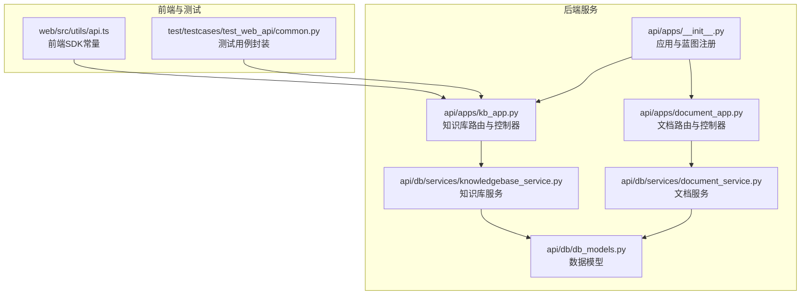
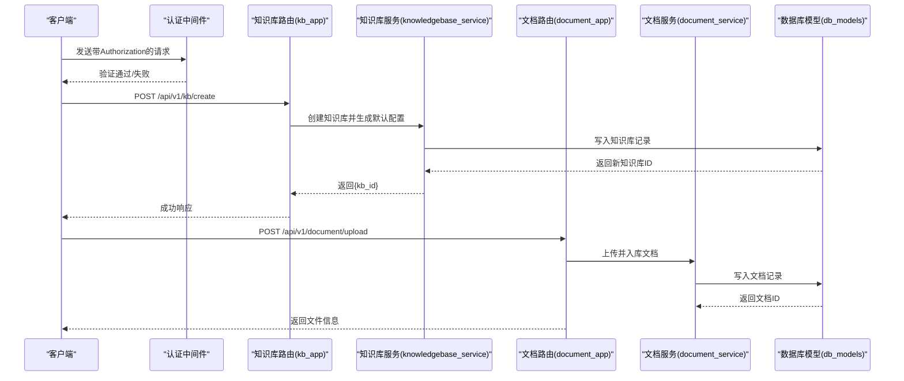
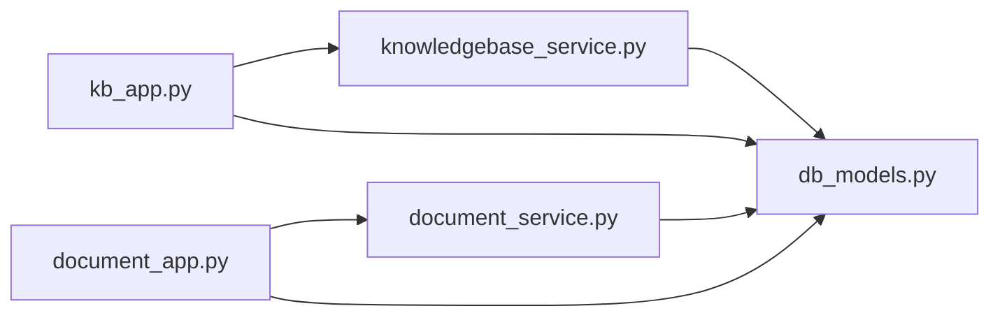

# 知识库API

<cite>
**本文引用的文件列表**
- [api/apps/kb_app.py](file://api/apps/kb_app.py)
- [api/db/services/knowledgebase_service.py](file://api/db/services/knowledgebase_service.py)
- [api/apps/document_app.py](file://api/apps/document_app.py)
- [api/db/services/document_service.py](file://api/db/services/document_service.py)
- [api/apps/__init__.py](file://api/apps/__init__.py)
- [api/constants.py](file://api/constants.py)
- [api/db/db_models.py](file://api/db/db_models.py)
- [web/src/utils/api.ts](file://web/src/utils/api.ts)
- [test/testcases/test_web_api/common.py](file://test/testcases/test_web_api/common.py)
</cite>

## 目录
1. [简介](#简介)
2. [项目结构](#项目结构)
3. [核心组件](#核心组件)
4. [架构总览](#架构总览)
5. [详细组件分析](#详细组件分析)
6. [依赖关系分析](#依赖关系分析)
7. [性能考量](#性能考量)
8. [故障排查指南](#故障排查指南)
9. [结论](#结论)
10. [附录](#附录)

## 简介
本文件为“知识库管理API”的权威技术文档，覆盖知识库的创建、读取、更新、删除（CRUD）以及与其关联的文档管理能力。文档详细说明每个端点的HTTP方法、URL路径、请求参数、响应结构，并解释知识库配置项（如分块策略、解析器选择）在API中的表示方式。同时提供可直接用于自动化构建与维护知识库的使用示例与最佳实践。

## 项目结构
知识库API位于后端服务的“apps”模块中，采用蓝图注册的方式对外暴露REST接口；业务逻辑由对应的服务层实现；数据模型定义于数据库模型文件中；前端SDK与测试用例展示了典型调用方式。

图表来源
- [api/apps/__init__.py](file://api/apps/__init__.py#L244-L266)
- [api/apps/kb_app.py](file://api/apps/kb_app.py#L48-L939)
- [api/db/services/knowledgebase_service.py](file://api/db/services/knowledgebase_service.py#L1-L566)
- [api/apps/document_app.py](file://api/apps/document_app.py#L1-L729)
- [api/db/services/document_service.py](file://api/db/services/document_service.py#L1-L800)
- [api/db/db_models.py](file://api/db/db_models.py#L734-L798)
- [web/src/utils/api.ts](file://web/src/utils/api.ts#L55-L84)
- [test/testcases/test_web_api/common.py](file://test/testcases/test_web_api/common.py#L40-L69)

章节来源
- [api/apps/__init__.py](file://api/apps/__init__.py#L244-L266)
- [api/apps/kb_app.py](file://api/apps/kb_app.py#L48-L939)
- [api/apps/document_app.py](file://api/apps/document_app.py#L1-L729)
- [api/db/db_models.py](file://api/db/db_models.py#L734-L798)

## 核心组件
- 知识库路由与控制器：提供知识库CRUD、标签管理、图谱查询、元数据统计、任务追踪等端点。
- 文档路由与控制器：提供文档上传、创建、列表、过滤、状态变更、重命名、删除、解析器切换、元数据设置等端点。
- 服务层：
  - 知识库服务：封装知识库的创建、查询、权限校验、解析器配置合并、统计信息汇总等。
  - 文档服务：封装文档的查询、计数、进度同步、元数据聚合、大小统计等。
- 数据模型：定义知识库与文档的核心字段及默认值，包括解析器ID、解析器配置、向量化模型ID、分页权重等。

章节来源
- [api/db/services/knowledgebase_service.py](file://api/db/services/knowledgebase_service.py#L1-L566)
- [api/db/services/document_service.py](file://api/db/services/document_service.py#L1-L800)
- [api/db/db_models.py](file://api/db/db_models.py#L734-L798)

## 架构总览
知识库API遵循“蓝图 + 服务层 + 模型层”的分层设计。认证通过全局装饰器实现，统一从请求头中解析访问令牌或API Token；路由层负责参数校验与错误处理，服务层负责业务逻辑与数据库交互，模型层负责数据结构与约束。

图表来源
- [api/apps/__init__.py](file://api/apps/__init__.py#L108-L175)
- [api/apps/kb_app.py](file://api/apps/kb_app.py#L48-L118)
- [api/db/services/knowledgebase_service.py](file://api/db/services/knowledgebase_service.py#L376-L430)
- [api/apps/document_app.py](file://api/apps/document_app.py#L51-L85)
- [api/db/services/document_service.py](file://api/db/services/document_service.py#L290-L301)
- [api/db/db_models.py](file://api/db/db_models.py#L734-L798)

## 详细组件分析

### 知识库CRUD与管理端点
- 基础信息
  - 版本前缀：/api/v1
  - 认证：所有端点均需登录，支持用户访问令牌或API Token
  - 路由蓝图：/kb

- 端点一览
  - POST /api/v1/kb/create
    - 功能：创建知识库
    - 请求体参数：
      - name: 字符串，必填，长度限制见常量
      - parser_id: 字符串，可选，默认“naive”
      - 其他可选字段：description、language、permission、avatar、parser_config、pagerank、embd_id、pipeline_id 等
    - 响应：返回 {kb_id}
    - 权限：仅当前租户用户可创建
    - 复杂度：O(1)，主要为数据库写入与默认配置合并
    - 参考实现路径
      - [创建流程](file://api/apps/kb_app.py#L48-L69)
      - [默认配置合并](file://api/db/services/knowledgebase_service.py#L376-L430)

  - POST /api/v1/kb/update
    - 功能：更新知识库基本信息与解析器配置
    - 请求体参数：
      - kb_id: 字符串，必填
      - name/description/language/permission/avatar/embd_id/pagerank/parser_id/pipeline_id/parser_config 等
      - 不允许传入字段：id、tenant_id、created_by、create_time、update_time、create_date、update_date、created_by
    - 响应：返回完整知识库对象（含connectors）
    - 权限：仅知识库创建者可更新
    - 复杂度：O(1) + 解析器配置深合并
    - 参考实现路径
      - [更新流程](file://api/apps/kb_app.py#L71-L149)
      - [解析器配置合并](file://api/db/services/knowledgebase_service.py#L296-L322)

  - GET /api/v1/kb/detail
    - 功能：获取知识库详情
    - 查询参数：kb_id
    - 响应：包含 size、connectors、任务完成时间等字段
    - 权限：仅知识库所属租户成员可访问
    - 复杂度：O(1) + 文档大小统计
    - 参考实现路径
      - [详情查询](file://api/apps/kb_app.py#L153-L178)
      - [文档大小统计](file://api/db/services/document_service.py#L234-L249)

  - POST /api/v1/kb/list
    - 功能：分页列出知识库
    - 查询参数：keywords、page、page_size、parser_id、orderby、desc
    - 请求体参数：owner_ids（可选，指定仅列出这些租户ID下的知识库）
    - 响应：{kbs: [...], total: number}
    - 权限：仅本人或所在团队可见
    - 复杂度：O(n) 分页查询
    - 参考实现路径
      - [列表查询](file://api/apps/kb_app.py#L182-L217)
      - [服务层分页](file://api/db/services/knowledgebase_service.py#L135-L198)

  - POST /api/v1/kb/rm
    - 功能：删除知识库（级联删除文档、文件、索引、桶）
    - 请求体参数：kb_id
    - 响应：布尔成功标志
    - 权限：仅知识库创建者可删除
    - 复杂度：O(n) 文档遍历与清理
    - 参考实现路径
      - [删除流程](file://api/apps/kb_app.py#L219-L262)
      - [文档删除与索引清理](file://api/db/services/document_service.py#L300-L341)

- 知识库配置项说明
  - parser_id：默认解析器标识，影响文档解析与分块策略
  - parser_config：嵌套JSON，包含页面范围、表格上下文、图片上下文等
  - embd_id：默认嵌入模型ID
  - pagerank：页面重要性权重，用于检索时排序
  - permission：me/team，控制可见范围
  - language：语言
  - avatar/description/name：元信息
  - pipeline_id：数据管线ID（可选）

章节来源
- [api/apps/kb_app.py](file://api/apps/kb_app.py#L48-L262)
- [api/db/services/knowledgebase_service.py](file://api/db/services/knowledgebase_service.py#L135-L322)
- [api/db/db_models.py](file://api/db/db_models.py#L734-L798)
- [api/constants.py](file://api/constants.py#L25-L29)

### 知识库标签与图谱管理
- 端点一览
  - GET /api/v1/kb/{kb_id}/tags
    - 功能：列出知识库下所有标签
    - 权限：仅知识库成员可访问
    - 响应：标签数组
    - 参考实现路径
      - [标签查询](file://api/apps/kb_app.py#L264-L279)

  - GET /api/v1/kb/tags
    - 功能：批量查询多个知识库的标签
    - 查询参数：kb_ids（逗号分隔）
    - 响应：标签数组
    - 参考实现路径
      - [批量标签查询](file://api/apps/kb_app.py#L281-L298)

  - POST /api/v1/kb/{kb_id}/rm_tags
    - 功能：移除知识库下指定标签
    - 请求体参数：tags（数组）
    - 响应：布尔成功标志
    - 参考实现路径
      - [移除标签](file://api/apps/kb_app.py#L300-L318)

  - POST /api/v1/kb/{kb_id}/rename_tag
    - 功能：重命名知识库下标签
    - 请求体参数：from_tag、to_tag
    - 响应：布尔成功标志
    - 参考实现路径
      - [重命名标签](file://api/apps/kb_app.py#L320-L337)

  - GET /api/v1/kb/{kb_id}/knowledge_graph
    - 功能：获取知识图谱（graph/mind_map）
    - 响应：包含graph与mind_map的对象
    - 参考实现路径
      - [图谱查询](file://api/apps/kb_app.py#L339-L377)

  - DELETE /api/v1/kb/{kb_id}/knowledge_graph
    - 功能：删除知识图谱内容
    - 响应：布尔成功标志
    - 参考实现路径
      - [删除图谱](file://api/apps/kb_app.py#L379-L392)

章节来源
- [api/apps/kb_app.py](file://api/apps/kb_app.py#L264-L392)

### 知识库元数据与基础信息
- 端点一览
  - GET /api/v1/kb/get_meta
    - 功能：按知识库ID集合聚合文档元数据键值
    - 查询参数：kb_ids（逗号分隔）
    - 响应：{key: {value: [doc_ids]}}
    - 参考实现路径
      - [元数据聚合](file://api/apps/kb_app.py#L394-L406)
      - [服务层聚合](file://api/db/services/document_service.py#L646-L662)

  - GET /api/v1/kb/basic_info
    - 功能：获取知识库基础统计信息（文档数量、下载来源、完成/失败/取消等）
    - 查询参数：kb_id
    - 响应：统计对象
    - 参考实现路径
      - [基础信息](file://api/apps/kb_app.py#L408-L422)
      - [统计聚合](file://api/db/services/document_service.py#L770-L800)

章节来源
- [api/apps/kb_app.py](file://api/apps/kb_app.py#L394-L422)
- [api/db/services/document_service.py](file://api/db/services/document_service.py#L646-L800)

### 知识库数据管线日志与任务追踪
- 端点一览
  - POST /api/v1/kb/list_pipeline_logs
    - 功能：分页列出数据管线日志
    - 查询参数：kb_id、keywords、page、page_size、orderby、desc、create_date_from、create_date_to
    - 请求体参数：operation_status（过滤）、types（过滤）、suffix（过滤）
    - 响应：{total, logs}
    - 参考实现路径
      - [日志列表](file://api/apps/kb_app.py#L424-L466)

  - POST /api/v1/kb/list_pipeline_dataset_logs
    - 功能：分页列出数据集日志
    - 查询参数：kb_id、page、page_size、orderby、desc、create_date_from、create_date_to
    - 请求体参数：operation_status（过滤）
    - 响应：{total, logs}
    - 参考实现路径
      - [数据集日志](file://api/apps/kb_app.py#L468-L500)

  - POST /api/v1/kb/delete_pipeline_logs
    - 功能：批量删除日志
    - 请求体参数：log_ids
    - 响应：布尔成功标志
    - 参考实现路径
      - [删除日志](file://api/apps/kb_app.py#L502-L515)

  - GET /api/v1/kb/pipeline_log_detail
    - 功能：获取单条日志详情
    - 查询参数：log_id
    - 响应：日志对象
    - 参考实现路径
      - [日志详情](file://api/apps/kb_app.py#L517-L529)

- 图谱/大模型任务
  - POST /api/v1/kb/run_graphrag
    - 功能：触发GraphRAG任务
    - 请求体参数：kb_id
    - 响应：{graphrag_task_id}
    - 参考实现路径
      - [运行GraphRAG](file://api/apps/kb_app.py#L531-L576)

  - GET /api/v1/kb/trace_graphrag
    - 功能：追踪GraphRAG任务进度
    - 查询参数：kb_id
    - 响应：任务对象
    - 参考实现路径
      - [追踪GraphRAG](file://api/apps/kb_app.py#L578-L598)

  - POST /api/v1/kb/run_raptor
    - 功能：触发RAPTOR任务
    - 请求体参数：kb_id
    - 响应：{raptor_task_id}
    - 参考实现路径
      - [运行RAPTOR](file://api/apps/kb_app.py#L600-L645)

  - GET /api/v1/kb/trace_raptor
    - 功能：追踪RAPTOR任务进度
    - 查询参数：kb_id
    - 响应：任务对象
    - 参考实现路径
      - [追踪RAPTOR](file://api/apps/kb_app.py#L647-L667)

  - POST /api/v1/kb/run_mindmap
    - 功能：触发Mindmap任务
    - 请求体参数：kb_id
    - 响应：{mindmap_task_id}
    - 参考实现路径
      - [运行Mindmap](file://api/apps/kb_app.py#L669-L714)

  - GET /api/v1/kb/trace_mindmap
    - 功能：追踪Mindmap任务进度
    - 查询参数：kb_id
    - 响应：任务对象
    - 参考实现路径
      - [追踪Mindmap](file://api/apps/kb_app.py#L716-L736)

  - DELETE /api/v1/kb/unbind_task
    - 功能：解绑并取消知识库关联的图谱/大模型任务
    - 查询参数：kb_id、pipeline_task_type（GRAPH_RAG/RAPTOR/MINDMAP）
    - 响应：布尔成功标志
    - 参考实现路径
      - [解绑任务](file://api/apps/kb_app.py#L738-L784)

章节来源
- [api/apps/kb_app.py](file://api/apps/kb_app.py#L424-L784)

### 知识库嵌入一致性检查
- POST /api/v1/kb/check_embedding
  - 功能：对知识库内随机切片进行向量相似度比对，评估嵌入模型切换的有效性
  - 请求体参数：kb_id、embd_id、check_num
  - 响应：包含摘要与结果的结构化对象
  - 参考实现路径
    - [嵌入检查](file://api/apps/kb_app.py#L800-L939)

章节来源
- [api/apps/kb_app.py](file://api/apps/kb_app.py#L800-L939)

### 文档管理端点（与知识库关联）
- 端点一览
  - POST /api/v1/document/upload
    - 功能：上传文件到知识库
    - 表单参数：kb_id、file（多文件）
    - 响应：文件信息数组
    - 权限：需具备知识库团队权限
    - 参考实现路径
      - [上传](file://api/apps/document_app.py#L51-L85)

  - POST /api/v1/document/web_crawl
    - 功能：抓取网页并保存为PDF文档
    - 表单参数：kb_id、name、url
    - 响应：布尔成功标志
    - 参考实现路径
      - [网页抓取](file://api/apps/document_app.py#L87-L151)

  - POST /api/v1/document/create
    - 功能：创建虚拟文档（不绑定物理文件）
    - 请求体参数：kb_id、name
    - 响应：文档对象
    - 参考实现路径
      - [创建虚拟文档](file://api/apps/document_app.py#L153-L208)

  - POST /api/v1/document/list
    - 功能：分页列出文档
    - 查询参数：kb_id、keywords、page、page_size、orderby、desc、create_time_from、create_time_to
    - 请求体参数：run_status、types、suffix
    - 响应：{total, docs}
    - 参考实现路径
      - [文档列表](file://api/apps/document_app.py#L210-L269)

  - POST /api/v1/document/filter
    - 功能：获取文档过滤条件统计
    - 请求体参数：kb_id、keywords、run_status、types、suffix
    - 响应：{total, filter}
    - 参考实现路径
      - [过滤统计](file://api/apps/document_app.py#L272-L308)

  - POST /api/v1/document/infos
    - 功能：批量获取文档信息
    - 请求体参数：doc_ids
    - 响应：文档列表
    - 参考实现路径
      - [批量信息](file://api/apps/document_app.py#L310-L320)

  - GET /api/v1/document/thumbnails
    - 功能：批量获取缩略图
    - 查询参数：doc_ids（数组）
    - 响应：映射对象
    - 参考实现路径
      - [缩略图](file://api/apps/document_app.py#L322-L339)

  - POST /api/v1/document/change_status
    - 功能：批量修改文档可用状态
    - 请求体参数：doc_ids、status（0/1）
    - 响应：各文档的更新结果
    - 参考实现路径
      - [状态变更](file://api/apps/document_app.py#L341-L379)

  - POST /api/v1/document/rm
    - 功能：删除文档（支持批量）
    - 请求体参数：doc_id（字符串或数组）
    - 响应：布尔成功标志
    - 参考实现路径
      - [删除文档](file://api/apps/document_app.py#L381-L400)

  - POST /api/v1/document/run
    - 功能：执行/重跑/取消文档处理任务
    - 请求体参数：doc_ids、run（任务状态）、delete（可选，清理历史）
    - 响应：布尔成功标志
    - 参考实现路径
      - [执行任务](file://api/apps/document_app.py#L402-L451)

  - POST /api/v1/document/rename
    - 功能：重命名文档
    - 请求体参数：doc_id、name
    - 响应：布尔成功标志
    - 参考实现路径
      - [重命名](file://api/apps/document_app.py#L453-L503)

  - GET /api/v1/document/get/{doc_id}
    - 功能：下载文档内容
    - 路径参数：doc_id
    - 响应：二进制流
    - 参考实现路径
      - [下载文档](file://api/apps/document_app.py#L505-L529)

  - GET /api/v1/document/download/{attachment_id}
    - 功能：下载附件
    - 路径参数：attachment_id、ext
    - 响应：二进制流
    - 参考实现路径
      - [下载附件](file://api/apps/document_app.py#L531-L544)

  - POST /api/v1/document/change_parser
    - 功能：切换文档解析器与解析器配置
    - 请求体参数：doc_id、parser_id、pipeline_id（可选）、parser_config（可选）
    - 响应：布尔成功标志
    - 参考实现路径
      - [切换解析器](file://api/apps/document_app.py#L546-L598)

  - GET /api/v1/document/image/{image_id}
    - 功能：获取图片缩略图
    - 路径参数：image_id（格式：桶-名称）
    - 响应：二进制流
    - 参考实现路径
      - [获取图片](file://api/apps/document_app.py#L600-L614)

  - POST /api/v1/document/upload_and_parse
    - 功能：上传并解析（会话场景）
    - 表单参数：conversation_id、file（多文件）
    - 响应：文档ID数组
    - 参考实现路径
      - [上传并解析](file://api/apps/document_app.py#L616-L632)

  - POST /api/v1/document/parse
    - 功能：解析URL或本地文件
    - 请求体参数：url 或 文件
    - 响应：文本内容
    - 参考实现路径
      - [解析](file://api/apps/document_app.py#L634-L687)

  - POST /api/v1/document/set_meta
    - 功能：设置文档元数据
    - 请求体参数：doc_id、meta（JSON对象）
    - 响应：布尔成功标志
    - 参考实现路径
      - [设置元数据](file://api/apps/document_app.py#L689-L719)

  - POST /api/v1/document/upload_info
    - 功能：获取上传信息（支持URL预览）
    - 表单参数：file、url
    - 响应：上传信息
    - 参考实现路径
      - [上传信息](file://api/apps/document_app.py#L721-L729)

章节来源
- [api/apps/document_app.py](file://api/apps/document_app.py#L51-L729)
- [api/db/services/document_service.py](file://api/db/services/document_service.py#L1-L800)

### 使用示例（基于测试与前端SDK）
- 创建知识库
  - 方法：POST /api/v1/kb/create
  - 示例请求体：{"name":"产品文档","parser_id":"naive","description":"产品文档知识库"}
  - 示例响应：{"code":0,"message":"","data":{"kb_id":"<知识库ID>"}}

- 列出知识库
  - 方法：POST /api/v1/kb/list
  - 示例查询参数：page=1&page_size=10&orderby=create_time&desc=true
  - 示例响应：{"code":0,"message":"","data":{"kbs":[...],"total":N}}

- 上传文档到知识库
  - 方法：POST /api/v1/document/upload
  - 示例表单：kb_id=<知识库ID>&file=@文件路径
  - 示例响应：{"code":0,"message":"","data":[{"id":"<文档ID>","name":"文件名"}]}

- 运行GraphRAG任务
  - 方法：POST /api/v1/kb/run_graphrag
  - 示例请求体：{"kb_id":"<知识库ID>"}
  - 示例响应：{"code":0,"message":"","data":{"graphrag_task_id":"<任务ID>"}}

- 获取任务进度
  - 方法：GET /api/v1/kb/trace_graphrag?kb_id=<知识库ID>
  - 示例响应：{"code":0,"message":"","data":{"progress":...,"status":...}}

章节来源
- [test/testcases/test_web_api/common.py](file://test/testcases/test_web_api/common.py#L40-L69)
- [web/src/utils/api.ts](file://web/src/utils/api.ts#L55-L84)

## 依赖关系分析
- 组件耦合
  - 路由层依赖服务层，服务层依赖模型层，形成清晰的单向依赖。
  - 认证中间件统一注入，避免重复鉴权代码。
- 外部依赖
  - 存储实现（STORAGE_IMPL）：对象存储桶操作
  - 文档检索实现（docStoreConn）：倒排索引与向量检索
  - 任务队列/Redis：任务取消标记
- 循环依赖
  - 未发现循环导入；服务层通过字符串引用避免循环引用。

图表来源
- [api/apps/kb_app.py](file://api/apps/kb_app.py#L48-L939)
- [api/db/services/knowledgebase_service.py](file://api/db/services/knowledgebase_service.py#L1-L566)
- [api/apps/document_app.py](file://api/apps/document_app.py#L1-L729)
- [api/db/services/document_service.py](file://api/db/services/document_service.py#L1-L800)
- [api/db/db_models.py](file://api/db/db_models.py#L734-L798)

## 性能考量
- 分页与过滤
  - 列表与过滤接口均支持分页与多维过滤，建议合理设置page/page_size与筛选条件以降低数据库压力。
- 并发与异步
  - 删除与上传等耗时操作采用异步线程池执行，避免阻塞主事件循环。
- 索引与统计
  - 知识库与文档均建立关键字段索引，提升查询效率。
- 向量相似度检查
  - 随机采样与向量计算在服务端执行，建议控制采样数量与模型维度，避免高开销。

## 故障排查指南
- 认证失败
  - 确认请求头包含有效的Authorization（用户访问令牌或API Token），且令牌未过期。
  - 参考路径：[认证中间件](file://api/apps/__init__.py#L108-L175)

- 参数校验错误
  - 名称长度超限、缺少必要参数、类型不匹配等将返回明确错误码与消息。
  - 参考路径：[名称长度限制](file://api/constants.py#L25-L29)

- 权限不足
  - 更新/删除/访问知识库或文档需满足归属与团队权限要求。
  - 参考路径：[知识库权限校验](file://api/db/services/knowledgebase_service.py#L472-L500)、[文档权限校验](file://api/db/services/document_service.py#L494-L526)

- 任务冲突
  - 同一知识库的GraphRAG/RAPTOR/Mindmap任务若已在运行，再次触发会提示任务已在进行。
  - 参考路径：[任务状态检查](file://api/apps/kb_app.py#L531-L576)

## 结论
本文档系统梳理了知识库与文档管理API的端点、参数、响应与配置项，明确了权限与性能注意事项，并提供了可复用的使用示例。通过标准化的CRUD与任务编排接口，用户可以高效地自动化构建与维护知识库，支撑检索增强生成（RAG）与智能问答等应用场景。

## 附录
- 常用常量
  - 名称长度限制：DATASET_NAME_LIMIT
  - 文件名长度限制：FILE_NAME_LEN_LIMIT
  - 参考路径：[常量定义](file://api/constants.py#L25-L29)

- 数据模型要点
  - 知识库字段：parser_id、parser_config、embd_id、pagerank、permission、language、size统计等
  - 文档字段：parser_id、parser_config、meta_fields、run/status/progress等
  - 参考路径：[知识库模型](file://api/db/db_models.py#L734-L798)