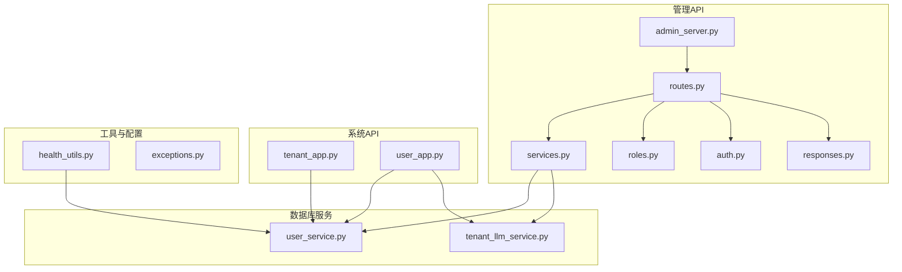
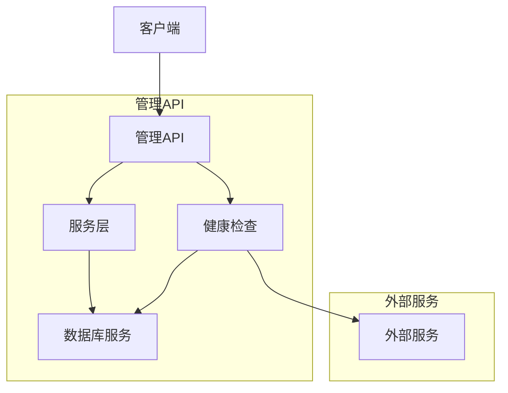
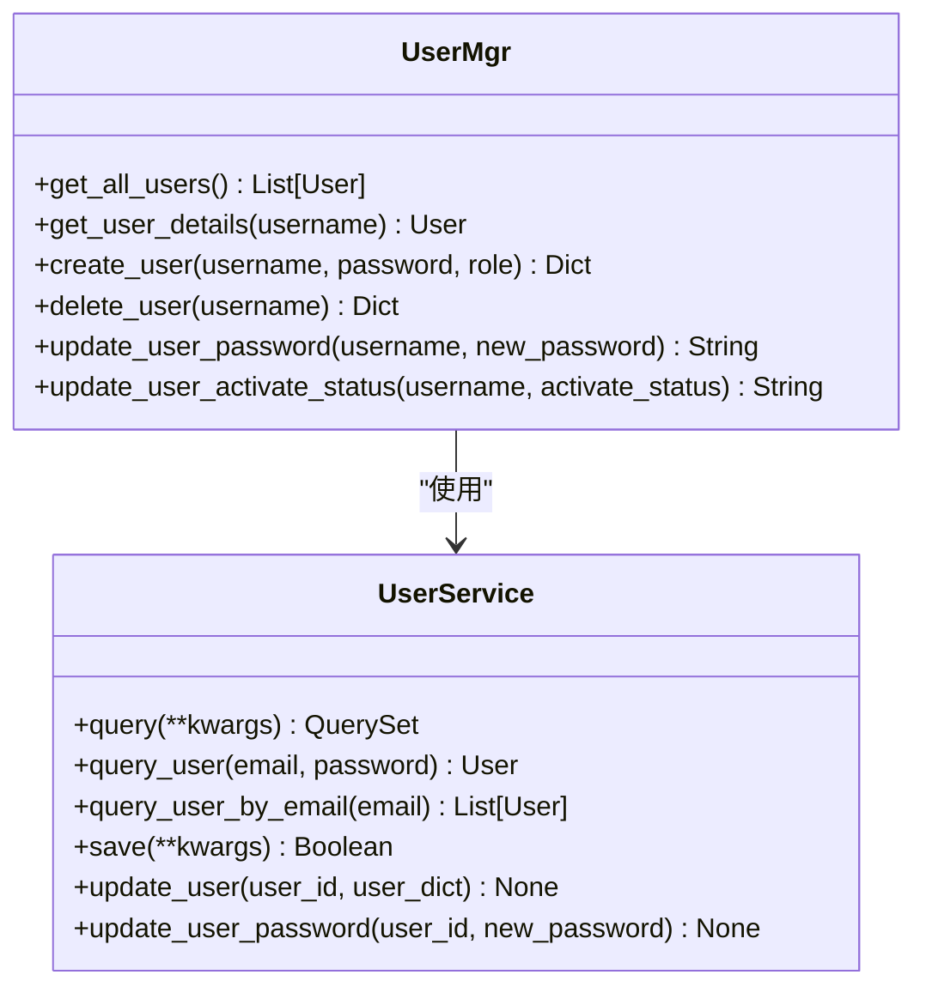
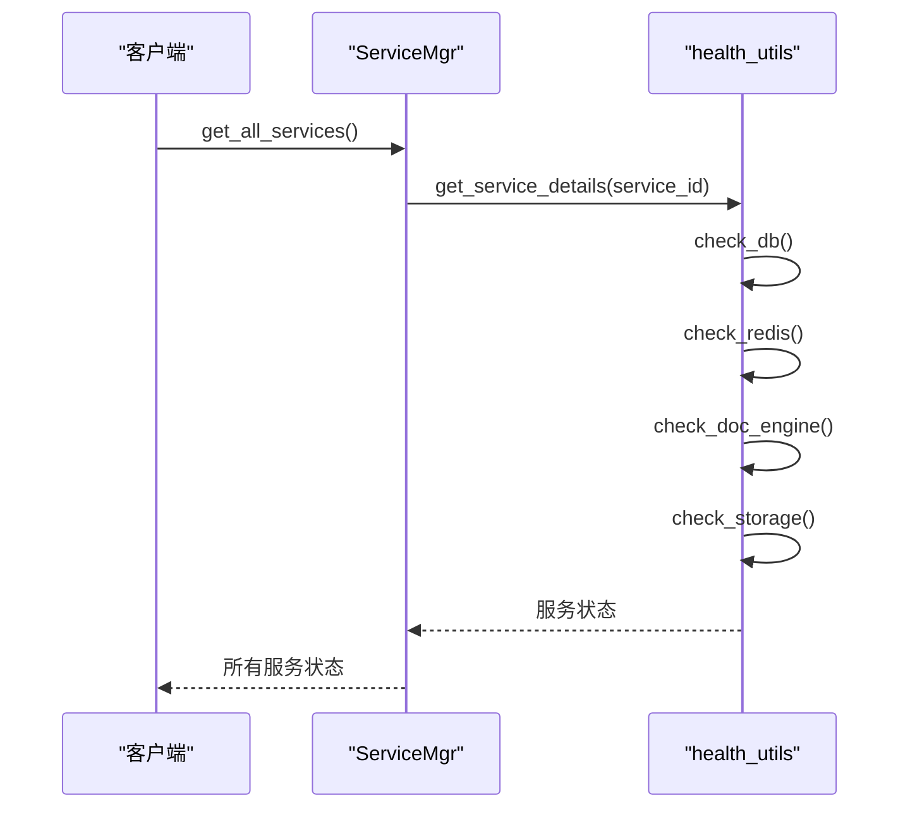
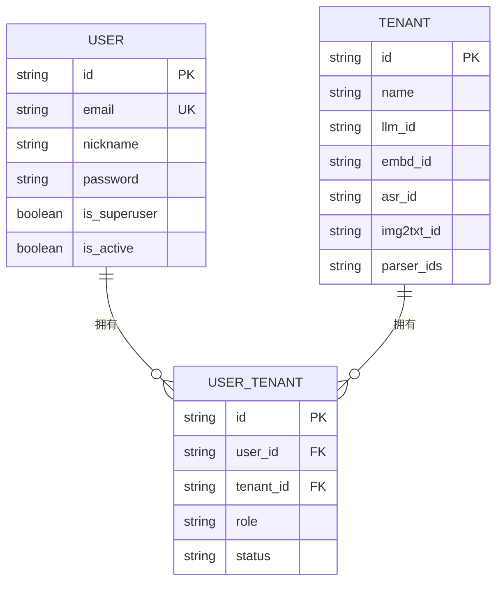
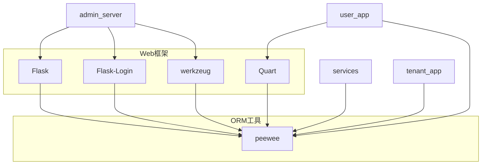

# 系统与管理API

<cite>
**本文档引用的文件**   
- [admin_server.py](file://admin/server/admin_server.py)
- [routes.py](file://admin/server/routes.py)
- [services.py](file://admin/server/services.py)
- [roles.py](file://admin/server/roles.py)
- [auth.py](file://admin/server/auth.py)
- [responses.py](file://admin/server/responses.py)
- [health_utils.py](file://api/utils/health_utils.py)
- [tenant_app.py](file://api/apps/tenant_app.py)
- [user_app.py](file://api/apps/user_app.py)
- [user_service.py](file://api/db/services/user_service.py)
- [tenant_llm_service.py](file://api/db/services/tenant_llm_service.py)
- [exceptions.py](file://api/common/exceptions.py)
</cite>

## 目录
1. [简介](#简介)
2. [项目结构](#项目结构)
3. [核心组件](#核心组件)
4. [架构概述](#架构概述)
5. [详细组件分析](#详细组件分析)
6. [依赖分析](#依赖分析)
7. [性能考虑](#性能考虑)
8. [故障排除指南](#故障排除指南)
9. [结论](#结论)
10. [附录](#附录) (如有必要)

## 简介
本文档详细介绍了RAGFlow系统的管理API，涵盖租户管理、用户管理、服务状态监控和系统配置。文档详细记录了用于管理用户、角色、租户配额的端点，以及查询系统健康状况、资源使用情况的监控接口。解释了这些API在多租户环境下的作用范围和权限控制，并提供了通过API进行自动化运维和健康检查的实践指南。

## 项目结构
RAGFlow项目的管理API主要位于`admin/server`目录下，包括服务器启动、路由定义、服务管理、角色权限控制等核心功能。系统API则分布在`api/apps`目录下，处理用户、租户、认证等业务逻辑。数据库服务位于`api/db/services`目录，提供数据持久化支持。

**图表来源**
- [admin_server.py](file://admin/server/admin_server.py#L1-L83)
- [routes.py](file://admin/server/routes.py#L1-L383)
- [services.py](file://admin/server/services.py#L1-L228)
- [tenant_app.py](file://api/apps/tenant_app.py#L1-L140)
- [user_app.py](file://api/apps/user_app.py#L1-L800)

**章节来源**
- [admin_server.py](file://admin/server/admin_server.py#L1-L83)
- [routes.py](file://admin/server/routes.py#L1-L383)
- [services.py](file://admin/server/services.py#L1-L228)
- [tenant_app.py](file://api/apps/tenant_app.py#L1-L140)
- [user_app.py](file://api/apps/user_app.py#L1-L800)

## 核心组件

管理API的核心组件包括`admin_server.py`作为服务入口，`routes.py`定义所有管理端点，`services.py`提供用户、服务、租户管理服务，`roles.py`处理角色权限管理，`auth.py`负责认证和授权。系统API通过`tenant_app.py`和`user_app.py`提供租户和用户管理功能，`user_service.py`和`tenant_llm_service.py`提供底层数据服务。

**章节来源**
- [admin_server.py](file://admin/server/admin_server.py#L1-L83)
- [routes.py](file://admin/server/routes.py#L1-L383)
- [services.py](file://admin/server/services.py#L1-L228)
- [roles.py](file://admin/server/roles.py#L1-L77)
- [auth.py](file://admin/server/auth.py#L1-L189)
- [tenant_app.py](file://api/apps/tenant_app.py#L1-L140)
- [user_app.py](file://api/apps/user_app.py#L1-L800)

## 架构概述

RAGFlow管理API采用分层架构，前端通过HTTP请求与管理API交互，管理API通过Flask框架处理请求，调用相应的服务类进行业务逻辑处理，服务类再调用数据库服务进行数据持久化。系统API与管理API共享数据库服务，但通过不同的应用类处理不同的业务逻辑。

**图表来源**
- [admin_server.py](file://admin/server/admin_server.py#L1-L83)
- [routes.py](file://admin/server/routes.py#L1-L383)
- [services.py](file://admin/server/services.py#L1-L228)
- [health_utils.py](file://api/utils/health_utils.py#L1-L223)

## 详细组件分析

### 用户管理分析
用户管理功能通过`UserMgr`类实现，提供创建、删除、查询、修改用户信息等操作。用户信息存储在数据库中，通过`UserService`进行持久化。用户密码采用哈希存储，确保安全性。

**图表来源**
- [services.py](file://admin/server/services.py#L32-L137)
- [user_service.py](file://api/db/services/user_service.py#L33-L166)

### 服务监控分析
服务监控功能通过`ServiceMgr`类实现，提供获取所有服务状态、获取特定服务详情等操作。监控信息通过`health_utils.py`中的函数获取，包括数据库、Redis、文档引擎、存储等组件的健康状态。

**图表来源**
- [services.py](file://admin/server/services.py#L178-L228)
- [health_utils.py](file://api/utils/health_utils.py#L29-L223)

### 租户管理分析
租户管理功能通过`TenantService`类实现，提供租户信息查询、租户成员管理等操作。租户与用户通过`UserTenantService`建立多对多关系，支持多租户环境下的权限控制。

**图表来源**
- [user_service.py](file://api/db/services/user_service.py#L168-L320)
- [tenant_app.py](file://api/apps/tenant_app.py#L1-L140)

## 依赖分析

管理API与系统API共享数据库服务，但通过不同的应用类处理不同的业务逻辑。管理API主要依赖`Flask`、`Flask-Login`等Web框架，系统API依赖`Quart`异步框架。两者都依赖`peewee`作为ORM工具，与数据库进行交互。

**图表来源**
- [admin_server.py](file://admin/server/admin_server.py#L1-L83)
- [user_app.py](file://api/apps/user_app.py#L1-L800)
- [services.py](file://admin/server/services.py#L1-L228)
- [tenant_app.py](file://api/apps/tenant_app.py#L1-L140)

**章节来源**
- [admin_server.py](file://admin/server/admin_server.py#L1-L83)
- [user_app.py](file://api/apps/user_app.py#L1-L800)
- [services.py](file://admin/server/services.py#L1-L228)
- [tenant_app.py](file://api/apps/tenant_app.py#L1-L140)

## 性能考虑

管理API的性能主要受数据库查询和外部服务调用的影响。建议定期优化数据库索引，减少不必要的查询。对于外部服务调用，应设置合理的超时时间，避免阻塞主线程。在高并发场景下，可考虑使用缓存机制，减少数据库压力。

## 故障排除指南

当管理API出现故障时，首先检查服务日志，定位错误信息。常见的问题包括数据库连接失败、Redis连接失败、外部服务不可用等。可通过调用健康检查接口`/api/v1/admin/services`获取系统各组件的健康状态，根据返回信息进行排查。

**章节来源**
- [health_utils.py](file://api/utils/health_utils.py#L29-L223)
- [services.py](file://admin/server/services.py#L178-L228)

## 结论

RAGFlow的管理API提供了完善的系统管理功能，包括用户管理、服务监控、租户管理等。通过合理的架构设计和权限控制，确保了系统的安全性和可维护性。结合自动化运维和健康检查实践，可以有效提升系统的稳定性和可靠性。