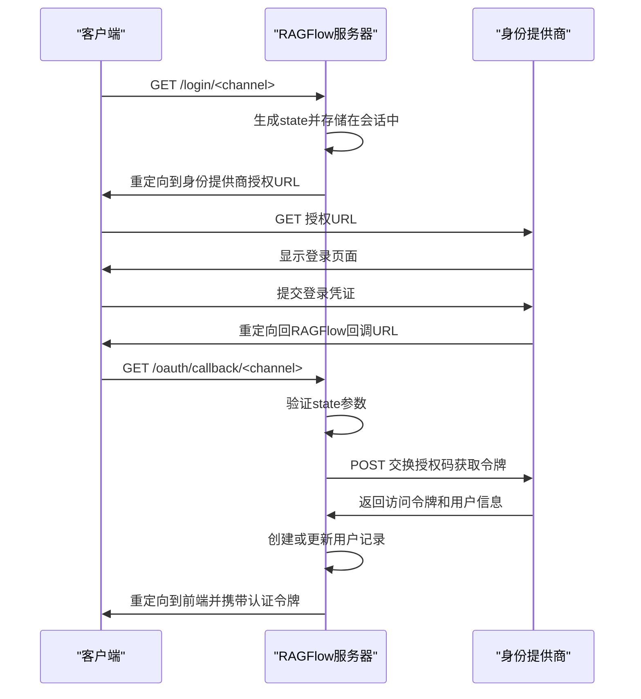
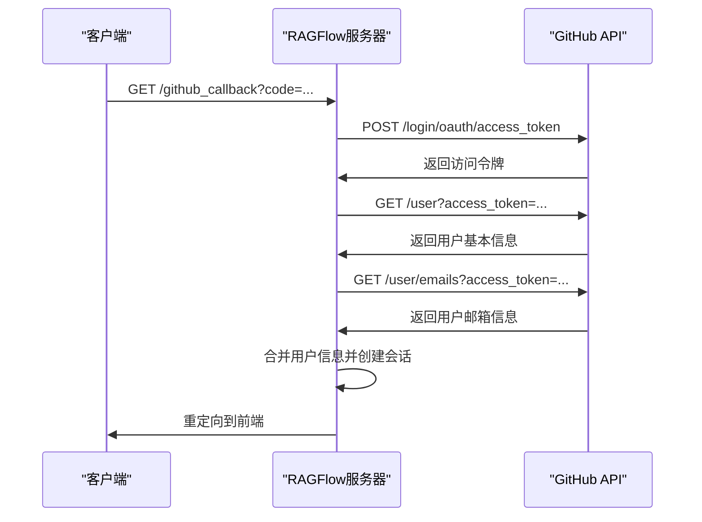
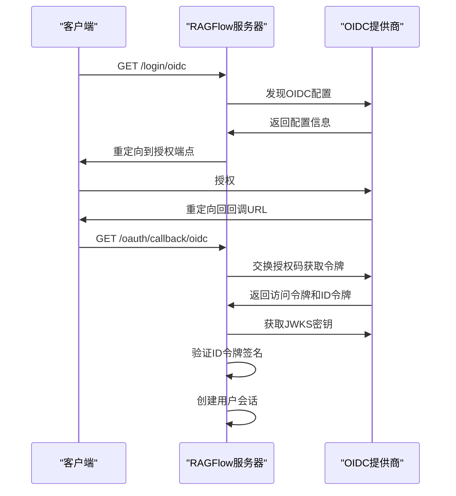
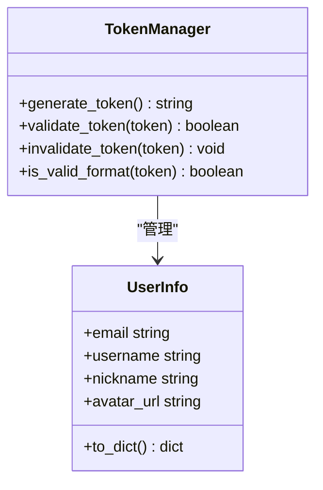

# 认证API

<cite>
**本文档中引用的文件**  
- [user_app.py](file://api/apps/user_app.py)
- [auth.py](file://api/apps/auth/__init__.py)
- [oauth.py](file://api/apps/auth/oauth.py)
- [oidc.py](file://api/apps/auth/oidc.py)
- [github.py](file://api/apps/auth/github.py)
- [settings.py](file://common/settings.py)
- [auth.py](file://admin/server/auth.py)
</cite>

## 目录
1. [简介](#简介)
2. [认证端点](#认证端点)
3. [认证流程](#认证流程)
4. [令牌管理](#令牌管理)
5. [客户端集成](#客户端集成)
6. [安全最佳实践](#安全最佳实践)

## 简介
RAGFlow提供了一套完整的用户身份验证和授权系统，支持多种认证方式，包括本地账户登录、OAuth2、OpenID Connect (OIDC) 和 GitHub 登录。本文档详细介绍了所有与用户认证相关的API端点、认证流程、令牌管理机制以及安全最佳实践。

认证系统的核心功能包括：
- 多种第三方身份提供商的集成
- 统一的用户信息处理
- 基于JWT的会话管理
- 安全的令牌生成和验证机制

**Section sources**
- [user_app.py](file://api/apps/user_app.py#L64-L800)
- [auth.py](file://api/apps/auth/__init__.py#L1-L41)

## 认证端点

### 本地登录端点
`/api/v1/user/login` 端点用于处理用户的本地账户登录。

**HTTP方法**: POST

**请求头**:
- `Content-Type: application/json`

**请求体**:
```json
{
  "email": "string",
  "password": "string"
}
```

**响应体**:
- 成功 (200): 返回用户信息和认证令牌
- 失败 (401): 返回认证错误信息

### 获取认证渠道
`/api/v1/user/login/channels` 端点返回系统支持的所有认证渠道。

**HTTP方法**: GET

**响应体**:
```json
[
  {
    "channel": "string",
    "display_name": "string",
    "icon": "string"
  }
]
```

### OAuth/OIDC登录
`/api/v1/user/login/<channel>` 端点用于启动特定渠道的OAuth/OIDC认证流程。

**HTTP方法**: GET

**路径参数**:
- `channel`: 认证渠道名称

### OAuth/OIDC回调
`/api/v1/user/oauth/callback/<channel>` 端点处理来自第三方身份提供商的回调。

**HTTP方法**: GET

**查询参数**:
- `code`: 来自身份提供商的授权码
- `state`: 用于防止CSRF攻击的状态参数

### GitHub登录
`/api/v1/user/github_callback` 端点处理GitHub OAuth回调（已弃用，建议使用通用OAuth回调）。

**HTTP方法**: GET

### 用户登出
`/api/v1/user/logout` 端点用于用户登出。

**HTTP方法**: GET

**安全要求**:
- 需要有效的认证令牌

**响应体**:
- 成功 (200): 返回登出成功信息

### 用户信息
`/api/v1/user/info` 端点获取当前登录用户的信息。

**HTTP方法**: GET

**安全要求**:
- 需要有效的认证令牌

**响应体**:
```json
{
  "id": "string",
  "nickname": "string",
  "email": "string"
}
```

**Section sources**
- [user_app.py](file://api/apps/user_app.py#L64-L505)
- [settings.py](file://common/settings.py#L229-L238)

## 认证流程

### 标准认证流程
RAGFlow的认证流程遵循标准的OAuth2和OIDC协议，具体步骤如下：



**Diagram sources**
- [user_app.py](file://api/apps/user_app.py#L161-L266)
- [oauth.py](file://api/apps/auth/oauth.py#L48-L62)

### GitHub认证流程
GitHub认证流程与其他OAuth2提供商类似，但有特定的实现细节：



**Diagram sources**
- [user_app.py](file://api/apps/user_app.py#L269-L354)
- [github.py](file://api/apps/auth/github.py#L35-L88)

### OIDC认证流程
OIDC认证流程在标准OAuth2基础上增加了ID令牌验证：



**Diagram sources**
- [oidc.py](file://api/apps/auth/oidc.py#L22-L107)
- [user_app.py](file://api/apps/user_app.py#L174-L266)

## 令牌管理

### 令牌生成
RAGFlow使用UUID作为访问令牌，确保令牌的唯一性和安全性。



**Diagram sources**
- [user_app.py](file://api/apps/user_app.py#L124-L128)
- [auth.py](file://admin/server/auth.py#L41-L68)

### 令牌验证
令牌验证通过以下步骤进行：

1. 从Authorization头提取JWT令牌
2. 使用SECRET_KEY解码JWT
3. 验证令牌格式（必须是32个字符的UUID）
4. 查询数据库验证用户状态和令牌有效性

### 令牌失效
用户登出时，系统会将当前访问令牌标记为无效，并生成新的无效令牌：

```python
current_user.access_token = f"INVALID_{secrets.token_hex(16)}"
current_user.save()
```

**Section sources**
- [user_app.py](file://api/apps/user_app.py#L486-L505)
- [auth.py](file://admin/server/auth.py#L41-L68)

## 客户端集成

### 集成步骤
1. 调用`/login/channels`获取支持的认证渠道
2. 根据用户选择的渠道，重定向到相应的登录端点
3. 处理回调，提取认证令牌
4. 使用令牌访问受保护的API端点

### 示例代码
```javascript
// 获取认证渠道
export const getLoginChannels = () => request.get(api.login_channels);

// 使用特定渠道登录
export const loginWithChannel = (channel) =>
  (window.location.href = api.login_channel(channel));
```

**Section sources**
- [user_app.py](file://api/apps/user_app.py#L140-L158)
- [user-service.ts](file://web/src/services/user-service.ts#L129-L154)

## 安全最佳实践

### 配置安全
- 确保`SECRET_KEY`的安全性
- 定期轮换第三方身份提供商的密钥
- 限制回调URL的域名

### 会话安全
- 使用HTTPS保护所有认证相关的通信
- 设置合理的会话超时时间
- 实现安全的令牌存储机制

### 输入验证
- 验证所有回调参数
- 验证邮箱地址格式
- 防止重复注册

### 错误处理
- 提供有意义的错误信息
- 记录认证失败日志用于安全审计
- 实现失败尝试限制机制

**Section sources**
- [settings.py](file://common/settings.py#L225-L226)
- [auth.py](file://admin/server/auth.py#L38-L70)
- [user_app.py](file://api/apps/user_app.py#L709-L715)