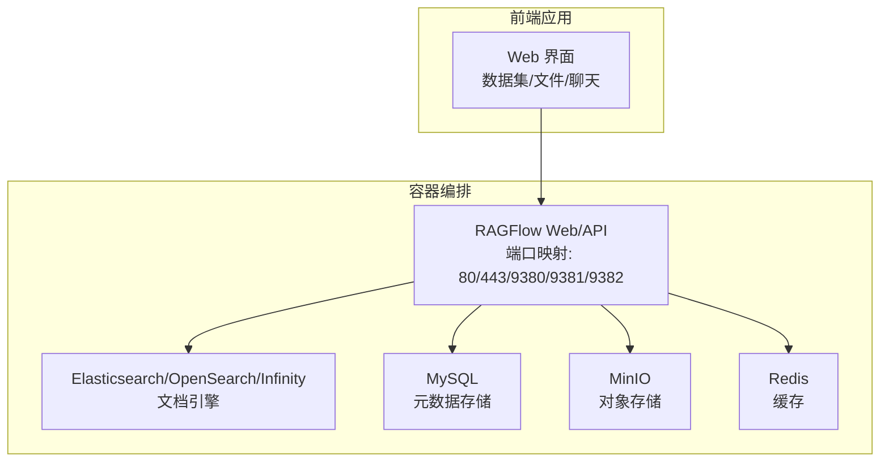
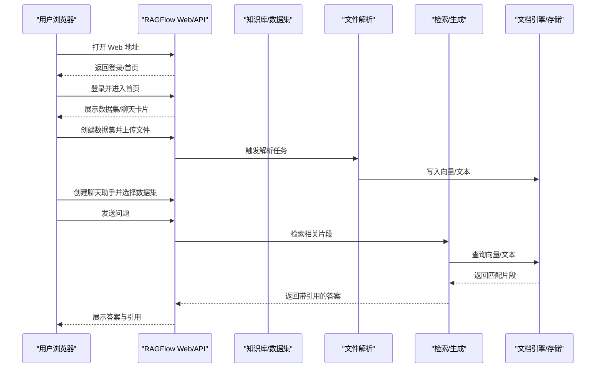
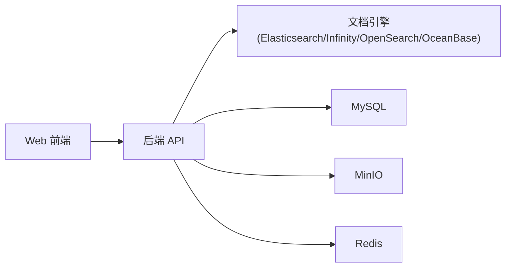

# 快速入门

<cite>
**本文引用的文件**
- [README.md](file://README.md)
- [docs/quickstart.mdx](file://docs/quickstart.mdx)
- [docs/guides/accessing_admin_ui.md](file://docs/guides/accessing_admin_ui.md)
- [docs/guides/manage_files.md](file://docs/guides/manage_files.md)
- [docs/guides/run_health_check.md](file://docs/guides/run_health_check.md)
- [docs/develop/launch_ragflow_from_source.md](file://docs/develop/launch_ragflow_from_source.md)
- [docker/docker-compose.yml](file://docker/docker-compose.yml)
- [docker/.env](file://docker/.env)
- [docker/service_conf.yaml.template](file://docker/service_conf.yaml.template)
- [web/src/pages/home/index.tsx](file://web/src/pages/home/index.tsx)
- [web/src/pages/datasets/index.tsx](file://web/src/pages/datasets/index.tsx)
- [web/src/pages/next-chats/index.tsx](file://web/src/pages/next-chats/index.tsx)
</cite>

## 目录
1. [简介](#简介)
2. [项目结构](#项目结构)
3. [核心组件](#核心组件)
4. [架构总览](#架构总览)
5. [详细组件分析](#详细组件分析)
6. [依赖关系分析](#依赖关系分析)
7. [性能与资源建议](#性能与资源建议)
8. [故障排查指南](#故障排查指南)
9. [结论](#结论)
10. [附录](#附录)

## 简介
本指南面向首次接触 RAGFlow 的用户，帮助你从零开始完成环境准备、服务启动、Web 界面操作，并成功创建第一个知识库、上传文档、进行简单问答。内容基于仓库内的官方文档与 Docker 部署脚本，确保步骤可复现且适合非深度技术背景的用户。

## 项目结构
RAGFlow 采用前后端分离与容器化部署方案：
- 后端服务：API 服务器、任务执行器、MCP 服务等（由 Docker Compose 编排）
- 前端界面：基于 React 的 Web 应用，提供数据集管理、文件管理、聊天对话等功能
- 数据与存储：Elasticsearch 或 Infinity 作为文档引擎；MySQL 存储元数据；MinIO 提供对象存储；Redis 缓存
- 配置：通过 .env 和 service_conf.yaml.template 控制服务端口、模型工厂、存储与文档引擎等

图表来源
- [docker/docker-compose.yml](file://docker/docker-compose.yml#L1-L135)
- [docker/.env](file://docker/.env#L1-L245)
- [docker/service_conf.yaml.template](file://docker/service_conf.yaml.template#L1-L154)

章节来源
- [README.md](file://README.md#L142-L250)
- [docs/quickstart.mdx](file://docs/quickstart.mdx#L38-L243)

## 核心组件
- 容器编排与服务
  - RAGFlow Web/API 服务：对外提供 Web 界面与 HTTP API，端口在 .env 中定义
  - 文档引擎：默认 Elasticsearch，也可切换为 Infinity、OpenSearch 或 OceanBase
  - 元数据存储：MySQL
  - 对象存储：MinIO
  - 缓存：Redis
- 前端组件
  - 首页与导航：展示数据集与应用卡片
  - 数据集列表：创建、重命名、分页浏览
  - 聊天应用列表：创建、重命名、分页浏览
- 配置文件
  - .env：控制文档引擎类型、设备模式、端口、嵌入模型镜像与端口等
  - service_conf.yaml.template：后端服务连接信息与默认模型设置

章节来源
- [docker/docker-compose.yml](file://docker/docker-compose.yml#L1-L135)
- [docker/.env](file://docker/.env#L1-L245)
- [docker/service_conf.yaml.template](file://docker/service_conf.yaml.template#L1-L154)
- [web/src/pages/home/index.tsx](file://web/src/pages/home/index.tsx#L1-L18)
- [web/src/pages/datasets/index.tsx](file://web/src/pages/datasets/index.tsx#L1-L155)
- [web/src/pages/next-chats/index.tsx](file://web/src/pages/next-chats/index.tsx#L1-L126)

## 架构总览
下图展示了从浏览器访问到后端服务、再到各依赖组件的数据流与交互关系。

图表来源
- [docs/quickstart.mdx](file://docs/quickstart.mdx#L244-L357)
- [docker/docker-compose.yml](file://docker/docker-compose.yml#L1-L135)
- [docker/service_conf.yaml.template](file://docker/service_conf.yaml.template#L1-L154)

## 详细组件分析

### 一、环境准备与服务启动（Docker 快速部署）
- 系统要求与前置条件
  - CPU ≥ 4 核；内存 ≥ 16 GB；磁盘 ≥ 50 GB；Docker ≥ 24.0.0 与 Docker Compose ≥ v2.26.1
  - Linux 需设置 vm.max_map_count 至少为 262144，否则可能无法连接 ES 集群
- 获取并启动服务
  - 进入 docker 目录，使用预构建镜像启动服务
  - 可选：启用 GPU 加速（需在 .env 中设置 DEVICE=gpu）
  - 查看日志确认服务已就绪后再访问 Web
- 访问 Web 界面
  - 默认地址为 http://IP_OF_YOUR_MACHINE（若未修改端口，HTTP 80 可省略）

章节来源
- [README.md](file://README.md#L144-L250)
- [docs/quickstart.mdx](file://docs/quickstart.mdx#L38-L243)
- [docker/docker-compose.yml](file://docker/docker-compose.yml#L1-L135)
- [docker/.env](file://docker/.env#L1-L245)

### 二、配置 LLM 与嵌入模型
- 在 Web 界面中配置模型提供商与 API Key
- 在“系统模型设置”中选择默认聊天模型、嵌入模型、图像转文本模型等
- 若使用本地模型或第三方服务，请参考对应文档

章节来源
- [docs/quickstart.mdx](file://docs/quickstart.mdx#L244-L357)
- [docker/service_conf.yaml.template](file://docker/service_conf.yaml.template#L1-L154)

### 三、创建第一个知识库（数据集）
- 步骤概览
  - 进入“数据集”页面，点击“创建数据集”
  - 输入名称并确认
  - 进入“配置”页面，选择嵌入模型与分块模板
  - 注意：一旦选定嵌入模型，不可更改
- 前端入口
  - 首页卡片区域包含“数据集”入口
  - 数据集列表页支持搜索、筛选与分页

章节来源
- [docs/quickstart.mdx](file://docs/quickstart.mdx#L267-L300)
- [web/src/pages/home/index.tsx](file://web/src/pages/home/index.tsx#L1-L18)
- [web/src/pages/datasets/index.tsx](file://web/src/pages/datasets/index.tsx#L1-L155)

### 四、上传文档并进行文件解析
- 上传文件
  - 在数据集页面点击“添加文件”，选择本地文件
  - 支持多种格式：PDF、DOC、DOCX、TXT、MD、MDX、CSV、XLSX、图片、PPT/PPTX 等
- 解析与干预
  - 点击文件条目，查看分块结果
  - 可悬停查看快照，双击编辑关键词或问题以提升检索权重
  - 使用“检索测试”输入问题验证配置是否正确

章节来源
- [docs/quickstart.mdx](file://docs/quickstart.mdx#L267-L325)
- [docs/guides/manage_files.md](file://docs/guides/manage_files.md#L1-L91)

### 五、建立 AI 聊天助手并进行问答
- 创建聊天助手
  - 进入“聊天”页面，点击“创建聊天”
  - 设置助手名称并选择数据集
  - 可配置“空响应提示”：为空则统一返回设定内容，否则允许自由回答（可能产生幻觉）
  - 选择聊天模型
- 开始问答
  - 在聊天界面输入问题，系统会检索相关片段并返回带引用的答案

章节来源
- [docs/quickstart.mdx](file://docs/quickstart.mdx#L326-L357)
- [web/src/pages/next-chats/index.tsx](file://web/src/pages/next-chats/index.tsx#L1-L126)

### 六、Admin UI 与健康检查
- 访问 Admin UI
  - 在 Web 地址后追加 /admin，使用默认账号登录
- 系统状态监控
  - 通过头像菜单进入“系统”页面，查看服务状态
  - 也可调用健康检查接口：/v1/system/healthz，返回 200 表示全部依赖健康，500 表示存在异常

章节来源
- [docs/guides/accessing_admin_ui.md](file://docs/guides/accessing_admin_ui.md#L1-L51)
- [docs/guides/run_health_check.md](file://docs/guides/run_health_check.md#L1-L110)

### 七、从源码启动（开发调试）
- 安装依赖与启动基础服务
  - 使用 uv 安装 Python 依赖
  - 启动 docker-compose-base.yml 中的基础服务（MinIO、Elasticsearch/Infinity、Redis、MySQL）
  - 在 /etc/hosts 中添加解析项，使 service_conf.yaml.template 中的主机名指向 127.0.0.1
- 启动后端与前端
  - 后端：运行入口脚本启动任务执行器与 API 服务
  - 前端：在 web 目录安装依赖并启动开发服务器
- 停止服务
  - 开发完成后，按进程名停止前端与后端服务

章节来源
- [docs/develop/launch_ragflow_from_source.md](file://docs/develop/launch_ragflow_from_source.md#L1-L148)

## 依赖关系分析
- 组件耦合
  - Web 前端依赖后端 API；后端依赖文档引擎、数据库、对象存储与缓存
  - 文档引擎可切换为 Elasticsearch、Infinity、OpenSearch 或 OceanBase
- 端口与网络
  - Web/API 服务端口在 .env 中集中配置，docker-compose.yml 将宿主机端口映射到容器
- 外部依赖
  - LLM 与嵌入模型可通过外部服务或本地部署提供
  - 如无法访问 HuggingFace，可在环境变量中设置镜像站点

图表来源
- [docker/docker-compose.yml](file://docker/docker-compose.yml#L1-L135)
- [docker/.env](file://docker/.env#L1-L245)
- [docker/service_conf.yaml.template](file://docker/service_conf.yaml.template#L1-L154)

章节来源
- [docker/docker-compose.yml](file://docker/docker-compose.yml#L1-L135)
- [docker/.env](file://docker/.env#L1-L245)
- [docker/service_conf.yaml.template](file://docker/service_conf.yaml.template#L1-L154)

## 性能与资源建议
- 系统资源
  - 建议 CPU ≥ 4 核、内存 ≥ 16 GB、磁盘 ≥ 50 GB
  - 若使用 GPU 加速 DeepDoc 任务，可在 .env 中设置 DEVICE=gpu 并确保宿主机具备 NVIDIA 驱动
- 文档引擎
  - 默认使用 Elasticsearch；如需更高吞吐或更灵活的查询，可切换至 Infinity
- 嵌入模型
  - 通过 .env 中的 TEI_* 配置项选择嵌入模型与端口，注意不同模型对显存/内存的要求差异较大

章节来源
- [README.md](file://README.md#L144-L250)
- [docs/quickstart.mdx](file://docs/quickstart.mdx#L38-L243)
- [docker/.env](file://docker/.env#L1-L245)

## 故障排查指南
- 无法连接 ES 集群
  - 检查 vm.max_map_count 是否达到 262144，必要时持久化配置
- Web 页面显示“网络异常”
  - 确认服务已完全初始化后再访问，查看容器日志确认启动完成
- 健康检查失败
  - 使用 /v1/system/healthz 接口查看具体依赖状态，定位数据库、缓存、文档引擎或存储的问题
- 文件解析卡住
  - 参考 FAQ：解析卡在极低百分比或接近完成时的常见原因与处理方法

章节来源
- [docs/quickstart.mdx](file://docs/quickstart.mdx#L38-L243)
- [docs/guides/run_health_check.md](file://docs/guides/run_health_check.md#L1-L110)

## 结论
通过本快速入门，你已经完成了从环境准备、Docker 启动、LLM 配置，到创建知识库、上传文档、进行问答的全流程实践。建议在掌握基础操作后，继续探索 Admin UI、健康监控、文件管理与多数据集联动等高级功能，逐步将 RAGFlow 集成到你的业务场景中。

## 附录
- 常用端口与服务
  - Web/API：80/443/9380/9381/9382（可在 .env 中调整）
  - 文档引擎：Elasticsearch/Infinity/OpenSearch/OceanBase
  - 数据库：MySQL
  - 对象存储：MinIO
  - 缓存：Redis
- 快速命令摘要
  - 进入 docker 目录，使用 docker compose 启动服务
  - 查看日志确认服务就绪
  - 在浏览器访问 http://IP_OF_YOUR_MACHINE
  - 在 Admin UI 中查看系统状态与用户管理

章节来源
- [docker/docker-compose.yml](file://docker/docker-compose.yml#L1-L135)
- [docker/.env](file://docker/.env#L1-L245)
- [docs/guides/accessing_admin_ui.md](file://docs/guides/accessing_admin_ui.md#L1-L51)