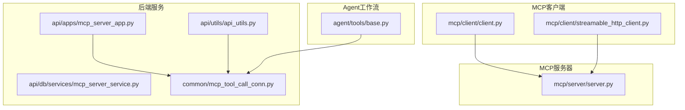
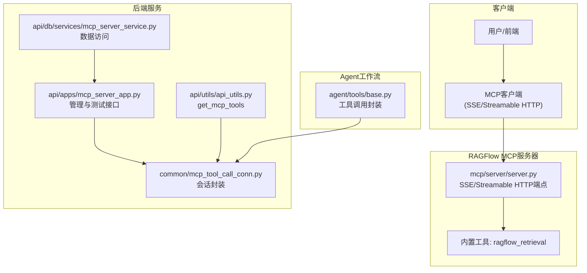
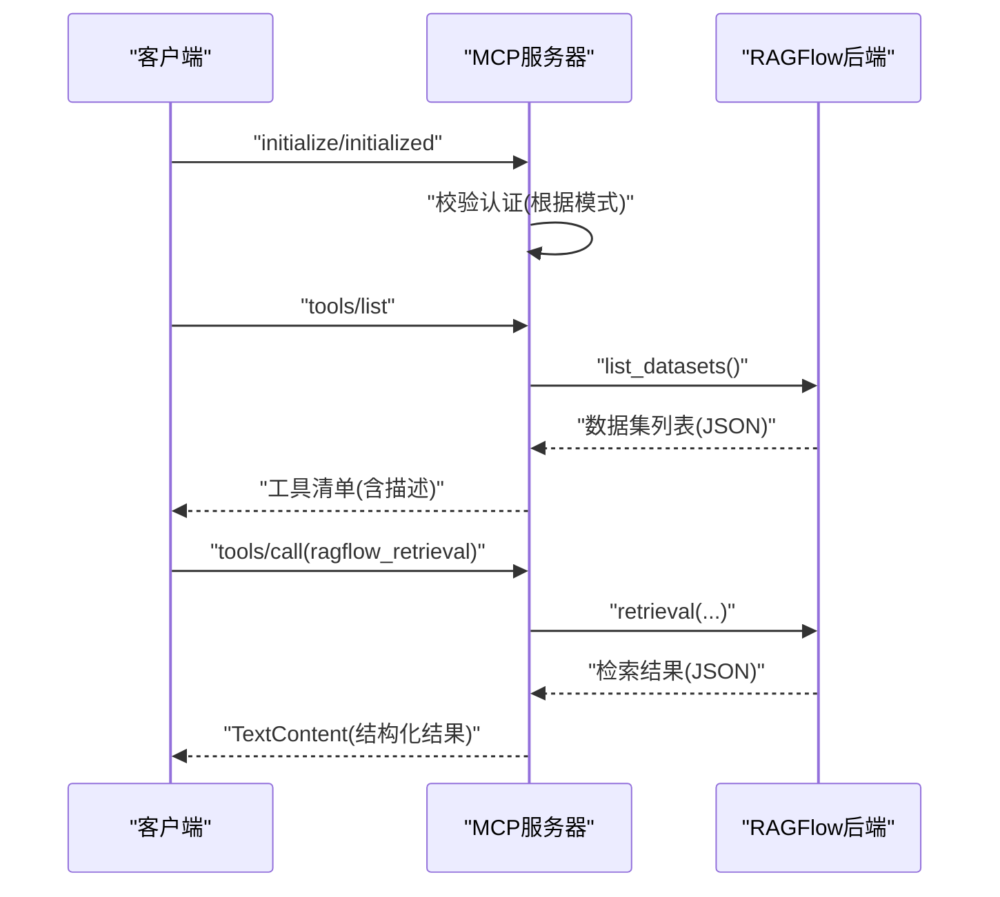
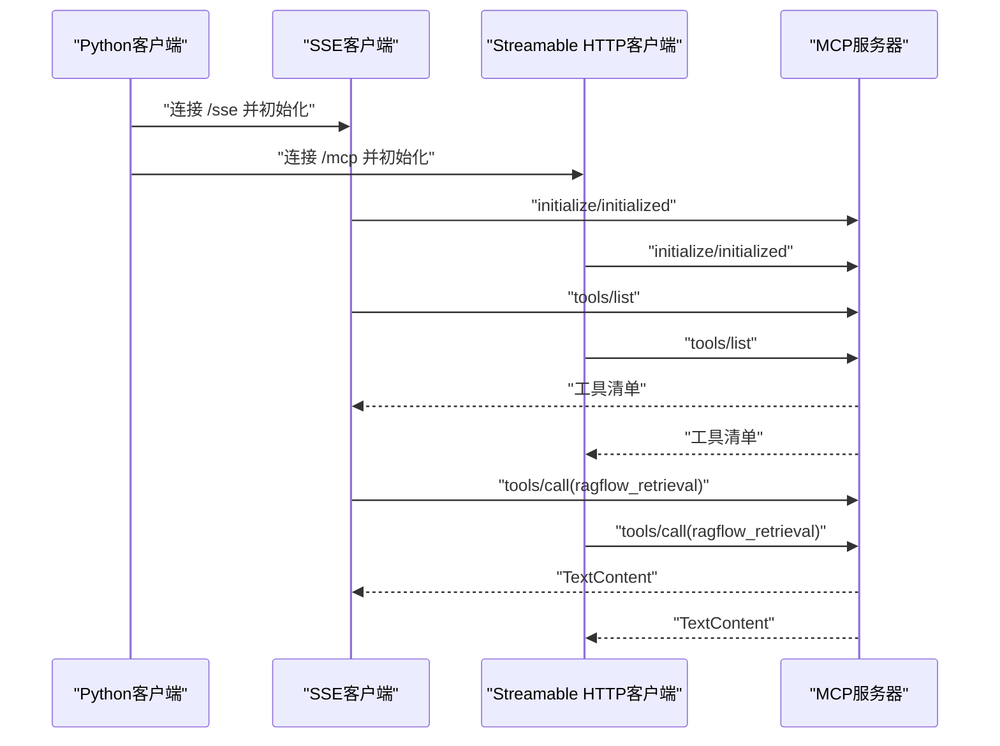
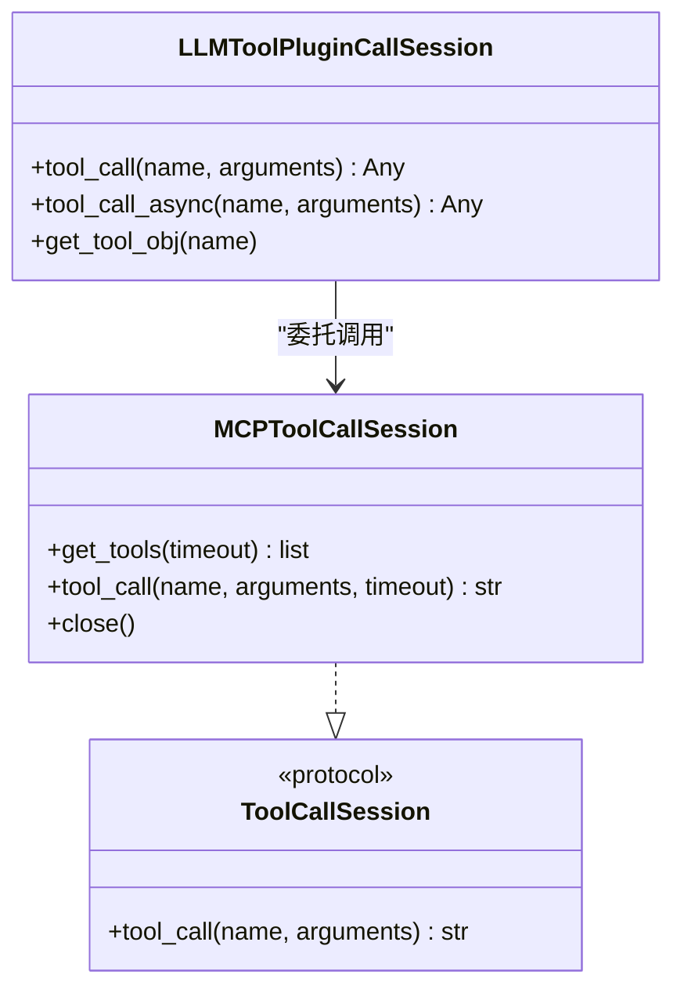
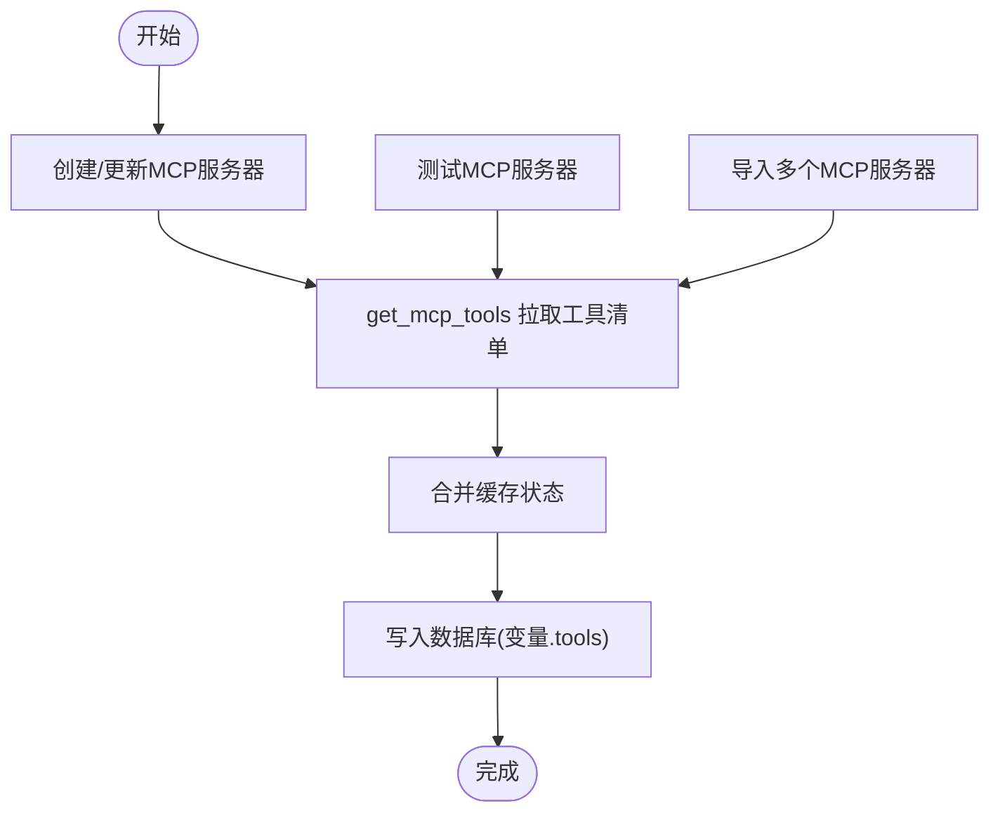
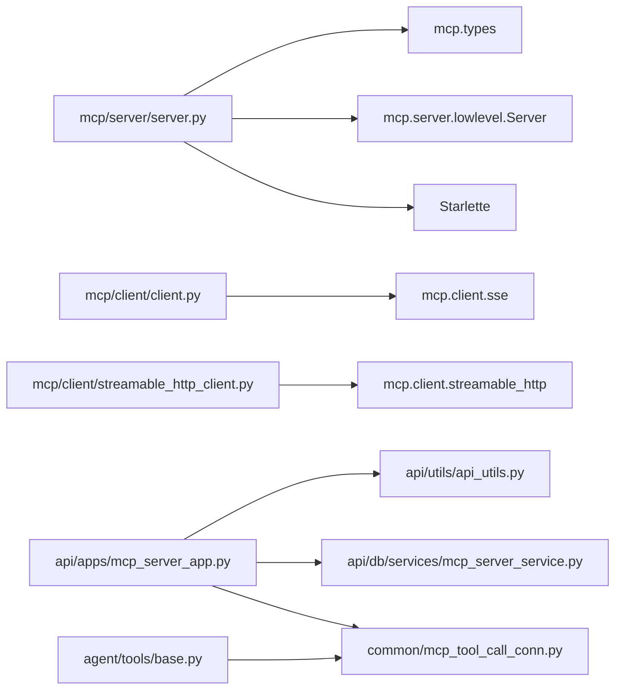

# MCP集成

<cite>
**本文引用的文件**
- [mcp/server/server.py](file://mcp/server/server.py)
- [mcp/client/client.py](file://mcp/client/client.py)
- [mcp/client/streamable_http_client.py](file://mcp/client/streamable_http_client.py)
- [docs/develop/mcp/launch_mcp_server.md](file://docs/develop/mcp/launch_mcp_server.md)
- [docs/develop/mcp/mcp_client_example.md](file://docs/develop/mcp/mcp_client_example.md)
- [docs/develop/mcp/mcp_tools.md](file://docs/develop/mcp/mcp_tools.md)
- [common/mcp_tool_call_conn.py](file://common/mcp_tool_call_conn.py)
- [api/apps/mcp_server_app.py](file://api/apps/mcp_server_app.py)
- [api/db/services/mcp_server_service.py](file://api/db/services/mcp_server_service.py)
- [api/utils/api_utils.py](file://api/utils/api_utils.py)
- [agent/tools/base.py](file://agent/tools/base.py)
</cite>

## 目录
1. [简介](#简介)
2. [项目结构](#项目结构)
3. [核心组件](#核心组件)
4. [架构总览](#架构总览)
5. [详细组件分析](#详细组件分析)
6. [依赖关系分析](#依赖关系分析)
7. [性能与可用性](#性能与可用性)
8. [故障排查指南](#故障排查指南)
9. [结论](#结论)
10. [附录：端到端示例](#附录端到端示例)

## 简介
本指南面向希望在RAGFlow中集成并使用MCP（Model Context Protocol）的开发者与运维人员。文档围绕以下目标展开：
- 详解RAGFlow MCP服务器的启动与配置，说明其作为外部工具标准化接口网关的工作方式
- 解释MCP客户端的使用方式，包括基于流式HTTP的通信能力
- 结合开发文档，说明如何定义与注册MCP工具，以及如何在RAGFlow的Agent工作流中调用这些工具
- 提供从开发MCP工具服务到在RAGFlow中集成并调用的完整端到端示例

## 项目结构
RAGFlow的MCP相关代码主要分布在如下位置：
- MCP服务器：mcp/server/server.py
- MCP客户端示例：mcp/client/client.py、mcp/client/streamable_http_client.py
- 开发文档：docs/develop/mcp/*
- 后端管理与工具调用桥接：common/mcp_tool_call_conn.py、api/apps/mcp_server_app.py、api/utils/api_utils.py、api/db/services/mcp_server_service.py
- Agent侧工具封装与调用：agent/tools/base.py

图表来源
- [mcp/server/server.py](file://mcp/server/server.py#L1-L120)
- [mcp/client/client.py](file://mcp/client/client.py#L1-L48)
- [mcp/client/streamable_http_client.py](file://mcp/client/streamable_http_client.py#L1-L37)
- [api/apps/mcp_server_app.py](file://api/apps/mcp_server_app.py#L1-L120)
- [api/utils/api_utils.py](file://api/utils/api_utils.py#L641-L670)
- [api/db/services/mcp_server_service.py](file://api/db/services/mcp_server_service.py#L1-L93)
- [common/mcp_tool_call_conn.py](file://common/mcp_tool_call_conn.py#L1-L120)
- [agent/tools/base.py](file://agent/tools/base.py#L1-L120)

章节来源
- [mcp/server/server.py](file://mcp/server/server.py#L1-L120)
- [mcp/client/client.py](file://mcp/client/client.py#L1-L48)
- [mcp/client/streamable_http_client.py](file://mcp/client/streamable_http_client.py#L1-L37)
- [docs/develop/mcp/launch_mcp_server.md](file://docs/develop/mcp/launch_mcp_server.md#L1-L120)
- [docs/develop/mcp/mcp_client_example.md](file://docs/develop/mcp/mcp_client_example.md#L1-L120)
- [docs/develop/mcp/mcp_tools.md](file://docs/develop/mcp/mcp_tools.md#L1-L12)
- [common/mcp_tool_call_conn.py](file://common/mcp_tool_call_conn.py#L1-L120)
- [api/apps/mcp_server_app.py](file://api/apps/mcp_server_app.py#L1-L120)
- [api/utils/api_utils.py](file://api/utils/api_utils.py#L641-L670)
- [api/db/services/mcp_server_service.py](file://api/db/services/mcp_server_service.py#L1-L93)
- [agent/tools/base.py](file://agent/tools/base.py#L1-L120)

## 核心组件
- MCP服务器（RAGFlow MCP网关）
  - 提供SSE与Streamable HTTP两种传输模式，默认启用
  - 支持self-host与host两种运行模式，通过命令行或环境变量控制
  - 内置工具“ragflow_retrieval”，用于检索知识库相关内容
- MCP客户端
  - 提供SSE与Streamable HTTP两种客户端示例
  - 展示初始化、列出工具、调用工具的标准流程
- 工具调用桥接
  - 统一封装SSE与Streamable HTTP两种传输的客户端会话
  - 在Agent工作流中以统一接口调用MCP工具
- 后端管理与缓存
  - 提供MCP服务器的增删改查、测试、工具列表缓存等管理接口
  - 自动拉取远端MCP工具清单并缓存到数据库

章节来源
- [mcp/server/server.py](file://mcp/server/server.py#L323-L491)
- [mcp/client/client.py](file://mcp/client/client.py#L22-L47)
- [mcp/client/streamable_http_client.py](file://mcp/client/streamable_http_client.py#L20-L36)
- [common/mcp_tool_call_conn.py](file://common/mcp_tool_call_conn.py#L42-L114)
- [api/apps/mcp_server_app.py](file://api/apps/mcp_server_app.py#L71-L123)
- [api/utils/api_utils.py](file://api/utils/api_utils.py#L641-L670)

## 架构总览
下图展示了MCP在RAGFlow中的整体架构：MCP服务器作为外部工具网关，为客户端提供标准化的工具接口；后端服务负责管理MCP服务器与工具缓存；Agent工作流通过统一的工具调用会话进行调用。

图表来源
- [mcp/server/server.py](file://mcp/server/server.py#L493-L713)
- [mcp/client/client.py](file://mcp/client/client.py#L22-L47)
- [mcp/client/streamable_http_client.py](file://mcp/client/streamable_http_client.py#L20-L36)
- [api/apps/mcp_server_app.py](file://api/apps/mcp_server_app.py#L1-L120)
- [api/utils/api_utils.py](file://api/utils/api_utils.py#L641-L670)
- [api/db/services/mcp_server_service.py](file://api/db/services/mcp_server_service.py#L1-L93)
- [common/mcp_tool_call_conn.py](file://common/mcp_tool_call_conn.py#L1-L120)
- [agent/tools/base.py](file://agent/tools/base.py#L46-L90)

## 详细组件分析

### MCP服务器（RAGFlow网关）
- 启动与配置
  - 支持自托管（self-host）与多租户（host）两种模式
  - 默认同时启用SSE与Streamable HTTP传输，可通过参数禁用其中一种
  - 可通过命令行或环境变量设置监听地址、端口、后端RAGFlow地址、API密钥、传输开关等
- 认证与授权
  - self-host模式：启动时绑定API密钥，后续请求无需重复提供
  - host模式：客户端每次请求需携带API密钥（支持Authorization头或api_key头）
- 工具定义与调用
  - 工具名称：ragflow_retrieval
  - 输入参数：问题、数据集ID数组、文档ID数组、分页、相似度阈值、向量权重、关键词检索、top_k、重排模型、是否强制刷新元数据等
  - 输出：结构化检索结果（包含分页与查询信息），以文本内容形式返回
- 数据缓存
  - 对数据集与文档元数据进行缓存，降低重复查询开销

图表来源
- [mcp/server/server.py](file://mcp/server/server.py#L362-L491)
- [docs/develop/mcp/mcp_client_example.md](file://docs/develop/mcp/mcp_client_example.md#L1-L120)

章节来源
- [mcp/server/server.py](file://mcp/server/server.py#L362-L491)
- [docs/develop/mcp/launch_mcp_server.md](file://docs/develop/mcp/launch_mcp_server.md#L1-L120)
- [docs/develop/mcp/mcp_client_example.md](file://docs/develop/mcp/mcp_client_example.md#L1-L120)
- [docs/develop/mcp/mcp_tools.md](file://docs/develop/mcp/mcp_tools.md#L1-L12)

### MCP客户端（SSE与Streamable HTTP）
- SSE客户端
  - 通过SSE端点建立长连接，初始化后可列出工具并调用
  - 在host模式下，需要在请求头中提供API密钥
- Streamable HTTP客户端
  - 使用Streamable HTTP传输，适合更广泛的网络环境
  - 同样支持初始化、列出工具与调用工具

图表来源
- [mcp/client/client.py](file://mcp/client/client.py#L22-L47)
- [mcp/client/streamable_http_client.py](file://mcp/client/streamable_http_client.py#L20-L36)
- [mcp/server/server.py](file://mcp/server/server.py#L528-L578)

章节来源
- [mcp/client/client.py](file://mcp/client/client.py#L22-L47)
- [mcp/client/streamable_http_client.py](file://mcp/client/streamable_http_client.py#L20-L36)
- [docs/develop/mcp/mcp_client_example.md](file://docs/develop/mcp/mcp_client_example.md#L1-L120)

### 工具调用桥接（统一会话）
- 会话类型
  - SSE传输：通过sse_client建立连接
  - Streamable HTTP传输：通过streamablehttp_client建立连接
- 初始化与任务处理
  - 客户端会话初始化超时控制
  - 将“列出工具”和“调用工具”两类任务入队，异步处理并返回结果
- 错误与超时
  - 连接失败、认证错误、超时均会被捕获并返回统一错误信息
- Agent侧调用
  - Agent工作流通过LLMToolPluginCallSession封装，统一调用MCPToolCallSession
  - 支持同步与异步调用，自动统计耗时并记录输出

图表来源
- [common/mcp_tool_call_conn.py](file://common/mcp_tool_call_conn.py#L38-L114)
- [agent/tools/base.py](file://agent/tools/base.py#L46-L90)

章节来源
- [common/mcp_tool_call_conn.py](file://common/mcp_tool_call_conn.py#L1-L220)
- [agent/tools/base.py](file://agent/tools/base.py#L1-L120)

### 后端管理与工具缓存
- 管理接口
  - 创建/更新/删除/导入/导出MCP服务器
  - 列表工具、测试MCP服务器连通性
  - 缓存工具清单（将远端工具清单写入本地变量）
- 工具拉取
  - 通过get_mcp_tools函数批量拉取远端工具清单，并合并缓存状态
- 数据持久化
  - 使用MCPServerService对MCP服务器进行CRUD操作

图表来源
- [api/apps/mcp_server_app.py](file://api/apps/mcp_server_app.py#L71-L123)
- [api/utils/api_utils.py](file://api/utils/api_utils.py#L641-L670)
- [api/db/services/mcp_server_service.py](file://api/db/services/mcp_server_service.py#L1-L93)

章节来源
- [api/apps/mcp_server_app.py](file://api/apps/mcp_server_app.py#L1-L200)
- [api/utils/api_utils.py](file://api/utils/api_utils.py#L641-L670)
- [api/db/services/mcp_server_service.py](file://api/db/services/mcp_server_service.py#L1-L93)

## 依赖关系分析
- MCP服务器依赖
  - mcp.types、mcp.server.lowlevel.Server、Starlette路由与中间件
  - requests库用于与RAGFlow后端交互
- 客户端依赖
  - mcp.client.sse与mcp.client.streamable_http
- 后端依赖
  - common.mcp_tool_call_conn提供统一会话封装
  - api.utils.api_utils提供工具拉取逻辑
  - api.db.services.mcp_server_service提供数据库访问

图表来源
- [mcp/server/server.py](file://mcp/server/server.py#L1-L120)
- [mcp/client/client.py](file://mcp/client/client.py#L1-L48)
- [mcp/client/streamable_http_client.py](file://mcp/client/streamable_http_client.py#L1-L37)
- [api/apps/mcp_server_app.py](file://api/apps/mcp_server_app.py#L1-L120)
- [api/utils/api_utils.py](file://api/utils/api_utils.py#L641-L670)
- [api/db/services/mcp_server_service.py](file://api/db/services/mcp_server_service.py#L1-L93)
- [common/mcp_tool_call_conn.py](file://common/mcp_tool_call_conn.py#L1-L120)
- [agent/tools/base.py](file://agent/tools/base.py#L1-L120)

章节来源
- [mcp/server/server.py](file://mcp/server/server.py#L1-L120)
- [mcp/client/client.py](file://mcp/client/client.py#L1-L48)
- [mcp/client/streamable_http_client.py](file://mcp/client/streamable_http_client.py#L1-L37)
- [api/apps/mcp_server_app.py](file://api/apps/mcp_server_app.py#L1-L120)
- [api/utils/api_utils.py](file://api/utils/api_utils.py#L641-L670)
- [api/db/services/mcp_server_service.py](file://api/db/services/mcp_server_service.py#L1-L93)
- [common/mcp_tool_call_conn.py](file://common/mcp_tool_call_conn.py#L1-L120)
- [agent/tools/base.py](file://agent/tools/base.py#L1-L120)

## 性能与可用性
- 传输选择
  - SSE：适合低延迟、实时推送场景
  - Streamable HTTP：兼容性更好，适合跨网络边界部署
- 超时与并发
  - 客户端会话初始化与工具调用均有超时控制
  - 多会话关闭采用聚合清理，避免资源泄露
- 缓存策略
  - 数据集与文档元数据缓存减少重复查询
  - 工具清单缓存提升Agent侧工具选择效率

[本节为通用建议，不直接分析具体文件]

## 故障排查指南
- 启动失败
  - 检查RAGFlow后端是否正常运行
  - 确认API密钥与模式配置正确（self-host需提供密钥；host需在请求头中提供）
- 连接失败
  - 确认SSE或Streamable HTTP端点可达
  - 检查网络策略与防火墙
- 认证错误
  - host模式下必须在请求头中提供API密钥（Authorization或api_key）
- 超时
  - 调整超时参数或优化网络路径
- 工具不可用
  - 使用后端“测试MCP服务器”接口验证连通性
  - 清理并重新缓存工具清单

章节来源
- [docs/develop/mcp/launch_mcp_server.md](file://docs/develop/mcp/launch_mcp_server.md#L120-L213)
- [docs/develop/mcp/mcp_client_example.md](file://docs/develop/mcp/mcp_client_example.md#L1-L120)
- [common/mcp_tool_call_conn.py](file://common/mcp_tool_call_conn.py#L120-L220)
- [api/apps/mcp_server_app.py](file://api/apps/mcp_server_app.py#L403-L442)

## 结论
RAGFlow通过MCP服务器实现了对外部工具的标准化接入，既支持SSE也支持Streamable HTTP，满足不同部署场景的需求。借助统一的工具调用桥接与后端管理接口，开发者可以快速定义、注册并缓存工具，最终在Agent工作流中无缝调用。建议在生产环境中优先采用Streamable HTTP并配合严格的认证与超时策略，确保稳定性与安全性。

[本节为总结，不直接分析具体文件]

## 附录：端到端示例

### 步骤一：启动RAGFlow MCP服务器
- 自托管模式（默认）
  - 提供API密钥，绑定监听地址与端口，指定RAGFlow后端地址
- 多租户模式（host）
  - 不在启动时绑定API密钥，客户端每次请求需携带API密钥
- 传输选择
  - 默认启用SSE与Streamable HTTP；可按需禁用某一种

章节来源
- [docs/develop/mcp/launch_mcp_server.md](file://docs/develop/mcp/launch_mcp_server.md#L1-L120)
- [mcp/server/server.py](file://mcp/server/server.py#L581-L713)

### 步骤二：使用MCP客户端
- SSE客户端
  - 建立SSE连接，初始化后列出工具并调用ragflow_retrieval
- Streamable HTTP客户端
  - 建立Streamable HTTP连接，执行相同流程

章节来源
- [mcp/client/client.py](file://mcp/client/client.py#L22-L47)
- [mcp/client/streamable_http_client.py](file://mcp/client/streamable_http_client.py#L20-L36)
- [docs/develop/mcp/mcp_client_example.md](file://docs/develop/mcp/mcp_client_example.md#L1-L120)

### 步骤三：在RAGFlow中注册与缓存工具
- 创建/更新MCP服务器
  - 提供服务器类型、URL、可选头部与变量
  - 自动拉取工具清单并缓存
- 测试MCP服务器
  - 验证连通性与工具可用性
- 缓存工具
  - 将远端工具清单写入本地变量，便于Agent侧使用

章节来源
- [api/apps/mcp_server_app.py](file://api/apps/mcp_server_app.py#L71-L123)
- [api/apps/mcp_server_app.py](file://api/apps/mcp_server_app.py#L299-L377)
- [api/utils/api_utils.py](file://api/utils/api_utils.py#L641-L670)

### 步骤四：在Agent工作流中调用工具
- Agent侧封装
  - LLMToolPluginCallSession统一处理工具调用，支持同步与异步
- 会话管理
  - MCPToolCallSession负责SSE/Streamable HTTP会话生命周期与错误处理
- 输出处理
  - 将MCP返回的文本内容转换为Agent可消费的格式

章节来源
- [agent/tools/base.py](file://agent/tools/base.py#L46-L90)
- [common/mcp_tool_call_conn.py](file://common/mcp_tool_call_conn.py#L120-L220)