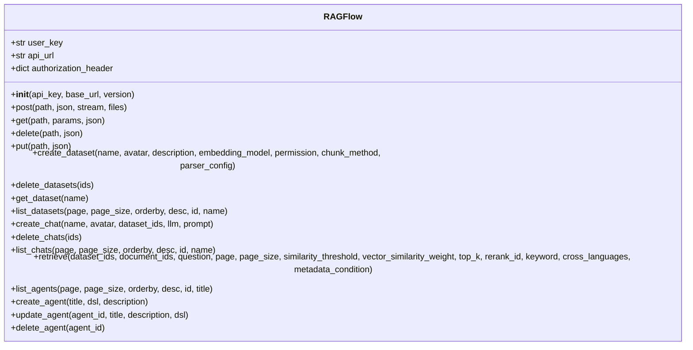
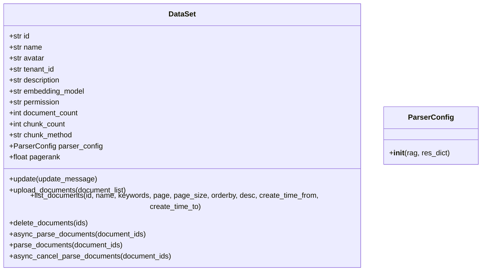
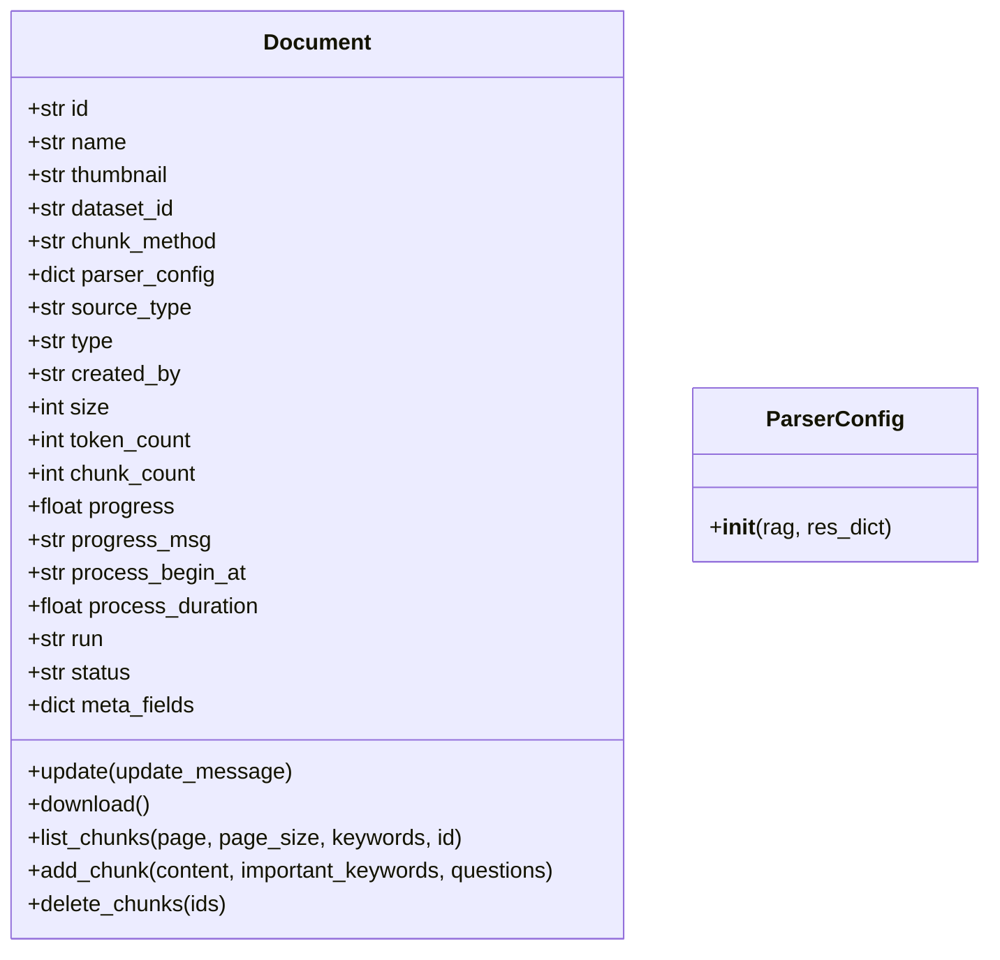
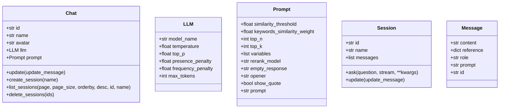
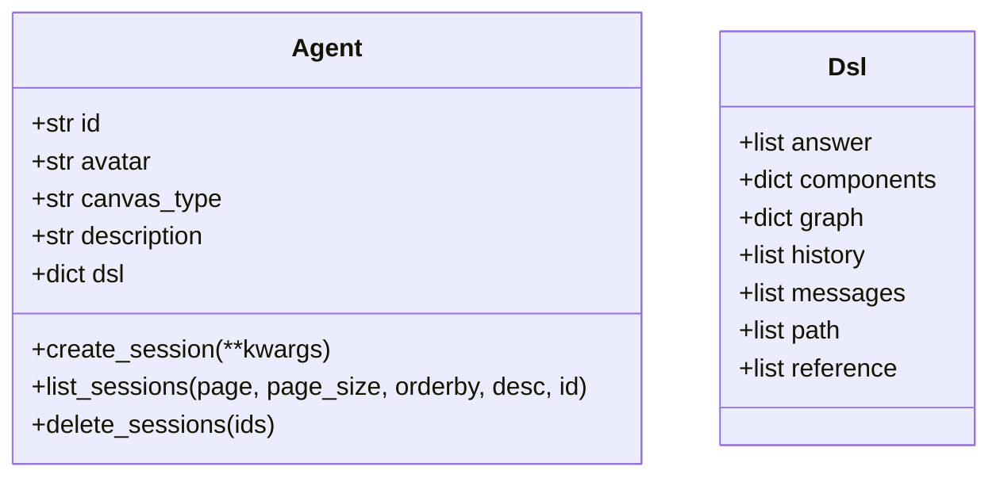

# SDK使用

<cite>
**本文档中引用的文件**   
- [hello_ragflow.py](file://sdk/python/hello_ragflow.py)
- [ragflow.py](file://sdk/python/ragflow_sdk/ragflow.py)
- [dataset.py](file://sdk/python/ragflow_sdk/modules/dataset.py)
- [document.py](file://sdk/python/ragflow_sdk/modules/document.py)
- [chat.py](file://sdk/python/ragflow_sdk/modules/chat.py)
- [agent.py](file://sdk/python/ragflow_sdk/modules/agent.py)
- [base.py](file://sdk/python/ragflow_sdk/modules/base.py)
- [t_dataset.py](file://sdk/python/test/test_sdk_api/t_dataset.py)
- [t_document.py](file://sdk/python/test/test_sdk_api/t_document.py)
- [pyproject.toml](file://sdk/python/pyproject.toml)
</cite>

## 目录
1. [快速入门](#快速入门)
2. [核心客户端类](#核心客户端类)
3. [知识库模块](#知识库模块)
4. [文档模块](#文档模块)
5. [聊天模块](#聊天模块)
6. [Agent模块](#agent模块)
7. [错误处理与异步操作](#错误处理与异步操作)
8. [最佳实践](#最佳实践)

## 快速入门

本节提供RAGFlow Python SDK的快速入门指南，以`hello_ragflow.py`文件为起点，展示如何初始化客户端并执行基本操作。

```python
import ragflow_sdk

print(ragflow_sdk.__version__)
```

上述代码展示了如何导入RAGFlow SDK并打印其版本号。要开始使用SDK，首先需要创建一个`RAGFlow`客户端实例，该实例需要API密钥和基础URL作为参数。

**本节来源**
- [hello_ragflow.py](file://sdk/python/hello_ragflow.py#L1-L20)
- [pyproject.toml](file://sdk/python/pyproject.toml#L1-L10)

## 核心客户端类

`RAGFlow`类是SDK的核心客户端类，负责处理与RAGFlow服务器的通信。该类提供了初始化、认证以及各种HTTP请求方法。

### 初始化与认证

`RAGFlow`类的初始化方法需要三个参数：`api_key`、`base_url`和可选的`version`参数。API密钥用于身份验证，基础URL指向RAGFlow服务器的地址。



**图表来源**
- [ragflow.py](file://sdk/python/ragflow_sdk/ragflow.py#L26-L286)

**本节来源**
- [ragflow.py](file://sdk/python/ragflow_sdk/ragflow.py#L26-L286)

## 知识库模块

`dataset`模块提供了创建、管理和操作知识库的功能。通过`DataSet`类，用户可以创建知识库、上传文档、列出文档等。

### 创建知识库

使用`create_dataset`方法可以创建一个新的知识库。该方法接受知识库的名称、头像、描述、嵌入模型、权限、分块方法和解析器配置等参数。

```python
def create_dataset(
    self,
    name: str,
    avatar: Optional[str] = None,
    description: Optional[str] = None,
    embedding_model: Optional[str] = None,
    permission: str = "me",
    chunk_method: str = "naive",
    parser_config: Optional[DataSet.ParserConfig] = None,
) -> DataSet:
```

### 管理知识库

`DataSet`类还提供了更新、删除和列出知识库的方法。例如，`update`方法可以更新知识库的属性，`delete_documents`方法可以删除知识库中的文档。



**图表来源**
- [dataset.py](file://sdk/python/ragflow_sdk/modules/dataset.py#L21-L154)

**本节来源**
- [dataset.py](file://sdk/python/ragflow_sdk/modules/dataset.py#L21-L154)
- [t_dataset.py](file://sdk/python/test/test_sdk_api/t_dataset.py#L24-L78)

## 文档模块

`document`模块提供了上传、下载、更新和删除文档的功能。通过`Document`类，用户可以管理知识库中的文档。

### 上传文档

使用`upload_documents`方法可以将文档上传到知识库。该方法接受一个包含文档信息的列表，每个文档信息包括显示名称和二进制内容。

```python
def upload_documents(self, document_list: list[dict]):
    url = f"/datasets/{self.id}/documents"
    files = [("file", (ele["display_name"], ele["blob"])) for ele in document_list]
    res = self.post(path=url, json=None, files=files)
    res = res.json()
    if res.get("code") == 0:
        doc_list = []
        for doc in res["data"]:
            document = Document(self.rag, doc)
            doc_list.append(document)
        return doc_list
    raise Exception(res.get("message"))
```

### 管理文档

`Document`类还提供了下载、更新和删除文档的方法。例如，`download`方法可以下载文档的内容，`update`方法可以更新文档的属性。



**图表来源**
- [document.py](file://sdk/python/ragflow_sdk/modules/document.py#L23-L102)

**本节来源**
- [document.py](file://sdk/python/ragflow_sdk/modules/document.py#L23-L102)
- [t_document.py](file://sdk/python/test/test_sdk_api/t_document.py#L22-L199)

## 聊天模块

`chat`模块提供了创建聊天会话、发送消息和管理聊天记录的功能。通过`Chat`类，用户可以与知识库进行交互。

### 创建聊天会话

使用`create_chat`方法可以创建一个新的聊天会话。该方法接受聊天的名称、头像、关联的知识库ID、LLM配置和提示配置等参数。

```python
def create_chat(self, name: str, avatar: str = "", dataset_ids=None, llm: Chat.LLM | None = None, prompt: Chat.Prompt | None = None) -> Chat:
```

### 发送消息

`Session`类提供了`ask`方法，用于向聊天会话发送消息。该方法支持流式响应，可以实时接收AI的回复。



**图表来源**
- [chat.py](file://sdk/python/ragflow_sdk/modules/chat.py#L22-L88)

**本节来源**
- [chat.py](file://sdk/python/ragflow_sdk/modules/chat.py#L22-L88)

## Agent模块

`agent`模块提供了创建和管理Agent的功能。通过`Agent`类，用户可以定义复杂的AI工作流。

### 创建Agent

使用`create_agent`方法可以创建一个新的Agent。该方法接受Agent的标题、DSL（领域特定语言）和描述等参数。

```python
def create_agent(self, title: str, dsl: dict, description: str | None = None) -> None:
```

### 管理Agent

`Agent`类还提供了更新、删除和列出Agent的方法。例如，`create_session`方法可以为Agent创建一个新的会话。



**图表来源**
- [agent.py](file://sdk/python/ragflow_sdk/modules/agent.py#L21-L94)

**本节来源**
- [agent.py](file://sdk/python/ragflow_sdk/modules/agent.py#L21-L94)

## 错误处理与异步操作

本节结合测试文件`t_dataset.py`和`t_document.py`中的代码，展示如何进行错误处理和异步操作。

### 错误处理

在使用SDK时，可能会遇到各种错误，如API密钥无效、知识库名称重复等。SDK通过抛出异常来处理这些错误。

```python
def test_create_dataset_with_duplicated_name(get_api_key_fixture):
    API_KEY = get_api_key_fixture
    rag = RAGFlow(API_KEY, HOST_ADDRESS)
    rag.create_dataset("test_create_dataset_with_duplicated_name")
    with pytest.raises(Exception) as exc_info:
        rag.create_dataset("test_create_dataset_with_duplicated_name")
    assert str(exc_info.value) == "Dataset name 'test_create_dataset_with_duplicated_name' already exists"
```

### 异步操作

对于耗时较长的操作，如文档解析，SDK提供了异步方法。用户可以使用`async_parse_documents`方法启动异步解析，并通过`_get_documents_status`方法检查解析状态。

```python
def async_parse_documents(self, document_ids):
    res = self.post(f"/datasets/{self.id}/chunks", {"document_ids": document_ids})
    res = res.json()
    if res.get("code") != 0:
        raise Exception(res.get("message"))
```

**本节来源**
- [t_dataset.py](file://sdk/python/test/test_sdk_api/t_dataset.py#L30-L37)
- [t_document.py](file://sdk/python/test/test_sdk_api/t_document.py#L80-L199)

## 最佳实践

本节为开发者提供一些最佳实践，如连接池管理和请求重试策略。

### 连接池管理

为了提高性能，建议使用连接池来管理HTTP连接。这可以减少每次请求时建立连接的开销。

### 请求重试策略

在网络不稳定的情况下，建议实现请求重试策略。例如，可以在请求失败时重试几次，直到成功或达到最大重试次数。

**本节来源**
- [ragflow.py](file://sdk/python/ragflow_sdk/ragflow.py#L35-L49)
- [base.py](file://sdk/python/ragflow_sdk/modules/base.py#L41-L55)