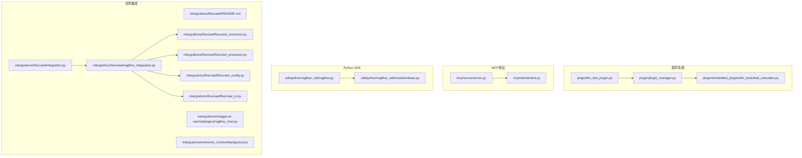
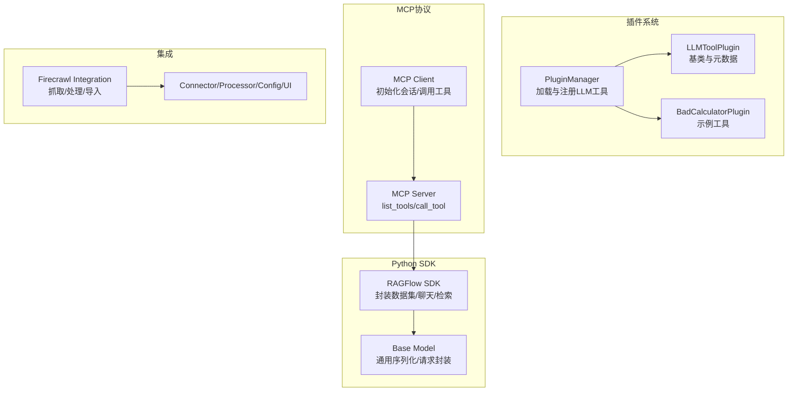
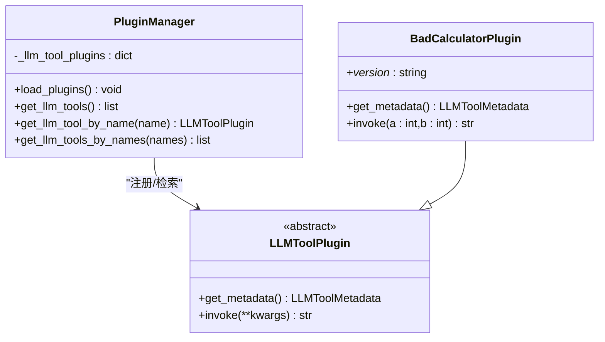
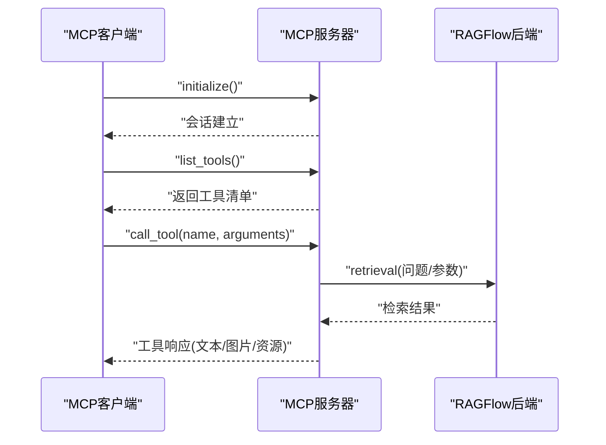
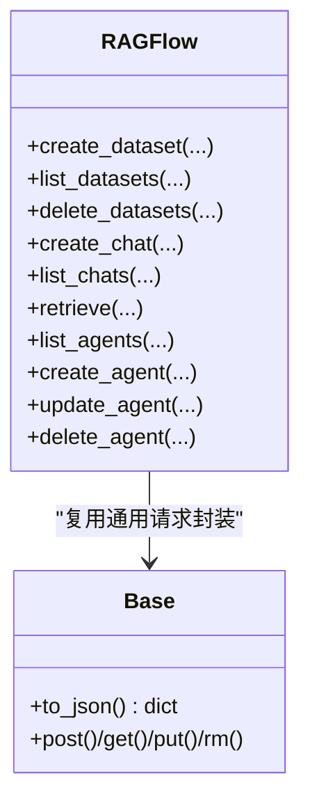
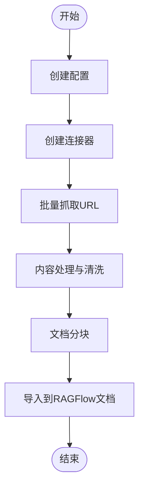
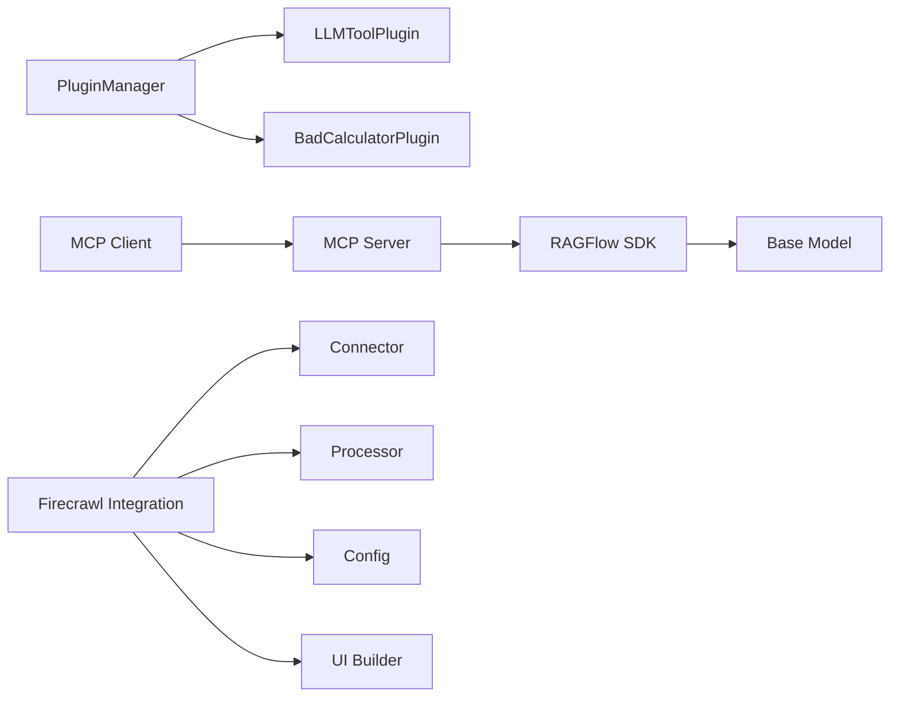

# 扩展开发

<cite>
**本文引用的文件**
- [plugin/README.md](file://plugin/README.md)
- [plugin/README_zh.md](file://plugin/README_zh.md)
- [plugin/llm_tool_plugin.py](file://plugin/llm_tool_plugin.py)
- [plugin/plugin_manager.py](file://plugin/plugin_manager.py)
- [plugin/common.py](file://plugin/common.py)
- [plugin/embedded_plugins/llm_tools/bad_calculator.py](file://plugin/embedded_plugins/llm_tools/bad_calculator.py)
- [mcp/server/server.py](file://mcp/server/server.py)
- [mcp/client/client.py](file://mcp/client/client.py)
- [sdk/python/ragflow_sdk/ragflow.py](file://sdk/python/ragflow_sdk/ragflow.py)
- [sdk/python/ragflow_sdk/modules/base.py](file://sdk/python/ragflow_sdk/modules/base.py)
- [intergrations/firecrawl/README.md](file://intergrations/firecrawl/README.md)
- [intergrations/firecrawl/integration.py](file://intergrations/firecrawl/integration.py)
- [intergrations/firecrawl/ragflow_integration.py](file://intergrations/firecrawl/ragflow_integration.py)
- [intergrations/firecrawl/firecrawl_connector.py](file://intergrations/firecrawl/firecrawl_connector.py)
- [intergrations/firecrawl/firecrawl_processor.py](file://intergrations/firecrawl/firecrawl_processor.py)
- [intergrations/firecrawl/firecrawl_config.py](file://intergrations/firecrawl/firecrawl_config.py)
- [intergrations/firecrawl/firecrawl_ui.py](file://intergrations/firecrawl/firecrawl_ui.py)
- [intergrations/chatgpt-on-wechat/plugins/ragflow_chat.py](file://intergrations/chatgpt-on-wechat/plugins/ragflow_chat.py)
- [intergrations/extension_chrome/background.js](file://intergrations/extension_chrome/background.js)
</cite>

## 目录
1. [简介](#简介)
2. [项目结构](#项目结构)
3. [核心组件](#核心组件)
4. [架构总览](#架构总览)
5. [详细组件分析](#详细组件分析)
6. [依赖关系分析](#依赖关系分析)
7. [性能与安全考量](#性能与安全考量)
8. [故障排查指南](#故障排查指南)
9. [结论](#结论)
10. [附录](#附录)

## 简介
本指南面向希望在RAGFlow中进行扩展开发的工程师，覆盖以下主题：
- 通过插件系统（/plugin/）扩展LLM工具集，包括编写新的LLM工具插件的步骤、接口规范与最佳实践。
- 集成MCP（Model Context Protocol）服务器与客户端（/mcp/），为外部工具提供标准化的模型上下文协议接口。
- 使用Python SDK（/sdk/python/）开发自定义应用，封装数据集、聊天、检索等常用能力。
- 参考现有集成（如Firecrawl、Chrome扩展、ChatGPT微信插件）的实现原理，作为开发新集成的范式。

## 项目结构
RAGFlow的扩展点主要分布在如下目录：
- 插件系统：/plugin/，包含LLM工具插件基类、插件管理器与示例插件。
- MCP协议：/mcp/，包含服务端与客户端示例，提供标准工具列表与调用能力。
- Python SDK：/sdk/python/，提供对后端API的封装，便于快速构建应用。
- 现有集成：/intergrations/，包含Firecrawl网络抓取、Chrome扩展、ChatGPT-on-WeChat插件等。

图表来源
- [plugin/llm_tool_plugin.py](file://plugin/llm_tool_plugin.py#L1-L52)
- [plugin/plugin_manager.py](file://plugin/plugin_manager.py#L1-L46)
- [plugin/embedded_plugins/llm_tools/bad_calculator.py](file://plugin/embedded_plugins/llm_tools/bad_calculator.py#L1-L38)
- [mcp/server/server.py](file://mcp/server/server.py#L1-L713)
- [mcp/client/client.py](file://mcp/client/client.py#L1-L48)
- [sdk/python/ragflow_sdk/ragflow.py](file://sdk/python/ragflow_sdk/ragflow.py#L1-L286)
- [sdk/python/ragflow_sdk/modules/base.py](file://sdk/python/ragflow_sdk/modules/base.py#L1-L59)
- [intergrations/firecrawl/integration.py](file://intergrations/firecrawl/integration.py#L1-L150)
- [intergrations/firecrawl/ragflow_integration.py](file://intergrations/firecrawl/ragflow_integration.py#L1-L176)
- [intergrations/firecrawl/firecrawl_connector.py](file://intergrations/firecrawl/firecrawl_connector.py#L1-L263)
- [intergrations/firecrawl/firecrawl_processor.py](file://intergrations/firecrawl/firecrawl_processor.py#L1-L276)
- [intergrations/firecrawl/firecrawl_config.py](file://intergrations/firecrawl/firecrawl_config.py#L1-L80)
- [intergrations/firecrawl/firecrawl_ui.py](file://intergrations/firecrawl/firecrawl_ui.py#L1-L260)
- [intergrations/chatgpt-on-wechat/plugins/ragflow_chat.py](file://intergrations/chatgpt-on-wechat/plugins/ragflow_chat.py#L1-L128)
- [intergrations/extension_chrome/background.js](file://intergrations/extension_chrome/background.js#L1-L17)

章节来源
- [plugin/README.md](file://plugin/README.md#L1-L98)
- [plugin/README_zh.md](file://plugin/README_zh.md#L1-L99)
- [mcp/server/server.py](file://mcp/server/server.py#L1-L713)
- [sdk/python/ragflow_sdk/ragflow.py](file://sdk/python/ragflow_sdk/ragflow.py#L1-L286)
- [intergrations/firecrawl/README.md](file://intergrations/firecrawl/README.md#L1-L216)

## 核心组件
- LLM工具插件体系
  - 基类与元数据：定义工具元数据结构与抽象方法，负责将工具描述暴露给LLM与前端。
  - 插件管理器：扫描嵌入式插件目录，加载并注册LLM工具，按名称检索工具实例。
  - 示例插件：演示如何实现工具的元数据与调用逻辑。
- MCP服务器与客户端
  - 服务器：实现MCP工具清单与调用，封装后端检索接口，支持SSE与Streamable HTTP两种传输模式。
  - 客户端：示例展示如何初始化会话、列举工具、调用工具并处理响应。
- Python SDK
  - 封装数据集、聊天、检索、代理等常用操作，统一认证头与请求路径，简化应用开发。
- 现有集成
  - Firecrawl：提供网页抓取、站点爬取、批量处理、格式转换、错误处理与速率限制等能力。
  - ChatGPT-on-WeChat：桥接微信消息事件，转发至RAGFlow后端获取回复。
  - Chrome扩展：后台脚本接收页面信息并存储，为后续交互提供数据基础。

章节来源
- [plugin/llm_tool_plugin.py](file://plugin/llm_tool_plugin.py#L1-L52)
- [plugin/plugin_manager.py](file://plugin/plugin_manager.py#L1-L46)
- [plugin/embedded_plugins/llm_tools/bad_calculator.py](file://plugin/embedded_plugins/llm_tools/bad_calculator.py#L1-L38)
- [mcp/server/server.py](file://mcp/server/server.py#L1-L713)
- [mcp/client/client.py](file://mcp/client/client.py#L1-L48)
- [sdk/python/ragflow_sdk/ragflow.py](file://sdk/python/ragflow_sdk/ragflow.py#L1-L286)
- [sdk/python/ragflow_sdk/modules/base.py](file://sdk/python/ragflow_sdk/modules/base.py#L1-L59)
- [intergrations/firecrawl/integration.py](file://intergrations/firecrawl/integration.py#L1-L150)
- [intergrations/firecrawl/ragflow_integration.py](file://intergrations/firecrawl/ragflow_integration.py#L1-L176)
- [intergrations/chatgpt-on-wechat/plugins/ragflow_chat.py](file://intergrations/chatgpt-on-wechat/plugins/ragflow_chat.py#L1-L128)
- [intergrations/extension_chrome/background.js](file://intergrations/extension_chrome/background.js#L1-L17)

## 架构总览
下图展示了插件系统、MCP协议与SDK之间的交互关系，以及典型集成（Firecrawl）的工作流。

图表来源
- [plugin/plugin_manager.py](file://plugin/plugin_manager.py#L1-L46)
- [plugin/llm_tool_plugin.py](file://plugin/llm_tool_plugin.py#L1-L52)
- [plugin/embedded_plugins/llm_tools/bad_calculator.py](file://plugin/embedded_plugins/llm_tools/bad_calculator.py#L1-L38)
- [mcp/server/server.py](file://mcp/server/server.py#L1-L713)
- [mcp/client/client.py](file://mcp/client/client.py#L1-L48)
- [sdk/python/ragflow_sdk/ragflow.py](file://sdk/python/ragflow_sdk/ragflow.py#L1-L286)
- [sdk/python/ragflow_sdk/modules/base.py](file://sdk/python/ragflow_sdk/modules/base.py#L1-L59)
- [intergrations/firecrawl/integration.py](file://intergrations/firecrawl/integration.py#L1-L150)
- [intergrations/firecrawl/ragflow_integration.py](file://intergrations/firecrawl/ragflow_integration.py#L1-L176)

## 详细组件分析

### 插件系统：LLM工具扩展
- 设计要点
  - 工具元数据：包含名称、显示名、描述、参数定义与必填项，用于LLM理解与前端展示。
  - 抽象调用：工具需实现调用入口，返回字符串结果；插件管理器按名称注册与检索。
  - 加载机制：递归扫描嵌入式插件目录，记录版本与类型，构建工具索引。
- 开发步骤
  1) 在嵌入式插件目录新增工具文件，定义工具类并继承基类。
  2) 实现元数据方法，声明工具名称、描述与参数。
  3) 实现调用方法，处理LLM传入的参数并返回字符串结果。
  4) 启动服务后，查看日志确认插件加载成功。
- 接口规范
  - 元数据结构：名称、显示名、描述、显示描述、参数字典（含类型、描述、显示描述、是否必填）。
  - 调用签名：可变关键字参数，返回字符串。
  - 版本字段：插件类需声明版本，便于管理与兼容性检查。

图表来源
- [plugin/llm_tool_plugin.py](file://plugin/llm_tool_plugin.py#L1-L52)
- [plugin/plugin_manager.py](file://plugin/plugin_manager.py#L1-L46)
- [plugin/embedded_plugins/llm_tools/bad_calculator.py](file://plugin/embedded_plugins/llm_tools/bad_calculator.py#L1-L38)

章节来源
- [plugin/README.md](file://plugin/README.md#L1-L98)
- [plugin/README_zh.md](file://plugin/README_zh.md#L1-L99)
- [plugin/llm_tool_plugin.py](file://plugin/llm_tool_plugin.py#L1-L52)
- [plugin/plugin_manager.py](file://plugin/plugin_manager.py#L1-L46)
- [plugin/embedded_plugins/llm_tools/bad_calculator.py](file://plugin/embedded_plugins/llm_tools/bad_calculator.py#L1-L38)

### MCP服务器与客户端：标准化工具接口
- 服务器职责
  - 提供工具清单与调用接口，当前内置“ragflow_retrieval”工具，支持检索问答相关知识。
  - 支持SSE与Streamable HTTP两种传输模式，适配不同客户端接入场景。
  - 认证策略：支持多租户模式（Authorization头）与单租户模式（API Key）。
- 客户端职责
  - 初始化会话，列举可用工具，调用指定工具并解析响应。
- 关键流程（检索工具调用）

图表来源
- [mcp/client/client.py](file://mcp/client/client.py#L1-L48)
- [mcp/server/server.py](file://mcp/server/server.py#L1-L713)

章节来源
- [mcp/server/server.py](file://mcp/server/server.py#L1-L713)
- [mcp/client/client.py](file://mcp/client/client.py#L1-L48)

### Python SDK：快速构建应用
- 能力概览
  - 数据集管理：创建、查询、删除数据集。
  - 聊天助手：创建聊天、查询聊天列表、设置LLM与提示词。
  - 检索：基于问题检索相关知识片段。
  - 代理：创建与更新代理DSL。
- 设计要点
  - 统一认证头（Bearer Token），自动拼接API路径。
  - 模型层采用通用Base封装，支持嵌套对象序列化与请求转发。
- 使用建议
  - 在应用初始化时注入API Key与后端地址。
  - 对于检索场景，合理设置分页、相似度阈值与重排模型参数。

图表来源
- [sdk/python/ragflow_sdk/ragflow.py](file://sdk/python/ragflow_sdk/ragflow.py#L1-L286)
- [sdk/python/ragflow_sdk/modules/base.py](file://sdk/python/ragflow_sdk/modules/base.py#L1-L59)

章节来源
- [sdk/python/ragflow_sdk/ragflow.py](file://sdk/python/ragflow_sdk/ragflow.py#L1-L286)
- [sdk/python/ragflow_sdk/modules/base.py](file://sdk/python/ragflow_sdk/modules/base.py#L1-L59)

### 现有集成：Firecrawl
- 功能特性
  - 单URL抓取、网站爬取、批量处理、多种输出格式（markdown/html/链接/截图）。
  - 配置校验、连接测试、速率限制与重试、内容清洗与分块。
- 架构组成
  - 主集成类：对外提供配置、UI、验证、连接测试与集成实例创建。
  - 连接器：异步HTTP请求、并发控制、重试与限速。
  - 处理器：内容清洗、标题/描述提取、语言检测、文档ID生成、分块策略。
  - 配置与UI：环境变量与字典配置互转、表单schema、帮助文本与工作流。
- 典型流程（批量抓取与导入）

图表来源
- [intergrations/firecrawl/integration.py](file://intergrations/firecrawl/integration.py#L1-L150)
- [intergrations/firecrawl/ragflow_integration.py](file://intergrations/firecrawl/ragflow_integration.py#L1-L176)
- [intergrations/firecrawl/firecrawl_connector.py](file://intergrations/firecrawl/firecrawl_connector.py#L1-L263)
- [intergrations/firecrawl/firecrawl_processor.py](file://intergrations/firecrawl/firecrawl_processor.py#L1-L276)
- [intergrations/firecrawl/firecrawl_config.py](file://intergrations/firecrawl/firecrawl_config.py#L1-L80)
- [intergrations/firecrawl/firecrawl_ui.py](file://intergrations/firecrawl/firecrawl_ui.py#L1-L260)

章节来源
- [intergrations/firecrawl/README.md](file://intergrations/firecrawl/README.md#L1-L216)
- [intergrations/firecrawl/integration.py](file://intergrations/firecrawl/integration.py#L1-L150)
- [intergrations/firecrawl/ragflow_integration.py](file://intergrations/firecrawl/ragflow_integration.py#L1-L176)
- [intergrations/firecrawl/firecrawl_connector.py](file://intergrations/firecrawl/firecrawl_connector.py#L1-L263)
- [intergrations/firecrawl/firecrawl_processor.py](file://intergrations/firecrawl/firecrawl_processor.py#L1-L276)
- [intergrations/firecrawl/firecrawl_config.py](file://intergrations/firecrawl/firecrawl_config.py#L1-L80)
- [intergrations/firecrawl/firecrawl_ui.py](file://intergrations/firecrawl/firecrawl_ui.py#L1-L260)

### 其他集成参考
- ChatGPT-on-WeChat插件
  - 事件绑定：监听上下文事件，拦截文本消息。
  - 会话管理：为用户维护对话ID，避免重复创建。
  - 请求转发：调用RAGFlow后端完成对话，回传文本回复。
- Chrome扩展
  - 后台脚本：监听消息，保存页面信息到本地存储，便于后续交互。

章节来源
- [intergrations/chatgpt-on-wechat/plugins/ragflow_chat.py](file://intergrations/chatgpt-on-wechat/plugins/ragflow_chat.py#L1-L128)
- [intergrations/extension_chrome/background.js](file://intergrations/extension_chrome/background.js#L1-L17)

## 依赖关系分析
- 插件系统
  - 低耦合：工具类仅依赖基类与元数据结构；管理器通过插件库加载，按名称索引。
  - 可扩展：新增工具无需修改核心逻辑，只需遵循元数据与调用约定。
- MCP协议
  - 传输解耦：SSE与Streamable HTTP双栈，满足不同客户端需求。
  - 认证解耦：多租户与单租户模式通过装饰器注入令牌，避免侵入式修改。
- SDK
  - 通用封装：Base模型提供统一序列化与HTTP请求转发，降低上层复杂度。
  - 易用性：方法命名直观，参数与返回值结构化，便于组合业务流程。
- Firecrawl集成
  - 异步并发：连接器使用信号量与延迟控制，提升吞吐与稳定性。
  - 结果一致性：处理器统一输出文档结构，便于后续导入与检索。

图表来源
- [plugin/plugin_manager.py](file://plugin/plugin_manager.py#L1-L46)
- [plugin/llm_tool_plugin.py](file://plugin/llm_tool_plugin.py#L1-L52)
- [plugin/embedded_plugins/llm_tools/bad_calculator.py](file://plugin/embedded_plugins/llm_tools/bad_calculator.py#L1-L38)
- [mcp/server/server.py](file://mcp/server/server.py#L1-L713)
- [mcp/client/client.py](file://mcp/client/client.py#L1-L48)
- [sdk/python/ragflow_sdk/ragflow.py](file://sdk/python/ragflow_sdk/ragflow.py#L1-L286)
- [sdk/python/ragflow_sdk/modules/base.py](file://sdk/python/ragflow_sdk/modules/base.py#L1-L59)
- [intergrations/firecrawl/integration.py](file://intergrations/firecrawl/integration.py#L1-L150)
- [intergrations/firecrawl/ragflow_integration.py](file://intergrations/firecrawl/ragflow_integration.py#L1-L176)
- [intergrations/firecrawl/firecrawl_connector.py](file://intergrations/firecrawl/firecrawl_connector.py#L1-L263)
- [intergrations/firecrawl/firecrawl_processor.py](file://intergrations/firecrawl/firecrawl_processor.py#L1-L276)
- [intergrations/firecrawl/firecrawl_config.py](file://intergrations/firecrawl/firecrawl_config.py#L1-L80)
- [intergrations/firecrawl/firecrawl_ui.py](file://intergrations/firecrawl/firecrawl_ui.py#L1-L260)

## 性能与安全考量
- 插件系统
  - 加载性能：递归扫描嵌入式目录，建议将工具拆分为独立模块，减少导入开销。
  - 并发安全：工具调用应避免阻塞，必要时引入异步或线程池。
- MCP协议
  - 传输选择：Streamable HTTP适合高并发客户端，SSE适合传统浏览器或低延迟场景。
  - 认证与鉴权：多租户模式必须严格校验Authorization头，防止越权访问。
- SDK
  - 请求优化：对频繁调用的接口启用连接池与超时控制，避免阻塞。
  - 错误重试：对临时性错误（网络抖动）实施指数退避重试。
- Firecrawl集成
  - 并发与限速：合理设置最大并发与请求间隔，避免触发API限流。
  - 内容清洗：去除HTML标签与噪声字符，提高后续检索质量。
  - 分块策略：根据模型上下文长度调整分块大小与重叠，平衡召回与效率。

[本节为通用指导，不直接分析具体文件]

## 故障排查指南
- 插件未加载
  - 检查插件文件是否位于嵌入式目录，类是否继承基类并实现元数据与调用方法。
  - 查看启动日志中的插件加载信息，定位版本与类型。
- MCP调用失败
  - 确认认证头或API Key已正确传递；多租户模式需使用Bearer Token。
  - 检查SSE/Streamable HTTP端点是否启用，客户端与服务端配置一致。
- SDK调用异常
  - 校验API Key与后端地址；确认网络连通性与超时设置。
  - 对于检索接口，检查数据集ID、分页参数与相似度阈值是否合理。
- Firecrawl抓取失败
  - 校验API Key格式与有效期；检查URL合法性与目标站点可达性。
  - 调整重试次数与超时时间，观察速率限制提示并适当降低并发。

章节来源
- [plugin/README.md](file://plugin/README.md#L1-L98)
- [mcp/server/server.py](file://mcp/server/server.py#L1-L713)
- [sdk/python/ragflow_sdk/ragflow.py](file://sdk/python/ragflow_sdk/ragflow.py#L1-L286)
- [intergrations/firecrawl/README.md](file://intergrations/firecrawl/README.md#L1-L216)

## 结论
通过插件系统、MCP协议与Python SDK，RAGFlow提供了清晰的扩展路径与标准化接口。开发者可按本文档的步骤与规范快速实现新的LLM工具、MCP工具与自定义应用，并参考Firecrawl等集成的最佳实践，确保扩展具备良好的性能、安全与可维护性。

[本节为总结性内容，不直接分析具体文件]

## 附录
- 快速开始（插件）
  - 在嵌入式目录新增工具文件，实现基类方法与调用逻辑。
  - 启动服务后在日志中确认插件加载成功。
- 快速开始（MCP）
  - 启动MCP服务器，配置传输模式与认证方式。
  - 使用客户端示例初始化会话并调用工具。
- 快速开始（SDK）
  - 初始化SDK实例，设置API Key与后端地址。
  - 调用数据集/聊天/检索等方法，按需组合业务流程。

章节来源
- [plugin/README.md](file://plugin/README.md#L1-L98)
- [mcp/server/server.py](file://mcp/server/server.py#L1-L713)
- [sdk/python/ragflow_sdk/ragflow.py](file://sdk/python/ragflow_sdk/ragflow.py#L1-L286)