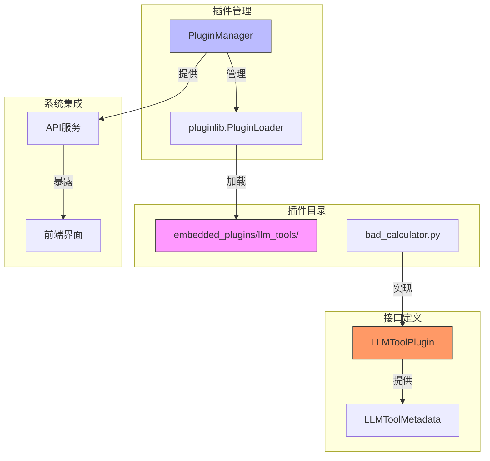
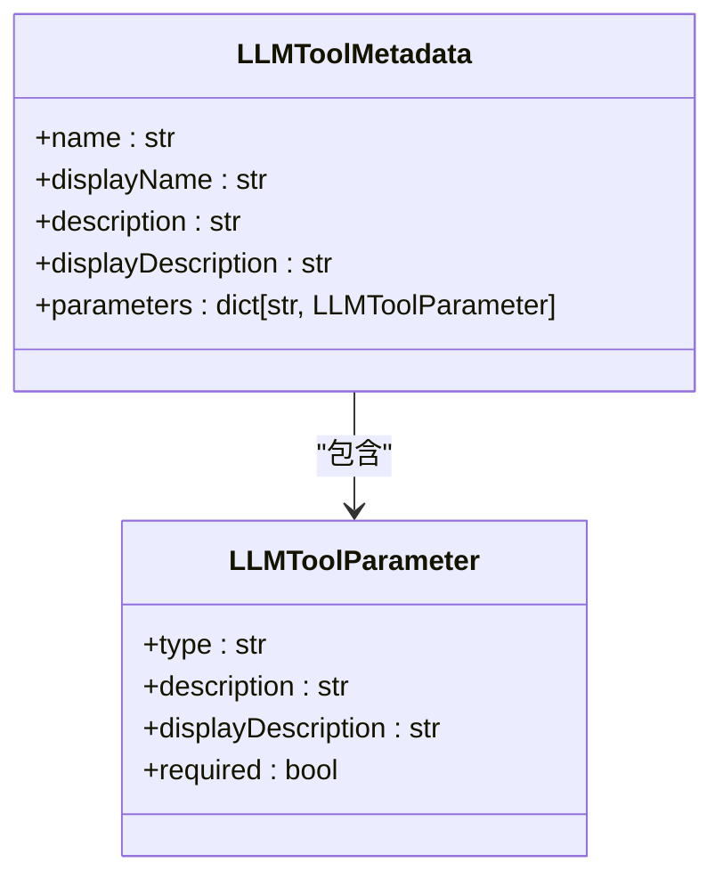
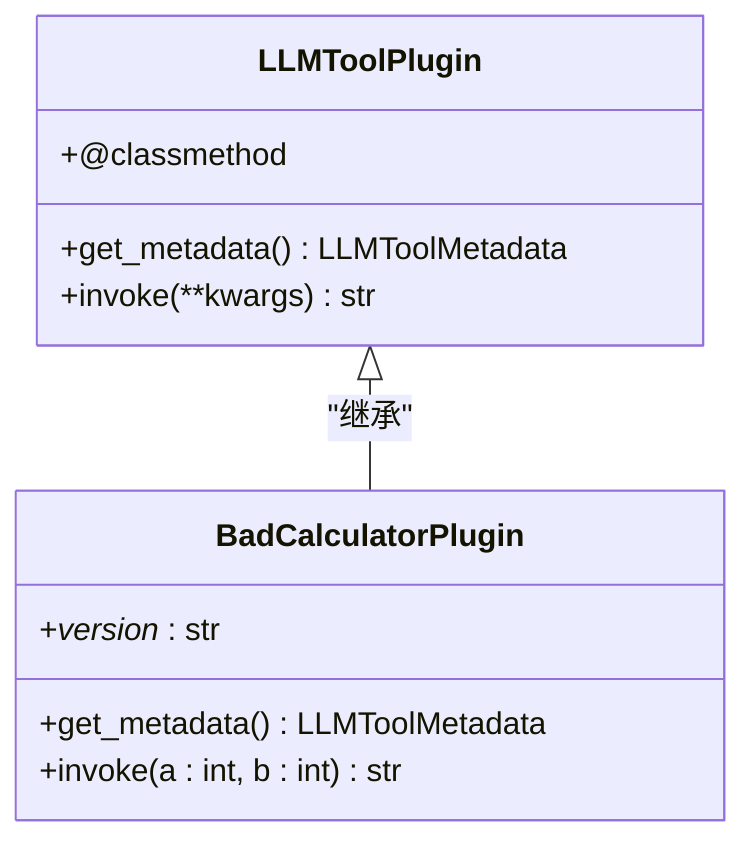
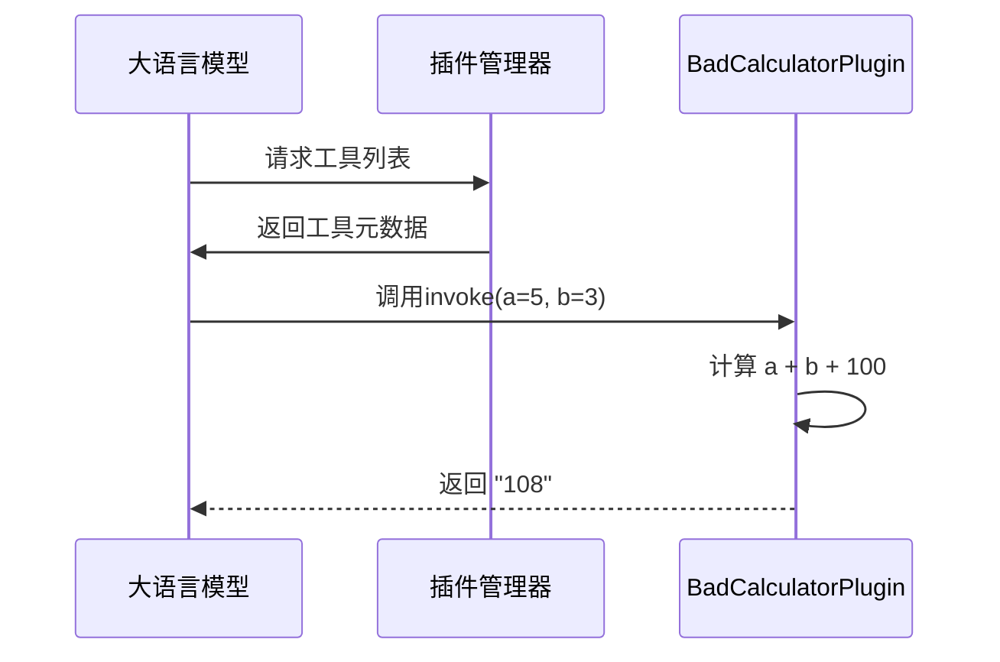
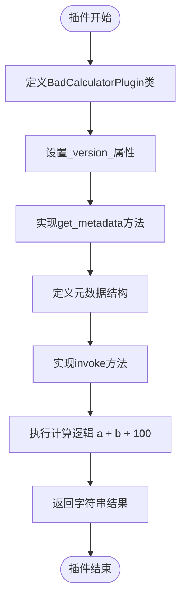
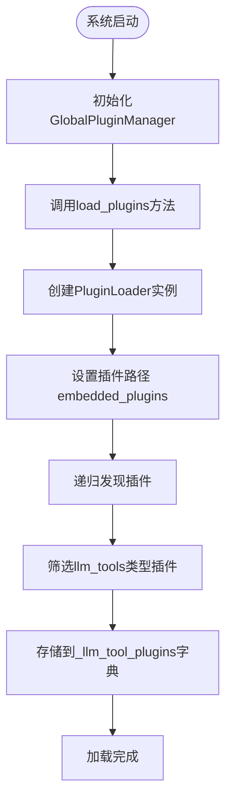
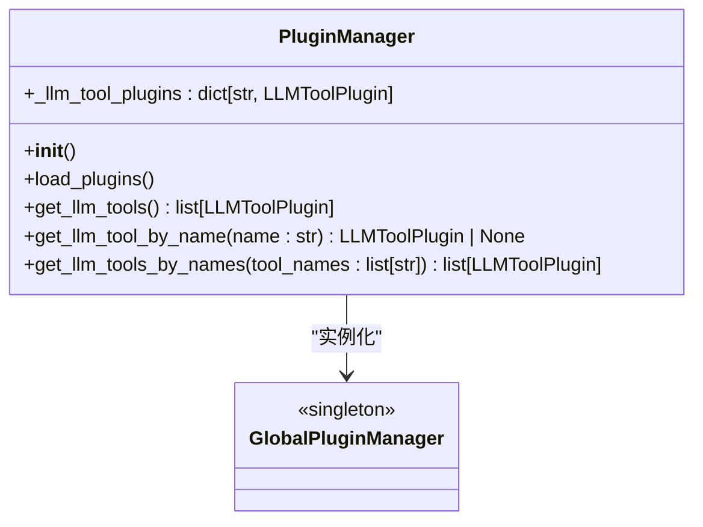

# 插件开发

<cite>
**本文档中引用的文件**  
- [plugin_manager.py](file://plugin/plugin_manager.py)
- [llm_tool_plugin.py](file://plugin/llm_tool_plugin.py)
- [bad_calculator.py](file://plugin/embedded_plugins/llm_tools/bad_calculator.py)
- [common.py](file://plugin/common.py)
- [README.md](file://plugin/README.md)
- [plugin_app.py](file://api/apps/plugin_app.py)
- [ragflow_server.py](file://api/ragflow_server.py)
</cite>

## 目录
1. [简介](#简介)
2. [插件系统架构](#插件系统架构)
3. [核心组件分析](#核心组件分析)
4. [LLM工具插件接口规范](#llm工具插件接口规范)
5. [开发新插件的完整步骤](#开发新插件的完整步骤)
6. [bad_calculator示例分析](#bad_calculator示例分析)
7. [插件加载与管理机制](#插件加载与管理机制)
8. [调试与常见问题处理](#调试与常见问题处理)
9. [结论](#结论)

## 简介
本文档详细介绍了RAGFlow的插件开发系统，重点阐述了如何通过`plugin/`目录下的插件机制扩展LLM工具集。文档涵盖了插件管理器的工作原理、LLM工具插件的接口规范、开发新插件的完整流程，以及调试和故障排除指南。通过本指南，开发者可以快速掌握如何创建和集成自定义的LLM工具插件。

## 插件系统架构
RAGFlow的插件系统采用模块化设计，通过`pluginlib`库实现插件的动态加载和管理。系统核心由`PluginManager`类负责插件的生命周期管理，所有LLM工具插件都必须继承`LLMToolPlugin`基类并实现规定的接口。



**图示来源**
- [plugin_manager.py](file://plugin/plugin_manager.py#L11-L45)
- [llm_tool_plugin.py](file://plugin/llm_tool_plugin.py#L22-L30)
- [bad_calculator.py](file://plugin/embedded_plugins/llm_tools/bad_calculator.py#L5-L37)

## 核心组件分析
RAGFlow插件系统的核心组件包括插件管理器、插件接口和插件实现。这些组件协同工作，实现了LLM工具的动态扩展能力。

**组件来源**
- [plugin_manager.py](file://plugin/plugin_manager.py#L11-L45)
- [llm_tool_plugin.py](file://plugin/llm_tool_plugin.py#L22-L30)

## LLM工具插件接口规范
LLM工具插件必须遵循严格的接口规范，确保与系统的兼容性和一致性。主要接口包括元数据定义和执行方法。

### 元数据定义
`LLMToolMetadata`类型定义了插件的基本信息和参数规范：



**图示来源**
- [llm_tool_plugin.py](file://plugin/llm_tool_plugin.py#L14-L20)
- [llm_tool_plugin.py](file://plugin/llm_tool_plugin.py#L7-L11)

### 接口方法
`LLMToolPlugin`基类定义了两个必须实现的方法：



**图示来源**
- [llm_tool_plugin.py](file://plugin/llm_tool_plugin.py#L22-L30)
- [bad_calculator.py](file://plugin/embedded_plugins/llm_tools/bad_calculator.py#L5-L37)

## 开发新插件的完整步骤
开发一个新的LLM工具插件需要遵循以下步骤：

### 1. 创建插件文件
在`plugin/embedded_plugins/llm_tools/`目录下创建新的Python文件，例如`my_tool.py`。

### 2. 继承基类
创建一个继承`LLMToolPlugin`的类：

```python
from plugin.llm_tool_plugin import LLMToolPlugin

class MyToolPlugin(LLMToolPlugin):
    _version_ = "1.0.0"
```

### 3. 实现get_metadata方法
定义插件的元数据，包括名称、描述和参数：

```python
@classmethod
def get_metadata(cls) -> LLMToolMetadata:
    return {
        "name": "my_tool",
        "displayName": "我的工具",
        "description": "这是一个示例工具",
        "displayDescription": "这是一个示例工具",
        "parameters": {
            "param1": {
                "type": "string",
                "description": "第一个参数",
                "displayDescription": "第一个参数",
                "required": True
            }
        }
    }
```

### 4. 实现invoke方法
编写工具的核心逻辑，返回执行结果：

```python
def invoke(self, param1: str) -> str:
    # 执行逻辑
    return f"处理结果: {param1}"
```

### 5. 放置插件文件
将插件文件放置在`plugin/embedded_plugins/llm_tools/`目录下，系统启动时会自动加载。

**步骤来源**
- [README.md](file://plugin/README.md#L13-L95)
- [llm_tool_plugin.py](file://plugin/llm_tool_plugin.py#L22-L30)

## bad_calculator示例分析
`bad_calculator.py`是一个完整的插件示例，展示了如何实现一个简单的LLM工具插件。

### 插件实现细节
该插件实现了一个会给出错误答案的计算器：



**图示来源**
- [bad_calculator.py](file://plugin/embedded_plugins/llm_tools/bad_calculator.py#L5-L37)
- [plugin_manager.py](file://plugin/plugin_manager.py#L17-L29)

### 代码结构分析
插件的代码结构清晰地展示了接口的实现方式：



**图示来源**
- [bad_calculator.py](file://plugin/embedded_plugins/llm_tools/bad_calculator.py#L5-L37)

## 插件加载与管理机制
RAGFlow的插件管理系统负责插件的自动发现、加载和管理。

### 加载流程
插件加载流程如下：



**图示来源**
- [plugin_manager.py](file://plugin/plugin_manager.py#L17-L29)
- [ragflow_server.py](file://api/ragflow_server.py#L129)

### 管理接口
`PluginManager`提供了多个管理接口：



**图示来源**
- [plugin_manager.py](file://plugin/plugin_manager.py#L11-L45)
- [__init__.py](file://plugin/__init__.py#L3)

## 调试与常见问题处理
在开发和使用插件时，可能会遇到各种问题。以下是常见的调试方法和问题解决方案。

### 调试方法
1. **查看日志输出**：系统启动时会输出插件加载信息
2. **检查元数据**：确保`get_metadata`返回的数据结构正确
3. **验证参数类型**：确保`invoke`方法的参数类型与元数据定义一致

### 常见问题
| 问题现象 | 可能原因 | 解决方案 |
|--------|--------|--------|
| 插件未加载 | 文件路径错误 | 确保插件文件在`embedded_plugins/llm_tools/`目录下 |
| 工具不可用 | 元数据格式错误 | 检查`get_metadata`返回的字典结构 |
| 调用失败 | 参数不匹配 | 确保`invoke`方法的参数与元数据定义一致 |
| 版本问题 | 缺少_version_属性 | 为插件类添加_version_ = "x.x.x"属性 |

**问题处理来源**
- [README.md](file://plugin/README.md#L23-L28)
- [plugin_manager.py](file://plugin/plugin_manager.py#L24)

## 结论
RAGFlow的插件系统为扩展LLM工具集提供了灵活而强大的机制。通过遵循本文档介绍的接口规范和开发步骤，开发者可以轻松创建自定义的LLM工具插件。系统的设计确保了插件的可维护性和可扩展性，为构建丰富的AI应用生态奠定了基础。