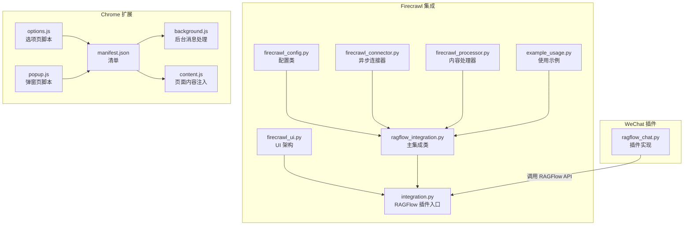
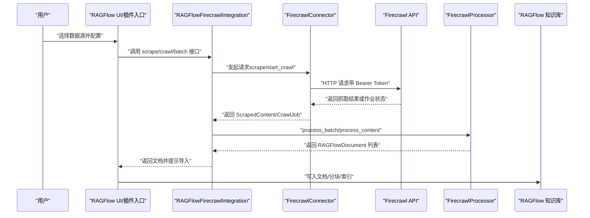
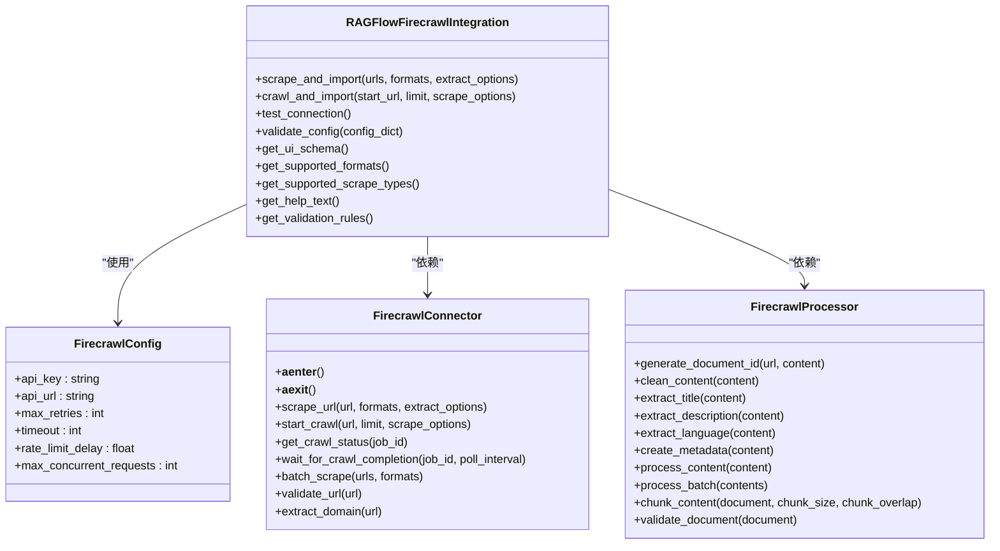
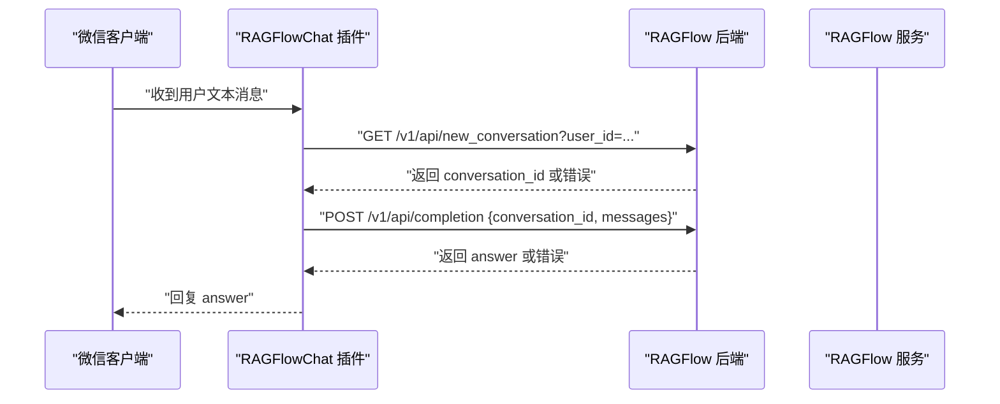
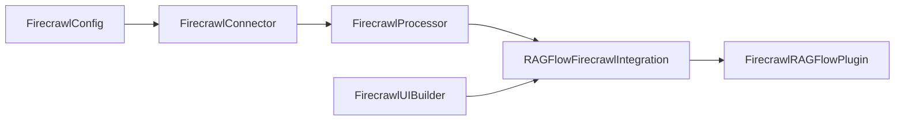

# 集成示例

<cite>
**本文引用的文件**
- [intergrations/firecrawl/ragflow_integration.py](file://intergrations/firecrawl/ragflow_integration.py)
- [intergrations/firecrawl/firecrawl_connector.py](file://intergrations/firecrawl/firecrawl_connector.py)
- [intergrations/firecrawl/firecrawl_config.py](file://intergrations/firecrawl/firecrawl_config.py)
- [intergrations/firecrawl/firecrawl_processor.py](file://intergrations/firecrawl/firecrawl_processor.py)
- [intergrations/firecrawl/firecrawl_ui.py](file://intergrations/firecrawl/firecrawl_ui.py)
- [intergrations/firecrawl/integration.py](file://intergrations/firecrawl/integration.py)
- [intergrations/firecrawl/example_usage.py](file://intergrations/firecrawl/example_usage.py)
- [intergrations/firecrawl/README.md](file://intergrations/firecrawl/README.md)
- [intergrations/firecrawl/INSTALLATION.md](file://intergrations/firecrawl/INSTALLATION.md)
- [intergrations/extension_chrome/manifest.json](file://intergrations/extension_chrome/manifest.json)
- [intergrations/extension_chrome/background.js](file://intergrations/extension_chrome/background.js)
- [intergrations/extension_chrome/content.js](file://intergrations/extension_chrome/content.js)
- [intergrations/extension_chrome/options.js](file://intergrations/extension_chrome/options.js)
- [intergrations/extension_chrome/popup.js](file://intergrations/extension_chrome/popup.js)
- [intergrations/chatgpt-on-wechat/plugins/ragflow_chat.py](file://intergrations/chatgpt-on-wechat/plugins/ragflow_chat.py)
</cite>

## 目录
1. [简介](#简介)
2. [项目结构](#项目结构)
3. [核心组件](#核心组件)
4. [架构总览](#架构总览)
5. [详细组件分析](#详细组件分析)
6. [依赖关系分析](#依赖关系分析)
7. [性能考量](#性能考量)
8. [故障排查指南](#故障排查指南)
9. [结论](#结论)
10. [附录](#附录)

## 简介
本文件面向开发者，系统性解析三个典型集成案例：
- Firecrawl 集成：展示如何将外部爬虫服务与 RAGFlow 的知识库同步，包括配置管理、连接器、内容处理器、UI 架构与测试流程。
- extension_chrome 浏览器扩展：解析 manifest.json 配置、background.js 后台消息处理与 content.js 页面内容注入技术，演示如何在浏览器侧采集页面信息并与 RAGFlow 增强功能结合。
- chatgpt-on-wechat 插件：解析 ragflow_chat.py 如何作为微信聊天机器人与 RAGFlow 后端通信，实现会话管理与问答转发。

通过对这些实例的代码级分析与可视化图示，提炼出可复用的“通用模式与最佳实践”，帮助开发者快速开发新的 RAGFlow 集成。

## 项目结构
围绕本次目标，涉及的关键目录与文件如下：
- Firecrawl 集成：包含配置、连接器、处理器、UI、入口与示例脚本等模块，遵循 RAGFlow 的插件接口规范。
- extension_chrome 扩展：包含 manifest、background、content 脚本与选项页、弹窗页脚本。
- chatgpt-on-wechat 插件：包含插件注册、事件处理、HTTP 请求与会话状态管理。



图表来源
- [intergrations/firecrawl/ragflow_integration.py](file://intergrations/firecrawl/ragflow_integration.py#L1-L176)
- [intergrations/firecrawl/firecrawl_connector.py](file://intergrations/firecrawl/firecrawl_connector.py#L1-L263)
- [intergrations/firecrawl/firecrawl_processor.py](file://intergrations/firecrawl/firecrawl_processor.py#L1-L276)
- [intergrations/firecrawl/firecrawl_ui.py](file://intergrations/firecrawl/firecrawl_ui.py#L1-L260)
- [intergrations/firecrawl/integration.py](file://intergrations/firecrawl/integration.py#L1-L150)
- [intergrations/firecrawl/example_usage.py](file://intergrations/firecrawl/example_usage.py#L1-L262)
- [intergrations/extension_chrome/manifest.json](file://intergrations/extension_chrome/manifest.json#L1-L35)
- [intergrations/extension_chrome/background.js](file://intergrations/extension_chrome/background.js#L1-L17)
- [intergrations/extension_chrome/content.js](file://intergrations/extension_chrome/content.js#L1-L69)
- [intergrations/extension_chrome/options.js](file://intergrations/extension_chrome/options.js#L1-L37)
- [intergrations/extension_chrome/popup.js](file://intergrations/extension_chrome/popup.js#L1-L25)
- [intergrations/chatgpt-on-wechat/plugins/ragflow_chat.py](file://intergrations/chatgpt-on-wechat/plugins/ragflow_chat.py#L1-L128)

章节来源
- [intergrations/firecrawl/README.md](file://intergrations/firecrawl/README.md#L1-L216)
- [intergrations/firecrawl/INSTALLATION.md](file://intergrations/firecrawl/INSTALLATION.md#L1-L223)

## 核心组件
- Firecrawl 主集成类：负责对外暴露统一接口（单页抓取、网站爬取、批量处理、连接测试、配置校验、UI 架构导出）。
- 连接器：封装与 Firecrawl API 的异步通信，支持速率限制、重试与并发控制。
- 处理器：将抓取结果转换为 RAGFlow 文档格式，执行清洗、元数据提取、分块等操作。
- UI 构建器：定义配置表单、进度条、结果视图、错误处理与帮助文本，形成完整的 UI Schema。
- 插件入口：对接 RAGFlow 的插件框架，提供配置模式、连接测试、帮助与验证规则。
- Chrome 扩展：通过 manifest 声明权限与脚本，background.js 处理消息，content.js 注入页面信息，options/popup 负责配置与预览。
- WeChat 插件：基于事件机制拦截消息，调用 RAGFlow API 获取回答，并维护用户会话。

章节来源
- [intergrations/firecrawl/ragflow_integration.py](file://intergrations/firecrawl/ragflow_integration.py#L15-L176)
- [intergrations/firecrawl/firecrawl_connector.py](file://intergrations/firecrawl/firecrawl_connector.py#L41-L263)
- [intergrations/firecrawl/firecrawl_processor.py](file://intergrations/firecrawl/firecrawl_processor.py#L15-L276)
- [intergrations/firecrawl/firecrawl_ui.py](file://intergrations/firecrawl/firecrawl_ui.py#L1-L260)
- [intergrations/firecrawl/integration.py](file://intergrations/firecrawl/integration.py#L1-L150)
- [intergrations/extension_chrome/manifest.json](file://intergrations/extension_chrome/manifest.json#L1-L35)
- [intergrations/extension_chrome/background.js](file://intergrations/extension_chrome/background.js#L1-L17)
- [intergrations/extension_chrome/content.js](file://intergrations/extension_chrome/content.js#L1-L69)
- [intergrations/chatgpt-on-wechat/plugins/ragflow_chat.py](file://intergrations/chatgpt-on-wechat/plugins/ragflow_chat.py#L1-L128)

## 架构总览
下图展示了从用户触发到数据导入 RAGFlow 的端到端流程，以及浏览器扩展与微信插件的交互路径。



图表来源
- [intergrations/firecrawl/ragflow_integration.py](file://intergrations/firecrawl/ragflow_integration.py#L25-L109)
- [intergrations/firecrawl/firecrawl_connector.py](file://intergrations/firecrawl/firecrawl_connector.py#L107-L214)
- [intergrations/firecrawl/firecrawl_processor.py](file://intergrations/firecrawl/firecrawl_processor.py#L152-L200)

## 详细组件分析

### Firecrawl 集成：从外部爬虫到 RAGFlow 知识库
- 主集成类职责
  - 提供 scrape_and_import、crawl_and_import、test_connection、validate_config、get_ui_schema 等方法。
  - 使用配置对象、连接器与处理器协作完成端到端流程。
- 连接器设计要点
  - 异步上下文管理、会话复用、速率限制信号量、指数退避重试、429 限流处理。
  - 支持单 URL 抓取、启动爬取任务、轮询状态、批量抓取与 URL 校验。
- 内容处理器
  - 清洗与规范化、标题/描述/语言提取、元数据丰富化、文档 ID 生成、内容分块策略。
- UI 架构
  - 定义数据源配置、抓取表单、进度组件、结果视图、错误处理与帮助文本，形成完整工作流。
- 插件入口
  - 对外暴露 get_plugin/get_integration/get_config_schema 等函数，满足 RAGFlow 插件规范。



图表来源
- [intergrations/firecrawl/firecrawl_config.py](file://intergrations/firecrawl/firecrawl_config.py#L11-L80)
- [intergrations/firecrawl/firecrawl_connector.py](file://intergrations/firecrawl/firecrawl_connector.py#L41-L263)
- [intergrations/firecrawl/firecrawl_processor.py](file://intergrations/firecrawl/firecrawl_processor.py#L15-L276)
- [intergrations/firecrawl/ragflow_integration.py](file://intergrations/firecrawl/ragflow_integration.py#L15-L176)

章节来源
- [intergrations/firecrawl/ragflow_integration.py](file://intergrations/firecrawl/ragflow_integration.py#L15-L176)
- [intergrations/firecrawl/firecrawl_connector.py](file://intergrations/firecrawl/firecrawl_connector.py#L79-L214)
- [intergrations/firecrawl/firecrawl_processor.py](file://intergrations/firecrawl/firecrawl_processor.py#L32-L276)
- [intergrations/firecrawl/firecrawl_ui.py](file://intergrations/firecrawl/firecrawl_ui.py#L18-L260)
- [intergrations/firecrawl/integration.py](file://intergrations/firecrawl/integration.py#L18-L150)
- [intergrations/firecrawl/example_usage.py](file://intergrations/firecrawl/example_usage.py#L1-L262)

### 浏览器扩展：Chrome 扩展实现与消息处理
- manifest.json
  - 声明清单版本、名称、描述、版本、权限（activeTab、scripting、storage）、后台服务工作者、动作图标与内容脚本匹配范围。
- background.js
  - 监听扩展安装事件；监听来自 content script 的消息，保存页面信息到本地存储并回执响应。
- content.js
  - 在页面中注入自执行函数，遍历输入元素、下拉框、标题与文本节点，抽取值并以 Markdown 片段形式返回。
- options.js / popup.js
  - 选项页读取/保存基础配置（如 baseURL、from、auth、sharedID），弹窗页根据配置拼装 iframe 源并注入 content.js 获取页面片段。

```mermaid
sequenceDiagram
participant Tab as "当前标签页"
participant CS as "content.js"
participant BG as "background.js"
participant Opt as "options.html"
participant Pop as "popup.html"
Tab->>CS : "注入并执行"
CS-->>Tab : "返回页面片段"
Tab->>BG : "发送 PAGE_INFO 消息"
BG-->>Tab : "回执成功"
Opt->>Opt : "读取/保存配置"
Pop->>Pop : "读取配置并拼装 iframe"
Pop->>CS : "注入 content.js 并获取片段"
```

图表来源
- [intergrations/extension_chrome/manifest.json](file://intergrations/extension_chrome/manifest.json#L1-L35)
- [intergrations/extension_chrome/background.js](file://intergrations/extension_chrome/background.js#L1-L17)
- [intergrations/extension_chrome/content.js](file://intergrations/extension_chrome/content.js#L1-L69)
- [intergrations/extension_chrome/options.js](file://intergrations/extension_chrome/options.js#L1-L37)
- [intergrations/extension_chrome/popup.js](file://intergrations/extension_chrome/popup.js#L1-L25)

章节来源
- [intergrations/extension_chrome/manifest.json](file://intergrations/extension_chrome/manifest.json#L1-L35)
- [intergrations/extension_chrome/background.js](file://intergrations/extension_chrome/background.js#L1-L17)
- [intergrations/extension_chrome/content.js](file://intergrations/extension_chrome/content.js#L1-L69)
- [intergrations/extension_chrome/options.js](file://intergrations/extension_chrome/options.js#L1-L37)
- [intergrations/extension_chrome/popup.js](file://intergrations/extension_chrome/popup.js#L1-L25)

### WeChat 插件：与 RAGFlow 后端通信
- 插件注册与事件绑定
  - 注册插件名、描述、版本与作者；绑定 ON_HANDLE_CONTEXT 事件，拦截文本消息。
- 会话管理
  - 使用 session_id 作为用户标识，维护每个用户的 conversation_id。
- 与后端通信
  - 先调用新建会话接口获取 conversation_id，再调用 completion 接口获取回答。
  - 统一设置 Authorization 与 Content-Type 头部。
- 错误处理
  - 缺少配置时返回提示；HTTP 错误与异常捕获分别记录日志并返回友好信息。



图表来源
- [intergrations/chatgpt-on-wechat/plugins/ragflow_chat.py](file://intergrations/chatgpt-on-wechat/plugins/ragflow_chat.py#L36-L128)

章节来源
- [intergrations/chatgpt-on-wechat/plugins/ragflow_chat.py](file://intergrations/chatgpt-on-wechat/plugins/ragflow_chat.py#L1-L128)

## 依赖关系分析
- Firecrawl 集成内部依赖
  - 配置类驱动连接器；连接器与 API 交互；处理器消费连接器输出并产出文档；集成类协调三者并提供 UI Schema。
- 插件入口与 UI
  - integration.py 将 UI 构建器与集成类对接，向 RAGFlow 暴露配置模式、帮助与验证规则。
- 扩展与插件的耦合点
  - 扩展通过 content.js 注入页面片段，popup.js 依据配置拼装 iframe；与 RAGFlow 的交互由插件或扩展自身决定。



图表来源
- [intergrations/firecrawl/firecrawl_config.py](file://intergrations/firecrawl/firecrawl_config.py#L11-L80)
- [intergrations/firecrawl/firecrawl_connector.py](file://intergrations/firecrawl/firecrawl_connector.py#L41-L263)
- [intergrations/firecrawl/firecrawl_processor.py](file://intergrations/firecrawl/firecrawl_processor.py#L15-L276)
- [intergrations/firecrawl/ragflow_integration.py](file://intergrations/firecrawl/ragflow_integration.py#L15-L176)
- [intergrations/firecrawl/integration.py](file://intergrations/firecrawl/integration.py#L18-L150)

章节来源
- [intergrations/firecrawl/integration.py](file://intergrations/firecrawl/integration.py#L18-L150)
- [intergrations/firecrawl/ragflow_integration.py](file://intergrations/firecrawl/ragflow_integration.py#L15-L176)

## 性能考量
- Firecrawl 集成
  - 异步并发与速率限制：通过信号量与延迟控制请求频率，避免被 API 限流。
  - 指数退避重试：在网络异常或 429 时自动等待并重试，提升稳定性。
  - 内容分块：按句边界切分，兼顾检索质量与内存占用。
- 扩展与插件
  - content.js 仅抽取必要节点，避免对大页面造成性能负担。
  - 插件事件处理只在文本消息时介入，减少无关开销。

章节来源
- [intergrations/firecrawl/firecrawl_connector.py](file://intergrations/firecrawl/firecrawl_connector.py#L79-L106)
- [intergrations/firecrawl/firecrawl_processor.py](file://intergrations/firecrawl/firecrawl_processor.py#L202-L259)
- [intergrations/extension_chrome/content.js](file://intergrations/extension_chrome/content.js#L1-L69)
- [intergrations/chatgpt-on-wechat/plugins/ragflow_chat.py](file://intergrations/chatgpt-on-wechat/plugins/ragflow_chat.py#L36-L55)

## 故障排查指南
- Firecrawl 集成
  - API Key 校验失败：确认以 fc- 开头且有效；检查环境变量或配置字典。
  - 连接超时/限流：增大 timeout、rate_limit_delay；降低并发或重试次数。
  - 内容为空/清洗失败：检查 extract_options 与输出格式；查看日志定位具体 URL。
- 扩展
  - 权限不足：确保 manifest 中声明 activeTab、scripting、storage。
  - 页面不可访问 iframe：跨域限制导致无法读取 iframe 内容，需在 manifest 中申请相应权限或调整策略。
- WeChat 插件
  - 缺少配置：确认 api_key 与 host_address 已正确设置。
  - HTTP 错误：检查后端地址可达性与鉴权头是否正确。

章节来源
- [intergrations/firecrawl/ragflow_integration.py](file://intergrations/firecrawl/ragflow_integration.py#L70-L109)
- [intergrations/firecrawl/INSTALLATION.md](file://intergrations/firecrawl/INSTALLATION.md#L141-L214)
- [intergrations/extension_chrome/manifest.json](file://intergrations/extension_chrome/manifest.json#L1-L35)
- [intergrations/extension_chrome/content.js](file://intergrations/extension_chrome/content.js#L40-L50)
- [intergrations/chatgpt-on-wechat/plugins/ragflow_chat.py](file://intergrations/chatgpt-on-wechat/plugins/ragflow_chat.py#L56-L128)

## 结论
上述三个集成案例展示了 RAGFlow 生态中的三种典型场景：
- 外部服务集成：通过配置、连接器与处理器解耦，形成清晰的职责边界与可测试的流程。
- 浏览器扩展增强：利用 manifest、background 与 content 脚本实现页面信息采集与预览，便于与 RAGFlow 产品能力联动。
- 第三方平台插件：以事件驱动方式接入现有聊天平台，实现与 RAGFlow 后端的无缝通信。

建议开发者在新集成中遵循以下通用模式与最佳实践：
- 明确职责分离：配置、连接、处理、UI、插件入口各司其职，保持高内聚低耦合。
- 异常与限流：内置指数退避、速率限制与错误分类，保证稳定性与可观测性。
- 可配置性：提供环境变量与 UI 表单双通道，便于不同部署形态使用。
- 可测试性：提供示例脚本与最小可用流程，便于快速验证与回归。

## 附录
- 快速开始
  - Firecrawl：参考安装与使用说明，先获取 API Key，再在 RAGFlow 中添加数据源并测试连接。
  - 扩展：加载开发版扩展，配置 baseURL/from/auth/sharedID，打开任意页面即可看到注入的片段。
  - WeChat：在插件配置中填写 api_key 与 host_address，发送文本消息即可触发问答。

章节来源
- [intergrations/firecrawl/README.md](file://intergrations/firecrawl/README.md#L57-L110)
- [intergrations/firecrawl/INSTALLATION.md](file://intergrations/firecrawl/INSTALLATION.md#L57-L120)
- [intergrations/extension_chrome/options.js](file://intergrations/extension_chrome/options.js#L1-L37)
- [intergrations/extension_chrome/popup.js](file://intergrations/extension_chrome/popup.js#L1-L25)
- [intergrations/chatgpt-on-wechat/plugins/ragflow_chat.py](file://intergrations/chatgpt-on-wechat/plugins/ragflow_chat.py#L56-L128)