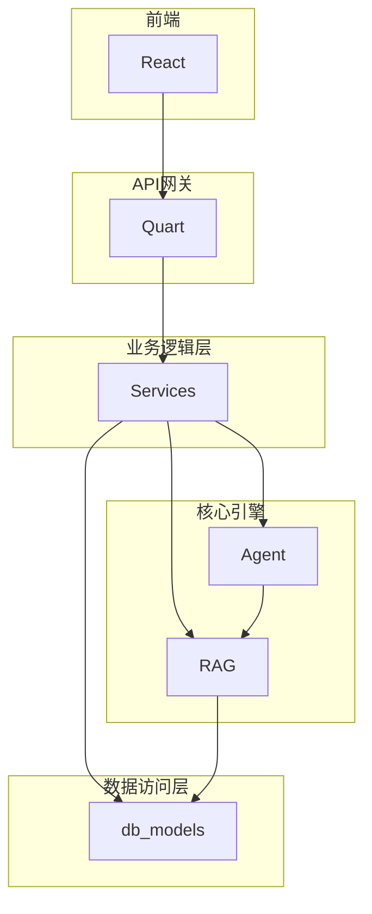
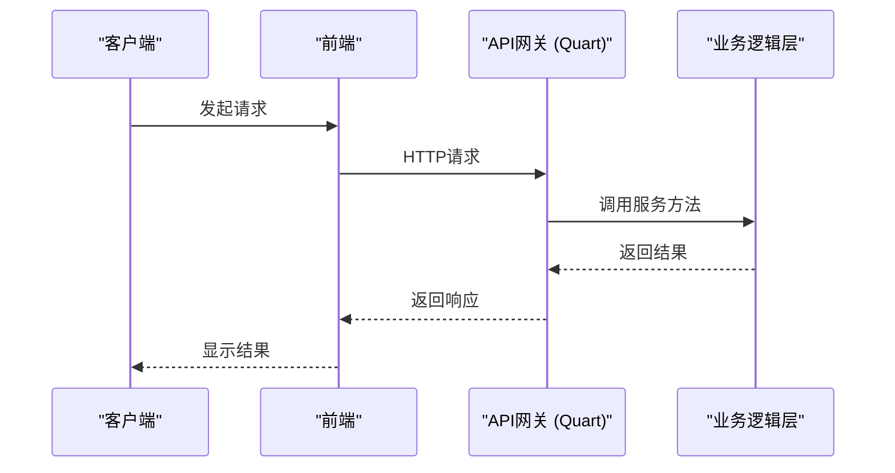
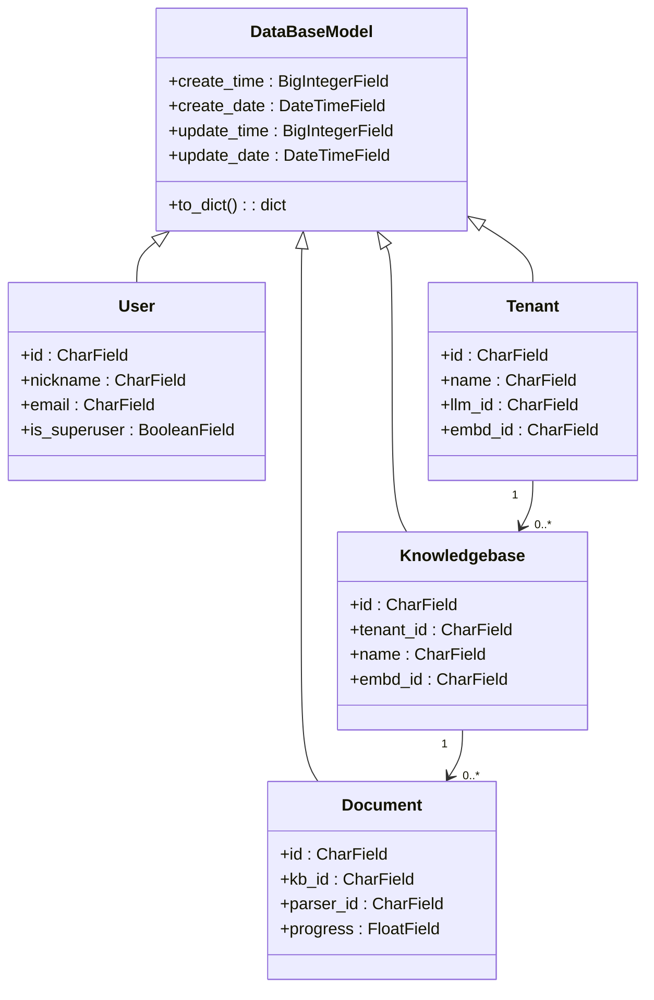
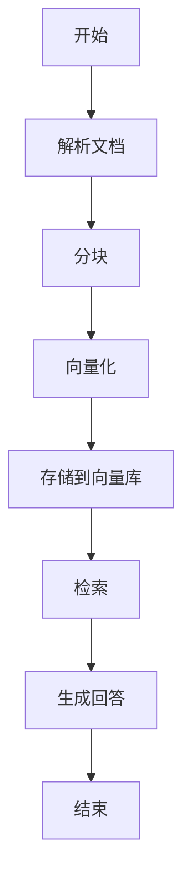
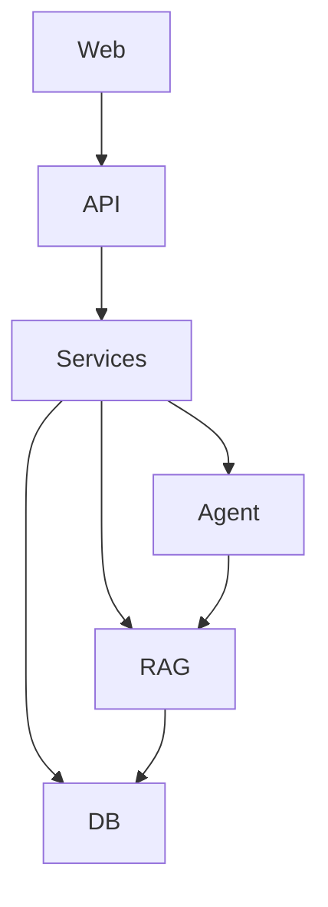

# 技术架构

<cite>
**本文档引用的文件**
- [ragflow_server.py](file://api/ragflow_server.py)
- [api_app.py](file://api/apps/api_app.py)
- [conversation_app.py](file://api/apps/conversation_app.py)
- [db_models.py](file://api/db/db_models.py)
- [document_service.py](file://api/db/services/document_service.py)
- [task_service.py](file://api/db/services/task_service.py)
- [pipeline.py](file://rag/flow/pipeline.py)
- [canvas.py](file://agent/canvas.py)
- [search.py](file://rag/nlp/search.py)
- [settings.py](file://common/settings.py)
- [redis_conn.py](file://rag/utils/redis_conn.py)
- [app.tsx](file://web/src/app.tsx)
</cite>

## 目录
1. [简介](#简介)
2. [项目结构](#项目结构)
3. [核心组件](#核心组件)
4. [架构概述](#架构概述)
5. [详细组件分析](#详细组件分析)
6. [依赖分析](#依赖分析)
7. [性能考虑](#性能考虑)
8. [故障排除指南](#故障排除指南)
9. [结论](#结论)

## 简介
RAGFlow是一个先进的检索增强生成（RAG）系统，采用分层架构设计，旨在提供强大的知识库管理和智能问答能力。该系统通过将前端、API网关、业务逻辑层、数据访问层和核心引擎分离，实现了高可维护性和可扩展性。本技术架构文档将深入探讨RAGFlow的系统设计，包括其分层架构、组件交互、关键设计决策以及RAG流水线的内部工作原理。

## 项目结构
RAGFlow项目采用模块化设计，主要分为以下几个核心部分：
- `web/`: 前端应用，基于React构建。
- `api/`: 后端服务，包含API网关和业务逻辑。
- `rag/`: 核心RAG引擎，负责解析、向量化和检索。
- `agent/`: 智能代理模块，支持复杂的任务编排。
- `common/`: 公共工具和配置。
- `conf/`: 系统配置文件。

这种清晰的目录结构有助于团队成员快速定位和理解各个功能模块。



**Diagram sources**
- [ragflow_server.py](file://api/ragflow_server.py)
- [app.tsx](file://web/src/app.tsx)

## 核心组件
RAGFlow的核心组件包括前端React应用、基于Quart的API网关、分层的服务层、数据模型层以及RAG和Agent核心引擎。这些组件协同工作，处理从用户请求到最终响应的整个流程。

**Section sources**
- [ragflow_server.py](file://api/ragflow_server.py)
- [app.tsx](file://web/src/app.tsx)

## 架构概述
RAGFlow采用经典的分层架构，确保了系统的高内聚和低耦合。该架构的主要优势在于其清晰的职责分离，使得每个层可以独立开发、测试和部署。

```mermaid
graph TD
A[用户] --> B[前端 (React)]
B --> C[API网关 (Quart)]
C --> D[业务逻辑层 (Services)]
D --> E[数据访问层 (db_models)]
D --> F[核心引擎 (RAG, Agent)]
E --> G[(数据库)]
F --> G
F --> H[(向量库)]
F --> I[(对象存储)]
```

**Diagram sources**
- [ragflow_server.py](file://api/ragflow_server.py)
- [settings.py](file://common/settings.py)

## 详细组件分析

### 前端 (React)
前端应用使用React框架构建，提供了现代化的用户界面。它通过HTTP API与后端Quart服务进行通信，实现数据的动态加载和交互。

**Section sources**
- [app.tsx](file://web/src/app.tsx)

### API网关 (Quart)
API网关是基于Quart框架构建的，Quart是一个异步Python Web框架，与Flask API兼容，但支持异步编程。选择Quart而非Flask的主要原因是其对异步I/O的原生支持，这对于处理高并发的RAG任务至关重要。异步特性允许服务器在等待数据库或外部API响应时处理其他请求，从而显著提高吞吐量和响应速度。



**Diagram sources**
- [ragflow_server.py](file://api/ragflow_server.py)
- [api_app.py](file://api/apps/api_app.py)

### 业务逻辑层 (Services)
业务逻辑层由一系列服务类组成，如`DocumentService`和`TaskService`，它们封装了核心业务规则。这种分层服务架构极大地提高了代码的可维护性。通过将业务逻辑集中在一个独立的层中，可以轻松地进行单元测试，并且当需要修改业务规则时，只需更改服务层代码，而不会影响到API接口或数据访问层。

**Section sources**
- [document_service.py](file://api/db/services/document_service.py)
- [task_service.py](file://api/db/services/task_service.py)

### 数据访问层 (db_models)
数据访问层基于Peewee ORM，定义了系统中的所有数据模型，如`User`、`Knowledgebase`和`Document`。该层通过`DataBaseModel`基类提供了统一的数据库操作接口，并实现了连接池和重试机制，以增强系统的稳定性和可靠性。



**Diagram sources**
- [db_models.py](file://api/db/db_models.py)

### 核心引擎 (RAG, Agent)
核心引擎是RAGFlow的智能中枢，由RAG流水线和Agent工作流组成。

#### RAG流水线
RAG流水线（`rag/flow/pipeline.py`）是协调文档处理流程的核心。它通过一个有向无环图（DAG）来定义和执行一系列任务，包括解析、分块、向量化和检索。其内部工作原理如下：
1.  **初始化**: 流水线接收一个DSL（领域特定语言）配置，该配置定义了任务的执行顺序和参数。
2.  **执行**: `run`方法按拓扑顺序遍历DAG中的每个组件。
3.  **回调**: `callback`方法用于更新任务进度和日志，这些信息通过Redis存储，供前端实时查询。
4.  **协调**: 流水线通过`DocumentService`和`TaskService`与业务逻辑层交互，管理文档状态和任务队列。



**Diagram sources**
- [pipeline.py](file://rag/flow/pipeline.py)

#### Agent工作流
Agent工作流（`agent/canvas.py`）是一个更高级的编排引擎，允许用户通过图形化界面构建复杂的自动化流程。它继承自`Graph`类，支持条件分支、循环和异常处理，能够执行如“检索-生成-分类”等多步骤任务。

**Section sources**
- [pipeline.py](file://rag/flow/pipeline.py)
- [canvas.py](file://agent/canvas.py)

## 依赖分析
RAGFlow的组件间依赖关系清晰且合理。前端依赖于API网关提供的RESTful接口。API网关依赖于业务逻辑层的服务。业务逻辑层服务则依赖于数据访问层的模型和核心引擎的功能。核心引擎（RAG）直接依赖于数据访问层来读写数据库和向量库。这种单向依赖关系避免了循环依赖，保证了架构的稳定性。



**Diagram sources**
- [ragflow_server.py](file://api/ragflow_server.py)

## 性能考虑
RAGFlow在设计时充分考虑了性能因素：
- **异步处理**: 使用Quart框架实现异步API，提高了并发处理能力。
- **连接池**: 数据库连接使用连接池（`RetryingPooledMySQLDatabase`），减少了连接开销。
- **重试机制**: 在数据库和网络操作中实现了重试逻辑，增强了系统的容错性。
- **缓存**: 使用Redis作为缓存和消息队列，用于存储会话、任务状态和日志，减轻了数据库压力。
- **批量操作**: 在数据处理中采用批量插入和查询，优化了I/O性能。

## 故障排除指南
当系统出现问题时，可以按照以下步骤进行排查：
1.  **检查日志**: 查看`ragflow_server.py`和各个服务的日志，定位错误信息。
2.  **验证配置**: 确认`conf/`目录下的配置文件（如`service_conf.yaml`）是否正确。
3.  **检查依赖服务**: 确保数据库、Redis、向量库等外部服务正常运行。
4.  **检查任务状态**: 通过`DocumentService.get_unfinished_docs()`和`TaskService.get_tasks()`检查是否有卡住的任务。
5.  **检查资源**: 监控CPU、内存和磁盘使用情况，确保没有资源瓶颈。

**Section sources**
- [ragflow_server.py](file://api/ragflow_server.py)
- [document_service.py](file://api/db/services/document_service.py)
- [task_service.py](file://api/db/services/task_service.py)

## 结论
RAGFlow通过采用分层架构和现代化的技术栈，构建了一个强大、灵活且可维护的RAG系统。选择Quart作为API网关为系统带来了显著的性能优势，而分层的服务架构则确保了代码的清晰和可维护性。RAG流水线和Agent工作流的设计，使得系统既能处理标准的检索生成任务，也能支持复杂的自动化流程。总体而言，RAGFlow的架构设计是其成功的关键，为未来的功能扩展和性能优化奠定了坚实的基础。