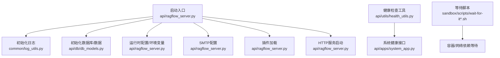
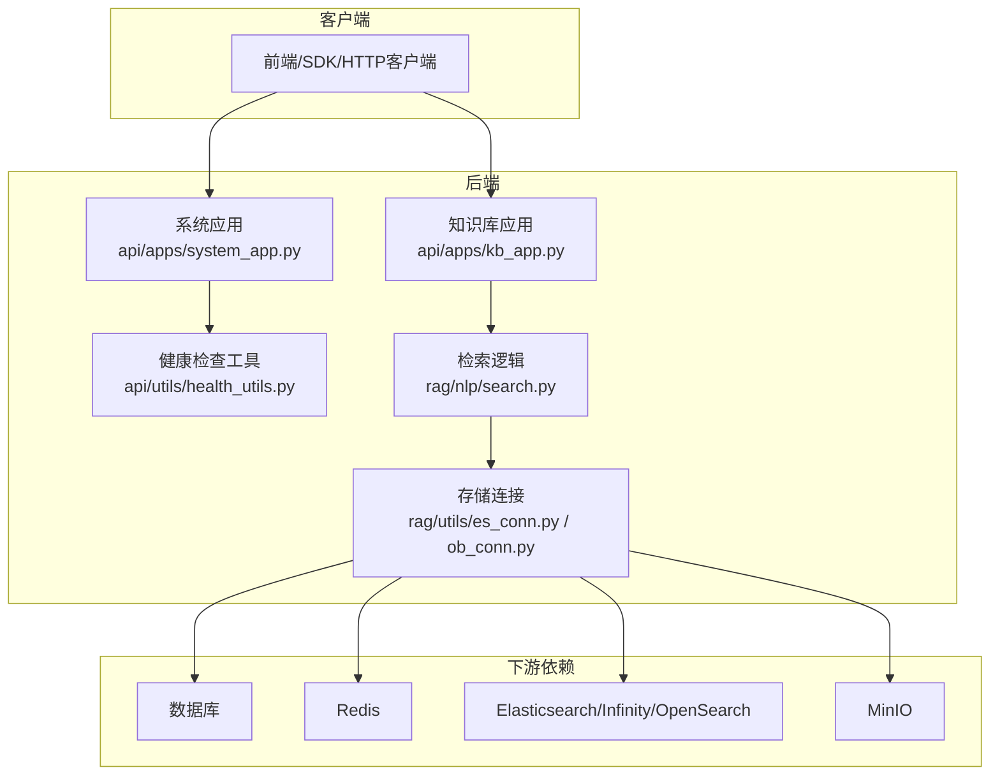
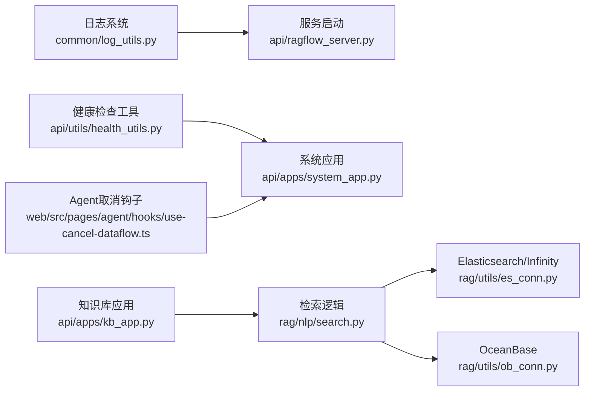

# 故障排除

<cite>
**本文引用的文件**
- [ragflow_server.py](file://api/ragflow_server.py)
- [log_utils.py](file://common/log_utils.py)
- [health_utils.py](file://api/utils/health_utils.py)
- [system_app.py](file://api/apps/system_app.py)
- [api_utils.py](file://api/utils/api_utils.py)
- [db_models.py](file://api/db/db_models.py)
- [es_conn.py](file://rag/utils/es_conn.py)
- [ob_conn.py](file://rag/utils/ob_conn.py)
- [search.py](file://rag/nlp/search.py)
- [kb_app.py](file://api/apps/kb_app.py)
- [conftest.py](file://test/testcases/conftest.py)
- [test_retrieval_chunks.py](file://test/testcases/test_sdk_api/test_chunk_management_within_dataset/test_retrieval_chunks.py)
- [test_http_retrieval_chunks.py](file://test/testcases/test_http_api/test_chunk_management_within_dataset/test_retrieval_chunks.py)
- [wait-for-it-http.sh](file://sandbox/scripts/wait-for-it-http.sh)
- [wait-for-it.sh](file://sandbox/scripts/wait-for-it.sh)
- [migration.sh](file://docker/migration.sh)
- [configurations.md](file://docs/configurations.md)
- [run_health_check.md](file://docs/guides/run_health_check.md)
- [exceptions.py](file://common/exceptions.py)
</cite>

## 目录
1. [简介](#简介)
2. [项目结构与入口](#项目结构与入口)
3. [核心组件与职责](#核心组件与职责)
4. [架构总览](#架构总览)
5. [详细故障场景与排障流程](#详细故障场景与排障流程)
6. [依赖关系分析](#依赖关系分析)
7. [性能与稳定性建议](#性能与稳定性建议)
8. [故障排查清单](#故障排查清单)
9. [结论](#结论)

## 简介
本指南面向RAGFlow使用者与运维人员，系统梳理在使用过程中可能遇到的常见问题：文档解析失败、API调用超时、向量检索无结果、Agent执行卡住等，并提供可操作的诊断步骤与解决方案。重点覆盖：
- 如何查看后端日志（服务启动与运行日志）
- 前端控制台错误定位
- 服务健康状态检查与健康检查工具
- 利用测试用例理解预期行为模式，辅助问题定位
- 配置与部署相关问题的排查要点

## 项目结构与入口
RAGFlow后端以HTTP服务为主入口，启动脚本负责初始化数据库、运行时配置、SMTP邮件配置、插件加载与HTTP服务器启动。健康检查接口位于系统应用模块中，提供统一的健康状态查询与任务执行器心跳检测。

图表来源
- [ragflow_server.py](file://api/ragflow_server.py#L74-L167)
- [log_utils.py](file://common/log_utils.py#L25-L74)
- [health_utils.py](file://api/utils/health_utils.py#L187-L223)
- [system_app.py](file://api/apps/system_app.py#L174-L183)

章节来源
- [ragflow_server.py](file://api/ragflow_server.py#L74-L167)
- [system_app.py](file://api/apps/system_app.py#L174-L183)

## 核心组件与职责
- 启动与日志
  - 启动入口负责初始化根日志、打印版本与配置、加载插件、启动HTTP服务。
  - 日志系统支持文件轮转与标准输出，可通过环境变量调整日志级别。
- 健康检查
  - 提供统一的健康检查聚合器，分别探测数据库、Redis、文档引擎（Elasticsearch/Infinity/OpenSearch）、对象存储（MinIO）、RAGFlow服务自身、任务执行器心跳。
  - 系统应用模块提供对外的健康接口与轻量“ping”接口。
- 检索与解析
  - 文档解析与向量检索涉及多层组件：知识库应用层、NLP检索层、底层存储连接（Elasticsearch/Infinity/OceanBase等）。
- 异常与错误响应
  - 统一的异常捕获与错误响应生成，便于前端与自动化脚本识别错误类型。

章节来源
- [log_utils.py](file://common/log_utils.py#L25-L74)
- [health_utils.py](file://api/utils/health_utils.py#L187-L223)
- [system_app.py](file://api/apps/system_app.py#L174-L183)
- [api_utils.py](file://api/utils/api_utils.py#L109-L138)

## 架构总览
下图展示从客户端到后端服务、再到下游依赖（数据库、Redis、文档引擎、对象存储）的关键路径与健康检查位置。

图表来源
- [system_app.py](file://api/apps/system_app.py#L174-L183)
- [health_utils.py](file://api/utils/health_utils.py#L187-L223)
- [kb_app.py](file://api/apps/kb_app.py#L826-L857)
- [search.py](file://rag/nlp/search.py#L359-L397)
- [es_conn.py](file://rag/utils/es_conn.py#L270-L289)
- [ob_conn.py](file://rag/utils/ob_conn.py#L1109-L1135)

## 详细故障场景与排障流程

### 场景一：文档解析失败
- 可能原因
  - 文件格式不受支持或解析器未正确选择
  - 解析过程被中断或超时
  - 结构化数据自动跳过Raptor导致未生成分块
- 诊断步骤
  - 查看后端日志：确认解析开始、中间阶段与结束状态；关注解析器选择与Raptor策略。
  - 使用健康检查：确认文档引擎与存储可用。
  - 参考测试用例：验证不同文件类型的解析期望行为。
- 解决方案
  - 调整解析器配置或切换到适合的解析器
  - 对结构化数据关闭自动跳过Raptor（若需要保留分块）
  - 确认对象存储与文档引擎连通性

章节来源
- [test_retrieval_chunks.py](file://test/testcases/test_sdk_api/test_chunk_management_within_dataset/test_retrieval_chunks.py#L118-L151)
- [test_http_retrieval_chunks.py](file://test/testcases/test_http_api/test_chunk_management_within_dataset/test_retrieval_chunks.py#L177-L214)
- [health_utils.py](file://api/utils/health_utils.py#L187-L223)

### 场景二：API调用超时
- 可能原因
  - 文档引擎查询超时（Elasticsearch/Infinity）
  - 数据库连接丢失或重试失败
  - 网络不稳定或上游服务不可达
- 诊断步骤
  - 使用健康检查工具对文档引擎与数据库进行探测
  - 在后端日志中定位超时发生的具体阶段（搜索、获取、写入）
  - 使用等待脚本验证服务可达性
- 解决方案
  - 调整超时阈值或分页参数
  - 修复数据库连接池与重试策略
  - 优化网络与上游服务可用性

章节来源
- [es_conn.py](file://rag/utils/es_conn.py#L270-L289)
- [db_models.py](file://api/db/db_models.py#L272-L308)
- [wait-for-it-http.sh](file://sandbox/scripts/wait-for-it-http.sh#L1-L31)
- [wait-for-it.sh](file://sandbox/scripts/wait-for-it.sh#L1-L50)

### 场景三：向量检索无结果
- 可能原因
  - 知识库为空或未完成解析
  - 查询参数不合法（如top_k、相似度权重）
  - 文档引擎未建立索引或索引损坏
- 诊断步骤
  - 通过系统应用的“状态”接口检查文档引擎与数据库状态
  - 使用检索测试用例验证不同参数组合下的返回
  - 检查知识库应用层是否正确构造查询与分页
- 解决方案
  - 确保文档已成功解析并入库
  - 调整查询参数至有效范围
  - 重建索引或修复索引

章节来源
- [system_app.py](file://api/apps/system_app.py#L65-L172)
- [kb_app.py](file://api/apps/kb_app.py#L826-L857)
- [search.py](file://rag/nlp/search.py#L359-L397)
- [test_http_retrieval_chunks.py](file://test/testcases/test_http_api/test_chunk_management_within_dataset/test_retrieval_chunks.py#L177-L214)

### 场景四：Agent执行卡住
- 可能原因
  - 任务执行器心跳缺失或异常
  - 工具调用阻塞或外部服务超时
  - 任务取消或中断异常
- 诊断步骤
  - 使用健康检查接口查看任务执行器心跳集合
  - 检查后端日志中的Agent执行链路与异常堆栈
  - 使用前端提供的取消能力尝试终止当前数据流
- 解决方案
  - 重启任务执行器或修复心跳机制
  - 优化工具调用超时与重试策略
  - 处理任务取消异常（如取消异常类型）

章节来源
- [health_utils.py](file://api/utils/health_utils.py#L166-L185)
- [exceptions.py](file://common/exceptions.py#L16-L19)
- [web/src/pages/agent/hooks/use-cancel-dataflow.ts](file://web/src/pages/agent/hooks/use-cancel-dataflow.ts#L1-L21)

### 场景五：服务启动失败或无法访问
- 可能原因
  - 端口冲突或监听地址配置错误
  - 依赖服务（数据库、Redis、文档引擎、对象存储）未就绪
  - 配置文件不一致或环境变量缺失
- 诊断步骤
  - 查看启动日志，确认版本、基础目录与配置打印
  - 使用等待脚本验证端口与URL可达
  - 执行迁移脚本前检查容器占用情况
- 解决方案
  - 修正监听地址与端口
  - 先启动依赖服务再启动主服务
  - 对齐.env与service_conf.yaml模板配置

章节来源
- [ragflow_server.py](file://api/ragflow_server.py#L74-L167)
- [wait-for-it-http.sh](file://sandbox/scripts/wait-for-it-http.sh#L1-L31)
- [wait-for-it.sh](file://sandbox/scripts/wait-for-it.sh#L1-L50)
- [migration.sh](file://docker/migration.sh#L98-L125)
- [configurations.md](file://docs/configurations.md#L141-L144)

## 依赖关系分析
- 后端服务依赖
  - 日志：根日志初始化与级别控制
  - 健康检查：统一探测数据库、Redis、文档引擎、存储、RAGFlow服务、任务执行器
  - 应用层：系统应用提供健康接口与轻量ping接口
  - 检索层：知识库应用与NLP检索共同依赖底层存储连接
- 前端交互
  - Agent执行支持取消能力，便于在卡住时主动中断

图表来源
- [log_utils.py](file://common/log_utils.py#L25-L74)
- [ragflow_server.py](file://api/ragflow_server.py#L74-L167)
- [health_utils.py](file://api/utils/health_utils.py#L187-L223)
- [system_app.py](file://api/apps/system_app.py#L174-L183)
- [kb_app.py](file://api/apps/kb_app.py#L826-L857)
- [search.py](file://rag/nlp/search.py#L359-L397)
- [es_conn.py](file://rag/utils/es_conn.py#L270-L289)
- [ob_conn.py](file://rag/utils/ob_conn.py#L1109-L1135)
- [use-cancel-dataflow.ts](file://web/src/pages/agent/hooks/use-cancel-dataflow.ts#L1-L21)

## 性能与稳定性建议
- 合理设置日志级别，避免过多INFO/WARN日志影响性能
- 对数据库连接采用指数退避重试，减少瞬时抖动
- 对文档引擎查询设置合理的top_k与相似度阈值，避免过度扫描
- 使用健康检查定期巡检，提前发现依赖异常
- 在生产环境启用任务执行器心跳监控，及时发现执行器离线

[本节为通用建议，无需列出具体文件来源]

## 故障排查清单
- 启动与日志
  - 查看服务启动日志，确认版本与配置打印
  - 检查日志文件路径与日志级别
- 健康检查
  - 访问系统健康接口，确认各依赖状态
  - 使用健康检查工具脚本探测服务可用性
- 检索与解析
  - 验证知识库是否包含已解析的文档
  - 使用测试用例验证不同参数组合的返回
- Agent执行
  - 检查任务执行器心跳
  - 使用前端取消能力终止卡住的数据流
- 部署与配置
  - 对齐.env与service_conf.yaml模板
  - 迁移前检查容器占用，避免卷冲突

章节来源
- [run_health_check.md](file://docs/guides/run_health_check.md#L1-L110)
- [conftest.py](file://test/testcases/conftest.py#L1-L153)

## 结论
通过结合后端日志、健康检查工具与测试用例，可以快速定位并解决RAGFlow在文档解析、API调用、向量检索与Agent执行等方面的常见问题。建议在日常运维中将健康检查纳入自动化巡检，并在部署前完成配置一致性校验，以提升系统稳定性与可维护性。