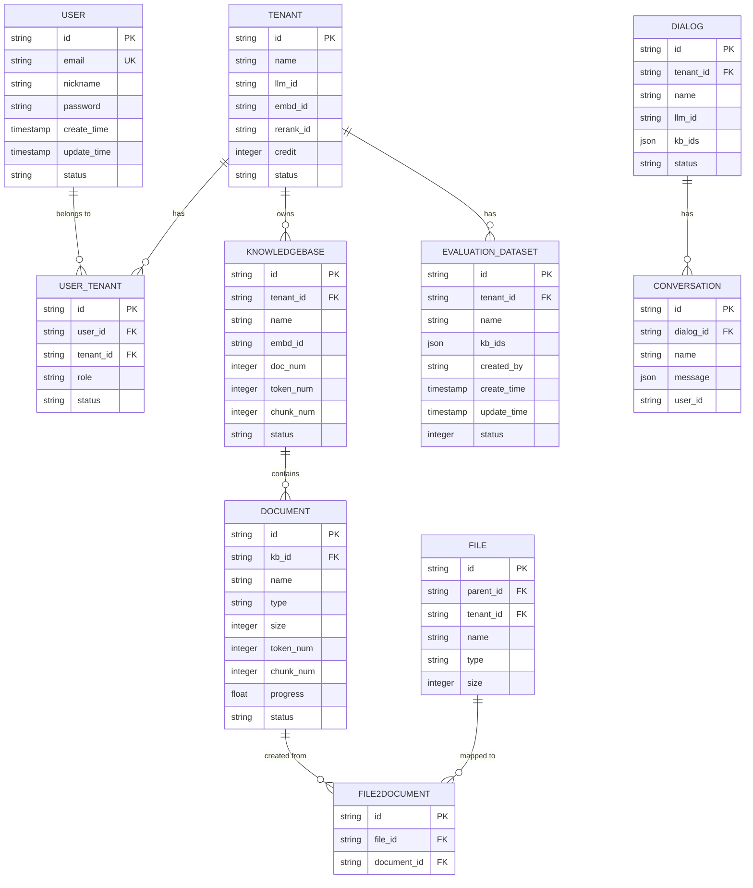

# 数据模型

<cite>
**本文档引用的文件**
- [db_models.py](file://api/db/db_models.py)
- [init.sql](file://docker/init.sql)
- [service_conf.yaml](file://conf/service_conf.yaml)
- [constants.py](file://common/constants.py)
</cite>

## 目录
1. [简介](#简介)
2. [核心数据实体](#核心数据实体)
   1. [用户 (User)](#用户-user)
   2. [租户 (Tenant)](#租户-tenant)
   3. [知识库 (Knowledgebase)](#知识库-knowledgebase)
   4. [文档 (Document)](#文档-document)
   5. [会话 (Conversation)](#会话-conversation)
   6. [对话 (Dialog)](#对话-dialog)
   7. [文件 (File)](#文件-file)
   8. [数据集 (EvaluationDataset)](#数据集-evaluationdataset)
3. [关键实体关系](#关键实体关系)
4. [实体关系图 (ER图)](#实体关系图-er图)
5. [数据库配置与验证](#数据库配置与验证)

## 简介

本文档详细描述了RAGFlow系统的数据库模型。该模型基于`Peewee` ORM框架实现，定义了系统中所有核心数据实体及其关系。文档的核心是`/api/db/db_models.py`文件中的模型类，我们结合`/docker/init.sql`中的表结构定义进行了交叉验证。

数据模型围绕“租户-用户-知识库-文档”这一核心架构展开，支持多租户环境下的知识管理和对话应用。每个实体都包含了丰富的元数据和业务逻辑字段，以支持系统的复杂功能，如文档解析、向量检索、对话管理等。

**Section sources**
- [db_models.py](file://api/db/db_models.py#L1-L1421)
- [init.sql](file://docker/init.sql#L1-L2)

## 核心数据实体

### 用户 (User)

`User`实体代表系统中的用户，是身份认证和权限管理的基础。

**字段列表:**

| 字段名 | 数据类型 | 约束 | 业务含义 |
| :--- | :--- | :--- | :--- |
| `id` | CharField(32) | 主键, 索引 | 用户的唯一标识符 |
| `access_token` | CharField(255) | 索引 | 用于身份验证的访问令牌 |
| `nickname` | CharField(100) | 非空, 索引 | 用户的昵称 |
| `password` | CharField(255) | 索引 | 加密后的用户密码 |
| `email` | CharField(255) | 非空, 索引 | 用户的邮箱地址，通常作为登录名 |
| `avatar` | TextField | | 用户头像的Base64编码字符串 |
| `language` | CharField(32) | 索引 | 用户界面语言 (Chinese/English) |
| `color_schema` | CharField(32) | 索引 | 用户界面配色方案 (Bright/Dark) |
| `timezone` | CharField(64) | 索引 | 用户时区 |
| `last_login_time` | DateTimeField | 索引 | 上次登录时间 |
| `is_authenticated` | CharField(1) | 非空, 索引 | 是否已认证 (1: 是, 0: 否) |
| `is_active` | CharField(1) | 非空, 索引 | 账户是否激活 (1: 是, 0: 否) |
| `is_anonymous` | CharField(1) | 非空, 索引 | 是否为匿名用户 (1: 是, 0: 否) |
| `login_channel` | CharField | 索引 | 登录渠道 (如: github, oidc) |
| `status` | CharField(1) | 索引 | 账户状态 (1: 有效, 0: 废弃) |
| `is_superuser` | BooleanField | 索引 | 是否为超级管理员 |

**Section sources**
- [db_models.py](file://api/db/db_models.py#L598-L625)

### 租户 (Tenant)

`Tenant`实体代表一个独立的组织或团队，是多租户架构的核心。所有资源（如知识库、文档）都归属于某个租户。

**字段列表:**

| 字段名 | 数据类型 | 约束 | 业务含义 |
| :--- | :--- | :--- | :--- |
| `id` | CharField(32) | 主键, 索引 | 租户的唯一标识符 |
| `name` | CharField(100) | 索引 | 租户名称 |
| `public_key` | CharField(255) | 索引 | 租户的公钥 |
| `llm_id` | CharField(128) | 非空, 索引 | 默认的大语言模型 (LLM) ID |
| `embd_id` | CharField(128) | 非空, 索引 | 默认的嵌入模型 (Embedding Model) ID |
| `asr_id` | CharField(128) | 非空, 索引 | 默认的语音识别模型 (ASR Model) ID |
| `img2txt_id` | CharField(128) | 非空, 索引 | 默认的图像转文本模型 (Image2Text Model) ID |
| `rerank_id` | CharField(128) | 非空, 索引 | 默认的重排序模型 (Rerank Model) ID |
| `tts_id` | CharField(256) | 索引 | 默认的文本转语音模型 (TTS Model) ID |
| `parser_ids` | CharField(256) | 非空, 索引 | 可用的文档解析器列表 |
| `credit` | IntegerField | 索引 | 租户的信用额度 |
| `status` | CharField(1) | 索引 | 租户状态 (1: 有效, 0: 废弃) |

**Section sources**
- [db_models.py](file://api/db/db_models.py#L627-L643)

### 知识库 (Knowledgebase)

`Knowledgebase`实体代表一个知识库，是文档的集合。它是RAG（检索增强生成）系统的核心，用于存储和检索知识。

**字段列表:**

| 字段名 | 数据类型 | 约束 | 业务含义 |
| :--- | :--- | :--- | :--- |
| `id` | CharField(32) | 主键, 索引 | 知识库的唯一标识符 |
| `avatar` | TextField | | 知识库头像的Base64编码字符串 |
| `tenant_id` | CharField(32) | 非空, 索引 | 所属租户的ID |
| `name` | CharField(128) | 非空, 索引 | 知识库名称 |
| `language` | CharField(32) | 索引 | 知识库语言 (Chinese/English) |
| `description` | TextField | | 知识库描述 |
| `embd_id` | CharField(128) | 非空, 索引 | 默认的嵌入模型ID |
| `permission` | CharField(16) | 非空, 索引 | 权限 (me: 个人, team: 团队) |
| `created_by` | CharField(32) | 非空, 索引 | 创建者ID |
| `doc_num` | IntegerField | 索引 | 文档数量 |
| `token_num` | IntegerField | 索引 | 总Token数 |
| `chunk_num` | IntegerField | 索引 | 分块数量 |
| `similarity_threshold` | FloatField | 索引 | 相似度阈值 |
| `vector_similarity_weight` | FloatField | 索引 | 向量相似度权重 |
| `parser_id` | CharField(32) | 非空, 索引 | 默认的文档解析器ID |
| `pipeline_id` | CharField(32) | 索引 | 数据处理管道ID |
| `parser_config` | JSONField | 非空 | 解析器配置，包含分页、上下文大小等 |
| `pagerank` | IntegerField | | 页面排名，用于排序 |
| `graphrag_task_id` | CharField(32) | 索引 | Graph RAG任务ID |
| `graphrag_task_finish_at` | DateTimeField | | Graph RAG任务完成时间 |
| `raptor_task_id` | CharField(32) | 索引 | RAPTOR任务ID |
| `raptor_task_finish_at` | DateTimeField | | RAPTOR任务完成时间 |
| `mindmap_task_id` | CharField(32) | 索引 | 思维导图任务ID |
| `mindmap_task_finish_at` | DateTimeField | | 思维导图任务完成时间 |
| `status` | CharField(1) | 索引 | 状态 (1: 有效, 0: 废弃) |

**Section sources**
- [db_models.py](file://api/db/db_models.py#L734-L768)

### 文档 (Document)

`Document`实体代表一个具体的文档，是知识库中的基本单元。一个知识库可以包含多个文档。

**字段列表:**

| 字段名 | 数据类型 | 约束 | 业务含义 |
| :--- | :--- | :--- | :--- |
| `id` | CharField(32) | 主键, 索引 | 文档的唯一标识符 |
| `thumbnail` | TextField | | 文档缩略图的Base64编码字符串 |
| `kb_id` | CharField(256) | 非空, 索引 | 所属知识库的ID |
| `parser_id` | CharField(32) | 非空, 索引 | 使用的文档解析器ID |
| `pipeline_id` | CharField(32) | 索引 | 数据处理管道ID |
| `parser_config` | JSONField | 非空 | 解析器配置，与知识库配置类似 |
| `source_type` | CharField(128) | 非空, 索引 | 文档来源 (local: 本地, knowledgebase: 知识库等) |
| `type` | CharField(32) | 非空, 索引 | 文件扩展名 |
| `created_by` | CharField(32) | 非空, 索引 | 创建者ID |
| `name` | CharField(255) | 索引 | 文件名 |
| `location` | CharField(255) | 索引 | 文件存储位置 |
| `size` | IntegerField | 索引 | 文件大小（字节） |
| `token_num` | IntegerField | 索引 | Token数量 |
| `chunk_num` | IntegerField | 索引 | 分块数量 |
| `progress` | FloatField | 索引 | 处理进度 (0.0 - 1.0) |
| `progress_msg` | TextField | | 处理过程中的消息 |
| `process_begin_at` | DateTimeField | 索引 | 处理开始时间 |
| `process_duration` | FloatField | | 处理持续时间（秒） |
| `meta_fields` | JSONField | | 元数据字段，用于存储自定义元数据 |
| `suffix` | CharField(32) | 非空, 索引 | 实际的文件扩展名后缀 |
| `run` | CharField(1) | 索引 | 处理状态 (0: 未开始, 1: 运行, 2: 取消) |
| `status` | CharField(1) | 索引 | 状态 (1: 有效, 0: 废弃) |

**Section sources**
- [db_models.py](file://api/db/db_models.py#L771-L797)

### 会话 (Conversation)

`Conversation`实体代表一次具体的对话会话，是用户与系统交互的记录。

**字段列表:**

| 字段名 | 数据类型 | 约束 | 业务含义 |
| :--- | :--- | :--- | :--- |
| `id` | CharField(32) | 主键, 索引 | 会话的唯一标识符 |
| `dialog_id` | CharField(32) | 非空, 索引 | 所属对话应用的ID |
| `name` | CharField(255) | 索引 | 会话名称 |
| `message` | JSONField | | 会话消息列表，包含用户和AI的对话记录 |
| `reference` | JSONField | | 检索到的参考信息列表 |
| `user_id` | CharField(255) | 索引 | 发起会话的用户ID |

**Section sources**
- [db_models.py](file://api/db/db_models.py#L877-L887)

### 对话 (Dialog)

`Dialog`实体代表一个对话应用或助手，定义了与用户交互的配置和行为。

**字段列表:**

| 字段名 | 数据类型 | 约束 | 业务含义 |
| :--- | :--- | :--- | :--- |
| `id` | CharField(32) | 主键, 索引 | 对话应用的唯一标识符 |
| `tenant_id` | CharField(32) | 非空, 索引 | 所属租户的ID |
| `name` | CharField(255) | 索引 | 对话应用名称 |
| `description` | TextField | | 对话应用描述 |
| `icon` | TextField | | 应用图标的Base64编码字符串 |
| `language` | CharField(32) | 索引 | 语言 (Chinese/English) |
| `llm_id` | CharField(128) | 非空 | 使用的LLM模型ID |
| `llm_setting` | JSONField | 非空 | LLM参数配置 (temperature, top_p等) |
| `prompt_type` | CharField(16) | 非空, 索引 | 提示词类型 (simple: 简单, advanced: 高级) |
| `prompt_config` | JSONField | 非空 | 提示词配置，包含系统提示、开场白等 |
| `meta_data_filter` | JSONField | | 元数据过滤器配置 |
| `similarity_threshold` | FloatField | | 相似度阈值 |
| `vector_similarity_weight` | FloatField | | 向量相似度权重 |
| `top_n` | IntegerField | | 返回前N个最相关的文档 |
| `top_k` | IntegerField | | 检索时考虑的前K个分块 |
| `do_refer` | CharField(1) | 非空 | 是否在回答中插入引用索引 |
| `rerank_id` | CharField(128) | 非空 | 使用的重排序模型ID |
| `kb_ids` | JSONField | 非空 | 关联的知识库ID列表 |
| `status` | CharField(1) | 索引 | 状态 (1: 有效, 0: 废弃) |

**Section sources**
- [db_models.py](file://api/db/db_models.py#L842-L875)

### 文件 (File)

`File`实体代表一个文件或文件夹，用于在用户界面中组织文件。

**字段列表:**

| 字段名 | 数据类型 | 约束 | 业务含义 |
| :--- | :--- | :--- | :--- |
| `id` | CharField(32) | 主键, 索引 | 文件的唯一标识符 |
| `parent_id` | CharField(32) | 非空, 索引 | 父文件夹的ID |
| `tenant_id` | CharField(32) | 非空, 索引 | 所属租户的ID |
| `created_by` | CharField(32) | 非空, 索引 | 创建者ID |
| `name` | CharField(255) | 非空, 索引 | 文件或文件夹名称 |
| `location` | CharField(255) | 索引 | 存储位置 |
| `size` | IntegerField | 索引 | 大小（字节） |
| `type` | CharField(32) | 非空, 索引 | 类型 (file: 文件, folder: 文件夹) |
| `source_type` | CharField(128) | 非空, 索引 | 来源 (local: 本地, notion: Notion等) |

**Section sources**
- [db_models.py](file://api/db/db_models.py#L800-L812)

### 数据集 (EvaluationDataset)

`EvaluationDataset`实体代表一个用于评估RAG系统性能的基准数据集。

**字段列表:**

| 字段名 | 数据类型 | 约束 | 业务含义 |
| :--- | :--- | :--- | :--- |
| `id` | CharField(32) | 主键, 索引 | 数据集的唯一标识符 |
| `tenant_id` | CharField(32) | 非空, 索引 | 所属租户的ID |
| `name` | CharField(255) | 非空, 索引 | 数据集名称 |
| `description` | TextField | | 数据集描述 |
| `kb_ids` | JSONField | 非空 | 用于评估的知识库ID列表 |
| `created_by` | CharField(32) | 非空, 索引 | 创建者ID |
| `create_time` | BigIntegerField | 非空, 索引 | 创建时间戳 |
| `update_time` | BigIntegerField | 非空 | 最后更新时间戳 |
| `status` | IntegerField | 非空 | 状态 (1: 有效, 0: 无效) |

**Section sources**
- [db_models.py](file://api/db/db_models.py#L1116-L1129)

## 关键实体关系

RAGFlow的数据模型通过外键和关联表定义了清晰的实体关系：

1.  **用户与租户 (User-Tenant)**:
    *   一个用户可以属于多个租户，反之亦然。
    *   这种多对多关系通过 `UserTenant` 关联表实现。
    *   `UserTenant` 表还记录了用户在租户中的角色 (`role`)。

2.  **租户与知识库 (Tenant-Knowledgebase)**:
    *   一个租户可以拥有多个知识库。
    *   一个知识库只能属于一个租户。
    *   这是一对多关系，通过 `Knowledgebase` 表中的 `tenant_id` 外键实现。

3.  **知识库与文档 (Knowledgebase-Document)**:
    *   一个知识库可以包含多个文档。
    *   一个文档只能属于一个知识库。
    *   这是一对多关系，通过 `Document` 表中的 `kb_id` 外键实现。

4.  **对话与会话 (Dialog-Conversation)**:
    *   一个对话应用可以发起多次会话。
    *   一次会话只能属于一个对话应用。
    *   这是一对多关系，通过 `Conversation` 表中的 `dialog_id` 外键实现。

5.  **文件与文档 (File-Document)**:
    *   一个文件可以被上传并创建为一个文档。
    *   一个文档可以由一个文件创建。
    *   这是一对一关系，通过 `File2Document` 关联表实现，该表记录了 `file_id` 和 `document_id` 的映射。

6.  **租户与大模型 (Tenant-LLM)**:
    *   一个租户可以配置多个大模型（来自不同厂商）。
    *   一个大模型可以被多个租户配置。
    *   这是多对多关系，通过 `TenantLLM` 关联表实现，该表存储了租户的API密钥等配置信息。

**Section sources**
- [db_models.py](file://api/db/db_models.py#L645-L655)
- [db_models.py](file://api/db/db_models.py#L734-L797)
- [db_models.py](file://api/db/db_models.py#L815-L822)
- [db_models.py](file://api/db/db_models.py#L842-L887)
- [db_models.py](file://api/db/db_models.py#L702-L718)

## 实体关系图 (ER图)

**Diagram sources**
- [db_models.py](file://api/db/db_models.py#L598-L655)
- [db_models.py](file://api/db/db_models.py#L734-L797)
- [db_models.py](file://api/db/db_models.py#L800-L822)
- [db_models.py](file://api/db/db_models.py#L842-L887)
- [db_models.py](file://api/db/db_models.py#L1116-L1129)

## 数据库配置与验证

我们通过检查 `/docker/init.sql` 和 `/conf/service_conf.yaml` 文件，对数据库模型进行了交叉验证。

1.  **数据库初始化**:
    *   `/docker/init.sql` 文件的第一行 `CREATE DATABASE IF NOT EXISTS rag_flow;` 确认了数据库名为 `rag_flow`。
    *   这与 `db_models.py` 中的模型定义一致，所有表都将在 `rag_flow` 数据库中创建。

2.  **数据库连接配置**:
    *   `/conf/service_conf.yaml` 文件中的 `mysql` 部分提供了数据库连接的详细信息：
        *   **数据库名**: `rag_flow` (与 `init.sql` 一致)
        *   **用户名**: `root`
        *   **密码**: `infini_rag_flow`
        *   **主机**: `localhost`
        *   **端口**: `5455`
    *   这些配置在 `common/settings.py` 中被读取，并通过 `common/config_utils.py` 进行解密（如果需要），最终用于初始化 `Peewee` 的数据库连接。

3.  **数据类型映射**:
    *   `db_models.py` 中定义了 `TextFieldType` 枚举，根据 `DATABASE_TYPE` 环境变量（默认为 `mysql`）将 `LongTextField` 映射为 `LONGTEXT` (MySQL) 或 `TEXT` (PostgreSQL)。
    *   这确保了模型定义与底层数据库的兼容性。

4.  **迁移机制**:
    *   `db_models.py` 文件末尾的 `migrate_db()` 函数展示了系统的数据库迁移策略。
    *   它使用 `playhouse.migrate` 模块来安全地添加新列、重命名列或修改列类型，而不会丢失现有数据。例如，代码中包含了为 `file` 表添加 `source_type` 列的迁移指令。

综上所述，`/api/db/db_models.py` 中的模型定义与 `/docker/init.sql` 和 `/conf/service_conf.yaml` 中的配置完全一致，形成了一个完整且可验证的数据库模型。

**Section sources**
- [init.sql](file://docker/init.sql#L1-L2)
- [service_conf.yaml](file://conf/service_conf.yaml#L7-L15)
- [db_models.py](file://api/db/db_models.py#L1201-L1421)
- [settings.py](file://common/settings.py#L65-L66)
- [config_utils.py](file://common/config_utils.py#L139-L144)