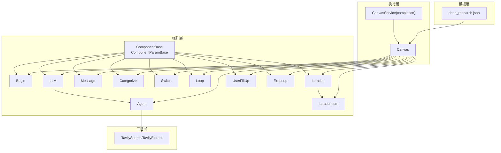
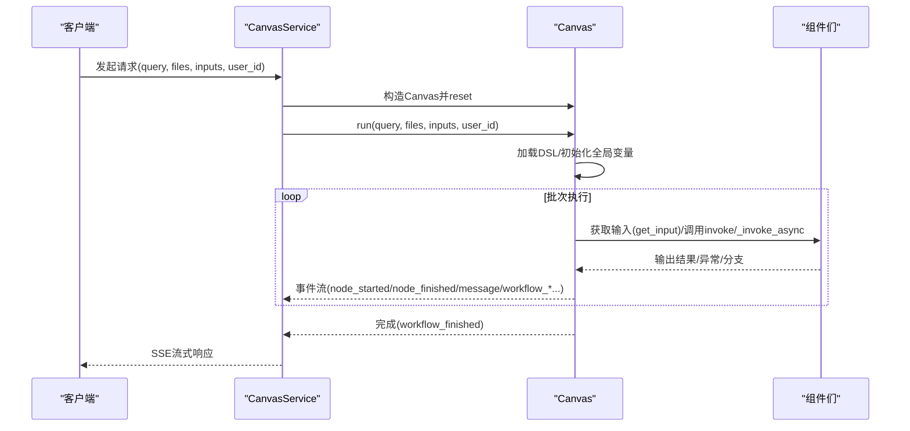
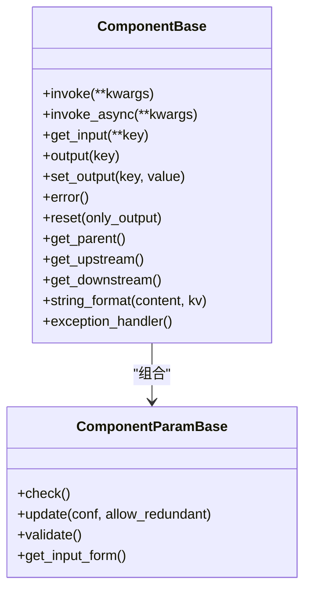
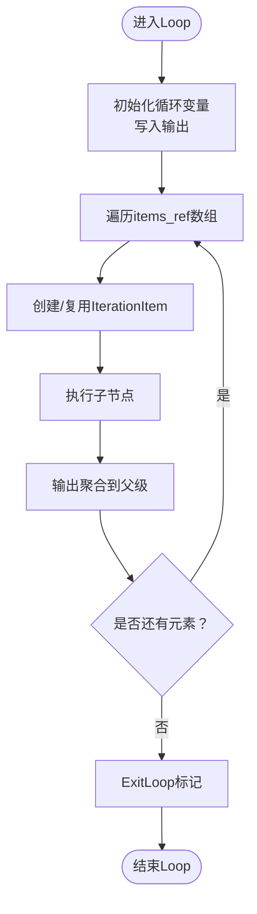
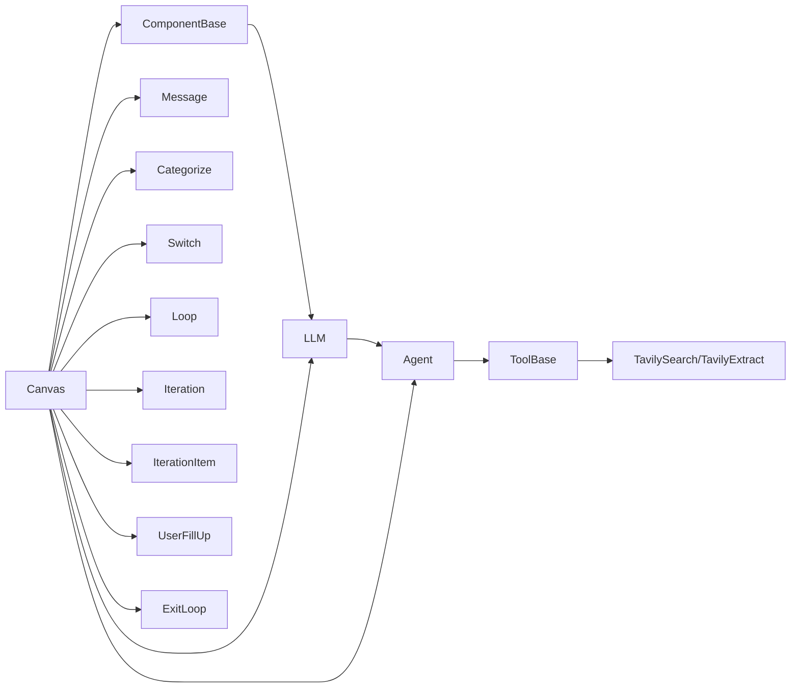
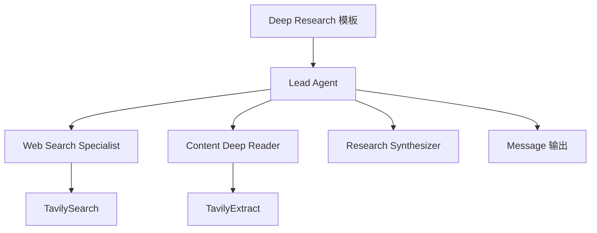

# Agent工作流引擎

<cite>
**本文引用的文件**
- [agent/canvas.py](file://agent/canvas.py)
- [agent/component/base.py](file://agent/component/base.py)
- [agent/component/begin.py](file://agent/component/begin.py)
- [agent/component/loop.py](file://agent/component/loop.py)
- [agent/component/iteration.py](file://agent/component/iteration.py)
- [agent/component/iterationitem.py](file://agent/component/iterationitem.py)
- [agent/component/fillup.py](file://agent/component/fillup.py)
- [agent/component/llm.py](file://agent/component/llm.py)
- [agent/component/message.py](file://agent/component/message.py)
- [agent/component/agent_with_tools.py](file://agent/component/agent_with_tools.py)
- [agent/component/categorize.py](file://agent/component/categorize.py)
- [agent/component/switch.py](file://agent/component/switch.py)
- [agent/component/exit_loop.py](file://agent/component/exit_loop.py)
- [agent/tools/tavily.py](file://agent/tools/tavily.py)
- [agent/templates/deep_research.json](file://agent/templates/deep_research.json)
- [api/db/services/canvas_service.py](file://api/db/services/canvas_service.py)
- [agent/settings.py](file://agent/settings.py)
</cite>

## 目录
1. [简介](#简介)
2. [项目结构](#项目结构)
3. [核心组件](#核心组件)
4. [架构总览](#架构总览)
5. [详细组件分析](#详细组件分析)
6. [依赖关系分析](#依赖关系分析)
7. [性能与并发特性](#性能与并发特性)
8. [故障排查与错误处理](#故障排查与错误处理)
9. [结论](#结论)
10. [附录：模板与示例](#附录模板与示例)

## 简介
本技术文档系统性梳理了Agent工作流引擎的组件模型、DSL（领域特定语言）定义、Canvas服务执行与监控流程、前端画布交互逻辑、外部工具调用机制以及状态管理与错误恢复策略。文档以“Begin、Categorize、Loop、Retrieval”等节点为例，解释其职责与配置方式；并通过`agent/templates/`目录下的复杂工作流模板（如`deep_research.json`）展示如何构建多智能体协同的端到端工作流；最后总结前端画布交互、状态管理与错误恢复的最佳实践。

## 项目结构
Agent工作流引擎主要由以下层次构成：
- 组件层：抽象基类与具体组件（Begin、LLM、Agent、Message、Categorize、Switch、Loop/Iteration、UserFillUp等）
- 工具层：外部工具封装（如TavilySearch、TavilyExtract）
- 执行层：Canvas与CanvasService，负责加载DSL、调度组件、事件流式输出、状态与引用管理
- 模板层：预置工作流模板，便于快速构建复杂任务

图表来源
- [agent/component/base.py](file://agent/component/base.py#L393-L611)
- [agent/component/begin.py](file://agent/component/begin.py#L1-L60)
- [agent/component/llm.py](file://agent/component/llm.py#L1-L418)
- [agent/component/agent_with_tools.py](file://agent/component/agent_with_tools.py#L1-L420)
- [agent/component/message.py](file://agent/component/message.py#L1-L267)
- [agent/component/categorize.py](file://agent/component/categorize.py#L1-L149)
- [agent/component/switch.py](file://agent/component/switch.py#L1-L141)
- [agent/component/loop.py](file://agent/component/loop.py#L1-L80)
- [agent/component/iteration.py](file://agent/component/iteration.py#L1-L72)
- [agent/component/iterationitem.py](file://agent/component/iterationitem.py#L1-L92)
- [agent/component/fillup.py](file://agent/component/fillup.py#L1-L78)
- [agent/component/exit_loop.py](file://agent/component/exit_loop.py#L1-L32)
- [agent/tools/tavily.py](file://agent/tools/tavily.py#L1-L252)
- [agent/canvas.py](file://agent/canvas.py#L1-L803)
- [api/db/services/canvas_service.py](file://api/db/services/canvas_service.py#L180-L353)
- [agent/templates/deep_research.json](file://agent/templates/deep_research.json#L1-L512)

章节来源
- [agent/canvas.py](file://agent/canvas.py#L1-L120)
- [api/db/services/canvas_service.py](file://api/db/services/canvas_service.py#L180-L353)

## 核心组件
- 组件基类与参数校验
  - ComponentBase：统一的组件生命周期、输入输出、异常处理、超时控制、父子关系、变量引用解析等
  - ComponentParamBase：参数更新、校验、默认值、用户反馈参数集合、参数验证规则等
- 典型组件
  - Begin：接收初始输入（含文件）、设置全局变量、触发后续节点
  - LLM：通用大模型组件，支持结构化输出、流式生成、引用注入、工具调用
  - Agent：具备工具调用能力的多轮对话组件，实现ReAct风格的思考-行动-反思循环
  - Message：消息输出组件，支持模板渲染、流式输出、附件生成
  - Categorize：基于历史对话与分类描述进行意图分类，动态路由
  - Switch：条件分支组件，按逻辑运算符判断目标下游
  - Loop/Iteration：循环控制，支持迭代列表项并聚合子节点输出
  - UserFillUp：用户交互收集，支持提示内容动态渲染
  - ExitLoop：退出循环标记
- 工具
  - TavilySearch/TavilyExtract：网络搜索与网页提取工具，支持参数化配置与重试

章节来源
- [agent/component/base.py](file://agent/component/base.py#L393-L611)
- [agent/component/begin.py](file://agent/component/begin.py#L1-L60)
- [agent/component/llm.py](file://agent/component/llm.py#L1-L418)
- [agent/component/agent_with_tools.py](file://agent/component/agent_with_tools.py#L1-L420)
- [agent/component/message.py](file://agent/component/message.py#L1-L267)
- [agent/component/categorize.py](file://agent/component/categorize.py#L1-L149)
- [agent/component/switch.py](file://agent/component/switch.py#L1-L141)
- [agent/component/loop.py](file://agent/component/loop.py#L1-L80)
- [agent/component/iteration.py](file://agent/component/iteration.py#L1-L72)
- [agent/component/iterationitem.py](file://agent/component/iterationitem.py#L1-L92)
- [agent/component/fillup.py](file://agent/component/fillup.py#L1-L78)
- [agent/component/exit_loop.py](file://agent/component/exit_loop.py#L1-L32)
- [agent/tools/tavily.py](file://agent/tools/tavily.py#L1-L252)

## 架构总览
Canvas作为工作流执行引擎，负责：
- 解析DSL，实例化组件，建立上下游关系
- 变量系统：支持sys/env/节点输出引用，动态求值与赋值
- 调度执行：按路径顺序批量执行可并行节点，事件流式输出
- 引用与记忆：维护检索引用、对话历史、工具使用追踪
- 取消与恢复：支持任务取消、异常分支与默认值回退

CanvasService提供HTTP接口，将请求转交给Canvas.run，实现OpenAI兼容的SSE流式输出。

图表来源
- [api/db/services/canvas_service.py](file://api/db/services/canvas_service.py#L180-L353)
- [agent/canvas.py](file://agent/canvas.py#L360-L642)

章节来源
- [api/db/services/canvas_service.py](file://api/db/services/canvas_service.py#L180-L353)
- [agent/canvas.py](file://agent/canvas.py#L360-L642)

## 详细组件分析

### 组件基类与参数系统
- 生命周期与异常处理
  - invoke/_invoke_async：统一记录开始时间、异常捕获、默认值回退、耗时统计
  - 超时装饰器：COMPONENT_EXEC_TIMEOUT控制单个组件执行上限
  - 取消检查：check_if_canceled在关键点中断并写入错误
- 输入输出与变量引用
  - get_input_elements_from_text：从文本中解析变量引用表达式
  - get_variable_value/set_variable_value：跨节点读取/写入输出
  - string_format：字符串插值
- 上下文与父链
  - get_parent/get_upstream/get_downstream：用于分支与循环控制
- 参数校验与验证
  - ComponentParamBase.update/check/validate：递归参数更新、类型校验、JSON Schema验证

图表来源
- [agent/component/base.py](file://agent/component/base.py#L393-L611)

章节来源
- [agent/component/base.py](file://agent/component/base.py#L393-L611)
- [agent/settings.py](file://agent/settings.py#L1-L19)

### Begin组件
- 职责：接收初始inputs，处理文件上传，设置组件输出与输入，初始化全局变量
- 配置要点：mode（conversational/task）、prologue（开场白）

章节来源
- [agent/component/begin.py](file://agent/component/begin.py#L1-L60)

### LLM组件
- 职责：通用大模型调用，支持结构化输出、流式生成、引用注入、图像输入
- 关键能力：
  - _prepare_prompt_variables：拼装系统提示、历史消息、变量替换
  - _generate/_generate_async：同步/异步生成
  - _generate_streamly/_generate_streamly_async：增量流式输出，支持“思考”标记
  - 结构化输出：通过structured_output_prompt与json_repair修复
  - 引用注入：根据引用块生成引用提示
- 配置要点：llm_id、sys_prompt、prompts、max_tokens、temperature/top_p、cite、visual_files_var等

章节来源
- [agent/component/llm.py](file://agent/component/llm.py#L1-L418)

### Agent组件（工具版）
- 职责：具备工具调用能力的多轮对话组件，ReAct风格
- 关键流程：
  - 分析任务、下一步决策、工具调用、反思、最终合成
  - 流式输出：边生成边调用工具，支持引用生成
  - 工具会话：LLMToolPluginCallSession，回调记录工具使用
- 配置要点：tools（工具组件列表）、mcp（MCP服务器工具）、max_rounds、user_prompt/context/reasoning

章节来源
- [agent/component/agent_with_tools.py](file://agent/component/agent_with_tools.py#L1-L420)

### Message组件
- 职责：消息输出，支持模板渲染、流式输出、附件生成（Markdown/HTML/PDF/DOCX）
- 关键能力：
  - _stream：按变量引用逐段流式输出，支持partial异步生成
  - Jinja2模板：对非流式内容进行渲染
  - 附件转换：通过pypandoc转换并上传存储

章节来源
- [agent/component/message.py](file://agent/component/message.py#L1-L267)

### Categorize组件
- 职责：基于历史对话与分类描述进行意图分类，返回分类名与下一跳下游
- 关键能力：
  - 动态构造sys_prompt与示例
  - 使用LLM进行分类，统计命中次数选择最可能类别
- 配置要点：category_description（类别映射）、message_history_window_size、query来源

章节来源
- [agent/component/categorize.py](file://agent/component/categorize.py#L1-L149)

### Switch组件
- 职责：条件分支，支持多种比较运算符与逻辑组合
- 关键能力：按条件计算结果，设置_next与next输出，决定下游路径
- 配置要点：conditions（条件列表）、end_cpn_ids（ELSE/其他分支）

章节来源
- [agent/component/switch.py](file://agent/component/switch.py#L1-L141)

### Loop/Iteration组件族
- Loop：初始化循环变量，将变量写入输出
- Iteration：读取items_ref数组，驱动IterationItem
- IterationItem：逐项处理，聚合兄弟节点输出到父级
- ExitLoop：退出循环标记

图表来源
- [agent/component/loop.py](file://agent/component/loop.py#L1-L80)
- [agent/component/iteration.py](file://agent/component/iteration.py#L1-L72)
- [agent/component/iterationitem.py](file://agent/component/iterationitem.py#L1-L92)
- [agent/component/exit_loop.py](file://agent/component/exit_loop.py#L1-L32)

章节来源
- [agent/component/loop.py](file://agent/component/loop.py#L1-L80)
- [agent/component/iteration.py](file://agent/component/iteration.py#L1-L72)
- [agent/component/iterationitem.py](file://agent/component/iterationitem.py#L1-L92)
- [agent/component/exit_loop.py](file://agent/component/exit_loop.py#L1-L32)

### UserFillUp组件
- 职责：在需要用户输入时，生成提示内容并收集inputs
- 关键能力：tips内容动态渲染、文件上传处理、输出写入

章节来源
- [agent/component/fillup.py](file://agent/component/fillup.py#L1-L78)

### 外部工具（以Tavily为例）
- TavilySearch：关键词搜索，抽取结果并格式化为可检索块
- TavilyExtract：从URL列表提取网页内容
- 配置要点：api_key、topic/search_depth/max_results/days/include_*等

章节来源
- [agent/tools/tavily.py](file://agent/tools/tavily.py#L1-L252)

## 依赖关系分析
- 组件依赖
  - LLM与Agent均继承自ComponentBase，复用统一的生命周期与参数系统
  - Agent组合ToolBase与LLMToolPluginCallSession，实现工具调用
  - Canvas持有Graph对象，Graph持有组件字典与路径，负责变量解析与执行调度
- 外部依赖
  - LLMBundle：统一的大模型调用入口
  - Redis：任务取消标记、日志追踪
  - pypandoc：消息附件转换
  - TavilyClient：网络搜索与提取

图表来源
- [agent/component/base.py](file://agent/component/base.py#L393-L611)
- [agent/component/llm.py](file://agent/component/llm.py#L1-L418)
- [agent/component/agent_with_tools.py](file://agent/component/agent_with_tools.py#L1-L420)
- [agent/tools/tavily.py](file://agent/tools/tavily.py#L1-L252)
- [agent/canvas.py](file://agent/canvas.py#L1-L200)

章节来源
- [agent/component/base.py](file://agent/component/base.py#L393-L611)
- [agent/component/agent_with_tools.py](file://agent/component/agent_with_tools.py#L1-L200)
- [agent/tools/tavily.py](file://agent/tools/tavily.py#L1-L120)
- [agent/canvas.py](file://agent/canvas.py#L1-L200)

## 性能与并发特性
- 并发执行
  - Canvas在每个批次内并行执行组件，使用线程池与异步协程混合模式
  - 对于支持异步的组件，优先使用异步调用，否则在线程池中执行
- 超时与重试
  - 单组件执行超时：COMPONENT_EXEC_TIMEOUT
  - 工具调用与LLM调用支持max_retries与delay_after_error
- 流式输出
  - LLM与Message支持增量输出，降低首屏延迟
- 内存与引用
  - 引用块采用哈希索引，避免重复存储
  - 历史窗口大小可配置，减少上下文长度

章节来源
- [agent/canvas.py](file://agent/canvas.py#L408-L520)
- [agent/component/llm.py](file://agent/component/llm.py#L330-L410)
- [agent/component/agent_with_tools.py](file://agent/component/agent_with_tools.py#L167-L244)

## 故障排查与错误处理
- 错误传播与分支
  - 组件异常可通过exception_handler返回goto/default_value，实现分支或默认值
  - Message在异常时可直接输出默认提示
- 取消机制
  - Canvas.is_canceled通过Redis标志位检测任务取消
  - 组件在关键点check_if_canceled，写入错误并提前返回
- 日志与追踪
  - tool_use_callback记录工具调用轨迹，便于审计与调试
  - 事件流包含node_finished、message、workflow_finished等，便于前端实时反馈

章节来源
- [agent/component/base.py](file://agent/component/base.py#L434-L475)
- [agent/canvas.py](file://agent/canvas.py#L267-L277)
- [agent/component/agent_with_tools.py](file://agent/component/agent_with_tools.py#L90-L110)

## 结论
该Agent工作流引擎通过组件化与DSL驱动的方式，实现了从简单到复杂的多智能体协作。CanvasService提供统一的执行入口与事件流式输出，组件基类确保一致的生命周期与错误处理，工具层扩展了外部能力。配合模板系统，用户可以快速搭建端到端的工作流，满足检索增强、多轮对话、条件分支、循环迭代等多种场景需求。

## 附录：模板与示例

### DSL与Canvas执行流程
- DSL结构要点
  - components：组件定义（component_name、params、upstream/downstream）
  - globals：全局变量（sys.*、env.*）
  - path：执行路径
  - retrieval/memory：检索与记忆数据
- Canvas.run执行要点
  - 初始化全局变量、文件解析、对话轮次递增
  - 批次执行：按上游满足情况并行调度
  - 事件流：node_started/node_finished/message/workflow_*等
  - 用户输入：遇到UserFillUp时暂停并返回用户输入表单

章节来源
- [agent/canvas.py](file://agent/canvas.py#L40-L120)
- [agent/canvas.py](file://agent/canvas.py#L360-L642)

### 复杂工作流模板：深度研究（Deep Research）
- 模板概览
  - 包含一个主Agent与三个子Agent：Web Search Specialist、Content Deep Reader、Research Synthesizer
  - 子Agent通过工具（TavilySearch/TavilyExtract）完成URL发现、内容提取与报告生成
- 关键配置
  - 主Agent的sys_prompt与分析框架
  - 子Agent的tools与参数（如TavilySearch的api_key、max_results等）
  - 节点间连接与下游路由

图表来源
- [agent/templates/deep_research.json](file://agent/templates/deep_research.json#L1-L512)

章节来源
- [agent/templates/deep_research.json](file://agent/templates/deep_research.json#L1-L512)

### 前端画布交互逻辑（概念说明）
- 节点连接与参数配置
  - 通过graph.edges/nodes定义节点与连线，支持拖拽、连线、参数编辑
  - 参数表单由组件的get_input_form生成，支持动态渲染与校验
- 调试与可视化
  - 事件流提供节点启动/完成、消息、引用等信息，便于前端实时展示
  - 支持用户输入提示（UserFillUp）与断点调试

[本节为概念性说明，不直接分析具体文件]