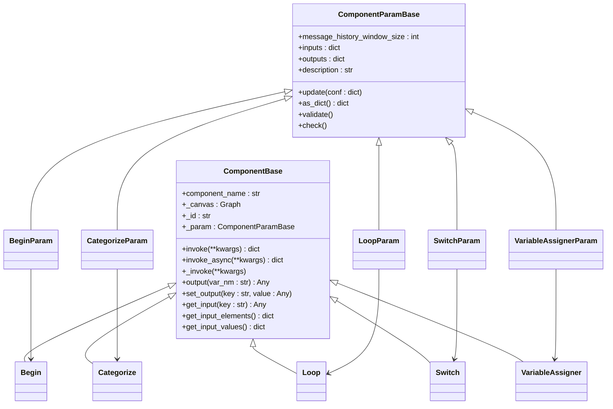

# Agent组件模型

<cite>
**本文档引用的文件**   
- [begin.py](file://agent/component/begin.py)
- [categorize.py](file://agent/component/categorize.py)
- [loop.py](file://agent/component/loop.py)
- [switch.py](file://agent/component/switch.py)
- [variable_assigner.py](file://agent/component/variable_assigner.py)
- [fillup.py](file://agent/component/fillup.py)
- [iteration.py](file://agent/component/iteration.py)
- [iterationitem.py](file://agent/component/iterationitem.py)
- [exit_loop.py](file://agent/component/exit_loop.py)
- [loopitem.py](file://agent/component/loopitem.py)
- [invoke.py](file://agent/component/invoke.py)
- [message.py](file://agent/component/message.py)
- [string_transform.py](file://agent/component/string_transform.py)
- [base.py](file://agent/component/base.py)
- [__init__.py](file://agent/component/__init__.py)
</cite>

## 目录
1. [引言](#引言)
2. [核心组件职责与实现](#核心组件职责与实现)
3. [组件状态管理与执行逻辑](#组件状态管理与执行逻辑)
4. [DSL声明式定义与前端数据绑定](#dsl声明式定义与前端数据绑定)
5. [组件间数据流与错误处理](#组件间数据流与错误处理)
6. [可扩展性设计与自定义组件开发](#可扩展性设计与自定义组件开发)
7. [总结](#总结)

## 引言

Agent工作流系统通过一系列核心组件构建复杂的自动化流程。这些组件通过声明式DSL（领域特定语言）进行定义，并与前端表单进行数据绑定，实现了可视化、可配置的智能工作流。本文档将深入解析`/agent/component/`目录下的核心组件模型，详细阐述其职责、内部实现机制、配置参数以及可扩展性设计。

## 核心组件职责与实现

### Begin组件

`Begin`组件是工作流的起点，负责接收用户输入并初始化工作流上下文。它继承自`UserFillUp`，利用`UserFillUpParam`定义其参数，包括`mode`（模式）和`prologue`（开场白）。其`_invoke`方法处理输入，将文件类型的输入转换为文件对象，其他类型则直接提取值，并通过`set_output`和`set_input_value`设置输出和输入值。

**组件职责**:
- 作为工作流的入口点
- 接收并处理用户初始输入
- 初始化工作流上下文

**Section sources**
- [begin.py](file://agent/component/begin.py#L1-L60)
- [fillup.py](file://agent/component/fillup.py#L1-L78)

### Categorize组件

`Categorize`组件用于对用户查询进行分类。它继承自`LLM`，利用大语言模型（LLM）根据预定义的类别描述和示例对输入进行分类。`CategorizeParam`定义了`category_description`（类别描述）、`query`（查询）等参数，并通过`update_prompt`方法动态生成系统提示词。`_invoke`方法执行分类逻辑，调用LLM模型，并根据返回结果确定最匹配的类别，通过`set_output`输出类别名称和下一个组件ID。

**组件职责**:
- 基于LLM对输入进行智能分类
- 根据分类结果决定工作流的分支走向
- 动态生成分类提示词

**Section sources**
- [categorize.py](file://agent/component/categorize.py#L1-L149)

### Loop组件

`Loop`组件用于实现循环逻辑。`LoopParam`定义了`loop_variables`（循环变量）、`loop_termination_condition`（循环终止条件）和`maximum_loop_count`（最大循环次数）。`_invoke`方法根据循环变量的配置，初始化循环状态，将变量值设置为输出，为循环体内的组件提供初始数据。

**组件职责**:
- 管理循环的初始化和状态
- 为循环体提供初始变量值
- 控制循环的执行流程

**Section sources**
- [loop.py](file://agent/component/loop.py#L1-L80)

### Switch组件

`Switch`组件根据条件判断来决定工作流的下一步。`SwitchParam`定义了`conditions`（条件列表），每个条件包含逻辑操作符、条件项和目标组件ID。`_invoke`方法遍历所有条件，通过`process_operator`方法评估每个条件项的布尔值，根据逻辑操作符（AND/OR）计算整个条件的真值，一旦满足条件即设置`_next`输出并返回。

**组件职责**:
- 执行条件判断和分支选择
- 支持多种比较操作符（包含、等于、大于等）
- 实现复杂的条件逻辑

**Section sources**
- [switch.py](file://agent/component/switch.py#L1-L141)

### VariableAssigner组件

`VariableAssigner`组件用于对变量进行赋值和操作。`VariableAssignerParam`定义了`variables`列表，每个变量包含变量名、操作符和参数。`_invoke`方法遍历变量列表，调用`_operate`方法执行具体操作（如覆盖、追加、数学运算等），并将结果通过`_canvas.set_variable_value`更新到画布上下文中。

**组件职责**:
- 执行变量的读取、写入和修改
- 支持丰富的操作符（+=, -=, 追加, 清除等）
- 管理工作流中的数据状态

**Section sources**
- [variable_assigner.py](file://agent/component/variable_assigner.py#L1-L192)

## 组件状态管理与执行逻辑

### 基础类结构

所有组件都继承自`ComponentBase`和`ComponentParamBase`，这两个基类定义了组件模型的核心结构。

`ComponentParamBase`负责管理组件的参数和配置。它提供了`update`方法用于更新参数，`as_dict`方法将参数对象序列化为字典，`validate`方法用于参数校验。它还定义了`inputs`和`outputs`字典，用于描述组件的输入输出接口。

`ComponentBase`是所有组件的抽象基类，定义了组件的通用行为。`_invoke`是核心的抽象方法，由子类实现具体的业务逻辑。`invoke`和`invoke_async`方法提供了同步和异步的调用入口，它们封装了错误处理、超时控制和执行时间统计。`get_input`、`set_output`等方法提供了对输入输出数据的访问。



**Diagram sources **
- [base.py](file://agent/component/base.py#L37-L611)
- [begin.py](file://agent/component/begin.py#L20-L35)
- [categorize.py](file://agent/component/categorize.py#L28-L48)
- [loop.py](file://agent/component/loop.py#L20-L38)
- [switch.py](file://agent/component/switch.py#L25-L45)
- [variable_assigner.py](file://agent/component/variable_assigner.py#L22-L39)

### 状态管理

组件的状态管理主要通过`_canvas`（画布）对象实现。`_canvas`是一个全局上下文，存储了所有组件的输出和变量值。组件通过`_canvas.get_variable_value`读取其他组件的输出或全局变量，并通过`_canvas.set_variable_value`更新变量。组件自身的输入输出则通过`_param.inputs`和`_param.outputs`字典进行管理。

例如，在`VariableAssigner`中，`_operate`方法会调用`self._canvas.get_variable_value(variable)`获取当前变量值，执行操作后，再通过`self._canvas.set_variable_value(variable, new_variable)`更新值。

### 执行逻辑

组件的执行遵循统一的模式：
1.  **调用入口**：外部通过`invoke`或`invoke_async`方法调用组件。
2.  **取消检查**：在执行任何逻辑前，调用`check_if_canceled`检查任务是否已被取消。
3.  **核心逻辑**：执行`_invoke`方法中的具体业务逻辑。
4.  **错误处理**：`invoke`方法捕获`_invoke`中的异常，根据`exception_method`等参数决定是返回默认值还是设置`_ERROR`输出。
5.  **时间统计**：记录组件执行的耗时，并通过`_elapsed_time`输出。

## DSL声明式定义与前端数据绑定

### DSL结构

组件通过JSON格式的DSL进行声明式定义。一个典型的组件DSL包含`component_name`和`params`两个主要部分。

```json
{
  "component_name": "Switch",
  "params": {
    "conditions": [
      {
        "logical_operator": "or",
        "items": [
          {
            "cpn_id": "categorize:0",
            "operator": "contains",
            "value": "天气"
          }
        ],
        "to": ["weather:0"]
      }
    ],
    "end_cpn_ids": ["default:0"]
  }
}
```

`params`中的字段直接映射到组件参数类（如`SwitchParam`）的属性。系统通过反射机制，将DSL中的配置动态注入到组件实例中。

### 前端数据绑定

前端表单（位于`/web/src/pages/agent/form/`）通过`get_input_form`方法获取组件的输入表单配置。该方法返回一个描述表单字段的字典，包含字段名、类型等信息。

例如，`Loop`组件的`get_input_form`返回：
```python
{
    "items": {
        "type": "json",
        "name": "Items"
    }
}
```
前端根据此配置渲染出一个名为"Items"的JSON输入框。当用户在前端填写表单时，其值会被序列化并作为`params`的一部分，最终传递给后端组件。

## 组件间数据流与错误处理

### 数据流

组件间的数据流通过`_canvas`上下文进行传递。一个组件的输出会成为另一个组件的输入。例如，`Begin`组件的输出`user_input`可以被`Categorize`组件通过`{begin:0@user_input}`这样的引用方式获取。

在`Message`组件中，`get_input_elements_from_text`方法会解析内容中的`{variable_ref}`模式，提取所有依赖的变量引用，并从`_canvas`中获取其值，实现动态内容填充。

### 错误处理模式

系统提供了统一的错误处理机制：
-  **异常捕获**：`invoke`方法会捕获`_invoke`中的所有异常。
-  **错误输出**：默认情况下，异常信息会被设置为`_ERROR`输出。
-  **异常策略**：通过`exception_method`、`exception_default_value`和`exception_goto`参数，可以配置不同的异常处理策略，如返回默认值或跳转到特定组件。
-  **重试机制**：`max_retries`和`delay_after_error`参数支持在执行失败后进行重试。

## 可扩展性设计与自定义组件开发

### 可扩展性设计

系统通过`__init__.py`中的动态导入机制实现了组件的可扩展性。`_import_submodules`函数会自动扫描`agent/component/`目录下的所有Python文件（除了`base.py`和以`__`开头的文件），并将其中定义的类注册到全局组件列表中。这使得添加新组件变得非常简单，只需在目录下创建新的Python文件并定义组件类即可。

```python
def _import_submodules() -> None:
    for filename in os.listdir(_package_path):
        if filename.startswith("__") or not filename.endswith(".py") or filename.startswith("base"):
            continue
        module_name = filename[:-3]
        module = importlib.import_module(f".{module_name}", package=__name__)
        _extract_classes_from_module(module)
```

### 开发自定义组件

要开发一个自定义组件，可以遵循以下步骤：
1.  **创建文件**：在`/agent/component/`目录下创建一个新的Python文件，例如`my_component.py`。
2.  **定义参数类**：继承`ComponentParamBase`，定义组件的配置参数和`check`方法。
3.  **定义组件类**：继承`ComponentBase`，实现`_invoke`方法和`thoughts`方法。
4.  **设置组件名**：在组件类中定义`component_name`属性。

```python
# my_component.py
from agent.component.base import ComponentBase, ComponentParamBase

class MyComponentParam(ComponentParamBase):
    def __init__(self):
        super().__init__()
        self.my_param = "default_value"
    
    def check(self):
        # 参数校验逻辑
        pass

class MyComponent(ComponentBase):
    component_name = "MyComponent"
    
    def _invoke(self, **kwargs):
        # 自定义业务逻辑
        result = f"Processed with {self._param.my_param}"
        self.set_output("result", result)
    
    def thoughts(self) -> str:
        return "Doing something custom..."
```

## 总结

Agent工作流的核心组件模型通过清晰的分层设计（参数类、组件类）和统一的执行框架，实现了高度的模块化和可扩展性。组件通过DSL进行声明式定义，并与前端表单紧密集成，使得复杂的工作流可以被直观地构建和管理。其基于`_canvas`上下文的状态管理和统一的错误处理机制，确保了工作流的稳定性和可靠性。开发者可以轻松地通过继承基类来创建自定义组件，以满足特定的业务需求。