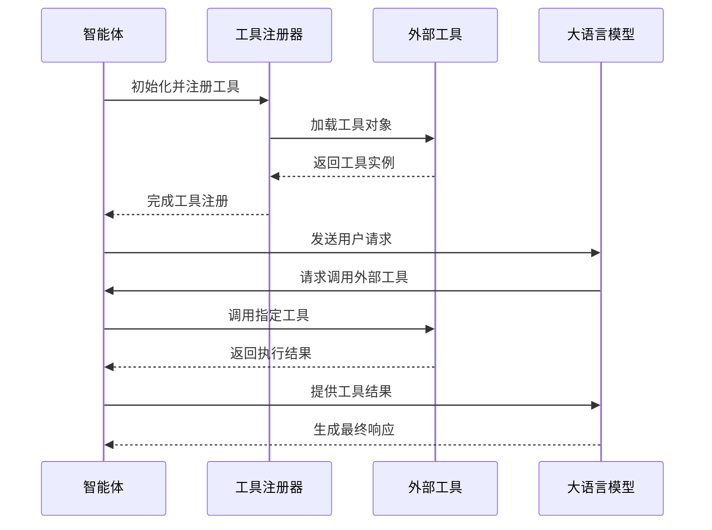
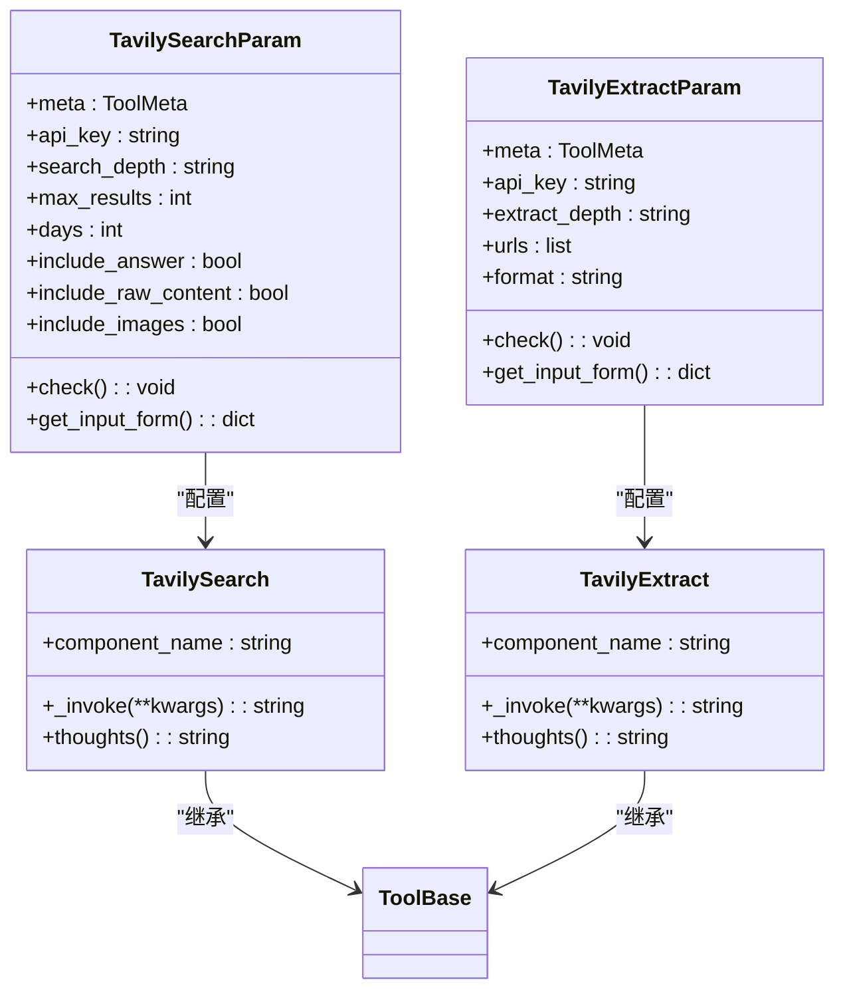
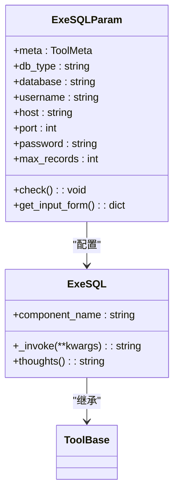
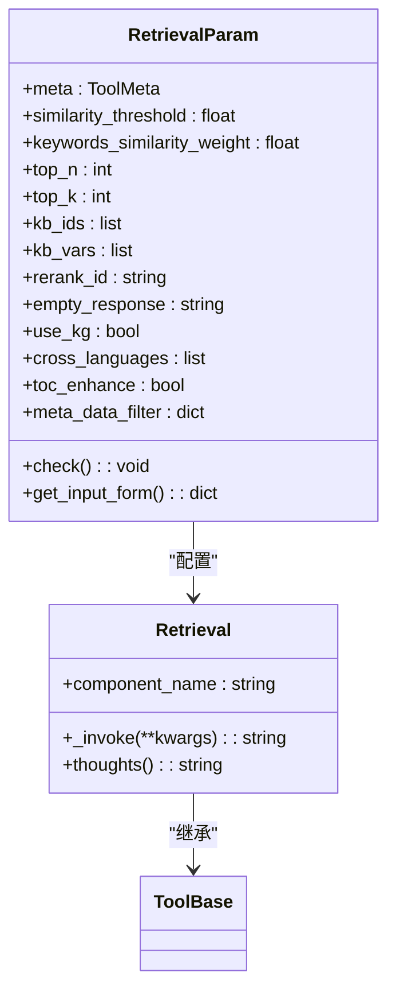
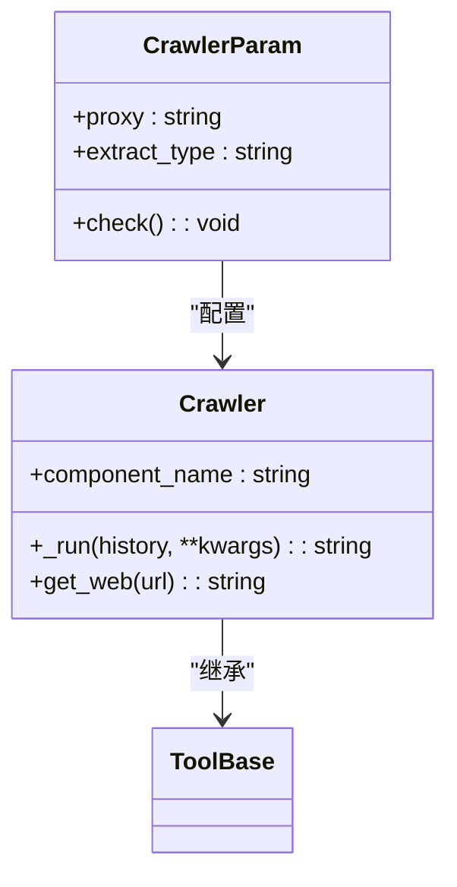
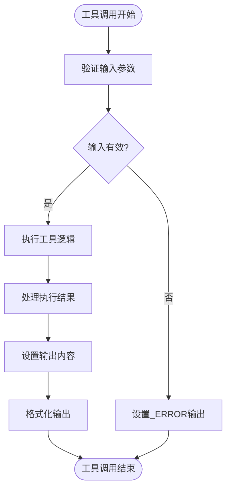
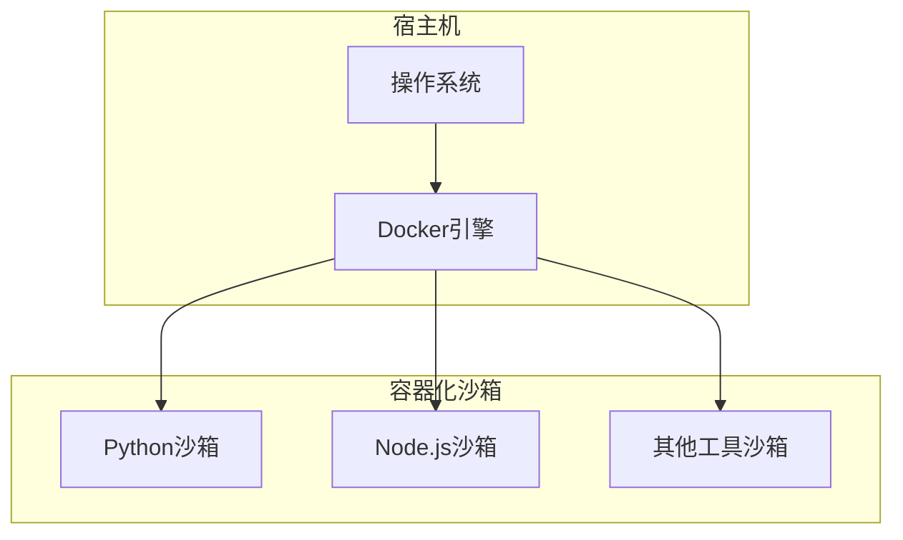
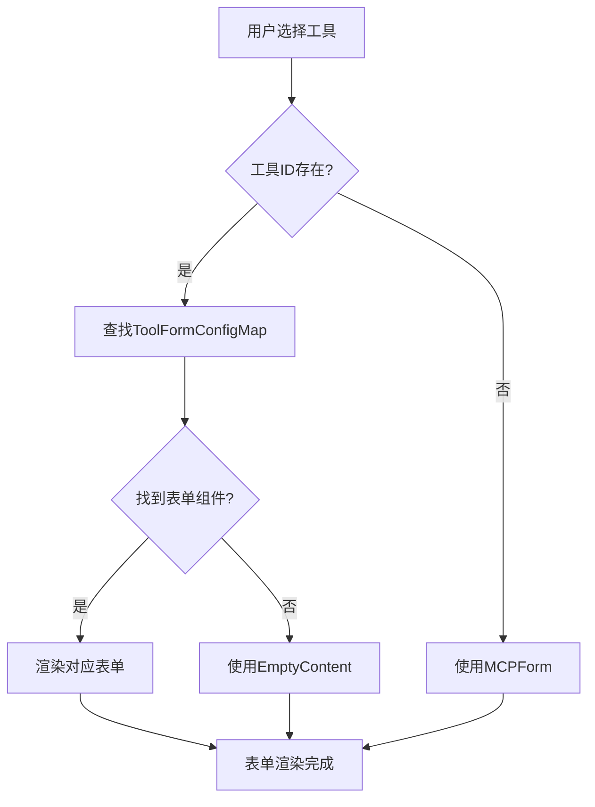
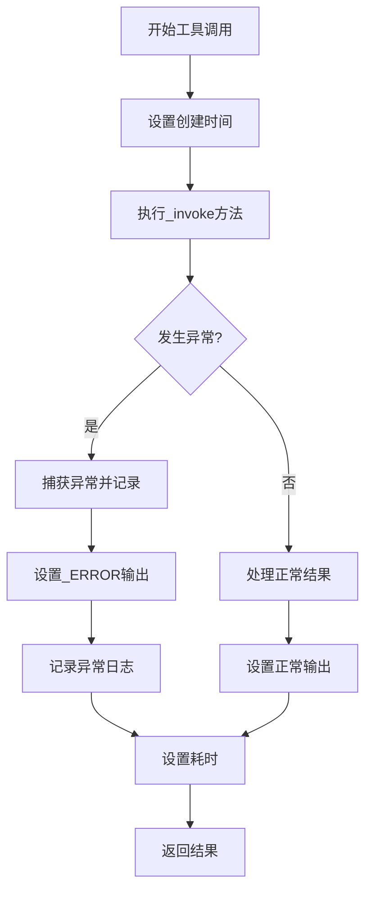

# 外部工具集成

<cite>
**本文档引用的文件**
- [tavily.py](file://agent/tools/tavily.py)
- [exesql.py](file://agent/tools/exesql.py)
- [retrieval.py](file://agent/tools/retrieval.py)
- [crawler.py](file://agent/tools/crawler.py)
- [base.py](file://agent/tools/base.py)
- [agent_with_tools.py](file://agent/component/agent_with_tools.py)
- [tool-form/index.tsx](file://web/src/pages/agent/form/tool-form/index.tsx)
- [use-watch-change.ts](file://web/src/pages/agent/form/tool-form/use-watch-change.ts)
- [sandbox/README.md](file://sandbox/README.md)
- [chat_model.py](file://rag/llm/chat_model.py)
</cite>

## 目录
1. [引言](#引言)
2. [工具注册与调用机制](#工具注册与调用机制)
3. [核心工具分析](#核心工具分析)
4. [输入输出契约与认证配置](#输入输出契约与认证配置)
5. [安全沙箱机制](#安全沙箱机制)
6. [前端工具表单集成](#前端工具表单集成)
7. [异步调用与错误处理](#异步调用与错误处理)
8. [性能优化策略](#性能优化策略)
9. [自定义工具开发](#自定义工具开发)
10. [结论](#结论)

## 引言

RAGFlow系统提供了一套完整的外部工具集成机制，允许智能体通过标准化接口调用各种外部服务。本系统通过`tavily.py`（网络搜索）、`exesql.py`（SQL执行）、`retrieval.py`（知识库检索）和`crawler.py`（网页爬取）等工具，实现了对多种外部数据源和功能的无缝集成。这些工具通过统一的注册、调用和结果处理流程，为智能体提供了强大的扩展能力。

## 工具注册与调用机制

RAGFlow的外部工具集成基于一套标准化的注册和调用机制。所有工具都继承自`ToolBase`基类，并通过`Agent`组件进行统一管理。当一个智能体需要使用外部工具时，系统会自动加载并注册这些工具，使其能够被智能体调用。

工具的注册过程在`agent_with_tools.py`文件中实现。`Agent`类在初始化时会遍历配置的工具列表，并通过`_load_tool_obj`方法动态加载每个工具对象。这个过程确保了工具的元数据（metadata）能够被正确解析和注册。



**Diagram sources**
- [agent_with_tools.py](file://agent/component/agent_with_tools.py#L81-L107)
- [base.py](file://agent/tools/base.py#L122-L149)

**Section sources**
- [agent_with_tools.py](file://agent/component/agent_with_tools.py#L81-L107)
- [base.py](file://agent/tools/base.py#L122-L149)

## 核心工具分析

### Tavily网络搜索工具

`tavily.py`文件实现了Tavily搜索引擎的集成。该工具提供了两种主要功能：`TavilySearch`用于执行关键词搜索，`TavilyExtract`用于从指定URL提取网页内容。工具通过`TavilySearchParam`和`TavilyExtractParam`类定义了详细的参数配置，包括搜索深度、结果数量、包含/排除域名等。



**Diagram sources**
- [tavily.py](file://agent/tools/tavily.py#L25-L252)

**Section sources**
- [tavily.py](file://agent/tools/tavily.py#L25-L252)

### SQL执行工具

`exesql.py`文件实现了SQL执行工具，允许智能体连接到多种数据库系统并执行查询。该工具支持MySQL、PostgreSQL、MSSQL、IBM DB2和Trino等多种数据库类型。通过`ExeSQLParam`类，用户可以配置数据库连接参数，包括主机地址、端口、用户名、密码等。

工具在执行SQL查询时，会自动处理结果的格式化和转换。查询结果以JSON格式存储在输出中，同时提供Markdown格式的可读性内容。对于安全考虑，系统禁止对名为"rag_flow"的数据库进行操作。



**Diagram sources**
- [exesql.py](file://agent/tools/exesql.py#L28-L276)

**Section sources**
- [exesql.py](file://agent/tools/exesql.py#L28-L276)

### 知识库检索工具

`retrieval.py`文件实现了知识库检索功能，允许智能体在预定义的知识库中搜索相关内容。该工具通过`RetrievalParam`类配置检索参数，包括相似度阈值、关键词相似度权重、返回结果数量等。

检索过程首先根据配置的KB ID获取知识库信息，然后使用嵌入模型进行向量检索。系统支持多种高级功能，如跨语言检索、知识图谱增强和目录增强。检索结果会自动添加到智能体的上下文中，供后续处理使用。



**Diagram sources**
- [retrieval.py](file://agent/tools/retrieval.py#L33-L251)

**Section sources**
- [retrieval.py](file://agent/tools/retrieval.py#L33-L251)

### 网页爬取工具

`crawler.py`文件实现了网页爬取功能，基于`crawl4ai`库从指定URL提取网页内容。该工具支持多种内容提取格式，包括HTML、Markdown和纯文本。通过`CrawlerParam`类，用户可以配置代理服务器和内容提取类型。

工具采用异步方式执行爬取操作，确保不会阻塞主线程。爬取结果经过清理和格式化后返回，支持直接集成到智能体的响应中。



**Diagram sources**
- [crawler.py](file://agent/tools/crawler.py#L23-L75)

**Section sources**
- [crawler.py](file://agent/tools/crawler.py#L23-L75)

## 输入输出契约与认证配置

### 工具输入输出契约

所有外部工具都遵循统一的输入输出契约。输入参数通过工具的`meta`属性定义，采用标准的JSON Schema格式。每个参数都包含类型、描述、默认值和是否必需等信息。这种标准化的契约确保了工具的可预测性和易用性。

输出结果通过`set_output`方法设置，支持多种输出类型。常见的输出包括：
- `formalized_content`: 格式化的可读内容
- `json`: 结构化的JSON数据
- `_ERROR`: 错误信息
- `_created_time`: 创建时间戳
- `_elapsed_time`: 执行耗时



**Diagram sources**
- [base.py](file://agent/tools/base.py#L134-L148)

**Section sources**
- [base.py](file://agent/tools/base.py#L134-L148)

### 认证配置机制

外部工具的认证配置通过参数化方式实现。每个需要认证的工具都在其参数类中定义了相应的认证字段，如API密钥、用户名、密码等。这些认证信息通常作为工具参数的一部分进行配置。

系统通过环境变量和配置文件管理敏感信息，避免硬编码在代码中。例如，Tavily工具的API密钥通过`self._param.api_key`获取，而SQL工具的数据库密码通过`self._param.password`获取。这种设计既保证了安全性，又提供了灵活的配置选项。

## 安全沙箱机制

RAGFlow系统采用多层次的安全沙箱机制来保护系统免受恶意代码执行的影响。沙箱环境通过Docker容器实现，为每个工具执行提供隔离的运行环境。

### 容器化隔离

沙箱环境基于Docker容器技术，为Python和Node.js代码执行提供隔离环境。系统通过`docker-compose.yml`文件定义容器配置，包括资源限制、网络隔离和文件系统访问控制。



**Diagram sources**
- [sandbox/README.md](file://sandbox/README.md#L143-L194)

**Section sources**
- [sandbox/README.md](file://sandbox/README.md#L143-L194)

### seccomp安全配置

系统支持可选的seccomp安全配置，通过限制容器内允许的系统调用集合来增强安全性。默认的seccomp配置文件`seccomp-profile-default.json`定义了允许的系统调用列表，阻止潜在的危险操作。

### AST代码检查

对于Python代码执行，系统在运行前进行AST（抽象语法树）静态分析。这种检查可以识别潜在的恶意代码模式，如文件操作、子进程调用等，并在执行前拒绝这些代码。这种双重保护机制确保了代码执行的安全性。

## 前端工具表单集成

### 工具表单架构

前端工具表单通过React组件实现，采用模块化设计。`tool-form/index.tsx`文件是工具表单的入口点，根据当前选中的工具ID动态加载相应的表单组件。系统通过`ToolFormConfigMap`映射工具ID到具体的表单组件。



**Diagram sources**
- [tool-form/index.tsx](file://web/src/pages/agent/form/tool-form/index.tsx#L1-L23)

**Section sources**
- [tool-form/index.tsx](file://web/src/pages/agent/form/tool-form/index.tsx#L1-L23)

### 表单状态管理

工具表单的状态管理通过React Hook Form实现，结合Zustand进行全局状态管理。`use-watch-change.ts`文件中的`useWatchFormChange`钩子监听表单变化，并将更改同步到画布状态中。

当用户修改工具参数时，系统会自动更新对应的节点配置。这种实时同步机制确保了UI状态与底层数据的一致性，提供了流畅的用户体验。

## 异步调用与错误处理

### 异步执行模型

外部工具调用采用异步执行模型，确保不会阻塞主线程。系统通过`asyncio`库实现异步编程，支持协程和事件循环。`ToolBase`类的`invoke_async`方法提供了异步调用的统一接口。

对于同步工具，系统使用`asyncio.to_thread`将其包装为异步操作，确保所有工具调用都遵循相同的异步模式。这种设计提高了系统的响应性和可扩展性。

### 错误处理策略

系统实现了全面的错误处理机制。所有工具调用都被包裹在try-catch块中，捕获的异常会被记录到`_ERROR`输出中。`base.py`文件中的`invoke`方法定义了标准的错误处理流程。



**Diagram sources**
- [base.py](file://agent/tools/base.py#L134-L148)

**Section sources**
- [base.py](file://agent/tools/base.py#L134-L148)

系统还实现了重试机制，当遇到可恢复的错误时，会自动进行重试。重试次数和间隔可以通过配置进行调整，确保在临时故障情况下仍能成功执行。

## 性能优化策略

### 执行超时控制

所有工具调用都设置了执行超时限制，防止长时间运行的操作影响系统性能。超时值通过环境变量`COMPONENT_EXEC_TIMEOUT`配置，不同工具可以根据需要设置不同的超时时间。

### 结果缓存机制

系统实现了结果缓存机制，对于相同的查询请求，可以复用之前的执行结果。这不仅减少了对外部服务的调用次数，还显著提高了响应速度。缓存策略可以根据工具类型和查询参数进行配置。

### 并行执行优化

对于多个工具调用，系统支持并行执行。通过`asyncio.gather`方法，可以同时执行多个异步工具调用，然后等待所有结果完成。这种并行处理方式大大减少了总体执行时间。

### 资源限制

沙箱环境对每个容器的资源使用进行限制，包括CPU、内存和磁盘空间。这种资源限制防止了单个工具消耗过多系统资源，确保了系统的稳定性和公平性。

## 自定义工具开发

### 工具开发框架

开发自定义工具需要遵循标准的开发框架。开发者需要创建两个类：一个参数类继承自`ToolParamBase`，一个工具类继承自`ToolBase`。参数类定义工具的输入契约，工具类实现具体的执行逻辑。

```python
class MyCustomToolParam(ToolParamBase):
    def __init__(self):
        self.meta = {
            "name": "my_custom_tool",
            "description": "This is a custom tool.",
            "parameters": {
                "input": {
                    "type": "string",
                    "description": "The input for the tool.",
                    "required": True
                }
            }
        }
        super().__init__()
        self.api_key = ""

    def check(self):
        # 参数验证逻辑
        pass

class MyCustomTool(ToolBase):
    component_name = "MyCustomTool"

    def _invoke(self, **kwargs):
        # 工具执行逻辑
        pass

    def thoughts(self) -> str:
        return "My custom tool is running..."
```

### 前端表单支持

为自定义工具添加前端表单支持需要在`tool-form`目录下创建相应的表单组件，并将其注册到`ToolFormConfigMap`中。表单组件应该使用React Hook Form处理表单状态，并通过`useWatchFormChange`钩子实现与画布状态的同步。

### 工具注册

自定义工具需要在系统配置中注册，使其能够被智能体发现和使用。注册过程通常涉及将工具类添加到工具列表中，并确保其参数类和工具类都在正确的模块路径下。

## 结论

RAGFlow的外部工具集成机制提供了一套完整、安全且易于扩展的解决方案。通过标准化的注册、调用和结果处理流程，系统能够无缝集成各种外部服务。安全沙箱机制确保了工具执行的安全性，而灵活的前端表单集成提供了良好的用户体验。异步调用模型和全面的错误处理策略保证了系统的稳定性和可靠性。这套机制不仅满足了当前的需求，还为未来的扩展提供了坚实的基础。