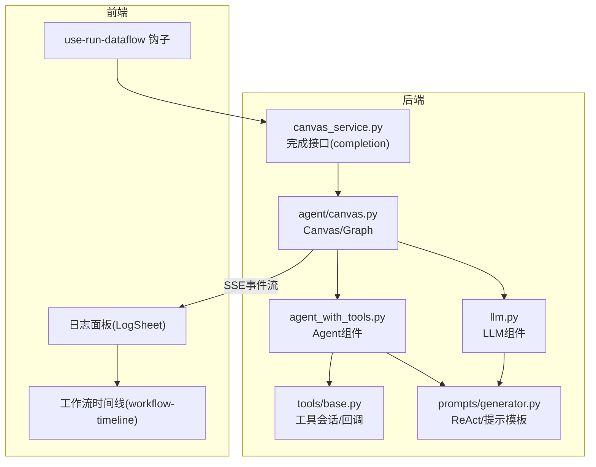
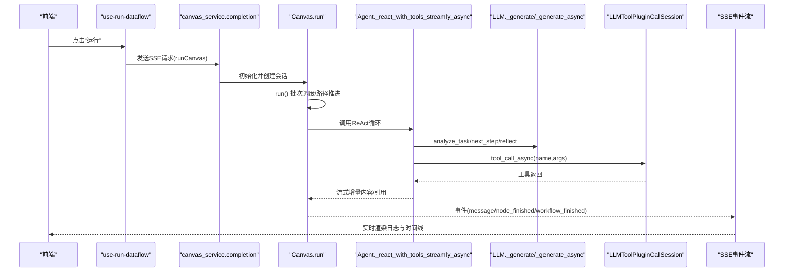
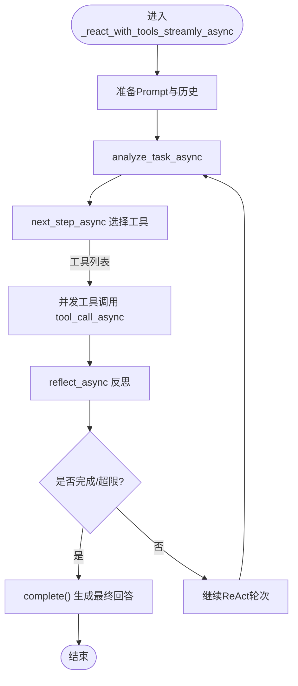
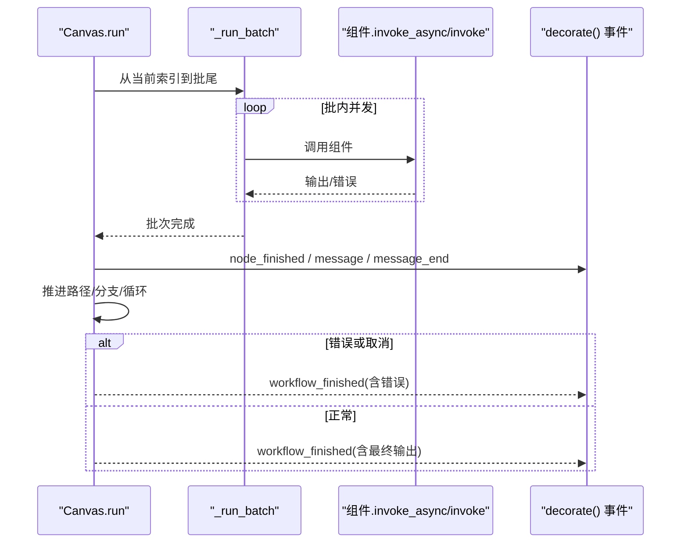
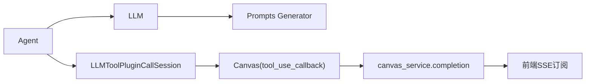
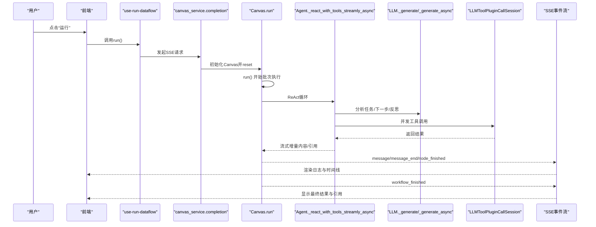

# 工作流执行引擎

<cite>
**本文引用的文件列表**
- [agent/component/agent_with_tools.py](file://agent/component/agent_with_tools.py)
- [agent/component/llm.py](file://agent/component/llm.py)
- [agent/component/base.py](file://agent/component/base.py)
- [agent/tools/base.py](file://agent/tools/base.py)
- [agent/canvas.py](file://agent/canvas.py)
- [api/db/services/canvas_service.py](file://api/db/services/canvas_service.py)
- [rag/prompts/generator.py](file://rag/prompts/generator.py)
- [web/src/pages/agent/hooks/use-run-dataflow.ts](file://web/src/pages/agent/hooks/use-run-dataflow.ts)
- [web/src/pages/agent/log-sheet/index.tsx](file://web/src/pages/agent/log-sheet/index.tsx)
- [web/src/pages/agent/log-sheet/workflow-timeline.tsx](file://web/src/pages/agent/log-sheet/workflow-timeline.tsx)
- [web/src/pages/agent/hooks/use-fetch-pipeline-log.ts](file://web/src/pages/agent/hooks/use-fetch-pipeline-log.ts)
</cite>

## 目录
1. [引言](#引言)
2. [项目结构](#项目结构)
3. [核心组件](#核心组件)
4. [架构总览](#架构总览)
5. [详细组件分析](#详细组件分析)
6. [依赖关系分析](#依赖关系分析)
7. [性能与并发特性](#性能与并发特性)
8. [故障与容错](#故障与容错)
9. [端到端执行链路示例](#端到端执行链路示例)
10. [结论](#结论)

## 引言
本文件面向“工作流执行引擎”的深入解析，围绕以下目标展开：
- 协调Agent与工具的执行顺序：Agent如何在ReAct范式下组织工具调用与LLM推理。
- LLM集成与决策：LLM如何参与任务分析、下一步行动规划、反思与最终回答生成。
- 后端Canvas生命周期管理：启动、暂停、终止、状态事件流与参考信息维护。
- 前端实时同步与可视化：use-run-dataflow钩子、日志面板与时间线组件如何联动。
- 上下文管理、变量作用域与异步调度：变量解析、作用域传播与并发控制。
- 容错与回滚：超时、重试、异常分支与默认值策略。

## 项目结构
后端由“组件层”“画布层”“服务层”构成；前端提供运行钩子与日志面板组件，二者通过SSE事件流实现状态同步。

图表来源
- [agent/component/agent_with_tools.py](file://agent/component/agent_with_tools.py#L1-L420)
- [agent/component/llm.py](file://agent/component/llm.py#L1-L418)
- [agent/component/base.py](file://agent/component/base.py#L393-L611)
- [agent/tools/base.py](file://agent/tools/base.py#L1-L211)
- [agent/canvas.py](file://agent/canvas.py#L1-L800)
- [api/db/services/canvas_service.py](file://api/db/services/canvas_service.py#L180-L353)
- [rag/prompts/generator.py](file://rag/prompts/generator.py#L346-L414)
- [web/src/pages/agent/hooks/use-run-dataflow.ts](file://web/src/pages/agent/hooks/use-run-dataflow.ts#L1-L56)
- [web/src/pages/agent/log-sheet/index.tsx](file://web/src/pages/agent/log-sheet/index.tsx#L1-L51)
- [web/src/pages/agent/log-sheet/workflow-timeline.tsx](file://web/src/pages/agent/log-sheet/workflow-timeline.tsx#L206-L237)

章节来源
- [agent/component/agent_with_tools.py](file://agent/component/agent_with_tools.py#L1-L420)
- [agent/component/llm.py](file://agent/component/llm.py#L1-L418)
- [agent/canvas.py](file://agent/canvas.py#L1-L800)
- [api/db/services/canvas_service.py](file://api/db/services/canvas_service.py#L180-L353)
- [rag/prompts/generator.py](file://rag/prompts/generator.py#L346-L414)
- [web/src/pages/agent/hooks/use-run-dataflow.ts](file://web/src/pages/agent/hooks/use-run-dataflow.ts#L1-L56)
- [web/src/pages/agent/log-sheet/index.tsx](file://web/src/pages/agent/log-sheet/index.tsx#L1-L51)
- [web/src/pages/agent/log-sheet/workflow-timeline.tsx](file://web/src/pages/agent/log-sheet/workflow-timeline.tsx#L206-L237)

## 核心组件
- 组件基类与参数系统：统一输入/输出、异常处理、超时与重试配置。
- Agent组件：ReAct执行循环、工具选择与调用、结构化输出与引用生成。
- LLM组件：系统提示拼装、消息长度裁剪、流式输出、结构化约束。
- 工具会话：统一工具调用入口，支持同步/异步与MCP工具。
- 画布Canvas：全局变量作用域、历史对话、引用聚合、并发执行批次、取消与事件流。
- 服务层：完成接口封装SSE事件流，持久化会话与引用。

章节来源
- [agent/component/base.py](file://agent/component/base.py#L393-L611)
- [agent/component/agent_with_tools.py](file://agent/component/agent_with_tools.py#L81-L243)
- [agent/component/llm.py](file://agent/component/llm.py#L84-L217)
- [agent/tools/base.py](file://agent/tools/base.py#L46-L71)
- [agent/canvas.py](file://agent/canvas.py#L279-L641)
- [api/db/services/canvas_service.py](file://api/db/services/canvas_service.py#L180-L353)

## 架构总览
后端通过Canvas驱动组件执行，组件间通过上游下游边连接；Agent在ReAct循环中选择工具并调用，LLM负责任务分析、下一步规划与最终回答；工具调用通过统一会话分发，并回调记录到Redis；Canvas将节点事件、消息流、引用等通过SSE推送到前端。

图表来源
- [web/src/pages/agent/hooks/use-run-dataflow.ts](file://web/src/pages/agent/hooks/use-run-dataflow.ts#L1-L56)
- [api/db/services/canvas_service.py](file://api/db/services/canvas_service.py#L180-L238)
- [agent/canvas.py](file://agent/canvas.py#L360-L641)
- [agent/component/agent_with_tools.py](file://agent/component/agent_with_tools.py#L267-L395)
- [agent/tools/base.py](file://agent/tools/base.py#L46-L71)
- [rag/prompts/generator.py](file://rag/prompts/generator.py#L346-L414)

## 详细组件分析

### Agent组件：ReAct执行与工具编排
- 参数与元数据：支持用户提示、推理背景、上下文、工具与MCP工具注册，输出结构化与工具使用记录。
- Prompt准备：从画布历史与变量中提取系统提示与用户消息，必要时注入引用提示。
- ReAct循环：
  - 任务分析：基于工具清单与当前对话摘要生成任务理解。
  - 下一步规划：选择工具与参数，支持“完成任务”信号。
  - 工具调用：异步并发调用多个工具，收集观察结果。
  - 反思：汇总工具结果，指导下一步。
  - 结束条件：达到最大轮次或显式完成。
- 结构化输出：当期望结构化输出时，尝试修复JSON并强制符合模式。
- 流式输出：支持边生成边输出，同时可追加引用生成。

图表来源
- [agent/component/agent_with_tools.py](file://agent/component/agent_with_tools.py#L267-L395)
- [rag/prompts/generator.py](file://rag/prompts/generator.py#L346-L414)
- [agent/tools/base.py](file://agent/tools/base.py#L46-L71)

章节来源
- [agent/component/agent_with_tools.py](file://agent/component/agent_with_tools.py#L81-L243)
- [agent/component/agent_with_tools.py](file://agent/component/agent_with_tools.py#L245-L395)
- [rag/prompts/generator.py](file://rag/prompts/generator.py#L346-L414)
- [agent/tools/base.py](file://agent/tools/base.py#L46-L71)

### LLM组件：提示拼装与流式生成
- 提示变量：从系统提示与用户消息中抽取变量，支持图片多模态切换。
- 消息长度裁剪：按最大token限制裁剪系统与用户消息，保证上下文不越界。
- 流式输出：Delta文本过滤与“思考”标记包裹，支持错误兜底与默认值。
- 结构化输出：在需要时注入结构化输出提示，失败则重试并修复JSON。

章节来源
- [agent/component/llm.py](file://agent/component/llm.py#L84-L217)
- [agent/component/llm.py](file://agent/component/llm.py#L280-L409)
- [rag/prompts/generator.py](file://rag/prompts/generator.py#L61-L95)

### 工具会话与回调：统一调用与追踪
- 统一调用：根据工具对象是否支持异步，选择直接await或线程池执行。
- 回调追踪：将工具名、参数、结果与耗时写入Redis，供前端日志面板展示。

章节来源
- [agent/tools/base.py](file://agent/tools/base.py#L46-L71)
- [agent/canvas.py](file://agent/canvas.py#L751-L774)

### 画布Canvas：生命周期与并发调度
- 全局变量与作用域：sys.env变量解析与跨组件读取，支持表达式求值。
- 历史与引用：维护对话历史、检索引用与记忆摘要。
- 并发执行：按拓扑路径分批执行，同批内并发等待；支持用户填充节点与分支跳转。
- 事件流：节点开始/完成、消息流、工作流开始/结束、引用信息等通过SSE推送。
- 取消与超时：基于Redis标志位检测取消；组件级超时装饰器保护。

图表来源
- [agent/canvas.py](file://agent/canvas.py#L408-L641)
- [agent/component/base.py](file://agent/component/base.py#L434-L475)

章节来源
- [agent/canvas.py](file://agent/canvas.py#L1-L170)
- [agent/canvas.py](file://agent/canvas.py#L279-L641)
- [agent/component/base.py](file://agent/component/base.py#L434-L475)

### 服务层：SSE完成接口与OpenAI兼容流
- completion：构建Canvas、初始化会话、写入消息、流式输出事件、保存引用与错误。
- completion_openai：将内部事件转换为OpenAI风格的数据帧，支持引用字段透传。

章节来源
- [api/db/services/canvas_service.py](file://api/db/services/canvas_service.py#L180-L353)

### 前端：运行钩子与日志面板
- use-run-dataflow：保存图谱、发起SSE请求、接收消息ID并打开日志面板。
- 日志面板(LogSheet)：容器组件，承载工作流时间线。
- workflow-timeline：按事件列表渲染节点、输入/输出、耗时与错误状态。
- use-fetch-pipeline-log：拉取消息轨迹，自动停止拉取并在完成后关闭。

章节来源
- [web/src/pages/agent/hooks/use-run-dataflow.ts](file://web/src/pages/agent/hooks/use-run-dataflow.ts#L1-L56)
- [web/src/pages/agent/log-sheet/index.tsx](file://web/src/pages/agent/log-sheet/index.tsx#L1-L51)
- [web/src/pages/agent/log-sheet/workflow-timeline.tsx](file://web/src/pages/agent/log-sheet/workflow-timeline.tsx#L206-L237)
- [web/src/pages/agent/hooks/use-fetch-pipeline-log.ts](file://web/src/pages/agent/hooks/use-fetch-pipeline-log.ts#L1-L57)

## 依赖关系分析
- 组件耦合：Agent依赖LLM组件与工具会话；Canvas为所有组件提供上下文与并发调度；服务层依赖Canvas与SSE。
- 外部依赖：LLM服务封装、提示模板库、Redis用于取消与日志追踪。
- 前后端契约：SSE事件包含message/message_end/workflow_finished等，前端据此渲染UI。

图表来源
- [agent/component/agent_with_tools.py](file://agent/component/agent_with_tools.py#L81-L243)
- [agent/component/llm.py](file://agent/component/llm.py#L84-L217)
- [agent/tools/base.py](file://agent/tools/base.py#L46-L71)
- [agent/canvas.py](file://agent/canvas.py#L751-L774)
- [api/db/services/canvas_service.py](file://api/db/services/canvas_service.py#L180-L238)

章节来源
- [agent/component/agent_with_tools.py](file://agent/component/agent_with_tools.py#L1-L120)
- [agent/component/llm.py](file://agent/component/llm.py#L1-L83)
- [agent/tools/base.py](file://agent/tools/base.py#L1-L45)
- [agent/canvas.py](file://agent/canvas.py#L1-L120)
- [api/db/services/canvas_service.py](file://api/db/services/canvas_service.py#L180-L238)

## 性能与并发特性
- 组件并发：Canvas批内并发执行，线程池隔离阻塞调用；组件自身也有限额与超时保护。
- 流式输出：LLM与Agent均支持增量输出，减少首字节延迟。
- Token裁剪：消息长度动态裁剪，避免超出模型上下文。
- 缓存与复用：提示模板与LLM缓存减少重复计算。

章节来源
- [agent/canvas.py](file://agent/canvas.py#L408-L452)
- [agent/component/base.py](file://agent/component/base.py#L393-L410)
- [rag/prompts/generator.py](file://rag/prompts/generator.py#L61-L95)

## 故障与容错
- 取消机制：Canvas通过Redis标志位检测任务取消，抛出异常并终止后续执行。
- 超时保护：组件级超时装饰器与环境变量控制执行时限。
- 重试策略：结构化输出与JSON修复失败时自动重试，上限由参数控制。
- 异常分支：组件异常处理器支持默认值与跳转分支，避免中断整个流程。
- 错误回显：SSE事件携带错误信息，前端日志面板高亮显示。

章节来源
- [agent/canvas.py](file://agent/canvas.py#L267-L277)
- [agent/component/base.py](file://agent/component/base.py#L434-L475)
- [agent/component/llm.py](file://agent/component/llm.py#L329-L409)
- [agent/component/agent_with_tools.py](file://agent/component/agent_with_tools.py#L167-L243)

## 端到端执行链路示例
从用户点击“运行”到最终结果输出的完整链路如下：

图表来源
- [web/src/pages/agent/hooks/use-run-dataflow.ts](file://web/src/pages/agent/hooks/use-run-dataflow.ts#L1-L56)
- [api/db/services/canvas_service.py](file://api/db/services/canvas_service.py#L180-L238)
- [agent/canvas.py](file://agent/canvas.py#L360-L641)
- [agent/component/agent_with_tools.py](file://agent/component/agent_with_tools.py#L267-L395)
- [agent/tools/base.py](file://agent/tools/base.py#L46-L71)
- [rag/prompts/generator.py](file://rag/prompts/generator.py#L346-L414)

章节来源
- [web/src/pages/agent/hooks/use-run-dataflow.ts](file://web/src/pages/agent/hooks/use-run-dataflow.ts#L1-L56)
- [api/db/services/canvas_service.py](file://api/db/services/canvas_service.py#L180-L238)
- [agent/canvas.py](file://agent/canvas.py#L360-L641)
- [agent/component/agent_with_tools.py](file://agent/component/agent_with_tools.py#L267-L395)
- [agent/tools/base.py](file://agent/tools/base.py#L46-L71)
- [rag/prompts/generator.py](file://rag/prompts/generator.py#L346-L414)

## 结论
该工作流执行引擎以Canvas为核心，通过组件化的Agent与LLM实现ReAct决策与工具编排，配合SSE事件流实现前后端实时同步与可视化调试。其具备完善的上下文管理、变量作用域、并发调度、超时与重试、异常分支与默认值回退机制，能够稳定支撑复杂数据管线的运行与可观测性需求。