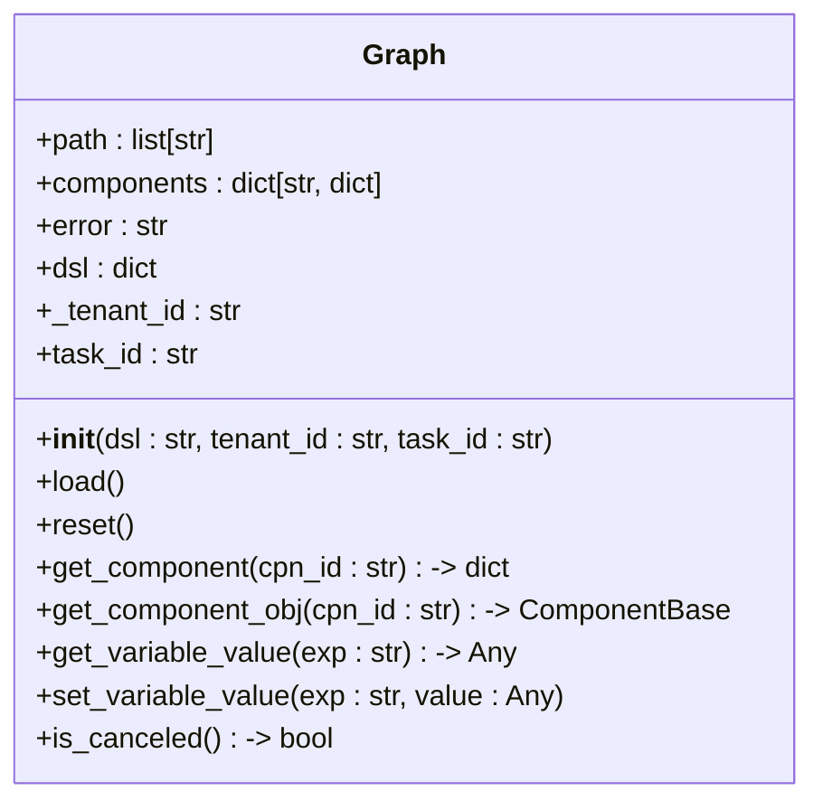
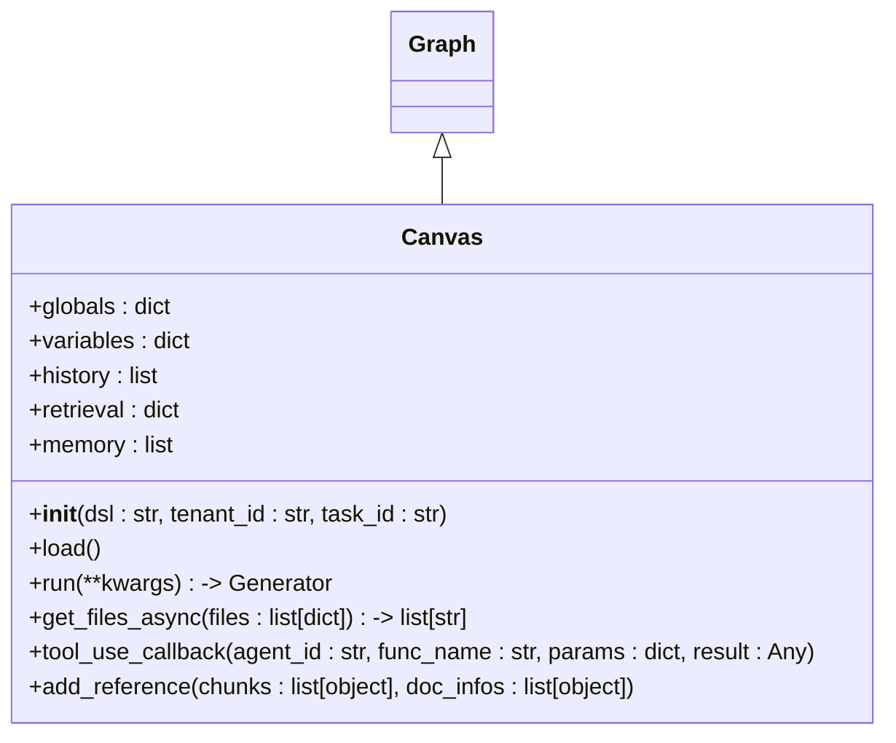
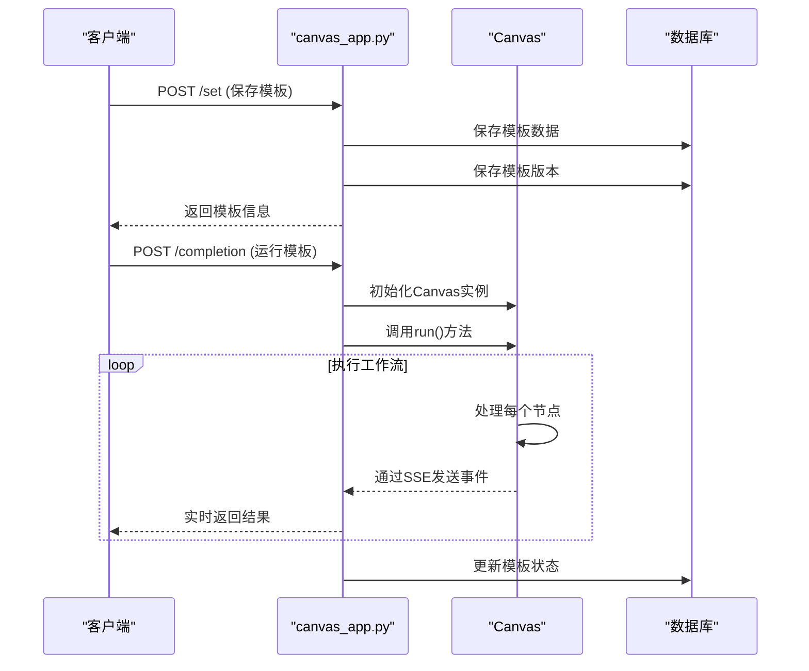
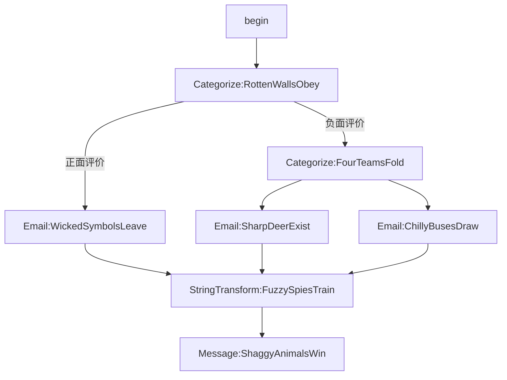

# 工作流模板与DSL

<cite>
**本文档中引用的文件**   
- [deep_research.json](file://agent/templates/deep_research.json)
- [customer_review_analysis.json](file://agent/templates/customer_review_analysis.json)
- [sql_assistant.json](file://agent/templates/sql_assistant.json)
- [canvas.py](file://agent/canvas.py)
- [canvas_app.py](file://api/apps/canvas_app.py)
</cite>

## 目录
1. [介绍](#介绍)
2. [工作流模板系统](#工作流模板系统)
3. [领域特定语言（DSL）](#领域特定语言dsl)
4. [DSL解析与验证](#dsl解析与验证)
5. [API接口](#api接口)
6. [节点连接与数据流](#节点连接与数据流)
7. [条件分支与循环逻辑](#条件分支与循环逻辑)
8. [构建复杂工作流模板](#构建复杂工作流模板)
9. [模板版本管理与复用](#模板版本管理与复用)
10. [附录](#附录)

## 介绍
本文档全面介绍RAGFlow系统中Agent工作流的模板系统和领域特定语言（DSL）。通过分析`/agent/templates/`目录下的`deep_research.json`、`customer_review_analysis.json`、`sql_assistant.json`等示例模板，深入剖析DSL的JSON结构、语法规范和语义规则。文档详细解释了`canvas.py`模块如何解析和验证DSL，以及`canvas_app.py`如何提供创建、加载和保存工作流模板的API接口。此外，文档还详细说明了模板中节点的连接关系、条件分支、循环逻辑和数据传递机制，并提供从零构建复杂工作流模板的分步指南，最后讨论模板的版本管理和复用策略。

## 工作流模板系统
工作流模板系统是RAGFlow Agent的核心组成部分，它允许用户通过可视化界面或直接编辑JSON DSL来定义复杂的自动化流程。每个模板都代表一个可复用的工作流，可以被配置、执行和管理。

工作流模板的主要特点包括：
- **可视化设计**：用户可以通过拖拽节点和连接线来构建工作流。
- **参数化配置**：模板支持输入参数，使其具有高度的灵活性和可配置性。
- **多类型支持**：模板可以用于不同的场景，如数据分析、客户支持、市场研究等。
- **版本控制**：系统支持模板的版本管理，便于追踪变更和回滚。

模板文件通常包含以下关键部分：
- `id`：模板的唯一标识符。
- `title`：模板的标题，支持多语言。
- `description`：模板的描述，支持多语言。
- `canvas_type`：模板的类型分类。
- `dsl`：核心的领域特定语言（DSL）定义，描述了工作流的结构和逻辑。

**Section sources**
- [deep_research.json](file://agent/templates/deep_research.json#L1-L854)
- [customer_review_analysis.json](file://agent/templates/customer_review_analysis.json#L1-L802)
- [sql_assistant.json](file://agent/templates/sql_assistant.json#L1-L718)

## 领域特定语言（DSL）
领域特定语言（DSL）是工作流模板的核心，它以JSON格式定义了工作流的结构、节点、连接和参数。DSL的设计旨在提供一种简洁而强大的方式来描述复杂的业务逻辑。

### DSL结构
DSL的JSON结构主要由以下几个部分组成：

```json
{
  "components": {
    // 节点组件定义
  },
  "globals": {
    // 全局变量
  },
  "graph": {
    // 可视化图结构（节点和边）
  },
  "history": [],
  "messages": [],
  "path": [],
  "retrieval": []
}
```

#### components
`components`对象定义了工作流中的所有节点。每个节点都有一个唯一的ID，并包含以下信息：
- `obj`：节点的具体配置，包括组件名称和参数。
- `downstream`：该节点的下游节点ID列表。
- `upstream`：该节点的上游节点ID列表。

例如，在`deep_research.json`中，一个Agent节点的定义如下：
```json
"Agent:NewPumasLick": {
  "downstream": [
    "Message:OrangeYearsShine"
  ],
  "obj": {
    "component_name": "Agent",
    "params": {
      "llm_id": "qwen-max@Tongyi-Qianwen",
      "sys_prompt": "You are a Strategy Research Director...",
      "tools": [/* 工具列表 */]
    }
  },
  "upstream": [
    "begin"
  ]
}
```

#### globals
`globals`对象定义了工作流中的全局变量，如`sys.query`（用户查询）、`sys.user_id`（用户ID）等。这些变量可以在整个工作流中被引用。

#### graph
`graph`对象包含了用于可视化编辑器的元数据，如节点的位置、边的连接信息等。这部分信息主要用于前端界面的渲染，不影响工作流的执行逻辑。

### 语义规则
DSL的语义规则定义了节点如何交互、数据如何流动以及控制流如何转移。关键的语义规则包括：
- **数据引用**：使用`{component_id@variable_name}`语法来引用其他节点的输出。
- **条件分支**：通过`Categorize`等组件实现基于条件的分支逻辑。
- **循环**：通过`Iteration`和`Loop`组件实现循环逻辑。
- **异常处理**：通过`exception_goto`和`exception_default_value`等参数定义异常处理策略。

**Section sources**
- [deep_research.json](file://agent/templates/deep_research.json#L1-L854)
- [customer_review_analysis.json](file://agent/templates/customer_review_analysis.json#L1-L802)
- [sql_assistant.json](file://agent/templates/sql_assistant.json#L1-L718)

## DSL解析与验证
`canvas.py`模块负责DSL的解析和验证，确保工作流定义的正确性和完整性。

### Graph类
`Graph`类是DSL解析的核心，它负责加载和验证DSL。其主要功能包括：
- **加载DSL**：通过`load()`方法将JSON DSL加载到内存中，并验证每个组件的参数。
- **组件验证**：使用`component_class`动态加载组件类，并调用其`check()`方法进行参数验证。
- **状态管理**：维护工作流的执行路径（`path`）、组件状态（`components`）和全局变量（`globals`）。



**Diagram sources **
- [canvas.py](file://agent/canvas.py#L40-L277)

### Canvas类
`Canvas`类继承自`Graph`，并添加了工作流执行所需的功能，如历史记录、检索结果和内存管理。



**Diagram sources **
- [canvas.py](file://agent/canvas.py#L279-L799)

**Section sources**
- [canvas.py](file://agent/canvas.py#L1-L803)

## API接口
`canvas_app.py`模块提供了RESTful API接口，用于管理工作流模板的生命周期。

### 主要API端点
- **GET /templates**：获取所有模板列表。
- **POST /set**：创建或更新模板。
- **GET /get/<canvas_id>**：获取指定模板。
- **POST /completion**：运行指定模板。
- **PUT /cancel/<task_id>**：取消正在运行的任务。
- **POST /reset**：重置模板状态。
- **GET /listversion/<canvas_id>**：获取模板的历史版本列表。
- **GET /version/<version_id>**：获取指定版本的模板。

### API实现
API接口通过`manager`路由装饰器定义，并使用`login_required`装饰器确保访问安全。核心功能包括：
- **模板保存**：`save()`函数处理模板的创建和更新，支持版本管理。
- **模板执行**：`run()`函数启动工作流执行，并通过SSE（Server-Sent Events）实时返回结果。
- **版本管理**：`getlistversion()`和`getversion()`函数提供模板版本的查询功能。



**Diagram sources **
- [canvas_app.py](file://api/apps/canvas_app.py#L1-L553)

**Section sources**
- [canvas_app.py](file://api/apps/canvas_app.py#L1-L553)

## 节点连接与数据流
工作流中的节点通过`upstream`和`downstream`属性连接，形成一个有向无环图（DAG）。数据流通过变量引用机制在节点间传递。

### 数据传递机制
数据传递主要通过以下方式实现：
- **全局变量**：使用`sys.*`前缀的变量（如`sys.query`）在所有节点间共享。
- **节点输出引用**：使用`{component_id@variable_name}`语法引用其他节点的输出。
- **参数传递**：在组件参数中直接引用变量，如`"content": ["{Agent:NewPumasLick@content}"]`。

### 示例分析
以`customer_review_analysis.json`为例，其数据流如下：
1. `begin`节点接收用户输入的评论。
2. `Categorize:RottenWallsObey`节点根据评论内容分类为“正面评价”或“负面评价”。
3. 如果是正面评价，流程分支到`Email:WickedSymbolsLeave`；如果是负面评价，则分支到`Categorize:FourTeamsFold`进行进一步分类。
4. 最终，所有邮件发送结果通过`StringTransform:FuzzySpiesTrain`组件合并，并通过`Message:ShaggyAnimalsWin`节点返回给用户。



**Diagram sources **
- [customer_review_analysis.json](file://agent/templates/customer_review_analysis.json#L1-L802)

**Section sources**
- [customer_review_analysis.json](file://agent/templates/customer_review_analysis.json#L1-L802)

## 条件分支与循环逻辑
工作流支持复杂的控制流，包括条件分支和循环。

### 条件分支
条件分支主要通过`Categorize`组件实现。该组件根据输入内容将其分类到不同的下游节点。

在`customer_review_analysis.json`中，`Categorize`组件的配置如下：
```json
"Categorize:RottenWallsObey": {
  "obj": {
    "component_name": "Categorize",
    "params": {
      "category_description": {
        "Negative review ": {
          "description": "Negative review to the product.",
          "examples": ["1. I have issues. \n2. Too many problems.\n3. I don't like it."],
          "to": ["Categorize:FourTeamsFold"]
        },
        "Positive review": {
          "description": "Positive review to the product.",
          "examples": ["1. Good, I like it.\n2. It is very helpful.\n3. It makes my work easier."],
          "to": ["Email:WickedSymbolsLeave"]
        }
      }
    }
  }
}
```
`category_description`定义了分类规则，`to`字段指定了每个分类对应的下游节点。

### 循环逻辑
循环逻辑通过`Iteration`和`Loop`组件实现。虽然在提供的示例模板中没有直接体现，但`canvas.py`中的`run()`方法支持通过`path`数组的动态修改来实现循环。

**Section sources**
- [customer_review_analysis.json](file://agent/templates/customer_review_analysis.json#L1-L802)
- [canvas.py](file://agent/canvas.py#L1-L803)

## 构建复杂工作流模板
本节提供从零开始构建一个复杂工作流模板的分步指南。

### 步骤1：定义模板结构
首先，创建一个基本的JSON结构：
```json
{
  "id": 1,
  "title": {"en": "My Workflow", "zh": "我的工作流"},
  "description": {"en": "A sample workflow", "zh": "一个示例工作流"},
  "canvas_type": "Custom",
  "dsl": {
    "components": {},
    "globals": {
      "sys.conversation_turns": 0,
      "sys.files": [],
      "sys.query": "",
      "sys.user_id": ""
    },
    "graph": {
      "edges": [],
      "nodes": []
    },
    "history": [],
    "messages": [],
    "path": [],
    "retrieval": []
  }
}
```

### 步骤2：添加起始节点
添加一个`begin`节点作为工作流的起点：
```json
"components": {
  "begin": {
    "downstream": ["Agent:MyAgent"],
    "obj": {
      "component_name": "Begin",
      "params": {
        "enablePrologue": true,
        "inputs": {},
        "mode": "conversational",
        "prologue": "Hello! How can I help you?"
      }
    },
    "upstream": []
  }
}
```

### 步骤3：添加处理节点
添加一个`Agent`节点来处理用户查询：
```json
"Agent:MyAgent": {
  "downstream": ["Message:MyMessage"],
  "obj": {
    "component_name": "Agent",
    "params": {
      "llm_id": "qwen-max@Tongyi-Qianwen",
      "sys_prompt": "You are a helpful assistant.",
      "prompts": [
        {
          "content": "User's query: {sys.query}",
          "role": "user"
        }
      ],
      "tools": []
    }
  },
  "upstream": ["begin"]
}
```

### 步骤4：添加输出节点
添加一个`Message`节点来返回结果：
```json
"Message:MyMessage": {
  "downstream": [],
  "obj": {
    "component_name": "Message",
    "params": {
      "content": ["{Agent:MyAgent@content}"]
    }
  },
  "upstream": ["Agent:MyAgent"]
}
```

### 步骤5：配置可视化信息
在`graph`的`nodes`和`edges`中添加可视化信息，以便在前端界面中正确显示。

### 步骤6：测试与部署
通过API接口保存和测试模板，确保其按预期工作。

**Section sources**
- [deep_research.json](file://agent/templates/deep_research.json#L1-L854)
- [customer_review_analysis.json](file://agent/templates/customer_review_analysis.json#L1-L802)
- [sql_assistant.json](file://agent/templates/sql_assistant.json#L1-L718)

## 模板版本管理与复用
系统提供了完善的模板版本管理和复用机制。

### 版本管理
每次保存模板时，系统会自动创建一个新版本。版本信息存储在`user_canvas_version`表中，包含：
- `user_canvas_id`：关联的模板ID。
- `dsl`：该版本的DSL内容。
- `title`：版本标题，通常包含时间戳。
- `update_time`：更新时间。

用户可以通过`/getlistversion/<canvas_id>`和`/getversion/<version_id>`API获取历史版本，便于回滚或比较。

### 模板复用
模板复用通过以下方式实现：
- **参数化**：通过`inputs`参数使模板具有通用性。
- **模块化**：将常用功能封装为独立的模板，通过`Agent`组件调用。
- **继承**：基于现有模板创建新模板，继承其结构和逻辑。

例如，`choose_your_knowledge_base_agent.json`模板通过`begin`节点的`inputs`参数允许用户选择知识库，实现了模板的复用。

**Section sources**
- [canvas_app.py](file://api/apps/canvas_app.py#L1-L553)
- [choose_your_knowledge_base_agent.json](file://agent/templates/choose_your_knowledge_base_agent.json#L1-L422)

## 附录
### 示例模板摘要
- **deep_research.json**：一个多智能体深度研究工作流，包含战略研究主管、网络搜索专家、内容深度阅读器和研究报告合成器。
- **customer_review_analysis.json**：一个客户评价分析工作流，根据评价内容自动分类并发送邮件。
- **sql_assistant.json**：一个SQL助手工作流，将自然语言问题转换为SQL查询并执行。

### 相关文件
- [canvas.py](file://agent/canvas.py)：DSL解析和执行核心。
- [canvas_app.py](file://api/apps/canvas_app.py)：模板管理API。
- [base.py](file://agent/component/base.py)：组件基类定义。