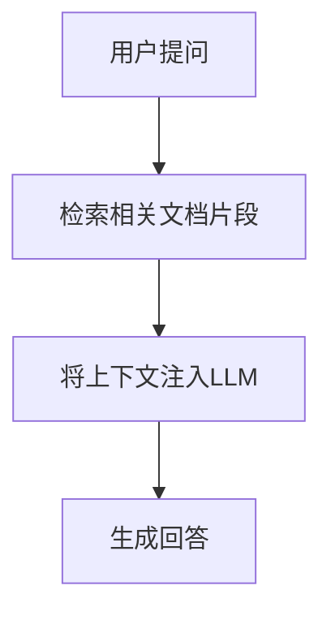
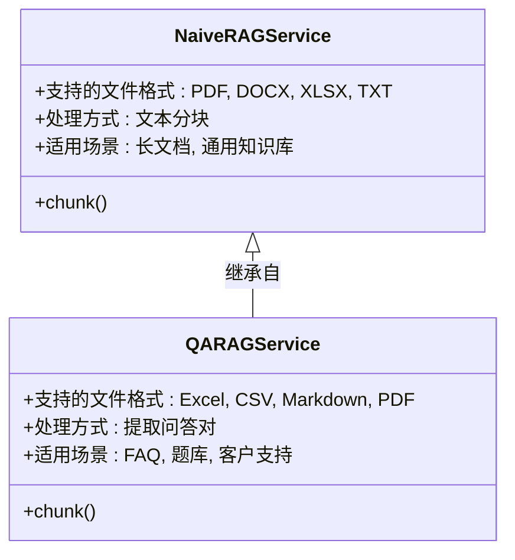
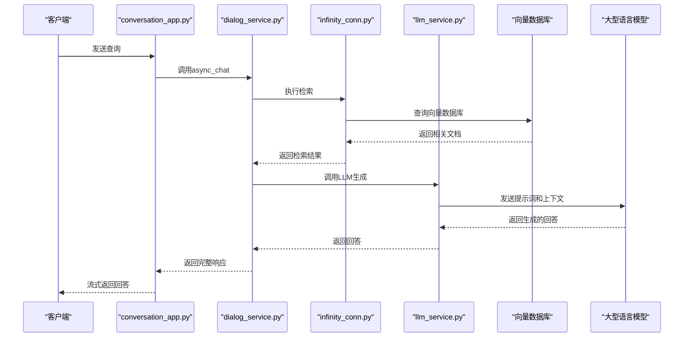
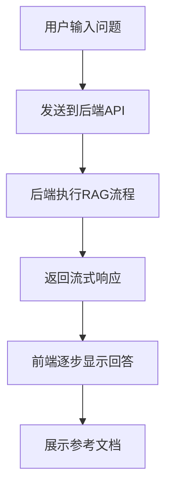
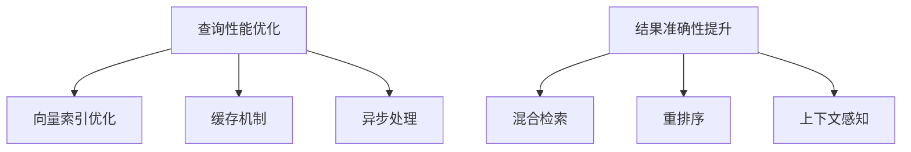

# RAG查询服务

<cite>
**本文档引用的文件**
- [conversation_app.py](file://api/apps/conversation_app.py)
- [llm_service.py](file://api/db/services/llm_service.py)
- [naive.py](file://rag/app/naive.py)
- [qa.py](file://rag/app/qa.py)
- [infinity_conn.py](file://rag/utils/infinity_conn.py)
- [dialog_service.py](file://api/db/services/dialog_service.py)
- [conversation_service.py](file://api/db/services/conversation_service.py)
- [search.py](file://rag/nlp/search.py)
- [search_service.py](file://api/db/services/search_service.py)
- [rerank_model.py](file://rag/llm/rerank_model.py)
- [embedding_model.py](file://rag/llm/embedding_model.py)
- [chat-card.tsx](file://web/src/pages/next-chats/chat-card.tsx)
- [index.tsx](file://web/src/pages/next-chats/index.tsx)
</cite>

## 目录
1. [引言](#引言)
2. [RAG查询基本流程](#rag查询基本流程)
3. [NaiveRAGService与QARAGService对比](#naiveragservice与qaragservice对比)
4. [conversation_app.py API实现](#conversation_apppy-api实现)
5. [向量数据库与LLM服务交互](#向量数据库与llm服务交互)
6. [检索算法与重排序模型](#检索算法与重排序模型)
7. [前端聊天界面展示](#前端聊天界面展示)
8. [性能优化与准确性提升](#性能优化与准确性提升)
9. [结论](#结论)

## 引言
RAG（检索增强生成）查询服务是一种先进的信息检索系统，它结合了信息检索和语言生成技术。该服务通过将用户查询与知识库中的相关文档片段进行匹配，然后将这些上下文信息注入到大型语言模型（LLM）中，最终生成准确、相关的回答。本文档详细阐述了RAG查询服务的架构、核心组件、实现细节以及优化策略。

## RAG查询基本流程

RAG查询服务遵循一个清晰的四步流程：用户提问 -> 检索相关文档片段 -> 将上下文注入LLM -> 生成回答。这个流程确保了生成的回答不仅基于LLM的广泛知识，还紧密结合了特定知识库中的最新和最相关信息。



**Diagram sources**
- [conversation_app.py](file://api/apps/conversation_app.py#L168-L250)
- [dialog_service.py](file://api/db/services/dialog_service.py#L352-L638)

## NaiveRAGService与QARAGService对比

RAG服务提供了两种主要的文档处理模式：`NaiveRAGService`和`QARAGService`。这两种服务针对不同类型的文档和使用场景进行了优化。

### NaiveRAGService
`NaiveRAGService`（在代码中由`rag/app/naive.py`实现）是一种通用的文档处理服务。它适用于大多数文档格式，如PDF、Word、Excel和纯文本。该服务通过将文档分割成较小的文本块（chunks），然后对这些块进行索引，以便进行高效的相似度搜索。

**应用场景**：
- 处理长篇技术文档、报告或书籍
- 需要从大段落文本中提取信息的场景
- 通用知识库的构建和查询

### QARAGService
`QARAGService`（在代码中由`rag/app/qa.py`实现）专门设计用于处理问答对（Q&A）格式的文档。它能够识别和提取文档中的问题和答案对，并将它们作为独立的单元进行索引。

**应用场景**：
- FAQ（常见问题解答）文档
- 培训材料和考试题库
- 客户支持知识库
- 需要精确匹配问题和答案的场景



**Diagram sources**
- [naive.py](file://rag/app/naive.py#L618-L706)
- [qa.py](file://rag/app/qa.py#L313-L462)

## conversation_app.py API实现

`conversation_app.py`文件定义了RAG查询服务的核心API端点，负责处理用户会话和查询请求。

### create_conversation
`create_conversation` API用于创建新的对话会话。它接收一个包含会话信息的JSON请求，包括会话ID、是否为新会话以及会话名称。该API会根据请求创建或更新会话记录。

```python
@manager.route("/set", methods=["POST"])
@login_required
async def set_conversation():
    req = await get_request_json()
    conv_id = req.get("conversation_id")
    is_new = req.get("is_new")
    name = req.get("name", "New conversation")
    req["user_id"] = current_user.id
    # ... 创建或更新会话逻辑
```

### send_message
`send_message` API（在代码中对应`completion`端点）是RAG服务的核心。它接收用户的查询消息，执行检索和生成流程，并返回流式响应。

```python
@manager.route("/completion", methods=["POST"])
@login_required
@validate_request("conversation_id", "messages")
async def completion():
    req = await get_request_json()
    # ... 处理消息和会话
    async def stream():
        nonlocal dia, msg, req, conv
        try:
            async for ans in async_chat(dia, msg, True, **req):
                ans = structure_answer(conv, ans, message_id, conv.id)
                yield "data:" + json.dumps({"code": 0, "message": "", "data": ans}, ensure_ascii=False) + "\n\n"
        except Exception as e:
            logging.exception(e)
            yield "data:" + json.dumps({"code": 500, "message": str(e), "data": {"answer": "**ERROR**: " + str(e), "reference": []}}, ensure_ascii=False) + "\n\n"
        yield "data:" + json.dumps({"code": 0, "message": "", "data": True}, ensure_ascii=False) + "\n\n"
    
    if req.get("stream", True):
        resp = Response(stream(), mimetype="text/event-stream")
        # ... 设置响应头
        return resp
    else:
        # ... 非流式响应处理
```

**Section sources**
- [conversation_app.py](file://api/apps/conversation_app.py#L37-L250)

## 向量数据库与LLM服务交互

RAG服务通过`infinity_conn.py`与向量数据库交互，并通过`llm_service.py`与LLM服务交互，实现了高效的检索和生成。

### 向量数据库交互
`infinity_conn.py`模块提供了与Infinity向量数据库的连接和操作接口。它负责创建索引、插入文档、执行搜索和删除索引等操作。

```python
class InfinityConnection(DocStoreConnection):
    def createIdx(self, indexName: str, knowledgebaseId: str, vectorSize: int):
        # 创建索引
        pass
        
    def search(self, selectFields: list[str], highlightFields: list[str], condition: dict, matchExprs: list[MatchExpr], orderBy: OrderByExpr, offset: int, limit: int, indexNames: str | list[str], knowledgebaseIds: list[str], aggFields: list[str] = [], rank_feature: dict | None = None, ) -> tuple[pd.DataFrame, int]:
        # 执行搜索
        pass
        
    def insert(self, documents: list[dict], indexName: str, knowledgebaseId: str = None) -> list[str]:
        # 插入文档
        pass
```

### LLM服务交互
`llm_service.py`模块提供了与各种LLM服务的统一接口。它通过`LLMBundle`类封装了不同LLM提供商的API，使得系统可以灵活地切换和使用不同的模型。

```python
class LLMBundle(LLM4Tenant):
    def __init__(self, tenant_id, llm_type, llm_name=None, lang="Chinese", **kwargs):
        super().__init__(tenant_id, llm_type, llm_name, lang, **kwargs)
        
    def chat(self, system: str, history: list, gen_conf: dict = {}, **kwargs) -> str:
        return self._run_coroutine_sync(self.async_chat(system, history, gen_conf, **kwargs))
        
    def async_chat(self, system: str, history: list, gen_conf: dict = {}, **kwargs):
        # 异步聊天
        pass
```



**Diagram sources**
- [infinity_conn.py](file://rag/utils/infinity_conn.py#L274-L307)
- [llm_service.py](file://api/db/services/llm_service.py#L386-L420)
- [dialog_service.py](file://api/db/services/dialog_service.py#L352-L638)

## 检索算法与重排序模型

RAG服务采用了先进的检索算法和重排序模型来提高查询结果的准确性和相关性。

### 检索算法
系统使用混合检索策略，结合了基于关键词的全文检索和基于向量的语义检索。`Dealer`类在`rag/nlp/search.py`中实现了这一策略。

```python
def search(self, req, idx_names: str | list[str], kb_ids: list[str], emb_mdl=None, highlight: bool | list | None = None, rank_feature: dict | None = None):
    # ... 准备查询条件
    if emb_mdl is None:
        matchExprs = [matchText]
        res = self.dataStore.search(src, highlightFields, filters, matchExprs, orderBy, offset, limit, idx_names, kb_ids, rank_feature=rank_feature)
    else:
        matchDense = self.get_vector(qst, emb_mdl, topk, req.get("similarity", 0.1))
        q_vec = matchDense.embedding_data
        fusionExpr = FusionExpr("weighted_sum", topk, {"weights": "0.05,0.95"})
        matchExprs = [matchText, matchDense, fusionExpr]
        res = self.dataStore.search(src, highlightFields, filters, matchExprs, orderBy, offset, limit, idx_names, kb_ids, rank_feature=rank_feature)
    # ... 处理结果
```

### 重排序模型
在初步检索后，系统使用重排序模型对结果进行重新排序，以提高最相关文档的排名。`rerank_model.py`文件中定义了多种重排序模型的实现。

```python
class JinaRerank(Base):
    def similarity(self, query: str, texts: list):
        texts = [truncate(t, 8196) for t in texts]
        data = {"model": self.model_name, "query": query, "documents": texts, "top_n": len(texts)}
        res = requests.post(self.base_url, headers=self.headers, json=data).json()
        rank = np.zeros(len(texts), dtype=float)
        try:
            for d in res["results"]:
                rank[d["index"]] = d["relevance_score"]
        except Exception as _e:
            log_exception(_e, res)
        return rank, total_token_count_from_response(res)
```

**Section sources**
- [search.py](file://rag/nlp/search.py#L73-L132)
- [rerank_model.py](file://rag/llm/rerank_model.py#L48-L58)

## 前端聊天界面展示

前端聊天界面位于`web/src/pages/next-chats/`目录下，负责展示RAG查询的结果，包括生成的回答和检索到的上下文。

### 聊天卡片组件
`chat-card.tsx`组件负责渲染单个聊天消息，包括用户输入和AI生成的回答。

```typescript
// 伪代码表示聊天卡片的结构
const ChatCard = ({ message }) => {
    return (
        <div className="chat-card">
            <div className="message-content">{message.content}</div>
            {message.reference && (
                <div className="reference-section">
                    <h4>参考文档</h4>
                    {message.reference.chunks.map((chunk, index) => (
                        <div key={index} className="reference-item">
                            <p>{chunk.content_with_weight}</p>
                            <small>来源: {chunk.docnm_kwd}</small>
                        </div>
                    ))}
                </div>
            )}
        </div>
    );
};
```

### 聊天主界面
`index.tsx`文件是聊天界面的主组件，负责管理聊天会话、发送消息和显示消息列表。



**Section sources**
- [chat-card.tsx](file://web/src/pages/next-chats/chat-card.tsx)
- [index.tsx](file://web/src/pages/next-chats/index.tsx)

## 性能优化与准确性提升

为了确保RAG查询服务的高性能和高准确性，系统采用了多种优化策略。

### 查询性能优化
- **向量索引优化**：使用HNSW（Hierarchical Navigable Small World）算法构建高效的向量索引，加速相似度搜索。
- **缓存机制**：对频繁查询的结果进行缓存，减少重复计算。
- **异步处理**：采用异步编程模型，提高系统的并发处理能力。

### 结果准确性提升
- **混合检索**：结合关键词检索和语义检索，兼顾精确匹配和语义理解。
- **重排序**：使用专门的重排序模型对初步检索结果进行精排，提高相关文档的排名。
- **上下文感知**：在多轮对话中，考虑历史对话上下文，生成更连贯的回答。



**Section sources**
- [infinity_conn.py](file://rag/utils/infinity_conn.py#L280-L293)
- [search.py](file://rag/nlp/search.py#L126-L127)
- [rerank_model.py](file://rag/llm/rerank_model.py)

## 结论
RAG查询服务通过整合先进的检索技术和大型语言模型，提供了一种强大而灵活的信息查询解决方案。通过对`NaiveRAGService`和`QARAGService`的合理选择，可以满足不同场景下的需求。系统通过`conversation_app.py`中的API与前端交互，利用`infinity_conn.py`和`llm_service.py`分别与向量数据库和LLM服务进行通信，实现了高效的检索和生成。前端界面清晰地展示了生成的回答和参考文档，提升了用户体验。通过一系列性能优化和准确性提升策略，该服务能够提供快速、准确和可靠的信息查询服务。