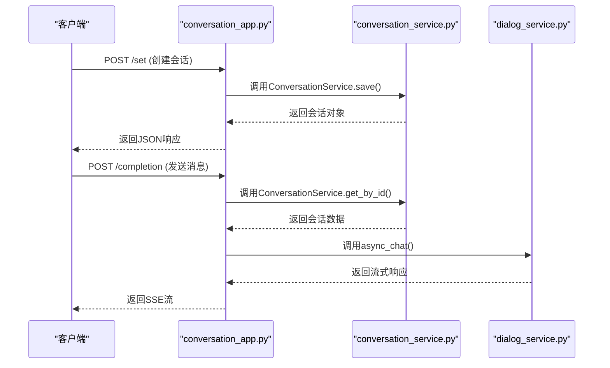
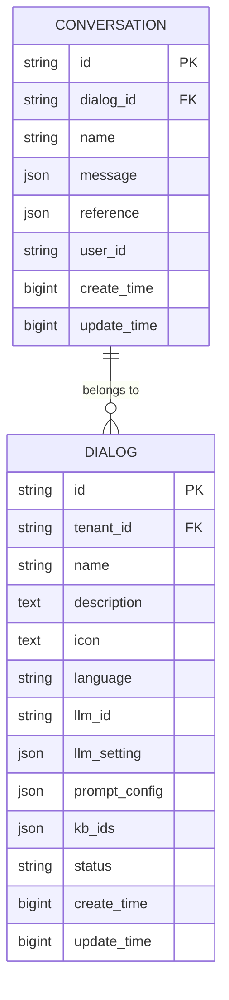
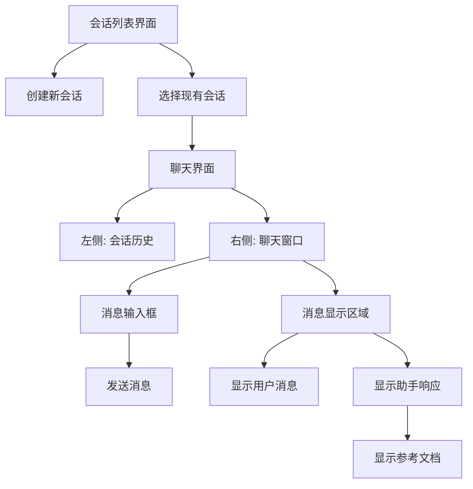

# 会话管理

<cite>
**本文档引用的文件**   
- [conversation_app.py](file://api/apps/conversation_app.py)
- [conversation_service.py](file://api/db/services/conversation_service.py)
- [db_models.py](file://api/db/db_models.py)
- [index.tsx](file://web/src/pages/next-chats/index.tsx)
- [chat/index.tsx](file://web/src/pages/next-chats/chat/index.tsx)
- [sessions.tsx](file://web/src/pages/next-chats/chat/sessions.tsx)
- [use-send-chat-message.ts](file://web/src/pages/next-chats/hooks/use-send-chat-message.ts)
- [chat.ts](file://web/src/constants/chat.ts)
- [chat.ts](file://web/src/interfaces/database/chat.ts)
- [next-chat-service.ts](file://web/src/services/next-chat-service.ts)
</cite>

## 目录
1. [简介](#简介)
2. [会话创建与消息发送流程](#会话创建与消息发送流程)
3. [数据库存储结构](#数据库存储结构)
4. [前端用户界面](#前端用户界面)
5. [会话持久化与上下文管理](#会话持久化与上下文管理)
6. [多轮对话实现](#多轮对话实现)
7. [结论](#结论)

## 简介
本文档全面介绍RAG查询系统中的会话管理功能。基于`conversation_app.py`中的API，说明会话的创建、消息的发送与接收流程。通过`conversation_service.py`和`db_models.py`，解释会话和消息在数据库中的存储结构。结合`web/src/pages/next-chats/`的前端代码，描述用户界面如何展示会话历史、检索到的参考文档以及LLM生成的回答。

**Section sources**
- [conversation_app.py](file://api/apps/conversation_app.py#L1-L479)

## 会话创建与消息发送流程
会话管理功能主要通过`conversation_app.py`中的API实现。系统提供了创建会话、发送消息、获取会话列表、删除会话等核心功能。

会话创建通过`set_conversation`路由实现，当`is_new`为真时，会创建新的会话记录，包含对话ID、会话名称和初始消息。消息发送通过`completion`路由实现，该路由接收会话ID和消息列表，处理用户查询并返回流式响应。

消息处理流程包括验证请求、获取会话和对话信息、处理消息内容、调用异步聊天服务，并根据是否为流式响应返回相应的数据格式。系统支持流式SSE（Server-Sent Events）响应，允许客户端实时接收LLM生成的响应。

**Diagram sources **
- [conversation_app.py](file://api/apps/conversation_app.py#L37-L78)
- [conversation_app.py](file://api/apps/conversation_app.py#L168-L251)

**Section sources**
- [conversation_app.py](file://api/apps/conversation_app.py#L37-L251)

## 数据库存储结构
会话和消息的存储结构在`db_models.py`中定义，主要涉及`Conversation`和`Dialog`两个核心模型。

`Conversation`模型包含会话ID、对话ID、会话名称、消息列表和引用信息。消息列表以JSON格式存储，包含角色（用户或助手）、内容、创建时间和唯一标识符。引用信息存储检索到的相关文档片段。

`Dialog`模型定义了对话应用的配置，包括名称、描述、图标、语言设置、LLM配置、提示词配置和知识库ID列表。提示词配置包含系统提示、开场白和参数设置。

`conversation_service.py`中的`ConversationService`类提供了对会话数据的CRUD操作，包括获取会话列表、更新会话和删除会话等功能。

**Diagram sources **
- [db_models.py](file://api/db/db_models.py#L877-L887)
- [db_models.py](file://api/db/db_models.py#L842-L875)

**Section sources**
- [db_models.py](file://api/db/db_models.py#L842-L887)
- [conversation_service.py](file://api/db/services/conversation_service.py#L29-L65)

## 前端用户界面
前端用户界面位于`web/src/pages/next-chats/`目录下，采用React框架构建，提供了完整的会话管理交互体验。

主界面`index.tsx`展示了会话列表，用户可以通过搜索框过滤会话，点击"创建会话"按钮开始新的对话。会话列表显示每个会话的名称和相关信息。

聊天界面`chat/index.tsx`采用分栏布局，左侧为会话历史列表，右侧为当前会话的聊天窗口。会话历史列表显示了所有与特定对话应用相关的会话，用户可以点击切换不同的会话。

`sessions.tsx`组件实现了会话侧边栏功能，显示当前对话应用的所有会话，支持搜索、创建新会话和删除会话操作。每个会话条目显示会话名称，并通过高亮显示当前选中的会话。

消息发送功能在`use-send-chat-message.ts`中实现，处理用户输入、文件上传、消息发送和响应接收。系统支持流式响应显示，用户可以看到LLM逐字生成的回答。

**Diagram sources **
- [index.tsx](file://web/src/pages/next-chats/index.tsx#L1-L126)
- [chat/index.tsx](file://web/src/pages/next-chats/chat/index.tsx#L1-L186)
- [sessions.tsx](file://web/src/pages/next-chats/chat/sessions.tsx#L1-L124)

**Section sources**
- [index.tsx](file://web/src/pages/next-chats/index.tsx#L1-L126)
- [chat/index.tsx](file://web/src/pages/next-chats/chat/index.tsx#L1-L186)
- [sessions.tsx](file://web/src/pages/next-chats/chat/sessions.tsx#L1-L124)
- [use-send-chat-message.ts](file://web/src/pages/next-chats/hooks/use-send-chat-message.ts#L1-L207)

## 会话持久化与上下文管理
会话持久化通过数据库存储实现，确保用户会话数据在服务器重启后仍然可用。每次用户发送消息时，系统都会更新会话记录，保存最新的消息历史和引用信息。

上下文管理在`conversation_service.py`的`structure_answer`函数中实现，该函数负责组织回答数据结构，包括答案内容、引用的文档片段和消息ID。系统通过维护消息列表的顺序来保持对话上下文，确保多轮对话的连贯性。

当用户发送新消息时，系统会将用户消息和之前的助手响应组合成消息上下文，发送给LLM模型。这样LLM可以基于完整的对话历史生成更准确的回答。系统还支持对话配置的持久化，包括LLM参数、提示词模板和知识库设置。

API服务通过`completeConversation`端点提供消息处理功能，前端通过`next-chat-service.ts`中的服务方法调用这些API，实现前后端的数据交互。

## 多轮对话实现
多轮对话的实现依赖于会话状态的持续维护和上下文传递。系统通过会话ID关联一系列相关的消息交互，形成完整的对话链。

在每次消息交互中，系统会检索该会话的所有历史消息，构建完整的上下文传递给LLM模型。这确保了模型能够理解对话的完整背景，生成连贯的响应。

前端通过`useSelectNextMessages`钩子管理消息状态，维护当前会话的消息列表。当收到新的流式响应时，系统会逐步更新显示，提供实时的对话体验。

系统还支持会话的编辑和删除操作，用户可以管理自己的会话历史。通过`delete_msg`API，用户可以删除特定的消息对，系统会相应地更新会话记录。

## 结论
RAG查询系统的会话管理功能提供了一个完整的对话交互解决方案。通过后端API、数据库存储和前端界面的协同工作，系统实现了会话的创建、消息的发送与接收、会话历史的持久化和多轮对话的上下文管理。

该功能的核心优势在于：
1. 基于数据库的会话持久化，确保数据安全
2. 流式响应支持，提供实时交互体验
3. 完整的上下文管理，保证多轮对话的连贯性
4. 前后端分离架构，便于维护和扩展

未来可以进一步优化会话管理功能，如增加会话标签、会话搜索、会话分享等特性，提升用户体验。