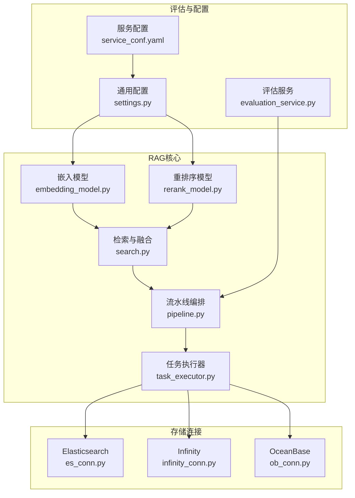
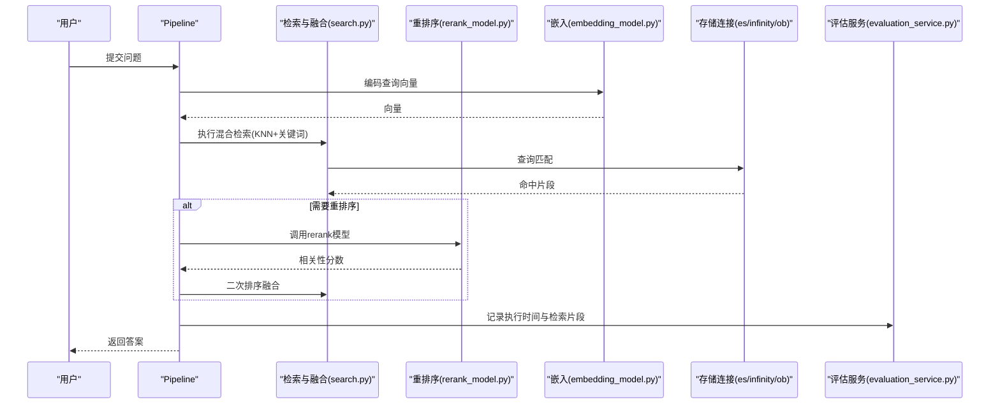
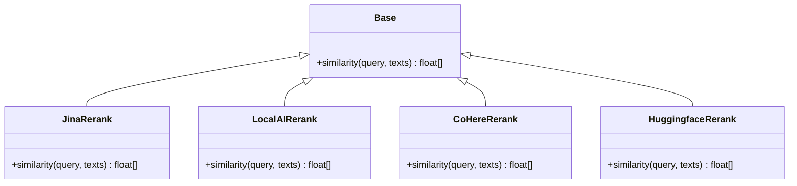
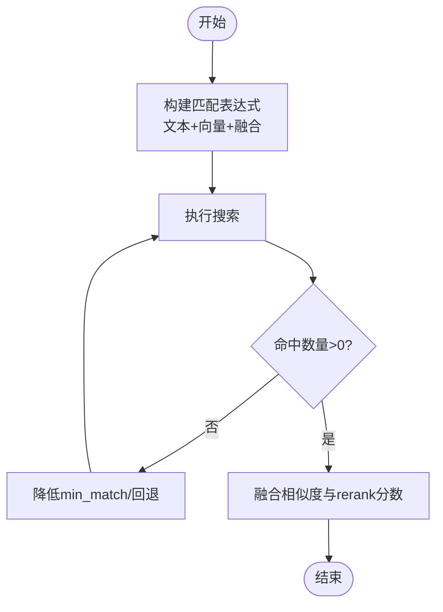
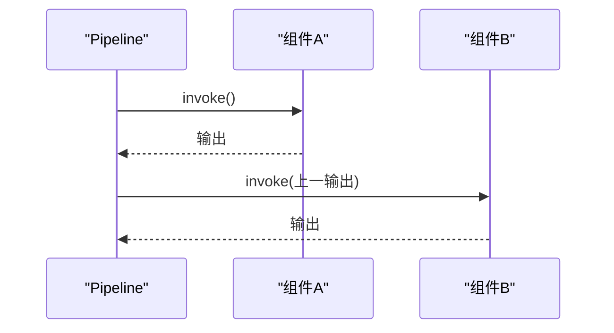
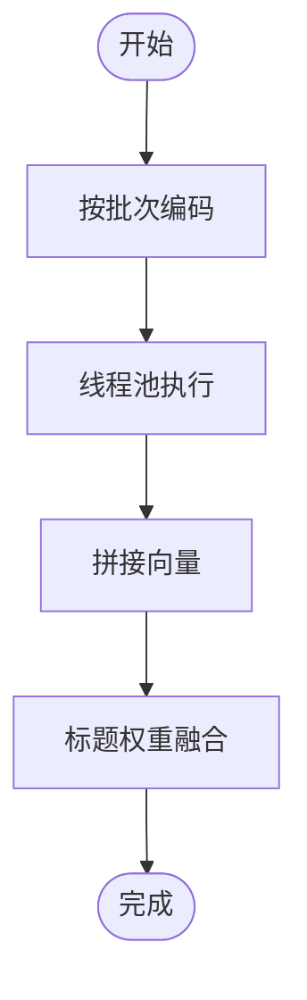
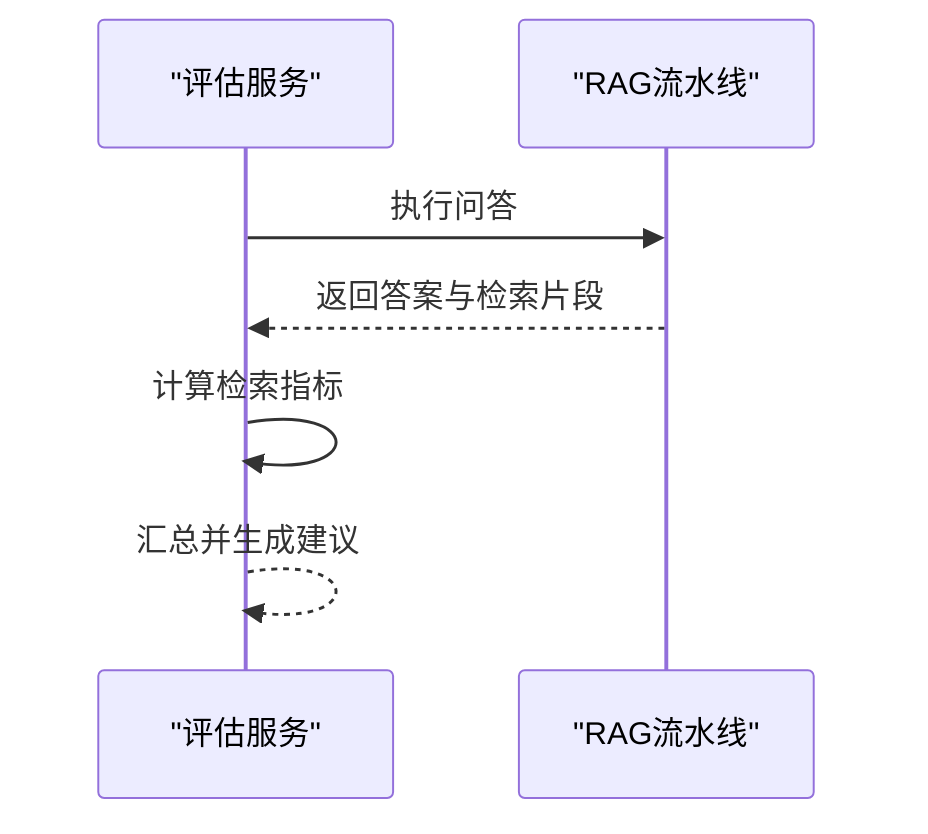
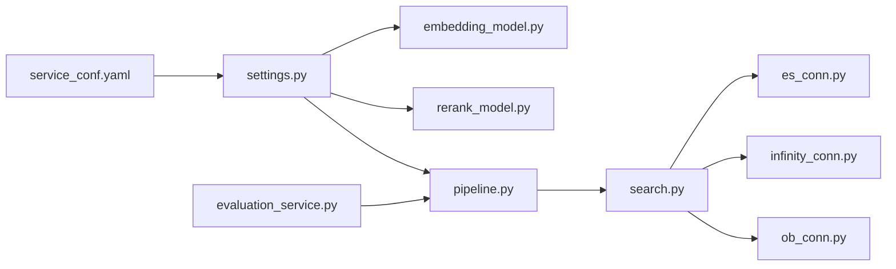

# 性能与准确性优化

<cite>
**本文引用的文件列表**
- [rerank_model.py](file://rag/llm/rerank_model.py)
- [pipeline.py](file://rag/flow/pipeline.py)
- [search.py](file://rag/nlp/search.py)
- [task_executor.py](file://rag/svr/task_executor.py)
- [evaluation_service.py](file://api/db/services/evaluation_service.py)
- [embedding_model.py](file://rag/llm/embedding_model.py)
- [settings.py](file://common/settings.py)
- [service_conf.yaml](file://conf/service_conf.yaml)
- [tokenizer.py](file://rag/flow/tokenizer/tokenizer.py)
- [es_conn.py](file://rag/utils/es_conn.py)
- [infinity_conn.py](file://rag/utils/infinity_conn.py)
- [ob_conn.py](file://rag/utils/ob_conn.py)
- [kb_app.py](file://api/apps/kb_app.py)
- [graphrag/utils.py](file://graphrag/utils.py)
</cite>

## 目录
1. [引言](#引言)
2. [项目结构](#项目结构)
3. [核心组件](#核心组件)
4. [架构总览](#架构总览)
5. [详细组件分析](#详细组件分析)
6. [依赖关系分析](#依赖关系分析)
7. [性能考量](#性能考量)
8. [故障排查指南](#故障排查指南)
9. [结论](#结论)
10. [附录](#附录)

## 引言
本指南聚焦于RAG查询在“性能”与“准确性”两方面的系统化优化路径，围绕以下关键点展开：
- 如何通过 rerank_model.py 引入重排序（rerank）模型以提升检索相关性；
- 在 pipeline.py 中识别RAG流水线的整体性能瓶颈（检索延迟、LLM响应时间、数据处理开销）；
- 提出可落地的优化策略：缓存检索结果、异步处理、选择高效嵌入与重排序模型、优化分块大小与重叠；
- 基于 evaluation_service.py 的评估体系，设计A/B测试方案以量化不同配置对回答质量的影响。

## 项目结构
本仓库采用模块化组织，RAG相关能力主要分布在以下子目录：
- rag/llm：嵌入与重排序模型抽象与实现
- rag/nlp：检索与融合逻辑
- rag/flow：流水线与组件编排
- rag/svr：任务执行器与并发控制
- api/db/services：评估与运行时服务
- common：全局配置与环境变量解析
- conf：服务配置文件

图表来源
- [embedding_model.py](file://rag/llm/embedding_model.py#L1-L120)
- [rerank_model.py](file://rag/llm/rerank_model.py#L1-L120)
- [search.py](file://rag/nlp/search.py#L120-L160)
- [pipeline.py](file://rag/flow/pipeline.py#L117-L176)
- [task_executor.py](file://rag/svr/task_executor.py#L505-L537)
- [evaluation_service.py](file://api/db/services/evaluation_service.py#L273-L339)
- [settings.py](file://common/settings.py#L198-L220)
- [service_conf.yaml](file://conf/service_conf.yaml#L44-L104)
- [es_conn.py](file://rag/utils/es_conn.py#L203-L225)
- [infinity_conn.py](file://rag/utils/infinity_conn.py#L459-L486)
- [ob_conn.py](file://rag/utils/ob_conn.py#L805-L827)

章节来源
- [settings.py](file://common/settings.py#L198-L220)
- [service_conf.yaml](file://conf/service_conf.yaml#L44-L104)

## 核心组件
- 重排序模型（rerank）：统一抽象基类与多厂商适配，支持本地与云端rerank服务，返回相关性分数与token计数，便于后续归一化与融合。
- 检索与融合：基于向量相似度与关键词权重的混合打分，并支持基于rerank模型的二次排序。
- 流水线编排：基于图的组件链路，支持异步调用与进度日志上报。
- 任务执行器：批量嵌入编码、Raptor聚类、并发限流与缓存。
- 评估服务：对问答流程进行端到端评估，计算检索与生成指标并汇总。

章节来源
- [rerank_model.py](file://rag/llm/rerank_model.py#L28-L135)
- [search.py](file://rag/nlp/search.py#L308-L333)
- [pipeline.py](file://rag/flow/pipeline.py#L117-L176)
- [task_executor.py](file://rag/svr/task_executor.py#L505-L537)
- [evaluation_service.py](file://api/db/services/evaluation_service.py#L273-L339)

## 架构总览
RAG查询从用户输入到最终答案的关键路径如下：
- 输入经由流水线组件流转，先进行向量检索与关键词检索，随后可选地使用rerank模型进行重排序，最后进入LLM生成阶段。
- 存储层支持多种后端（Elasticsearch、Infinity、OpenSearch、OceanBase），检索构建时结合KNN与rank_feature等特性。
- 评估服务贯穿端到端流程，记录执行时间与检索命中情况，用于A/B对比与推荐优化建议。

图表来源
- [pipeline.py](file://rag/flow/pipeline.py#L117-L176)
- [search.py](file://rag/nlp/search.py#L126-L145)
- [rerank_model.py](file://rag/llm/rerank_model.py#L137-L175)
- [embedding_model.py](file://rag/llm/embedding_model.py#L102-L129)
- [es_conn.py](file://rag/utils/es_conn.py#L203-L225)
- [evaluation_service.py](file://api/db/services/evaluation_service.py#L346-L383)

## 详细组件分析

### 重排序模型（rerank_model.py）
- 抽象基类定义统一接口，各厂商实现负责构造请求、解析响应并返回相关性分数与token计数。
- 关键实现要点：
  - 文本截断与长度限制，避免超长输入导致失败或性能退化。
  - 对返回结果进行归一化处理（若需要），确保不同模型输出在同一尺度。
  - 统一记录token用量，便于成本与性能监控。
- 典型调用序列（以某厂商为例）：
  - 构造请求体（包含query、documents、top_n等）
  - 发起HTTP请求
  - 解析结果，填充相关性分数
  - 返回分数数组与token计数

图表来源
- [rerank_model.py](file://rag/llm/rerank_model.py#L28-L135)

章节来源
- [rerank_model.py](file://rag/llm/rerank_model.py#L137-L175)
- [rerank_model.py](file://rag/llm/rerank_model.py#L231-L260)
- [rerank_model.py](file://rag/llm/rerank_model.py#L387-L421)

### 检索与融合（search.py）
- 混合检索：同时执行文本匹配与向量KNN，并通过加权融合得到最终相似度。
- 重排序融合：当启用rerank模型时，将rerank分数与原有相似度进行融合，提高相关性排序质量。
- 关键流程：
  - 构建matchText/matchDense/fusion表达式
  - 执行搜索并统计总数
  - 若为空，尝试降低min_match或回退策略
  - 将rerank分数与rank_feature进行融合

图表来源
- [search.py](file://rag/nlp/search.py#L126-L145)
- [search.py](file://rag/nlp/search.py#L308-L333)

章节来源
- [search.py](file://rag/nlp/search.py#L126-L145)
- [search.py](file://rag/nlp/search.py#L308-L333)

### 流水线编排（pipeline.py）
- 组件链路：按拓扑顺序依次执行，支持异步invoke与错误传播。
- 进度与日志：通过Redis上报组件进度与耗时，便于可观测性与取消控制。
- 关键点：
  - 逐个组件异步调用，保证链路顺畅
  - 错误时终止并上报错误状态

图表来源
- [pipeline.py](file://rag/flow/pipeline.py#L143-L165)

章节来源
- [pipeline.py](file://rag/flow/pipeline.py#L117-L176)

### 任务执行器与并发（task_executor.py）
- 批量嵌入：按批次编码，避免单次请求过大；支持并发limiter与线程池封装。
- Raptor聚类：对大文档进行层次化切分与向量化，减少冗余。
- 关键点：
  - 使用asyncio.to_thread将阻塞操作移至线程池
  - 通过嵌入与标题权重融合生成最终向量
  - 并发限制与进度回调

图表来源
- [task_executor.py](file://rag/svr/task_executor.py#L505-L537)

章节来源
- [task_executor.py](file://rag/svr/task_executor.py#L355-L380)
- [task_executor.py](file://rag/svr/task_executor.py#L505-L537)

### 评估与A/B测试（evaluation_service.py）
- 端到端评估：对每个测试用例运行RAG流程，记录答案、检索片段与执行时间。
- 指标计算：precision、recall、F1、hit_rate、MRR等。
- 汇总与建议：基于平均指标给出配置改进建议（如提升阈值、启用rerank、调整top_k）。

图表来源
- [evaluation_service.py](file://api/db/services/evaluation_service.py#L273-L339)
- [evaluation_service.py](file://api/db/services/evaluation_service.py#L346-L383)
- [evaluation_service.py](file://api/db/services/evaluation_service.py#L417-L437)
- [evaluation_service.py](file://api/db/services/evaluation_service.py#L438-L516)
- [evaluation_service.py](file://api/db/services/evaluation_service.py#L518-L552)
- [evaluation_service.py](file://api/db/services/evaluation_service.py#L554-L574)
- [evaluation_service.py](file://api/db/services/evaluation_service.py#L576-L605)

章节来源
- [evaluation_service.py](file://api/db/services/evaluation_service.py#L273-L339)
- [evaluation_service.py](file://api/db/services/evaluation_service.py#L438-L516)
- [evaluation_service.py](file://api/db/services/evaluation_service.py#L554-L574)

## 依赖关系分析
- 配置依赖：common/settings.py解析服务配置，决定默认模型与批处理参数；conf/service_conf.yaml提供运行时参数。
- 存储依赖：es_conn.py、infinity_conn.py、ob_conn.py分别对接不同后端，检索构建时使用KNN与rank_feature。
- 评估依赖：evaluation_service.py依赖流水线与检索模块，形成闭环验证。

图表来源
- [settings.py](file://common/settings.py#L198-L220)
- [service_conf.yaml](file://conf/service_conf.yaml#L44-L104)
- [embedding_model.py](file://rag/llm/embedding_model.py#L102-L129)
- [rerank_model.py](file://rag/llm/rerank_model.py#L137-L175)
- [pipeline.py](file://rag/flow/pipeline.py#L117-L176)
- [search.py](file://rag/nlp/search.py#L126-L145)
- [es_conn.py](file://rag/utils/es_conn.py#L203-L225)
- [infinity_conn.py](file://rag/utils/infinity_conn.py#L459-L486)
- [ob_conn.py](file://rag/utils/ob_conn.py#L805-L827)
- [evaluation_service.py](file://api/db/services/evaluation_service.py#L273-L339)

章节来源
- [settings.py](file://common/settings.py#L198-L220)
- [service_conf.yaml](file://conf/service_conf.yaml#L44-L104)
- [es_conn.py](file://rag/utils/es_conn.py#L203-L225)
- [infinity_conn.py](file://rag/utils/infinity_conn.py#L459-L486)
- [ob_conn.py](file://rag/utils/ob_conn.py#L805-L827)

## 性能考量

### 1. 重排序（rerank）引入与相关性提升
- 在检索完成后调用rerank_model.py中的具体实现，将原始相似度与rerank分数融合，显著提升排序质量。
- 注意：
  - 不同rerank模型对输入长度、token计数有不同限制，需在调用前进行截断与计数。
  - 部分模型返回分数需归一化，避免尺度差异影响融合效果。

章节来源
- [rerank_model.py](file://rag/llm/rerank_model.py#L137-L175)
- [search.py](file://rag/nlp/search.py#L308-L333)

### 2. 检索延迟优化
- 向量检索：合理设置topn与similarity阈值，减少无效候选；利用rank_feature增强排序权重。
- 文本检索：在空命中时自动降低min_match或回退策略，避免多次失败重试。
- 存储后端：根据部署环境选择合适的引擎（Elasticsearch/OpenSearch/Infinity/OceanBase），并针对KNN与rank_feature进行参数调优。

章节来源
- [search.py](file://rag/nlp/search.py#L126-L145)
- [es_conn.py](file://rag/utils/es_conn.py#L203-L225)
- [infinity_conn.py](file://rag/utils/infinity_conn.py#L459-L486)
- [ob_conn.py](file://rag/utils/ob_conn.py#L805-L827)

### 3. LLM响应时间优化
- 通过评估服务记录端到端执行时间，定位LLM生成阶段的瓶颈。
- 结合A/B测试对比不同提示词、上下文长度与top_p/top_k等参数对响应时间与质量的影响。

章节来源
- [evaluation_service.py](file://api/db/services/evaluation_service.py#L346-L383)

### 4. 数据处理开销优化
- 嵌入编码：使用批量编码与线程池异步执行，减少I/O等待；根据模型最大token限制进行截断。
- 标题权重融合：在向量层面加入标题权重，提升召回质量的同时保持较低的token开销。

章节来源
- [embedding_model.py](file://rag/llm/embedding_model.py#L102-L129)
- [task_executor.py](file://rag/svr/task_executor.py#L505-L537)

### 5. 缓存策略
- LLM与嵌入缓存：graphrag/utils.py提供基于Redis的LLM与嵌入缓存，减少重复计算。
- 检索缓存：结合业务场景对常见查询结果进行缓存，降低重复检索压力。

章节来源
- [graphrag/utils.py](file://graph/ragflow/graphrag/utils.py#L93-L131)

### 6. 异步处理与并发
- 流水线组件采用异步invoke，避免阻塞；任务执行器通过asyncio.to_thread将CPU密集型任务放入线程池。
- 对嵌入与rerank等外部调用，建议使用并发限流器，防止资源争抢。

章节来源
- [pipeline.py](file://rag/flow/pipeline.py#L143-L165)
- [task_executor.py](file://rag/svr/task_executor.py#L505-L537)

### 7. 分块大小与重叠优化
- 分块策略直接影响检索质量与吞吐：过小导致信息碎片化，过大增加检索与生成负担。
- 重叠策略：在相邻块之间保留一定重叠，有助于跨块语义连贯性。
- 参考：部分rerank实现中包含重叠参数（如SILICONFLOW），可作为分块策略的参考。

章节来源
- [rerank_model.py](file://rag/llm/rerank_model.py#L272-L307)

### 8. A/B测试与评估
- 设计实验：对比启用/禁用rerank、不同嵌入模型、不同top_k与相似度阈值等配置。
- 指标：precision、recall、F1、MRR、命中率、平均响应时间。
- 建议：基于evaluation_service.py的指标汇总，给出配置改进建议。

章节来源
- [evaluation_service.py](file://api/db/services/evaluation_service.py#L438-L516)
- [evaluation_service.py](file://api/db/services/evaluation_service.py#L554-L574)

## 故障排查指南
- 重排序异常：检查rerank模型返回格式与字段映射，必要时进行日志打印与异常捕获。
- 检索无结果：确认min_match与similarity阈值是否过严；查看rank_feature是否正确注入。
- 嵌入失败：核对模型名称、API Key与base_url；关注批量大小与token截断。
- 评估异常：确认评估用例与对话配置一致，检查执行时间与检索片段是否正确记录。

章节来源
- [rerank_model.py](file://rag/llm/rerank_model.py#L137-L175)
- [search.py](file://rag/nlp/search.py#L126-L145)
- [embedding_model.py](file://rag/llm/embedding_model.py#L102-L129)
- [evaluation_service.py](file://api/db/services/evaluation_service.py#L346-L383)

## 结论
通过在检索后引入rerank模型、优化嵌入与重排序策略、实施缓存与异步并发、并以评估服务驱动A/B测试，可在保证回答质量的前提下显著降低RAG查询的端到端延迟。建议优先从以下方面入手：
- 明确重排序模型与参数，确保输入截断与分数归一化；
- 调整检索阈值与融合权重，平衡召回与排序质量；
- 启用嵌入与LLM缓存，减少重复计算；
- 使用评估服务持续跟踪指标，迭代优化配置。

## 附录
- 模型切换兼容性：当更换嵌入模型时，应进行向量空间一致性校验，避免不兼容导致的检索质量下降。
  
章节来源
- [kb_app.py](file://api/apps/kb_app.py#L926-L938)