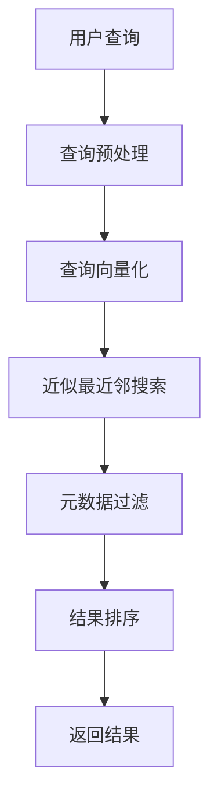
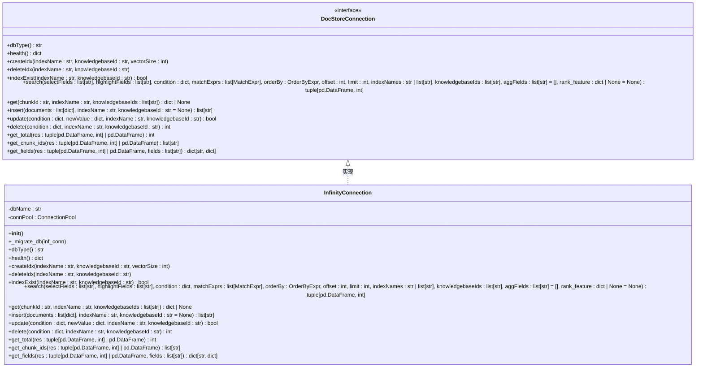

# 检索机制

<cite>
**本文档中引用的文件**  
- [naive.py](file://rag/app/naive.py)
- [qa.py](file://rag/app/qa.py)
- [infinity_conn.py](file://rag/utils/infinity_conn.py)
</cite>

## 目录
1. [简介](#简介)
2. [检索服务类型](#检索服务类型)
3. [检索流程详解](#检索流程详解)
4. [向量数据库交互](#向量数据库交互)
5. [影响检索精度的因素](#影响检索精度的因素)
6. [优化建议](#优化建议)

## 简介
RAGFlow是一款领先的开源检索增强生成（RAG）引擎，通过融合前沿的RAG技术与Agent能力，为大型语言模型提供卓越的上下文层。它提供可适配任意规模企业的端到端RAG工作流，凭借融合式上下文引擎与预置的Agent模板，助力开发者以极致效率与精度将复杂数据转化为高可信、生产级的人工智能系统。

## 检索服务类型

RAGFlow提供了两种主要的检索服务：`NaiveRAGService`（朴素检索）和`QARAGService`（问答优化检索）。这两种服务分别针对不同的文档结构和使用场景，实现了高效的检索功能。

`NaiveRAGService`适用于通用文档的检索，它将文档内容分割成连续的文本块，并对这些文本块进行索引和检索。这种服务适用于大多数文档类型，如PDF、Word文档、Excel表格等。它通过简单的分块策略，将文档内容切分成固定大小的文本块，然后对每个文本块进行向量化处理，存储到向量数据库中。

`QARAGService`则专门针对问答对格式的文档进行了优化。它能够识别文档中的问题和答案对，并将每个问答对作为一个独立的检索单元。这种服务特别适用于FAQ文档、知识库等包含明确问答结构的文档。通过将问题和答案分开处理，`QARAGService`能够更准确地匹配用户查询，提高检索的精确度。

**Section sources**
- [naive.py](file://rag/app/naive.py#L618-L706)
- [qa.py](file://rag/app/qa.py#L313-L463)

## 检索流程详解

RAGFlow的检索过程包含多个关键步骤，从查询处理到最终结果返回，每个环节都经过精心设计以确保检索的高效性和准确性。

### 查询处理与向量化
检索的第一步是将用户输入的查询进行处理和向量化。系统首先对查询文本进行预处理，包括去除停用词、词干提取等操作。然后使用预训练的嵌入模型将查询文本转换为向量表示。这个向量将在后续的相似度搜索中使用。

### 近似最近邻搜索（ANN）
向量化后的查询将被用于在向量数据库中执行近似最近邻搜索（ANN）。RAGFlow使用Infinity向量数据库作为其底层存储，通过HNSW（Hierarchical Navigable Small World）算法实现高效的ANN搜索。HNSW算法通过构建多层图结构，能够在大规模向量数据集中快速找到与查询向量最相似的向量。

### 元数据过滤
在执行向量搜索的同时，系统还会根据用户提供的元数据条件进行过滤。这些条件可以包括文档类型、创建时间、作者等属性。元数据过滤有助于缩小搜索范围，提高检索的相关性。在Infinity数据库中，元数据以结构化字段的形式存储，支持高效的过滤操作。

### 结果排序与融合
检索到的候选结果将根据多种因素进行排序。主要的排序依据包括向量相似度得分、关键词匹配度以及用户自定义的权重。RAGFlow支持将向量相似度和关键词匹配度进行加权融合，以获得更全面的排序结果。此外，系统还考虑了文档的PageRank值，以提高高质量文档的排名。

**Diagram sources**
- [infinity_conn.py](file://rag/utils/infinity_conn.py#L333-L509)
- [naive.py](file://rag/app/naive.py#L618-L706)

**Section sources**
- [infinity_conn.py](file://rag/utils/infinity_conn.py#L333-L509)
- [naive.py](file://rag/app/naive.py#L618-L706)

## 向量数据库交互

RAGFlow通过`infinity_conn.py`文件中的`InfinityConnection`类与Infinity向量数据库进行交互。这个类实现了文档存储连接（DocStoreConnection）接口，提供了创建索引、插入数据、删除数据和搜索等功能。

### 索引创建
当创建新的知识库时，系统会调用`createIdx`方法来创建相应的数据库表。该方法首先读取配置文件中的映射定义，然后根据向量大小动态生成表结构。表中包含一个专门用于存储向量的字段，其名称格式为`q_{vectorSize}_vec`。同时，系统还会为文本字段创建全文索引，以支持关键词搜索。

### 数据插入与更新
文档数据通过`insert`方法插入到数据库中。在插入之前，系统会对文档进行预处理，包括转换字段名称、处理嵌入向量等。如果目标表不存在，系统会自动创建。对于已存在的文档，系统会先删除旧记录再插入新记录，确保数据的一致性。

### 检索操作
检索操作通过`search`方法实现。该方法接受多个参数，包括选择字段、高亮字段、过滤条件、匹配表达式等。系统会根据这些参数构建复杂的查询语句，并发送到Infinity数据库执行。返回的结果是一个包含匹配文档和总命中数的元组。

**Diagram sources**
- [infinity_conn.py](file://rag/utils/infinity_conn.py#L174-L750)

**Section sources**
- [infinity_conn.py](file://rag/utils/infinity_conn.py#L174-L750)

## 影响检索精度的因素

检索精度受到多种因素的影响，理解这些因素有助于优化检索效果。

### 分块策略
分块策略直接影响检索的粒度和上下文完整性。过小的块可能导致上下文丢失，而过大的块可能包含不相关的信息。RAGFlow允许用户根据文档类型和内容特点选择合适的分块策略。对于技术文档，建议使用较小的块大小以保持上下文的精确性；而对于长篇幅的报告，则可以使用较大的块大小以保留更多的上下文信息。

### 嵌入模型选择
嵌入模型的质量直接决定了向量表示的准确性。不同的嵌入模型在处理不同类型的文本时表现各异。例如，某些模型在处理专业术语时表现更好，而另一些模型则在处理日常语言时更擅长。RAGFlow支持多种嵌入模型，用户可以根据具体应用场景选择最适合的模型。

### 相似度阈值
相似度阈值用于过滤低质量的检索结果。设置过高的阈值可能导致相关结果被过滤掉，而设置过低的阈值则可能引入大量噪声。通常建议从默认值开始，根据实际检索效果逐步调整。可以通过分析检索结果的分布情况来确定最佳的阈值。

**Section sources**
- [naive.py](file://rag/app/naive.py#L631-L639)
- [infinity_conn.py](file://rag/utils/infinity_conn.py#L440-L443)

## 优化建议

为了获得最佳的检索效果，建议采取以下优化措施：

1. **合理选择分块策略**：根据文档类型和内容特点选择合适的分块大小和分隔符。对于结构化文档，可以考虑使用语义分块而非简单的字符分割。

2. **定期更新嵌入模型**：随着新模型的发布，定期评估并更新使用的嵌入模型，以利用最新的技术进步。

3. **精细调整相似度阈值**：通过分析检索结果的质量，逐步调整相似度阈值，找到最佳平衡点。

4. **充分利用元数据过滤**：尽可能使用元数据过滤来缩小搜索范围，提高检索的相关性。

5. **监控检索性能**：定期检查检索的响应时间和资源消耗，及时发现并解决性能瓶颈。

通过综合考虑以上因素并实施相应的优化措施，可以显著提升RAGFlow的检索效果，为用户提供更准确、更相关的信息。