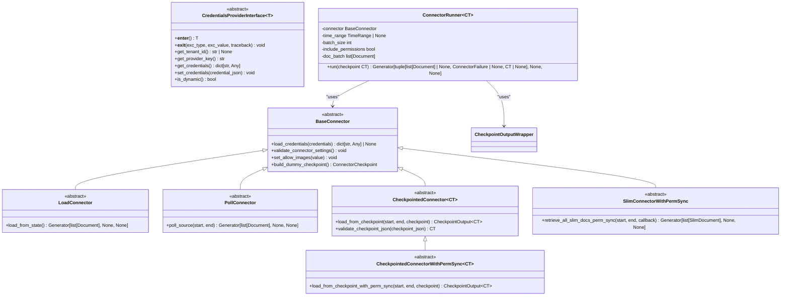
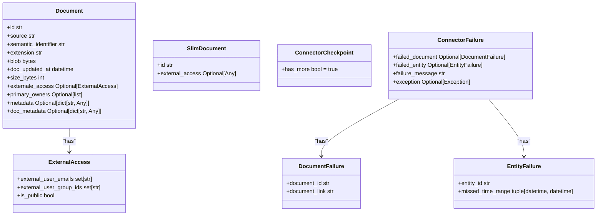
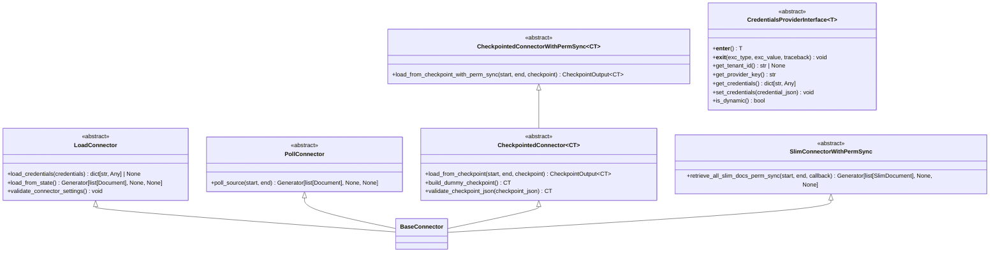
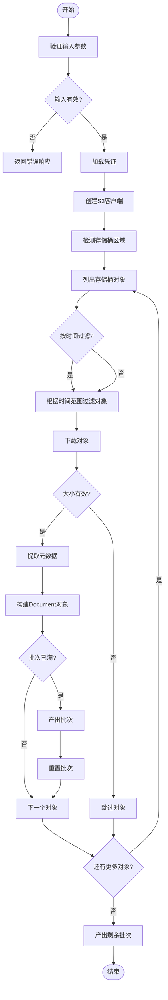
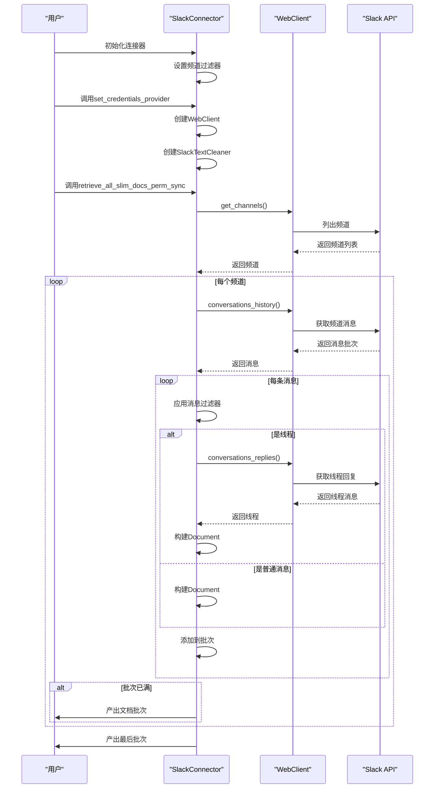
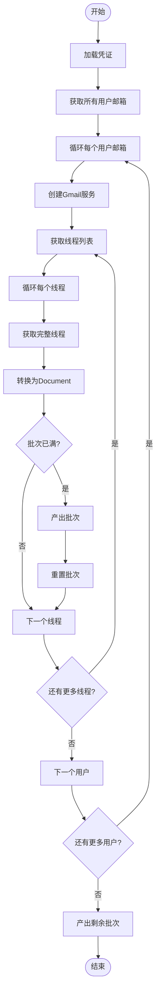
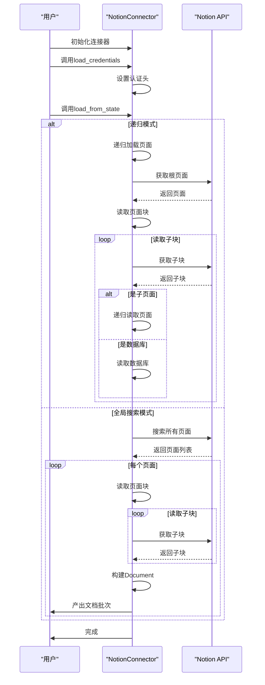
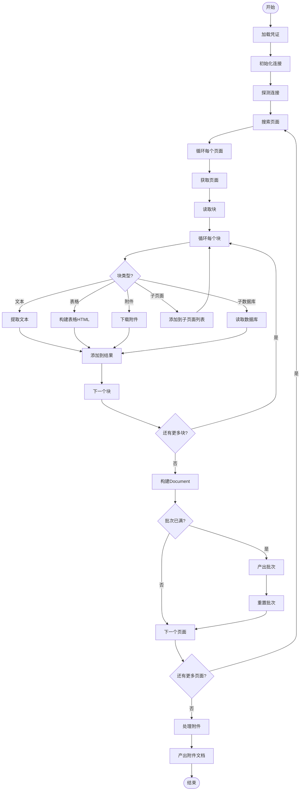
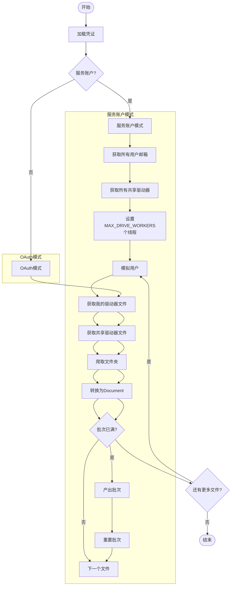

# 数据源集成

<cite>
**本文档引用的文件**   
- [__init__.py](file://common/data_source/__init__.py)
- [interfaces.py](file://common/data_source/interfaces.py)
- [models.py](file://common/data_source/models.py)
- [config.py](file://common/data_source/config.py)
- [utils.py](file://common/data_source/utils.py)
- [blob_connector.py](file://common/data_source/blob_connector.py)
- [slack_connector.py](file://common/data_source/slack_connector.py)
- [gmail_connector.py](file://common/data_source/gmail_connector.py)
- [notion_connector.py](file://common/data_source/notion_connector.py)
- [confluence_connector.py](file://common/data_source/confluence_connector.py)
- [google_drive/connector.py](file://common/data_source/google_drive/connector.py)
- [exceptions.py](file://common/data_source/exceptions.py)
- [connector_runner.py](file://common/data_source/connector_runner.py)
- [google_drive/doc_conversion.py](file://common/data_source/google_drive/doc_conversion.py)
- [google_drive/file_retrieval.py](file://common/data_source/google_drive/file_retrieval.py)
- [google_drive/model.py](file://common/data_source/google_drive/model.py)
- [google_util/auth.py](file://common/data_source/google_util/auth.py)
- [google_util/constant.py](file://common/data_source/google_util/constant.py)
- [google_util/resource.py](file://common/data_source/google_util/resource.py)
- [google_util/util.py](file://common/data_source/google_util/util.py)
</cite>

## 目录
1. [简介](#简介)
2. [项目结构](#项目结构)
3. [核心组件](#核心组件)
4. [架构概述](#架构概述)
5. [详细组件分析](#详细组件分析)
6. [依赖分析](#依赖分析)
7. [性能考虑](#性能考虑)
8. [故障排除指南](#故障排除指南)
9. [结论](#结论)

## 简介
RAGFlow项目提供了一个强大的数据源集成框架，允许从多种外部系统（如Slack、Gmail、Notion、Confluence、Google Drive等）同步文档和数据。该框架设计为模块化和可扩展，支持各种认证机制、权限同步和增量更新。本文档详细分析了数据源集成的核心架构、关键组件和实现细节。

## 项目结构
数据源集成功能主要位于`common/data_source`目录下，该目录包含所有连接器的实现、共享接口、数据模型和实用工具。

```mermaid
graph TD
common.data_source[common/data_source]
common.data_source --> interfaces[interfaces.py]
common.data_source --> models[models.py]
common.data_source --> config[config.py]
common.data_source --> utils[utils.py]
common.data_source --> exceptions[exceptions.py]
common.data_source --> connector_runner[connector_runner.py]
common.data_source --> blob_connector[blob_connector.py]
common.data_source --> slack_connector[slack_connector.py]
common.data_source --> gmail_connector[gmail_connector.py]
common.data_source --> notion_connector[notion_connector.py]
common.data_source --> confluence_connector[confluence_connector.py]
common.data_source --> google_drive[google_drive/]
common.data_source --> __init__[__init__.py]
common.data_source.google_drive --> connector[connector.py]
common.data_source.google_drive --> doc_conversion[doc_conversion.py]
common.data_source.google_drive --> file_retrieval[file_retrieval.py]
common.data_source.google_drive --> model[model.py]
common.data_source.google_util --> auth[auth.py]
common.data_source.google_util --> constant[constant.py]
common.data_source.google_util --> resource[resource.py]
common.data_source.google_util --> util[util.py]
```



**Diagram sources**
- [common/data_source/__init__.py](file://common/data_source/__init__.py)
- [common/data_source/interfaces.py](file://common/data_source/interfaces.py)
- [common/data_source/models.py](file://common/data_source/models.py)
- [common/data_source/config.py](file://common/data_source/config.py)
- [common/data_source/utils.py](file://common/data_source/utils.py)
- [common/data_source/exceptions.py](file://common/data_source/exceptions.py)
- [common/data_source/connector_runner.py](file://common/data_source/connector_runner.py)
- [common/data_source/google_drive/connector.py](file://common/data_source/google_drive/connector.py)
- [common/data_source/google_drive/doc_conversion.py](file://common/data_source/google_drive/doc_conversion.py)
- [common/data_source/google_drive/file_retrieval.py](file://common/data_source/google_drive/file_retrieval.py)
- [common/data_source/google_drive/model.py](file://common/data_source/google_drive/model.py)
- [common/data_source/google_util/auth.py](file://common/data_source/google_util/auth.py)
- [common/data_source/google_util/constant.py](file://common/data_source/google_util/constant.py)
- [common/data_source/google_util/resource.py](file://common/data_source/google_util/resource.py)
- [common/data_source/google_util/util.py](file://common/data_source/google_util/util.py)

**Section sources**
- [common/data_source/__init__.py](file://common/data_source/__init__.py)
- [common/data_source/interfaces.py](file://common/data_source/interfaces.py)
- [common/data_source/models.py](file://common/data_source/models.py)
- [common/data_source/config.py](file://common/data_source/config.py)
- [common/data_source/utils.py](file://common/data_source/utils.py)
- [common/data_source/exceptions.py](file://common/data_source/exceptions.py)
- [common/data_source/connector_runner.py](file://common/data_source/connector_runner.py)
- [common/data_source/google_drive/connector.py](file://common/data_source/google_drive/connector.py)
- [common/data_source/google_drive/doc_conversion.py](file://common/data_source/google_drive/doc_conversion.py)
- [common/data_source/google_drive/file_retrieval.py](file://common/data_source/google_drive/file_retrieval.py)
- [common/data_source/google_drive/model.py](file://common/data_source/google_drive/model.py)
- [common/data_source/google_util/auth.py](file://common/data_source/google_util/auth.py)
- [common/data_source/google_util/constant.py](file://common/data_source/google_util/constant.py)
- [common/data_source/google_util/resource.py](file://common/data_source/google_util/resource.py)
- [common/data_source/google_util/util.py](file://common/data_source/google_util/util.py)

## 核心组件
数据源集成框架的核心由几个关键部分组成：定义了连接器行为的接口、表示文档和元数据的数据模型、处理各种连接器的通用逻辑的实用工具，以及用于协调文档提取的连接器运行器。

**Section sources**
- [common/data_source/interfaces.py](file://common/data_source/interfaces.py)
- [common/data_source/models.py](file://common/data_source/models.py)
- [common/data_source/utils.py](file://common/data_source/utils.py)
- [common/data_source/connector_runner.py](file://common/data_source/connector_runner.py)

## 架构概述
该框架采用基于接口的架构，确保所有连接器都遵循一致的契约。核心是`BaseConnector`抽象基类，它定义了加载凭证、验证设置和处理检查点的基本方法。具体的连接器（如`SlackConnector`、`GmailConnector`）通过实现特定的接口（如`LoadConnector`、`PollConnector`、`CheckpointedConnectorWithPermSync`）来扩展此基础。



**Diagram sources**
- [common/data_source/interfaces.py](file://common/data_source/interfaces.py)
- [common/data_source/models.py](file://common/data_source/models.py)
- [common/data_source/connector_runner.py](file://common/data_source/connector_runner.py)

## 详细组件分析

### 数据模型分析
`models.py`文件定义了在框架中传递数据的核心数据结构。`Document`类是核心，它封装了从外部系统提取的文档内容、元数据和权限信息。

#### 数据模型类图


**Diagram sources**
- [common/data_source/models.py](file://common/data_source/models.py)

### 接口分析
`interfaces.py`文件定义了连接器必须实现的契约。这些接口确保了框架的灵活性和可扩展性。

#### 接口类图


**Diagram sources**
- [common/data_source/interfaces.py](file://common/data_source/interfaces.py)

### Blob存储连接器分析
`blob_connector.py`实现了对S3、Google Cloud Storage等对象存储服务的集成。

#### Blob存储连接器工作流程


**Diagram sources**
- [common/data_source/blob_connector.py](file://common/data_source/blob_connector.py)

### Slack连接器分析
`slack_connector.py`实现了与Slack工作区的集成，用于同步频道消息和线程。

#### Slack连接器工作流程


**Diagram sources**
- [common/data_source/slack_connector.py](file://common/data_source/slack_connector.py)

### Gmail连接器分析
`gmail_connector.py`实现了与Gmail账户的集成，用于同步邮件线程。

#### Gmail连接器工作流程


**Diagram sources**
- [common/data_source/gmail_connector.py](file://common/data_source/gmail_connector.py)

### Notion连接器分析
`notion_connector.py`实现了与Notion工作区的集成，用于同步页面和数据库。

#### Notion连接器工作流程


**Diagram sources**
- [common/data_source/notion_connector.py](file://common/data_source/notion_connector.py)

### Confluence连接器分析
`confluence_connector.py`实现了与Confluence工作区的集成，用于同步页面、附件和评论。

#### Confluence连接器工作流程


**Diagram sources**
- [common/data_source/confluence_connector.py](file://common/data_source/confluence_connector.py)

### Google Drive连接器分析
`google_drive/connector.py`实现了与Google Drive的集成，支持服务账户和OAuth两种模式。

#### Google Drive连接器工作流程


**Diagram sources**
- [common/data_source/google_drive/connector.py](file://common/data_source/google_drive/connector.py)

## 依赖分析
数据源集成框架依赖于多个外部库和内部模块。

```mermaid
graph TD
common.data_source.interfaces --> common.data_source.models : "使用"
common.data_source.interfaces --> common.data.source.utils : "使用"
common.data_source.blob_connector --> common.data_source.utils : "使用"
common.data_source.blob_connector --> common.data_source.config : "使用"
common.data_source.slack_connector --> common.data_source.utils : "使用"
common.data_source.gmail_connector --> common.data_source.google_util : "使用"
common.data_source.notion_connector --> common.data_source.utils : "使用"
common.data_source.confluence_connector --> common.data_source.atlassian : "使用"
common.data_source.google_drive.connector --> common.data_source.google_util : "使用"
common.data_source.connector_runner --> common.data_source.interfaces : "使用"
common.data_source.connector_runner --> common.data_source.models : "使用"
```

**Diagram sources**
- [common/data_source/interfaces.py](file://common/data_source/interfaces.py)
- [common/data_source/models.py](file://common/data_source/models.py)
- [common/data_source/utils.py](file://common/data_source/utils.py)
- [common/data_source/config.py](file://common/data_source/config.py)
- [common/data_source/google_util/auth.py](file://common/data_source/google_util/auth.py)
- [common/data_source/google_util/constant.py](file://common/data_source/google_util/constant.py)
- [common/data_source/google_util/resource.py](file://common/data_source/google_util/resource.py)
- [common/data_source/google_util/util.py](file://common/data_source/google_util/util.py)

## 性能考虑
框架在设计时考虑了性能和可扩展性：
- **批处理**：文档以批次形式提取和处理，以减少I/O开销。
- **并行处理**：Google Drive连接器使用多线程来并行处理多个用户。
- **检查点**：支持检查点机制，允许从上次中断的地方恢复，避免重复工作。
- **速率限制**：内置了对API速率限制的处理，包括重试和退避策略。
- **内存管理**：对大文件设置了大小阈值，防止内存溢出。

## 故障排除指南
当数据源集成出现问题时，可以参考以下常见问题：

**Section sources**
- [common/data_source/exceptions.py](file://common/data_source/exceptions.py)
- [common/data_source/utils.py](file://common/data_source/utils.py)

| 问题 | 可能原因 | 解决方案 |
| :--- | :--- | :--- |
| `ConnectorMissingCredentialError` | 缺少必要的凭证 | 检查连接器配置，确保所有必需的凭证都已提供 |
| `CredentialExpiredError` | 凭证已过期或无效 | 重新生成或刷新凭证 |
| `InsufficientPermissionsError` | 凭证权限不足 | 检查应用权限范围，确保有足够的权限访问所需资源 |
| `ConnectorValidationError` | 连接器设置无效 | 验证连接器配置，如存储桶名称、频道ID等 |
| API速率限制 | 请求过于频繁 | 框架会自动处理，但可检查日志确认 |
| 大文件被跳过 | 文件超过大小阈值 | 检查`*_SIZE_THRESHOLD`环境变量，或调整文件大小限制 |

## 结论
RAGFlow的数据源集成框架是一个设计精良、功能强大的系统，它通过清晰的接口、一致的数据模型和健壮的错误处理，实现了与多种外部系统的无缝集成。其模块化设计使得添加新的数据源连接器变得简单直接，而检查点和批处理机制则确保了大规模数据同步的效率和可靠性。该框架是RAGFlow平台能够从各种知识源中提取和利用信息的基础。