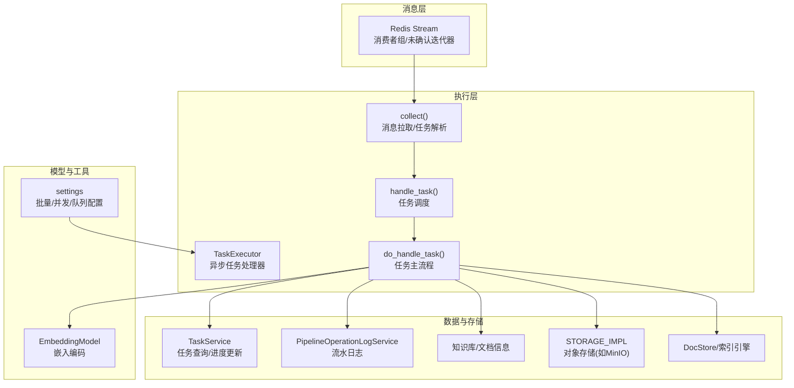
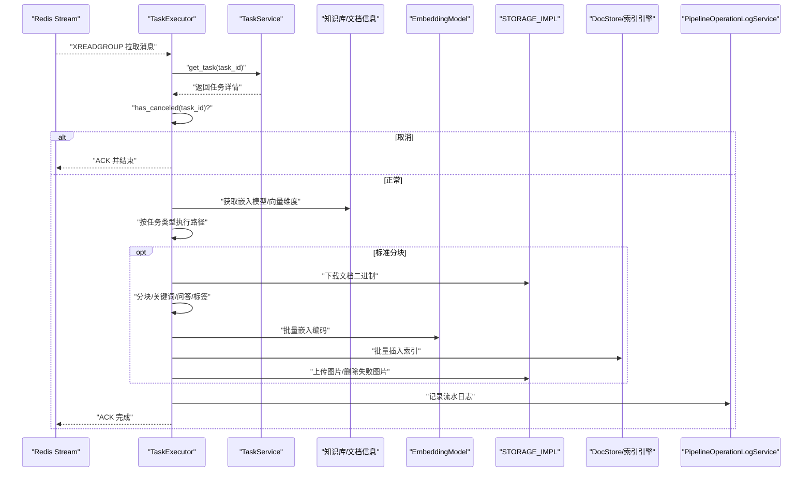
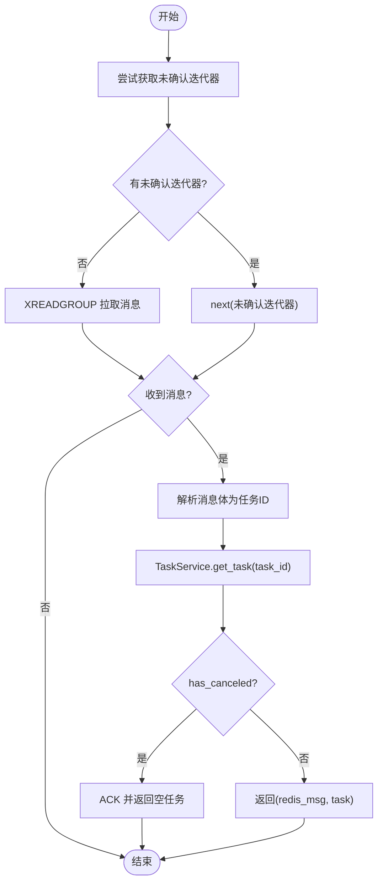
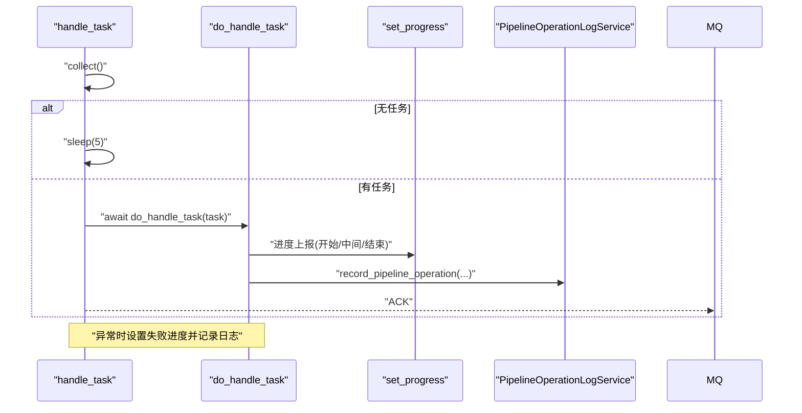
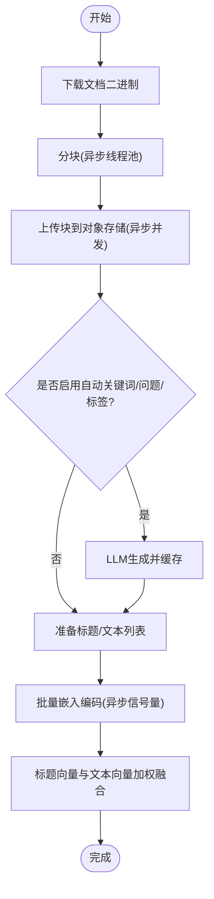
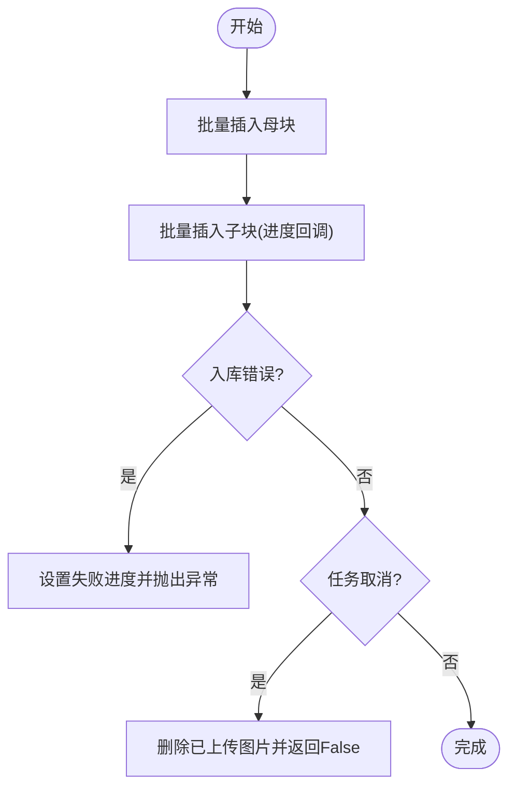
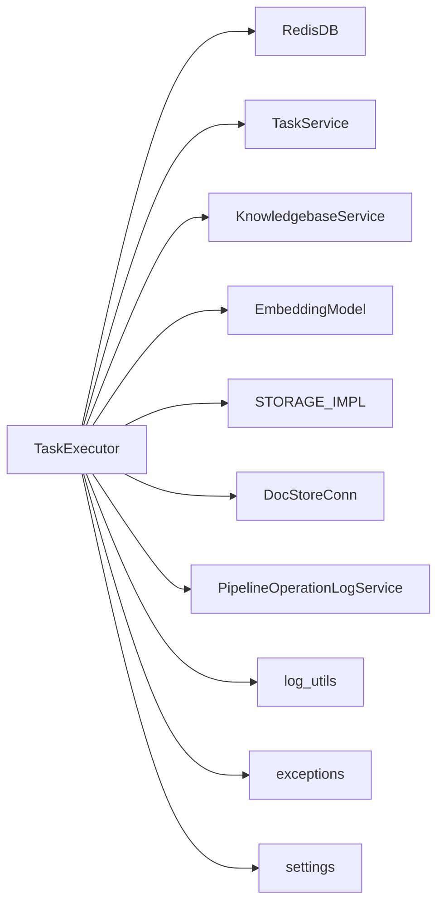

# 任务执行

<cite>
**本文引用的文件**
- [task_executor.py](file://rag/svr/task_executor.py)
- [redis_conn.py](file://rag/utils/redis_conn.py)
- [settings.py](file://common/settings.py)
- [constants.py](file://common/constants.py)
- [task_service.py](file://api/db/services/task_service.py)
- [pipeline_operation_log_service.py](file://api/db/services/pipeline_operation_log_service.py)
- [log_utils.py](file://common/log_utils.py)
- [exceptions.py](file://common/exceptions.py)
- [embedding_model.py](file://rag/llm/embedding_model.py)
- [minio_conn.py](file://rag/utils/minio_conn.py)
</cite>

## 目录
1. [简介](#简介)
2. [项目结构](#项目结构)
3. [核心组件](#核心组件)
4. [架构总览](#架构总览)
5. [详细组件分析](#详细组件分析)
6. [依赖关系分析](#依赖关系分析)
7. [性能考量](#性能考量)
8. [故障排查指南](#故障排查指南)
9. [结论](#结论)
10. [附录](#附录)

## 简介
本文件围绕向量化流程中的异步任务执行器进行深入解析，重点阐述任务执行器如何从消息队列（Redis Stream）消费文档处理任务，协调分块、嵌入生成、索引入库与存储写入等环节，并通过进度上报、取消检测、超时控制与分布式心跳监控保障任务的可靠执行。同时说明该服务如何与API服务解耦，提升系统整体的可扩展性与稳定性。

## 项目结构
任务执行器位于向量化子系统的服务端目录中，围绕以下关键模块协同工作：
- 消息队列接入：基于 Redis Stream 的消费者组消费与未确认迭代器
- 配置与环境：统一的运行参数、批量大小、并发限制、存储实现选择
- 任务生命周期：从数据库查询任务详情、进度上报、取消检测、日志落盘
- 向量化链路：分块、嵌入、索引入库、存储写入、图谱/树化增强
- 日志与异常：根日志初始化、异常捕获与传播、取消异常

图表来源
- [task_executor.py](file://rag/svr/task_executor.py#L165-L219)
- [redis_conn.py](file://rag/utils/redis_conn.py#L258-L330)
- [task_service.py](file://api/db/services/task_service.py#L73-L143)
- [pipeline_operation_log_service.py](file://api/db/services/pipeline_operation_log_service.py#L95-L190)
- [settings.py](file://common/settings.py#L115-L131)
- [embedding_model.py](file://rag/llm/embedding_model.py#L64-L100)
- [minio_conn.py](file://rag/utils/minio_conn.py#L64-L95)

章节来源
- [task_executor.py](file://rag/svr/task_executor.py#L165-L219)
- [redis_conn.py](file://rag/utils/redis_conn.py#L258-L330)
- [settings.py](file://common/settings.py#L115-L131)

## 核心组件
- 异步任务处理器：负责从Redis拉取任务、限流并发、执行任务主流程、上报进度、记录日志与清理状态
- 消息消费与任务解析：封装Redis Stream的消费者组与未确认消息迭代器，解析任务并校验取消状态
- 任务主流程：根据任务类型（标准分块/数据流/图谱/树化）执行不同路径；标准路径包含分块、嵌入、索引入库与存储写入
- 嵌入模型：抽象统一的嵌入编码接口，支持多厂商/本地模型
- 存储实现：通过配置选择MinIO等对象存储，提供上传/删除/存在性检查等能力
- 进度与日志：统一的进度上报与异常日志记录，配合取消检测与超时装饰器
- 心跳与清理：周期性上报心跳，清理过期执行器实例

章节来源
- [task_executor.py](file://rag/svr/task_executor.py#L844-L1056)
- [embedding_model.py](file://rag/llm/embedding_model.py#L64-L100)
- [minio_conn.py](file://rag/utils/minio_conn.py#L64-L95)
- [log_utils.py](file://common/log_utils.py#L25-L74)

## 架构总览
下图展示任务执行器在整体系统中的位置与交互关系：

图表来源
- [task_executor.py](file://rag/svr/task_executor.py#L165-L219)
- [task_executor.py](file://rag/svr/task_executor.py#L844-L1056)
- [task_service.py](file://api/db/services/task_service.py#L73-L143)
- [pipeline_operation_log_service.py](file://api/db/services/pipeline_operation_log_service.py#L95-L190)

## 详细组件分析

### 组件A：消息消费与任务解析（collect）
- 功能要点
  - 使用消费者组与未确认迭代器优先拉取未确认消息，确保幂等与重试
  - 从Redis消息体解析任务ID，再通过TaskService查询任务详情
  - 对特殊任务（调试/图谱）做兼容处理，补充doc_ids等字段
  - 检查任务是否被取消，若取消则ACK并返回空任务
- 关键行为
  - 未确认迭代器遍历完成后，回退到普通消费者组阻塞拉取
  - 解析消息为空或任务不存在时，记录错误并ACK
- 错误与重试
  - 消费异常时记录日志并返回空任务，避免阻塞后续任务
  - 任务不存在或已取消时直接ACK，不进入执行阶段

图表来源
- [task_executor.py](file://rag/svr/task_executor.py#L165-L219)
- [task_service.py](file://api/db/services/task_service.py#L73-L143)

章节来源
- [task_executor.py](file://rag/svr/task_executor.py#L165-L219)
- [task_service.py](file://api/db/services/task_service.py#L73-L143)

### 组件B：任务调度与生命周期（handle_task/do_handle_task）
- 功能要点
  - handle_task：从collect获取任务，记录当前任务，调用do_handle_task，异常时记录失败并ACK
  - do_handle_task：绑定嵌入模型、初始化索引、按任务类型执行不同路径（数据流/树化/图谱/标准分块），最后记录流水日志
  - 进度上报：通过set_progress统一上报进度与消息，支持分页进度前缀
  - 取消检测：在关键节点调用has_canceled，若取消抛出TaskCanceledException
  - 超时控制：使用@timeout装饰器对关键步骤设置超时，防止阻塞
- 生命周期
  - 接收任务 -> 绑定模型 -> 初始化索引 -> 执行路径 -> 插入索引 -> 记录日志 -> ACK完成
  - 失败路径：异常捕获后设置失败进度并记录日志，最终ACK

图表来源
- [task_executor.py](file://rag/svr/task_executor.py#L1058-L1096)
- [task_executor.py](file://rag/svr/task_executor.py#L844-L1056)
- [pipeline_operation_log_service.py](file://api/db/services/pipeline_operation_log_service.py#L192-L200)

章节来源
- [task_executor.py](file://rag/svr/task_executor.py#L1058-L1096)
- [task_executor.py](file://rag/svr/task_executor.py#L844-L1056)

### 组件C：标准分块与嵌入（build_chunks/embedding）
- 分块流程
  - 从对象存储下载文档二进制，超时/异常时设置失败进度并抛出
  - 使用工厂映射选择解析器，异步线程池执行分块逻辑
  - 逐块上传至对象存储，生成唯一ID与时间戳，支持图片转ID
  - 可选：自动生成关键词、问题、标签，缓存LLM结果
- 嵌入流程
  - 收集标题与文本，按批次调用嵌入模型编码，累计token消耗
  - 将标题向量与文本向量加权融合，写入每个chunk的向量字段
  - 进度回调按批次推进，最终返回token数与向量维度

图表来源
- [task_executor.py](file://rag/svr/task_executor.py#L225-L444)
- [task_executor.py](file://rag/svr/task_executor.py#L485-L536)
- [embedding_model.py](file://rag/llm/embedding_model.py#L64-L100)
- [minio_conn.py](file://rag/utils/minio_conn.py#L64-L95)

章节来源
- [task_executor.py](file://rag/svr/task_executor.py#L225-L444)
- [task_executor.py](file://rag/svr/task_executor.py#L485-L536)

### 组件D：索引入库与存储写入（insert_es/delete_image）
- 入库策略
  - 分批插入母块与子块，每批更新进度；遇到错误立即设置失败进度并抛出
  - 若任务在入库过程中被取消，提前返回False并删除已上传的图片
- 存储清理
  - 入库失败时，删除已上传的图片并返回False，避免脏数据
- 图表/TOC
  - 可选生成目录结构并单独插入索引

图表来源
- [task_executor.py](file://rag/svr/task_executor.py#L780-L841)

章节来源
- [task_executor.py](file://rag/svr/task_executor.py#L780-L841)

### 组件E：树化/图谱增强（run_raptor_for_kb/run_graphrag_for_kb）
- 树化（RAPTOR）
  - 依据配置决定范围（文件内/全库），从检索器加载已有向量与文本，调用树化算法生成高层摘要与向量
  - 生成fake_doc_id用于标识图谱任务，统计token消耗
- 图谱（GraphRAG）
  - 依据配置启用分辨率/社区抽取，调用图谱抽取函数，记录耗时并设置进度

章节来源
- [task_executor.py](file://rag/svr/task_executor.py#L703-L768)
- [task_executor.py](file://rag/svr/task_executor.py#L951-L999)

### 组件F：心跳与清理（report_status）
- 心跳上报
  - 定期上报当前进程IP、PID、名称、启动时间、待处理/积压任务数、完成/失败任务数、当前任务快照
  - 维护TASKEXE集合与zset有序集合，清理过期执行器
- 清理策略
  - 通过分布式锁保证清理过程互斥
  - 超时未上报的执行器实例被移除

章节来源
- [task_executor.py](file://rag/svr/task_executor.py#L1098-L1161)
- [redis_conn.py](file://rag/utils/redis_conn.py#L389-L412)

## 依赖关系分析
- 模块耦合
  - TaskExecutor与Redis连接、任务服务、知识库服务、嵌入模型、对象存储、索引引擎、流水日志服务存在直接依赖
  - 通过settings集中管理批量大小、并发限制、队列名等配置，降低硬编码耦合
- 并发与限流
  - 任务级信号量限制并发任务数；分块/嵌入/存储分别有独立信号量，避免资源争抢
- 取消与超时
  - 取消检测贯穿关键路径；超时装饰器保护长耗时操作
- 错误传播
  - 异常被捕获后统一设置失败进度并记录日志，最终ACK，避免阻塞队列

图表来源
- [task_executor.py](file://rag/svr/task_executor.py#L1-L120)
- [settings.py](file://common/settings.py#L115-L131)
- [log_utils.py](file://common/log_utils.py#L25-L74)
- [exceptions.py](file://common/exceptions.py#L16-L19)

章节来源
- [task_executor.py](file://rag/svr/task_executor.py#L1-L120)
- [settings.py](file://common/settings.py#L115-L131)

## 性能考量
- 并发控制
  - 任务并发、分块并发、嵌入并发、存储并发均受信号量限制，避免资源争用导致抖动
- 批量处理
  - 文档批量大小、嵌入批量大小、索引批量大小均可通过配置调整，平衡吞吐与内存占用
- I/O优化
  - 分块与嵌入采用异步线程池与异步协程结合，减少阻塞
  - 对象存储上传使用并发信号量，避免过多并发导致网络拥塞
- 超时与重试
  - 关键步骤设置超时，异常时快速失败并记录日志，避免长时间占用资源
- 取消早停
  - 在每个关键节点检查取消状态，及时释放资源，缩短尾延迟

## 故障排查指南
- 常见问题定位
  - 任务未执行：检查Redis消费者组是否存在、队列是否创建、消息是否被ACK
  - 进度停滞：查看是否有未确认消息堆积，确认消费者组pending数量
  - 嵌入失败：检查嵌入模型配置、token上限、网络连通性
  - 存储上传失败：检查对象存储连接、桶权限、磁盘空间
  - 取消无效：确认取消标记是否正确写入数据库，执行器是否在关键节点检测取消
- 日志与告警
  - 使用根日志初始化，输出到文件与控制台，便于定位异常
  - 心跳上报包含当前任务快照，可用于诊断卡住的任务
- 重试与清理
  - 任务服务对重复任务有重试计数与放弃阈值，超过阈值将不再处理
  - 心跳清理会移除长时间未上报的执行器实例，避免僵尸进程

章节来源
- [task_executor.py](file://rag/svr/task_executor.py#L1098-L1161)
- [task_service.py](file://api/db/services/task_service.py#L127-L143)
- [log_utils.py](file://common/log_utils.py#L25-L74)

## 结论
任务执行器通过异步与并发控制、统一的进度上报与取消检测、完善的日志与心跳清理机制，实现了向量化任务在消息队列驱动下的可靠执行。它与API服务解耦，仅通过消息队列与数据库交互，具备良好的可扩展性与稳定性，能够支撑大规模文档处理场景。

## 附录
- 关键配置项
  - MAX_CONCURRENT_TASKS：最大并发任务数
  - MAX_CONCURRENT_CHUNK_BUILDERS：分块并发
  - MAX_CONCURRENT_MINIO：对象存储并发
  - DOC_BULK_SIZE/EMBEDDING_BATCH_SIZE：批量大小
  - WORKER_HEARTBEAT_TIMEOUT：心跳超时阈值
- 任务类型映射
  - dataflow -> Parse
  - raptor -> RAPTOR
  - graphrag -> GraphRAG
  - mindmap -> Mindmap

章节来源
- [task_executor.py](file://rag/svr/task_executor.py#L112-L124)
- [constants.py](file://common/constants.py#L128-L138)