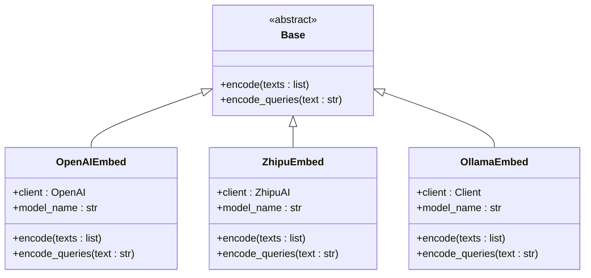
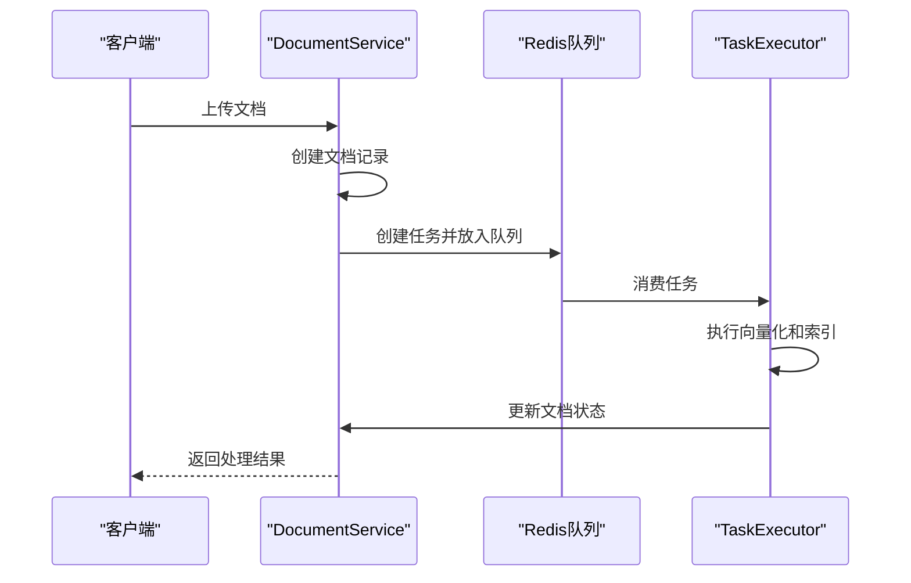
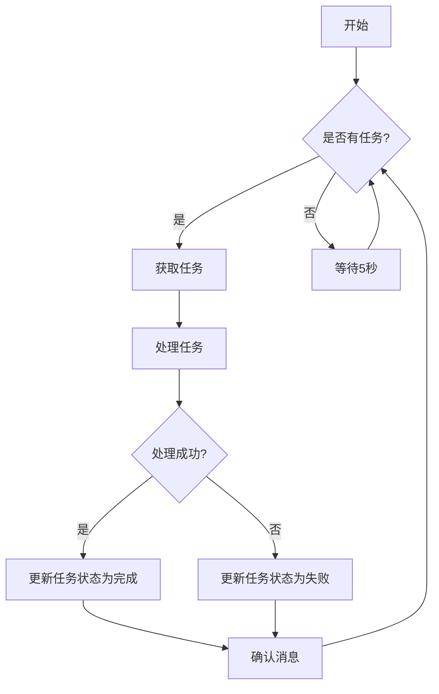
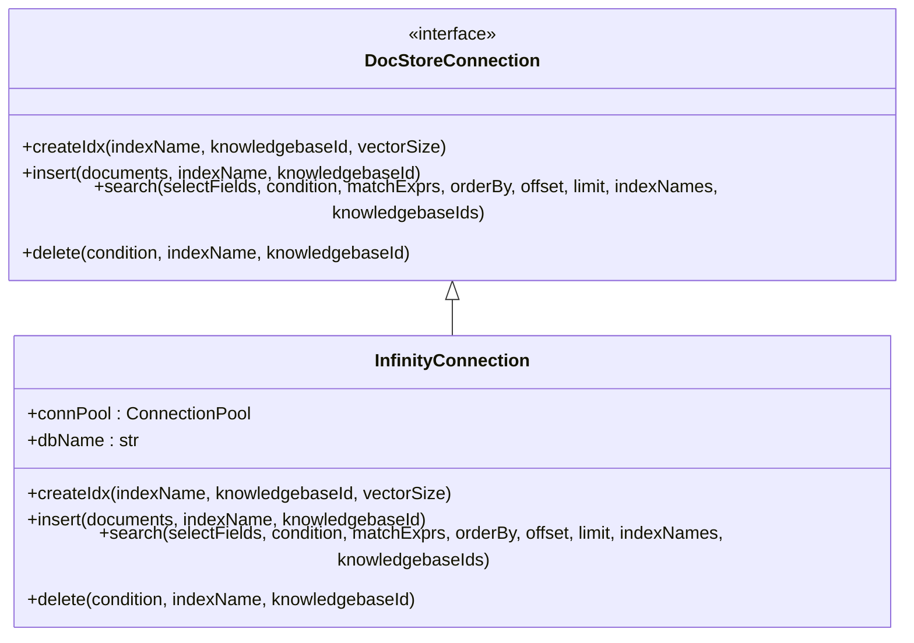
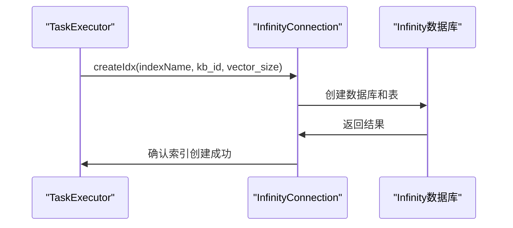

# 向量化与索引

<cite>
**本文档引用的文件**  
- [embedding_model.py](file://rag/llm/embedding_model.py)
- [document_service.py](file://api/db/services/document_service.py)
- [task_executor.py](file://rag/svr/task_executor.py)
- [infinity_conn.py](file://rag/utils/infinity_conn.py)
- [doc_store_conn.py](file://rag/utils/doc_store_conn.py)
- [infinity_mapping.json](file://conf/infinity_mapping.json)
</cite>

## 目录
1. [引言](#引言)
2. [向量化流程](#向量化流程)
3. [索引子系统](#索引子系统)
4. [性能调优指南](#性能调优指南)
5. [结论](#结论)

## 引言
本文档详细阐述了RAGFlow系统中向量化与索引子系统的核心机制。文档重点分析了`embedding_model.py`如何将文本块转换为向量表示，`document_service.py`如何触发向量化过程，`task_executor.py`在异步处理中的角色，以及`infinity_conn.py`如何与向量数据库交互。同时，文档还涵盖了嵌入模型选择、向量维度和索引类型对检索性能的影响。

## 向量化流程

### 文本向量化
`embedding_model.py`文件定义了多种嵌入模型的实现，这些模型负责将文本转换为向量表示。该模块通过抽象基类`Base`定义了统一的接口，包括`encode`和`encode_queries`方法，分别用于批量编码文本和编码查询。

系统支持多种嵌入模型提供商，包括OpenAI、Azure、百度千帆、智谱AI、Ollama等。每个具体的模型类（如`OpenAIEmbed`、`ZhipuEmbed`、`OllamaEmbed`）都继承自`Base`类，并实现了具体的编码逻辑。例如，`OpenAIEmbed`类使用OpenAI的API来生成嵌入向量，而`OllamaEmbed`则通过本地Ollama服务进行嵌入。

**Diagram sources**
- [embedding_model.py](file://rag/llm/embedding_model.py#L37-L300)

**Section sources**
- [embedding_model.py](file://rag/llm/embedding_model.py#L1-L931)

### 触发向量化过程
`document_service.py`文件中的`DocumentService`类负责管理文档的生命周期，并在文档上传或更新时触发向量化过程。当一个新文档被上传时，系统会创建一个任务并将其放入Redis队列中等待处理。

`DocumentService`类提供了多个方法来管理文档，包括`get_newly_uploaded`方法用于获取最近上传的文档，以及`begin2parse`方法用于标记文档开始解析。这些方法与任务调度系统协同工作，确保文档能够被正确地处理和索引。

**Diagram sources**
- [document_service.py](file://api/db/services/document_service.py#L342-L369)
- [task_executor.py](file://rag/svr/task_executor.py#L165-L218)

**Section sources**
- [document_service.py](file://api/db/services/document_service.py#L1-L1035)

### 异步任务处理
`task_executor.py`文件实现了异步任务处理的核心逻辑。该模块使用`asyncio`库来处理并发任务，并通过`Redis`作为消息队列来协调任务的分发和执行。

`TaskExecutor`的主要功能包括：
- 从Redis队列中消费任务
- 根据任务类型调用相应的处理函数
- 更新任务进度和状态
- 处理任务取消和异常情况

任务处理流程如下：首先，`collect`函数从Redis队列中获取待处理的任务；然后，`do_handle_task`函数根据任务类型调用相应的处理逻辑；最后，`handle_task`函数负责协调整个处理过程，并在完成后更新任务状态。

**Diagram sources**
- [task_executor.py](file://rag/svr/task_executor.py#L165-L218)

**Section sources**
- [task_executor.py](file://rag/svr/task_executor.py#L1-L1215)

## 索引子系统

### 向量数据库交互
`infinity_conn.py`文件实现了与Infinity向量数据库的交互。该模块通过`InfinityConnection`类提供了创建索引、插入数据、查询数据等操作。

`InfinityConnection`类实现了`DocStoreConnection`接口，确保了与不同文档存储后端的兼容性。该类的主要方法包括：
- `createIdx`: 创建新的索引
- `insert`: 插入文档数据
- `search`: 执行向量搜索
- `delete`: 删除文档

在创建索引时，系统会根据配置文件`infinity_mapping.json`中的定义来设置表结构。该文件定义了所有字段的类型和属性，包括向量字段的维度和索引类型。

**Diagram sources**
- [infinity_conn.py](file://rag/utils/infinity_conn.py#L175-L205)
- [doc_store_conn.py](file://rag/utils/doc_store_conn.py#L144-L272)

**Section sources**
- [infinity_conn.py](file://rag/utils/infinity_conn.py#L1-L939)

### 索引的创建、更新和查询
索引的创建过程由`init_kb`函数触发，该函数在处理文档任务时被调用。创建索引时，系统会根据嵌入模型的向量维度来确定向量字段的大小。

文档的更新通过`update`方法实现，该方法允许根据条件更新文档的元数据。查询操作则通过`search`方法完成，支持多种匹配表达式，包括文本匹配、向量匹配和融合匹配。

## 性能调优指南

### 嵌入模型选择
选择合适的嵌入模型对检索精度和速度有重要影响。不同的模型在向量维度、上下文长度和性能方面有所不同。例如，`BAAI/bge-m3`模型支持8000个token的上下文长度，而`BAAI/bge-small-en-v1.5`仅支持500个token。

### 向量维度
向量维度直接影响存储空间和计算复杂度。较高的维度通常能提供更好的语义表示，但也会增加存储和计算开销。系统会根据所选嵌入模型自动确定向量维度。

### 索引类型
系统使用HNSW（Hierarchical Navigable Small World）索引进行向量搜索。HNSW是一种高效的近似最近邻搜索算法，能够在大规模数据集上实现快速的向量检索。在`infinity_mapping.json`文件中，HNSW索引的参数被配置为：
- M: 16
- ef_construction: 50
- metric: cosine
- encode: lvq

这些参数可以在不影响系统稳定性的前提下进行微调，以优化检索性能。

## 结论
RAGFlow的向量化与索引子系统通过模块化设计实现了高效、灵活的文档处理能力。系统通过`embedding_model.py`支持多种嵌入模型，利用`document_service.py`和`task_executor.py`实现异步任务处理，并通过`infinity_conn.py`与向量数据库进行交互。这种架构设计不仅保证了系统的可扩展性，还为性能优化提供了充分的空间。