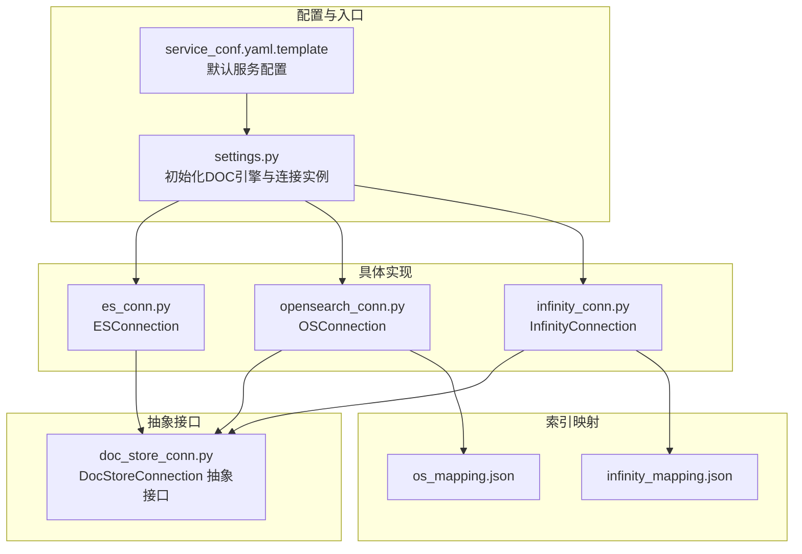
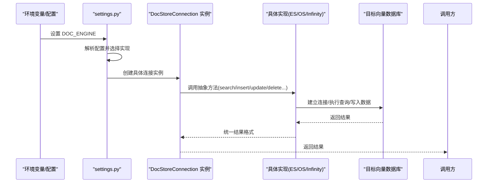
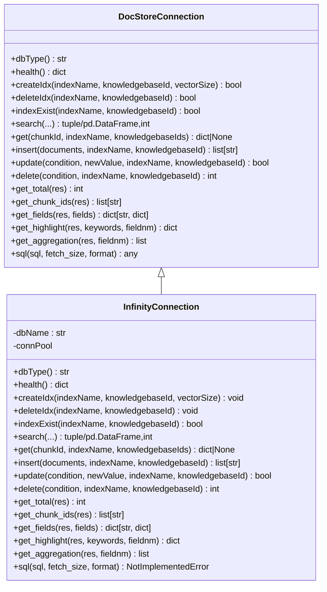
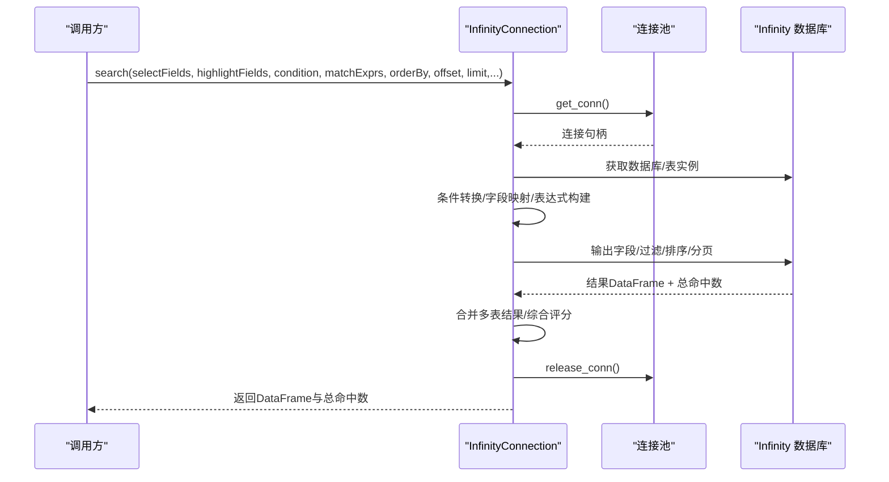
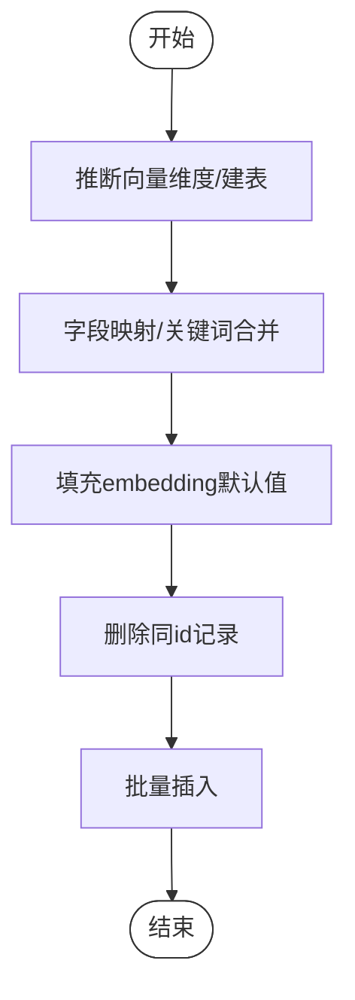
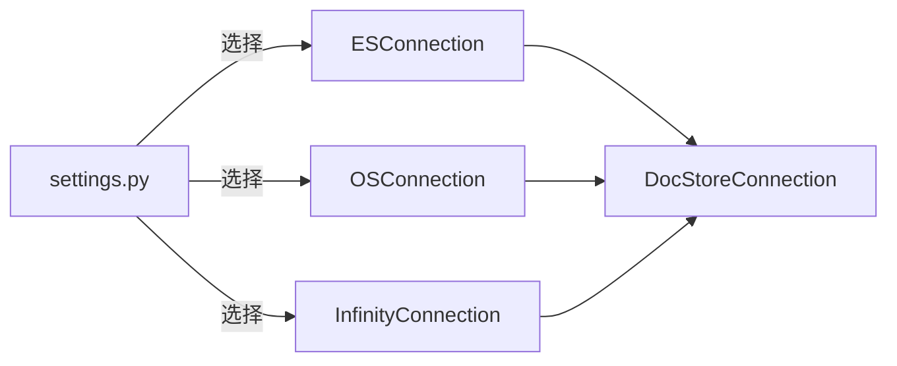

# 向量数据库连接

<cite>
**本文引用的文件列表**
- [infinity_conn.py](file://rag/utils/infinity_conn.py)
- [opensearch_conn.py](file://rag/utils/opensearch_conn.py)
- [es_conn.py](file://rag/utils/es_conn.py)
- [doc_store_conn.py](file://rag/utils/doc_store_conn.py)
- [settings.py](file://common/settings.py)
- [infinity_mapping.json](file://conf/infinity_mapping.json)
- [os_mapping.json](file://conf/os_mapping.json)
- [service_conf.yaml.template](file://docker/service_conf.yaml.template)
</cite>

## 目录
1. [简介](#简介)
2. [项目结构](#项目结构)
3. [核心组件](#核心组件)
4. [架构总览](#架构总览)
5. [详细组件分析](#详细组件分析)
6. [依赖关系分析](#依赖关系分析)
7. [性能考量](#性能考量)
8. [故障排查指南](#故障排查指南)
9. [结论](#结论)
10. [附录](#附录)

## 简介
本文件聚焦于向量数据库连接实现，重点解析 Infinity 向量数据库连接器（InfinityConnection），并对比 OpenSearch 与 Elasticsearch 的连接器，说明系统如何通过统一接口适配多种向量数据库后端。内容涵盖：
- InfinityConnection 如何建立连接、创建索引集合、执行向量插入、搜索与删除
- 多后端支持策略：ES、Infinity、OpenSearch、OceanBase
- 索引配置要点：向量维度、距离度量（余弦相似度、欧几里得）、索引算法（HNSW）
- 连接参数、性能调优与故障排查建议

## 项目结构
与向量数据库连接相关的核心代码位于 rag/utils 下，采用“抽象接口 + 具体实现”的分层设计：
- 抽象接口：DocStoreConnection 定义统一的数据库操作契约
- 具体实现：ESConnection、OSConnection、InfinityConnection 分别对接 Elasticsearch、OpenSearch、Infinity
- 配置来源：common/settings.py 根据环境变量选择具体实现；docker/service_conf.yaml.template 提供默认配置模板

图表来源
- [settings.py](file://common/settings.py#L240-L258)
- [doc_store_conn.py](file://rag/utils/doc_store_conn.py#L144-L272)
- [es_conn.py](file://rag/utils/es_conn.py#L42-L111)
- [opensearch_conn.py](file://rag/utils/opensearch_conn.py#L40-L77)
- [infinity_conn.py](file://rag/utils/infinity_conn.py#L174-L205)
- [infinity_mapping.json](file://conf/infinity_mapping.json#L1-L39)
- [os_mapping.json](file://conf/os_mapping.json#L1-L268)
- [service_conf.yaml.template](file://docker/service_conf.yaml.template#L1-L31)

章节来源
- [settings.py](file://common/settings.py#L240-L258)
- [doc_store_conn.py](file://rag/utils/doc_store_conn.py#L144-L272)

## 核心组件
- DocStoreConnection 抽象接口：定义数据库类型、健康检查、表级操作（创建/删除/存在性）、CRUD 操作、结果处理与 SQL 接口等
- ESConnection：基于 elasticsearch-py 与 elasticsearch-dsl，支持 KNN 查询、高亮、聚合、SQL
- OSConnection：基于 opensearch-py，支持 KNN 查询（DSL 层封装）、高亮、聚合、SQL
- InfinityConnection：基于 infinity-sdk，支持 HNSW 向量索引、全文索引、匹配文本/稠密向量/融合检索、排序与分页

章节来源
- [doc_store_conn.py](file://rag/utils/doc_store_conn.py#L144-L272)
- [es_conn.py](file://rag/utils/es_conn.py#L42-L111)
- [opensearch_conn.py](file://rag/utils/opensearch_conn.py#L40-L77)
- [infinity_conn.py](file://rag/utils/infinity_conn.py#L174-L205)

## 架构总览
系统通过环境变量选择文档引擎，settings 初始化对应连接实例；各连接器实现 DocStoreConnection 接口，统一对外提供搜索、插入、更新、删除等能力。

图表来源
- [settings.py](file://common/settings.py#L240-L258)
- [doc_store_conn.py](file://rag/utils/doc_store_conn.py#L144-L272)
- [es_conn.py](file://rag/utils/es_conn.py#L142-L272)
- [opensearch_conn.py](file://rag/utils/opensearch_conn.py#L131-L267)
- [infinity_conn.py](file://rag/utils/infinity_conn.py#L333-L509)

## 详细组件分析

### InfinityConnection：连接、索引与检索流程
- 连接与健康检查
  - 从 settings.INFINITY 读取 uri 与 db_name，使用连接池建立连接
  - 通过 show_current_node 检查节点状态，循环等待直至健康
  - 健康状态返回包含 type、status、error 字段
- 索引迁移与创建
  - 读取 conf/infinity_mapping.json，按字段类型动态添加列
  - 对 varchar 类型且带 analyzer 的字段，自动创建全文索引
  - createIdx 动态为 q_{vectorSize}_vec 添加向量列，并创建 HNSW 索引
- 插入/更新/删除
  - insert：推断向量维度，必要时自动建表；对关键词字段进行合并；对 embedding 列补默认值；先删除同 id 再批量插入
  - update：条件转换、字段映射、支持 remove 操作；对指定字段做增量更新
  - delete：根据条件生成过滤表达式并删除
- 搜索
  - 支持 MatchTextExpr、MatchDenseExpr、FusionExpr 三种表达式
  - 文本检索：filter_fulltext + minimum_should_match 转换
  - 向量检索：match_dense，支持 similarity/threshold 映射
  - 融合检索：weighted_sum 默认 normalize=atan
  - 排序：OrderByExpr 转换为升/降序
  - 结果：拼接多表结果，按 SCORE + pagerank_fea 综合打分排序

图表来源
- [doc_store_conn.py](file://rag/utils/doc_store_conn.py#L144-L272)
- [infinity_conn.py](file://rag/utils/infinity_conn.py#L174-L205)
- [infinity_conn.py](file://rag/utils/infinity_conn.py#L243-L308)
- [infinity_conn.py](file://rag/utils/infinity_conn.py#L333-L509)
- [infinity_conn.py](file://rag/utils/infinity_conn.py#L511-L766)
- [infinity_conn.py](file://rag/utils/infinity_conn.py#L771-L939)

章节来源
- [infinity_conn.py](file://rag/utils/infinity_conn.py#L174-L205)
- [infinity_conn.py](file://rag/utils/infinity_conn.py#L243-L308)
- [infinity_conn.py](file://rag/utils/infinity_conn.py#L333-L509)
- [infinity_conn.py](file://rag/utils/infinity_conn.py#L511-L766)
- [infinity_conn.py](file://rag/utils/infinity_conn.py#L771-L939)

### 搜索流程时序图（Infinity）

图表来源
- [infinity_conn.py](file://rag/utils/infinity_conn.py#L333-L509)

### 索引配置与参数
- Infinity
  - 向量维度：在 createIdx 中为 q_{vectorSize}_vec 动态添加向量列
  - 距离度量：HNSW 索引参数中包含 metric=cosine
  - 索引算法：HNSW（M、ef_construction、encode 等）
  - 全文索引：针对 varchar(analyzer) 字段自动创建 ft_* 索引
- OpenSearch
  - 向量维度：通过 dynamic_templates 匹配 *_vec 字段，按维度设置 kNN 向量字段
  - 距离度量：space_type=cosinesimil
  - 索引算法：KNN 查询由 SDK 封装（OpenSearch DSL）
- Elasticsearch
  - 向量维度：同上，*_vec 动态模板
  - 距离度量：通过 knn 接口传入 similarity 参数映射到阈值
  - 索引算法：KNN 查询由 SDK 封装

章节来源
- [infinity_conn.py](file://rag/utils/infinity_conn.py#L264-L306)
- [infinity_mapping.json](file://conf/infinity_mapping.json#L1-L39)
- [os_mapping.json](file://conf/os_mapping.json#L160-L257)
- [es_conn.py](file://rag/utils/es_conn.py#L203-L214)
- [opensearch_conn.py](file://rag/utils/opensearch_conn.py#L198-L210)

### 插入/更新/删除流程（以 Infinity 为例）
- 插入
  - 自动建表：若表不存在，根据第一条文档推断向量维度并创建
  - 字段映射：docnm_kwd/title_tks/title_sm_tks 等映射到 docnm；content_* 映射到 content；authors_* 映射到 authors；important_* 映射到 important_keywords；question_* 映射到 questions
  - 关键词字段合并：以 "###" 连接列表
  - embedding 列补默认值
  - 先删除同 id 再批量插入
- 更新
  - 条件转换：支持 exists/must_not 等
  - 字段映射与类型转换：位置字段转十六进制串；feas 字段 JSON 序列化；kb_id 规范化
  - remove 操作：对数组字段执行移除
- 删除
  - 生成过滤表达式并删除

图表来源
- [infinity_conn.py](file://rag/utils/infinity_conn.py#L537-L641)

章节来源
- [infinity_conn.py](file://rag/utils/infinity_conn.py#L537-L641)
- [infinity_conn.py](file://rag/utils/infinity_conn.py#L643-L750)
- [infinity_conn.py](file://rag/utils/infinity_conn.py#L752-L766)

### 多后端对比（ES/OpenSearch/Infinity）
- 连接建立
  - ES：Elasticsearch 客户端，健康检查通过 ping/info
  - OS：OpenSearch 客户端，健康检查 cluster.health
  - Infinity：连接池 + show_current_node
- 索引映射
  - ES/OS：通过 mapping.json/os_mapping.json 动态模板定义向量字段与维度
  - Infinity：通过 infinity_mapping.json 定义列类型与 analyzer
- 搜索能力
  - ES/OS：支持 query_string、knn、rank_feature、高亮、聚合
  - Infinity：match_text/match_dense/fusion，支持 score()/similarity() 与 pagerank 融合
- SQL
  - ES/OS：提供 sql.query 接口
  - Infinity：未实现 sql 方法

章节来源
- [es_conn.py](file://rag/utils/es_conn.py#L42-L111)
- [opensearch_conn.py](file://rag/utils/opensearch_conn.py#L40-L77)
- [infinity_conn.py](file://rag/utils/infinity_conn.py#L174-L205)
- [os_mapping.json](file://conf/os_mapping.json#L1-L268)
- [infinity_mapping.json](file://conf/infinity_mapping.json#L1-L39)

## 依赖关系分析
- DocStoreConnection 是所有连接器的父类，约束统一接口
- settings 根据 DOC_ENGINE 选择具体实现并注入连接实例
- 各连接器内部依赖各自 SDK（elasticsearch、opensearch、infinity）

图表来源
- [settings.py](file://common/settings.py#L240-L258)
- [doc_store_conn.py](file://rag/utils/doc_store_conn.py#L144-L272)
- [es_conn.py](file://rag/utils/es_conn.py#L42-L111)
- [opensearch_conn.py](file://rag/utils/opensearch_conn.py#L40-L77)
- [infinity_conn.py](file://rag/utils/infinity_conn.py#L174-L205)

章节来源
- [settings.py](file://common/settings.py#L240-L258)
- [doc_store_conn.py](file://rag/utils/doc_store_conn.py#L144-L272)

## 性能考量
- 连接池与重试
  - Infinity 使用 ConnectionPool 并在健康检查失败时重试
  - ES/OS 在超时或冲突时进行重试与连接重建
- 索引参数
  - Infinity HNSW：M、ef_construction、metric=cosine、encode=lvq
  - ES/OS：cosinesimil 空间类型；KNN 查询时可结合 filter 提升性能
- 查询优化
  - 文本检索 minimum_should_match 百分比转换
  - 融合检索 weighted_sum normalize=atan
  - 排序与分页 offset/limit 控制返回规模
- 批量写入
  - ES/OS 使用 bulk 接口；Infinity 先删除再批量插入，减少重复

章节来源
- [infinity_conn.py](file://rag/utils/infinity_conn.py#L174-L205)
- [es_conn.py](file://rag/utils/es_conn.py#L291-L328)
- [opensearch_conn.py](file://rag/utils/opensearch_conn.py#L288-L323)
- [infinity_conn.py](file://rag/utils/infinity_conn.py#L280-L306)

## 故障排查指南
- 连接失败
  - 检查 DOC_ENGINE 与对应配置是否正确加载
  - 查看健康检查日志：type/status/error
- 超时与重试
  - ES/OS：关注 ConnectionTimeout 与重试次数
  - Infinity：健康检查等待时间过长需检查网络与服务状态
- 索引问题
  - ES/OS：确认 mapping 中 *_vec 字段维度与实际 embedding 一致
  - Infinity：确认 q_{vectorSize}_vec 是否存在，HNSW 索引是否创建成功
- 查询异常
  - 文本检索 minimum_should_match 类型转换
  - 向量检索 similarity/threshold 映射
  - 融合检索权重与 normalize 参数
- 删除与更新
  - 条件转换错误会导致无匹配或误删，注意 exists/must_not 的使用

章节来源
- [settings.py](file://common/settings.py#L240-L258)
- [es_conn.py](file://rag/utils/es_conn.py#L249-L271)
- [opensearch_conn.py](file://rag/utils/opensearch_conn.py#L244-L267)
- [infinity_conn.py](file://rag/utils/infinity_conn.py#L333-L509)

## 结论
本系统通过 DocStoreConnection 抽象统一了多后端向量数据库的接入方式，InfinityConnection 在 HNSW 上实现了高效的稠密向量检索，并辅以全文索引与融合检索；ES/OS 提供成熟的 KNN 与 DSL 能力。通过合理的索引配置与连接参数，可在不同场景下取得良好的检索效果与吞吐表现。

## 附录

### 数据库连接参数与默认配置
- DOC_ENGINE：选择 elasticsearch、infinity、opensearch 或 oceanbase
- Infinity
  - uri：infinity:23817
  - db_name：default_db
- Elasticsearch
  - hosts：http://es01:9200
  - 用户名/密码：elastic/自定义
- OpenSearch
  - hosts：http://opensearch01:9201
  - 用户名/密码：admin/自定义
- OceanBase：通过配置项提供连接参数

章节来源
- [settings.py](file://common/settings.py#L240-L258)
- [service_conf.yaml.template](file://docker/service_conf.yaml.template#L20-L31)