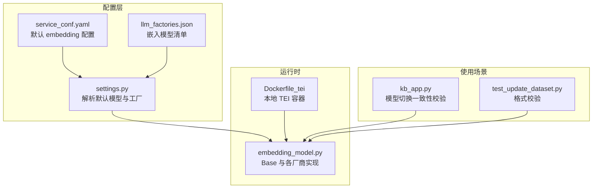
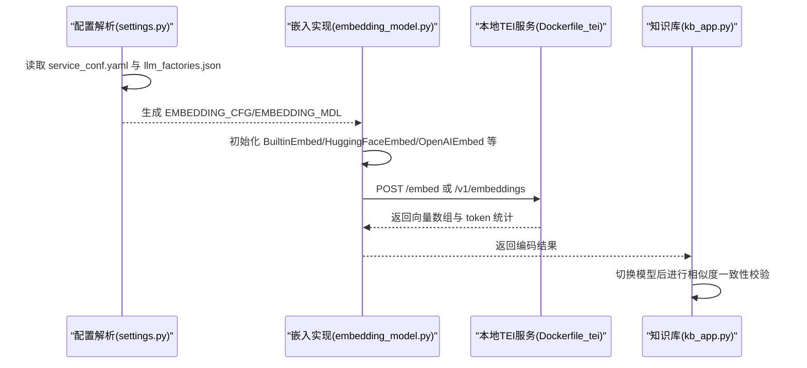
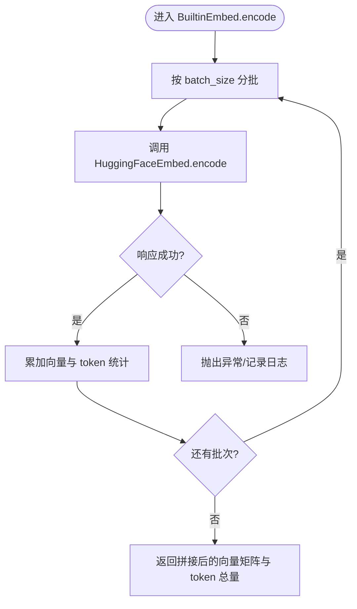
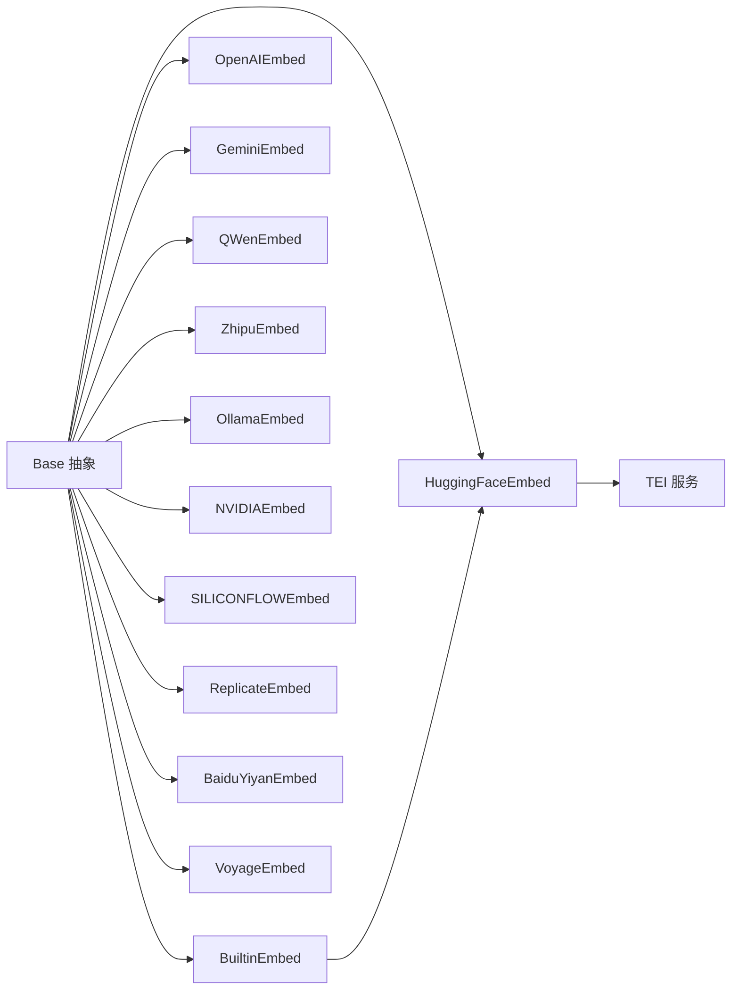

# 嵌入模型

<cite>
**本文引用的文件**
- [embedding_model.py](file://rag/llm/embedding_model.py)
- [settings.py](file://common/settings.py)
- [service_conf.yaml](file://conf/service_conf.yaml)
- [llm_factories.json](file://conf/llm_factories.json)
- [Dockerfile_tei](file://Dockerfile_tei)
- [kb_app.py](file://api/apps/kb_app.py)
- [test_update_dataset.py](file://test/testcases/test_sdk_api/test_dataset_mangement/test_update_dataset.py)
</cite>

## 目录
1. [简介](#简介)
2. [项目结构](#项目结构)
3. [核心组件](#核心组件)
4. [架构总览](#架构总览)
5. [详细组件分析](#详细组件分析)
6. [依赖关系分析](#依赖关系分析)
7. [性能考量](#性能考量)
8. [故障排查指南](#故障排查指南)
9. [结论](#结论)
10. [附录：配置与切换指南](#附录配置与切换指南)

## 简介
本文件围绕 RAGFlow 中的嵌入模型子系统进行深入解析，重点聚焦于 rag/llm/embedding_model.py 中的嵌入模型抽象与实现，解释其如何加载预训练文本嵌入模型（如 BGE、BERT 系列等），并把文本块（chunks）编码为高维向量；同时覆盖批处理推理机制、不同长度输入的处理策略、模型配置项（模型路径、最大序列长度、批处理大小）以及如何在配置文件中指定与切换不同嵌入模型。最后给出模型选择对语义检索质量与系统性能的影响分析与最佳实践建议。

## 项目结构
与嵌入模型直接相关的模块与配置如下：
- 模型实现层：rag/llm/embedding_model.py 提供统一的 Base 抽象与多种厂商/本地嵌入实现（如 OpenAI、HuggingFace、Gemini、Qwen、Zhipu、Ollama、NVIDIA、SiliconFlow、Replicate、BaiduYiyan、Voyage 等）。
- 配置解析层：common/settings.py 负责从服务配置中解析默认嵌入模型与工厂参数，并生成 EMBEDDING_CFG、EMBEDDING_MDL。
- 运行时配置：conf/service_conf.yaml 定义默认的 embedding_model 的 api_key、base_url 等。
- 工厂清单：conf/llm_factories.json 列举了可用的嵌入模型名称与类型，便于前端与后端识别。
- 本地 TEI 集成：Dockerfile_tei 展示了本地部署 Text Embeddings Inference（TEI）容器的方式与模型数据挂载。
- 使用场景校验：api/apps/kb_app.py 在知识库切换嵌入模型时进行相似度一致性校验；测试用例 test/testcases/test_sdk_api/test_dataset_mangement/test_update_dataset.py 对嵌入模型标识格式进行严格校验。

图表来源
- [settings.py](file://common/settings.py#L165-L210)
- [service_conf.yaml](file://conf/service_conf.yaml#L46-L51)
- [llm_factories.json](file://conf/llm_factories.json#L1-L200)
- [embedding_model.py](file://rag/llm/embedding_model.py#L72-L100)
- [Dockerfile_tei](file://Dockerfile_tei#L1-L14)
- [kb_app.py](file://api/apps/kb_app.py#L926-L938)
- [test_update_dataset.py](file://test/testcases/test_sdk_api/test_dataset_mangement/test_update_dataset.py#L205-L233)

章节来源
- [settings.py](file://common/settings.py#L165-L210)
- [service_conf.yaml](file://conf/service_conf.yaml#L46-L51)
- [llm_factories.json](file://conf/llm_factories.json#L1-L200)
- [embedding_model.py](file://rag/llm/embedding_model.py#L72-L100)
- [Dockerfile_tei](file://Dockerfile_tei#L1-L14)
- [kb_app.py](file://api/apps/kb_app.py#L926-L938)
- [test_update_dataset.py](file://test/testcases/test_sdk_api/test_dataset_mangement/test_update_dataset.py#L205-L233)

## 核心组件
- Base 抽象类：定义 encode(texts) 与 encode_queries(text) 接口，以及统一的 total_token_count(resp) 计数逻辑，确保各厂商实现的一致性。
- 多厂商实现：包括 OpenAIEmbed、GeminiEmbed、QWenEmbed、ZhipuEmbed、OllamaEmbed、NVIDIAEmbed、SILICONFLOWEmbed、ReplicateEmbed、BaiduYiyanEmbed、VoyageEmbed 等。
- 内置/本地实现：BuiltinEmbed 与 HuggingFaceEmbed，用于本地 TEI 或自建服务的嵌入调用。
- 批处理与截断：多数实现采用固定或可配置的 batch_size，并在必要时对输入进行 truncate 截断，避免超长文本导致的错误或性能问题。
- 全局配置：settings.py 解析 EMBEDDING_CFG、EMBEDDING_MDL，并支持通过环境变量覆盖 TEI 模型名。

章节来源
- [embedding_model.py](file://rag/llm/embedding_model.py#L37-L62)
- [embedding_model.py](file://rag/llm/embedding_model.py#L102-L156)
- [embedding_model.py](file://rag/llm/embedding_model.py#L515-L544)
- [embedding_model.py](file://rag/llm/embedding_model.py#L681-L734)
- [embedding_model.py](file://rag/llm/embedding_model.py#L736-L757)
- [embedding_model.py](file://rag/llm/embedding_model.py#L759-L790)
- [embedding_model.py](file://rag/llm/embedding_model.py#L792-L820)
- [embedding_model.py](file://rag/llm/embedding_model.py#L822-L847)
- [settings.py](file://common/settings.py#L198-L210)

## 架构总览
嵌入模型的调用链路如下：
- 配置解析：从 service_conf.yaml 与 llm_factories.json 获取默认 embedding_model 的 api_key、base_url、模型名等。
- 初始化：settings.py 将默认值解析为 EMBEDDING_CFG、EMBEDDING_MDL，并在需要时注入到具体实现中。
- 调用：业务侧根据场景选择合适的实现（如本地 TEI 的 BuiltinEmbed/HuggingFaceEmbed 或云端厂商接口），按 batch_size 分批发送请求，返回向量数组与 token 统计。
- 校验：在知识库切换嵌入模型时，系统会对比新旧向量空间的相似度，确保兼容性。

图表来源
- [settings.py](file://common/settings.py#L198-L210)
- [embedding_model.py](file://rag/llm/embedding_model.py#L72-L100)
- [embedding_model.py](file://rag/llm/embedding_model.py#L822-L847)
- [Dockerfile_tei](file://Dockerfile_tei#L1-L14)
- [kb_app.py](file://api/apps/kb_app.py#L926-L938)

## 详细组件分析

### Base 抽象与通用能力
- 接口约定：encode(texts) 与 encode_queries(text) 必须返回 numpy 数组与 token 统计；total_token_count(resp) 支持多 SDK 的响应结构。
- 设计意图：统一不同厂商/本地实现的返回格式，便于上层检索与计费统计。

章节来源
- [embedding_model.py](file://rag/llm/embedding_model.py#L37-L62)

### BuiltinEmbed 与 HuggingFaceEmbed（本地 TEI）
- 初始化流程：当检测到特定 COMPOSE_PROFILES（包含“tei-”）时，BuiltinEmbed 会在线程锁保护下创建全局共享的 HuggingFaceEmbed 实例，使用 settings.EMBEDDING_MDL 作为模型名，并从 settings.EMBEDDING_CFG 中读取 api_key 与 base_url。
- 编码流程：按固定 batch_size（如 16）分批调用底层 HuggingFaceEmbed.encode，累加 token 统计；对查询单独走 encode_queries。
- 输入处理：HuggingFaceEmbed.encode 直接向 TEI 服务的 /embed 接口 POST 文本列表，成功时返回向量数组与 token 总量。

图表来源
- [embedding_model.py](file://rag/llm/embedding_model.py#L72-L100)
- [embedding_model.py](file://rag/llm/embedding_model.py#L822-L847)

章节来源
- [embedding_model.py](file://rag/llm/embedding_model.py#L72-L100)
- [embedding_model.py](file://rag/llm/embedding_model.py#L822-L847)

### OpenAIEmbed 及兼容实现（OpenAI/API 兼容）
- OpenAIEmbed：限制 batch_size 不超过 16，对输入进行 truncate 截断，调用 embeddings 接口，返回向量数组与 token 统计。
- 兼容实现：LocalAIEmbed、GPUStackEmbed、TogetherAIEmbed、UpstageEmbed、PerfXCloudEmbed、OpenAI_APIEmbed 等均复用 OpenAI 客户端风格，仅在 base_url 与模型名拆分策略上略有差异。
- 令牌统计：优先从响应对象的 usage 字段提取 total_tokens，兼容字典结构 fallback。

章节来源
- [embedding_model.py](file://rag/llm/embedding_model.py#L102-L156)
- [embedding_model.py](file://rag/llm/embedding_model.py#L860-L896)
- [embedding_model.py](file://rag/llm/embedding_model.py#L603-L613)

### GeminiEmbed（Google）
- 限制：对输入进行 truncate 截断；按 batch_size 分批调用 embed_content，任务类型设置为 retrieval_document。
- 令牌统计：基于输入文本 token 数之和估算。

章节来源
- [embedding_model.py](file://rag/llm/embedding_model.py#L515-L544)

### QWenEmbed（DashScope）
- 特点：批量调用 TextEmbedding.call，对输出进行索引重排，保证顺序一致；支持重试机制；按 batch_size 分批。
- 令牌统计：从响应 meta 或 usage 字段提取 billed_units/input_tokens 或 total_tokens。

章节来源
- [embedding_model.py](file://rag/llm/embedding_model.py#L179-L225)

### ZhipuEmbed（Zhipu AI）
- 特点：根据模型名自动设置最大长度（如 embedding-2 为 512，embedding-3 为 3072），并对输入进行 truncate 截断。
- 令牌统计：从响应对象提取 total_tokens 或 billed_units。

章节来源
- [embedding_model.py](file://rag/llm/embedding_model.py#L227-L260)

### OllamaEmbed（本地 Ollama）
- 特点：移除特殊标记后调用 embeddings 接口，支持 keep_alive 与 mmap 选项；对每个文本单独请求，token 统计按固定值估算。
- 适用场景：本地离线部署，无需网络访问。

章节来源
- [embedding_model.py](file://rag/llm/embedding_model.py#L262-L296)

### NVIDIAEmbed（NVIDIA API）
- 特点：根据模型名调整 base_url 与模型别名；按 batch_size 分批 POST /embeddings，支持 truncate END。
- 令牌统计：从响应 meta.billed_units.input_tokens 提取。

章节来源
- [embedding_model.py](file://rag/llm/embedding_model.py#L546-L590)

### SILICONFLOWEmbed（SILICONFLOW）
- 特点：针对特定模型（如 BAAI/bge-large-zh-v1.5、BAAI/bge-large-en-v1.5）进行更严格的截断与空字符串处理；按 batch_size 分批请求。
- 令牌统计：从响应对象提取 total_tokens。

章节来源
- [embedding_model.py](file://rag/llm/embedding_model.py#L681-L734)

### ReplicateEmbed（Replicate）
- 特点：通过 client.run 调用模型，按 batch_size 分批；对查询走 embed 接口。
- 令牌统计：基于输入文本 token 数之和估算。

章节来源
- [embedding_model.py](file://rag/llm/embedding_model.py#L736-L757)

### BaiduYiyanEmbed（百度千帆）
- 特点：使用 qianfan.Embedding 客户端，按 batch_size 发送请求；从响应体提取向量与 token 统计。
- 令牌统计：从响应对象提取 total_tokens。

章节来源
- [embedding_model.py](file://rag/llm/embedding_model.py#L759-L790)

### VoyageEmbed（Voyage AI）
- 特点：使用 voyageai.Client，按 batch_size 分批；对查询设置 input_type 为 query。
- 令牌统计：从响应对象提取 total_tokens。

章节来源
- [embedding_model.py](file://rag/llm/embedding_model.py#L792-L820)

### 配置与初始化要点
- 配置来源：service_conf.yaml 中的 user_default_llm.default_models.embedding_model 提供 api_key 与 base_url；llm_factories.json 提供可用模型清单。
- 解析逻辑：settings.py 读取默认模型条目，解析为 EMBEDDING_CFG 与 EMBEDDING_MDL，并在 BuiltinEmbed 初始化时注入 TEI 模型名与 base_url。
- 环境变量覆盖：settings.py 支持通过 TEI_MODEL 覆盖默认模型名。

章节来源
- [service_conf.yaml](file://conf/service_conf.yaml#L46-L51)
- [llm_factories.json](file://conf/llm_factories.json#L1-L200)
- [settings.py](file://common/settings.py#L198-L210)
- [settings.py](file://common/settings.py#L212-L215)
- [embedding_model.py](file://rag/llm/embedding_model.py#L72-L83)

## 依赖关系分析
- 组件耦合：
  - BuiltinEmbed 与 HuggingFaceEmbed：前者负责在 TEI 场景下的单例化与批处理聚合，后者负责与 TEI 服务的直接通信。
  - 多厂商实现共享 Base 接口，降低上层调用复杂度。
- 外部依赖：
  - TEI 容器：Dockerfile_tei 展示了镜像与数据挂载方式，以及 /embed 与 /v1/embeddings 的调用示例。
  - 各云厂商 SDK：OpenAI、Gemini、DashScope、Zhipu、Mistral、Bedrock、NVIDIA、Replicate、Baidu、Voyage 等。
- 循环依赖：未发现循环导入；各实现独立继承 Base 并通过组合调用外部服务。

图表来源
- [embedding_model.py](file://rag/llm/embedding_model.py#L37-L62)
- [embedding_model.py](file://rag/llm/embedding_model.py#L72-L100)
- [embedding_model.py](file://rag/llm/embedding_model.py#L822-L847)
- [Dockerfile_tei](file://Dockerfile_tei#L1-L14)

章节来源
- [embedding_model.py](file://rag/llm/embedding_model.py#L37-L62)
- [embedding_model.py](file://rag/llm/embedding_model.py#L72-L100)
- [embedding_model.py](file://rag/llm/embedding_model.py#L822-L847)
- [Dockerfile_tei](file://Dockerfile_tei#L1-L14)

## 性能考量
- 批处理大小：
  - 多数实现默认 batch_size=16，部分厂商（如 OpenAI）要求不超过 16；batch 太小会增加网络往返次数，过大可能触发限流或内存压力。
- 序列长度控制：
  - 多处实现对输入进行 truncate 截断（如 OpenAI 8191、Gemini 2048、Qwen 2048、Zhipu 根据模型名设定上限、SILICONFLOW 对特定模型截断至 256），避免超长文本导致错误或性能退化。
- 令牌统计：
  - 统一通过 total_token_count(resp) 从响应对象提取，便于计费与成本控制；部分本地实现（如 LocalAIEmbed、OllamaEmbed）采用估算值。
- 本地 TEI：
  - TEI 支持自动截断与高效推理，适合大规模向量化；结合 Dockerfile_tei 的数据挂载与端口暴露，便于快速部署与验证。
- 线程安全与单例：
  - BuiltinEmbed 使用线程锁保护全局模型实例，避免并发初始化带来的资源竞争。

章节来源
- [embedding_model.py](file://rag/llm/embedding_model.py#L102-L156)
- [embedding_model.py](file://rag/llm/embedding_model.py#L515-L544)
- [embedding_model.py](file://rag/llm/embedding_model.py#L681-L734)
- [embedding_model.py](file://rag/llm/embedding_model.py#L72-L100)
- [Dockerfile_tei](file://Dockerfile_tei#L1-L14)

## 故障排查指南
- 常见错误与定位：
  - TEI 服务不可达：检查 service_conf.yaml 中的 base_url 是否正确，确认 Dockerfile_tei 的端口映射与容器状态。
  - 模型名不匹配：llm_factories.json 中列出的 embedding 模型名需与实际 TEI 模型一致；BuiltinEmbed 初始化时会使用 settings.EMBEDDING_MDL。
  - 输入过长：若出现超长报错，检查各实现的 truncate 截断逻辑是否生效；必要时减小 batch_size 或缩短单条文本。
  - 令牌统计缺失：确认各 SDK 的响应结构是否包含 usage 或 billed_units 字段；否则将回退为 0 或估算值。
- 切换模型一致性校验：
  - 知识库切换嵌入模型时，系统会计算新旧向量之间的余弦相似度，若平均相似度低于阈值（例如 0.9），则判定向量空间不兼容并拒绝切换，提示用户重新评估模型选择。
- 单元测试校验：
  - 测试用例对嵌入模型标识格式进行严格校验，要求遵循 “<模型名>@<提供商>” 格式且不能为空白，确保配置正确性。

章节来源
- [kb_app.py](file://api/apps/kb_app.py#L926-L938)
- [test_update_dataset.py](file://test/testcases/test_sdk_api/test_dataset_mangement/test_update_dataset.py#L205-L233)
- [embedding_model.py](file://rag/llm/embedding_model.py#L72-L100)
- [llm_factories.json](file://conf/llm_factories.json#L1-L200)
- [service_conf.yaml](file://conf/service_conf.yaml#L46-L51)

## 结论
RAGFlow 的嵌入模型体系通过统一的 Base 抽象与多厂商/本地实现，提供了灵活、可扩展的向量化能力。BuiltinEmbed/HuggingFaceEmbed 在 TEI 场景下实现了高效的批处理与单例化管理；各厂商实现遵循统一接口，便于在不同供应商之间切换。通过合理的 batch_size、截断策略与令牌统计，系统在保证检索质量的同时兼顾性能与成本。在知识库层面，系统还提供了模型切换的一致性校验，确保向量空间的稳定性。

## 附录：配置与切换指南

### 如何在配置文件中指定嵌入模型
- 默认嵌入模型配置：
  - 在 conf/service_conf.yaml 的 user_default_llm.default_models.embedding_model 中设置 api_key 与 base_url。
  - 示例片段路径：[service_conf.yaml](file://conf/service_conf.yaml#L46-L51)
- 模型清单与类型：
  - 在 conf/llm_factories.json 中查看可用的 TEXT EMBEDDING 类型模型名称，确保与 TEI 或云端服务一致。
  - 示例片段路径：[llm_factories.json](file://conf/llm_factories.json#L1-L200)
- 设置解析与覆盖：
  - settings.py 会解析默认模型条目为 EMBEDDING_CFG/EMBEDDING_MDL，并支持通过 TEI_MODEL 环境变量覆盖默认模型名。
  - 示例片段路径：[settings.py](file://common/settings.py#L198-L210)、[settings.py](file://common/settings.py#L212-L215)

章节来源
- [service_conf.yaml](file://conf/service_conf.yaml#L46-L51)
- [llm_factories.json](file://conf/llm_factories.json#L1-L200)
- [settings.py](file://common/settings.py#L198-L210)
- [settings.py](file://common/settings.py#L212-L215)

### 如何切换不同嵌入模型
- 本地 TEI 模型切换：
  - 在 settings.py 中设置 EMBEDDING_MDL 为 TEI 支持的模型名（如 BAAI/bge-small-en-v1.5、BAAI/bge-m3、Qwen/Qwen3-Embedding-0.6B 等）。
  - Dockerfile_tei 展示了 TEI 镜像与数据挂载方式，确保模型权重已下载并挂载到容器内。
  - 示例片段路径：[Dockerfile_tei](file://Dockerfile_tei#L1-L14)
- 云端厂商模型切换：
  - 在 service_conf.yaml 中修改 embedding_model 的 api_key/base_url，或在 settings.py 中通过工厂与 API_KEY、BASE_URL 参数覆盖。
  - 示例片段路径：[service_conf.yaml](file://conf/service_conf.yaml#L46-L51)、[settings.py](file://common/settings.py#L198-L210)
- 知识库模型切换校验：
  - 切换时系统会进行向量空间一致性校验，若相似度低于阈值（如 0.9），将拒绝切换并提示兼容性问题。
  - 示例片段路径：[kb_app.py](file://api/apps/kb_app.py#L926-L938)

章节来源
- [Dockerfile_tei](file://Dockerfile_tei#L1-L14)
- [service_conf.yaml](file://conf/service_conf.yaml#L46-L51)
- [settings.py](file://common/settings.py#L198-L210)
- [kb_app.py](file://api/apps/kb_app.py#L926-L938)

### 模型选择对语义检索质量与系统性能的影响
- 检索质量：
  - 更大/更强的模型通常带来更高的语义表征能力，但需权衡延迟与成本。
  - 对于中文场景，BAAI/bge 系列与 Qwen/Qwen3-Embedding-0.6B 等在中文检索中表现良好。
- 性能与成本：
  - batch_size 与序列长度截断直接影响吞吐与延迟；合理设置可提升整体效率。
  - 本地 TEI 可显著降低网络开销，适合大规模向量化；云端模型需考虑 API 速率限制与计费。
- 一致性与迁移：
  - 切换模型后必须进行向量空间一致性校验，避免检索结果大幅波动。

章节来源
- [kb_app.py](file://api/apps/kb_app.py#L926-L938)
- [embedding_model.py](file://rag/llm/embedding_model.py#L681-L734)
- [embedding_model.py](file://rag/llm/embedding_model.py#L515-L544)
- [embedding_model.py](file://rag/llm/embedding_model.py#L102-L156)