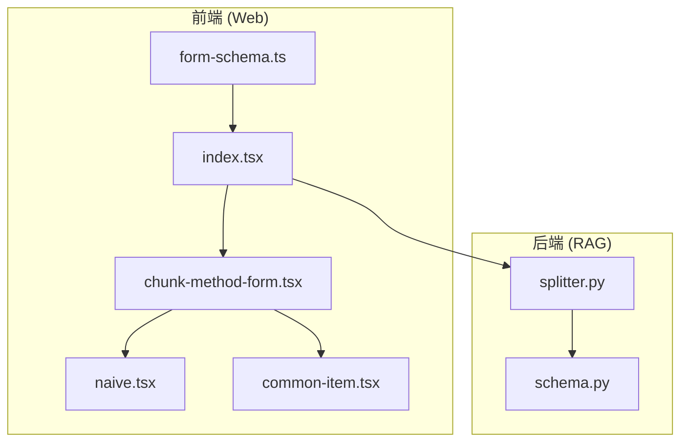
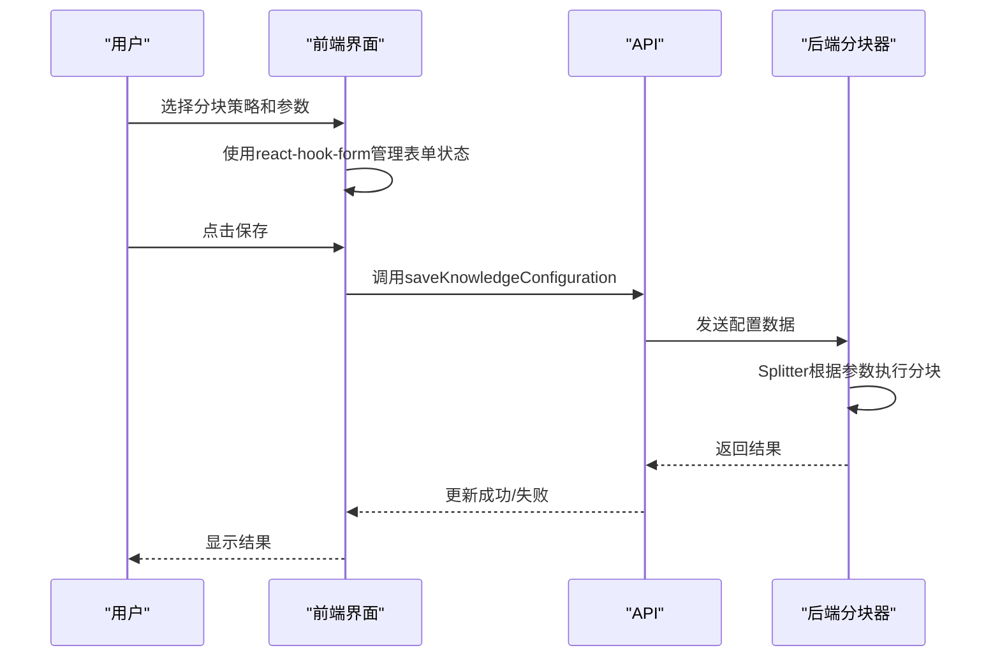
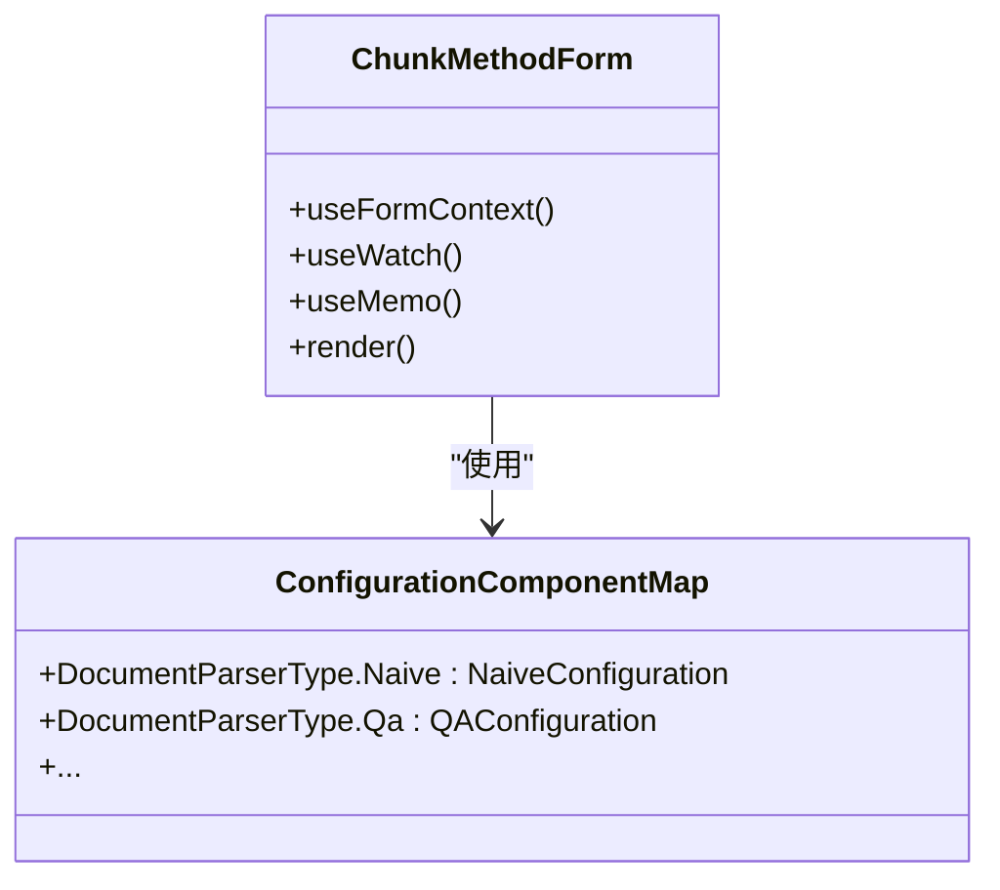
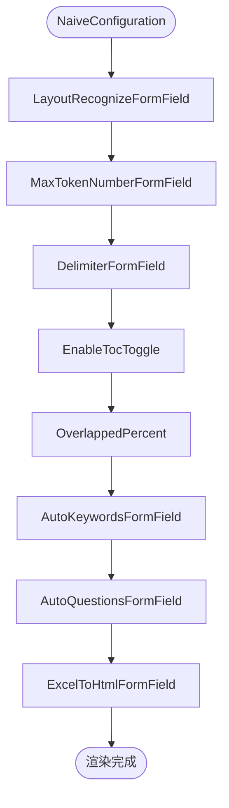
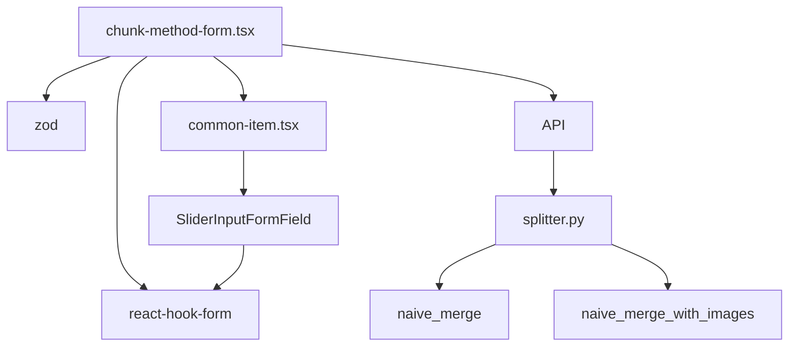

# 前端分块配置

<cite>
**本文档中引用的文件**  
- [chunk-method-form.tsx](file://web/src/pages/dataset/dataset-setting/chunk-method-form.tsx)
- [naive.tsx](file://web/src/pages/dataset/dataset-setting/configuration/naive.tsx)
- [common-item.tsx](file://web/src/pages/dataset/dataset-setting/configuration/common-item.tsx)
- [index.tsx](file://web/src/pages/dataset/dataset-setting/index.tsx)
- [form-schema.ts](file://web/src/pages/dataset/dataset-setting/form-schema.ts)
- [splitter.py](file://rag/flow/splitter/splitter.py)
- [schema.py](file://rag/flow/splitter/schema.py)
- [max-token-number-from-field.tsx](file://web/src/components/max-token-number-from-field.tsx)
- [slider-input-form-field.tsx](file://web/src/components/slider-input-form-field.tsx)
- [saving-button.tsx](file://web/src/pages/dataset/dataset-setting/saving-button.tsx)
- [use-knowledge-request.ts](file://web/src/hooks/use-knowledge-request.ts)
</cite>

## 目录
1. [简介](#简介)
2. [项目结构](#项目结构)
3. [核心组件](#核心组件)
4. [架构概述](#架构概述)
5. [详细组件分析](#详细组件分析)
6. [依赖分析](#依赖分析)
7. [性能考虑](#性能考虑)
8. [故障排除指南](#故障排除指南)
9. [结论](#结论)
10. [附录](#附录)（如有必要）

## 简介
本文档详细分析了RAGFlow系统中前端分块配置界面的实现机制。重点阐述了`chunk-method-form.tsx`组件如何为用户提供分块策略（如固定大小、语义分块）和参数（如块大小、重叠量）的可视化配置。文档描述了表单数据如何通过API传递至后端`splitter.py`以影响实际的分块行为，并说明了不同配置选项的UI设计逻辑及其背后的技术含义。最后提供了用户操作指南，帮助理解各项配置对最终分块结果的影响，确保用户能根据文档类型和使用场景选择最优配置。

## 项目结构
前端分块配置功能主要位于`web/src/pages/dataset/dataset-setting/`目录下，由多个组件协同工作。核心配置表单`chunk-method-form.tsx`根据用户选择的解析器类型动态渲染不同的配置组件。后端分块逻辑则由`rag/flow/splitter/`目录下的`splitter.py`实现。



**图源**
- [chunk-method-form.tsx](file://web/src/pages/dataset/dataset-setting/chunk-method-form.tsx)
- [naive.tsx](file://web/src/pages/dataset/dataset-setting/configuration/naive.tsx)
- [splitter.py](file://rag/flow/splitter/splitter.py)

**节源**
- [chunk-method-form.tsx](file://web/src/pages/dataset/dataset-setting/chunk-method-form.tsx)
- [index.tsx](file://web/src/pages/dataset/dataset-setting/index.tsx)

## 核心组件
核心组件包括`ChunkMethodForm`，它根据`parser_id`动态选择并渲染相应的配置组件。`NaiveConfiguration`组件提供了基础分块策略的配置选项，如块大小、分隔符和重叠百分比。`Splitter`类在后端负责执行实际的分块操作，其行为由前端传递的参数控制。

**节源**
- [chunk-method-form.tsx](file://web/src/pages/dataset/dataset-setting/chunk-method-form.tsx#L43-L64)
- [splitter.py](file://rag/flow/splitter/splitter.py#L47-L161)

## 架构概述
系统采用前后端分离架构。前端通过React Hook Form管理配置表单的状态和验证。用户在界面上选择分块策略和参数，这些数据通过`useUpdateKnowledge`钩子提交到后端API。后端的`Splitter`组件接收这些配置，并根据`SplitterParam`中的参数执行分块逻辑。



**图源**
- [chunk-method-form.tsx](file://web/src/pages/dataset/dataset-setting/chunk-method-form.tsx)
- [saving-button.tsx](file://web/src/pages/dataset/dataset-setting/saving-button.tsx)
- [use-knowledge-request.ts](file://web/src/hooks/use-knowledge-request.ts)
- [splitter.py](file://rag/flow/splitter/splitter.py)

## 详细组件分析
### ChunkMethodForm 分析
`ChunkMethodForm`是分块配置的核心入口组件。它使用`useWatch`监听`parser_id`的变化，并通过`ConfigurationComponentMap`映射到相应的配置组件。



**图源**
- [chunk-method-form.tsx](file://web/src/pages/dataset/dataset-setting/chunk-method-form.tsx#L43-L64)
- [knowledge.ts](file://web/src/constants/knowledge.ts#L78-L94)

**节源**
- [chunk-method-form.tsx](file://web/src/pages/dataset/dataset-setting/chunk-method-form.tsx)

### NaiveConfiguration 分析
`NaiveConfiguration`组件为"基础"分块策略提供配置界面，允许用户设置块大小、重叠量等关键参数。



**图源**
- [naive.tsx](file://web/src/pages/dataset/dataset-setting/configuration/naive.tsx#L15-L34)
- [common-item.tsx](file://web/src/pages/dataset/dataset-setting/configuration/common-item.tsx)

**节源**
- [naive.tsx](file://web/src/pages/dataset/dataset-setting/configuration/naive.tsx)

### 分块参数配置逻辑
`MaxTokenNumberFormField`和`OverlappedPercent`等组件使用`SliderInputFormField`提供直观的滑块输入，允许用户精确控制分块参数。

```mermaid
classDiagram
class MaxTokenNumberFormField {
+max : number
+initialValue : number
+render()
}
class SliderInputFormField {
+max : number
+min : number
+step : number
+name : string
+label : string
+render()
}
MaxTokenNumberFormField --> SliderInputFormField : "使用"
SliderInputFormField --> "react-hook-form" : "集成"
```

**图源**
- [max-token-number-from-field.tsx](file://web/src/components/max-token-number-from-field.tsx#L10-L23)
- [slider-input-form-field.tsx](file://web/src/components/slider-input-form-field.tsx#L31-L103)

**节源**
- [max-token-number-from-field.tsx](file://web/src/components/max-token-number-from-field.tsx)
- [common-item.tsx](file://web/src/pages/dataset/dataset-setting/configuration/common-item.tsx)

## 依赖分析
前端配置组件依赖于`react-hook-form`进行表单状态管理，依赖`zod`进行表单验证。后端分块器依赖于`naive_merge`和`naive_merge_with_images`等NLP工具函数来执行实际的文本分块。前后端通过REST API进行通信。



**图源**
- [form-schema.ts](file://web/src/pages/dataset/dataset-setting/form-schema.ts)
- [splitter.py](file://rag/flow/splitter/splitter.py)
- [slider-input-form-field.tsx](file://web/src/components/slider-input-form-field.tsx)

**节源**
- [form-schema.ts](file://web/src/pages/dataset/dataset-setting/form-schema.ts)
- [splitter.py](file://rag/flow/splitter/splitter.py)

## 性能考虑
分块大小（`chunk_token_size`）直接影响检索性能和上下文完整性。较小的块大小可以提高检索精度但可能丢失上下文，较大的块大小则相反。重叠百分比（`overlapped_percent`）可以缓解上下文断裂问题，但会增加存储和计算开销。建议根据文档类型和查询需求进行权衡。

## 故障排除指南
- **分块后内容不完整**：检查`chunk_token_size`是否过小，或`overlapped_percent`是否需要增加。
- **配置无法保存**：检查表单验证是否通过，特别是必填字段如`parser_id`和`embd_id`。
- **分块结果不符合预期**：确认选择的解析器类型（`parser_id`）与文档类型匹配。

**节源**
- [splitter.py](file://rag/flow/splitter/splitter.py#L30-L42)
- [form-schema.ts](file://web/src/pages/dataset/dataset-setting/form-schema.ts)

## 结论
RAGFlow的前端分块配置界面提供了一个灵活且用户友好的方式来控制文档分块行为。通过将前端UI配置与后端分块逻辑解耦，系统实现了高度的可配置性和可扩展性。用户可以根据具体的应用场景选择合适的分块策略和参数，以优化检索效果。

## 附录
### 配置参数映射表
| 前端配置项 | 后端参数 | 默认值 | 说明 |
| :--- | :--- | :--- | :--- |
| 块大小 | `chunk_token_size` | 512 | 每个文本块的最大token数 |
| 分隔符 | `delimiters` | `\n` | 用于分割文本的字符 |
| 重叠百分比 | `overlapped_percent` | 0 | 相邻块之间的重叠比例 |
| 目录提取 | `toc_extraction` | false | 是否尝试提取文档目录 |

**节源**
- [splitter.py](file://rag/flow/splitter/splitter.py#L33-L35)
- [naive.tsx](file://web/src/pages/dataset/dataset-setting/configuration/naive.tsx)