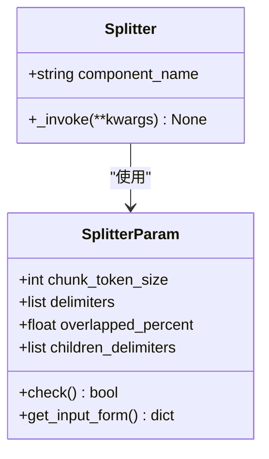
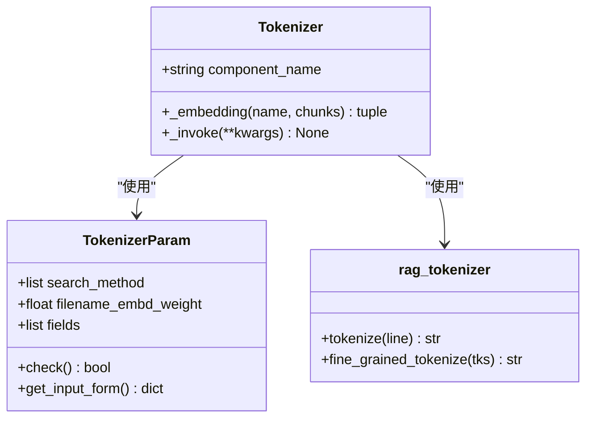
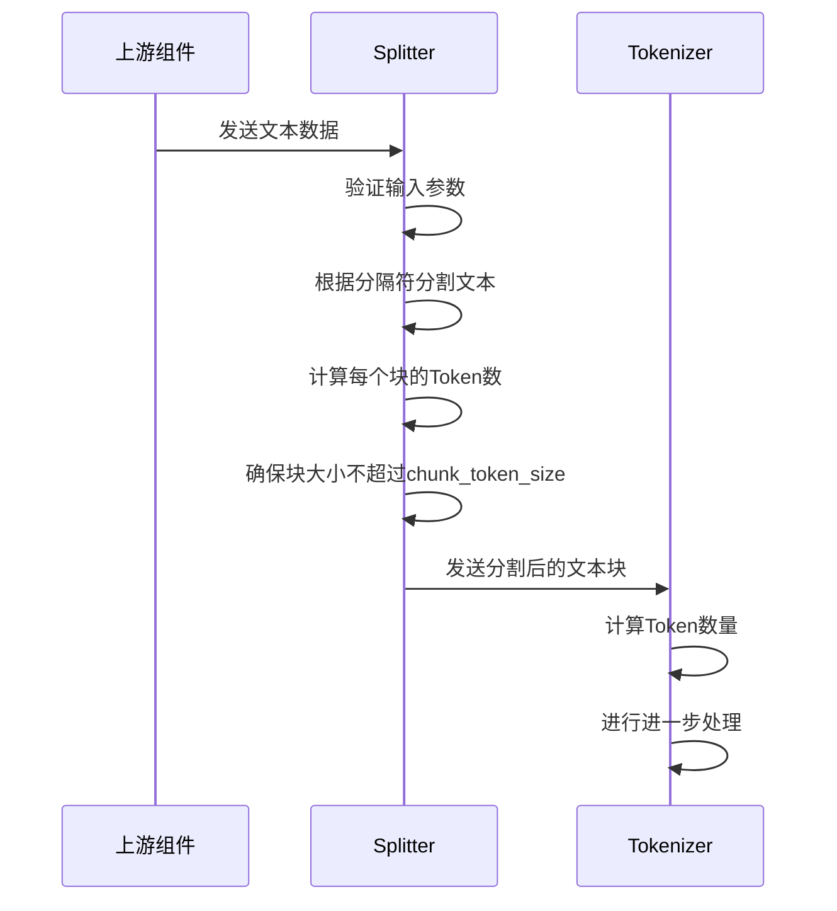
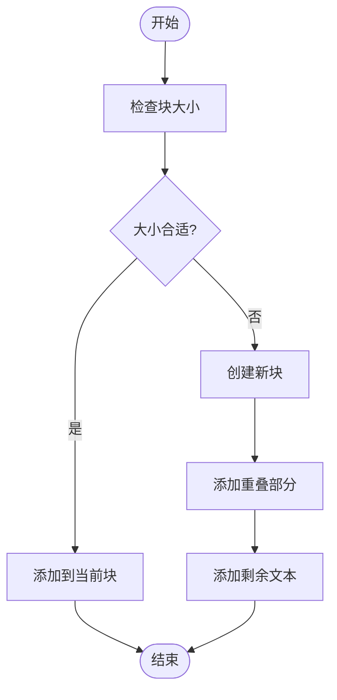

# 固定大小分块

<cite>
**本文档中引用的文件**  
- [splitter.py](file://rag/flow/splitter/splitter.py)
- [tokenizer.py](file://rag/flow/tokenizer/tokenizer.py)
- [schema.py](file://rag/flow/splitter/schema.py)
- [schema.py](file://rag/flow/tokenizer/schema.py)
- [rag_tokenizer.py](file://rag/nlp/rag_tokenizer.py)
- [__init__.py](file://rag/nlp/__init__.py)
- [token_utils.py](file://common/token_utils.py)
</cite>

## 目录
1. [引言](#引言)
2. [核心组件](#核心组件)
3. [分块策略实现](#分块策略实现)
4. [Token计算机制](#token计算机制)
5. [执行流程分析](#执行流程分析)
6. [重叠与边界处理](#重叠与边界处理)
7. [优缺点分析](#优缺点分析)
8. [适用场景](#适用场景)

## 引言
固定大小分块策略是RAGFlow系统中用于将文档分割成固定Token数或字符数块的核心方法。该策略通过`splitter.py`和`tokenizer.py`两个核心模块实现，能够根据LLM上下文窗口限制进行均匀的文本分割。本文档详细解释了该策略的实现原理、执行流程和应用场景。

## 核心组件

固定大小分块策略主要由两个核心组件构成：`Splitter`和`Tokenizer`。`Splitter`负责根据预设的Token数或字符数对文本进行分割，而`Tokenizer`则负责计算文本的Token数量并进行进一步处理。

**Section sources**
- [splitter.py](file://rag/flow/splitter/splitter.py#L30-L161)
- [tokenizer.py](file://rag/flow/tokenizer/tokenizer.py#L35-L181)

## 分块策略实现

固定大小分块策略的实现主要在`splitter.py`文件中，通过`Splitter`类和`SplitterParam`类完成。`SplitterParam`类定义了分块的参数，包括`chunk_token_size`（块的Token大小）、`delimiters`（分隔符）和`overlapped_percent`（重叠百分比）。

**Diagram sources**
- [splitter.py](file://rag/flow/splitter/splitter.py#L30-L46)
- [splitter.py](file://rag/flow/splitter/splitter.py#L47-L161)

**Section sources**
- [splitter.py](file://rag/flow/splitter/splitter.py#L30-L161)

## Token计算机制

Token计算机制在`tokenizer.py`文件中实现，通过`Tokenizer`类和`rag_tokenizer`模块完成。`rag_tokenizer`模块使用`tiktoken`库来计算文本的Token数量，这是确定文本块大小的关键。

**Diagram sources**
- [tokenizer.py](file://rag/flow/tokenizer/tokenizer.py#L35-L48)
- [tokenizer.py](file://rag/flow/tokenizer/tokenizer.py#L50-L181)
- [rag_tokenizer.py](file://rag/nlp/rag_tokenizer.py#L21-L43)

**Section sources**
- [tokenizer.py](file://rag/flow/tokenizer/tokenizer.py#L35-L181)
- [rag_tokenizer.py](file://rag/nlp/rag_tokenizer.py#L1-L43)

## 执行流程分析

固定大小分块策略的执行流程如下：首先，`Splitter`接收来自上游组件的文本数据；然后，根据预设的参数对文本进行分割；最后，将分割后的文本块传递给下游组件。整个流程通过`_invoke`方法实现。

**Diagram sources**
- [splitter.py](file://rag/flow/splitter/splitter.py#L50-L161)
- [tokenizer.py](file://rag/flow/tokenizer/tokenizer.py#L106-L181)

**Section sources**
- [splitter.py](file://rag/flow/splitter/splitter.py#L50-L161)
- [tokenizer.py](file://rag/flow/tokenizer/tokenizer.py#L106-L181)

## 重叠与边界处理

在分块过程中，为了保持语义的完整性，系统支持块之间的重叠。重叠百分比由`overlapped_percent`参数控制。当一个块的Token数接近`chunk_token_size`时，系统会将部分文本重叠到下一个块中，以确保关键信息不会被割裂。

**Diagram sources**
- [splitter.py](file://rag/flow/splitter/splitter.py#L85-L90)
- [__init__.py](file://rag/nlp/__init__.py#L787-L843)

**Section sources**
- [splitter.py](file://rag/flow/splitter/splitter.py#L85-L90)
- [__init__.py](file://rag/nlp/__init__.py#L787-L843)

## 优缺点分析

固定大小分块策略具有实现简单、易于理解的优点，但也存在可能割裂语义完整性的缺点。由于该策略是基于固定的Token数或字符数进行分割，因此在处理复杂文档时可能会将一个完整的语义单元分割到不同的块中。

**Section sources**
- [splitter.py](file://rag/flow/splitter/splitter.py#L30-L161)
- [tokenizer.py](file://rag/flow/tokenizer/tokenizer.py#L35-L181)

## 适用场景

固定大小分块策略适用于处理结构化文档或作为基准分块方法。对于格式较为规整的文档，如技术文档、法律文件等，该策略能够有效地将文档分割成大小均匀的块，便于后续的处理和分析。

**Section sources**
- [splitter.py](file://rag/flow/splitter/splitter.py#L30-L161)
- [tokenizer.py](file://rag/flow/tokenizer/tokenizer.py#L35-L181)