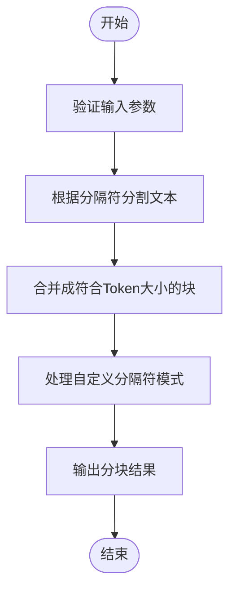
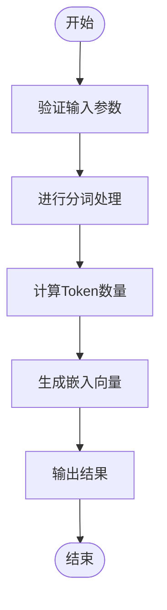

# 文档分块

<cite>
**本文档中引用的文件**  
- [splitter.py](file://rag/flow/splitter/splitter.py)
- [tokenizer.py](file://rag/flow/tokenizer/tokenizer.py)
- [rag_tokenizer.py](file://rag/nlp/rag_tokenizer.py)
- [schema.py](file://rag/flow/splitter/schema.py)
- [schema.py](file://rag/flow/tokenizer/schema.py)
- [nlp/__init__.py](file://rag/nlp/__init__.py)
</cite>

## 目录
1. [引言](#引言)
2. [分块策略](#分块策略)
3. [Splitter组件分析](#splitter组件分析)
4. [Tokenizer组件分析](#tokenizer组件分析)
5. [前端配置选项](#前端配置选项)
6. [分块策略对RAG系统性能的影响](#分块策略对rag系统性能的影响)
7. [不同类型文档的最佳实践](#不同类型文档的最佳实践)
8. [结论](#结论)

## 引言
文档分块是RAG（检索增强生成）系统中的关键环节，它将解析后的长文本分割成适合检索的小块。合理的分块策略能够显著提升检索的准确性和效率。本文将深入分析RAGFlow项目中的文档分块子系统，重点阐述`Splitter`组件如何实现文本分割，`tokenizer.py`在计算Token和文本分割中的作用，以及前端配置选项如何影响后端处理。

## 分块策略
文档分块策略主要包括基于Token数量、字符数或语义边界（如标题）的分块。这些策略的选择直接影响RAG系统的性能和检索效果。

### 基于Token数量的分块
基于Token数量的分块是最常见的策略之一。通过设置固定的Token大小，将文本分割成大小相近的块。这种方法能够确保每个块的处理复杂度相对均衡，适用于大多数场景。

### 基于字符数的分块
基于字符数的分块则是按照字符数量进行分割。这种方法简单直观，但在处理不同语言和编码时可能会遇到问题，尤其是在中文等非拉丁语系语言中。

### 基于语义边界的分块
基于语义边界的分块利用标题、段落等结构信息进行分割。这种方法能够保持文本的语义完整性，避免将一个完整的句子或段落拆分到不同的块中，从而提高检索的相关性。

## Splitter组件分析
`Splitter`组件负责将解析后的长文本分割成适合检索的小块。其核心功能在`splitter.py`文件中实现。

### Splitter参数配置
`SplitterParam`类定义了分块所需的参数，包括：
- `chunk_token_size`：每个块的Token大小，默认为512。
- `delimiters`：分隔符列表，默认为换行符。
- `overlapped_percent`：重叠百分比，用于控制相邻块之间的重叠程度。

### 分块流程
`Splitter`组件的分块流程如下：
1. 验证输入参数的有效性。
2. 根据指定的分隔符对文本进行初步分割。
3. 使用`naive_merge`函数将初步分割的文本合并成符合Token大小要求的块。
4. 处理自定义分隔符模式，进一步细化分块结果。

**图源**
- [splitter.py](file://rag/flow/splitter/splitter.py#L30-L161)

**节源**
- [splitter.py](file://rag/flow/splitter/splitter.py#L30-L161)
- [schema.py](file://rag/flow/splitter/schema.py#L1-L39)

## Tokenizer组件分析
`Tokenizer`组件负责计算Token并进行文本分割，其核心功能在`tokenizer.py`文件中实现。

### Tokenizer参数配置
`TokenizerParam`类定义了分词所需的参数，包括：
- `search_method`：搜索方法，支持全文搜索和嵌入搜索。
- `filename_embd_weight`：文件名嵌入权重。
- `fields`：需要处理的字段列表。

### 分词流程
`Tokenizer`组件的分词流程如下：
1. 验证输入参数的有效性。
2. 根据指定的搜索方法进行分词处理。
3. 计算每个块的Token数量，并生成相应的嵌入向量。

**图源**
- [tokenizer.py](file://rag/flow/tokenizer/tokenizer.py#L35-L181)

**节源**
- [tokenizer.py](file://rag/flow/tokenizer/tokenizer.py#L35-L181)
- [schema.py](file://rag/flow/tokenizer/schema.py#L1-L54)

## 前端配置选项
前端通过`chunk-method-form.tsx`暴露分块配置选项，用户可以在界面上调整分块参数，这些选项直接影响后端的处理逻辑。

### 配置选项说明
- **分块大小**：用户可以设置每个块的Token大小，影响分块的粒度。
- **分隔符**：用户可以选择不同的分隔符，如换行符、句号等，影响文本的分割方式。
- **重叠百分比**：用户可以设置相邻块之间的重叠程度，有助于保持上下文的连贯性。

### 配置选项的影响
前端配置选项通过API传递给后端，后端根据这些配置进行相应的分块处理。合理的配置能够显著提升系统的性能和用户体验。

## 分块策略对RAG系统性能的影响
不同的分块策略对RAG系统的性能有着显著影响。以下是几种常见策略的影响分析：

### 固定大小分块
固定大小分块能够保证每个块的处理时间相对均衡，但可能导致语义断裂，影响检索的相关性。

### 滑动窗口分块
滑动窗口分块通过设置重叠区域，能够在一定程度上缓解语义断裂的问题，但会增加存储和计算开销。

### 基于标题的分块
基于标题的分块能够保持文本的语义完整性，提高检索的相关性，但可能造成块大小不均，影响处理效率。

## 不同类型文档的最佳实践
针对不同类型文档，应采用不同的分块策略以达到最佳效果。

### 技术手册
技术手册通常具有清晰的章节结构，建议采用基于标题的分块策略，保持每个章节的完整性。

### 研究论文
研究论文包含大量的图表和公式，建议采用滑动窗口分块策略，确保关键信息不被截断。

## 结论
文档分块是RAG系统中的重要环节，合理的分块策略能够显著提升系统的性能和检索效果。通过对`Splitter`组件和`tokenizer.py`的深入分析，我们可以更好地理解分块机制，并根据实际需求选择合适的分块策略。未来的工作可以进一步优化分块算法，提高系统的智能化水平。