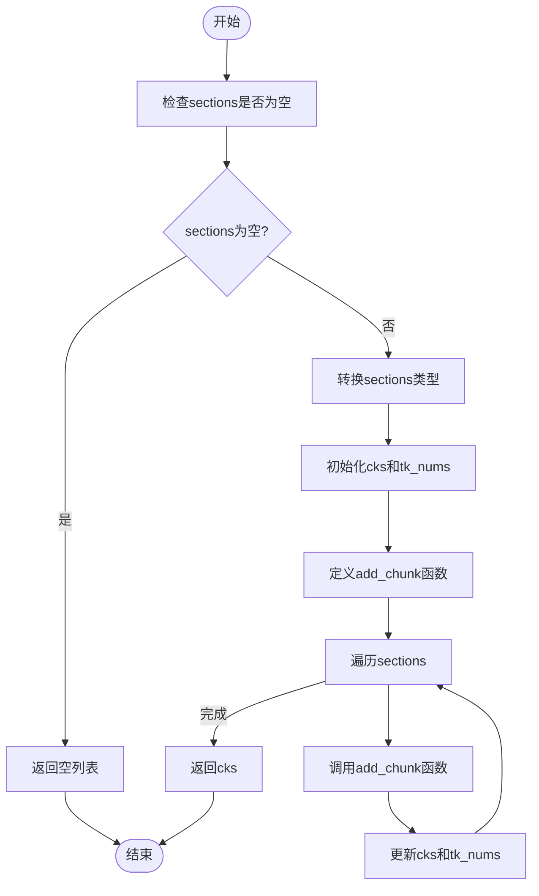

# 滑动窗口分块

<cite>
**本文档引用文件**   
- [splitter.py](file://rag/flow/splitter/splitter.py)
- [tokenizer.py](file://rag/flow/tokenizer/tokenizer.py)
- [schema.py](file://rag/flow/splitter/schema.py)
- [schema.py](file://rag/flow/tokenizer/schema.py)
- [__init__.py](file://rag/nlp/__init__.py)
</cite>

## 目录
1. [引言](#引言)
2. [滑动窗口分块策略实现机制](#滑动窗口分块策略实现机制)
3. [参数配置与重叠比例影响](#参数配置与重叠比例影响)
4. [算法遍历与文本块生成](#算法遍历与文本块生成)
5. [处理长篇幅文档的有效性分析](#处理长篇幅文档的有效性分析)
6. [存储与计算成本分析](#存储与计算成本分析)

## 引言
滑动窗口分块策略是一种在自然语言处理和信息检索中广泛使用的文本分割方法。该策略通过设置步长（stride）让相邻文本块产生重叠，以缓解固定分块导致的上下文割裂问题。在RAGFlow项目中，`splitter.py`文件实现了这一策略，通过滑动窗口算法对文本进行分块处理。同时，`tokenizer.py`文件在计算窗口大小和步长时起到了关键作用。本文将详细说明`splitter.py`中滑动窗口算法的实现机制，解释`tokenizer.py`的作用，提供参数配置建议，并分析该策略在处理长篇幅、上下文依赖强的文档时的有效性及其带来的存储和计算成本增加。

## 滑动窗口分块策略实现机制

滑动窗口分块策略的核心思想是通过设置步长（stride）让相邻文本块产生重叠，以缓解固定分块导致的上下文割裂问题。在RAGFlow项目中，`splitter.py`文件实现了这一策略。具体来说，`SplitterParam`类定义了分块参数，包括`chunk_token_size`（块的token大小）、`delimiters`（分隔符）和`overlapped_percent`（重叠百分比）。`Splitter`类的`_invoke`方法负责执行分块操作，它首先从上游获取数据，然后根据分隔符和重叠百分比将文本分割成多个块。

**Section sources**
- [splitter.py](file://rag/flow/splitter/splitter.py#L30-L45)
- [splitter.py](file://rag/flow/splitter/splitter.py#L50-L161)

## 参数配置与重叠比例影响

在`SplitterParam`类中，`chunk_token_size`参数定义了每个文本块的token大小，`delimiters`参数定义了用于分割文本的分隔符，`overlapped_percent`参数定义了相邻文本块之间的重叠百分比。这些参数的配置对检索召回率和精度有重要影响。例如，较大的`chunk_token_size`可以包含更多的上下文信息，但可能导致检索效率降低；较高的`overlapped_percent`可以缓解上下文割裂问题，但会增加存储和计算成本。

**Section sources**
- [splitter.py](file://rag/flow/splitter/splitter.py#L33-L36)
- [splitter.py](file://rag/flow/splitter/splitter.py#L85-L90)

## 算法遍历与文本块生成

`naive_merge`函数是滑动窗口算法的核心实现。该函数首先检查输入的`sections`是否为空，然后根据`sections`的类型进行处理。如果`sections`是字符串，则将其转换为列表；如果`sections`是字符串列表，则将其转换为元组列表。接着，函数初始化`cks`（文本块列表）和`tk_nums`（token数量列表），并定义`add_chunk`函数用于添加文本块。`add_chunk`函数根据`overlapped_percent`参数决定是否将当前文本块与前一个文本块重叠。最后，函数遍历`sections`，将每个文本块添加到`cks`中，并返回生成的文本块列表。

**Diagram sources **
- [__init__.py](file://rag/nlp/__init__.py#L787-L843)

**Section sources**
- [__init__.py](file://rag/nlp/__init__.py#L787-L843)

## 处理长篇幅文档的有效性分析

滑动窗口分块策略在处理长篇幅、上下文依赖强的文档时表现出较高的有效性。通过设置适当的`chunk_token_size`和`overlapped_percent`，可以确保每个文本块包含足够的上下文信息，从而提高检索召回率和精度。此外，该策略还可以通过调整分隔符来适应不同类型的文档，如Markdown、HTML等。然而，该策略也存在一些局限性，如对存储和计算资源的需求较高，特别是在处理大规模文档时。

**Section sources**
- [splitter.py](file://rag/flow/splitter/splitter.py#L85-L90)
- [__init__.py](file://rag/nlp/__init__.py#L787-L843)

## 存储与计算成本分析

滑动窗口分块策略虽然能有效缓解上下文割裂问题，但也会带来存储和计算成本的增加。具体来说，较高的`overlapped_percent`会导致更多的文本块被生成，从而增加存储空间的需求。同时，由于每个文本块都需要进行tokenization和embedding计算，因此计算成本也会相应增加。为了平衡效果和成本，建议根据具体应用场景选择合适的参数配置。例如，在对检索精度要求较高的场景中，可以适当提高`overlapped_percent`；而在对存储和计算资源有限制的场景中，则应降低`overlapped_percent`。

**Section sources**
- [splitter.py](file://rag/flow/splitter/splitter.py#L35-L36)
- [tokenizer.py](file://rag/flow/tokenizer/tokenizer.py#L53-L104)