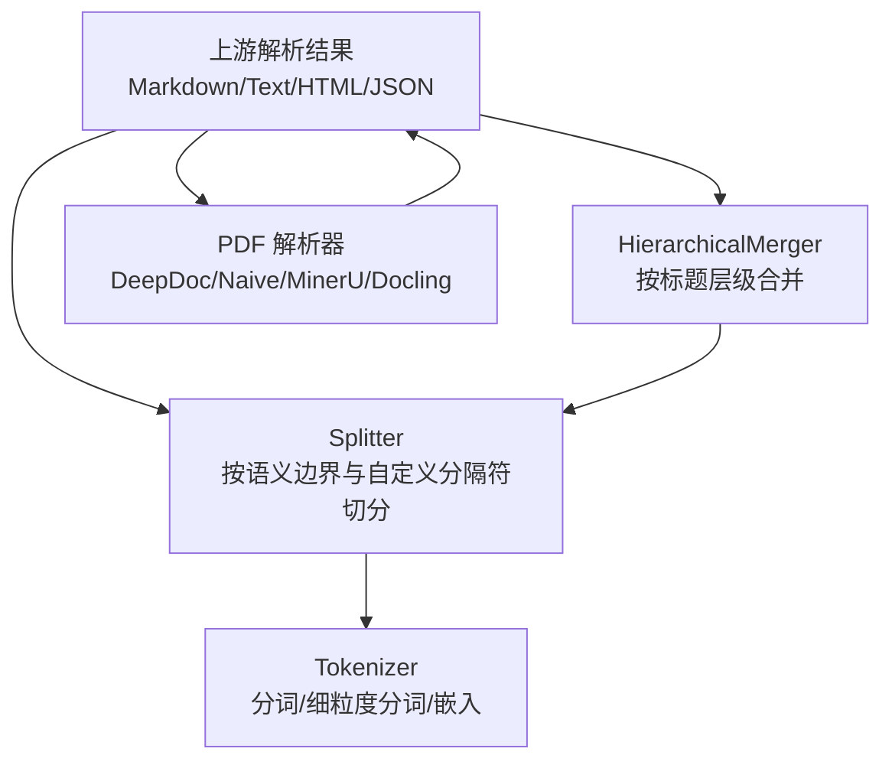
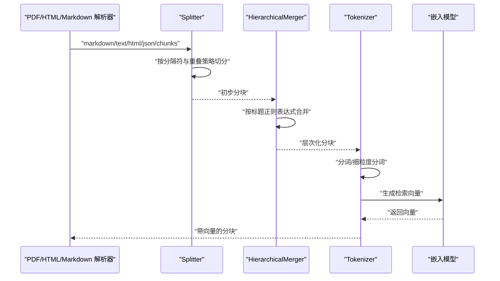
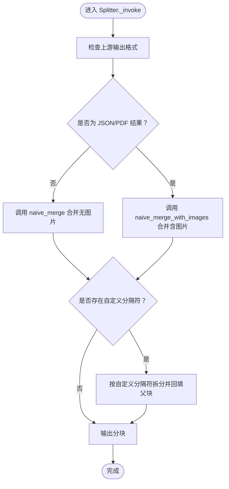
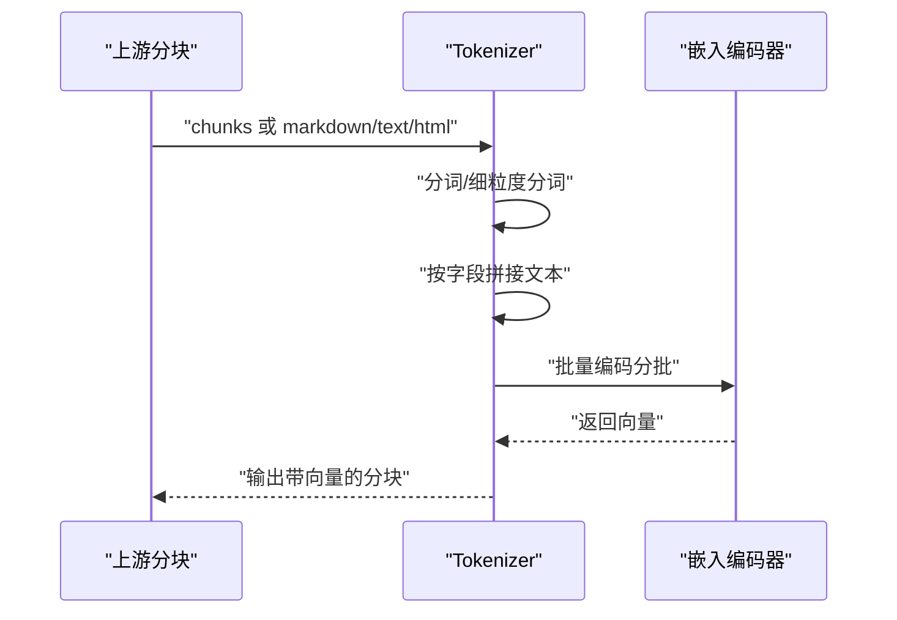
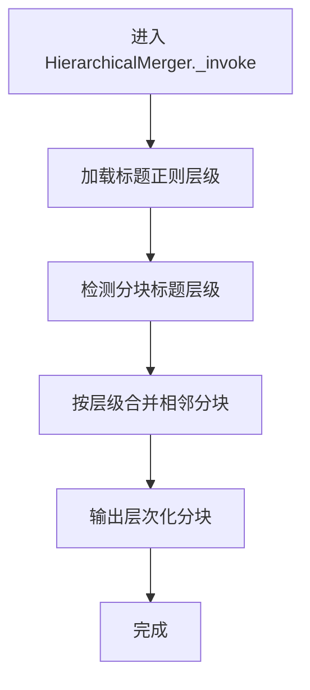
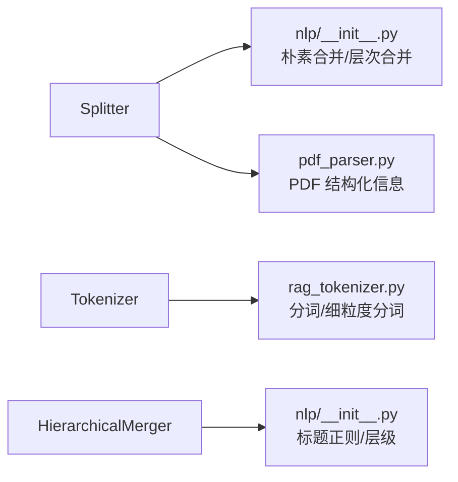

# 语义分块

<cite>
**本文引用的文件**
- [splitter.py](file://rag/flow/splitter/splitter.py)
- [tokenizer.py](file://rag/flow/tokenizer/tokenizer.py)
- [select_pdf_parser.md](file://docs/guides/dataset/select_pdf_parser.md)
- [pdf_parser.py](file://deepdoc/parser/pdf_parser.py)
- [rag_tokenizer.py](file://rag/nlp/rag_tokenizer.py)
- [nlp/__init__.py](file://rag/nlp/__init__.py)
- [schema.py（Splitter）](file://rag/flow/splitter/schema.py)
- [schema.py（Tokenizer）](file://rag/flow/tokenizer/schema.py)
- [hierarchical_merger.py](file://rag/flow/hierarchical_merger/hierarchical_merger.py)
- [toc_from_text_system.md](file://rag/prompts/toc_from_text_system.md)
- [title_chunker.json](file://agent/templates/title_chunker.json)
</cite>

## 目录
1. [引言](#引言)
2. [项目结构](#项目结构)
3. [核心组件](#核心组件)
4. [架构总览](#架构总览)
5. [详细组件分析](#详细组件分析)
6. [依赖关系分析](#依赖关系分析)
7. [性能考量](#性能考量)
8. [故障排查指南](#故障排查指南)
9. [结论](#结论)
10. [附录](#附录)

## 引言
本文件围绕 RAGFlow 的“语义分块”策略展开，重点解释以下内容：
- splitter 如何利用文档的语义结构（标题层级、段落边界）进行更智能的文本分割；
- tokenizer 如何借助语言模型能力（分词与细粒度分词）识别语义断点并增强检索向量；
- 结合 select_pdf_parser 文档，说明不同 PDF 解析器（DeepDoc、Naive、MinerU、Docling 等）提取的结构化信息如何影响语义分块效果；
- 提供基于标题的分块案例，展示如何保持上下文连贯性；
- 讨论该策略在提升检索准确率方面的优势及计算开销。

## 项目结构
与语义分块直接相关的核心模块包括：
- 分块组件：rag/flow/splitter/splitter.py
- 标题/层次合并：rag/flow/hierarchical_merger/hierarchical_merger.py
- 令牌化与嵌入：rag/flow/tokenizer/tokenizer.py
- PDF 解析与布局：deepdoc/parser/pdf_parser.py
- NLP 工具与标题模式：rag/nlp/__init__.py、rag/nlp/rag_tokenizer.py
- 模型输入/输出 Schema：rag/flow/splitter/schema.py、rag/flow/tokenizer/schema.py
- 文档指南：docs/guides/dataset/select_pdf_parser.md
- 检索提示与模板：rag/prompts/toc_from_text_system.md、agent/templates/title_chunker.json

图示来源
- [splitter.py](file://rag/flow/splitter/splitter.py#L47-L161)
- [tokenizer.py](file://rag/flow/tokenizer/tokenizer.py#L50-L181)
- [hierarchical_merger.py](file://rag/flow/hierarchical_merger/hierarchical_merger.py#L46-L120)
- [pdf_parser.py](file://deepdoc/parser/pdf_parser.py#L1040-L1200)

章节来源
- [splitter.py](file://rag/flow/splitter/splitter.py#L47-L161)
- [tokenizer.py](file://rag/flow/tokenizer/tokenizer.py#L50-L181)
- [hierarchical_merger.py](file://rag/flow/hierarchical_merger/hierarchical_merger.py#L46-L120)
- [pdf_parser.py](file://deepdoc/parser/pdf_parser.py#L1040-L1200)

## 核心组件
- Splitter：根据输出格式（markdown/text/html/json/chunks）选择不同的切分策略，支持自定义分隔符与重叠百分比，并在 PDF 场景下对图片位置信息进行处理。
- Tokenizer：对分块进行分词与细粒度分词，生成检索向量，支持“全文检索”和“嵌入检索”两种模式。
- HierarchicalMerger：基于标题正则表达式对分块进行层次化合并，形成更贴近文档结构的语义单元。
- PDF 解析器：提供布局、表格、图像等结构化信息，为语义分块提供基础文本与位置标签。
- NLP 工具：内置标题/编号模式匹配、层次合并算法、朴素合并等，支撑 Splitter 与 HierarchicalMerger 的语义判断。

章节来源
- [schema.py（Splitter）](file://rag/flow/splitter/schema.py#L20-L39)
- [schema.py（Tokenizer）](file://rag/flow/tokenizer/schema.py#L20-L54)
- [splitter.py](file://rag/flow/splitter/splitter.py#L47-L161)
- [tokenizer.py](file://rag/flow/tokenizer/tokenizer.py#L50-L181)
- [hierarchical_merger.py](file://rag/flow/hierarchical_merger/hierarchical_merger.py#L46-L120)
- [nlp/__init__.py](file://rag/nlp/__init__.py#L169-L201)
- [nlp/__init__.py](file://rag/nlp/__init__.py#L696-L786)

## 架构总览
下面以序列图展示从解析到语义分块再到检索向量生成的整体流程。

图示来源
- [splitter.py](file://rag/flow/splitter/splitter.py#L72-L160)
- [hierarchical_merger.py](file://rag/flow/hierarchical_merger/hierarchical_merger.py#L49-L120)
- [tokenizer.py](file://rag/flow/tokenizer/tokenizer.py#L106-L181)

## 详细组件分析

### Splitter 组件：基于语义边界的智能切分
- 输入格式校验：支持 markdown、text、html、json、chunks 等多种上游输出格式。
- 切分策略：
  - 对于非 PDF 的纯文本/HTML/markdown，使用“朴素合并”算法，按自定义分隔符与换行符进行切分，并可配置重叠百分比以保留上下文连续性。
  - 对于 PDF 的 JSON 结果，Splitter 调用“朴素合并（含图片）”，在切分时保留图片与位置信息，便于后续检索定位。
- 自定义分隔符：支持通过参数传入子分隔符列表，内部会构建优先级排序的正则模式，先按最长匹配拆分，再逐段回填，确保标题/章节等语义边界不被截断。
- 图像处理：在 PDF 场景下，对每个分块提取位置坐标并进行图片拼接，同时移除标签，保证向量维度一致。

图示来源
- [splitter.py](file://rag/flow/splitter/splitter.py#L72-L160)
- [nlp/__init__.py](file://rag/nlp/__init__.py#L787-L914)

章节来源
- [splitter.py](file://rag/flow/splitter/splitter.py#L47-L161)
- [nlp/__init__.py](file://rag/nlp/__init__.py#L787-L914)
- [schema.py（Splitter）](file://rag/flow/splitter/schema.py#L20-L39)

### Tokenizer 组件：语言模型能力辅助语义断点识别
- 功能概述：
  - 支持“全文检索”和“嵌入检索”两种模式，可按字段拼接生成待编码文本。
  - 使用 RagTokenizer 进行分词与细粒度分词，生成“title_tks”、“content_ltks”、“content_sm_ltks”等键，用于检索与排序。
  - 嵌入阶段支持批量编码与令牌计数统计，权重融合标题与内容向量，提升检索准确性。
- 语义断点识别：
  - 通过分词与细粒度分词，将长句拆分为更易检索的片段，有助于在检索时识别语义断点。
  - 将标题、问题、关键词、摘要等信息纳入向量空间，使检索更贴合文档主题与意图。

图示来源
- [tokenizer.py](file://rag/flow/tokenizer/tokenizer.py#L106-L181)
- [rag_tokenizer.py](file://rag/nlp/rag_tokenizer.py#L21-L43)

章节来源
- [tokenizer.py](file://rag/flow/tokenizer/tokenizer.py#L50-L181)
- [rag_tokenizer.py](file://rag/nlp/rag_tokenizer.py#L21-L43)
- [schema.py（Tokenizer）](file://rag/flow/tokenizer/schema.py#L20-L54)

### HierarchicalMerger 组件：基于标题的层次化合并
- 输入：来自 Splitter 的分块或上游 JSON/markdown/text/html。
- 策略：
  - 依据用户配置的正则表达式集合（如中文编号、英文标题、Markdown 标题等），对分块进行层级判定与合并。
  - 通过层次合并算法，将同级标题下的内容聚合，形成更完整的语义单元，减少跨层级检索带来的噪声。
- 与 Splitter 协作：HierarchicalMerger 可在 Splitter 之后进一步细化语义边界，尤其适用于 PDF 解析后产生的大量小块。

图示来源
- [hierarchical_merger.py](file://rag/flow/hierarchical_merger/hierarchical_merger.py#L49-L120)
- [nlp/__init__.py](file://rag/nlp/__init__.py#L696-L786)
- [title_chunker.json](file://agent/templates/title_chunker.json#L264-L298)

章节来源
- [hierarchical_merger.py](file://rag/flow/hierarchical_merger/hierarchical_merger.py#L46-L120)
- [nlp/__init__.py](file://rag/nlp/__init__.py#L696-L786)
- [title_chunker.json](file://agent/templates/title_chunker.json#L264-L298)

### PDF 解析器与语义分块的关系
- 解析能力：
  - DeepDoc：提供 OCR、表格结构识别、版面识别等，输出包含布局类型、位置信息的结构化文本，利于 Splitter 与 HierarchicalMerger 准确切分与合并。
  - Naive：跳过视觉模型，适合纯文本 PDF，速度更快但结构信息较少。
  - 第三方解析器（MinerU、Docling）：作为可选扩展，满足特定场景需求。
- 对分块的影响：
  - 结构化信息（如标题、表格、图像）可作为自定义分隔符或层级线索，提升 Splitter 的断点识别能力。
  - 位置信息可用于后续检索定位与上下文拼接。

章节来源
- [select_pdf_parser.md](file://docs/guides/dataset/select_pdf_parser.md#L1-L111)
- [pdf_parser.py](file://deepdoc/parser/pdf_parser.py#L1040-L1200)

### 基于标题的分块案例：保持上下文连贯性
- 典型场景：技术文档、法律条文、论文等具有明确标题层级的文档。
- 实施要点：
  - 在 Splitter 中配置自定义分隔符（如 Markdown 标题正则），确保标题行不被截断。
  - 使用 HierarchicalMerger 的标题层级规则，将子标题下的正文与图表等合并到同一语义块中。
  - Tokenizer 对标题、摘要、关键词进行加权编码，提升检索召回与排序质量。
- 效果验证：
  - 通过检索提示词（如 TOC 抽取）与模板（Title Chunker）辅助评估分块质量，确保标题与内容的对应关系清晰。

章节来源
- [toc_from_text_system.md](file://rag/prompts/toc_from_text_system.md#L1-L14)
- [title_chunker.json](file://agent/templates/title_chunker.json#L264-L298)

## 依赖关系分析
- Splitter 依赖：
  - 上游输出格式校验（schema）
  - 朴素合并算法（nlp/__init__.py）
  - PDF 解析器（deepdoc/parser/pdf_parser.py）用于 PDF 场景的图片与位置处理
- Tokenizer 依赖：
  - RagTokenizer（rag/nlp/rag_tokenizer.py）进行分词与细粒度分词
  - 嵌入模型服务（LLMBundle）进行向量编码
- HierarchicalMerger 依赖：
  - 标题正则模式（nlp/__init__.py）
  - 上游分块或结构化 JSON

图示来源
- [splitter.py](file://rag/flow/splitter/splitter.py#L47-L161)
- [tokenizer.py](file://rag/flow/tokenizer/tokenizer.py#L50-L181)
- [hierarchical_merger.py](file://rag/flow/hierarchical_merger/hierarchical_merger.py#L46-L120)
- [nlp/__init__.py](file://rag/nlp/__init__.py#L169-L201)
- [rag_tokenizer.py](file://rag/nlp/rag_tokenizer.py#L21-L43)
- [pdf_parser.py](file://deepdoc/parser/pdf_parser.py#L1040-L1200)

## 性能考量
- 计算开销来源：
  - PDF 解析（OCR、版面识别、表格识别）：DeepDoc 默认解析较耗时，适合复杂版面；Naive 适合纯文本，显著降低解析时间。
  - 嵌入编码：Tokenizer 的嵌入阶段采用批量编码与并发限制，避免一次性高负载。
  - 分词与细粒度分词：对每个分块进行多次分词操作，建议合理设置分块大小与字段拼接长度。
- 优化建议：
  - 优先选择合适的 PDF 解析器（纯文本用 Naive，复杂版面用 DeepDoc）。
  - 合理设置重叠百分比与分块大小，平衡召回与向量维度。
  - 使用自定义分隔符避免在标题/公式等处截断，减少无效重切分。

[本节为通用指导，无需列出具体文件来源]

## 故障排查指南
- 输入格式错误：
  - 若上游未提供必需字段（如 markdown/text/html 的 payload 缺失），Tokenizer 的校验会抛出异常。请确认上游输出格式与字段齐全。
- PDF 解析失败：
  - DeepDoc 依赖外部模型与硬件资源，若解析异常，可切换到 Naive 或第三方解析器（MinerU/Docling）。
- 嵌入编码超时：
  - Tokenizer 的嵌入阶段设置了超时控制，若长时间无响应，检查嵌入模型服务状态与网络连接。
- 分块过短或过长：
  - 调整分块大小与重叠比例，确保每个分块具备足够的语义完整性。

章节来源
- [schema.py（Tokenizer）](file://rag/flow/tokenizer/schema.py#L38-L54)
- [tokenizer.py](file://rag/flow/tokenizer/tokenizer.py#L106-L181)
- [select_pdf_parser.md](file://docs/guides/dataset/select_pdf_parser.md#L1-L111)

## 结论
通过 Splitter 的语义边界识别、HierarchicalMerger 的标题层级合并以及 Tokenizer 的分词与嵌入，RAGFlow 在多格式文档（尤其是 PDF）上实现了更贴近人类阅读习惯的语义分块。配合不同 PDF 解析器的选择，系统可在准确性与性能之间灵活权衡。该策略在提升检索准确率方面具有明显优势，同时通过合理的参数配置与解析器选择，可以有效控制计算开销。

[本节为总结性内容，无需列出具体文件来源]

## 附录
- 关键实现路径参考：
  - Splitter 切分逻辑：[splitter.py](file://rag/flow/splitter/splitter.py#L72-L160)
  - 朴素合并算法：[nlp/__init__.py](file://rag/nlp/__init__.py#L787-L914)
  - 标题层级合并：[nlp/__init__.py](file://rag/nlp/__init__.py#L696-L786)
  - Tokenizer 分词与嵌入：[tokenizer.py](file://rag/flow/tokenizer/tokenizer.py#L106-L181)
  - PDF 解析器入口与流程：[pdf_parser.py](file://deepdoc/parser/pdf_parser.py#L1040-L1200)
  - 标题正则模板（Title Chunker）：[title_chunker.json](file://agent/templates/title_chunker.json#L264-L298)
  - TOC 抽取提示词：[toc_from_text_system.md](file://rag/prompts/toc_from_text_system.md#L1-L14)

[本节为补充材料，无需列出具体文件来源]