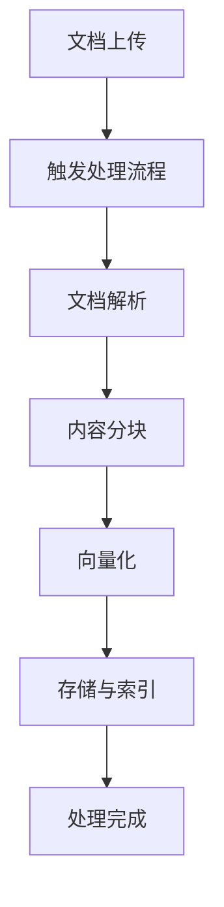
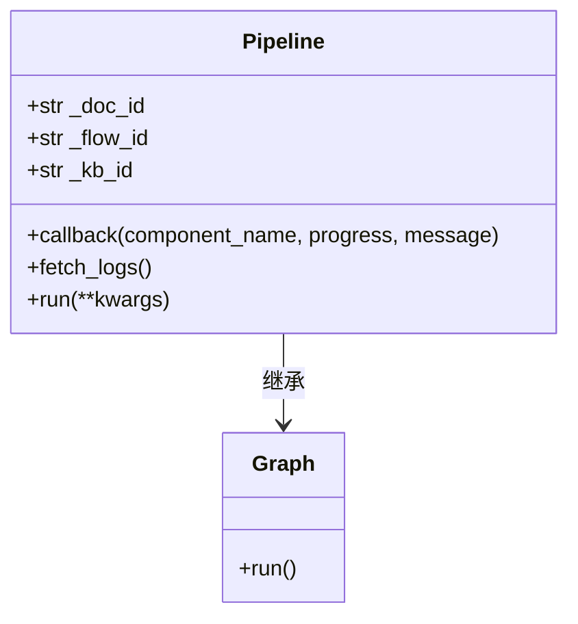
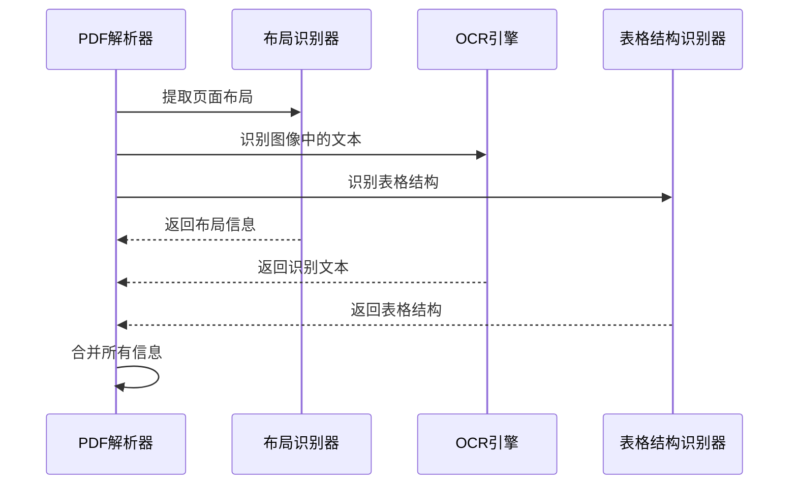
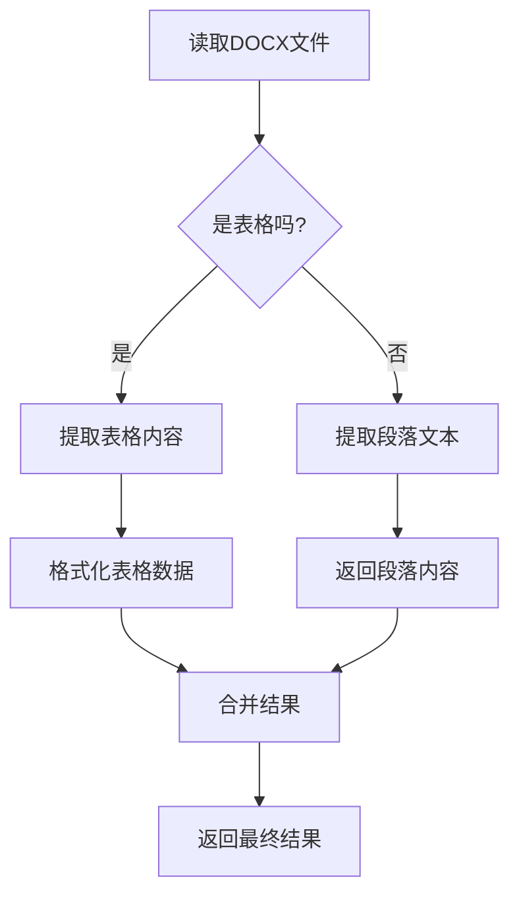
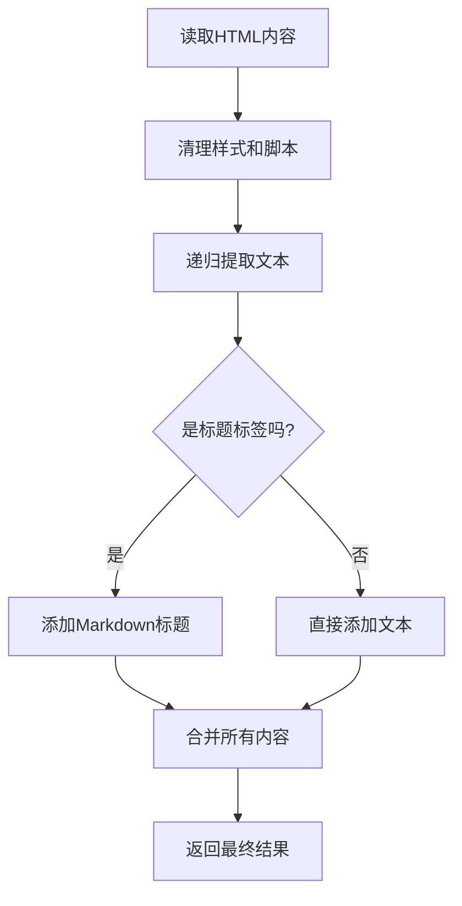
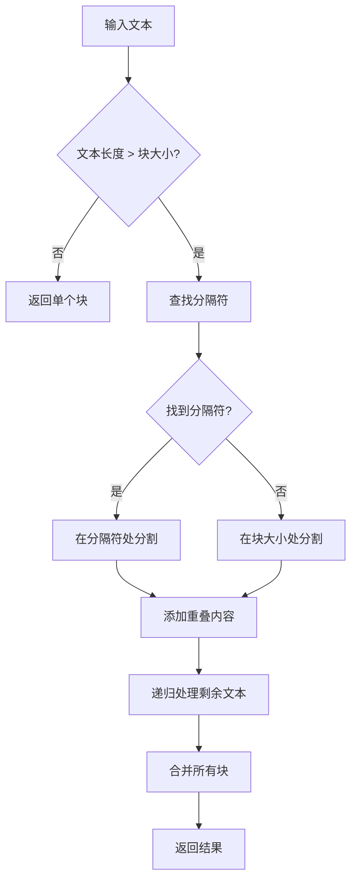
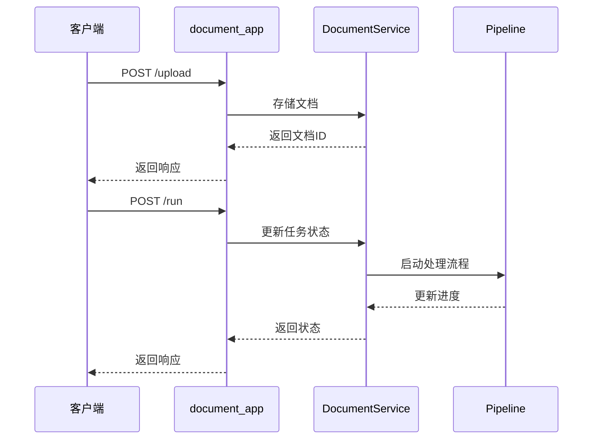

# 文档处理流水线

<cite>
**本文档引用的文件**   
- [document_app.py](file://api/apps/document_app.py)
- [pipeline.py](file://rag/flow/pipeline.py)
- [parser.py](file://rag/flow/parser/parser.py)
- [splitter.py](file://rag/flow/splitter/splitter.py)
- [pdf_parser.py](file://deepdoc/parser/pdf_parser.py)
- [docx_parser.py](file://deepdoc/parser/docx_parser.py)
- [html_parser.py](file://deepdoc/parser/html_parser.py)
- [document_service.py](file://api/db/services/document_service.py)
- [rag_tokenizer.py](file://rag/nlp/rag_tokenizer.py)
- [base64_image.py](file://rag/utils/base64_image.py)
</cite>

## 目录
1. [简介](#简介)
2. [文档处理生命周期](#文档处理生命周期)
3. [核心组件分析](#核心组件分析)
4. [解析器实现细节](#解析器实现细节)
5. [分块算法](#分块算法)
6. [API触发与状态管理](#api触发与状态管理)
7. [性能优化建议](#性能优化建议)
8. [错误处理](#错误处理)
9. [结论](#结论)

## 简介
文档处理流水线是RAGFlow系统的核心功能，负责将各种格式的文档从上传到索引的完整处理过程。该流水线通过协调解析器(Parser)和分块器(Splitter)组件，实现对PDF、DOCX、HTML等多种文档类型的解析、分块、向量化和存储。本文档详细阐述了整个处理流程的架构、实现细节和优化策略。

**Section sources**
- [document_app.py](file://api/apps/document_app.py#L1-L729)

## 文档处理生命周期
文档处理流水线的生命周期从文档上传开始，经过解析、分块、向量化和存储等阶段，最终完成索引。整个流程由`Pipeline`类协调，通过API触发并管理处理状态。

**Diagram sources**
- [document_app.py](file://api/apps/document_app.py#L1-L729)
- [pipeline.py](file://rag/flow/pipeline.py#L1-L176)

## 核心组件分析
文档处理流水线的核心组件包括`Pipeline`、`Parser`和`Splitter`。`Pipeline`类继承自`Graph`，负责协调整个处理流程；`Parser`组件负责解析不同格式的文档；`Splitter`组件负责将解析后的内容分块。

### Pipeline类
`Pipeline`类是整个处理流程的协调者，它通过DSL（领域特定语言）定义的流程图来管理各个组件的执行顺序。当文档处理任务启动时，`Pipeline`会按顺序调用各个组件，并通过回调机制更新处理进度。

**Diagram sources**
- [pipeline.py](file://rag/flow/pipeline.py#L1-L176)

### Parser组件
`Parser`组件负责解析不同格式的文档，支持PDF、DOCX、HTML等多种格式。它根据文档类型选择合适的解析策略，并将解析后的内容传递给后续的分块组件。

**Section sources**
- [parser.py](file://rag/flow/parser/parser.py#L1-L856)

### Splitter组件
`Splitter`组件负责将解析后的内容分块，支持按Token或标题分块。它通过配置参数控制分块大小和重叠比例，确保分块后的文本适合后续的向量化处理。

**Section sources**
- [splitter.py](file://rag/flow/splitter/splitter.py#L1-L161)

## 解析器实现细节
不同文档类型的解析器有不同的实现策略，主要分为PDF解析器、DOCX解析器和HTML解析器。

### PDF解析器
PDF解析器`RAGFlowPdfParser`使用多种技术组合来处理PDF文档，包括pdfplumber、OCR和布局识别。它首先通过pdfplumber提取文本和布局信息，然后使用OCR处理图像内容，最后通过布局识别器确定文本的阅读顺序。

**Diagram sources**
- [pdf_parser.py](file://deepdoc/parser/pdf_parser.py#L1-L1502)

### DOCX解析器
DOCX解析器`RAGFlowDocxParser`使用python-docx库解析DOCX文档。它将文档内容分为段落和表格两部分处理，段落内容直接提取文本，表格内容则通过特定算法提取并格式化。

**Diagram sources**
- [docx_parser.py](file://deepdoc/parser/docx_parser.py#L1-L140)

### HTML解析器
HTML解析器`RAGFlowHtmlParser`使用BeautifulSoup库解析HTML文档。它首先清理HTML中的样式和脚本标签，然后递归地提取文本内容，并根据标题标签添加相应的Markdown格式。

**Diagram sources**
- [html_parser.py](file://deepdoc/parser/html_parser.py#L1-L214)

## 分块算法
分块算法是文档处理流水线的关键环节，它将解析后的内容分割成适合向量化处理的文本块。主要支持两种分块策略：按Token分块和按标题分块。

### 按Token分块
按Token分块算法使用`naive_merge`函数，根据指定的Token大小将文本分割成多个块。算法会考虑分隔符和重叠比例，确保分块的合理性和连续性。

**Diagram sources**
- [splitter.py](file://rag/flow/splitter/splitter.py#L1-L161)
- [base64_image.py](file://rag/utils/base64_image.py#L1-L91)

### 按标题分块
按标题分块算法根据文档中的标题层级来分割文本。它会识别不同级别的标题（如H1、H2等），并将每个标题下的内容作为一个独立的块。

## API触发与状态管理
文档处理流程通过`document_app.py`中的API触发，系统通过任务状态管理确保处理过程的可靠性和可追踪性。

### API触发流程
文档上传和处理通过`/upload`和`/run`等API端点触发。上传API负责接收文档并存储，运行API负责启动处理流程。

**Diagram sources**
- [document_app.py](file://api/apps/document_app.py#L1-L729)

### 状态管理
系统使用`TaskStatus`枚举管理文档处理状态，包括未开始(UNSTART)、运行中(RUNNING)、已完成(DONE)和失败(FAIL)。状态更新通过Redis存储，确保进度的实时性和可靠性。

**Section sources**
- [document_service.py](file://api/db/services/document_service.py#L1-L1035)

## 性能优化建议
为了提高文档处理流水线的性能，建议采取以下优化措施：

1. **选择合适的解析器**：对于包含大量图像的PDF文档，使用OCR解析器；对于纯文本PDF，使用deepdoc解析器。
2. **调整分块大小**：根据文档内容和使用场景调整分块大小，避免过小或过大的分块。
3. **合理设置重叠比例**：适当的重叠比例可以提高上下文连贯性，但会增加处理时间和存储开销。
4. **并行处理**：对于大量文档，可以启用并行处理以提高吞吐量。

## 错误处理
系统实现了完善的错误处理机制，包括任务取消、异常捕获和进度恢复。当任务被取消或发生异常时，系统会记录错误信息并清理相关资源。

**Section sources**
- [document_service.py](file://api/db/services/document_service.py#L1-L1035)
- [pipeline.py](file://rag/flow/pipeline.py#L1-L176)

## 结论
文档处理流水线是RAGFlow系统的核心功能，通过协调解析器和分块器组件，实现了对多种文档格式的高效处理。通过合理的配置和优化，可以显著提高文档处理的效率和质量。