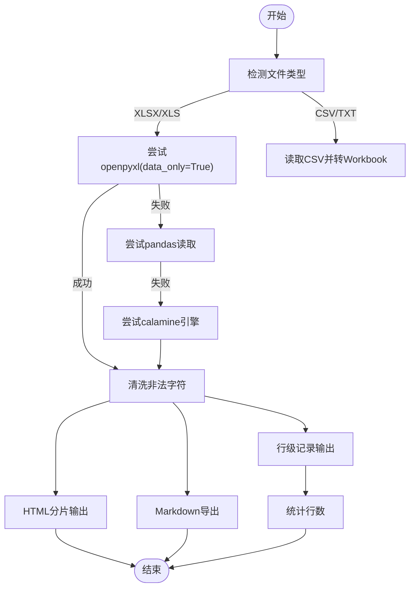

# Office文档解析

<cite>
**本文引用的文件**
- [deepdoc/parser/docx_parser.py](file://deepdoc/parser/docx_parser.py)
- [deepdoc/parser/excel_parser.py](file://deepdoc/parser/excel_parser.py)
- [deepdoc/parser/ppt_parser.py](file://deepdoc/parser/ppt_parser.py)
- [deepdoc/parser/utils.py](file://deepdoc/parser/utils.py)
- [deepdoc/parser/__init__.py](file://deepdoc/parser/__init__.py)
- [pyproject.toml](file://pyproject.toml)
- [rag/nlp/rag_tokenizer.py](file://rag/nlp/rag_tokenizer.py)
- [rag/app/naive.py](file://rag/app/naive.py)
- [rag/app/qa.py](file://rag/app/qa.py)
- [rag/app/table.py](file://rag/app/table.py)
- [rag/flow/parser/parser.py](file://rag/flow/parser/parser.py)
</cite>

## 目录
1. [简介](#简介)
2. [项目结构](#项目结构)
3. [核心组件](#核心组件)
4. [架构总览](#架构总览)
5. [详细组件分析](#详细组件分析)
6. [依赖关系分析](#依赖关系分析)
7. [性能考量](#性能考量)
8. [故障排查指南](#故障排查指南)
9. [结论](#结论)
10. [附录](#附录)

## 简介
本文件聚焦于Office文档解析子系统，围绕以下目标展开：
- 深入解析docx_parser.py如何从DOCX的XML结构中抽取段落、标题、列表、表格与样式信息，并在RAG流程中保留语义结构（如标题层级）。
- 讨论excel_parser.py与ppt_parser.py如何处理电子表格与演示文稿的数据与布局，输出适合RAG的文本或HTML。
- 提供保留原始文档语义结构（标题层级、列表层级、表格上下文）以提升检索与生成质量的策略。
- 给出处理宏、嵌入对象等复杂元素的实践建议与注意事项。

## 项目结构
Office文档解析位于deepdoc/parser目录下，包含针对不同格式的解析器以及工具模块；同时在rag应用层有多个入口调用这些解析器，用于RAG流水线的不同阶段。

图表来源
- [deepdoc/parser/docx_parser.py](file://deepdoc/parser/docx_parser.py#L1-L140)
- [deepdoc/parser/excel_parser.py](file://deepdoc/parser/excel_parser.py#L1-L224)
- [deepdoc/parser/ppt_parser.py](file://deepdoc/parser/ppt_parser.py#L1-L100)
- [deepdoc/parser/utils.py](file://deepdoc/parser/utils.py#L1-L33)
- [deepdoc/parser/__init__.py](file://deepdoc/parser/__init__.py#L1-L41)
- [rag/app/naive.py](file://rag/app/naive.py#L199-L229)
- [rag/app/qa.py](file://rag/app/qa.py#L33-L70)
- [rag/app/table.py](file://rag/app/table.py#L37-L352)
- [rag/flow/parser/parser.py](file://rag/flow/parser/parser.py#L446-L497)

章节来源
- [deepdoc/parser/__init__.py](file://deepdoc/parser/__init__.py#L17-L39)
- [pyproject.toml](file://pyproject.toml#L71-L86)

## 核心组件
- DOCX解析器：从python-docx加载文档，遍历段落与表格，识别分页标记，抽取文本与样式名，表格采用基于模式与分词的类型判定与组合策略。
- Excel解析器：多引擎容错加载（openpyxl、pandas、calamine），清洗非法字符，支持HTML分片输出、Markdown导出与行级记录输出；提供行数统计能力。
- PPT解析器：使用python-pptx读取幻灯片，按形状顺序提取文本，识别项目符号与层级，处理表格与组合形状，输出每页文本块。
- 工具模块：提供通用文本解码工具，辅助其他解析器处理编码问题。

章节来源
- [deepdoc/parser/docx_parser.py](file://deepdoc/parser/docx_parser.py#L25-L140)
- [deepdoc/parser/excel_parser.py](file://deepdoc/parser/excel_parser.py#L28-L224)
- [deepdoc/parser/ppt_parser.py](file://deepdoc/parser/ppt_parser.py#L22-L100)
- [deepdoc/parser/utils.py](file://deepdoc/parser/utils.py#L20-L33)

## 架构总览
整体流程：上层调用选择输出格式（JSON/Markdown/HTML），解析器根据格式进行相应转换；DOCX侧可附加图片与表格上下文；Excel/PPT侧输出结构化文本或HTML片段，便于后续RAG处理。

图表来源
- [rag/flow/parser/parser.py](file://rag/flow/parser/parser.py#L446-L497)
- [deepdoc/parser/docx_parser.py](file://deepdoc/parser/docx_parser.py#L116-L140)
- [deepdoc/parser/excel_parser.py](file://deepdoc/parser/excel_parser.py#L112-L169)
- [deepdoc/parser/ppt_parser.py](file://deepdoc/parser/ppt_parser.py#L77-L99)

## 详细组件分析

### DOCX解析器：段落、标题、列表、表格与样式
- 段落与样式
  - 使用python-docx遍历段落runs，结合“最后渲染分页标记”判断页面边界，按页收集段落文本与样式名，形成(文本, 样式名)元组序列。
- 列表与标题
  - 通过段落样式名与运行时XML中项目符号标记识别列表项与层级，列表文本前缀包含缩进与层级信息，有助于保留层次结构。
- 表格
  - 将表格转为DataFrame后，采用基于正则与分词的块类型判定（日期、数字、英文、中文、混合等），统计各单元格类型分布，自动识别可能的表头行，再组合成“列名: 值”的键值对行，最终合并为自然语言行或段落。
- 语义结构保留
  - 在RAG应用层，可通过遍历文档结构（段落与表格节点顺序）维护标题层级与表格前后关系，从而在RAG检索中保留上下文语义。

图表来源
- [deepdoc/parser/docx_parser.py](file://deepdoc/parser/docx_parser.py#L25-L140)

章节来源
- [deepdoc/parser/docx_parser.py](file://deepdoc/parser/docx_parser.py#L25-L140)
- [rag/app/naive.py](file://rag/app/naive.py#L199-L229)

### Excel解析器：数据与布局
- 多引擎容错
  - 首先尝试openpyxl加载；失败时回退到pandas（默认引擎或calamine），若仍失败则抛出异常，确保尽可能解析CSV/XLSX/XLS。
- 数据清洗
  - 清理非法字符，避免后续HTML/Markdown渲染错误。
- 输出格式
  - HTML：按工作表切分为固定行数的表格片段，带表头与标题，便于前端展示与RAG检索。
  - Markdown：将CSV/XLSX读取为DataFrame后导出为Markdown表格。
  - 行级记录：将首行作为字段名，逐行拼接为“字段: 值”的字符串，附带工作表名标识，便于问答任务。
- 行数统计
  - 支持统计XLS/XLSX行数，辅助分页与进度回调。

图表来源
- [deepdoc/parser/excel_parser.py](file://deepdoc/parser/excel_parser.py#L28-L224)

章节来源
- [deepdoc/parser/excel_parser.py](file://deepdoc/parser/excel_parser.py#L28-L224)
- [rag/app/qa.py](file://rag/app/qa.py#L33-L70)
- [rag/app/table.py](file://rag/app/table.py#L37-L352)

### PPT解析器：布局与内容
- 形状与文本
  - 优先从形状的文本框架提取段落，识别项目符号与层级，按位置排序（top/10, left）保证阅读顺序。
- 表格与组合形状
  - 对表格形状按行拼接为“列名: 值”的行；对组合形状按位置排序递归提取文本，保持空间布局顺序。
- 输出
  - 返回每页文本块，便于后续RAG分页检索。

图表来源
- [deepdoc/parser/ppt_parser.py](file://deepdoc/parser/ppt_parser.py#L22-L99)

章节来源
- [deepdoc/parser/ppt_parser.py](file://deepdoc/parser/ppt_parser.py#L22-L99)

### 语义结构保留策略（标题层级、列表层级、表格上下文）
- 标题层级
  - 在RAG应用层，通过遍历文档结构（段落与表格节点顺序）维护标题层级，使表格前后关系与标题层级在RAG检索中得以保留。
- 列表层级
  - DOCX解析器已将列表层级信息写入文本前缀，有助于下游检索与生成理解层次。
- 表格上下文
  - DeepDOC解析器在JSON输出时可附加表格上下文，增强检索相关性。

章节来源
- [rag/app/naive.py](file://rag/app/naive.py#L199-L229)
- [rag/flow/parser/parser.py](file://rag/flow/parser/parser.py#L476-L487)

## 依赖关系分析
- 第三方库
  - DOCX：python-docx
  - Excel：openpyxl、pandas、python-calamine
  - PPT：python-pptx
  - 分词与标注：infinity.rag_tokenizer（通过rag.nlp封装）
- 内部模块
  - 解析器统一由deepdoc/parser/__init__.py导出，供上层调用。
  - 工具模块提供编码检测与解码，辅助文本处理。

图表来源
- [pyproject.toml](file://pyproject.toml#L71-L86)
- [deepdoc/parser/__init__.py](file://deepdoc/parser/__init__.py#L17-L39)
- [rag/nlp/rag_tokenizer.py](file://rag/nlp/rag_tokenizer.py#L17-L42)

章节来源
- [pyproject.toml](file://pyproject.toml#L71-L86)
- [deepdoc/parser/__init__.py](file://deepdoc/parser/__init__.py#L17-L39)
- [rag/nlp/rag_tokenizer.py](file://rag/nlp/rag_tokenizer.py#L17-L42)

## 性能考量
- DOCX
  - 按页收集段落与runs，避免一次性加载全部内容；表格类型判定与组合存在循环与计数操作，建议在大文档上限制to_page范围。
- Excel
  - 多引擎回退策略会增加失败重试成本，建议优先确保openpyxl可用；HTML分片按固定行数切分，减少单次渲染压力。
- PPT
  - 形状排序与文本提取为线性复杂度，注意组合形状的递归深度与表格行列数量。

[本节为通用性能建议，不直接分析具体文件]

## 故障排查指南
- Excel无法解析
  - 现象：openpyxl加载失败，回退到pandas或calamine仍失败。
  - 处理：检查文件是否损坏或受保护；确认依赖安装；必要时先将CSV/XLSX转换为标准格式。
- PPT解析异常
  - 现象：形状无文本或访问shape_type报错。
  - 处理：捕获NotImplementedError并降级到文本属性；跳过不可解析形状继续处理。
- 编码问题
  - 现象：文本乱码或缺失。
  - 处理：使用工具模块的编码检测与解码，确保正确读取文本文件。

章节来源
- [deepdoc/parser/excel_parser.py](file://deepdoc/parser/excel_parser.py#L28-L66)
- [deepdoc/parser/ppt_parser.py](file://deepdoc/parser/ppt_parser.py#L44-L76)
- [deepdoc/parser/utils.py](file://deepdoc/parser/utils.py#L20-L33)

## 结论
- DOCX解析器通过段落样式与项目符号XML标记保留了标题与列表层级，表格解析采用类型判定与组合策略，适合RAG的层次化检索。
- Excel解析器具备多引擎容错与多种输出格式，满足不同下游需求；PPT解析器按布局顺序提取文本，适合演示文稿的RAG场景。
- 通过在应用层维护文档结构顺序与附加表格上下文，可有效提升RAG检索与生成的质量。

[本节为总结性内容，不直接分析具体文件]

## 附录

### 处理宏、嵌入对象等复杂元素的指导
- 宏与VBA
  - 当前解析器未显式处理宏代码或VBA脚本；建议在预处理阶段剥离宏（如使用第三方工具），仅保留纯文本与可见内容。
- 嵌入对象
  - 图片、OLE对象等嵌入元素通常不在文本流中直接体现；可在应用层通过文档部件关联关系提取图像并附加到对应段落或表格附近，以增强RAG上下文。
- 受保护文档
  - 密码保护或DRM文档需先解密或转换为可读格式，否则解析器将无法读取内容。
- 版本兼容
  - 不同版本的DOCX/XLSX/PPTX可能存在差异，建议在CI中覆盖常见版本与编码，确保解析稳定性。

[本节为通用指导，不直接分析具体文件]