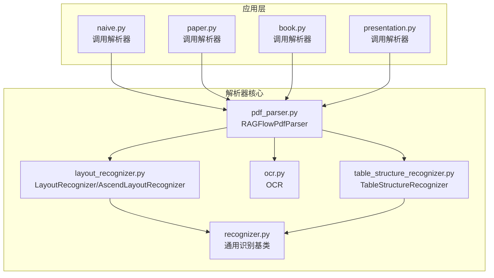
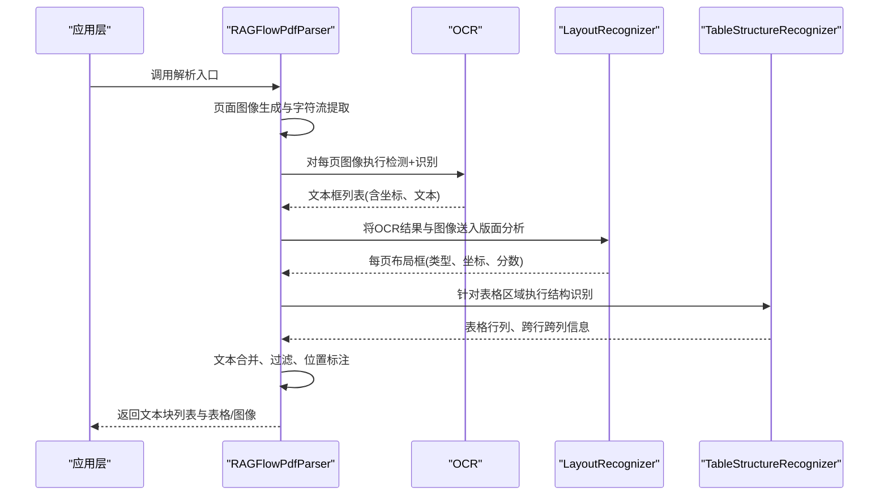
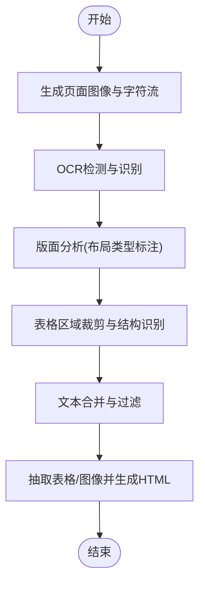
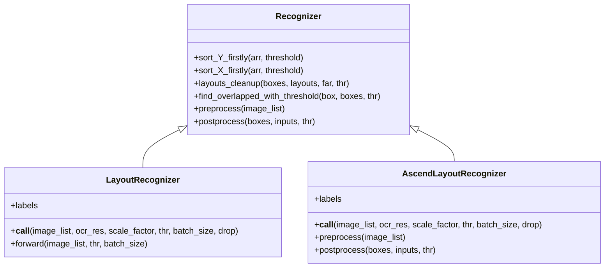
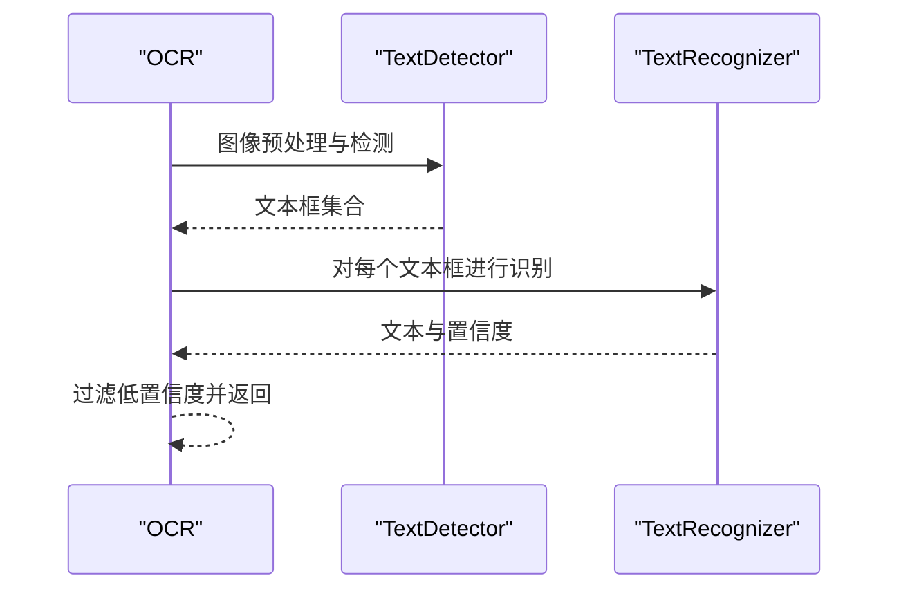
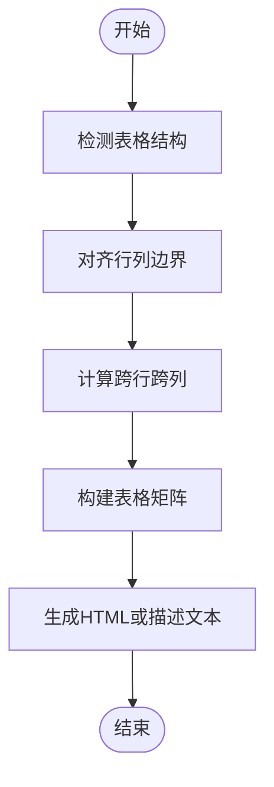
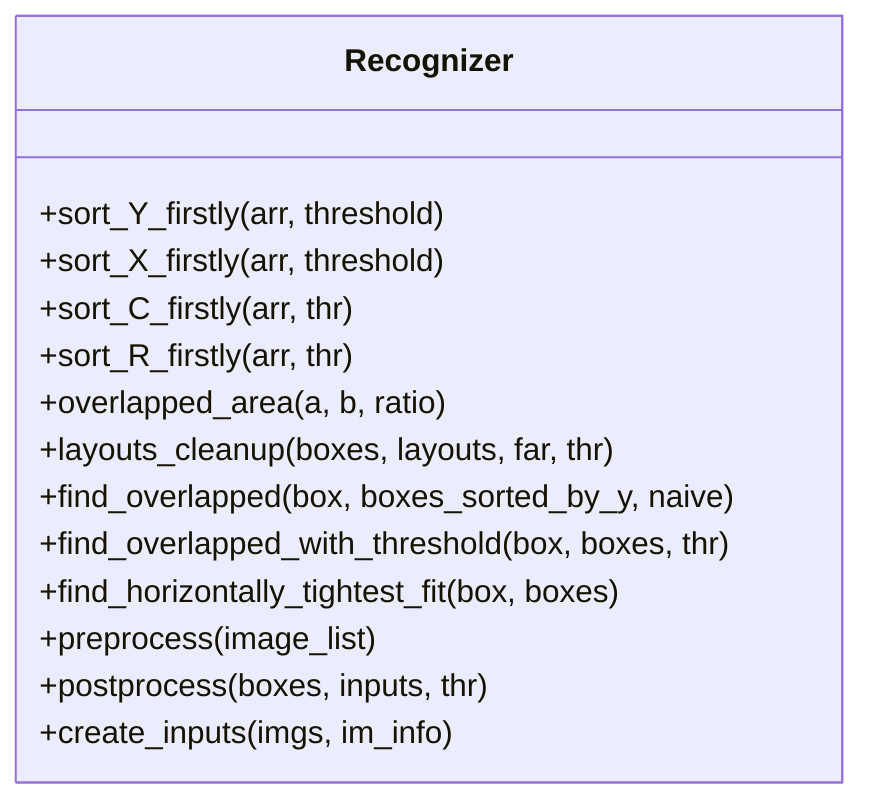
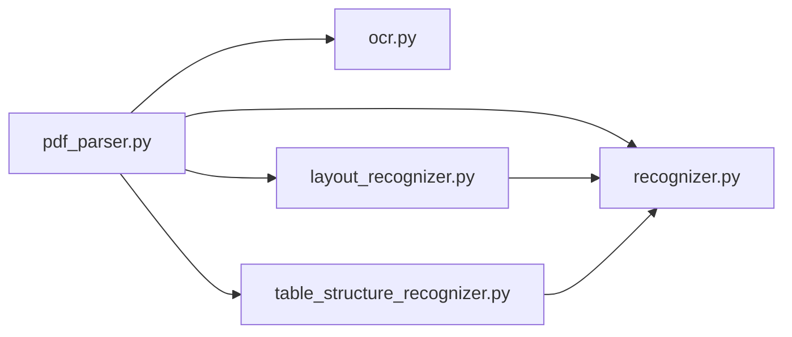

# PDF文档解析

<cite>
**本文引用的文件**
- [pdf_parser.py](file://deepdoc/parser/pdf_parser.py)
- [layout_recognizer.py](file://deepdoc/vision/layout_recognizer.py)
- [ocr.py](file://deepdoc/vision/ocr.py)
- [table_structure_recognizer.py](file://deepdoc/vision/table_structure_recognizer.py)
- [recognizer.py](file://deepdoc/vision/recognizer.py)
- [naive.py](file://rag/app/naive.py)
- [paper.py](file://rag/app/paper.py)
- [book.py](file://rag/app/book.py)
- [presentation.py](file://rag/app/presentation.py)
</cite>

## 目录
1. [引言](#引言)
2. [项目结构](#项目结构)
3. [核心组件](#核心组件)
4. [架构总览](#架构总览)
5. [详细组件分析](#详细组件分析)
6. [依赖关系分析](#依赖关系分析)
7. [性能考量](#性能考量)
8. [故障排查指南](#故障排查指南)
9. [结论](#结论)
10. [附录](#附录)

## 引言
本文件围绕PDF文档解析展开，重点阐述如何通过RAGFlow的PDF解析器实现从扫描版PDF到可检索文本与结构化内容的完整流程。解析器以pdf_parser.py为核心，借助layout_recognizer.py进行版面分析，识别文本块、表格、图像、页眉页脚等元素；在扫描版PDF场景下，OCR模块负责从图像中提取文字，并将视觉信息与原始文本流融合；随后通过表格结构识别、列数判定、多栏布局处理、跨页合并等策略，输出高质量的文本与表格HTML；最后给出性能优化建议与常见问题排查方法。

## 项目结构
本解析能力由以下模块协同完成：
- 解析入口与主流程：pdf_parser.py
- 版面分析：layout_recognizer.py（支持ONNX与Ascend两种后端）
- OCR模块：ocr.py（检测+识别，支持并行设备）
- 表格结构识别：table_structure_recognizer.py（ONNX/Ascend）
- 通用识别基类：recognizer.py（排序、重叠判断、NMS等工具）
- 应用层调用示例：naive.py、paper.py、book.py、presentation.py

图示来源
- [pdf_parser.py](file://deepdoc/parser/pdf_parser.py#L1-L120)
- [layout_recognizer.py](file://deepdoc/vision/layout_recognizer.py#L1-L120)
- [ocr.py](file://deepdoc/vision/ocr.py#L536-L752)
- [table_structure_recognizer.py](file://deepdoc/vision/table_structure_recognizer.py#L1-L120)
- [recognizer.py](file://deepdoc/vision/recognizer.py#L1-L120)

章节来源
- [pdf_parser.py](file://deepdoc/parser/pdf_parser.py#L1-L120)
- [layout_recognizer.py](file://deepdoc/vision/layout_recognizer.py#L1-L120)
- [ocr.py](file://deepdoc/vision/ocr.py#L536-L752)
- [table_structure_recognizer.py](file://deepdoc/vision/table_structure_recognizer.py#L1-L120)
- [recognizer.py](file://deepdoc/vision/recognizer.py#L1-L120)

## 核心组件
- RAGFlowPdfParser：PDF解析主控制器，负责页面图像生成、OCR、版面分析、表格结构识别、文本合并与过滤、表格/图像抽取、位置标注与裁剪等。
- LayoutRecognizer/AscendLayoutRecognizer：基于ONNX或Ascend的版面分析器，输出每页的布局框及其类型（文本、标题、图、表、页眉、页脚、参考文献、公式等），并将布局类型回标注入OCR结果。
- OCR：文本检测与识别，支持多GPU并行推理，按阈值过滤低置信度结果。
- TableStructureRecognizer：表格结构识别，输出行列、跨行跨列等结构信息，并可生成HTML或描述性文本。
- Recognizer：通用识别基类，提供排序、重叠计算、NMS、预处理/后处理等工具函数。

章节来源
- [pdf_parser.py](file://deepdoc/parser/pdf_parser.py#L51-L120)
- [layout_recognizer.py](file://deepdoc/vision/layout_recognizer.py#L33-L158)
- [ocr.py](file://deepdoc/vision/ocr.py#L536-L752)
- [table_structure_recognizer.py](file://deepdoc/vision/table_structure_recognizer.py#L30-L120)
- [recognizer.py](file://deepdoc/vision/recognizer.py#L31-L120)

## 架构总览
解析流程自上而下分为四步：图像生成与OCR、版面分析、表格结构识别、文本与结构后处理。OCR结果与版面分析结果相互映射，表格结构识别进一步细化表格单元的行列关系，最终输出文本块、表格HTML与图像。

图示来源
- [pdf_parser.py](file://deepdoc/parser/pdf_parser.py#L1040-L1188)
- [layout_recognizer.py](file://deepdoc/vision/layout_recognizer.py#L63-L158)
- [ocr.py](file://deepdoc/vision/ocr.py#L663-L752)
- [table_structure_recognizer.py](file://deepdoc/vision/table_structure_recognizer.py#L54-L120)

## 详细组件分析

### 组件A：RAGFlowPdfParser（PDF解析主控制器）
职责与关键流程
- 图像生成与字符流提取：使用pdfplumber将PDF页面转为高分辨率图像，并尝试提取字符流用于英文场景下的字符间距拼接与均值尺寸估计。
- OCR：对每页图像执行检测与识别，按阈值过滤低置信度文本框；支持多GPU并行限制与异步调度。
- 版面分析：调用LayoutRecognizer/AscendLayoutRecognizer，将布局类型回标注入OCR结果，同时清理垃圾布局（页眉、页脚、参考文献等）。
- 表格结构识别：对每页表格区域裁剪并识别结构，再将行列、跨行跨列信息写回到OCR框中。
- 文本合并与过滤：按列、行、段落规则合并相邻文本框，过滤目录、页眉页脚等无关内容；支持跨页合并与投影匹配。
- 结果输出：抽取表格与图像，生成表格HTML或描述文本，返回文本块列表与结构化结果。

关键算法与策略
- 列数判定：基于KMeans聚类与轮廓评估，自动确定每页列数，避免固定阈值导致的误判。
- 文本合并：水平合并相邻同布局文本框，垂直合并同一列内近邻文本框，考虑标点、空格与换行规则。
- 跨页合并：使用上下文特征与XGBoost模型预测是否应连接不同页的文本块。
- 复杂布局处理：多栏、图文混排、跨页表格通过布局标签与几何重叠关系进行对齐与拼接。

图示来源
- [pdf_parser.py](file://deepdoc/parser/pdf_parser.py#L1040-L1188)
- [layout_recognizer.py](file://deepdoc/vision/layout_recognizer.py#L63-L158)
- [table_structure_recognizer.py](file://deepdoc/vision/table_structure_recognizer.py#L54-L120)

章节来源
- [pdf_parser.py](file://deepdoc/parser/pdf_parser.py#L1040-L1188)
- [pdf_parser.py](file://deepdoc/parser/pdf_parser.py#L1189-L1273)
- [pdf_parser.py](file://deepdoc/parser/pdf_parser.py#L1274-L1411)

### 组件B：LayoutRecognizer（版面分析）
职责与关键流程
- 输入：页面图像列表与OCR结果（文本框）。
- 输出：每页布局框列表（类型、坐标、分数），并回标注入OCR结果。
- 垃圾布局过滤：对页眉、页脚、参考文献等布局类型进行过滤或保留条件判断。
- 布局清理：对重叠布局采用面积比与文本覆盖度进行去重与合并。

图示来源
- [recognizer.py](file://deepdoc/vision/recognizer.py#L31-L120)
- [layout_recognizer.py](file://deepdoc/vision/layout_recognizer.py#L33-L158)
- [layout_recognizer.py](file://deepdoc/vision/layout_recognizer.py#L241-L458)

章节来源
- [layout_recognizer.py](file://deepdoc/vision/layout_recognizer.py#L63-L158)
- [layout_recognizer.py](file://deepdoc/vision/layout_recognizer.py#L340-L458)
- [recognizer.py](file://deepdoc/vision/recognizer.py#L134-L177)

### 组件C：OCR（文本检测与识别）
职责与关键流程
- 文本检测：对输入图像执行文本框检测，得到候选区域。
- 文本识别：对每个候选区域进行识别，按阈值过滤低置信度结果。
- 并行与设备选择：支持多GPU并行推理，自动选择CUDA或CPU后端。
- 旋转校正：对倾斜文本框进行透视变换与旋转校正，提升识别准确率。

图示来源
- [ocr.py](file://deepdoc/vision/ocr.py#L414-L535)
- [ocr.py](file://deepdoc/vision/ocr.py#L536-L752)

章节来源
- [ocr.py](file://deepdoc/vision/ocr.py#L414-L535)
- [ocr.py](file://deepdoc/vision/ocr.py#L536-L752)

### 组件D：TableStructureRecognizer（表格结构识别）
职责与关键流程
- 输入：表格区域图像列表。
- 输出：表格结构信息（行列、跨行跨列、对齐边界）。
- HTML/描述生成：根据结构信息生成HTML表格或描述性文本，支持跨页表格合并与标题识别。

图示来源
- [table_structure_recognizer.py](file://deepdoc/vision/table_structure_recognizer.py#L54-L120)
- [table_structure_recognizer.py](file://deepdoc/vision/table_structure_recognizer.py#L151-L350)
- [table_structure_recognizer.py](file://deepdoc/vision/table_structure_recognizer.py#L351-L576)

章节来源
- [table_structure_recognizer.py](file://deepdoc/vision/table_structure_recognizer.py#L54-L120)
- [table_structure_recognizer.py](file://deepdoc/vision/table_structure_recognizer.py#L151-L350)
- [table_structure_recognizer.py](file://deepdoc/vision/table_structure_recognizer.py#L351-L576)

### 组件E：Recognzier（通用识别基类）
职责与关键流程
- 排序：按Y/X轴优先排序，支持阈值内二次排序。
- 重叠计算：计算两个框的重叠面积与比例。
- 布局清理：对重叠布局进行去重与合并。
- 预处理/后处理：统一的ONNX推理输入输出格式转换与NMS。

图示来源
- [recognizer.py](file://deepdoc/vision/recognizer.py#L31-L120)
- [recognizer.py](file://deepdoc/vision/recognizer.py#L134-L177)
- [recognizer.py](file://deepdoc/vision/recognizer.py#L217-L443)

章节来源
- [recognizer.py](file://deepdoc/vision/recognizer.py#L31-L120)
- [recognizer.py](file://deepdoc/vision/recognizer.py#L134-L177)
- [recognizer.py](file://deepdoc/vision/recognizer.py#L217-L443)

## 依赖关系分析
- RAGFlowPdfParser依赖OCR、LayoutRecognizer/AscendLayoutRecognizer、TableStructureRecognizer与Recognizer工具集。
- LayoutRecognizer/AscendLayoutRecognizer依赖Recognizer的通用工具与ONNX推理。
- TableStructureRecognizer依赖Recognizer的排序与重叠计算。
- OCR依赖ONNXRuntime与预处理/后处理模块。

图示来源
- [pdf_parser.py](file://deepdoc/parser/pdf_parser.py#L39-L120)
- [layout_recognizer.py](file://deepdoc/vision/layout_recognizer.py#L33-L120)
- [ocr.py](file://deepdoc/vision/ocr.py#L536-L620)
- [table_structure_recognizer.py](file://deepdoc/vision/table_structure_recognizer.py#L30-L80)
- [recognizer.py](file://deepdoc/vision/recognizer.py#L31-L120)

章节来源
- [pdf_parser.py](file://deepdoc/parser/pdf_parser.py#L39-L120)
- [layout_recognizer.py](file://deepdoc/vision/layout_recognizer.py#L33-L120)
- [ocr.py](file://deepdoc/vision/ocr.py#L536-L620)
- [table_structure_recognizer.py](file://deepdoc/vision/table_structure_recognizer.py#L30-L80)
- [recognizer.py](file://deepdoc/vision/recognizer.py#L31-L120)

## 性能考量
- OCR并行与设备选择
  - 支持多GPU并行推理，通过信号量限制并发，避免显存不足。
  - 自动选择CUDA或CPU后端，GPU模式下可配置显存上限与分配策略。
- 版面分析批处理
  - LayoutRecognizer/AscendLayoutRecognizer支持批处理推理，减少重复初始化开销。
- 文本合并与过滤
  - 使用阈值与统计量（均值高度/宽度）控制合并粒度，避免过度合并导致信息丢失。
  - 垃圾布局过滤减少无效文本参与后续处理。
- 表格结构识别
  - 对表格区域进行裁剪与结构识别，避免整页图像带来的噪声干扰。
- 跨页合并
  - 使用XGBoost模型与上下文特征进行跨页连接决策，提高准确性的同时控制成本。

章节来源
- [ocr.py](file://deepdoc/vision/ocr.py#L71-L131)
- [ocr.py](file://deepdoc/vision/ocr.py#L133-L200)
- [layout_recognizer.py](file://deepdoc/vision/layout_recognizer.py#L63-L120)
- [pdf_parser.py](file://deepdoc/parser/pdf_parser.py#L583-L682)

## 故障排查指南
- OCR失败或无文本
  - 现象：OCR返回空或极少数文本框。
  - 排查：检查OCR模型路径是否存在、CUDA可用性、GPU显存限制设置；确认输入图像分辨率与缩放因子合理。
- 版面分析误判
  - 现象：页眉、页脚、参考文献被错误识别为正文。
  - 排查：调整布局分析阈值与过滤策略；确认布局标签与垃圾布局集合配置正确。
- 表格结构不完整
  - 现象：表格行列缺失或跨行跨列错误。
  - 排查：检查表格区域裁剪是否包含完整表格；确认表格结构识别阈值与对齐策略。
- 文本合并异常
  - 现象：文本框被错误合并或遗漏。
  - 排查：检查合并阈值与标点规则；确认列数判定逻辑与排序顺序。
- 多栏布局错乱
  - 现象：多栏文本顺序错乱。
  - 排查：确认列数聚类与排序策略；检查页面累计高度与坐标转换。

章节来源
- [ocr.py](file://deepdoc/vision/ocr.py#L71-L131)
- [layout_recognizer.py](file://deepdoc/vision/layout_recognizer.py#L118-L158)
- [table_structure_recognizer.py](file://deepdoc/vision/table_structure_recognizer.py#L54-L120)
- [pdf_parser.py](file://deepdoc/parser/pdf_parser.py#L354-L438)
- [pdf_parser.py](file://deepdoc/parser/pdf_parser.py#L440-L555)

## 结论
该解析方案通过OCR与版面分析的协同，实现了对扫描版PDF的高精度文本与结构化内容提取。RAGFlowPdfParser在复杂布局（多栏、图文混排、跨页表格）场景下，通过列数判定、重叠计算、跨页合并与垃圾布局过滤等策略，有效提升了解析质量与鲁棒性。配合OCR并行与批处理推理，可在保证精度的前提下显著提升吞吐能力。

## 附录
- 应用层调用示例
  - naive.py、paper.py、book.py、presentation.py展示了不同业务场景下的解析流程与回调进度更新方式。

章节来源
- [naive.py](file://rag/app/naive.py#L422-L451)
- [paper.py](file://rag/app/paper.py#L29-L63)
- [book.py](file://rag/app/book.py#L33-L65)
- [presentation.py](file://rag/app/presentation.py#L59-L103)