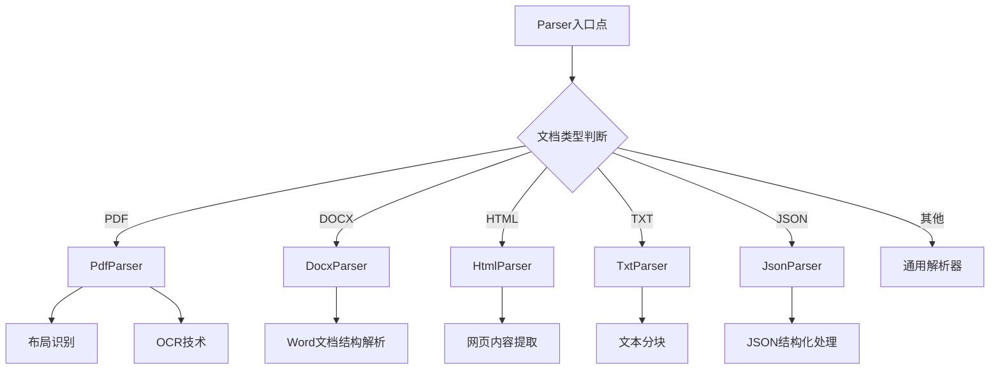
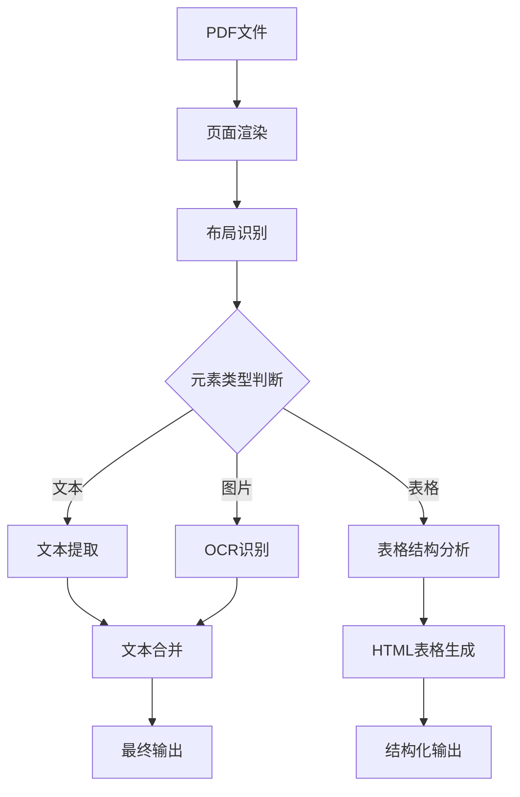
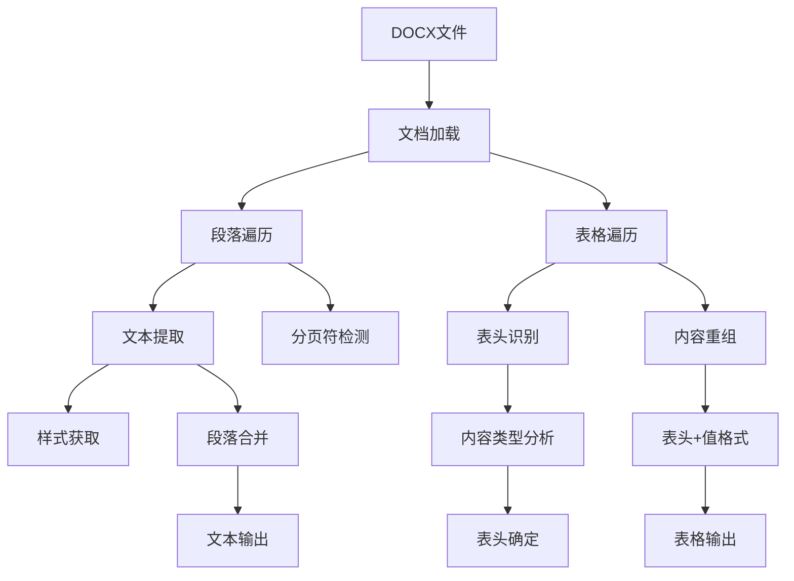
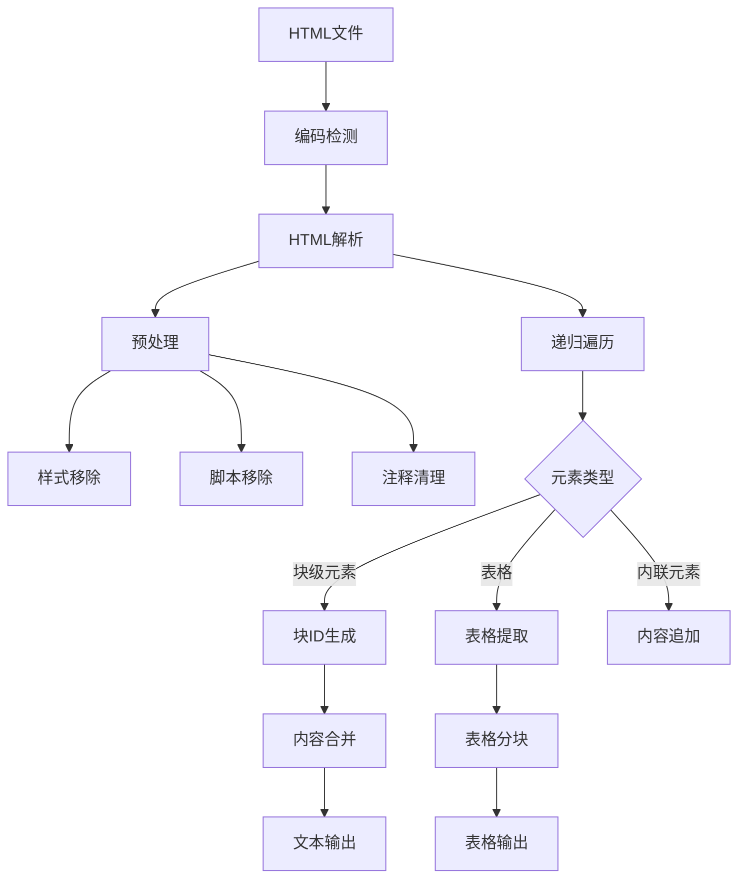
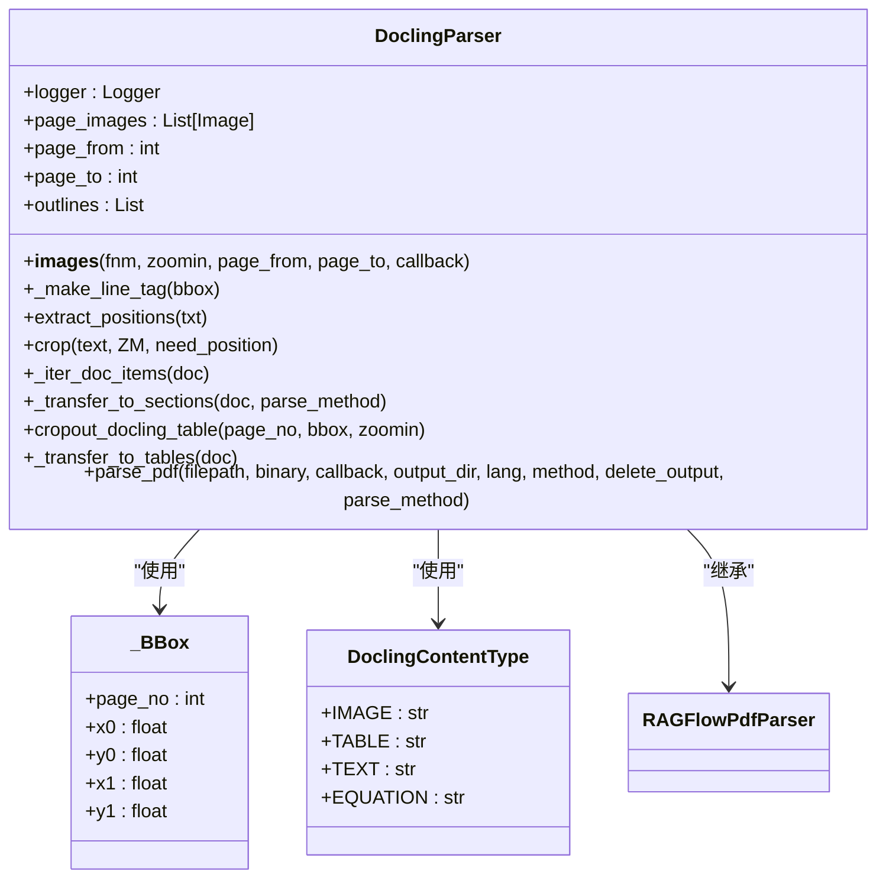
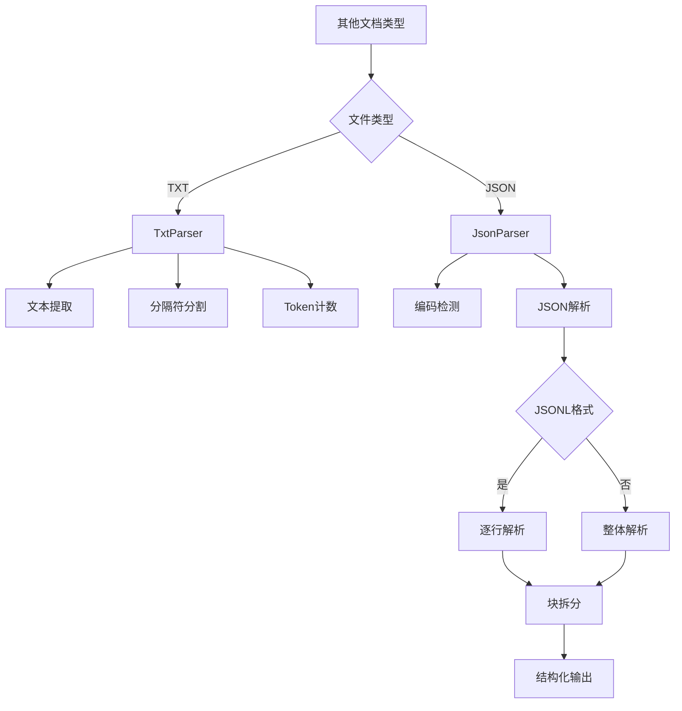
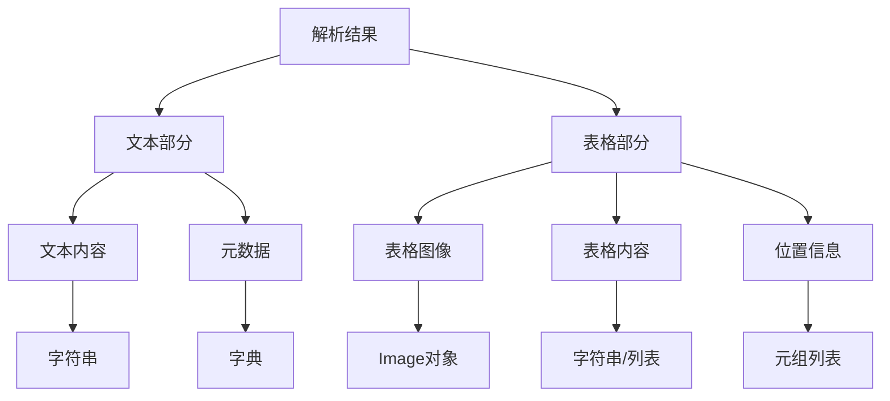

# 文档解析

<cite>
**本文档中引用的文件**
- [__init__.py](file://deepdoc/parser/__init__.py)
- [docling_parser.py](file://deepdoc/parser/docling_parser.py)
- [pdf_parser.py](file://deepdoc/parser/pdf_parser.py)
- [docx_parser.py](file://deepdoc/parser/docx_parser.py)
- [html_parser.py](file://deepdoc/parser/html_parser.py)
- [txt_parser.py](file://deepdoc/parser/txt_parser.py)
- [json_parser.py](file://deepdoc/parser/json_parser.py)
- [utils.py](file://deepdoc/parser/utils.py)
</cite>

## 目录
1. [简介](#简介)
2. [核心解析器架构](#核心解析器架构)
3. [PDF文档解析](#pdf文档解析)
4. [DOCX文档解析](#docx文档解析)
5. [HTML文档解析](#html文档解析)
6. [通用文档解析器](#通用文档解析器)
7. [其他文档类型解析](#其他文档类型解析)
8. [解析输出格式](#解析输出格式)
9. [解析策略比较](#解析策略比较)
10. [系统扩展指南](#系统扩展指南)

## 简介
文档解析子系统是RAGFlow项目的核心组件，负责将各种格式的文档转换为结构化的文本数据。该系统通过`Parser`类作为入口点，根据文档类型动态选择并调用相应的解析器。系统支持多种文档格式，包括PDF、DOCX、HTML、TXT和JSON等，每种格式都有专门的解析器来处理其特定的结构和内容。本文档将深入解析该系统的架构和实现细节。

## 核心解析器架构

文档解析子系统采用模块化设计，每个文档类型都有对应的解析器类。系统通过`deepdoc/parser/__init__.py`文件统一导出所有解析器，便于外部调用。主要解析器包括`PdfParser`、`DocxParser`、`HtmlParser`、`TxtParser`和`JsonParser`等。这些解析器都遵循统一的接口规范，通过`__call__`方法接收文件路径或二进制数据作为输入，并返回解析后的文本内容和表格数据。



**图源**
- [__init__.py](file://deepdoc/parser/__init__.py#L17-L26)

**本节源码**
- [__init__.py](file://deepdoc/parser/__init__.py#L1-L41)

## PDF文档解析

PDF文档解析器（`RAGFlowPdfParser`）采用先进的布局识别和OCR技术来处理复杂的PDF文档。解析器首先使用`pdfplumber`库提取PDF的文本和布局信息，然后通过`LayoutRecognizer`进行页面布局分析，识别文本、表格、图片等不同类型的元素。

### 布局识别技术
解析器使用深度学习模型进行布局识别，能够准确区分文档中的标题、段落、表格和图片等元素。布局识别器支持ONNX和Ascend两种后端，可以根据环境配置选择合适的实现。通过`layouter`字段初始化布局识别器，代码中根据环境变量`LAYOUT_RECOGNIZER_TYPE`决定使用哪种类型。

### OCR技术
对于扫描版PDF或包含图片的文档，系统采用OCR技术提取文本内容。`OCR`类负责检测图片中的文本区域，并使用识别模型将图像转换为文本。OCR处理包括两个主要步骤：文本区域检测和文本识别。系统使用`paddleocr`等工具进行文本检测，然后对检测到的区域进行识别。

### 表格处理
表格处理是PDF解析的关键部分。系统使用`TableStructureRecognizer`来识别表格结构，包括行、列、表头等元素。对于复杂表格，系统会将表格转换为HTML格式，保留原始的表格结构。表格处理流程包括：
1. 表格区域检测
2. 表格结构分析
3. 单元格内容提取
4. HTML格式转换



**图源**
- [pdf_parser.py](file://deepdoc/parser/pdf_parser.py#L51-L65)

**本节源码**
- [pdf_parser.py](file://deepdoc/parser/pdf_parser.py#L51-L800)

## DOCX文档解析

DOCX文档解析器（`RAGFlowDocxParser`）专门处理Microsoft Word文档，能够准确解析文档的段落、样式和表格结构。

### 段落解析
解析器使用`python-docx`库读取DOCX文件，遍历文档中的每个段落。对于每个段落，系统提取其文本内容和样式信息。特别地，解析器能够识别分页符，确保文本按正确的页面顺序组织。通过检查`run._element.xml`中的`lastRenderedPageBreak`标记来检测分页符。

### 表格解析
DOCX表格解析采用智能的表头识别算法。系统首先分析表格的结构，识别可能的表头行。通过分析单元格内容的类型分布，系统能够判断哪些行更可能是表头。具体算法包括：
1. 统计非数值单元格的类型分布
2. 识别标题行的特征模式
3. 动态确定表头行数

### 内容重组
解析后的表格内容会被重组为易于处理的格式。每行数据会与相应的表头信息结合，形成"表头: 值"的格式。对于多级表头，系统会递归地组合所有相关的表头信息。



**图源**
- [docx_parser.py](file://deepdoc/parser/docx_parser.py#L25-L140)

**本节源码**
- [docx_parser.py](file://deepdoc/parser/docx_parser.py#L25-L140)

## HTML文档解析

HTML文档解析器（`RAGFlowHtmlParser`）专门处理网页内容，能够提取和结构化HTML文档中的信息。

### HTML预处理
解析器首先对HTML内容进行预处理，移除不需要的元素。预处理步骤包括：
1. 删除`<style>`和`<script>`标签
2. 移除内联样式
3. 清理HTML注释
4. 解码HTML实体

### 内容提取
系统使用`BeautifulSoup`库进行HTML解析，递归遍历DOM树提取内容。解析器区分块级元素和内联元素，确保内容按正确的结构组织。对于标题元素（h1-h6），系统会添加相应的Markdown标记。

### 表格处理
HTML表格处理包括两个层面：表格识别和内容分块。系统首先识别文档中的所有`<table>`元素，然后根据token数量对表格内容进行分块。如果单个表格的token数量超过限制，系统会将其拆分为多个部分。

### 内容重组
解析后的文本内容会按逻辑块进行重组。系统使用UUID作为块标识符，确保每个内容块的唯一性。相邻的文本内容会被合并，形成连贯的段落。



**图源**
- [html_parser.py](file://deepdoc/parser/html_parser.py#L39-L214)

**本节源码**
- [html_parser.py](file://deepdoc/parser/html_parser.py#L39-L214)

## 通用文档解析器

`DoclingParser`作为通用文档解析器，提供了一种统一的文档处理方案。该解析器基于`docling`库，能够处理多种文档格式。

### 架构设计
`DoclingParser`继承自`RAGFlowPdfParser`，扩展了通用文档处理能力。解析器首先检查`docling`库的安装情况，确保必要的依赖已正确安装。通过`check_installation`方法验证环境配置。

### 文档转换
系统使用`DocumentConverter`将输入文档转换为统一的内部表示。转换过程包括：
1. 文档格式识别
2. 内容结构化
3. 元数据提取

### 内容提取
解析器能够提取多种类型的内容，包括文本、表格、图片和公式。每种内容类型都有对应的枚举值：
- `TEXT`: 普通文本
- `TABLE`: 表格
- `IMAGE`: 图片
- `EQUATION`: 公式

### 位置信息
系统保留了内容的原始位置信息，通过`_BBox`类存储边界框坐标。位置信息包括页面号、坐标和尺寸，便于后续的精确引用和可视化。



**图源**
- [docling_parser.py](file://deepdoc/parser/docling_parser.py#L58-L350)

**本节源码**
- [docling_parser.py](file://deepdoc/parser/docling_parser.py#L58-L350)

## 其他文档类型解析

除了主要的文档格式，系统还支持其他类型的文档解析。

### TXT文档解析
TXT文档解析器（`RAGFlowTxtParser`）处理纯文本文件。解析器首先提取文本内容，然后根据指定的分隔符进行分块。支持的分隔符包括换行符、感叹号、问号等标点符号。系统使用`num_tokens_from_string`函数计算token数量，确保每个文本块的大小符合要求。

### JSON文档解析
JSON文档解析器（`RAGFlowJsonParser`）处理JSON和JSONL格式的文件。解析器能够智能地判断输入是普通JSON还是JSONL格式。对于JSONL格式，系统逐行解析每个JSON对象。解析器支持将大型JSON对象拆分为多个较小的块，避免内存溢出。

### 编码处理
所有解析器都考虑了编码问题。系统使用`find_codec`函数自动检测文本编码，支持多种编码格式。对于二进制输入，系统会根据检测到的编码进行解码。



**图源**
- [txt_parser.py](file://deepdoc/parser/txt_parser.py#L23-L65)
- [json_parser.py](file://deepdoc/parser/json_parser.py#L27-L180)

**本节源码**
- [txt_parser.py](file://deepdoc/parser/txt_parser.py#L23-L65)
- [json_parser.py](file://deepdoc/parser/json_parser.py#L27-L180)

## 解析输出格式

文档解析系统产生标准化的输出格式，便于后续处理和分析。

### 文本输出
文本内容以列表形式返回，每个元素包含文本内容和元数据。基本格式为`[(text, metadata), ...]`。对于PDF文档，元数据可能包含位置信息；对于DOCX文档，元数据可能包含样式信息。

### 表格输出
表格数据以特殊格式返回，包含表格的图像表示和结构化数据。对于HTML表格，系统返回HTML字符串；对于DOCX表格，系统返回重组后的文本内容。表格输出格式为`[((image, content), positions), ...]`。

### 元数据
系统保留了丰富的元数据信息，包括：
- 页面位置
- 坐标信息
- 样式信息
- 内容类型

### 结构化数据
解析结果被组织为结构化的数据格式，便于机器处理。系统使用统一的接口返回解析结果，确保不同解析器的输出格式一致。



**本节源码**
- [pdf_parser.py](file://deepdoc/parser/pdf_parser.py#L281-L341)
- [docx_parser.py](file://deepdoc/parser/docx_parser.py#L116-L140)
- [html_parser.py](file://deepdoc/parser/html_parser.py#L40-L76)

## 解析策略比较

不同的文档解析策略各有优缺点，适用于不同的场景。

### PDF解析策略
| 策略 | 优点 | 缺点 | 适用场景 |
|------|------|------|---------|
| DeepDOC | 精确的布局识别，支持复杂文档 | 计算资源消耗大 | 学术论文、技术文档 |
| Plain Text | 处理速度快，资源消耗小 | 丢失格式信息 | 简单文本提取 |
| Docling | 统一的文档处理接口 | 依赖外部库 | 多格式文档处理 |

### DOCX解析策略
| 策略 | 优点 | 缺点 | 适用场景 |
|------|------|------|---------|
| python-docx | 准确的样式保留，支持复杂表格 | 处理速度较慢 | 企业文档、报告 |
| Tika | 支持旧版DOC格式 | 需要Java环境 | 遗留文档处理 |

### HTML解析策略
| 策略 | 优点 | 缺点 | 适用场景 |
|------|------|------|---------|
| BeautifulSoup | 灵活的DOM操作，支持多种解析器 | 内存消耗较大 | 网页内容提取 |
| html5lib | 严格的HTML5解析，兼容性好 | 处理速度慢 | 标准化网页处理 |

### 通用策略
| 策略 | 优点 | 缺点 | 适用场景 |
|------|------|------|---------|
| Docling | 统一接口，支持多格式 | 依赖外部服务 | 多样化文档处理 |
| MinerU | 先进的AI模型，高准确率 | 资源消耗大 | 高质量文档处理 |

**本节源码**
- [pdf_parser.py](file://deepdoc/parser/pdf_parser.py#L51-L65)
- [docx_parser.py](file://deepdoc/parser/docx_parser.py#L25-L140)
- [html_parser.py](file://deepdoc/parser/html_parser.py#L39-L214)

## 系统扩展指南

扩展文档解析系统以支持新的文档类型需要遵循特定的模式和规范。

### 新解析器开发
开发新的解析器需要继承通用的解析器接口，实现`__call__`方法。基本步骤包括：
1. 创建新的解析器类
2. 实现`__call__`方法
3. 处理文件输入和输出
4. 返回标准化的解析结果

### 接口规范
所有解析器必须遵循统一的接口规范：
```python
def __call__(self, fnm, **kwargs):
    # fnm: 文件路径或二进制数据
    # 返回: (sections, tables)
    # sections: [(text, metadata), ...]
    # tables: [((image, content), positions), ...]
```

### 集成步骤
1. 在`deepdoc/parser/`目录下创建新的解析器文件
2. 实现解析器类和`__call__`方法
3. 在`__init__.py`中导出新解析器
4. 更新文档和测试用例

### 测试要求
新解析器必须通过以下测试：
- 基本功能测试
- 边界条件测试
- 性能测试
- 兼容性测试

### 错误处理
解析器应妥善处理各种异常情况：
- 文件不存在
- 编码错误
- 格式不支持
- 内存不足

**本节源码**
- [__init__.py](file://deepdoc/parser/__init__.py#L17-L39)
- [utils.py](file://deepdoc/parser/utils.py#L20-L33)