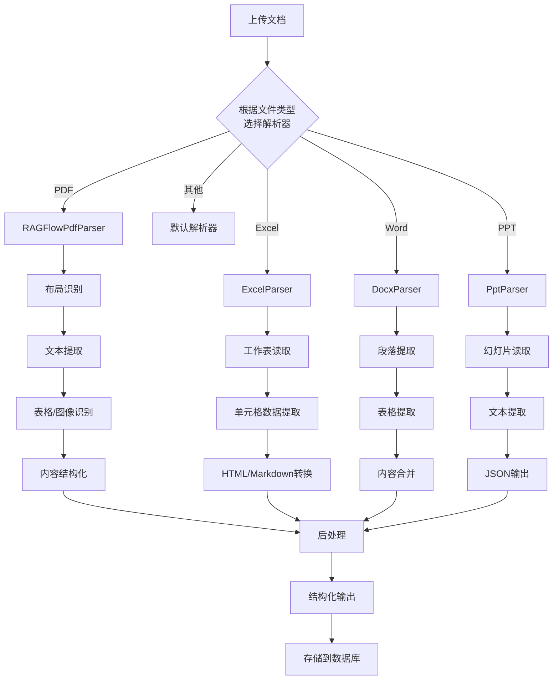

# 文档解析流程

<cite>
**本文档引用的文件**
- [parser.py](file://rag/flow/parser/parser.py)
- [schema.py](file://rag/flow/parser/schema.py)
- [pdf_parser.py](file://deepdoc/parser/pdf_parser.py)
- [excel_parser.py](file://deepdoc/parser/excel_parser.py)
- [docx_parser.py](file://deepdoc/parser/docx_parser.py)
- [tcadp_parser.py](file://deepdoc/parser/tcadp_parser.py)
- [base.py](file://rag/flow/base.py)
- [__init__.py](file://deepdoc/parser/__init__.py)
</cite>

## 目录
1. [简介](#简介)
2. [核心组件](#核心组件)
3. [解析流程](#解析流程)
4. [异常处理](#异常处理)
5. [完整生命周期示例](#完整生命周期示例)
6. [数据流图](#数据流图)

## 简介
文档解析流程是RAGFlow系统中的核心功能，负责将各种格式的原始文档转换为结构化的文本块。该流程以`rag/flow/parser/parser.py`中的`Parser`类作为统一入口，根据文档的MIME类型或文件扩展名调度到相应的具体解析器进行处理。整个流程包括预处理、内容提取、后处理和结构化输出四个阶段，确保不同格式的文档都能被准确解析并为后续的检索和生成任务提供高质量的输入。

## 核心组件

`Parser`类是文档解析流程的核心，它继承自`ProcessBase`类，作为统一的入口点处理所有文档解析任务。该类通过`ParserParam`类定义了各种文档类型的解析配置，包括允许的输出格式和默认设置。对于不同类型的文档，`Parser`类提供了专门的处理方法，如`_pdf`、`_spreadsheet`、`_word`等，这些方法根据配置选择合适的解析策略。

**Section sources**
- [parser.py](file://rag/flow/parser/parser.py#L229-L856)
- [base.py](file://rag/flow/base.py#L26-L64)

## 解析流程

文档解析流程分为四个主要阶段：预处理、内容提取、后处理和结构化输出。当文档被上传后，系统首先根据文件扩展名或MIME类型确定文档类型，然后调用相应的解析方法。例如，对于PDF文档，系统会根据配置选择`deepdoc`、`plain_text`、`mineru`或`tcadp parser`等不同的解析方法。

在内容提取阶段，不同的解析器采用不同的技术。`RAGFlowPdfParser`使用深度学习模型进行布局识别和内容提取，而`PlainParser`则直接从PDF中提取纯文本。对于表格和文档，系统使用专门的解析器如`ExcelParser`和`DocxParser`来处理复杂的结构化数据。

后处理阶段包括对提取内容的清理和优化，如去除页眉页脚、合并段落等。最后，系统将处理后的结果转换为指定的输出格式，如JSON或Markdown，并附加必要的元数据。

**Section sources**
- [parser.py](file://rag/flow/parser/parser.py#L232-L856)
- [pdf_parser.py](file://deepdoc/parser/pdf_parser.py#L51-L1502)
- [excel_parser.py](file://deepdoc/parser/excel_parser.py#L28-L224)
- [docx_parser.py](file://deepdoc/parser/docx_parser.py#L25-L140)

## 异常处理

系统在解析过程中实现了完善的异常处理机制。当解析失败时，系统会捕获异常并记录错误信息，同时根据配置决定是否使用默认值或继续执行。例如，在`TCADPParser`中，如果腾讯云API调用失败，系统会尝试重试，并在最终失败时抛出运行时异常。此外，系统还通过回调函数提供进度更新和错误通知，确保用户能够及时了解解析状态。

**Section sources**
- [parser.py](file://rag/flow/parser/parser.py#L51-L58)
- [tcadp_parser.py](file://deepdoc/parser/tcadp_parser.py#L156-L162)

## 完整生命周期示例

以上传PDF文档为例，完整的解析生命周期如下：用户上传PDF文件后，系统根据文件扩展名调用`_pdf`方法。该方法首先检查配置，确定使用`deepdoc`解析方法。然后，`RAGFlowPdfParser`被实例化并调用`parse_into_bboxes`方法，该方法使用OCR和布局识别技术将PDF页面转换为包含文本和位置信息的边界框列表。

接下来，系统根据配置决定是否附加表格和图像的上下文信息。最后，解析结果被转换为JSON格式并存储，供后续的分块和索引过程使用。在整个过程中，系统通过回调函数实时更新进度，确保用户能够跟踪解析状态。

**Section sources**
- [parser.py](file://rag/flow/parser/parser.py#L232-L379)
- [pdf_parser.py](file://deepdoc/parser/pdf_parser.py#L51-L1502)

## 数据流图

**Diagram sources**
- [parser.py](file://rag/flow/parser/parser.py#L232-L856)
- [pdf_parser.py](file://deepdoc/parser/pdf_parser.py#L51-L1502)
- [excel_parser.py](file://deepdoc/parser/excel_parser.py#L28-L224)
- [docx_parser.py](file://deepdoc/parser/docx_parser.py#L25-L140)
- [__init__.py](file://deepdoc/parser/__init__.py#L17-L26)