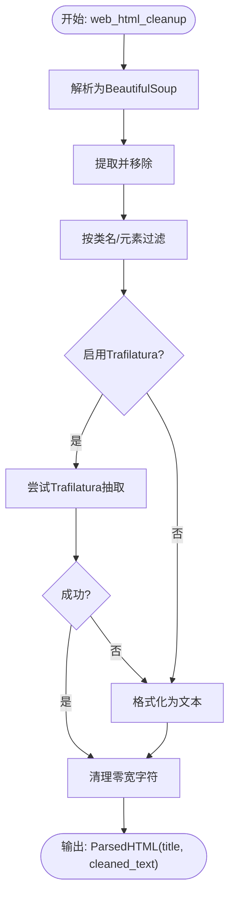

# 网页内容解析

<cite>
**本文引用的文件列表**
- [html_parser.py](file://deepdoc/parser/html_parser.py)
- [markdown_parser.py](file://deepdoc/parser/markdown_parser.py)
- [html_utils.py](file://common/data_source/html_utils.py)
- [config.py](file://common/data_source/config.py)
- [crawler.py](file://agent/tools/crawler.py)
- [document_app.py](file://api/apps/document_app.py)
- [web_utils.py](file://api/utils/web_utils.py)
- [utils.py](file://deepdoc/parser/utils.py)
</cite>

## 目录
1. [引言](#引言)
2. [项目结构与定位](#项目结构与定位)
3. [核心组件](#核心组件)
4. [架构总览](#架构总览)
5. [关键组件详解](#关键组件详解)
6. [依赖关系分析](#依赖关系分析)
7. [性能与可扩展性](#性能与可扩展性)
8. [故障排查指南](#故障排查指南)
9. [结论](#结论)
10. [附录：术语与最佳实践](#附录术语与最佳实践)

## 引言
本文件围绕网页内容解析展开，重点说明以下目标：
- 如何使用HTML解析库（BeautifulSoup或lxml风格的解析策略）从HTML中提取正文内容，并过滤掉导航栏、广告等噪音。
- 如何处理JavaScript动态加载的内容，使静态HTML也能被正确解析。
- 如何将Markdown语法转换为结构化文本，保留超链接与基础格式。
- 在解析过程中如何保留超链接与基本格式的重要性，以及如何对来自不同来源的网页内容进行标准化处理。

## 项目结构与定位
本项目的网页内容解析能力由多处模块协同完成：
- 深度文档解析层：提供HTML与Markdown解析器，负责结构化抽取与分块。
- 数据源清洗层：提供通用HTML清洗工具，支持基于类名/元素的过滤与链接策略配置。
- 爬虫与渲染层：通过异步爬虫与浏览器驱动，获取动态渲染后的页面内容。
- API与应用层：对外提供解析接口，统一返回标准化文本。

图表来源
- [crawler.py](file://agent/tools/crawler.py#L1-L75)
- [document_app.py](file://api/apps/document_app.py#L634-L662)
- [web_utils.py](file://api/utils/web_utils.py#L129-L177)
- [html_parser.py](file://deepdoc/parser/html_parser.py#L39-L214)
- [markdown_parser.py](file://deepdoc/parser/markdown_parser.py#L1-L322)
- [html_utils.py](file://common/data_source/html_utils.py#L1-L220)
- [config.py](file://common/data_source/config.py#L231-L251)

章节来源
- [html_parser.py](file://deepdoc/parser/html_parser.py#L39-L214)
- [markdown_parser.py](file://deepdoc/parser/markdown_parser.py#L1-L322)
- [html_utils.py](file://common/data_source/html_utils.py#L1-L220)
- [config.py](file://common/data_source/config.py#L231-L251)
- [crawler.py](file://agent/tools/crawler.py#L1-L75)
- [document_app.py](file://api/apps/document_app.py#L634-L662)
- [web_utils.py](file://api/utils/web_utils.py#L129-L177)

## 核心组件
- HTML解析器（DeepDoc）：以BeautifulSoup风格递归遍历DOM，过滤噪音标签与样式，按块合并并进行分词计数分块，同时保留表格原始HTML以便后续处理。
- Markdown解析器（DeepDoc）：支持表格抽取与分离、HTML表格识别、标题/代码块/列表/区块引用等结构化元素抽取，便于下游继续处理。
- 通用HTML清洗工具：基于类名与元素列表过滤，支持链接策略（剥离/转为Markdown），并提供Trafilatura回退方案。
- 配置常量：定义忽略类/元素、链接策略、是否启用Trafilatura等全局开关。
- 爬虫与渲染：Agent工具使用异步爬虫抓取页面；API应用使用Selenium驱动渲染JS后解析。
- 文本获取工具：统一编码检测与文本读取，确保解析输入稳定。

章节来源
- [html_parser.py](file://deepdoc/parser/html_parser.py#L39-L214)
- [markdown_parser.py](file://deepdoc/parser/markdown_parser.py#L1-L322)
- [html_utils.py](file://common/data_source/html_utils.py#L1-L220)
- [config.py](file://common/data_source/config.py#L231-L251)
- [crawler.py](file://agent/tools/crawler.py#L1-L75)
- [document_app.py](file://api/apps/document_app.py#L634-L662)
- [utils.py](file://deepdoc/parser/utils.py#L20-L33)

## 架构总览
下图展示从“请求URL”到“标准化正文”的端到端流程，包括静态HTML与动态渲染两种路径。

图表来源
- [document_app.py](file://api/apps/document_app.py#L634-L662)
- [web_utils.py](file://api/utils/web_utils.py#L129-L177)
- [html_parser.py](file://deepdoc/parser/html_parser.py#L39-L214)
- [markdown_parser.py](file://deepdoc/parser/markdown_parser.py#L1-L322)

## 关键组件详解

### HTML解析器（DeepDoc）
- 功能要点
  - 编码检测与文本读取：支持二进制与文件路径，自动检测编码并解码。
  - DOM遍历与噪音过滤：删除style/script/comment，清理内联样式，避免干扰正文。
  - 结构化提取：递归遍历元素，识别标题、段落、列表、表格等块级元素，生成带元信息的文本片段。
  - 合并与分块：按块合并文本，再依据token计数进行分块，保证下游模型输入长度可控。
  - 表格处理：表格以原始HTML形式保留，便于后续单独处理或转为纯文本。
- 关键流程（简化）

图表来源
- [html_parser.py](file://deepdoc/parser/html_parser.py#L39-L214)

章节来源
- [html_parser.py](file://deepdoc/parser/html_parser.py#L39-L214)
- [utils.py](file://deepdoc/parser/utils.py#L20-L33)

### Markdown解析器（DeepDoc）
- 功能要点
  - 表格抽取：支持标准/无边框Markdown表格与HTML表格的识别与抽取，可选择保留或渲染为HTML。
  - 结构化元素抽取：按标题、代码块、列表、区块引用、段落等逐段提取，保留行号元信息便于溯源。
  - 正则优化：针对包含“|”等特征的表格进行快速匹配，减少不必要的处理开销。
- 关键流程（简化）

图表来源
- [markdown_parser.py](file://deepdoc/parser/markdown_parser.py#L1-L322)

章节来源
- [markdown_parser.py](file://deepdoc/parser/markdown_parser.py#L1-L322)

### 通用HTML清洗工具与配置
- 功能要点
  - 标题提取与丢弃：从<title>提取标题后移除，避免正文污染。
  - 类名/元素过滤：根据配置忽略特定类名与元素（如导航、页脚、脚本等）。
  - 链接策略：支持剥离链接或转为Markdown链接，满足不同下游需求。
  - Trafilatura回退：当启用时优先使用Trafilatura抽取正文，失败则回退到BeautifulSoup策略。
  - 文本规范化：去除多余换行与空格，统一换行与空格行为，提升可读性。
- 关键流程（简化）

图表来源
- [html_utils.py](file://common/data_source/html_utils.py#L167-L220)
- [config.py](file://common/data_source/config.py#L231-L251)

章节来源
- [html_utils.py](file://common/data_source/html_utils.py#L1-L220)
- [config.py](file://common/data_source/config.py#L231-L251)

### 动态内容处理（JavaScript渲染）
- Agent工具链：使用异步爬虫抓取页面，支持代理与缓存绕过，直接返回清洗后的HTML或Markdown。
- API应用链：使用Selenium驱动打开URL，等待页面稳定后获取已渲染的page_source，交由HTML解析器处理。
- 浏览器驱动：提供URL有效性校验与浏览器初始化参数，确保渲染稳定性。

图表来源
- [crawler.py](file://agent/tools/crawler.py#L1-L75)
- [document_app.py](file://api/apps/document_app.py#L634-L662)
- [web_utils.py](file://api/utils/web_utils.py#L129-L177)

章节来源
- [crawler.py](file://agent/tools/crawler.py#L1-L75)
- [document_app.py](file://api/apps/document_app.py#L634-L662)
- [web_utils.py](file://api/utils/web_utils.py#L129-L177)

## 依赖关系分析
- 组件耦合
  - HTML解析器依赖BeautifulSoup风格的DOM遍历与token计数工具，用于块合并与分块。
  - Markdown解析器依赖正则表达式与结构化抽取逻辑，独立于HTML解析器。
  - HTML清洗工具依赖配置常量，支持灵活的过滤策略与链接策略。
  - 爬虫与渲染层通过Agent工具与API应用分别接入，形成两条内容来源路径。
- 外部依赖
  - BeautifulSoup（DOM解析）、Trafilatura（正文抽取回退）、Selenium（JS渲染）、AsyncWebCrawler（异步抓取）。

图表来源
- [html_parser.py](file://deepdoc/parser/html_parser.py#L39-L214)
- [markdown_parser.py](file://deepdoc/parser/markdown_parser.py#L1-L322)
- [html_utils.py](file://common/data_source/html_utils.py#L1-L220)
- [config.py](file://common/data_source/config.py#L231-L251)
- [crawler.py](file://agent/tools/crawler.py#L1-L75)
- [document_app.py](file://api/apps/document_app.py#L634-L662)

章节来源
- [html_parser.py](file://deepdoc/parser/html_parser.py#L39-L214)
- [markdown_parser.py](file://deepdoc/parser/markdown_parser.py#L1-L322)
- [html_utils.py](file://common/data_source/html_utils.py#L1-L220)
- [config.py](file://common/data_source/config.py#L231-L251)
- [crawler.py](file://agent/tools/crawler.py#L1-L75)
- [document_app.py](file://api/apps/document_app.py#L634-L662)

## 性能与可扩展性
- 性能特性
  - HTML解析器采用递归遍历与块合并策略，结合token计数分块，适合大文档的分段处理。
  - Markdown解析器对表格进行预扫描与快速匹配，减少不必要的正则开销。
  - HTML清洗工具提供Trafilatura回退，提高正文抽取鲁棒性。
- 可扩展点
  - 链接策略与忽略元素/类名可通过环境变量配置，便于适配不同站点。
  - 支持切换解析后端（如lxml）以满足更高性能需求。
  - 可扩展表格渲染策略，将表格转为Markdown或纯文本以适配下游任务。

[本节为通用建议，不直接分析具体文件]

## 故障排查指南
- URL无效
  - 现象：API返回URL格式无效。
  - 排查：确认URL格式与域名可达性，检查私有IP限制。
  - 参考
    - [web_utils.py](file://api/utils/web_utils.py#L154-L169)
- 渲染超时或空白页面
  - 现象：Selenium驱动无法稳定等待页面加载。
  - 排查：增加超时时间、检查网络与反爬策略、确认页面是否需要登录。
  - 参考
    - [web_utils.py](file://api/utils/web_utils.py#L129-L177)
    - [document_app.py](file://api/apps/document_app.py#L634-L662)
- 解析结果为空
  - 现象：Trafilatura返回空内容，回退到BeautifulSoup仍为空。
  - 排查：检查页面是否包含有效正文、是否被反爬/验证码拦截。
  - 参考
    - [html_utils.py](file://common/data_source/html_utils.py#L202-L219)
- 链接丢失或格式异常
  - 现象：链接未保留或格式不一致。
  - 排查：检查链接策略配置，确认是否启用Markdown链接转换。
  - 参考
    - [html_utils.py](file://common/data_source/html_utils.py#L38-L49)
    - [config.py](file://common/data_source/config.py#L238-L241)

章节来源
- [web_utils.py](file://api/utils/web_utils.py#L129-L177)
- [document_app.py](file://api/apps/document_app.py#L634-L662)
- [html_utils.py](file://common/data_source/html_utils.py#L38-L49)
- [config.py](file://common/data_source/config.py#L238-L241)

## 结论
本项目通过“HTML解析器 + Markdown解析器 + 通用HTML清洗工具 + 爬虫与渲染层”的组合，实现了对网页正文的高效提取与标准化处理。其优势在于：
- 使用BeautifulSoup风格的DOM遍历与块合并策略，兼顾准确性与可读性。
- 提供Trafilatura回退与链接策略配置，增强对复杂页面的适应性。
- 对表格与结构化元素进行保留与抽取，便于下游任务复用。
- 通过Agent工具与API应用两条路径，覆盖静态与动态内容场景。

[本节为总结性内容，不直接分析具体文件]

## 附录：术语与最佳实践
- 术语
  - 噪音标签：导航栏、页脚、广告、脚本、样式等非正文内容。
  - 表格HTML：保留原始表格结构，便于后续转为Markdown或纯文本。
  - 链接策略：剥离链接或转为Markdown链接，影响下游可读性与可追溯性。
- 最佳实践
  - 在解析前统一进行URL校验与页面稳定性判断。
  - 对动态页面优先使用渲染驱动或异步爬虫，确保JS执行完成。
  - 根据下游任务选择合适的链接策略与表格处理方式。
  - 对大文档采用分块策略，控制token数量，提升检索与生成效率。

[本节为通用指导，不直接分析具体文件]