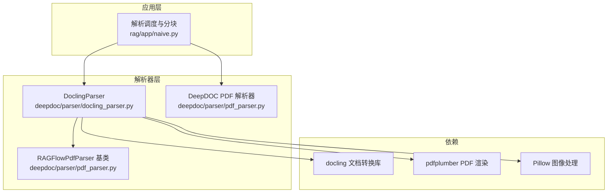
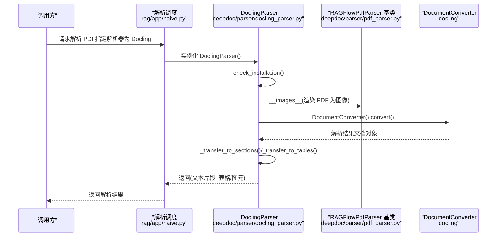
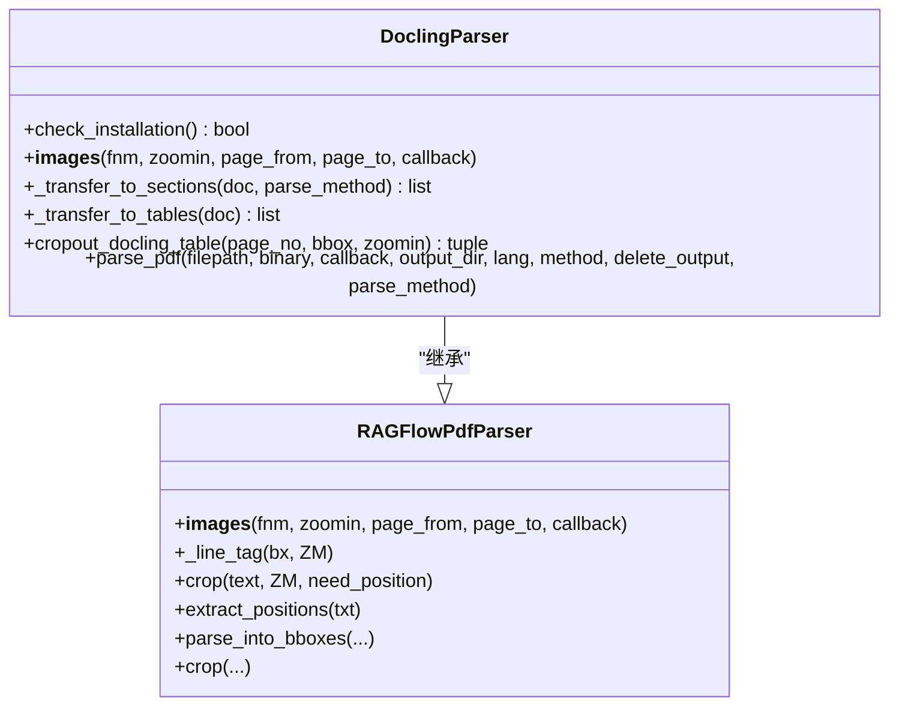
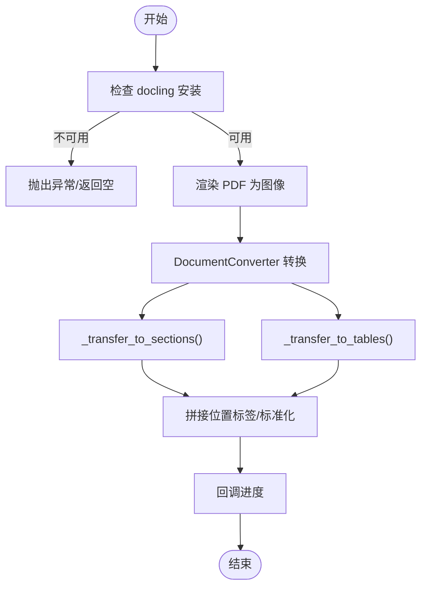
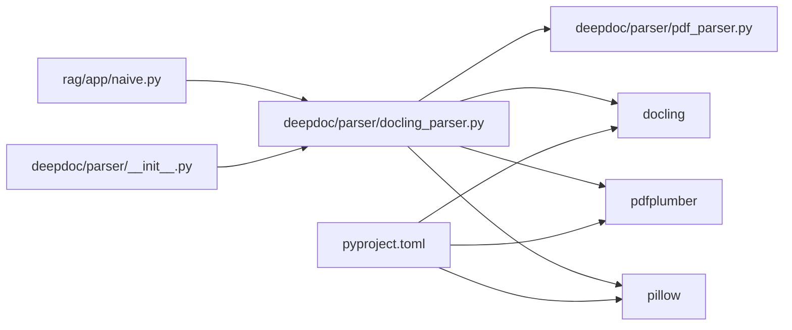

# 通用文档解析器

<cite>
**本文引用的文件列表**
- [docling_parser.py](file://deepdoc/parser/docling_parser.py)
- [pdf_parser.py](file://deepdoc/parser/pdf_parser.py)
- [naive.py](file://rag/app/naive.py)
- [__init__.py](file://deepdoc/parser/__init__.py)
- [pyproject.toml](file://pyproject.toml)
- [README.md](file://README.md)
</cite>

## 目录
1. [简介](#简介)
2. [项目结构](#项目结构)
3. [核心组件](#核心组件)
4. [架构总览](#架构总览)
5. [详细组件分析](#详细组件分析)
6. [依赖关系分析](#依赖关系分析)
7. [性能考量](#性能考量)
8. [故障排查指南](#故障排查指南)
9. [结论](#结论)
10. [附录](#附录)

## 简介
本文件围绕通用文档解析器的设计与实现展开，重点聚焦于 deepdoc 模块中的 DoclingParser 组件。该组件旨在作为统一接口或后备解析器，为 ragflow 核心解析器尚不直接支持的文件格式提供统一的解析能力。通过调用外部工具（如 Apache Tika 或 Docling），DoclingParser 能够将复杂文档转换为结构化文本片段与表格图像，从而融入 ragflow 的后续处理流程（分块、嵌入、检索等）。本文将从系统架构、组件职责、数据流、性能与错误处理等方面进行深入分析，并给出实践建议与排障指引。

## 项目结构
- DoclingParser 位于 deepdoc/parser/docling_parser.py，继承自 PDF 解析基类 RAGFlowPdfParser，复用其布局识别、表格/图元提取、位置标注等能力。
- 在 rag/app/naive.py 中，DoclingParser 作为可选解析引擎之一被接入到整体解析管线，与 DeepDOC、MinerU、TCADP、纯文本/视觉模型等并列。
- deepdoc/parser/__init__.py 提供解析器的统一导出入口，便于上层模块按需导入。
- pyproject.toml 中包含对 docling、pdfplumber、pillow 等依赖的声明，确保运行时可用性。
- README.md 明确了 Docling 作为文档解析方法的支持状态。

**图表来源**
- [docling_parser.py](file://deepdoc/parser/docling_parser.py#L58-L341)
- [pdf_parser.py](file://deepdoc/parser/pdf_parser.py#L51-L1499)
- [naive.py](file://rag/app/naive.py#L97-L113)

**章节来源**
- [docling_parser.py](file://deepdoc/parser/docling_parser.py#L58-L341)
- [pdf_parser.py](file://deepdoc/parser/pdf_parser.py#L51-L1499)
- [naive.py](file://rag/app/naive.py#L97-L113)
- [__init__.py](file://deepdoc/parser/__init__.py#L17-L39)
- [pyproject.toml](file://pyproject.toml#L70-L80)
- [README.md](file://README.md#L85-L95)

## 核心组件
- DoclingParser：继承自 RAGFlowPdfParser，负责：
  - 安装检测与初始化校验（docling 可用性）
  - 将 PDF 渲染为页面图像（用于表格/图元裁剪与可视化）
  - 使用 DocumentConverter 执行文档解析，产出文本段落与公式
  - 将解析结果映射为统一的“文本片段 + 位置标签”的结构，便于后续分块与检索
  - 提取表格与图片，生成 HTML 表格与裁剪后的图像，附带位置信息
- RAGFlowPdfParser：通用 PDF 解析基类，提供：
  - 页面图像渲染、OCR、布局识别、表格结构识别、文本合并与排序、位置标注、裁剪等通用能力
- naive.py：解析调度入口，根据配置选择解析器（DeepDOC、MinerU、Docling、TCADP、纯文本/视觉模型）

关键职责边界：
- DoclingParser 专注于“通用文档解析 + 表格/图元提取”，并将结果标准化为统一的数据结构，便于上层分块与嵌入。
- RAGFlowPdfParser 提供底层 PDF 处理能力，DoclingParser 在此基础上复用其图像与位置标注逻辑。

**章节来源**
- [docling_parser.py](file://deepdoc/parser/docling_parser.py#L58-L341)
- [pdf_parser.py](file://deepdoc/parser/pdf_parser.py#L51-L1499)
- [naive.py](file://rag/app/naive.py#L97-L113)

## 架构总览
DoclingParser 在系统中的角色定位如下：
- 作为“通用/后备解析器”：当核心解析器无法直接处理某些格式或需要更强的结构化提取能力时，DoclingParser 可作为替代方案。
- 与现有 PDF 流程无缝衔接：继承自 RAGFlowPdfParser，复用其页面图像、位置标注、裁剪等能力，避免重复实现。
- 与上层分块/嵌入流程解耦：输出统一的文本片段与表格/图元，便于后续 token 化、分块与向量化。

**图表来源**
- [naive.py](file://rag/app/naive.py#L97-L113)
- [docling_parser.py](file://deepdoc/parser/docling_parser.py#L281-L341)
- [pdf_parser.py](file://deepdoc/parser/pdf_parser.py#L1040-L1188)

## 详细组件分析

### DoclingParser 类设计与职责
- 继承关系：DoclingParser(RAGFlowPdfParser)，复用页面图像、位置标注、裁剪等能力。
- 关键方法：
  - check_installation：检查 docling 是否可导入并能初始化
  - __images__：使用 pdfplumber 渲染 PDF 为图像，供表格/图元裁剪与可视化
  - _transfer_to_sections：从解析结果中抽取文本与公式，生成带位置标签的片段
  - _transfer_to_tables：从解析结果中抽取表格与图片，生成 HTML 表格与裁剪图像
  - crop/cropout_docling_table：基于位置信息裁剪表格/图元，生成可视化图像
  - parse_pdf：主入口，完成安装检查、图像渲染、文档转换、结果组织与回调通知

**图表来源**
- [docling_parser.py](file://deepdoc/parser/docling_parser.py#L58-L341)
- [pdf_parser.py](file://deepdoc/parser/pdf_parser.py#L1040-L1499)

**章节来源**
- [docling_parser.py](file://deepdoc/parser/docling_parser.py#L58-L341)

### 数据流与处理逻辑
- 输入：PDF 文件路径或二进制流
- 处理步骤：
  1) 安装检测：若 docling 不可用则抛错或返回空结果
  2) 渲染页面图像：用于表格/图元裁剪与可视化
  3) 文档转换：调用 DocumentConverter 执行解析
  4) 结果映射：抽取文本/公式为片段，抽取表格/图片为 HTML 与图像
  5) 回调通知：阶段性进度反馈
  6) 输出：(文本片段列表, 表格/图元列表)

**图表来源**
- [docling_parser.py](file://deepdoc/parser/docling_parser.py#L281-L341)

**章节来源**
- [docling_parser.py](file://deepdoc/parser/docling_parser.py#L281-L341)

### 与专用解析器的对比与优缺点
- 与 DeepDOC PDF 解析器对比：
  - 优点：DoclingParser 更侧重“通用文档结构化”，适合复杂版式、公式较多的文档；同时具备表格/图元的 HTML 与图像输出，便于后续增强。
  - 缺点：DeepDOC 在中文排版、表格结构识别、位置标注等方面经过深度优化，对中文 PDF 的效果通常更稳定。
- 与 MinerU/TCADP 对比：
  - DoclingParser 无需云端服务密钥，本地即可运行；MinerU/TCADP 需要特定模型或云服务配置。
  - DoclingParser 适合离线环境或对隐私敏感的场景；MinerU/TCADP 在多语言、复杂版式方面可能更强大。
- 与纯文本/视觉模型对比：
  - DoclingParser 保留结构化信息（文本、公式、表格、图元），适合需要结构化检索与溯源的场景。
  - 纯文本/视觉模型更适合大段内容的快速理解，但会丢失结构化细节。

**章节来源**
- [naive.py](file://rag/app/naive.py#L97-L113)
- [pdf_parser.py](file://deepdoc/parser/pdf_parser.py#L1040-L1499)

## 依赖关系分析
- 运行时依赖：
  - docling：文档转换核心库
  - pdfplumber：PDF 页面渲染为图像
  - pillow：图像处理与裁剪
- 项目依赖声明：
  - pyproject.toml 中声明了 docling、pdfplumber、pillow 等依赖，确保安装后可用
- 导出与使用：
  - deepdoc/parser/__init__.py 导出 PdfParser 等解析器，便于上层按需导入
  - rag/app/naive.py 通过 PARSERS 字典选择 DoclingParser

**图表来源**
- [naive.py](file://rag/app/naive.py#L97-L113)
- [docling_parser.py](file://deepdoc/parser/docling_parser.py#L58-L341)
- [pdf_parser.py](file://deepdoc/parser/pdf_parser.py#L51-L1499)
- [__init__.py](file://deepdoc/parser/__init__.py#L17-L39)
- [pyproject.toml](file://pyproject.toml#L70-L80)

**章节来源**
- [pyproject.toml](file://pyproject.toml#L70-L80)
- [__init__.py](file://deepdoc/parser/__init__.py#L17-L39)
- [naive.py](file://rag/app/naive.py#L97-L113)

## 性能考量
- 安装与初始化：
  - DoclingParser 在首次使用前执行安装检测，若失败会记录警告并中断流程，避免无效尝试
- 图像渲染：
  - 使用 pdfplumber 将 PDF 渲染为图像，分辨率与缩放参数会影响内存与速度；默认缩放为 1，可根据需求调整
- 文档转换：
  - DocumentConverter 的转换时间取决于文档复杂度与页面数量；建议在批量处理时控制并发与回调频率
- 结果组织：
  - 文本片段与表格/图元的抽取与拼接存在 O(n) 复杂度，注意在大数据量场景下进行分页与增量处理
- 依赖库：
  - docling、pdfplumber、pillow 的版本与平台兼容性会影响性能与稳定性，建议在生产环境中锁定版本

[本节为通用性能讨论，不直接分析具体文件]

## 故障排查指南
- Docling 未安装或初始化失败：
  - 现象：check_installation 返回 False 或抛出异常
  - 排查：确认 docling 已安装且可导入；查看日志中的错误信息
  - 处理：按照提示安装 docling 后重试
- PDF 渲染失败：
  - 现象：渲染阶段抛出异常，page_images 为空
  - 排查：检查输入路径或二进制流是否有效；确认 pdfplumber 可用
  - 处理：修正输入或降级为其他解析器
- 文档转换异常：
  - 现象：DocumentConverter 初始化或转换失败
  - 排查：查看异常堆栈；确认文档格式是否受支持
  - 处理：更换解析器或修复文档格式
- 表格/图元裁剪失败：
  - 现象：cropout_docling_table 返回空或异常
  - 排查：检查位置信息与页面索引范围；确认 page_images 是否存在
  - 处理：回退到文本片段或采用其他提取策略

**章节来源**
- [docling_parser.py](file://deepdoc/parser/docling_parser.py#L67-L76)
- [docling_parser.py](file://deepdoc/parser/docling_parser.py#L78-L90)
- [docling_parser.py](file://deepdoc/parser/docling_parser.py#L316-L321)
- [docling_parser.py](file://deepdoc/parser/docling_parser.py#L211-L238)

## 结论
DoclingParser 作为通用文档解析器，在 ragflow 中承担了“统一接口/后备解析器”的角色，通过调用 docling 实现对复杂文档的结构化提取，并与现有 PDF 解析体系（RAGFlowPdfParser）深度融合。它在结构化输出、表格/图元可视化方面具有优势，适合对结构化检索与溯源有较高要求的场景。结合 naive.py 的解析调度机制，用户可在不同解析器之间灵活切换，以获得最佳的准确性与性能平衡。

[本节为总结性内容，不直接分析具体文件]

## 附录
- 使用建议：
  - 在需要结构化输出与表格/图元可视化的场景优先考虑 DoclingParser
  - 对中文 PDF 的稳定性与中文排版适配，DeepDOC 可能更合适
  - 在离线或隐私敏感场景，优先选择 DoclingParser 以避免云端依赖
- 相关文件参考：
  - [docling_parser.py](file://deepdoc/parser/docling_parser.py#L58-L341)
  - [pdf_parser.py](file://deepdoc/parser/pdf_parser.py#L51-L1499)
  - [naive.py](file://rag/app/naive.py#L97-L113)
  - [__init__.py](file://deepdoc/parser/__init__.py#L17-L39)
  - [pyproject.toml](file://pyproject.toml#L70-L80)
  - [README.md](file://README.md#L85-L95)