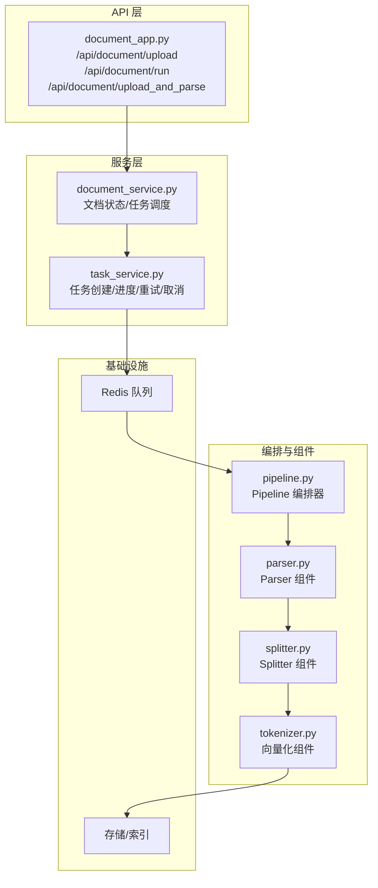
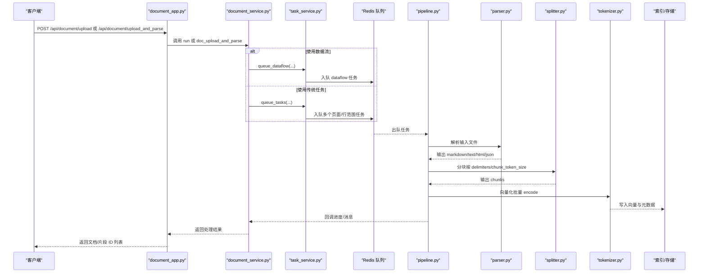
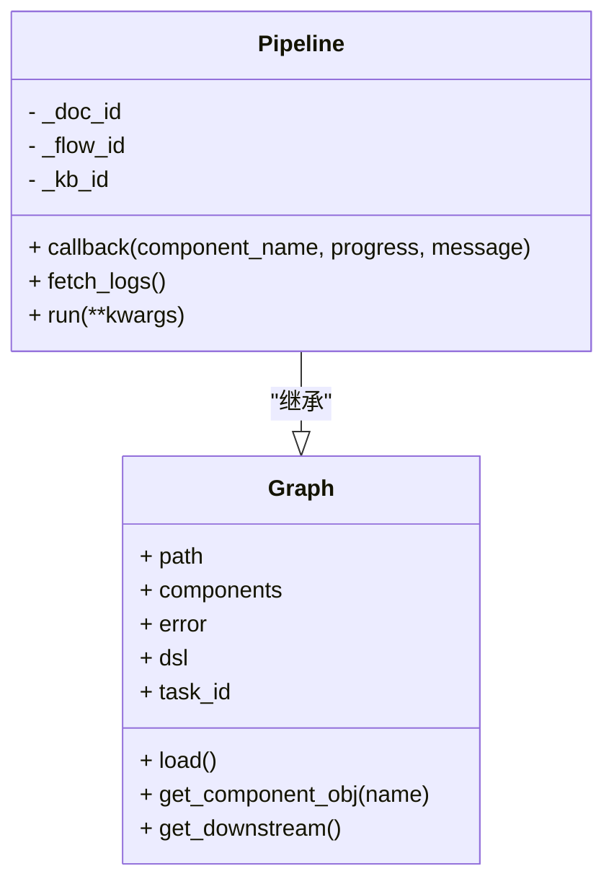
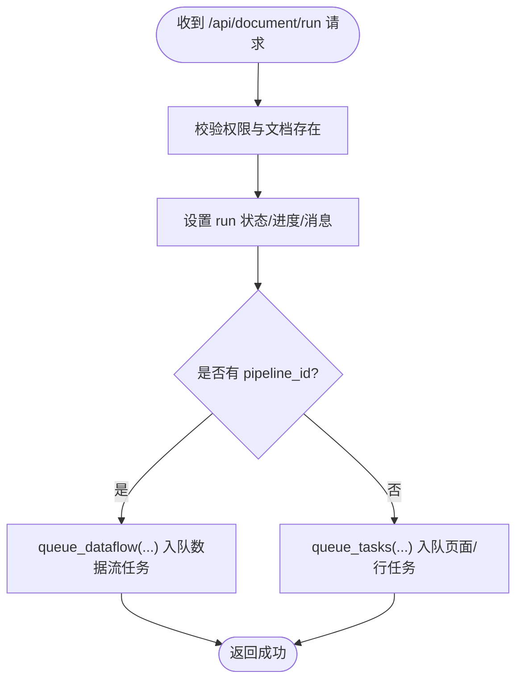
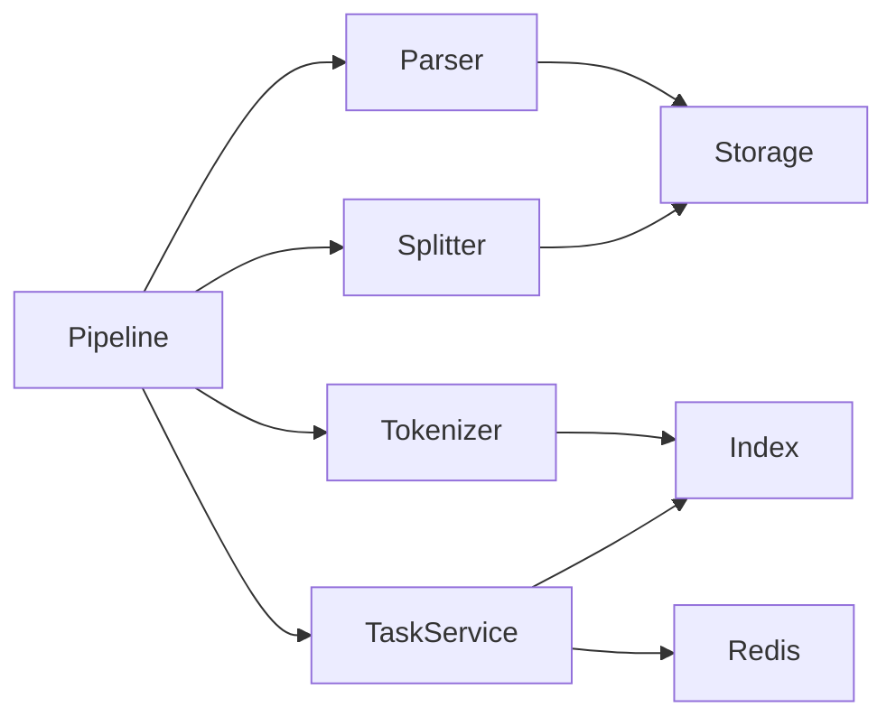
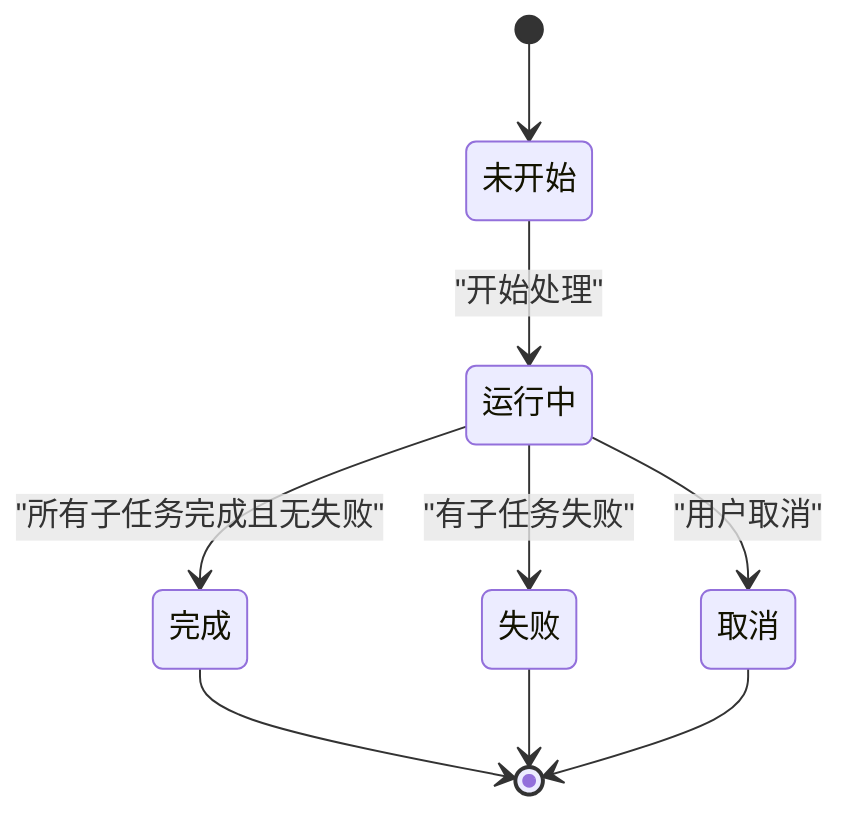

# 流水线协调

<cite>
**本文引用的文件列表**
- [document_app.py](file://api/apps/document_app.py)
- [document_service.py](file://api/db/services/document_service.py)
- [task_service.py](file://api/db/services/task_service.py)
- [pipeline.py](file://rag/flow/pipeline.py)
- [parser.py](file://rag/flow/parser/parser.py)
- [splitter.py](file://rag/flow/splitter/splitter.py)
- [tokenizer.py](file://rag/flow/tokenizer/tokenizer.py)
- [constants.py](file://common/constants.py)
- [embedding_model.py](file://rag/llm/embedding_model.py)
</cite>

## 目录
1. [简介](#简介)
2. [项目结构与入口](#项目结构与入口)
3. [核心组件](#核心组件)
4. [架构总览](#架构总览)
5. [详细组件分析](#详细组件分析)
6. [依赖关系分析](#依赖关系分析)
7. [性能与并发特性](#性能与并发特性)
8. [故障排查与重试策略](#故障排查与重试策略)
9. [结论](#结论)

## 简介
本文件围绕“流水线协调机制”展开，系统性说明 Pipeline 类如何作为编排器（orchestrator），协调 Parser（解析）、Splitter（分块）与向量化（Embedding）等组件的执行流程；并解释文档上传 API（如 /api/document/upload 和 /api/document/upload_and_parse）如何触发整条流水线，以及如何通过 document_service.py 管理任务状态。同时给出状态机定义、错误与重试处理策略，以及从上传到最终索引的完整时序图。

## 项目结构与入口
- 文档上传与运行入口：
  - Web API：/api/document/upload（上传文件后返回文件信息）
  - Web API：/api/document/run（启动或取消某文档的处理任务）
  - Web API：/api/document/upload_and_parse（直接上传并解析，返回文档片段 ID 列表）
- 后端服务：
  - document_app.py 提供上述 API
  - document_service.py 负责文档元数据、状态更新、任务队列调度
  - task_service.py 负责任务创建、进度更新、重试与取消
  - rag/flow/pipeline.py 定义流水线编排器，按组件顺序异步执行
  - 具体组件：parser.py、splitter.py、tokenizer.py（向量化）

图表来源
- [document_app.py](file://api/apps/document_app.py#L402-L451)
- [document_service.py](file://api/db/services/document_service.py#L826-L846)
- [task_service.py](file://api/db/services/task_service.py#L326-L431)
- [pipeline.py](file://rag/flow/pipeline.py#L117-L176)
- [parser.py](file://rag/flow/parser/parser.py#L1-L200)
- [splitter.py](file://rag/flow/splitter/splitter.py#L1-L161)
- [tokenizer.py](file://rag/flow/tokenizer/tokenizer.py#L79-L180)

章节来源
- [document_app.py](file://api/apps/document_app.py#L402-L451)
- [document_service.py](file://api/db/services/document_service.py#L826-L846)
- [task_service.py](file://api/db/services/task_service.py#L326-L431)
- [pipeline.py](file://rag/flow/pipeline.py#L117-L176)

## 核心组件
- Pipeline 编排器
  - 负责按组件路径顺序异步调用各组件，收集日志与进度，支持取消与错误传播
- Parser 组件
  - 基于文件类型与配置选择解析策略（PDF/Excel/Docx/PPT/图片/音频/邮件等），输出多种格式
- Splitter 组件
  - 将解析后的文本/HTML/JSON 结果按分隔符与 token 数进行切分，支持重叠与自定义模式
- 向量化组件（Tokenizer）
  - 对切分后的文本批量编码，生成向量并写入文档索引，统计 token 消耗

章节来源
- [pipeline.py](file://rag/flow/pipeline.py#L117-L176)
- [parser.py](file://rag/flow/parser/parser.py#L1-L200)
- [splitter.py](file://rag/flow/splitter/splitter.py#L1-L161)
- [tokenizer.py](file://rag/flow/tokenizer/tokenizer.py#L79-L180)

## 架构总览
流水线从 API 触发开始，经由 document_service 的 run 方法决定使用数据流（dataflow）还是传统任务队列（queue_tasks），随后通过 Redis 队列投递任务给 Pipeline 执行器，Pipeline 串行调用 Parser、Splitter、Tokenizer 等组件，期间通过 TaskService 更新进度与消息，最终将向量化的文档写入索引。

图表来源
- [document_app.py](file://api/apps/document_app.py#L402-L451)
- [document_service.py](file://api/db/services/document_service.py#L826-L846)
- [task_service.py](file://api/db/services/task_service.py#L326-L431)
- [pipeline.py](file://rag/flow/pipeline.py#L117-L176)
- [parser.py](file://rag/flow/parser/parser.py#L1-L200)
- [splitter.py](file://rag/flow/splitter/splitter.py#L1-L161)
- [tokenizer.py](file://rag/flow/tokenizer/tokenizer.py#L79-L180)

## 详细组件分析

### Pipeline 编排器（Pipeline）
- 职责
  - 从 DSL 加载组件与路径，按顺序异步调用下游组件
  - 收集组件回调日志，计算整体进度，支持取消与错误传播
- 关键行为
  - 初始化时记录 doc_id/kb_id，便于进度与日志关联
  - callback 中根据组件名与进度更新 Redis 日志与 TaskService 进度
  - run 中首次节点若未设置路径则先执行 File 节点，然后扩展下游路径并循环执行
  - 若任一组件报错，立即设置错误并回调，停止后续执行
- 取消与错误
  - 每次回调检查取消标记，必要时抛出异常中断
  - 错误时将进度置为失败并写入消息

图表来源
- [pipeline.py](file://rag/flow/pipeline.py#L1-L176)

章节来源
- [pipeline.py](file://rag/flow/pipeline.py#L117-L176)

### Parser 组件
- 功能
  - 根据文件类型与配置选择解析方法（DeepDOC/Plain/TCADP/VLM/OCR 等）
  - 输出多种格式（json/markdown/text/html），用于下游 Splitter
- 关键参数
  - parse_method、output_format、table_context_size、image_context_size、lang 等
- 输出变量
  - markdown、text、html、json 等，供下游组件引用

章节来源
- [parser.py](file://rag/flow/parser/parser.py#L1-L200)

### Splitter 组件
- 功能
  - 将解析结果按分隔符与 token 数进行切分，支持重叠与自定义正则分隔
  - 对含图片的 PDF，提取位置信息并回写图片 ID
- 关键参数
  - chunk_token_size、delimiters、overlapped_percent、children_delimiters
- 输出
  - chunks（包含 text、image、positions 等字段）

章节来源
- [splitter.py](file://rag/flow/splitter/splitter.py#L1-L161)

### 向量化组件（Tokenizer）
- 功能
  - 批量对切分后的文本进行编码，生成向量并写入文档索引
  - 记录 token 消耗，支持标题权重混合
- 关键逻辑
  - 分批 encode，累积 token_count
  - 为每个 chunk 写入 q_%d_vec 字段
  - 回调进度并设置输出 chunks

章节来源
- [tokenizer.py](file://rag/flow/tokenizer/tokenizer.py#L79-L180)
- [embedding_model.py](file://rag/llm/embedding_model.py#L72-L99)

### API 与任务调度（document_app.py 与 document_service.py）
- /api/document/upload
  - 校验权限与文件合法性，上传到存储并返回文件列表
- /api/document/run
  - 设置文档 run 状态，必要时清理历史任务与索引，调用 DocumentService.run 启动流水线
- /api/document/upload_and_parse
  - 直接上传并解析，返回片段 ID 列表
- DocumentService.run
  - 若存在 pipeline_id，则使用 queue_dataflow 投递数据流任务
  - 否则根据文件类型调用 queue_tasks 创建任务并入队
- 任务重试与取消
  - TaskService.get_task 在超过最大重试次数时标记失败
  - has_canceled/queue_dataflow 支持取消标记

图表来源
- [document_app.py](file://api/apps/document_app.py#L402-L451)
- [document_service.py](file://api/db/services/document_service.py#L826-L846)
- [task_service.py](file://api/db/services/task_service.py#L326-L431)

章节来源
- [document_app.py](file://api/apps/document_app.py#L402-L451)
- [document_service.py](file://api/db/services/document_service.py#L826-L846)
- [task_service.py](file://api/db/services/task_service.py#L326-L431)

## 依赖关系分析
- 组件耦合
  - Pipeline 依赖 Graph（加载组件与路径），并通过回调与 TaskService 交互
  - Parser/Splitter/Tokenizer 通过上游输出变量进行数据传递
- 外部依赖
  - Redis 队列：任务入队与取消标记
  - 存储与索引：文件与向量写入
  - LLM/Embedding：向量化模型封装

图表来源
- [pipeline.py](file://rag/flow/pipeline.py#L117-L176)
- [parser.py](file://rag/flow/parser/parser.py#L1-L200)
- [splitter.py](file://rag/flow/splitter/splitter.py#L1-L161)
- [tokenizer.py](file://rag/flow/tokenizer/tokenizer.py#L79-L180)
- [task_service.py](file://api/db/services/task_service.py#L326-L431)

章节来源
- [pipeline.py](file://rag/flow/pipeline.py#L117-L176)
- [task_service.py](file://api/db/services/task_service.py#L326-L431)

## 性能与并发特性
- 并发执行
  - Pipeline 在每一步调用下游组件时使用异步 gather 并发执行
  - Splitter 对图片 ID 转换也采用并发
- 批量向量化
  - Tokenizer 以固定 batch_size 批量编码，减少调用开销
- 任务重用优化
  - queue_tasks 会尝试复用之前任务的 chunk_ids，避免重复计算
- 进度与日志
  - Pipeline 将组件 trace 写入 Redis，便于前端展示与调试

章节来源
- [pipeline.py](file://rag/flow/pipeline.py#L117-L176)
- [splitter.py](file://rag/flow/splitter/splitter.py#L133-L161)
- [tokenizer.py](file://rag/flow/tokenizer/tokenizer.py#L79-L180)
- [task_service.py](file://api/db/services/task_service.py#L326-L431)

## 故障排查与重试策略
- 状态机
  - 未开始（UNSTART）、运行中（RUNNING）、取消（CANCEL）、完成（DONE）、失败（FAIL）、调度（SCHEDULE）
- 重试
  - TaskService.get_task 在超过最大重试次数时标记失败并终止
- 取消
  - has_canceled 检查取消标记，Pipeline 在回调中检测并抛出异常中断
- 进度同步
  - DocumentService._sync_progress 会聚合子任务进度，处理特殊任务冻结进度场景

图表来源
- [constants.py](file://common/constants.py#L79-L86)
- [task_service.py](file://api/db/services/task_service.py#L139-L141)
- [document_service.py](file://api/db/services/document_service.py#L685-L743)

章节来源
- [constants.py](file://common/constants.py#L79-L86)
- [task_service.py](file://api/db/services/task_service.py#L139-L141)
- [document_service.py](file://api/db/services/document_service.py#L685-L743)

## 结论
该流水线以 Pipeline 为核心编排器，串联 Parser、Splitter、Tokenizer 等组件，结合 Redis 队列与 TaskService 实现可观察、可重试、可取消的任务执行。API 层负责触发与状态反馈，服务层负责任务调度与进度聚合，最终将向量化后的文档写入索引，形成从上传到检索可用的完整闭环。