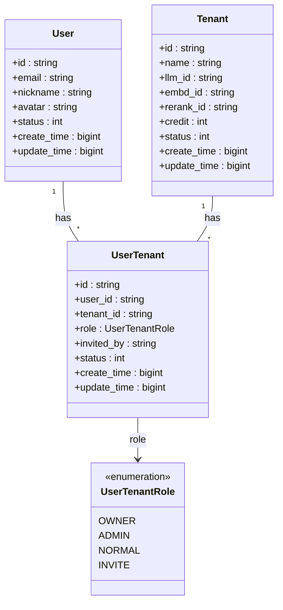
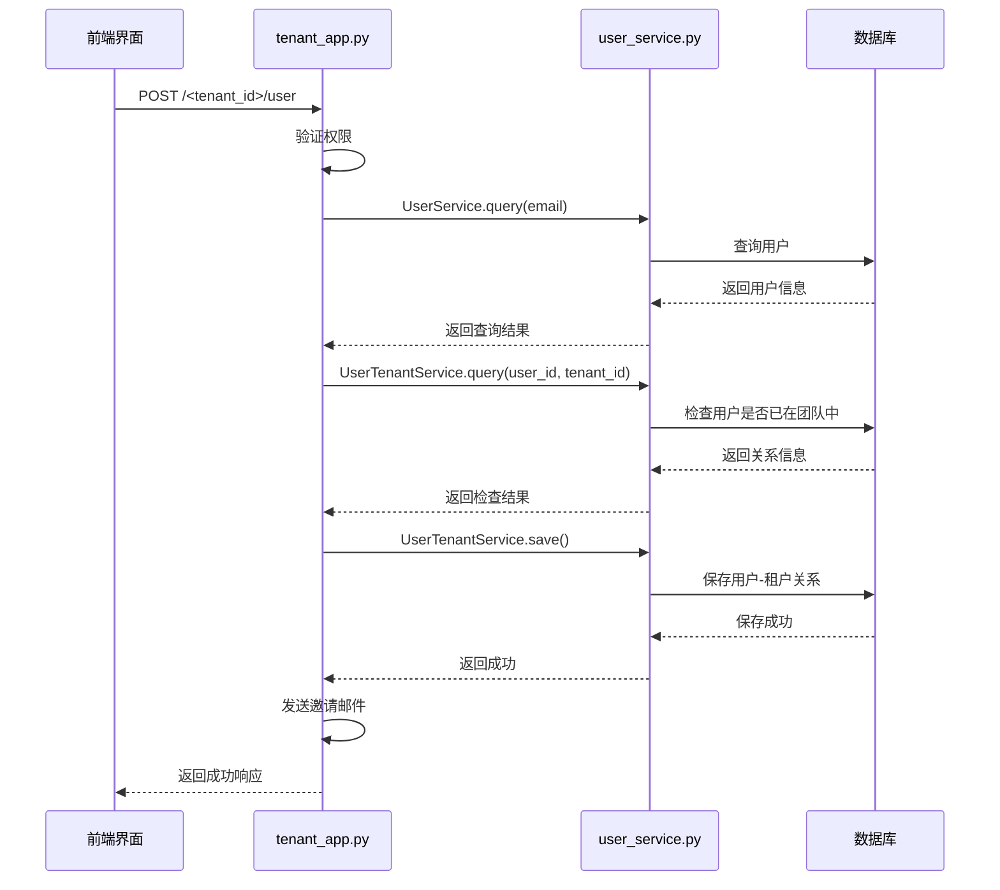
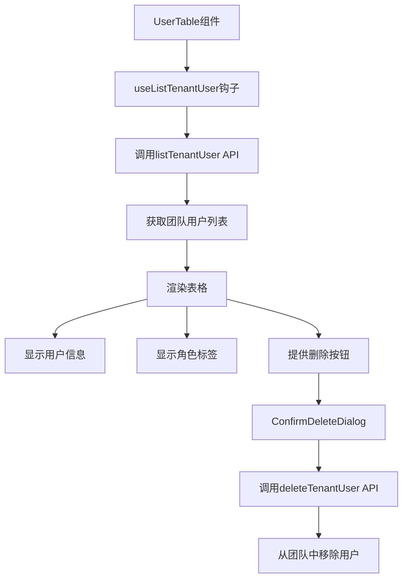
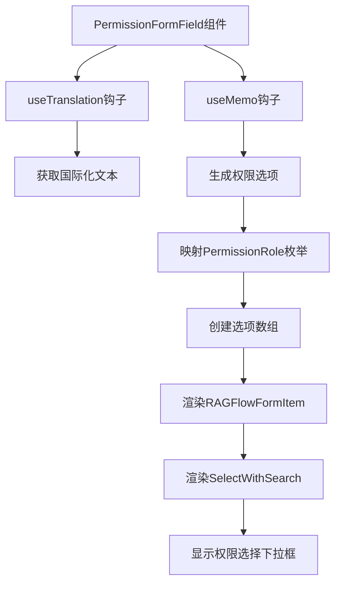

# 团队共享

<cite>
**本文档中引用的文件**  
- [tenant_app.py](file://api/apps/tenant_app.py)
- [user_service.py](file://api/db/services/user_service.py)
- [user-table.tsx](file://web/src/pages/user-setting/setting-team/user-table.tsx)
- [permission-form-field.tsx](file://web/src/pages/dataset/dataset-setting/permission-form-field.tsx)
- [db_models.py](file://api/db/db_models.py)
- [__init__.py](file://api/db/__init__.py)
</cite>

## 目录
1. [简介](#简介)
2. [权限模型](#权限模型)
3. [后端API与服务](#后端api与服务)
4. [前端组件实现](#前端组件实现)
5. [团队共享操作指南](#团队共享操作指南)
6. [常见问题与故障排除](#常见问题与故障排除)
7. [结论](#结论)

## 简介
RAGFlow系统提供了一套完整的团队共享功能，允许用户基于租户（Tenant）和用户角色来管理知识库的访问权限。该系统实现了多租户架构，支持创建团队、邀请成员、分配角色和管理不同级别的访问权限。本文档详细解释了基于租户和用户角色的权限模型，以及如何实现知识库的共享功能。

**Section sources**
- [tenant_app.py](file://api/apps/tenant_app.py#L1-L140)
- [user_service.py](file://api/db/services/user_service.py#L1-L320)

## 权限模型
RAGFlow系统的权限模型基于租户（Tenant）和用户角色的概念，通过多对多关系表UserTenant来管理用户与租户之间的关联。系统定义了四种用户角色：所有者（OWNER）、管理员（ADMIN）、普通成员（NORMAL）和受邀成员（INVITE）。

**Diagram sources**
- [db_models.py](file://api/db/db_models.py#L1-L400)
- [__init__.py](file://api/db/__init__.py#L1-L77)

## 后端API与服务
系统通过`tenant_app.py`中的API端点和`user_service.py`中的服务方法来管理用户、团队和权限。这些API实现了创建团队、邀请成员、删除成员和同意加入团队等核心功能。

### 用户与团队管理API
`tenant_app.py`文件定义了管理用户和团队的核心API端点：

- `GET /<tenant_id>/user/list`: 列出指定租户的所有用户
- `POST /<tenant_id>/user`: 邀请用户加入团队
- `DELETE /<tenant_id>/user/<user_id>`: 从团队中移除用户
- `GET /list`: 列出当前用户所属的所有租户
- `PUT /agree/<tenant_id>`: 同意加入团队邀请

**Diagram sources**
- [tenant_app.py](file://api/apps/tenant_app.py#L48-L100)
- [user_service.py](file://api/db/services/user_service.py#L227-L319)

### 用户服务方法
`user_service.py`文件中的`UserTenantService`类提供了管理用户-租户关系的核心服务方法：

- `get_by_tenant_id(tenant_id)`: 获取指定租户的所有用户
- `get_tenants_by_user_id(user_id)`: 获取指定用户所属的所有租户
- `filter_delete(conditions)`: 根据条件删除用户-租户关系
- `filter_update(conditions, data)`: 根据条件更新用户-租户关系
- `get_num_members(user_id)`: 获取租户的成员数量

**Section sources**
- [user_service.py](file://api/db/services/user_service.py#L227-L319)
- [tenant_app.py](file://api/apps/tenant_app.py#L30-L139)

## 前端组件实现
前端通过`user-table.tsx`和`permission-form-field.tsx`组件实现了添加成员、分配角色和管理访问权限的用户界面。

### 用户表格组件
`user-table.tsx`组件实现了团队成员管理的表格界面，显示了团队成员的头像、名称、邮箱、更新日期和角色，并提供了删除成员的功能。

**Diagram sources**
- [user-table.tsx](file://web/src/pages/user-setting/setting-team/user-table.tsx#L1-L187)
- [hooks.ts](file://web/src/pages/user-setting/setting-team/hooks.ts#L1-L89)

### 权限表单组件
`permission-form-field.tsx`组件实现了知识库权限设置的表单界面，允许用户选择不同的访问级别。

**Diagram sources**
- [permission-form-field.tsx](file://web/src/pages/dataset/dataset-setting/permission-form-field.tsx#L1-L32)
- [permission.ts](file://web/src/constants/permission.ts#L1-L5)

## 团队共享操作指南
本节提供创建团队、邀请成员和设置不同访问级别的详细步骤指南。

### 创建团队
1. 登录系统后，系统会自动为新用户创建一个默认租户（团队）
2. 用户即为该租户的所有者（OWNER）角色
3. 可以通过租户信息API获取新创建的租户详情

### 邀请成员
1. 在团队设置页面点击"添加成员"按钮
2. 输入要邀请用户的邮箱地址
3. 系统验证邮箱对应的用户是否存在
4. 检查该用户是否已加入团队
5. 创建用户-租户关系，角色设置为INVITE
6. 发送邀请邮件给被邀请用户

### 同意加入团队
1. 被邀请用户收到邀请邮件
2. 点击邮件中的链接或在系统中查看邀请
3. 点击"同意"按钮
4. 系统调用`agree/<tenant_id>`API
5. 更新用户-租户关系，角色从INVITE变为NORMAL
6. 用户正式成为团队成员

### 设置访问权限
1. 在知识库设置页面找到权限设置区域
2. 选择适当的访问级别（个人或团队）
3. 系统将根据选择的权限级别控制知识库的可见性和可编辑性

**Section sources**
- [tenant_app.py](file://api/apps/tenant_app.py#L48-L100)
- [user-table.tsx](file://web/src/pages/user-setting/setting-team/user-table.tsx#L1-L187)
- [permission-form-field.tsx](file://web/src/pages/dataset/dataset-setting/permission-form-field.tsx#L1-L32)

## 常见问题与故障排除
本节解决权限继承问题、成员邀请失败或角色配置错误等常见问题。

### 成员邀请失败
**问题**: 邀请成员时提示"User not found"
**解决方案**: 
- 确认输入的邮箱地址是否正确
- 确认被邀请用户是否已注册系统
- 如果用户未注册，需要先完成注册流程

**Section sources**
- [tenant_app.py](file://api/apps/tenant_app.py#L60-L63)

### 角色配置错误
**问题**: 用户角色显示为无效状态
**解决方案**:
- 检查UserTenant表中的role字段值是否为预定义的枚举值（owner, admin, normal, invite）
- 如果发现无效值，通过数据库更新或API调用修正角色

**Section sources**
- [tenant_app.py](file://api/apps/tenant_app.py#L68-L73)
- [__init__.py](file://api/db/__init__.py#L21-L25)

### 权限继承问题
**问题**: 用户无法访问应有权访问的知识库
**解决方案**:
- 检查用户-租户关系是否已正确建立
- 确认用户角色是否已从INVITE状态更新为NORMAL
- 验证租户状态是否为有效（VALID）

**Section sources**
- [tenant_app.py](file://api/apps/tenant_app.py#L135-L137)
- [user_service.py](file://api/db/services/user_service.py#L257-L275)

## 结论
RAGFlow的团队共享功能通过清晰的权限模型和完整的API接口，实现了基于租户和用户角色的知识库共享。系统采用多租户架构，通过UserTenant关系表管理用户与团队的关联，并定义了四种角色来控制访问权限。前后端组件协同工作，提供了完整的团队管理界面，包括添加成员、分配角色和设置访问级别等功能。该设计既保证了系统的安全性，又提供了灵活的团队协作能力。