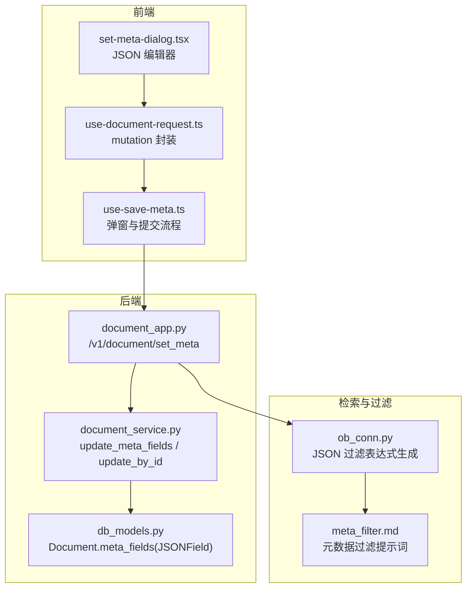
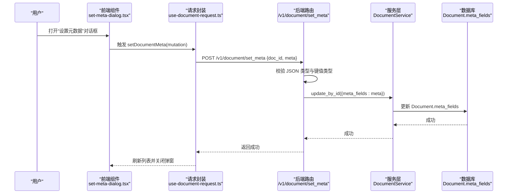
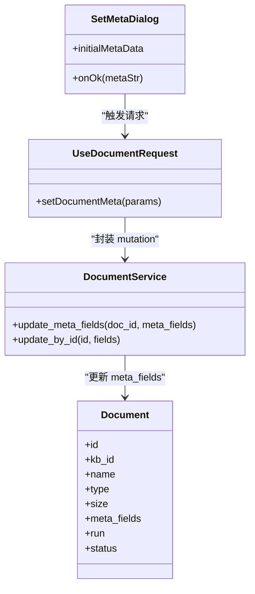

# 元数据管理

<cite>
**本文引用的文件**
- [document_app.py](file://api/apps/document_app.py)
- [document_service.py](file://api/db/services/document_service.py)
- [db_models.py](file://api/db/db_models.py)
- [set-meta-dialog.tsx](file://web/src/pages/dataset/dataset/set-meta-dialog.tsx)
- [use-document-request.ts](file://web/src/hooks/use-document-request.ts)
- [use-save-meta.ts](file://web/src/pages/dataset/dataset/use-save-meta.ts)
- [set_metadata.md](file://docs/guides/dataset/set_metadata.md)
- [ob_conn.py](file://rag/utils/ob_conn.py)
- [meta_filter.md](file://rag/prompts/meta_filter.md)
</cite>

## 目录
1. [简介](#简介)
2. [项目结构](#项目结构)
3. [核心组件](#核心组件)
4. [架构总览](#架构总览)
5. [组件详解](#组件详解)
6. [依赖关系分析](#依赖关系分析)
7. [性能与扩展性](#性能与扩展性)
8. [故障排查](#故障排查)
9. [结论](#结论)
10. [附录](#附录)

## 简介
本文件围绕“元数据管理”主题，系统化梳理后端 API、服务层、数据库模型与前端交互组件之间的协作关系，重点说明：
- 后端 update_document（即 set_meta）API 如何接收并校验元数据请求；
- DocumentService 中元数据更新的处理流程；
- 前端 set-meta-dialog 组件如何提供 JSON 表单以编辑元数据；
- 元数据的用途：在检索中用于过滤与排序、作为上下文传递给 LLM；
- 当前是否支持批量更新元数据（目前不支持，需逐个文档设置）。

## 项目结构
围绕元数据管理的关键文件分布如下：
- 后端路由与业务入口：api/apps/document_app.py
- 服务层：api/db/services/document_service.py
- 数据模型：api/db/db_models.py（Document 模型包含 meta_fields 字段）
- 前端对话框组件：web/src/pages/dataset/dataset/set-meta-dialog.tsx
- 前端请求封装与状态管理：web/src/hooks/use-document-request.ts、web/src/pages/dataset/dataset/use-save-meta.ts
- 文档指南：docs/guides/dataset/set_metadata.md
- 检索过滤实现：rag/utils/ob_conn.py、rag/prompts/meta_filter.md

图表来源
- [document_app.py](file://api/apps/document_app.py#L689-L719)
- [document_service.py](file://api/db/services/document_service.py#L640-L643)
- [db_models.py](file://api/db/db_models.py#L770-L796)
- [set-meta-dialog.tsx](file://web/src/pages/dataset/dataset/set-meta-dialog.tsx#L1-L129)
- [use-document-request.ts](file://web/src/hooks/use-document-request.ts#L377-L408)
- [use-save-meta.ts](file://web/src/pages/dataset/dataset/use-save-meta.ts#L1-L45)
- [ob_conn.py](file://rag/utils/ob_conn.py#L237-L315)
- [meta_filter.md](file://rag/prompts/meta_filter.md#L1-L67)

章节来源
- [document_app.py](file://api/apps/document_app.py#L689-L719)
- [document_service.py](file://api/db/services/document_service.py#L640-L643)
- [db_models.py](file://api/db/db_models.py#L770-L796)
- [set-meta-dialog.tsx](file://web/src/pages/dataset/dataset/set-meta-dialog.tsx#L1-L129)
- [use-document-request.ts](file://web/src/hooks/use-document-request.ts#L377-L408)
- [use-save-meta.ts](file://web/src/pages/dataset/dataset/use-save-meta.ts#L1-L45)
- [set_metadata.md](file://docs/guides/dataset/set_metadata.md#L1-L32)
- [ob_conn.py](file://rag/utils/ob_conn.py#L237-L315)
- [meta_filter.md](file://rag/prompts/meta_filter.md#L1-L67)

## 核心组件
- 后端 API：/v1/document/set_meta，负责接收文档 ID 与元数据 JSON，并进行类型校验与持久化。
- 服务层：DocumentService.update_meta_fields/update_by_id，将元数据写入数据库 Document 表的 meta_fields 字段。
- 数据模型：Document.meta_fields 使用 JSONField 存储任意键值对。
- 前端组件：set-meta-dialog.tsx 提供 Monaco JSON 编辑器，onOk 回调触发后端 set_meta 请求；use-document-request.ts 的 useSetDocumentMeta 封装 mutation；use-save-meta.ts 负责弹窗状态与提交逻辑。
- 检索与过滤：ob_conn.py 将元数据过滤条件转换为 SQL/查询表达式；meta_filter.md 定义了元数据过滤提示词模板，指导从自然语言生成过滤条件。

章节来源
- [document_app.py](file://api/apps/document_app.py#L689-L719)
- [document_service.py](file://api/db/services/document_service.py#L640-L643)
- [db_models.py](file://api/db/db_models.py#L770-L796)
- [set-meta-dialog.tsx](file://web/src/pages/dataset/dataset/set-meta-dialog.tsx#L1-L129)
- [use-document-request.ts](file://web/src/hooks/use-document-request.ts#L377-L408)
- [use-save-meta.ts](file://web/src/pages/dataset/dataset/use-save-meta.ts#L1-L45)
- [ob_conn.py](file://rag/utils/ob_conn.py#L237-L315)
- [meta_filter.md](file://rag/prompts/meta_filter.md#L1-L67)

## 架构总览
后端到前端的完整调用链路如下：

图表来源
- [document_app.py](file://api/apps/document_app.py#L689-L719)
- [document_service.py](file://api/db/services/document_service.py#L640-L643)
- [use-document-request.ts](file://web/src/hooks/use-document-request.ts#L377-L408)
- [set-meta-dialog.tsx](file://web/src/pages/dataset/dataset/set-meta-dialog.tsx#L1-L129)

## 组件详解

### 后端 API：set_meta（更新元数据）
- 路由：/v1/document/set_meta（POST）
- 参数：
  - doc_id：文档 ID
  - meta：字符串形式的 JSON 对象（服务端会解析为字典）
- 校验规则：
  - meta 必须是 JSON 字符串，且解析后必须为字典；
  - 字典中的每个值必须为字符串、整数或浮点数；
  - 非法格式或类型将返回错误码与消息。
- 处理流程：
  - 校验权限（accessible）；
  - 解析 JSON 并做类型检查；
  - 通过 DocumentService.update_by_id 写入 meta_fields；
  - 返回结果。

章节来源
- [document_app.py](file://api/apps/document_app.py#L689-L719)

### 服务层：DocumentService.update_meta_fields
- 方法：update_meta_fields(doc_id, meta_fields)
- 实现：委托 update_by_id，将 meta_fields 写入 Document 记录。
- 作用：统一更新文档元数据入口，便于后续扩展（如审计、缓存同步等）。

章节来源
- [document_service.py](file://api/db/services/document_service.py#L640-L643)

### 数据模型：Document.meta_fields
- 字段类型：JSONField，默认空对象；
- 存储内容：任意键值对，键为字符串，值为字符串/整数/浮点数；
- 用途：前端展示、检索过滤、LLM 上下文增强。

章节来源
- [db_models.py](file://api/db/db_models.py#L770-L796)

### 前端组件：set-meta-dialog.tsx
- 功能：提供 Monaco JSON 编辑器，输入校验（JSON 语法）、默认值填充（initialMetaData）；
- 行为：onOk 回调将 meta 字符串传给父级 useSaveMeta，最终调用 useSetDocumentMeta 发起后端请求；
- 交互：保存成功后关闭弹窗并刷新文档列表。

章节来源
- [set-meta-dialog.tsx](file://web/src/pages/dataset/dataset/set-meta-dialog.tsx#L1-L129)
- [use-document-request.ts](file://web/src/hooks/use-document-request.ts#L377-L408)
- [use-save-meta.ts](file://web/src/pages/dataset/dataset/use-save-meta.ts#L1-L45)

### 元数据用途与检索过滤
- 用途：
  - 在检索时作为过滤条件，支持“包含/不包含/起始/结束/为空/不为空/数值比较”等操作；
  - 将元数据随检索片段一起发送给 LLM，辅助生成更准确的回答。
- 过滤实现：
  - ob_conn.py 将元数据过滤条件转换为 SQL/查询表达式；
  - meta_filter.md 定义提示词模板，帮助从自然语言生成过滤条件数组。

章节来源
- [ob_conn.py](file://rag/utils/ob_conn.py#L237-L315)
- [meta_filter.md](file://rag/prompts/meta_filter.md#L1-L67)

### 批量更新元数据
- 当前限制：不支持批量设置元数据，必须逐个文档单独设置。
- 参考文档：set_metadata.md 明确指出“必须逐个文档设置”。

章节来源
- [set_metadata.md](file://docs/guides/dataset/set_metadata.md#L28-L32)

## 依赖关系分析

图表来源
- [db_models.py](file://api/db/db_models.py#L770-L796)
- [document_service.py](file://api/db/services/document_service.py#L640-L643)
- [set-meta-dialog.tsx](file://web/src/pages/dataset/dataset/set-meta-dialog.tsx#L1-L129)
- [use-document-request.ts](file://web/src/hooks/use-document-request.ts#L377-L408)

## 性能与扩展性
- 元数据存储为 JSON 字段，适合灵活扩展键值对，但检索时需依赖数据库的 JSON 查询能力（如 MySQL JSON 函数）。
- 若元数据规模较大或查询频繁，建议：
  - 为常用过滤键建立二级索引或物化列；
  - 控制元数据键数量与层级深度，避免过深嵌套导致查询复杂度上升；
  - 在前端侧尽量减少不必要的元数据字段，仅保留必要键值。

[本节为通用建议，无需特定文件引用]

## 故障排查
- 常见错误与定位
  - JSON 语法错误：前端表单已做语法校验，若仍报错，检查 meta 是否为合法 JSON 字符串。
  - 键值类型不支持：meta 字典中的值必须为字符串、整数或浮点数，否则后端会拒绝。
  - 权限不足：非知识库所属者或无访问权限会返回认证错误。
  - 文档不存在：后端会返回“文档未找到”的错误信息。
- 建议排查步骤
  - 前端确认 onOk 回调传入的是字符串化的 JSON；
  - 后端日志查看 set_meta 路由的异常堆栈；
  - 数据库确认 Document.meta_fields 是否更新成功；
  - 检索侧确认过滤条件是否正确映射到 SQL 表达式。

章节来源
- [document_app.py](file://api/apps/document_app.py#L689-L719)
- [ob_conn.py](file://rag/utils/ob_conn.py#L237-L315)

## 结论
- 元数据管理通过“前端 JSON 表单 + 后端 set_meta 接口 + 服务层更新 + 数据库存储”的链路实现，具备良好的灵活性与可扩展性。
- 当前不支持批量设置元数据，需逐文档设置；检索侧可通过多种运算符进行过滤，满足常见业务场景。
- 建议在实际使用中控制元数据键值数量与类型，确保检索性能与稳定性。

[本节为总结性内容，无需特定文件引用]

## 附录

### API 定义（摘要）
- 路由：POST /v1/document/set_meta
- 请求体参数：
  - doc_id：字符串，文档 ID
  - meta：字符串，JSON 对象（服务端解析为字典）
- 返回：
  - 成功：code=0
  - 失败：返回错误码与错误信息

章节来源
- [document_app.py](file://api/apps/document_app.py#L689-L719)

### 前端交互要点
- set-meta-dialog.tsx 使用 Monaco 编辑器，提供 JSON 语法校验与默认值填充；
- use-document-request.ts 的 useSetDocumentMeta 封装 mutation，统一处理成功/失败与列表刷新；
- use-save-meta.ts 负责弹窗状态与提交流程，简化调用方逻辑。

章节来源
- [set-meta-dialog.tsx](file://web/src/pages/dataset/dataset/set-meta-dialog.tsx#L1-L129)
- [use-document-request.ts](file://web/src/hooks/use-document-request.ts#L377-L408)
- [use-save-meta.ts](file://web/src/pages/dataset/dataset/use-save-meta.ts#L1-L45)