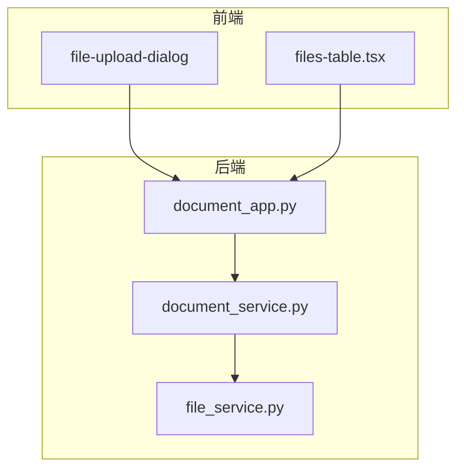
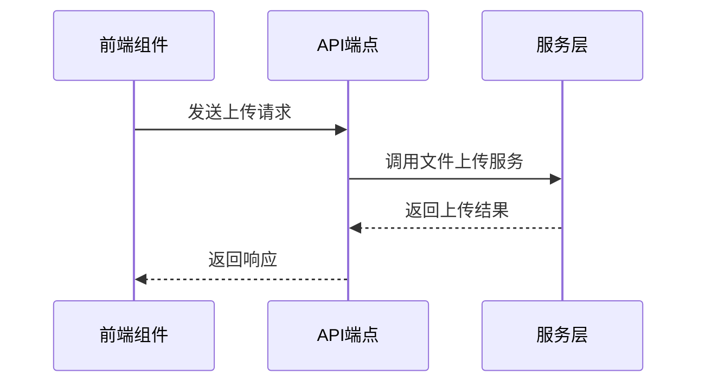
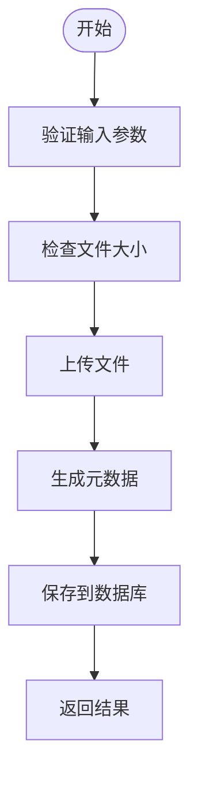
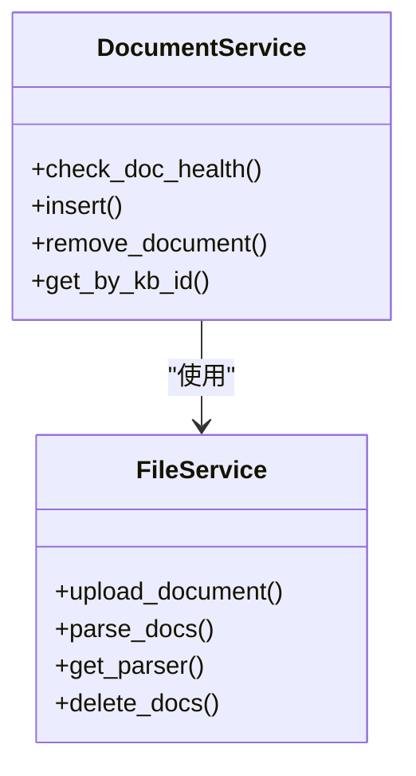
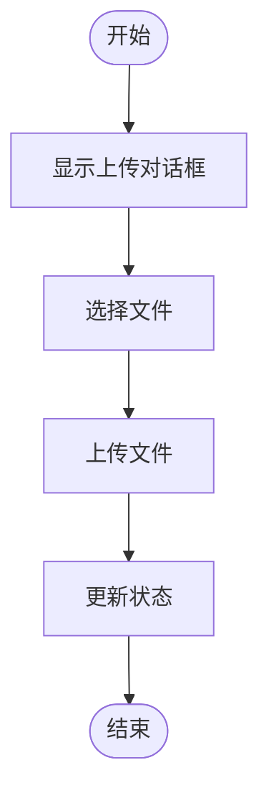
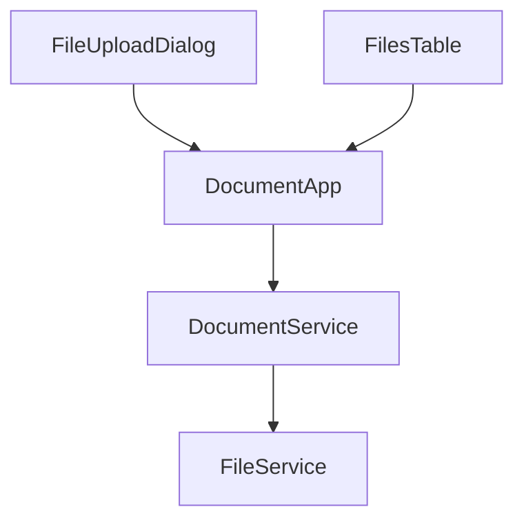

# 文档上传

<cite>
**本文档中引用的文件**   
- [document_app.py](file://api/apps/document_app.py)
- [document_service.py](file://api/db/services/document_service.py)
- [file_service.py](file://api/db/services/file_service.py)
- [file-upload-dialog/index.tsx](file://web/src/components/file-upload-dialog/index.tsx)
- [files-table.tsx](file://web/src/pages/files/files-table.tsx)
</cite>

## 目录
1. [简介](#简介)
2. [项目结构](#项目结构)
3. [核心组件](#核心组件)
4. [架构概述](#架构概述)
5. [详细组件分析](#详细组件分析)
6. [依赖分析](#依赖分析)
7. [性能考虑](#性能考虑)
8. [故障排除指南](#故障排除指南)
9. [结论](#结论)

## 简介
本文档详细介绍了RAGFlow系统中的文档上传功能，包括`document_app.py`中的`upload_documents` API端点、`DocumentService`中的文件持久化和元数据生成逻辑、前端`file-upload-dialog`组件的用户界面以及`files-table.tsx`中的上传状态实时更新。涵盖了支持的文件格式、上传进度条、错误处理以及最佳实践。

## 项目结构
RAGFlow项目的文档上传功能主要涉及后端API、服务层和前端组件三个部分。后端API位于`api/apps/document_app.py`，负责处理上传请求；服务层位于`api/db/services/`目录下，包含`document_service.py`和`file_service.py`，负责文件的持久化和元数据管理；前端组件位于`web/src/components/`和`web/src/pages/`目录下，提供用户界面和状态更新。

**Diagram sources**
- [document_app.py](file://api/apps/document_app.py)
- [document_service.py](file://api/db/services/document_service.py)
- [file_service.py](file://api/db/services/file_service.py)
- [file-upload-dialog/index.tsx](file://web/src/components/file-upload-dialog/index.tsx)
- [files-table.tsx](file://web/src/pages/files/files-table.tsx)

**Section sources**
- [document_app.py](file://api/apps/document_app.py)
- [document_service.py](file://api/db/services/document_service.py)
- [file_service.py](file://api/db/services/file_service.py)
- [file-upload-dialog/index.tsx](file://web/src/components/file-upload-dialog/index.tsx)
- [files-table.tsx](file://web/src/pages/files/files-table.tsx)

## 核心组件
文档上传功能的核心组件包括API端点、服务层和前端组件。API端点处理上传请求，服务层负责文件的持久化和元数据生成，前端组件提供用户界面和状态更新。

**Section sources**
- [document_app.py](file://api/apps/document_app.py#L51-L84)
- [document_service.py](file://api/db/services/document_service.py#L45-L800)
- [file_service.py](file://api/db/services/file_service.py#L43-L673)
- [file-upload-dialog/index.tsx](file://web/src/components/file-upload-dialog/index.tsx#L1-L130)
- [files-table.tsx](file://web/src/pages/files/files-table.tsx#L1-L346)

## 架构概述
文档上传功能的架构分为前端、API层和服务层。前端组件通过API与后端通信，API层处理请求并调用服务层进行文件处理，服务层负责文件的持久化和元数据生成。

**Diagram sources**
- [document_app.py](file://api/apps/document_app.py#L51-L84)
- [document_service.py](file://api/db/services/document_service.py#L45-L800)
- [file_service.py](file://api/db/services/file_service.py#L43-L673)

## 详细组件分析

### API端点分析
`document_app.py`中的`upload`函数是文档上传的主要API端点，负责处理上传请求并调用服务层进行文件处理。

**Diagram sources**
- [document_app.py](file://api/apps/document_app.py#L51-L84)

**Section sources**
- [document_app.py](file://api/apps/document_app.py#L51-L84)

### 服务层分析
`DocumentService`和`FileService`是文档上传功能的核心服务层，负责文件的持久化和元数据生成。

**Diagram sources**
- [document_service.py](file://api/db/services/document_service.py#L45-L800)
- [file_service.py](file://api/db/services/file_service.py#L43-L673)

**Section sources**
- [document_service.py](file://api/db/services/document_service.py#L45-L800)
- [file_service.py](file://api/db/services/file_service.py#L43-L673)

### 前端组件分析
`file-upload-dialog`和`files-table`是文档上传功能的主要前端组件，提供用户界面和状态更新。

**Diagram sources**
- [file-upload-dialog/index.tsx](file://web/src/components/file-upload-dialog/index.tsx#L1-L130)
- [files-table.tsx](file://web/src/pages/files/files-table.tsx#L1-L346)

**Section sources**
- [file-upload-dialog/index.tsx](file://web/src/components/file-upload-dialog/index.tsx#L1-L130)
- [files-table.tsx](file://web/src/pages/files/files-table.tsx#L1-L346)

## 依赖分析
文档上传功能的依赖关系主要体现在API层对服务层的依赖，以及前端组件对API的依赖。

**Diagram sources**
- [document_app.py](file://api/apps/document_app.py)
- [document_service.py](file://api/db/services/document_service.py)
- [file_service.py](file://api/db/services/file_service.py)
- [file-upload-dialog/index.tsx](file://web/src/components/file-upload-dialog/index.tsx)
- [files-table.tsx](file://web/src/pages/files/files-table.tsx)

**Section sources**
- [document_app.py](file://api/apps/document_app.py)
- [document_service.py](file://api/db/services/document_service.py)
- [file_service.py](file://api/db/services/file_service.py)
- [file-upload-dialog/index.tsx](file://web/src/components/file-upload-dialog/index.tsx)
- [files-table.tsx](file://web/src/pages/files/files-table.tsx)

## 性能考虑
文档上传功能在性能方面需要考虑文件大小限制、并发上传限制和上传超时处理。系统通过配置文件中的参数来控制这些限制，确保系统的稳定性和可靠性。

## 故障排除指南
在使用文档上传功能时，可能会遇到网络中断、文件过大等错误。系统提供了详细的错误处理机制，包括错误码和错误消息，帮助用户快速定位和解决问题。

**Section sources**
- [document_app.py](file://api/apps/document_app.py#L51-L84)
- [document_service.py](file://api/db/services/document_service.py#L45-L800)
- [file_service.py](file://api/db/services/file_service.py#L43-L673)

## 结论
RAGFlow系统的文档上传功能通过前后端的紧密协作，实现了高效、可靠的文件上传和管理。通过详细的API设计、服务层实现和前端组件，为用户提供了良好的使用体验。