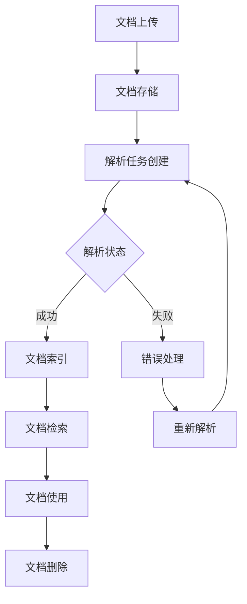
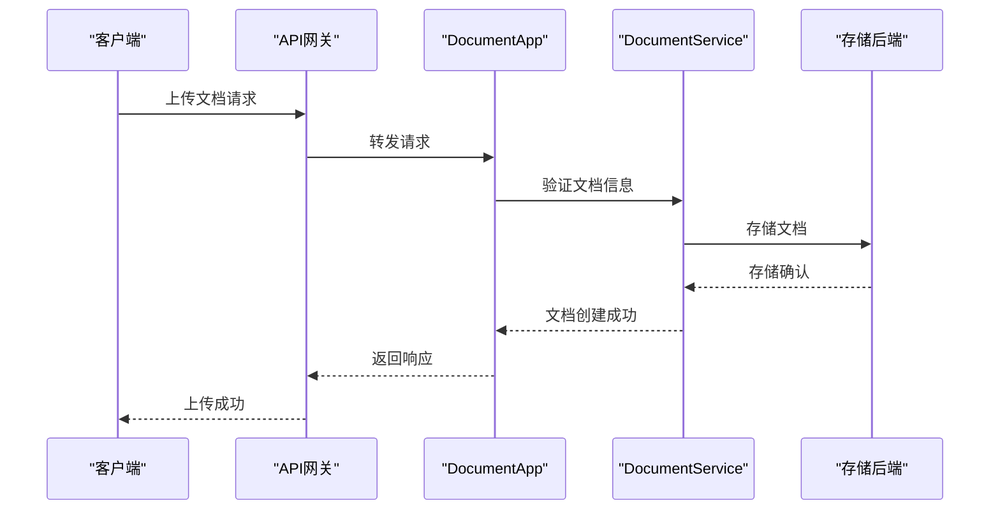
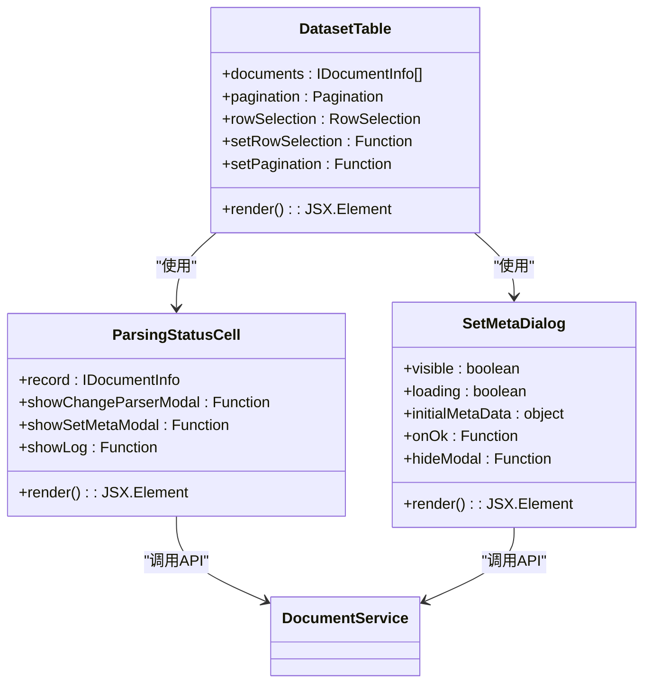
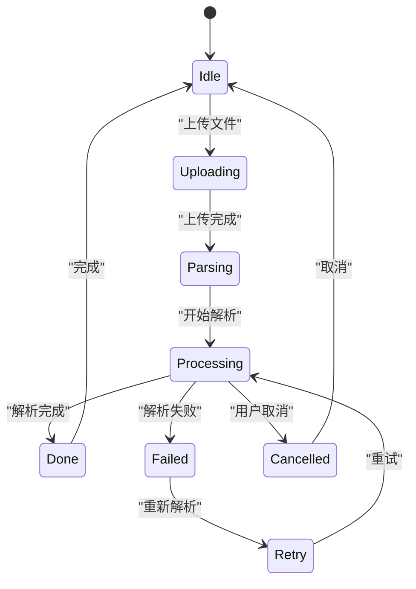
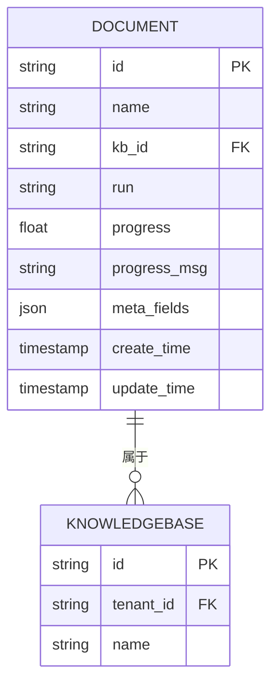
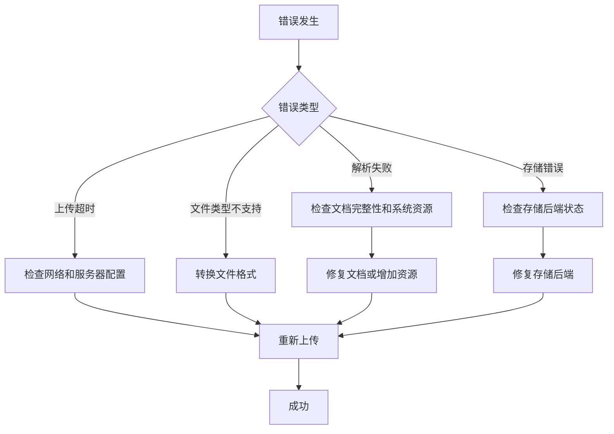

# 文档管理

<cite>
**本文档中引用的文件**   
- [document_app.py](file://api/apps/document_app.py)
- [document_service.py](file://api/db/services/document_service.py)
- [file_service.py](file://api/db/services/file_service.py)
- [files-table.tsx](file://web/src/pages/files/files-table.tsx)
- [dataset-table.tsx](file://web/src/pages/dataset/dataset/dataset-table.tsx)
- [use-bulk-operate-dataset.tsx](file://web/src/pages/dataset/dataset/use-bulk-operate-dataset.tsx)
- [parsing-status-cell.tsx](file://web/src/pages/dataset/dataset/parsing-status-cell.tsx)
- [set-meta-dialog.tsx](file://web/src/pages/dataset/dataset/set-meta-dialog.tsx)
- [file-upload.tsx](file://web/src/components/file-upload.tsx)
</cite>

## 目录
1. [简介](#简介)
2. [文档生命周期](#文档生命周期)
3. [API端点详解](#api端点详解)
4. [前端组件分析](#前端组件分析)
5. [文档上传与解析流程](#文档上传与解析流程)
6. [文档状态监控与操作](#文档状态监控与操作)
7. [元数据管理](#元数据管理)
8. [错误处理与故障排除](#错误处理与故障排除)
9. [性能优化与最佳实践](#性能优化与最佳实践)
10. [结论](#结论)

## 简介
本文档详细介绍了RAGFlow系统中的文档管理功能，涵盖了从文档上传、解析到检索的完整生命周期。文档管理是RAGFlow系统的核心功能之一，它允许用户将各种类型的文件上传到知识库中，并通过自动化流程将这些文件解析为可检索的文本内容。系统支持多种文件格式，包括PDF、Word、Excel、PPT、HTML等，并提供了丰富的API接口和前端组件来管理文档的整个生命周期。

**文档来源**
- [document_app.py](file://api/apps/document_app.py#L1-L729)
- [document_service.py](file://api/db/services/document_service.py#L1-L1035)

## 文档生命周期
文档在RAGFlow系统中的生命周期包括上传、解析、索引、检索和删除等阶段。每个文档都有一个唯一标识符，并与特定的知识库相关联。文档的状态通过`run`字段来跟踪，可能的状态包括"UNSTART"（未开始）、"RUNNING"（运行中）、"DONE"（完成）和"FAIL"（失败）。文档的解析进度通过`progress`字段来表示，范围从0到1。

文档的元数据存储在`meta_fields`字段中，允许用户为文档添加自定义属性。文档的解析配置存储在`parser_config`字段中，可以根据不同的文档类型和需求进行定制。系统还支持文档版本控制，通过`chunk_num`和`token_num`字段来跟踪文档的分块和标记数量。

**图表来源**
- [document_service.py](file://api/db/services/document_service.py#L685-L742)
- [document_app.py](file://api/apps/document_app.py#L402-L447)

**文档来源**
- [document_service.py](file://api/db/services/document_service.py#L1-L1035)
- [document_app.py](file://api/apps/document_app.py#L1-L729)

## API端点详解
文档管理功能通过一系列API端点实现，这些端点位于`document_app.py`文件中。主要的API端点包括`upload`、`parse`、`list_docs`、`run`、`change_status`、`rm`和`set_meta`。这些端点使用Quart框架实现，支持异步处理，能够高效地处理大量文档。

`upload`端点负责处理文档上传，验证文件类型和大小限制，并将文件存储到适当的存储后端。`parse`端点启动文档解析流程，创建相应的任务并更新文档状态。`list_docs`端点返回知识库中的文档列表，支持分页、排序和过滤。`run`端点用于控制文档解析流程，可以启动、暂停或取消解析任务。

**图表来源**
- [document_app.py](file://api/apps/document_app.py#L51-L84)
- [document_service.py](file://api/db/services/document_service.py#L292-L301)

**文档来源**
- [document_app.py](file://api/apps/document_app.py#L1-L729)
- [document_service.py](file://api/db/services/document_service.py#L1-L1035)

## 前端组件分析
前端文档管理功能主要由`files-table.tsx`和`dataset-table.tsx`组件实现。这些组件使用React和TypeScript构建，提供了丰富的用户界面来管理文档。`dataset-table.tsx`组件实现了文档列表的展示，包括文档名称、状态、解析进度、操作选项等。

组件使用`useReactTable`钩子来管理表格状态，支持排序、过滤和分页。文档状态通过`ParsingStatusCell`组件可视化，使用不同的图标表示不同的状态。操作选项包括重新解析、编辑元数据、重命名和删除文档。组件还集成了`ChunkMethodDialog`和`SetMetaDialog`等模态框，用于配置解析参数和编辑元数据。

**图表来源**
- [dataset-table.tsx](file://web/src/pages/dataset/dataset/dataset-table.tsx#L1-L229)
- [parsing-status-cell.tsx](file://web/src/pages/dataset/dataset/parsing-status-cell.tsx#L44-L86)
- [set-meta-dialog.tsx](file://web/src/pages/dataset/dataset/set-meta-dialog.tsx)

**文档来源**
- [dataset-table.tsx](file://web/src/pages/dataset/dataset/dataset-table.tsx#L1-L229)
- [parsing-status-cell.tsx](file://web/src/pages/dataset/dataset/parsing-status-cell.tsx#L44-L86)
- [set-meta-dialog.tsx](file://web/src/pages/dataset/dataset/set-meta-dialog.tsx)

## 文档上传与解析流程
文档上传和解析流程是一个多阶段的过程，涉及多个组件和服务的协同工作。当用户上传文档时，`file-upload.tsx`组件处理文件选择和上传进度显示。上传的文件首先被验证，检查文件类型和大小是否符合要求。然后，文件被分块传输到服务器，以支持大文件上传。

在服务器端，`upload`API端点接收文件并将其存储到配置的存储后端（如MinIO或本地文件系统）。存储成功后，系统创建一个文档记录，并将其与相应的知识库关联。接着，`parse`端点被调用，启动文档解析流程。解析流程包括文本提取、分块、嵌入生成和索引创建等步骤。

**图表来源**
- [file-upload.tsx](file://web/src/components/file-upload.tsx#L61-L446)
- [document_app.py](file://api/apps/document_app.py#L51-L84)
- [document_service.py](file://api/db/services/document_service.py#L292-L301)

**文档来源**
- [file-upload.tsx](file://web/src/components/file-upload.tsx#L61-L446)
- [document_app.py](file://api/apps/document_app.py#L1-L729)
- [document_service.py](file://api/db/services/document_service.py#L1-L1035)

## 文档状态监控与操作
文档状态监控是文档管理功能的重要组成部分，它允许用户实时跟踪文档的解析进度。系统通过`progress`和`progress_msg`字段来跟踪解析进度，这些字段由后台任务定期更新。`list_docs`API端点返回文档列表时包含这些状态信息，前端组件将其可视化为进度条和状态消息。

用户可以对文档执行多种操作，包括重新解析、暂停、取消和删除。`run`API端点用于控制解析流程，通过设置`run`参数来启动或停止解析任务。`change_status`端点用于启用或禁用文档的检索功能。`rm`端点用于删除文档及其相关数据。这些操作都经过权限验证，确保只有授权用户才能执行。

**图表来源**
- [document_app.py](file://api/apps/document_app.py#L402-L447)
- [document_service.py](file://api/db/services/document_service.py#L685-L742)
- [parsing-status-cell.tsx](file://web/src/pages/dataset/dataset/parsing-status-cell.tsx#L44-L86)

**文档来源**
- [document_app.py](file://api/apps/document_app.py#L1-L729)
- [document_service.py](file://api/db/services/document_service.py#L1-L1035)
- [parsing-status-cell.tsx](file://web/src/pages/dataset/dataset/parsing-status-cell.tsx#L44-L86)

## 元数据管理
元数据管理功能允许用户为文档添加自定义属性，这些属性可以用于过滤、排序和检索文档。元数据通过`set_meta`API端点进行管理，该端点接受JSON格式的元数据对象。系统验证元数据的格式和类型，确保只有字符串、数字和布尔值被存储。

前端`SetMetaDialog`组件提供了一个用户友好的界面来编辑元数据。用户可以添加、编辑或删除元数据字段，所有更改都会通过API同步到服务器。元数据存储在文档记录的`meta_fields`字段中，并在文档列表中显示。系统还支持基于元数据的过滤和搜索，使用户能够快速找到相关文档。

**图表来源**
- [document_app.py](file://api/apps/document_app.py#L689-L719)
- [document_service.py](file://api/db/services/document_service.py#L640-L643)
- [set-meta-dialog.tsx](file://web/src/pages/dataset/dataset/set-meta-dialog.tsx)

**文档来源**
- [document_app.py](file://api/apps/document_app.py#L1-L729)
- [document_service.py](file://api/db/services/document_service.py#L1-L1035)
- [set-meta-dialog.tsx](file://web/src/pages/dataset/dataset/set-meta-dialog.tsx)

## 错误处理与故障排除
系统实现了全面的错误处理机制，以应对文档上传和解析过程中可能出现的各种问题。常见的错误包括上传超时、文件类型不支持、解析失败和存储后端错误。系统通过详细的错误消息和日志记录来帮助用户诊断和解决问题。

对于上传超时问题，建议检查网络连接和服务器配置，确保上传超时设置足够长。对于文件类型不支持的问题，系统会返回明确的错误消息，建议用户转换文件格式或联系管理员添加支持。解析失败可能由多种原因引起，包括文档损坏、内存不足或解析器错误，系统会记录详细的错误日志供调试。

**图表来源**
- [document_app.py](file://api/apps/document_app.py#L76-L81)
- [file-upload.tsx](file://web/src/components/file-upload.tsx#L35-L58)
- [document_service.py](file://api/db/services/document_service.py#L840-L856)

**文档来源**
- [document_app.py](file://api/apps/document_app.py#L1-L729)
- [file-upload.tsx](file://web/src/components/file-upload.tsx#L61-L446)
- [document_service.py](file://api/db/services/document_service.py#L1-L1035)

## 性能优化与最佳实践
为了优化文档管理功能的性能，建议遵循以下最佳实践。对于大文件上传，使用分块上传机制以避免内存溢出和超时问题。合理配置解析器的参数，如分块大小和重叠，以平衡检索质量和性能。定期监控系统资源使用情况，确保有足够的内存和存储空间。

对于大量文档的处理，建议使用批量操作API来减少网络开销。利用系统的过滤和搜索功能来快速定位文档，避免不必要的数据加载。在生产环境中，配置适当的日志级别和监控工具，以便及时发现和解决问题。定期备份文档数据和索引，以防止数据丢失。

**文档来源**
- [document_service.py](file://api/db/services/document_service.py#L685-L742)
- [document_app.py](file://api/apps/document_app.py#L402-L447)
- [file-upload.tsx](file://web/src/components/file-upload.tsx#L61-L446)

## 结论
RAGFlow的文档管理功能提供了一个完整、可靠的解决方案，用于处理各种类型的文档。通过精心设计的API端点和直观的前端组件，用户可以轻松地上传、解析和管理文档。系统的错误处理和性能优化机制确保了高可用性和稳定性。遵循本文档中的最佳实践，用户可以最大化文档管理功能的价值，为知识库的构建和维护提供坚实的基础。