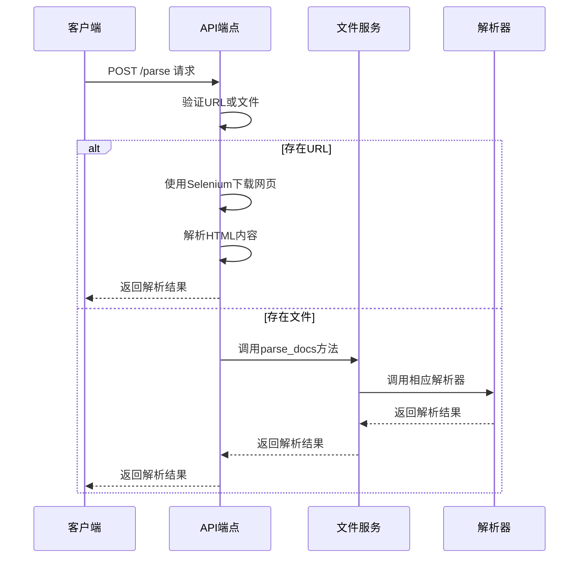
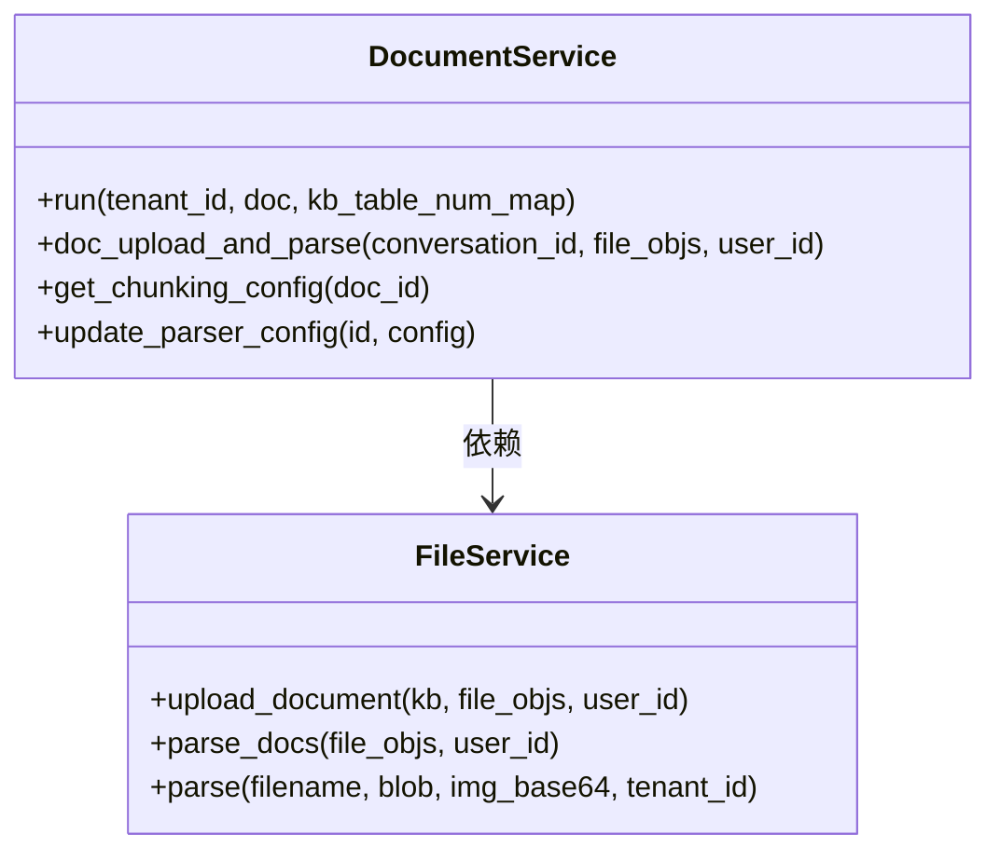
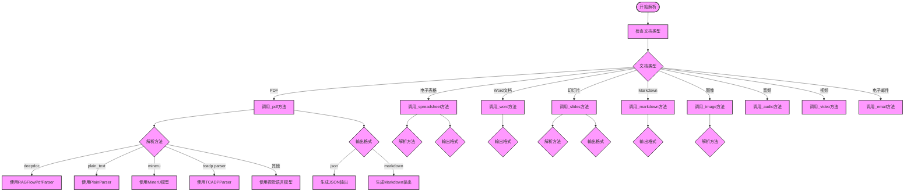
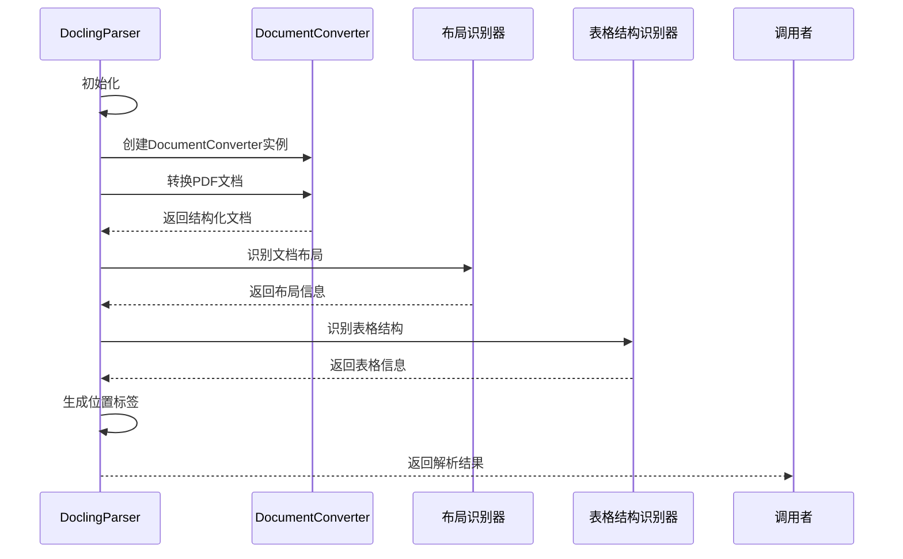
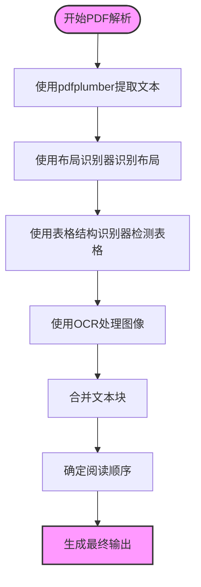
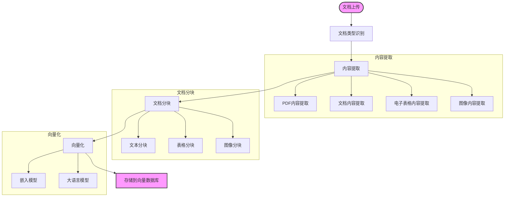
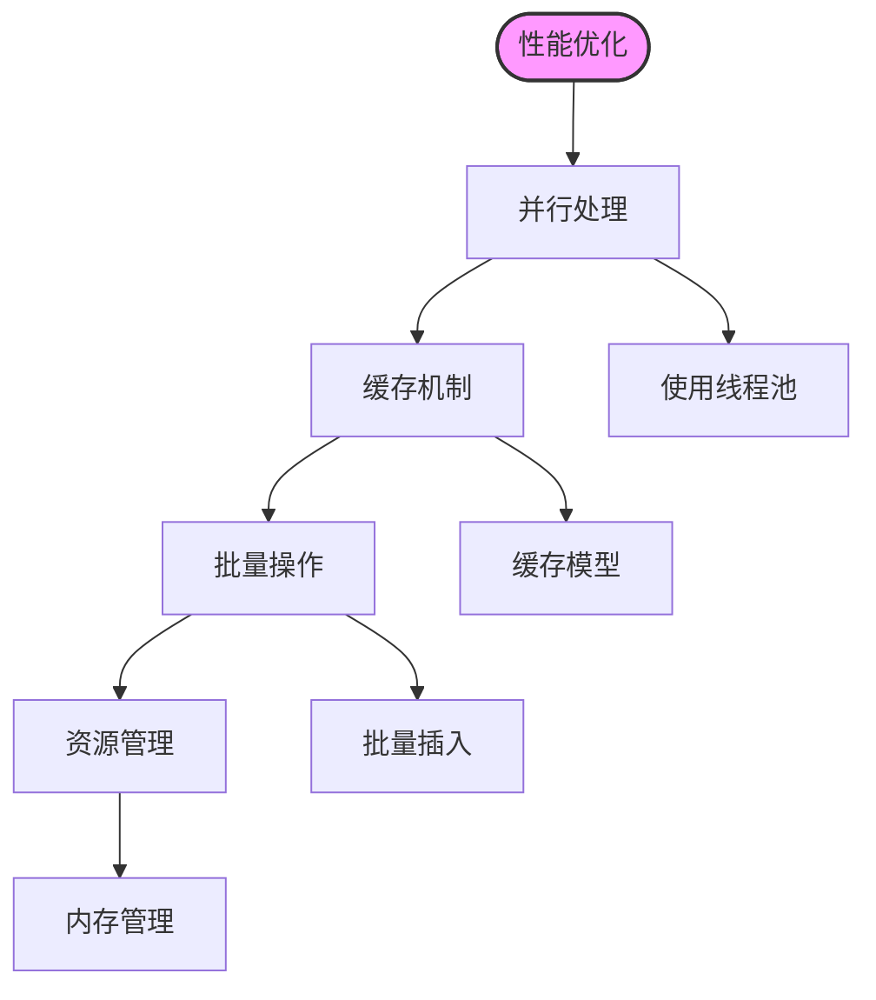

# 文档解析

<cite>
**本文档引用的文件**
- [document_app.py](file://api/apps/document_app.py)
- [document_service.py](file://api/db/services/document_service.py)
- [parser.py](file://rag/flow/parser/parser.py)
- [docling_parser.py](file://deepdoc/parser/docling_parser.py)
- [pdf_parser.py](file://deepdoc/parser/pdf_parser.py)
- [file_service.py](file://api/db/services/file_service.py)
</cite>

## 目录
1. [简介](#简介)
2. [API端点分析](#api端点分析)
3. [文档服务分析](#文档服务分析)
4. [解析器组件分析](#解析器组件分析)
5. [特定解析器分析](#特定解析器分析)
6. [解析流程](#解析流程)
7. [配置选项](#配置选项)
8. [错误处理与性能优化](#错误处理与性能优化)
9. [结论](#结论)

## 简介
本文档详细解析RAGFlow系统中的文档解析功能，重点分析`document_app.py`中的`parse_documents` API端点和`DocumentService`中的`parse_document`方法。文档将深入探讨解析流程，包括如何调用`rag/flow/parser/parser.py`进行分块和`deepdoc/parser/`中的特定解析器（如`docling_parser.py`）进行内容提取。同时，文档将说明不同文档类型（文本、表格、图像）的解析策略，涵盖解析配置选项，如选择PDF解析器、启用目录提取或表格结构识别，并提供处理解析失败、性能优化和自定义解析规则的指南。

## API端点分析

`document_app.py`文件中的`parse_documents` API端点是文档解析功能的入口点。该端点通过`@manager.route("/parse", methods=["POST"])`装饰器定义，接收POST请求来解析文档。端点首先验证请求中的URL参数，如果存在，则使用Selenium WebDriver下载网页内容并解析。如果请求中包含文件，则调用`FileService.parse_docs`方法进行解析。

**Diagram sources**
- [document_app.py](file://api/apps/document_app.py#L634-L686)

**Section sources**
- [document_app.py](file://api/apps/document_app.py#L634-L686)

## 文档服务分析

`DocumentService`类是文档解析的核心服务，负责文档的创建、更新、删除和解析。`parse_document`方法通过`run`方法启动解析流程，该方法根据文档的解析器类型（`parser_id`）决定使用哪个解析器进行处理。对于表格文档，会检查知识库中的表格数量并相应更新。如果文档配置了数据流管道（`pipeline_id`），则会将任务加入数据流队列；否则，将任务加入普通任务队列。

**Diagram sources**
- [document_service.py](file://api/db/services/document_service.py#L826-L846)
- [file_service.py](file://api/db/services/file_service.py#L430-L488)

**Section sources**
- [document_service.py](file://api/db/services/document_service.py#L826-L846)
- [file_service.py](file://api/db/services/file_service.py#L430-L488)

## 解析器组件分析

`rag/flow/parser/parser.py`文件中的`Parser`类负责具体的文档解析工作。该类根据文档类型调用相应的解析方法，如`_pdf`、`_spreadsheet`、`_word`等。每个解析方法根据配置选择合适的解析策略，如PDF解析可以选择`deepdoc`、`plain_text`、`mineru`或`tcadp parser`等方法。

**Diagram sources**
- [parser.py](file://rag/flow/parser/parser.py#L229-L800)

**Section sources**
- [parser.py](file://rag/flow/parser/parser.py#L229-L800)

## 特定解析器分析

### Docling解析器
`deepdoc/parser/docling_parser.py`文件中的`DoclingParser`类使用Docling库进行PDF文档解析。该解析器首先检查Docling库的安装情况，然后使用`DocumentConverter`将PDF转换为结构化文档。解析器能够提取文本、表格和图像，并为每个元素生成位置信息。

**Diagram sources**
- [docling_parser.py](file://deepdoc/parser/docling_parser.py#L58-L341)

### PDF解析器
`deepdoc/parser/pdf_parser.py`文件中的`RAGFlowPdfParser`类是RAGFlow系统的核心PDF解析器。该解析器使用多种技术进行文档解析，包括OCR、布局识别和表格结构识别。解析器首先使用`pdfplumber`提取PDF中的文本和布局信息，然后使用OCR识别图像中的文本，最后使用机器学习模型进行文本合并和阅读顺序确定。

**Diagram sources**
- [pdf_parser.py](file://deepdoc/parser/pdf_parser.py#L51-L800)

## 解析流程

文档解析流程从用户上传文档开始，经过一系列处理步骤，最终生成可用于检索的向量表示。流程包括文档上传、类型识别、内容提取、分块、向量化和存储。

**Diagram sources**
- [document_service.py](file://api/db/services/document_service.py#L892-L1034)
- [file_service.py](file://api/db/services/file_service.py#L430-L488)

## 配置选项

文档解析支持多种配置选项，允许用户根据具体需求定制解析行为。配置选项包括解析方法选择、输出格式、表格和图像上下文大小等。

### PDF解析配置
| 配置项 | 说明 | 可选值 |
|--------|------|--------|
| parse_method | 解析方法 | deepdoc, plain_text, mineru, tcadp parser, 视觉语言模型 |
| lang | 文档语言 | Chinese, English等 |
| output_format | 输出格式 | json, markdown |
| table_context_size | 表格上下文大小 | 0, 1, 2, ... |
| image_context_size | 图像上下文大小 | 0, 1, 2, ... |

### 电子表格解析配置
| 配置项 | 说明 | 可选值 |
|--------|------|--------|
| parse_method | 解析方法 | deepdoc, tcadp parser |
| output_format | 输出格式 | json, markdown, html |
| table_result_type | 表格结果类型 | 1, 2, 3 |
| markdown_image_response_type | Markdown图像响应类型 | 1, 2 |

### 图像解析配置
| 配置项 | 说明 | 可选值 |
|--------|------|--------|
| parse_method | 解析方法 | ocr, 视觉语言模型 |
| llm_id | 视觉语言模型ID | 模型名称 |
| lang | 文档语言 | Chinese, English等 |
| system_prompt | 系统提示 | 自定义提示 |

**Section sources**
- [parser.py](file://rag/flow/parser/parser.py#L81-L172)

## 错误处理与性能优化

### 错误处理
文档解析过程中可能遇到各种错误，系统通过以下机制进行处理：
1. **异常捕获**：在关键操作周围使用try-catch块捕获异常
2. **错误日志**：记录详细的错误信息以便调试
3. **状态更新**：将文档状态更新为失败状态，并记录错误消息
4. **重试机制**：对于网络相关的操作，实现重试机制

### 性能优化
为了提高文档解析的性能，系统采用了以下优化策略：
1. **并行处理**：使用线程池并行处理多个文档
2. **缓存机制**：缓存常用的模型和资源
3. **批量操作**：批量插入数据库记录
4. **资源管理**：合理管理内存和文件句柄

**Section sources**
- [document_service.py](file://api/db/services/document_service.py#L892-L1034)
- [file_service.py](file://api/db/services/file_service.py#L501-L511)

## 结论
RAGFlow系统的文档解析功能通过多层次的架构设计，实现了对多种文档类型的高效解析。系统通过灵活的配置选项和强大的错误处理机制，确保了文档解析的可靠性和可扩展性。未来可以通过引入更先进的AI模型和优化算法，进一步提升解析质量和性能。