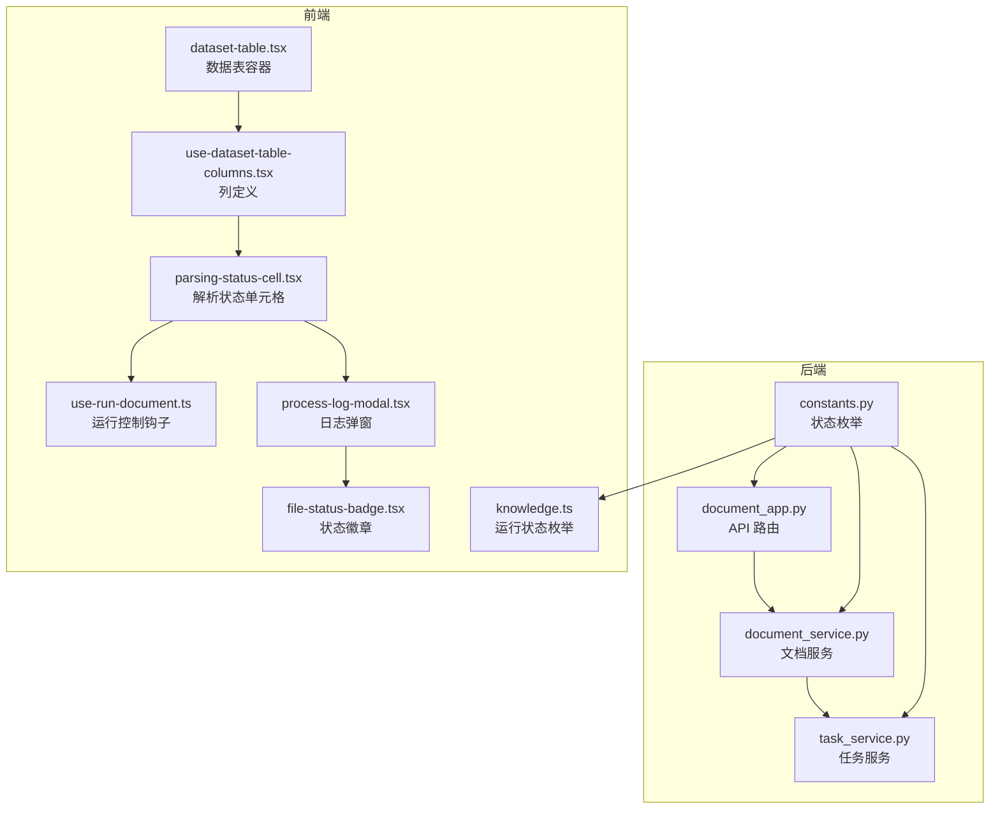
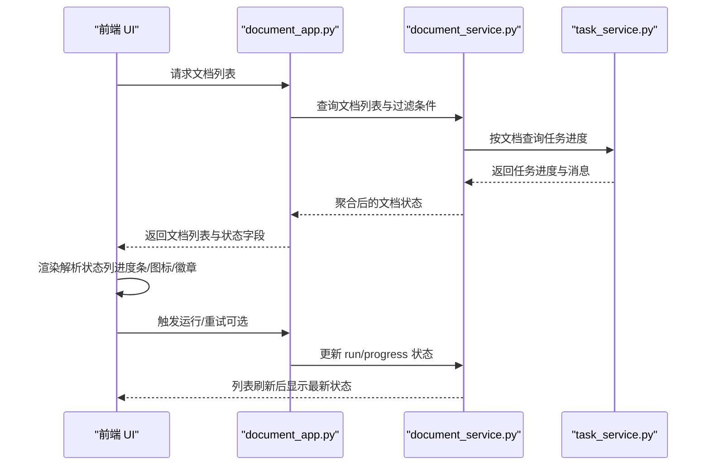
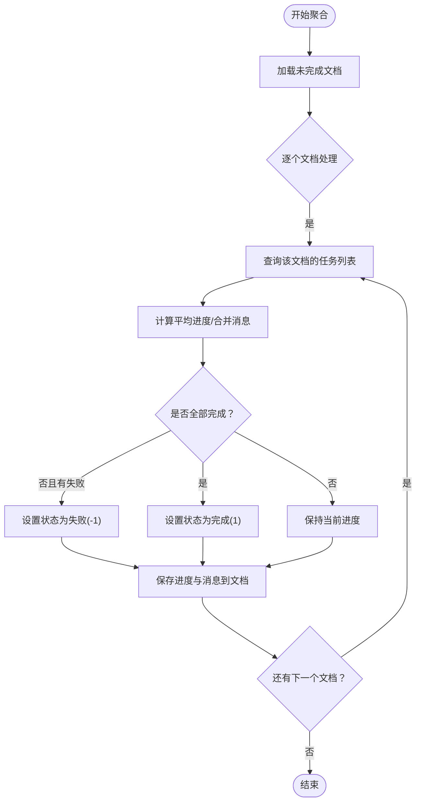
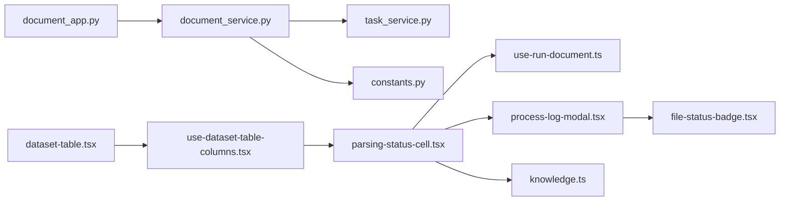

# 状态监控

<cite>
**本文引用的文件**
- [document_app.py](file://api/apps/document_app.py)
- [document_service.py](file://api/db/services/document_service.py)
- [task_service.py](file://api/db/services/task_service.py)
- [constants.py](file://common/constants.py)
- [dataset-table.tsx](file://web/src/pages/dataset/dataset/dataset-table.tsx)
- [use-dataset-table-columns.tsx](file://web/src/pages/dataset/dataset/use-dataset-table-columns.tsx)
- [parsing-status-cell.tsx](file://web/src/pages/dataset/dataset/parsing-status-cell.tsx)
- [use-run-document.ts](file://web/src/pages/dataset/dataset/use-run-document.ts)
- [process-log-modal.tsx](file://web/src/pages/dataset/process-log-modal.tsx)
- [hooks.ts](file://web/src/pages/dataset/dataset/hooks.ts)
- [file-status-badge.tsx](file://web/src/components/file-status-badge.tsx)
- [knowledge.ts](file://web/src/constants/knowledge.ts)
</cite>

## 目录
1. [简介](#简介)
2. [项目结构](#项目结构)
3. [核心组件](#核心组件)
4. [架构总览](#架构总览)
5. [详细组件分析](#详细组件分析)
6. [依赖关系分析](#依赖关系分析)
7. [性能考量](#性能考量)
8. [故障排查指南](#故障排查指南)
9. [结论](#结论)

## 简介
本文件围绕“状态监控”主题，系统性阐述以下内容：
- 后端 API 如何返回文档的详细状态（如“待处理/解析中/成功/失败”等），以及状态字段来源与计算逻辑。
- 后端服务层如何查询与聚合文档状态，包括进度、消息、时长等。
- 前端如何在数据表中可视化状态，包括进度条、状态图标、错误高亮与日志弹窗。
- 如何通过 API 或 UI 手动重试失败的解析任务，并查看详细的解析日志。

## 项目结构
围绕状态监控的关键代码分布在后端 API、服务层与前端 UI 三部分：
- 后端：API 路由负责接收请求并调用服务层；服务层负责数据库查询、任务进度聚合与状态更新。
- 前端：表格列定义、状态单元格渲染、运行控制与日志弹窗。

图表来源
- [document_app.py](file://api/apps/document_app.py#L210-L269)
- [document_service.py](file://api/db/services/document_service.py#L122-L162)
- [task_service.py](file://api/db/services/task_service.py#L57-L120)
- [constants.py](file://common/constants.py#L79-L90)
- [dataset-table.tsx](file://web/src/pages/dataset/dataset/dataset-table.tsx#L1-L120)
- [use-dataset-table-columns.tsx](file://web/src/pages/dataset/dataset/use-dataset-table-columns.tsx#L170-L202)
- [parsing-status-cell.tsx](file://web/src/pages/dataset/dataset/parsing-status-cell.tsx#L1-L181)
- [use-run-document.ts](file://web/src/pages/dataset/dataset/use-run-document.ts#L1-L35)
- [process-log-modal.tsx](file://web/src/pages/dataset/process-log-modal.tsx#L1-L156)
- [file-status-badge.tsx](file://web/src/components/file-status-badge.tsx#L34-L63)
- [knowledge.ts](file://web/src/constants/knowledge.ts#L10-L26)

章节来源
- [document_app.py](file://api/apps/document_app.py#L210-L269)
- [document_service.py](file://api/db/services/document_service.py#L122-L162)
- [task_service.py](file://api/db/services/task_service.py#L57-L120)
- [constants.py](file://common/constants.py#L79-L90)
- [dataset-table.tsx](file://web/src/pages/dataset/dataset/dataset-table.tsx#L1-L120)
- [use-dataset-table-columns.tsx](file://web/src/pages/dataset/dataset/use-dataset-table-columns.tsx#L170-L202)
- [parsing-status-cell.tsx](file://web/src/pages/dataset/dataset/parsing-status-cell.tsx#L1-L181)
- [use-run-document.ts](file://web/src/pages/dataset/dataset/use-run-document.ts#L1-L35)
- [process-log-modal.tsx](file://web/src/pages/dataset/process-log-modal.tsx#L1-L156)
- [file-status-badge.tsx](file://web/src/components/file-status-badge.tsx#L34-L63)
- [knowledge.ts](file://web/src/constants/knowledge.ts#L10-L26)

## 核心组件
- 后端 API 端点：提供文档列表查询与过滤，返回包含 run、progress、progress_msg、process_begin_at、process_duration、chunk_num 等状态字段。
- 文档服务：负责按知识库维度聚合文档状态，计算“进行中/完成/失败/取消/已下载”等统计，并将任务进度汇总到文档记录。
- 任务服务：维护每个文档的子任务进度与消息，为文档状态聚合提供依据。
- 前端表格：展示文档列表，解析状态列以进度条、图标与状态徽章呈现；支持点击日志查看详细解析过程。

章节来源
- [document_app.py](file://api/apps/document_app.py#L210-L269)
- [document_service.py](file://api/db/services/document_service.py#L685-L823)
- [task_service.py](file://api/db/services/task_service.py#L145-L173)
- [parsing-status-cell.tsx](file://web/src/pages/dataset/dataset/parsing-status-cell.tsx#L1-L181)

## 架构总览
后端从数据库读取文档与任务，按规则聚合进度与状态；前端通过列定义渲染状态单元格，并提供运行控制与日志弹窗。

图表来源
- [document_app.py](file://api/apps/document_app.py#L210-L269)
- [document_service.py](file://api/db/services/document_service.py#L685-L823)
- [task_service.py](file://api/db/services/task_service.py#L145-L173)

## 详细组件分析

### 后端 API：list_documents 返回文档状态
- 过滤与分页：支持关键词、类型、后缀、运行状态等过滤，返回 total 与 docs。
- 状态字段：返回的文档对象包含 run、progress、progress_msg、process_begin_at、process_duration、chunk_num、thumbnail、source_type 等，用于前端渲染。
- 访问控制：校验用户对知识库的权限，确保仅授权用户可见。

章节来源
- [document_app.py](file://api/apps/document_app.py#L210-L269)

### 后端服务：DocumentService 的状态聚合与查询
- 列表查询：按知识库、关键词、类型、后缀、运行状态等条件查询文档，并支持分页与排序。
- 统计聚合：根据 progress 与 run 字段，统计“进行中/完成/失败/取消/已下载”的数量。
- 进度同步：遍历未完成任务，计算平均进度、合并消息、判定最终状态（完成/失败），并写回文档记录。

图表来源
- [document_service.py](file://api/db/services/document_service.py#L685-L823)

章节来源
- [document_service.py](file://api/db/services/document_service.py#L122-L162)
- [document_service.py](file://api/db/services/document_service.py#L685-L823)

### 后端服务：TaskService 的任务进度与消息
- 任务详情：按任务 ID 获取任务详情，包含文档、知识库、租户信息及重试次数。
- 任务列表：按文档 ID 获取所有任务，包含每页进度、摘要与块 ID。
- 进度更新规则：仅当新进度有效（非回退）或为失败时才更新，避免覆盖有效进度。

章节来源
- [task_service.py](file://api/db/services/task_service.py#L57-L120)
- [task_service.py](file://api/db/services/task_service.py#L145-L173)
- [task_service.py](file://api/db/services/task_service.py#L271-L286)

### 前端：数据表与状态列
- 数据表容器：封装表格、分页、筛选、排序与选择状态。
- 列定义：解析状态列使用 ParsingStatusCell 渲染，包含解析器名称、运行控制图标、进度条与日志入口。
- 状态映射：RunningStatus 枚举与 RunningStatusMap 提供“待处理/解析中/取消/成功/失败/计划”等标签与颜色。

章节来源
- [dataset-table.tsx](file://web/src/pages/dataset/dataset/dataset-table.tsx#L1-L120)
- [use-dataset-table-columns.tsx](file://web/src/pages/dataset/dataset/use-dataset-table-columns.tsx#L170-L202)
- [parsing-status-cell.tsx](file://web/src/pages/dataset/dataset/parsing-status-cell.tsx#L1-L181)
- [knowledge.ts](file://web/src/constants/knowledge.ts#L10-L26)

### 前端：解析状态单元格（进度条、图标、重试）
- 图标与操作：根据 run 状态显示不同图标；运行中显示取消按钮，未运行显示重试按钮；支持删除重建与重新解析。
- 进度条：以百分比显示 progress，结合 tooltip 展示具体数值。
- 日志查看：点击日志图标打开 ProcessLogModal，展示状态、耗时、块数、详情等。

章节来源
- [parsing-status-cell.tsx](file://web/src/pages/dataset/dataset/parsing-status-cell.tsx#L1-L181)
- [process-log-modal.tsx](file://web/src/pages/dataset/process-log-modal.tsx#L1-L156)
- [hooks.ts](file://web/src/pages/dataset/dataset/hooks.ts#L1-L47)

### 前端：运行控制与重试
- 钩子逻辑：useHandleRunDocumentByIds 将“运行/取消”转换为后端 run 参数（1/2），并支持删除重建。
- 列操作：解析状态列在未运行时提供重试入口，运行中提供取消入口。

章节来源
- [use-run-document.ts](file://web/src/pages/dataset/dataset/use-run-document.ts#L1-L35)
- [parsing-status-cell.tsx](file://web/src/pages/dataset/dataset/parsing-status-cell.tsx#L1-L181)

### 前端：状态徽章与日志弹窗
- 状态徽章：根据 run 状态渲染不同背景色与文字，直观表达“成功/失败/解析中/待处理”等含义。
- 日志弹窗：ProcessLogModal 展示文件名、上传人、上传时间、大小、开始时间、块数、时长、状态与详情；对错误行高亮。

章节来源
- [file-status-badge.tsx](file://web/src/components/file-status-badge.tsx#L34-L63)
- [process-log-modal.tsx](file://web/src/pages/dataset/process-log-modal.tsx#L1-L156)

## 依赖关系分析
- 后端依赖
  - API 依赖服务层；服务层依赖任务服务与数据库模型；状态常量统一于 constants.py。
- 前端依赖
  - 表格列依赖状态单元格；状态单元格依赖运行控制钩子与日志弹窗；日志弹窗依赖状态徽章与常量。

图表来源
- [document_app.py](file://api/apps/document_app.py#L210-L269)
- [document_service.py](file://api/db/services/document_service.py#L122-L162)
- [task_service.py](file://api/db/services/task_service.py#L57-L120)
- [constants.py](file://common/constants.py#L79-L90)
- [dataset-table.tsx](file://web/src/pages/dataset/dataset/dataset-table.tsx#L1-L120)
- [use-dataset-table-columns.tsx](file://web/src/pages/dataset/dataset/use-dataset-table-columns.tsx#L170-L202)
- [parsing-status-cell.tsx](file://web/src/pages/dataset/dataset/parsing-status-cell.tsx#L1-L181)
- [use-run-document.ts](file://web/src/pages/dataset/dataset/use-run-document.ts#L1-L35)
- [process-log-modal.tsx](file://web/src/pages/dataset/process-log-modal.tsx#L1-L156)
- [file-status-badge.tsx](file://web/src/components/file-status-badge.tsx#L34-L63)
- [knowledge.ts](file://web/src/constants/knowledge.ts#L10-L26)

## 性能考量
- 服务层分页与批量查询：文档服务对大量数据采用分页与批量拉取策略，避免深翻页导致的慢查询。
- 任务进度聚合：按文档聚合任务进度，避免每次渲染重复计算；仅在未完成任务存在时进行同步。
- 前端渲染优化：表格使用虚拟化与手动分页，减少 DOM 压力；日志弹窗按需渲染，避免常驻内存。

章节来源
- [document_service.py](file://api/db/services/document_service.py#L250-L266)
- [document_service.py](file://api/db/services/document_service.py#L372-L386)
- [dataset-table.tsx](file://web/src/pages/dataset/dataset/dataset-table.tsx#L100-L125)

## 故障排查指南
- 查看解析日志
  - 在解析状态列点击日志图标，打开 ProcessLogModal 查看状态、耗时、块数与详情。
  - 错误信息会高亮显示，便于快速定位问题。
- 重试失败任务
  - 若 run 为失败或取消，可在未运行状态下点击重试按钮触发重新解析；若正在运行，先取消再重试。
  - 可勾选“删除重建”，清空历史索引后再执行解析。
- 状态不一致
  - 若进度长时间停滞，检查任务队列与执行器健康状况；确认任务服务的进度更新规则未被无效进度覆盖。
- 权限与可见性
  - 确保当前用户对知识库有访问权限；API 会对权限进行校验。

章节来源
- [process-log-modal.tsx](file://web/src/pages/dataset/process-log-modal.tsx#L1-L156)
- [parsing-status-cell.tsx](file://web/src/pages/dataset/dataset/parsing-status-cell.tsx#L1-L181)
- [use-run-document.ts](file://web/src/pages/dataset/dataset/use-run-document.ts#L1-L35)
- [task_service.py](file://api/db/services/task_service.py#L271-L286)

## 结论
本方案通过后端服务层对任务进度的聚合与状态计算，结合前端表格与状态单元格的可视化展示，实现了文档解析状态的全链路可观测。用户既可通过 API 获取状态，也可在 UI 中一键重试与查看日志，满足日常运维与排障需求。建议持续关注任务队列与执行器健康度，确保状态聚合的实时性与准确性。