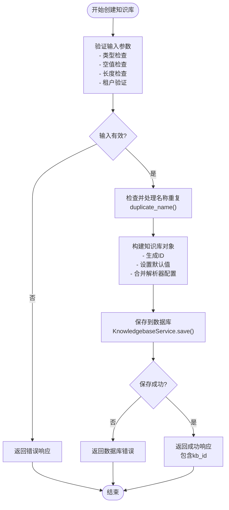

# 知识库创建

<cite>
**本文档中引用的文件**  
- [kb_app.py](file://api/apps/kb_app.py)
- [knowledgebase_service.py](file://api/db/services/knowledgebase_service.py)
- [dataset.py](file://api/apps/sdk/dataset.py)
- [dataset-creating-dialog.tsx](file://web/src/pages/datasets/dataset-creating-dialog.tsx)
- [dataset_example.sh](file://example/http/dataset_example.sh)
- [dataset_example.py](file://example/sdk/dataset_example.py)
</cite>

## 目录
1. [简介](#简介)
2. [API端点实现](#api端点实现)
3. [业务逻辑分析](#业务逻辑分析)
4. [前端用户交互](#前端用户交互)
5. [代码示例](#代码示例)
6. [常见问题与解决方案](#常见问题与解决方案)
7. [结论](#结论)

## 简介
本文档详细介绍了RAGFlow系统中知识库创建功能的实现。知识库（在系统中也称为数据集）是组织和管理文档的核心单元，为后续的检索增强生成（RAG）流程提供数据支持。本文档深入分析了`kb_app.py`中的`create_kb` API端点、`KnowledgebaseService.create_kb`方法的业务逻辑、前端`dataset-creating-dialog.tsx`组件的用户交互流程，并提供了使用Python SDK和直接HTTP请求创建知识库的代码示例，最后讨论了创建过程中可能遇到的常见问题。

## API端点实现

`create_kb` API端点是创建知识库的核心入口，位于`api/apps/kb_app.py`文件中。该端点通过HTTP POST请求暴露，需要用户登录验证。

### 请求参数
该API端点接受以下JSON格式的请求参数：

- **name** (必需): 知识库的名称，类型为字符串。名称不能为空，且长度受`DATASET_NAME_LIMIT`常量限制。
- **description** (可选): 知识库的描述信息，类型为字符串。
- **parser_id** (可选): 用于文档解析的解析器ID。如果未提供，则默认使用"naive"解析器。支持的解析器包括"naive"、"book"、"email"等。
- **permission** (可选): 知识库的权限设置，决定其可见性。可选值为：
  - `"me"`: 仅创建者可见（私有）。
  - `"team"`: 对团队成员共享。
- **avatar** (可选): 知识库的头像，通常为base64编码的图片字符串。
- **language** (可选): 文档的默认语言。
- **embd_id** (可选): 用于向量化文档的嵌入模型ID。如果未指定，将使用租户的默认嵌入模型。
- **parser_config** (可选): 一个JSON对象，用于配置解析器的特定参数，例如分块大小、是否提取目录等。

### 响应格式
创建成功后，API会返回一个JSON响应，其结构如下：

```json
{
  "code": 0,
  "message": "Success",
  "data": {
    "kb_id": "新创建的知识库的唯一ID"
  }
}
```

如果创建失败（例如名称冲突或权限不足），则返回相应的错误代码和消息。

**Section sources**
- [kb_app.py](file://api/apps/kb_app.py#L48-L68)

## 业务逻辑分析

知识库创建的核心业务逻辑由`KnowledgebaseService`类的`create_with_name`方法实现，该方法位于`api/db/services/knowledgebase_service.py`文件中。

### 输入验证
方法首先对输入参数进行严格的验证：
1.  **类型检查**: 确保`name`参数是字符串类型。
2.  **空值检查**: 验证`name`不为空字符串。
3.  **长度检查**: 使用`len(name.encode("utf-8"))`计算字节长度，确保不超过`DATASET_NAME_LIMIT`。
4.  **租户验证**: 通过`TenantService.get_by_id(tenant_id)`检查提供的`tenant_id`是否存在。

### 名称去重
为了避免同一租户下出现重复的知识库名称，系统会调用`duplicate_name`函数。该函数会查询数据库，如果发现同名知识库，则自动在名称后添加序号（如"我的知识库(1)"）以确保唯一性。

### 构建知识库对象
验证通过后，系统会构建一个包含以下关键信息的字典对象：
- **id**: 使用`get_uuid()`生成的全局唯一标识符。
- **name**: 经过去重处理后的知识库名称。
- **tenant_id**: 创建者所属的租户ID。
- **created_by**: 创建者的用户ID（在此场景下与`tenant_id`相同）。
- **parser_id**: 解析器ID，如果未提供则默认为"naive"。
- **parser_config**: 通过`get_parser_config(parser_id, kwargs.get("parser_config"))`函数获取。该函数会合并用户提供的配置和系统为该解析器定义的默认配置，确保配置的完整性和有效性。

### 数据库记录创建
最后，`create_with_name`方法返回一个包含所有必要信息的字典。在`kb_app.py`的`create`端点中，这个字典会被传递给`KnowledgebaseService.save(**res)`方法，该方法负责将其持久化到数据库中，完成知识库的创建。



**Diagram sources**
- [knowledgebase_service.py](file://api/db/services/knowledgebase_service.py#L376-L430)
- [kb_app.py](file://api/apps/kb_app.py#L53-L66)

**Section sources**
- [knowledgebase_service.py](file://api/db/services/knowledgebase_service.py#L376-L430)

## 前端用户交互

前端的用户交互主要通过`dataset-creating-dialog.tsx`组件实现，该组件位于`web/src/pages/datasets/`目录下。这是一个模态对话框，为用户提供了一个直观的表单来创建新的知识库。

### 用户交互流程
1.  **触发**: 用户在知识库列表页面点击"新建知识库"按钮，弹出`dataset-creating-dialog`对话框。
2.  **表单填写**: 用户在对话框中填写知识库的名称、描述，并选择权限（私有或团队共享）。该组件可能还会提供选择解析器和上传头像的选项。
3.  **前端验证**: 在用户提交前，前端会进行初步的验证，例如检查名称是否为空。
4.  **API调用**: 当用户点击"确定"按钮后，前端组件会收集表单数据，并使用`fetch`或`axios`等HTTP客户端库向后端的`/api/v1/datasets`（或`/api/datasets/create`）API端点发起POST请求。
5.  **处理响应**: 
    - 如果API返回成功，对话框关闭，新创建的知识库会出现在列表中。
    - 如果API返回错误（如名称冲突），前端会捕获错误并显示相应的提示信息给用户。

**Section sources**
- [dataset-creating-dialog.tsx](file://web/src/pages/datasets/dataset-creating-dialog.tsx)

## 代码示例

### 使用Python SDK
RAGFlow提供了Python SDK，可以更方便地进行API调用。

```python
from ragflow_sdk import RAGFlow

# 初始化RAGFlow客户端
api_key = "your-api-key"
host_address = "http://localhost:9380"
ragflow_client = RAGFlow(api_key=api_key, base_url=host_address)

# 创建知识库
dataset = ragflow_client.create_dataset(
    name="我的新知识库",
    description="用于存储项目文档",
    permission="team"  # 共享给团队
)

print(f"知识库创建成功，ID: {dataset.id}")
```

### 使用直接HTTP请求
也可以直接使用curl或任何HTTP库发送请求。

```bash
curl --request POST \
     --url http://localhost:9380/api/v1/datasets \
     --header 'Content-Type: application/json' \
     --header 'Authorization: Bearer your-api-key' \
     --data '{
        "name": "我的新知识库",
        "description": "用于存储项目文档",
        "permission": "team"
     }'
```

**Section sources**
- [dataset_example.py](file://example/sdk/dataset_example.py)
- [dataset_example.sh](file://example/http/dataset_example.sh)

## 常见问题与解决方案

### 名称冲突
**问题**: 当尝试创建一个已存在的同名知识库时，API会返回错误。
**解决方案**: 
1.  系统会自动进行名称去重，但用户应尽量使用唯一名称。
2.  前端应在提交前进行名称可用性检查，或在收到错误后提示用户修改名称。

### 权限不足
**问题**: 用户可能没有权限在指定的租户下创建知识库。
**解决方案**: 
1.  确保用户的API密钥具有正确的权限。
2.  检查`tenant_id`是否正确，并且该用户是该租户的成员。

### 数据库连接错误
**问题**: 在`KnowledgebaseService.save()`过程中，如果数据库连接失败或出现其他数据库错误，会导致创建失败。
**解决方案**: 
1.  检查数据库服务是否正常运行。
2.  检查数据库连接配置（如`conf/service_conf.yaml`）是否正确。
3.  查看后端日志以获取更详细的错误信息。

### 嵌入模型不可用
**问题**: 如果指定了一个不存在或未配置的`embd_id`，系统会验证失败。
**解决方案**: 
1.  确保在系统设置中已正确配置所需的嵌入模型。
2.  使用`GET /api/v1/llm/models`等API获取可用的模型列表，并从中选择。

**Section sources**
- [knowledgebase_service.py](file://api/db/services/knowledgebase_service.py#L411-L413)
- [dataset.py](file://api/apps/sdk/dataset.py#L139-L141)

## 结论
RAGFlow的知识库创建功能通过清晰的API设计、严谨的业务逻辑和友好的前端交互，为用户提供了一个可靠的数据管理入口。从API参数的定义到服务层的验证与持久化，再到前端的用户流程，整个过程形成了一个完整的闭环。理解这一流程对于开发者集成系统或用户高效使用平台都至关重要。通过遵循本文档的指导，可以有效避免常见问题，确保知识库的顺利创建。